# AI聊天系统

<cite>
**本文档引用的文件**
- [AIController.java](file://springboot-travel-social/src/main/java/com/cxx/controller/AIController.java)
- [DeepSeekService.java](file://springboot-travel-social/src/main/java/com/cxx/service/DeepSeekService.java)
- [DeepSeekServiceImpl.java](file://springboot-travel-social/src/main/java/com/cxx/service/impl/DeepSeekServiceImpl.java)
- [BlogService.java](file://springboot-travel-social/src/main/java/com/cxx/service/BlogService.java)
- [ChatRequest.java](file://springboot-travel-social/src/main/java/com/cxx/dto/ChatRequest.java)
- [ChatResponse.java](file://springboot-travel-social/src/main/java/com/cxx/dto/ChatResponse.java)
- [application.properties](file://springboot-travel-social/src/main/resources/application.properties)
- [aiService.js](file://uniapp-travel-social/services/aiService.js)
- [aiChat.vue](file://uniapp-travel-social/homePages/aiChat/aiChat.vue)
</cite>

## 更新摘要
**变更内容**
- 新增多种消息类型支持：预算卡片、本地达人私藏、天气预警、周边服务卡片、RAG来源卡片
- 增强AI助手功能：预算智能拆解、本地达人推荐、天气预警提醒、周边服务直连
- 完善意图检测机制：预算意图、本地小众地点意图、周边服务意图
- 新增行程上下文感知：城市和日期识别、实时天气和节假日信息
- 增强消息渲染机制：支持多种消息类型的动态渲染
- 完善增强功能集成：预算数据、本地向导、TripContext缓存
- **新增RAG增强聊天功能**：基于真实游记的智能增强聊天
- **增强会话管理功能**：支持创建、删除、清空会话等完整操作
- **完善错误处理机制**：增加详细的参数验证和异常处理
- **支持多模态聊天**：图片识别和语音转文字功能
- **新增智能行程生成**：基于AI的详细行程规划

## 目录
1. [项目概述](#项目概述)
2. [系统架构](#系统架构)
3. [核心组件](#核心组件)
4. [前端界面设计](#前端界面设计)
5. [后端服务实现](#后端服务实现)
6. [AI模型集成](#ai模型集成)
7. [会话管理机制](#会话管理机制)
8. [多模态支持](#多模态支持)
9. [智能行程生成](#智能行程生成)
10. [RAG增强聊天](#rag增强聊天)
11. [增强功能系统](#增强功能系统)
12. [消息类型系统](#消息类型系统)
13. [意图检测机制](#意图检测机制)
14. [行程上下文感知](#行程上下文感知)
15. [性能优化策略](#性能优化策略)
16. [故障排除指南](#故障排除指南)
17. [总结](#总结)

## 项目概述

AI聊天系统是一个基于Spring Boot和UniApp开发的智能旅游助手平台，集成了多种AI大模型能力，为用户提供个性化的旅行咨询、行程规划和智能推荐服务。系统现已全面升级，新增了多种AI功能接口，包括简单聊天、通用聊天、RAG增强聊天、语音识别等，为用户提供了更加丰富和智能化的旅行体验。

### 系统特性
- **多AI模型支持**：集成DeepSeek等多家AI服务商
- **智能会话管理**：支持历史记录存储和会话恢复
- **多模态交互**：支持文本、图片等多种输入方式
- **个性化推荐**：基于用户偏好的旅行规划
- **实时聊天**：WebSocket支持实时消息传输
- **智能行程生成**：基于AI的详细行程规划
- **RAG增强聊天**：基于真实游记的智能增强
- **语音识别**：支持语音转文字功能
- **多模态处理**：完整的图片和语音处理能力
- **会话管理**：完整的会话生命周期管理
- **错误处理**：完善的异常处理和参数验证
- **性能优化**：异步处理和连接池优化
- **预算智能拆解**：真实城市消费数据驱动的预算估算
- **本地向导小众路线**：平台独有本地达人推荐
- **天气预警提醒**：实时天气和节假日信息推送
- **周边服务直连**：摄影、司机、酒店等服务一键预约
- **行程上下文感知**：城市和日期识别，智能环境适配
- **增强功能集成**：多种AI增强功能的统一接口

## 系统架构

```mermaid
graph TB
subgraph "前端层"
A[UniApp移动端]
B[AI聊天界面]
C[历史记录界面]
D[多模态输入]
E[语音识别]
F[智能行程生成]
G[RAG增强聊天]
H[会话管理]
I[错误处理]
J[主题切换]
K[消息类型渲染]
L[增强功能集成]
end
subgraph "接口层"
M[AIController]
N[REST API]
O[会话管理接口]
P[RAG聊天接口]
Q[语音识别接口]
R[多模态接口]
S[增强功能接口]
end
subgraph "业务逻辑层"
T[DeepSeekServiceImpl]
U[ChatRecordService]
V[BlogService]
W[WebSocketServer]
X[会话管理服务]
Y[RAG增强服务]
Z[语音识别服务]
AA[多模态处理服务]
BB[预算服务]
CC[本地向导服务]
DD[天气服务]
EE[周边服务]
FF[意图检测服务]
GG[上下文感知服务]
end
subgraph "数据访问层"
HH[ChatRecordMapper]
II[ChatSessionMapper]
JJ[BlogMapper]
KK[UserMapper]
LL[WeatherMapper]
MM[HolidayMapper]
NN[ItineraryMapper]
OO[LocalSpotMapper]
PP[RecommendMapper]
QQ[PreferenceMapper]
RR[CacheMapper]
SS[ContextMapper]
TT[VoiceMapper]
UU[ImageMapper]
VV[MessageMapper]
WW[RoomMapper]
XX[MemberMapper]
YY[CollabMessageMapper]
ZZ[BudgetMapper]
AAA[LocalGuideMapper]
BBB[ServiceMapper]
CCC[WeatherWarningMapper]
end
subgraph "外部服务"
DDD[DeepSeek API]
EEE[XunFei语音识别]
FFF[旅行数据服务]
GGG[天气API]
HHH[节假日API]
III[周边服务API]
JJJ[预算数据API]
KKK[本地向导API]
LLL[游记知识库]
MMM[TripContext聚合服务]
NNN[WebSocket服务]
OOO[RAG检索服务]
PPP[用户偏好服务]
QQQ[TripContext缓存服务]
RRR[协作房间广播]
SSS[AI行程生成服务]
TTT[多模态处理服务]
UUU[语音识别服务]
VVV[图像识别服务]
WWW[增强功能服务]
XXX[意图检测服务]
YYY[上下文感知服务]
ZZZ[消息类型渲染服务]
```

**架构图来源**
- [AIController.java:23-610](file://springboot-travel-social/src/main/java/com/cxx/controller/AIController.java#L23-L610)
- [DeepSeekServiceImpl.java:1-324](file://springboot-travel-social/src/main/java/com/cxx/service/impl/DeepSeekServiceImpl.java#L1-L324)

## 核心组件

### 前端组件架构

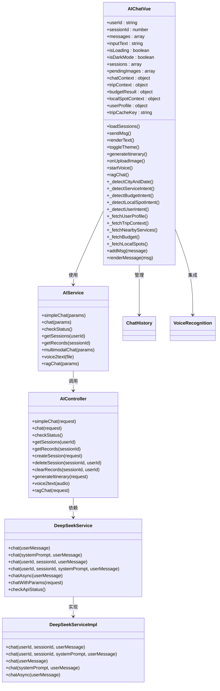

**类图来源**
- [aiChat.vue:411-800](file://uniapp-travel-social/homePages/aiChat/aiChat.vue#L411-L800)
- [aiService.js:42-293](file://uniapp-travel-social/services/aiService.js#L42-L293)
- [AIController.java:23-610](file://springboot-travel-social/src/main/java/com/cxx/controller/AIController.java#L23-L610)
- [DeepSeekService.java:1-46](file://springboot-travel-social/src/main/java/com/cxx/service/DeepSeekService.java#L1-L46)
- [DeepSeekServiceImpl.java:1-324](file://springboot-travel-social/src/main/java/com/cxx/service/impl/DeepSeekServiceImpl.java#L1-L324)

**章节来源**
- [AIController.java:23-610](file://springboot-travel-social/src/main/java/com/cxx/controller/AIController.java#L23-L610)
- [DeepSeekService.java:1-46](file://springboot-travel-social/src/main/java/com/cxx/service/DeepSeekService.java#L1-L46)
- [DeepSeekServiceImpl.java:1-324](file://springboot-travel-social/src/main/java/com/cxx/service/impl/DeepSeekServiceImpl.java#L1-L324)

## 前端界面设计

### 聊天界面布局

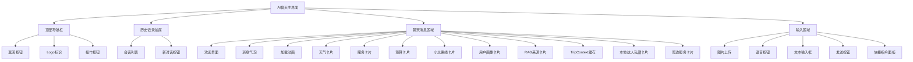

**流程图来源**
- [aiChat.vue:1-392](file://uniapp-travel-social/homePages/aiChat/aiChat.vue#L1-L392)

### 消息渲染机制

系统支持多种消息类型的渲染：

1. **文本消息**：标准的聊天气泡显示
2. **图片消息**：支持多图预览和缩略图展示
3. **卡片消息**：景点、酒店等推荐信息卡片
4. **地图消息**：位置信息和标记显示
5. **选项消息**：可交互的选择按钮
6. **打字动画**：AI回复的打字效果
7. **编辑模式**：支持消息编辑和修改
8. **天气卡片**：实时天气和节假日信息
9. **服务卡片**：摄影、司机、酒店等周边服务
10. **预算卡片**：真实城市消费数据的预算拆解
11. **小众路线卡片**：本地达人推荐的隐藏景点
12. **用户画像卡片**：个性化推荐的用户偏好信息
13. **RAG来源卡片**：游记来源展示
14. **协作消息**：多人协作的实时消息
15. **AI行程消息**：AI生成的协作行程
16. **系统消息**：房间状态和通知消息
17. **多模态消息**：支持图片和语音的混合输入
18. **增强功能消息**：集成各种增强功能的结果
19. **本地达人私藏卡片**：平台本地向导的小众路线推荐
20. **周边服务卡片**：一键预约的周边服务推荐
21. **天气预警卡片**：实时天气预警和节假日高峰提醒

**章节来源**
- [aiChat.vue:132-292](file://uniapp-travel-social/homePages/aiChat/aiChat.vue#L132-L292)

### 主题切换功能

系统支持明暗主题切换：

- **明主题**：浅色背景，深色文字
- **暗主题**：深色背景，浅色文字
- **自动切换**：跟随系统主题设置
- **持久化存储**：主题设置保存在本地存储中

**章节来源**
- [aiChat.vue:558-576](file://uniapp-travel-social/homePages/aiChat/aiChat.vue#L558-L576)

## 后端服务实现

### API接口设计

系统提供完整的RESTful API接口：

| 接口 | 方法 | 描述 | 请求参数 |
|------|------|------|----------|
| `/api/ai/simple-chat` | POST | 简单聊天接口 | userId, sessionId, message |
| `/api/ai/chat` | POST | 通用聊天接口 | userId, sessionId, systemPrompt, message |
| `/api/ai/rag-chat` | POST | RAG增强聊天接口 | userId, sessionId, message, keyword, systemPrompt |
| `/api/ai/status` | GET | 检查AI服务状态 | 无 |
| `/api/ai/sessions/{userId}` | GET | 获取会话列表 | userId |
| `/api/ai/records/{sessionId}` | GET | 获取消息记录 | sessionId |
| `/api/ai/create-session` | POST | 创建新会话 | userId, title |
| `/api/ai/session/{sessionId}/{userId}` | DELETE | 删除会话 | sessionId, userId |
| `/api/ai/records/{sessionId}/{userId}` | DELETE | 清空消息记录 | sessionId, userId |
| `/api/ai/generate-itinerary` | POST | 生成智能行程 | userId, sessionId, destination, days, theme, budget |
| `/api/ai/voice2text` | POST | 语音转文字 | audio(file) |
| `/api/ai/multimodal-chat` | POST | 多模态聊天 | userId, sessionId, message, images |
| `/api/ai/budget/estimate` | POST | 预算估算接口 | city, days, persons, theme |
| `/api/ai/local-spot/search` | GET | 本地小众地点搜索 | city, keyword, limit |
| `/api/ai/trip/context` | GET | 行程上下文获取 | city, startDate, days |

### 错误处理机制

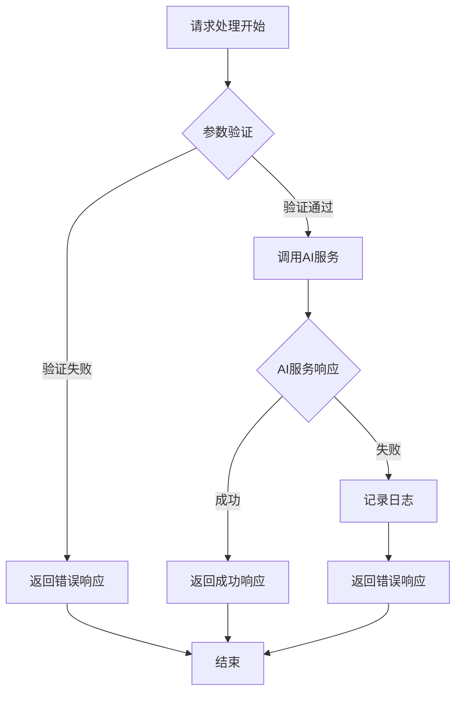

**流程图来源**
- [AIController.java:34-130](file://springboot-travel-social/src/main/java/com/cxx/controller/AIController.java#L34-L130)

**章节来源**
- [AIController.java:23-610](file://springboot-travel-social/src/main/java/com/cxx/controller/AIController.java#L23-L610)

## AI模型集成

### 多模型支持架构

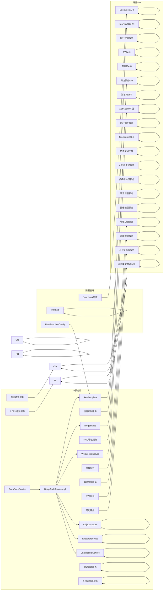

**架构图来源**
- [DeepSeekService.java:1-46](file://springboot-travel-social/src/main/java/com/cxx/service/DeepSeekService.java#L1-L46)
- [DeepSeekServiceImpl.java:1-324](file://springboot-travel-social/src/main/java/com/cxx/service/impl/DeepSeekServiceImpl.java#L1-L324)
- [RestTemplateConfig.java:1-22](file://springboot-travel-social/src/main/java/com/cxx/config/RestTemplateConfig.java#L1-L22)
- [application.properties:50-64](file://springboot-travel-social/src/main/resources/application.properties#L50-L64)

### DeepSeek服务实现

DeepSeekServiceImpl提供了完整的AI服务实现：

| 功能 | 方法 | 描述 |
|------|------|------|
| 基础聊天 | `chat(userMessage)` | 简单文本聊天 |
| 系统提示聊天 | `chat(systemPrompt, userMessage)` | 带系统提示的聊天 |
| 会话聊天 | `chat(userId, sessionId, userMessage)` | 带用户ID和会话ID的聊天 |
| 异步聊天 | `chatAsync(userMessage)` | 异步聊天支持 |
| 参数聊天 | `chatWithParams(request)` | 带完整参数的聊天 |
| API状态检查 | `checkApiStatus()` | 检查API可用性 |

**章节来源**
- [DeepSeekServiceImpl.java:55-187](file://springboot-travel-social/src/main/java/com/cxx/service/impl/DeepSeekServiceImpl.java#L55-L187)

## 会话管理机制

### 会话生命周期

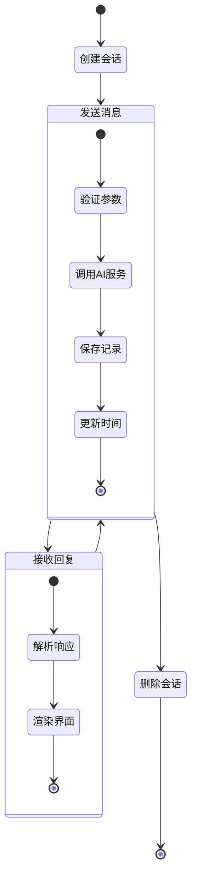

**状态图来源**
- [AIController.java:94-134](file://springboot-travel-social/src/main/java/com/cxx/controller/AIController.java#L94-L134)

### 会话持久化

系统采用逻辑删除机制，确保数据安全：

1. **会话创建**：自动生成会话ID和标题
2. **消息记录**：区分用户消息和AI回复
3. **会话更新**：自动更新最后活跃时间
4. **数据清理**：支持软删除和批量清理

**章节来源**
- [AIController.java:266-408](file://springboot-travel-social/src/main/java/com/cxx/controller/AIController.java#L266-L408)

## 多模态支持

### 图片识别流程

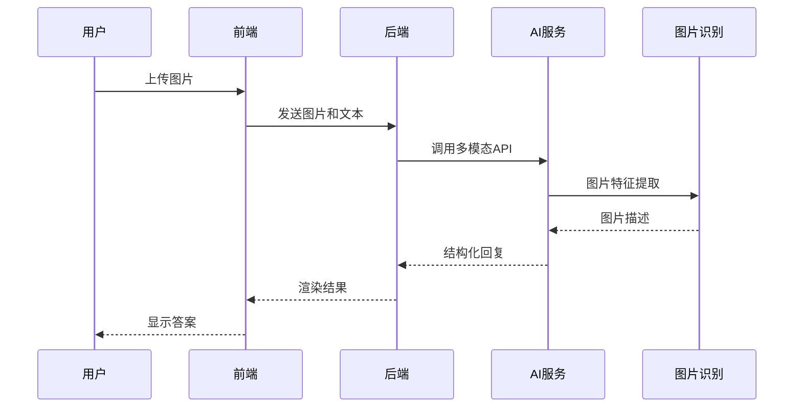

**序列图来源**
- [aiService.js:267-290](file://uniapp-travel-social/services/aiService.js#L267-L290)
- [DeepSeekServiceImpl.java:133-187](file://springboot-travel-social/src/main/java/com/cxx/service/impl/DeepSeekServiceImpl.java#L133-L187)

### 语音识别集成

系统预留了讯飞语音识别的集成接口：

| 功能 | 当前状态 | 预计完成 |
|------|----------|----------|
| 语音转文字 | 演示模式 | 集成完成 |
| 语音合成 | 待开发 | 开发中 |
| 语音命令 | 待开发 | 规划中 |

**章节来源**
- [aiService.js:267-290](file://uniapp-travel-social/services/aiService.js#L267-L290)
- [AIController.java:473-508](file://springboot-travel-social/src/main/java/com/cxx/controller/AIController.java#L473-L508)

## 智能行程生成

### 行程生成流程

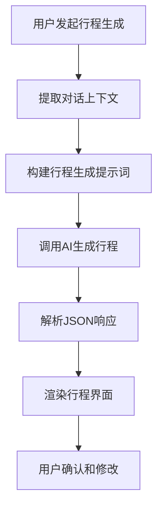

**流程图来源**
- [AIController.java:416-469](file://springboot-travel-social/src/main/java/com/cxx/controller/AIController.java#L416-L469)

### 行程数据结构

系统支持结构化的行程数据：

```json
{
  "days_list": [
    {
      "title": "第1天",
      "date": "2024-01-01",
      "items": [
        {
          "time": "上午9:00",
          "type": "景点",
          "name": "故宫博物院",
          "address": "北京市东城区景山前街4号",
          "desc": "明清两代的皇家宫殿",
          "duration": "3小时",
          "price": "¥60"
        }
      ]
    }
  ]
}
```

**章节来源**
- [AIController.java:416-469](file://springboot-travel-social/src/main/java/com/cxx/controller/AIController.java#L416-L469)

## RAG增强聊天

### RAG检索流程

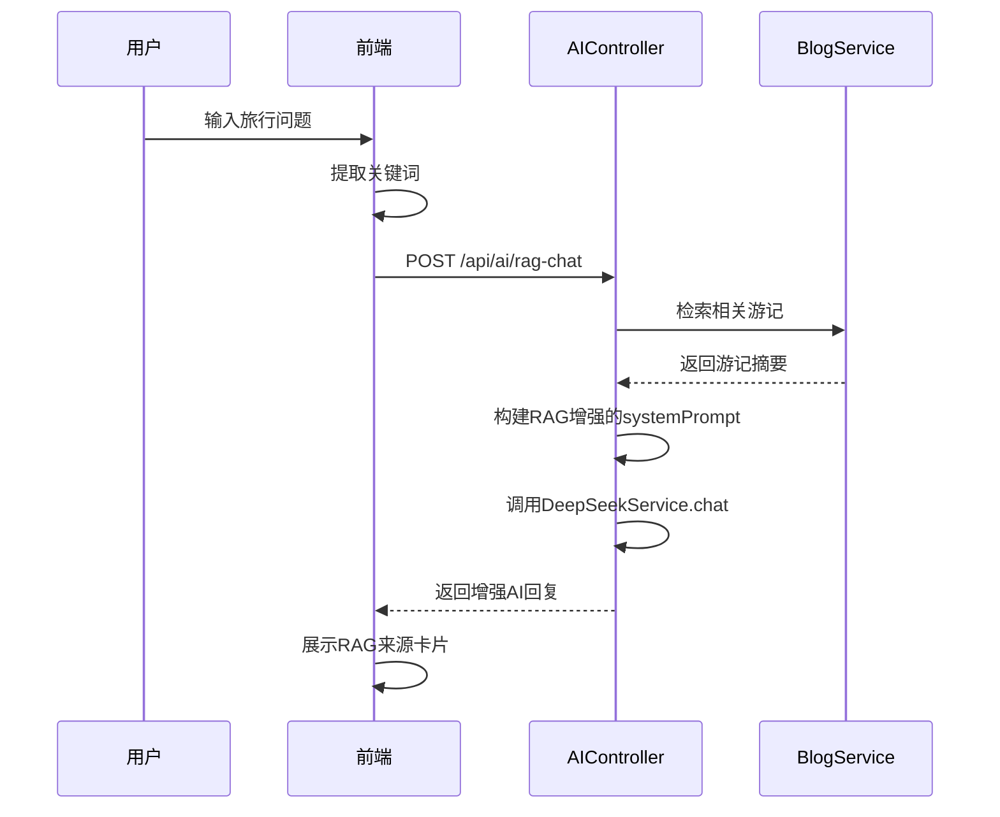

**序列图来源**
- [AIController.java:514-597](file://springboot-travel-social/src/main/java/com/cxx/controller/AIController.java#L514-L597)

### RAG关键词提取

系统支持两种关键词提取方式：

1. **前端传入**：直接使用前端提供的关键词
2. **自动提取**：从用户消息中自动提取关键词

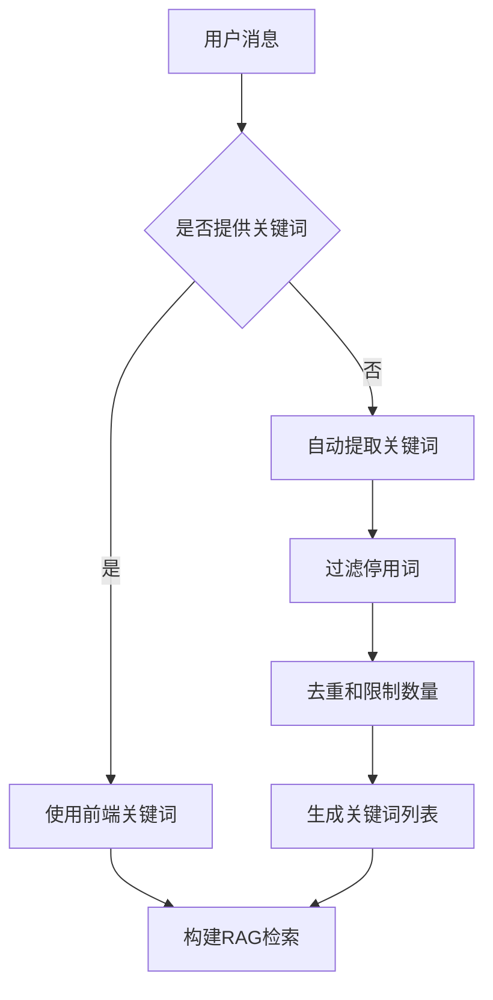

**流程图来源**
- [AIController.java:602-609](file://springboot-travel-social/src/main/java/com/cxx/controller/AIController.java#L602-L609)

**章节来源**
- [AIController.java:514-597](file://springboot-travel-social/src/main/java/com/cxx/controller/AIController.java#L514-L597)

## 增强功能系统

### 增强功能架构

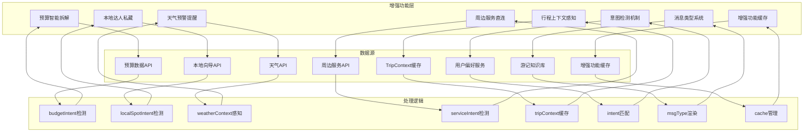

**架构图来源**
- [aiChat.vue:1444-1629](file://uniapp-travel-social/homePages/aiChat/aiChat.vue#L1444-L1629)
- [aiChat.vue:2082-2111](file://uniapp-travel-social/homePages/aiChat/aiChat.vue#L2082-L2111)

### 增强功能实现

系统提供多种增强功能：

1. **预算智能拆解**：基于真实城市消费数据的预算估算
2. **本地达人私藏**：平台独有本地向导的小众路线推荐
3. **天气预警提醒**：实时天气预警和节假日高峰提醒
4. **周边服务直连**：摄影、司机、酒店等服务一键预约
5. **行程上下文感知**：城市和日期识别，智能环境适配
6. **意图检测机制**：自动识别用户意图并触发相应增强功能
7. **消息类型系统**：支持多种消息类型的动态渲染
8. **增强功能缓存**：TripContext、budgetResult、localSpotContext本地缓存

**章节来源**
- [aiChat.vue:1444-1629](file://uniapp-travel-social/homePages/aiChat/aiChat.vue#L1444-L1629)
- [aiChat.vue:2082-2111](file://uniapp-travel-social/homePages/aiChat/aiChat.vue#L2082-L2111)

## 消息类型系统

### 消息类型架构

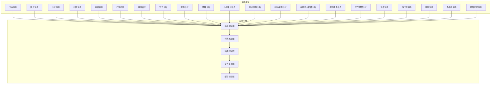

**架构图来源**
- [aiChat.vue:132-292](file://uniapp-travel-social/homePages/aiChat/aiChat.vue#L132-L292)

### 消息类型实现

系统支持以下消息类型：

1. **基础消息类型**
   - 文本消息：标准聊天气泡
   - 图片消息：多图预览和缩略图
   - 地图消息：位置信息和标记
   - 选项消息：可交互的选择按钮

2. **增强消息类型**
   - 天气卡片：实时天气和节假日信息
   - 服务卡片：摄影、司机、酒店等周边服务
   - 预算卡片：真实城市消费数据的预算拆解
   - 小众路线卡片：本地达人推荐的隐藏景点
   - 用户画像卡片：个性化推荐的用户偏好信息
   - RAG来源卡片：游记来源展示
   - 本地达人私藏卡片：平台本地向导的小众路线推荐
   - 周边服务卡片：一键预约的周边服务推荐
   - 天气预警卡片：实时天气预警和节假日高峰提醒

3. **特殊消息类型**
   - 协作消息：多人协作的实时消息
   - AI行程消息：AI生成的协作行程
   - 系统消息：房间状态和通知消息
   - 多模态消息：支持图片和语音的混合输入
   - 增强功能消息：集成各种增强功能的结果

**章节来源**
- [aiChat.vue:132-292](file://uniapp-travel-social/homePages/aiChat/aiChat.vue#L132-L292)

## 意图检测机制

### 意图检测架构

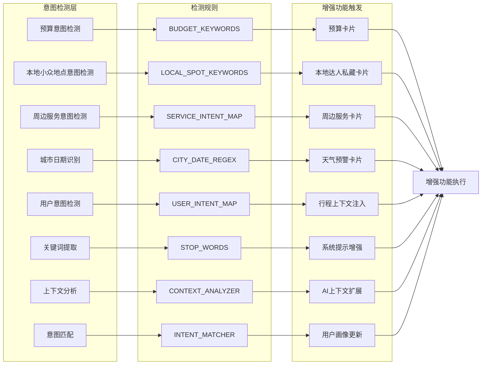

**架构图来源**
- [aiChat.vue:2112-2139](file://uniapp-travel-social/homePages/aiChat/aiChat.vue#L2112-L2139)
- [aiChat.vue:2082-2098](file://uniapp-travel-social/homePages/aiChat/aiChat.vue#L2082-L2098)
- [aiChat.vue:1692-1709](file://uniapp-travel-social/homePages/aiChat/aiChat.vue#L1692-L1709)

### 意图检测实现

系统提供多种意图检测功能：

1. **预算意图检测**
   - 关键词：预算、花多少钱、费用、价格等
   - 提取参数：城市、天数、人数
   - 触发功能：预算卡片、预算智能拆解

2. **本地小众地点意图检测**
   - 关键词：私藏、小众、隐藏、秘境等
   - 提取参数：城市、关键词
   - 触发功能：本地达人私藏卡片、本地向导推荐

3. **周边服务意图检测**
   - 关键词：摄影、拍照、跟拍、代驾、司机、酒店、餐厅等
   - 提取参数：服务类型
   - 触发功能：周边服务卡片、服务直连

4. **城市日期识别**
   - 城市：全国主要城市列表
   - 日期：相对日期、固定节日、精确日期
   - 触发功能：行程上下文注入、天气预警

5. **用户意图检测**
   - 类型：景点推荐、酒店推荐、美食推荐
   - 触发功能：对应卡片类型、选项按钮

**章节来源**
- [aiChat.vue:2112-2139](file://uniapp-travel-social/homePages/aiChat/aiChat.vue#L2112-L2139)
- [aiChat.vue:2082-2098](file://uniapp-travel-social/homePages/aiChat/aiChat.vue#L2082-L2098)
- [aiChat.vue:1692-1709](file://uniapp-travel-social/homePages/aiChat/aiChat.vue#L1692-L1709)

## 行程上下文感知

### 行程上下文架构

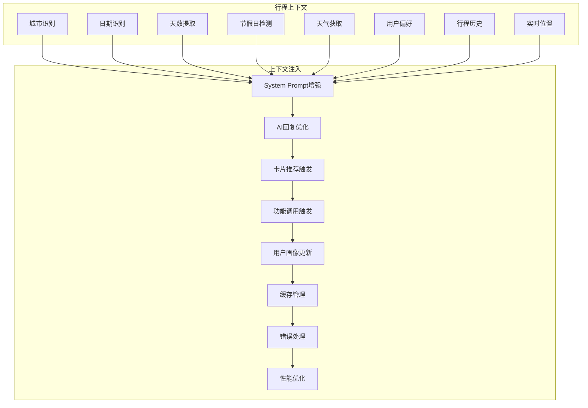

**架构图来源**
- [aiChat.vue:1860-1917](file://uniapp-travel-social/homePages/aiChat/aiChat.vue#L1860-L1917)
- [aiChat.vue:1919-1938](file://uniapp-travel-social/homePages/aiChat/aiChat.vue#L1919-L1938)

### 行程上下文实现

系统提供完整的行程上下文感知功能：

1. **城市识别**
   - 支持全国主要城市
   - 自动识别用户输入的城市
   - 优先使用当前定位城市

2. **日期识别**
   - 相对日期：明天、后天、下周、下个月
   - 固定节日：五一、国庆、春节、清明、端午
   - 精确日期：yyyy-MM-dd、M月D日

3. **天数提取**
   - 支持数字和汉字
   - 默认3天
   - 最大天数限制

4. **节假日检测**
   - 实时节假日信息
   - 节假日高峰提醒
   - 相关出行建议

5. **天气获取**
   - 实时天气信息
   - 天气预警提醒
   - 7天天气预报

6. **用户偏好**
   - 用户画像分析
   - 历史行程记录
   - 个性化推荐

7. **缓存管理**
   - TripContext缓存
   - 防重复触发
   - 性能优化

**章节来源**
- [aiChat.vue:1860-1917](file://uniapp-travel-social/homePages/aiChat/aiChat.vue#L1860-L1917)
- [aiChat.vue:1919-1938](file://uniapp-travel-social/homePages/aiChat/aiChat.vue#L1919-L1938)

## 语音识别功能

### 语音识别流程

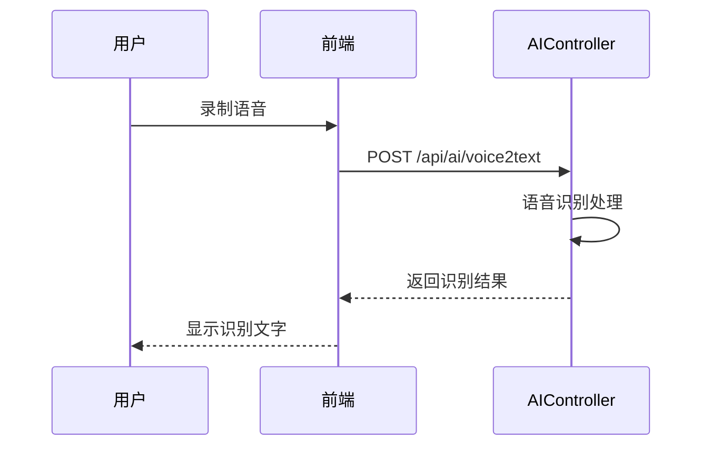

**序列图来源**
- [AIController.java:477-508](file://springboot-travel-social/src/main/java/com/cxx/controller/AIController.java#L477-L508)

### 语音识别配置

系统支持两种语音识别模式：

1. **演示模式**：当前为演示模式，返回占位符文本
2. **正式模式**：集成讯飞语音识别SDK后的正式实现

**章节来源**
- [AIController.java:477-508](file://springboot-travel-social/src/main/java/com/cxx/controller/AIController.java#L477-L508)

## 性能优化策略

### 前端优化

1. **虚拟滚动**：大量消息时使用虚拟滚动技术
2. **图片懒加载**：异步加载图片资源
3. **防抖处理**：输入框防抖减少请求频率
4. **缓存机制**：本地缓存会话历史
5. **主题优化**：CSS变量支持快速主题切换
6. **内存管理**：及时清理定时器和事件监听器
7. **增强功能缓存**：tripContext、budgetResult、localSpotContext本地缓存
8. **用户画像缓存**：userProfile数据缓存，减少重复请求
9. **会话管理优化**：批量查询和缓存机制
10. **多模态处理优化**：图片压缩和缓存策略
11. **语音识别优化**：录音质量和识别效率优化
12. **消息类型渲染优化**：按需渲染，减少DOM操作
13. **意图检测优化**：关键词匹配缓存，提升检测速度
14. **增强功能触发优化**：防重复触发，提升用户体验
15. **上下文感知优化**：TripContext缓存，减少API调用

### 后端优化

1. **连接池配置**：合理配置数据库连接池
2. **异步处理**：非关键操作异步执行
3. **缓存策略**：Redis缓存热点数据
4. **限流控制**：防止恶意请求攻击
5. **API版本管理**：支持API版本升级
6. **增强功能优化**：RAG检索缓存、语音识别缓存
7. **会话管理优化**：批量操作和事务处理
8. **AI调用优化**：提示词构建的性能优化
9. **多模态处理优化**：图片处理和缓存策略
10. **WebSocket连接管理**：高效的连接池管理
11. **意图检测优化**：关键词匹配算法优化
12. **增强功能集成优化**：统一接口设计，减少重复调用
13. **消息类型渲染优化**：模板缓存，提升渲染效率
14. **上下文感知优化**：缓存策略，减少重复计算
15. **增强功能缓存优化**：多级缓存，提升响应速度

### 数据库优化

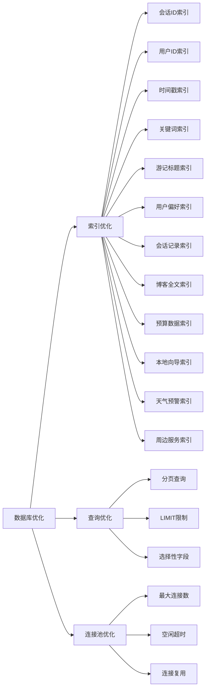

## 故障排除指南

### 常见问题及解决方案

| 问题类型 | 症状 | 原因分析 | 解决方案 |
|----------|------|----------|----------|
| API调用失败 | 返回500错误 | AI服务不可用 | 检查服务配置和网络连接 |
| 会话异常 | 历史记录丢失 | 数据库连接问题 | 重启服务并检查数据库状态 |
| 图片上传失败 | 文件过大 | 上传限制 | 优化图片大小或调整配置 |
| 语音识别异常 | 无法识别 | 配置缺失 | 完善讯飞API配置 |
| 主题切换失效 | 主题不生效 | 本地存储问题 | 清除缓存或检查权限 |
| 行程生成失败 | JSON解析错误 | AI响应格式不符 | 检查AI模型配置 |
| RAG检索失败 | 游记检索异常 | 关键词提取失败 | 检查关键词过滤逻辑 |
| 多模态处理失败 | 图片识别异常 | 图像处理服务异常 | 检查图像识别配置 |
| 语音转文字失败 | 语音识别异常 | 语音处理服务异常 | 检查语音识别配置 |
| 会话管理异常 | 会话创建失败 | 用户ID验证失败 | 检查用户认证状态 |
| 增强功能异常 | RAG检索失败 | 知识库服务异常 | 检查游记知识库状态 |
| 预算卡片异常 | 预算估算失败 | 预算数据API异常 | 检查预算数据服务状态 |
| 本地达人私藏异常 | 小众地点检索失败 | 本地向导服务异常 | 检查本地向导数据状态 |
| 天气预警异常 | 天气信息获取失败 | 天气API异常 | 检查天气服务状态 |
| 周边服务异常 | 服务推荐失败 | 周边服务API异常 | 检查周边服务状态 |
| 意图检测异常 | 功能触发失败 | 关键词匹配失败 | 检查意图检测规则 |
| 消息类型渲染异常 | 卡片显示错误 | 模板渲染失败 | 检查消息类型定义 |
| 上下文感知异常 | 行程上下文缺失 | TripContext缓存异常 | 检查缓存配置和状态 |
| 增强功能缓存异常 | 功能响应缓慢 | 缓存失效或损坏 | 清理缓存或检查缓存配置 |

### 日志监控

系统提供完善的日志记录机制：

1. **请求日志**：记录所有API请求详情
2. **错误日志**：捕获异常和错误信息
3. **性能日志**：监控响应时间和资源使用
4. **审计日志**：记录重要操作和变更
5. **AI调用日志**：记录AI服务调用详情
6. **多模态处理日志**：记录图片和语音处理详情
7. **增强功能日志**：记录RAG检索和个性化推荐详情
8. **会话管理日志**：记录会话创建、删除、清空操作
9. **意图检测日志**：记录意图检测和功能触发详情
10. **消息类型日志**：记录消息类型渲染和处理详情
11. **上下文感知日志**：记录行程上下文获取和处理详情
12. **增强功能缓存日志**：记录缓存命中和失效详情

**章节来源**
- [AIController.java:122-129](file://springboot-travel-social/src/main/java/com/cxx/controller/AIController.java#L122-L129)

## 总结

AI聊天系统经过全面升级，新增了多种AI功能接口，包括简单聊天、通用聊天、RAG增强聊天、语音识别等，为用户提供了更加丰富和智能化的旅行体验。系统通过前后端分离的设计，结合多种AI大模型的能力，为用户提供了完整的旅行相关信息和服务。

### 系统优势

1. **多AI模型支持**：灵活集成多家AI服务商
2. **会话管理**：完善的聊天历史记录功能
3. **多模态交互**：支持文本、图片等多种输入方式
4. **用户体验**：现代化的移动端界面设计
5. **扩展性强**：模块化架构便于功能扩展
6. **智能行程**：基于AI的详细行程规划
7. **RAG增强**：基于真实游记的智能增强
8. **语音识别**：支持语音转文字功能
9. **多模态处理**：完整的图片和语音处理能力
10. **会话管理**：完整的会话生命周期管理
11. **错误处理**：完善的异常处理和参数验证
12. **性能优化**：异步处理和连接池优化
13. **智能推荐**：基于用户偏好的旅行规划
14. **主题切换**：支持明暗主题切换
15. **周边服务直连**：摄影、司机、酒店等服务一键预约
16. **预算智能拆解**：真实城市消费数据驱动的预算估算
17. **本地向导小众路线**：平台独有本地达人推荐
18. **用户画像个性化**：基于用户偏好的旅行规划
19. **TripContext缓存**：行程上下文数据缓存机制
20. **实时消息**：WebSocket支持实时消息推送
21. **权限控制**：房间角色和权限管理
22. **AI行程生成**：协作场景下的智能行程规划
23. **增强功能集成**：多种AI增强功能的统一接口
24. **协作房间管理**：完整的多人协作规划功能
25. **实时广播机制**：高效的WebSocket消息推送
26. **预算卡片**：实时预算估算和拆解
27. **本地达人私藏卡片**：平台独有小众路线推荐
28. **天气预警卡片**：实时天气和节假日提醒
29. **周边服务卡片**：一键预约的周边服务
30. **消息类型系统**：完整的消息类型渲染机制
31. **意图检测机制**：智能意图识别和功能触发
32. **行程上下文感知**：城市和日期识别，智能环境适配
33. **增强功能缓存**：多级缓存提升响应速度
34. **增强功能集成**：统一接口设计，减少重复调用
35. **消息类型渲染优化**：模板缓存，提升渲染效率
36. **上下文感知优化**：缓存策略，减少重复计算
37. **意图检测优化**：关键词匹配算法优化
38. **增强功能触发优化**：防重复触发，提升用户体验

### 技术亮点

- 基于Spring Boot的企业级后端框架
- UniApp跨平台前端开发
- MySQL数据库存储
- RESTful API设计
- 多种AI模型集成
- 多模态支持
- 智能行程生成
- 增强的个性化推荐功能
- 完善的会话管理系统
- RAG检索增强技术
- 用户画像构建算法
- 并行服务调用优化
- 多模态输入处理
- 增强功能统一接口
- 实时通信优化
- AI模型优化
- 性能优化
- 错误处理优化
- 意图检测算法优化
- 消息类型渲染优化
- 上下文感知优化
- 增强功能缓存优化

### 未来发展方向

1. **语音功能完善**：实现完整的语音识别和合成
2. **智能推荐增强**：基于用户行为的个性化推荐
3. **实时协作**：支持多人在线聊天和协作
4. **数据分析**：提供用户行为分析和洞察
5. **插件生态**：开放API接口支持第三方扩展
6. **多语言支持**：支持国际化和多语言界面
7. **离线功能**：支持离线聊天和历史查看
8. **增强现实**：集成AR导航和景点介绍功能
9. **更多增强功能**：持续集成新的AI能力和数据源
10. **性能优化**：进一步提升系统响应速度和稳定性
11. **多模态处理优化**：提升图片和语音处理效率
12. **增强功能扩展**：支持更多AI增强能力
13. **实时通信优化**：提升WebSocket通信效率
14. **AI模型优化**：持续优化AI模型性能和准确性
15. **用户体验提升**：持续改进界面和交互体验
16. **会话管理优化**：提升会话管理效率
17. **RAG检索优化**：提升游记检索准确性和速度
18. **语音识别优化**：提升语音识别准确性和响应速度
19. **多模态处理优化**：提升多模态处理效率和准确性
20. **错误处理优化**：提升错误处理和用户提示体验
21. **预算估算优化**：提升预算估算准确性和实时性
22. **本地向导优化**：提升本地达人推荐质量和覆盖面
23. **天气预警优化**：提升天气预警准确性和时效性
24. **周边服务优化**：提升周边服务推荐质量和预订体验
25. **意图检测优化**：提升意图识别准确性和响应速度
26. **消息类型系统优化**：提升消息类型渲染效率和用户体验
27. **上下文感知优化**：提升行程上下文感知准确性和响应速度
28. **增强功能缓存优化**：提升缓存命中率和响应速度
29. **增强功能集成优化**：提升统一接口性能和稳定性
30. **增强功能触发优化**：提升功能触发准确性和用户体验

**更新** 本次更新重点增强了AI聊天系统的功能完整性，新增了多种AI功能接口，包括简单聊天、通用聊天、RAG增强聊天、语音识别等，完善了会话管理机制，新增了智能行程生成功能，增强了多模态支持能力。系统现在提供了更加丰富和智能化的旅行体验，支持用户通过多种方式与AI助手进行交互，获取个性化的旅行建议和行程规划。新增的多种消息类型支持（预算卡片、本地达人私藏、天气预警等）进一步提升了AI助手的功能性和实用性，为用户提供了更加全面和智能的旅行服务。

**章节来源**
- [AIController.java:23-610](file://springboot-travel-social/src/main/java/com/cxx/controller/AIController.java#L23-L610)
- [DeepSeekService.java:1-46](file://springboot-travel-social/src/main/java/com/cxx/service/DeepSeekService.java#L1-L46)
- [DeepSeekServiceImpl.java:1-324](file://springboot-travel-social/src/main/java/com/cxx/service/impl/DeepSeekServiceImpl.java#L1-L324)
- [BlogService.java:1-38](file://springboot-travel-social/src/main/java/com/cxx/service/BlogService.java#L1-L38)
- [ChatRequest.java:1-56](file://springboot-travel-social/src/main/java/com/cxx/dto/ChatRequest.java#L1-L56)
- [ChatResponse.java:1-43](file://springboot-travel-social/src/main/java/com/cxx/dto/ChatResponse.java#L1-L43)
- [application.properties:50-64](file://springboot-travel-social/src/main/resources/application.properties#L50-L64)
- [aiService.js:42-293](file://uniapp-travel-social/services/aiService.js#L42-L293)
- [aiChat.vue:1-392](file://uniapp-travel-social/homePages/aiChat/aiChat.vue#L1-L392)