# API接口文档

<cite>
**本文档引用的文件**
- [TravelSocialApplication.java](file://springboot-travel-social/src/main/java/com/cxx/TravelSocialApplication.java)
- [application.properties](file://springboot-travel-social/src/main/resources/application.properties)
- [pom.xml](file://springboot-travel-social/pom.xml)
- [UserController.java](file://springboot-travel-social/src/main/java/com/cxx/controller/UserController.java)
- [BlogController.java](file://springboot-travel-social/src/main/java/com/cxx/controller/BlogController.java)
- [ScenicController.java](file://springboot-travel-social/src/main/java/com/cxx/controller/ScenicController.java)
- [HotelController.java](file://springboot-travel-social/src/main/java/com/cxx/controller/HotelController.java)
- [FoodController.java](file://springboot-travel-social/src/main/java/com/cxx/controller/FoodController.java)
- [RouteController.java](file://springboot-travel-social/src/main/java/com/cxx/controller/RouteController.java)
- [OrderController.java](file://springboot-travel-social/src/main/java/com/cxx/controller/OrderController.java)
- [CartController.java](file://springboot-travel-social/src/main/java/com/cxx/controller/CartController.java)
- [CommentsController.java](file://springboot-travel-social/src/main/java/com/cxx/controller/CommentsController.java)
- [WalletController.java](file://springboot-travel-social/src/main/java/com/cxx/controller/WalletController.java)
- [ItineraryCollabController.java](file://springboot-travel-social/src/main/java/com/cxx/controller/ItineraryCollabController.java)
- [UserPreferenceController.java](file://springboot-travel-social/src/main/java/com/cxx/controller/UserPreferenceController.java)
- [HolidayController.java](file://springboot-travel-social/src/main/java/com/cxx/controller/HolidayController.java)
- [TripContextController.java](file://springboot-travel-social/src/main/java/com/cxx/controller/TripContextController.java)
- [RecommendController.java](file://springboot-travel-social/src/main/java/com/cxx/controller/RecommendController.java)
- [BudgetController.java](file://springboot-travel-social/src/main/java/com/cxx/controller/BudgetController.java)
- [BigModelController.java](file://springboot-travel-social/src/main/java/com/cxx/controller/BigModelController.java)
- [AIController.java](file://springboot-travel-social/src/main/java/com/cxx/controller/AIController.java)
- [LocalSpotController.java](file://springboot-travel-social/src/main/java/com/cxx/controller/LocalSpotController.java)
- [ItineraryCollabRoom.java](file://springboot-travel-social/src/main/java/com/cxx/entity/ItineraryCollabRoom.java)
- [ItineraryCollabMember.java](file://springboot-travel-social/src/main/java/com/cxx/entity/ItineraryCollabMember.java)
- [ItineraryCollabMessage.java](file://springboot-travel-social/src/main/java/com/cxx/entity/ItineraryCollabMessage.java)
- [LocalSpot.java](file://springboot-travel-social/src/main/java/com/cxx/entity/LocalSpot.java)
- [UserPreference.java](file://springboot-travel-social/src/main/java/com/cxx/entity/UserPreference.java)
- [HolidayConfig.java](file://springboot-travel-social/src/main/java/com/cxx/entity/HolidayConfig.java)
- [ItineraryCollabService.java](file://springboot-travel-social/src/main/java/com/cxx/service/ItineraryCollabService.java)
- [LocalSpotService.java](file://springboot-travel-social/src/main/java/com/cxx/service/LocalSpotService.java)
- [BudgetService.java](file://springboot-travel-social/src/main/java/com/cxx/service/BudgetService.java)
- [UserPreferenceService.java](file://springboot-travel-social/src/main/java/com/cxx/service/UserPreferenceService.java)
- [RecommendService.java](file://springboot-travel-social/src/main/java/com/cxx/service/RecommendService.java)
- [DeepSeekService.java](file://springboot-travel-social/src/main/java/com/cxx/service/DeepSeekService.java)
- [itinerary_collab.sql](file://springboot-travel-social/src/main/resources/sql/itinerary_collab.sql)
- [local_spot.sql](file://springboot-travel-social/src/main/resources/sql/local_spot.sql)
- [budget.sql](file://springboot-travel-social/src/main/resources/sql/budget.sql)
- [SwaggerConfig.java](file://springboot-travel-social/src/main/java/com/cxx/config/SwaggerConfig.java)
- [JwtUtil.java](file://springboot-travel-social/src/main/java/com/cxx/utils/JwtUtil.java)
- [R.java](file://springboot-travel-social/src/main/java/com/cxx/entity/R.java)
- [CorsFilter.java](file://springboot-travel-social/src/main/java/com/cxx/config/CorsFilter.java)
</cite>

## 更新摘要
**变更内容**
- 新增预算管理模块接口文档，支持旅行预算智能拆解和费用计算
- 新增本地景点模块接口文档，提供小众地点检索和本地向导认证功能
- 新增AI聊天模块接口文档，包含简单聊天、通用聊天、RAG增强聊天、行程生成等高级功能
- 新增大模型测试接口，支持快速验证AI服务能力
- 新增行程协作模块接口文档，包含房间创建、成员管理、消息协作、AI生成等功能
- 新增用户偏好模块接口文档，支持旅行偏好快照管理和AI摘要生成功能
- 新增节假日配置模块接口文档，提供节假日查询和出行建议功能
- 新增行程上下文聚合接口，整合天气、节假日和AI摘要信息
- 新增AI推荐模块接口文档，包含基于协同过滤的游记推荐和周边服务推荐
- 更新控制器层接口说明和参数描述，完善API文档的完整性和准确性

## 目录
1. [简介](#简介)
2. [项目结构](#项目结构)
3. [核心组件](#核心组件)
4. [架构概览](#架构概览)
5. [详细组件分析](#详细组件分析)
6. [新增模块接口](#新增模块接口)
7. [依赖分析](#依赖分析)
8. [性能考虑](#性能考虑)
9. [故障排除指南](#故障排除指南)
10. [结论](#结论)

## 简介

这是一个基于Spring Boot开发的旅游攻略社交小程序后端API接口文档。系统采用前后端分离架构，提供完整的旅游相关服务，包括用户管理、游记分享、景点查询、酒店预订、美食推荐、路线规划、订单管理、购物车功能、钱包服务以及新增的预算管理、本地景点、行程协作、用户偏好、节假日配置、AI推荐、AI聊天等高级功能模块。

## 项目结构

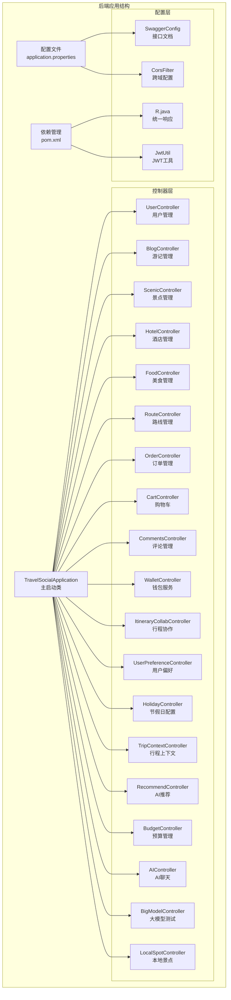

**图表来源**
- [TravelSocialApplication.java:1-54](file://springboot-travel-social/src/main/java/com/cxx/TravelSocialApplication.java#L1-L54)
- [application.properties:1-64](file://springboot-travel-social/src/main/resources/application.properties#L1-L64)
- [pom.xml:1-243](file://springboot-travel-social/pom.xml#L1-L243)

**章节来源**
- [TravelSocialApplication.java:1-54](file://springboot-travel-social/src/main/java/com/cxx/TravelSocialApplication.java#L1-L54)
- [application.properties:1-64](file://springboot-travel-social/src/main/resources/application.properties#L1-L64)
- [pom.xml:1-243](file://springboot-travel-social/pom.xml#L1-L243)

## 核心组件

### 统一响应机制
系统采用统一的响应格式，所有API接口都返回标准化的数据结构：

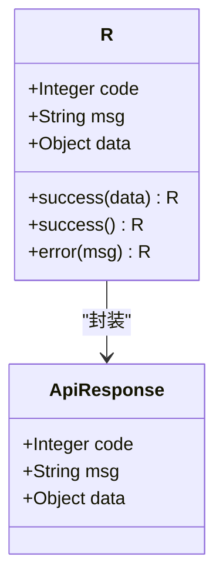

**图表来源**
- [R.java:1-32](file://springboot-travel-social/src/main/java/com/cxx/entity/R.java#L1-L32)

### JWT认证机制
系统使用JWT进行用户身份验证和授权管理：

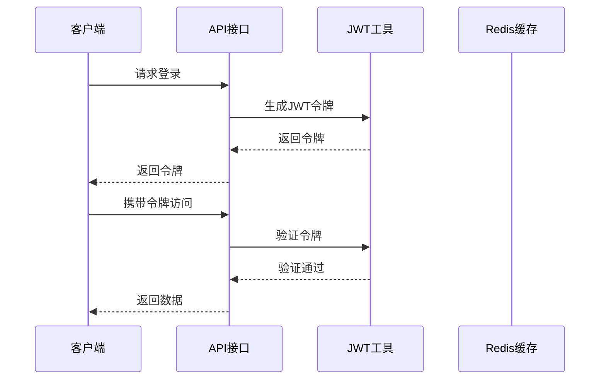

**图表来源**
- [JwtUtil.java:1-19](file://springboot-travel-social/src/main/java/com/cxx/utils/JwtUtil.java#L1-L19)

**章节来源**
- [R.java:1-32](file://springboot-travel-social/src/main/java/com/cxx/entity/R.java#L1-L32)
- [JwtUtil.java:1-19](file://springboot-travel-social/src/main/java/com/cxx/utils/JwtUtil.java#L1-L19)

## 架构概览

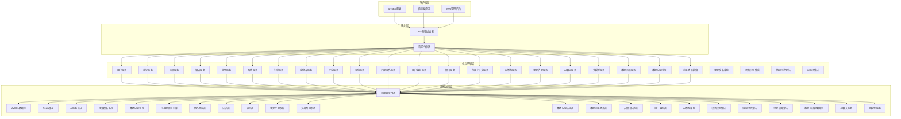

**图表来源**
- [CorsFilter.java:1-28](file://springboot-travel-social/src/main/java/com/cxx/config/CorsFilter.java#L1-L28)
- [SwaggerConfig.java:1-79](file://springboot-travel-social/src/main/java/com/cxx/config/SwaggerConfig.java#L1-L79)

## 详细组件分析

### 用户管理模块

#### 用户认证接口
用户管理模块提供完整的用户认证和管理功能：

| 接口 | 方法 | 路径 | 功能描述 |
|------|------|------|----------|
| 发送验证码 | POST | `/user/sendMsg` | 发送邮箱验证码 |
| 邮箱登录 | POST | `/user/login` | 邮箱快捷登录 |
| 账号密码登录 | POST | `/user/login/email` | 账号密码登录 |
| 查询用户 | GET | `/user/queryUserById` | 根据ID查询用户 |
| 更新用户名 | PUT | `/user/updateUsername` | 更新用户昵称 |
| 更新密码 | PUT | `/user/updatePassword` | 修改用户密码 |
| 更新头像 | PUT | `/user/updateAvatar` | 更新用户头像 |

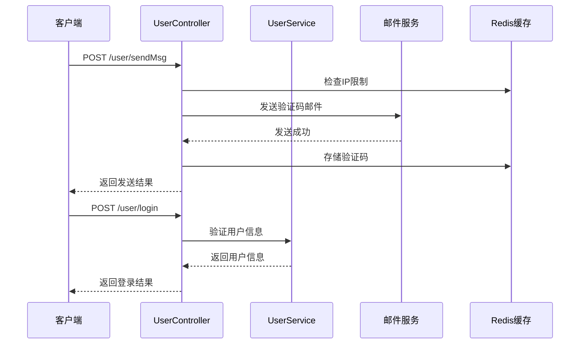

**图表来源**
- [UserController.java:42-93](file://springboot-travel-social/src/main/java/com/cxx/controller/UserController.java#L42-L93)

**章节来源**
- [UserController.java:1-136](file://springboot-travel-social/src/main/java/com/cxx/controller/UserController.java#L1-L136)

### 游记管理模块

#### 游记服务接口
游记管理模块提供游记的发布、浏览、点赞和搜索功能：

| 接口 | 方法 | 路径 | 参数 | 功能描述 |
|------|------|------|------|----------|
| 热门游记 | GET | `/blog/hot` | pageNum, pageSize | 获取热门推荐游记 |
| 全部游记 | GET | `/blog/queryBlog` | pageNum, pageSize | 获取全部游记 |
| 搜索游记 | GET | `/blog/getBlogByKey/{key}` | key | 通过关键词搜索游记 |
| 发布游记 | POST | `/blog/save` | Blog对象 | 用户发布游记 |
| 点赞游记 | PUT | `/blog/like` | id | 点赞游记 |
| 删除游记 | DELETE | `/blog/deleteById/{blogId}` | blogId | 用户删除游记 |
| 用户游记 | GET | `/blog/queryById` | pageNum, pageSize, userId | 查询用户发布的游记 |
| 用户攻略 | GET | `/blog/queryStrategyById` | userId | 查询用户发布的攻略 |

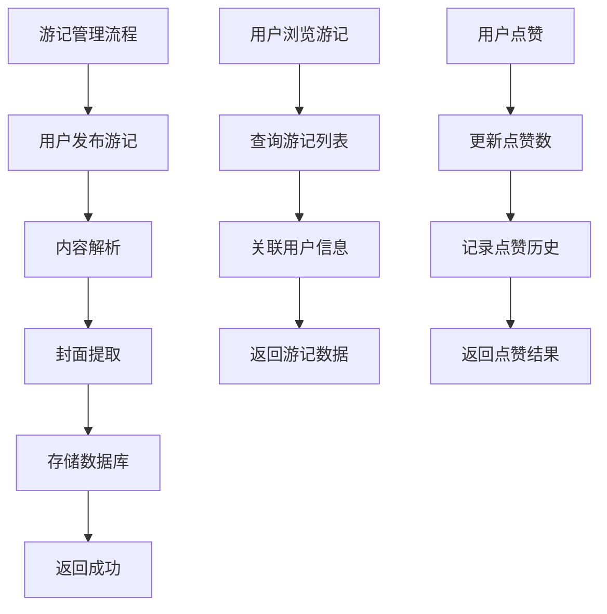

**图表来源**
- [BlogController.java:48-179](file://springboot-travel-social/src/main/java/com/cxx/controller/BlogController.java#L48-L179)

**章节来源**
- [BlogController.java:1-219](file://springboot-travel-social/src/main/java/com/cxx/controller/BlogController.java#L1-L219)

### 景点管理模块

#### 景点服务接口
景点管理模块提供城市查询和热门景点功能：

| 接口 | 方法 | 路径 | 参数 | 功能描述 |
|------|------|------|------|----------|
| 获取城市 | GET | `/scenic/getAllCity` | 无 | 获取所有城市 |
| 热门城市 | GET | `/scenic/getHotCity` | pageNum, pageSize | 获取热门城市列表 |

**章节来源**
- [ScenicController.java:1-29](file://springboot-travel-social/src/main/java/com/cxx/controller/ScenicController.java#L1-L29)

### 酒店管理模块

#### 酒店服务接口
酒店管理模块提供酒店查询、筛选和详情展示功能：

| 接口 | 方法 | 路径 | 参数 | 功能描述 |
|------|------|------|------|----------|
| 酒店列表 | GET | `/hotel/list` | keyword, star, sortBy, page, pageSize | 获取酒店列表 |
| 酒店详情 | GET | `/hotel/detail/{id}` | id | 获取酒店详情 |

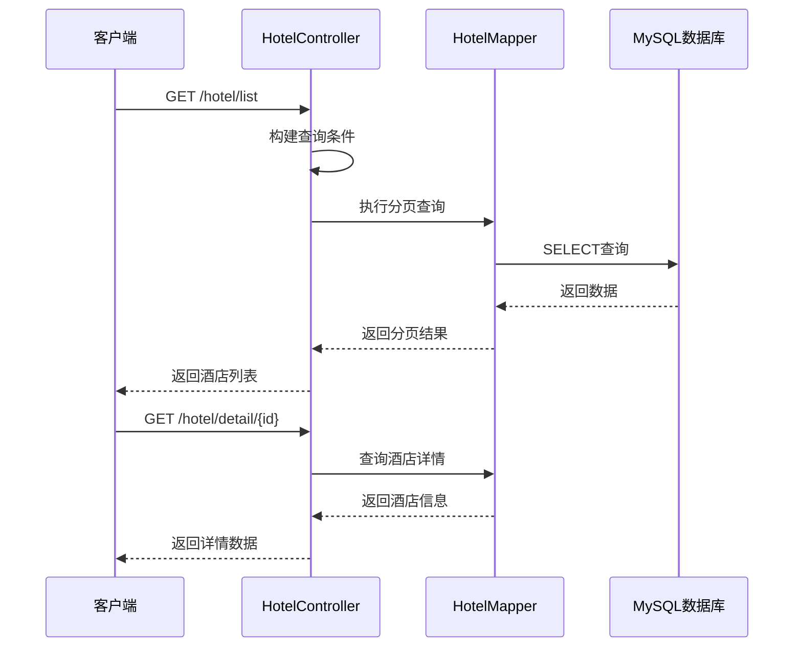

**图表来源**
- [HotelController.java:27-131](file://springboot-travel-social/src/main/java/com/cxx/controller/HotelController.java#L27-L131)

**章节来源**
- [HotelController.java:1-133](file://springboot-travel-social/src/main/java/com/cxx/controller/HotelController.java#L1-L133)

### 美食管理模块

#### 美食服务接口
美食管理模块提供美食分类、搜索和详情功能：

| 接口 | 方法 | 路径 | 参数 | 功能描述 |
|------|------|------|------|----------|
| 美食分类 | GET | `/food/getCategories` | 无 | 获取美食分类列表 |
| 分类查询 | GET | `/food/getFoodByCategory` | category, keyword | 根据分类查询美食 |
| 美食详情 | GET | `/food/detail/{id}` | id | 获取美食详情 |

**章节来源**
- [FoodController.java:1-168](file://springboot-travel-social/src/main/java/com/cxx/controller/FoodController.java#L1-L168)

### 路线管理模块

#### 路线服务接口
路线管理模块提供路线分类、搜索和详情功能：

| 接口 | 方法 | 路径 | 参数 | 功能描述 |
|------|------|------|------|----------|
| 路线分类 | GET | `/route/getCategories` | 无 | 获取路线分类列表 |
| 路线列表 | GET | `/route/getRouteList` | keyword, category, page, pageSize | 获取路线列表 |
| 路线详情 | GET | `/route/detail/{id}` | id | 获取路线详情 |

**章节来源**
- [RouteController.java:1-129](file://springboot-travel-social/src/main/java/com/cxx/controller/RouteController.java#L1-L129)

### 订单管理模块

#### 订单服务接口
订单管理模块提供订单查询、状态更新和创建功能：

| 接口 | 方法 | 路径 | 参数 | 功能描述 |
|------|------|------|------|----------|
| 订单查询 | GET | `/order/getOrderByUserId` | status | 根据用户查询订单 |
| 更新状态 | PUT | `/order/updateOrderStatus/{orderId}` | orderId | 更新订单状态 |
| 创建订单 | POST | `/order/create` | Orders对象 | 创建新订单 |
| 删除订单 | DELETE | `/order/deleteOrder/{orderNo}` | orderNo | 删除订单 |

**章节来源**
- [OrderController.java:1-55](file://springboot-travel-social/src/main/java/com/cxx/controller/OrderController.java#L1-L55)

### 购物车模块

#### 购物车接口
购物车模块提供商品添加、移除、更新和支付功能：

| 接口 | 方法 | 路径 | 参数 | 功能描述 |
|------|------|------|------|----------|
| 获取购物车 | GET | `/cart/getCartByUserId/{userId}` | userId | 根据用户ID获取购物车 |
| 添加商品 | POST | `/cart/addToCart` | CartDTO | 添加商品到购物车 |
| 移除商品 | DELETE | `/cart/removeFromCart` | userId, goodsId | 从购物车移除商品 |
| 更新数量 | PUT | `/cart/updateQuantity` | CartDTO | 更新购物车商品数量 |
| 获取商品列表 | GET | `/cart/getCartItems/{userId}` | userId | 获取购物车商品列表 |
| 清空购物车 | DELETE | `/cart/clearCart/{userId}` | userId | 清空购物车 |
| 钱包支付 | POST | `/cart/payWithWallet` | userId, orderId | 使用钱包支付购物车 |

**章节来源**
- [CartController.java:1-93](file://springboot-travel-social/src/main/java/com/cxx/controller/CartController.java#L1-L93)

### 评论管理模块

#### 评论服务接口
评论管理模块提供评论的增删改查功能：

| 接口 | 方法 | 路径 | 参数 | 功能描述 |
|------|------|------|------|----------|
| 保存评论 | POST | `/comments/save` | Comments对象 | 保存游记评论 |
| 获取评论 | GET | `/comments/getComments` | foreignId | 获取游记评论 |
| 删除评论 | DELETE | `/comments/delComment` | commentId | 删除游记评论 |
| 用户评论 | GET | `/comments/getCommentByUserId` | 无 | 获取用户发布的游记评论 |
| 点赞评论 | PUT | `/comments/likeComment/{commentId}` | commentId | 用户点赞评论 |

**章节来源**
- [CommentsController.java:1-68](file://springboot-travel-social/src/main/java/com/cxx/controller/CommentsController.java#L1-L68)

### 钱包服务模块

#### 钱包接口
钱包模块提供余额查询、收支记录和充值提现功能：

| 接口 | 方法 | 路径 | 参数 | 功能描述 |
|------|------|------|------|----------|
| 查询余额 | GET | `/wallet/getBalance` | userId | 查询用户钱包余额 |
| 最近记录 | GET | `/wallet/getRecentRecords` | userId, limit | 查询用户最近收支记录 |
| 所有记录 | GET | `/wallet/getAllRecords` | userId | 查询用户所有收支记录 |
| 充值 | POST | `/wallet/recharge` | userId, amount, bizId | 用户充值 |
| 提现 | POST | `/wallet/withdraw` | userId, amount, bizId | 用户提现 |

**章节来源**
- [WalletController.java:1-135](file://springboot-travel-social/src/main/java/com/cxx/controller/WalletController.java#L1-L135)

## 新增模块接口

### 预算管理模块

#### 预算管理服务接口
预算管理模块提供智能旅行预算拆解和费用计算功能：

| 接口 | 方法 | 路径 | 参数 | 功能描述 |
|------|------|------|------|----------|
| 首次预算估算 | POST | `/budget/estimate` | city, days, persons, theme | 根据目的地、天数、人数、主题估算预算 |
| 重新计算预算 | POST | `/budget/recalculate` | city, days, persons, theme | 调整参数后重新计算预算 |

**预算管理参数说明**
- city: 目的地城市名称（必填）
- days: 行程天数（默认3天）
- persons: 出行人数（默认2人）
- theme: 旅行主题（backpacker/couple/family/luxury，默认couple）

**预算管理返回数据结构**
- breakdown: 预算明细（酒店、餐饮、景点、交通、杂费等各项费用）
- total: 总费用
- totalPerPerson: 人均费用
- aiSummary: AI生成的预算摘要
- savingTips: 省钱建议

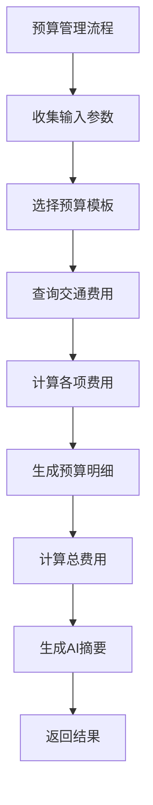

**图表来源**
- [BudgetController.java:17-42](file://springboot-travel-social/src/main/java/com/cxx/controller/BudgetController.java#L17-L42)

**章节来源**
- [BudgetController.java:1-51](file://springboot-travel-social/src/main/java/com/cxx/controller/BudgetController.java#L1-L51)

### 本地景点模块

#### 本地景点服务接口
本地景点模块提供小众地点检索和本地向导认证功能：

| 接口 | 方法 | 路径 | 参数 | 功能描述 |
|------|------|------|------|----------|
| 检索小众地点 | GET | `/local-spot/search` | city, keyword, category, limit, featuredOnly | 检索本地小众地点 |
| 申请本地向导 | POST | `/local-guide/apply` | userId, city, intro, blogIds | 申请本地向导认证 |
| 查询认证状态 | GET | `/local-guide/status/{userId}` | userId | 查询用户认证状态 |

**本地景点参数说明**
- city: 目标城市（可选）
- keyword: 关键词（可选）
- category: 类别过滤（可选）
- limit: 返回数量，默认5
- featuredOnly: 是否只返回精选

**本地景点实体 (LocalSpot)**
- 主键：地点ID
- 名称：地点名称
- 城市：所在城市
- 省份：所在省份
- 地址：详细地址
- 描述：地点描述
- 实用贴士：实用tips
- 最佳季节：最佳游览季节
- 图片URL：代表图片URL
- 来源博客ID：推荐游记ID
- 来源用户ID：推荐达人用户ID
- 类别：natural/culture/food/art/market/other
- 质量分：综合质量分(0-100)
- 浏览次数：被引用次数
- 状态：是否上架/精选/审核

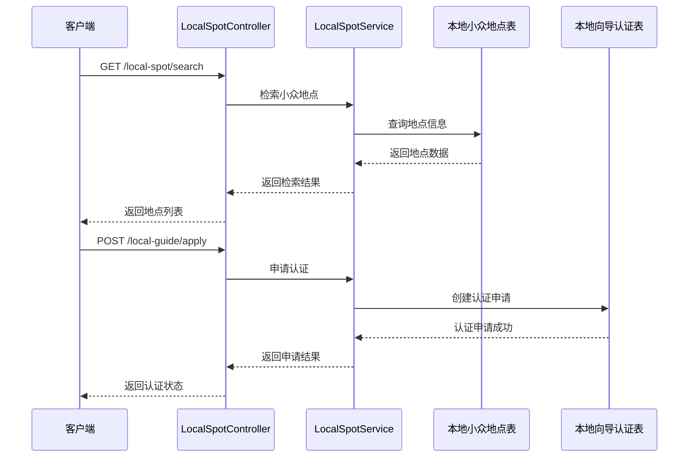

**图表来源**
- [LocalSpotController.java:17-65](file://springboot-travel-social/src/main/java/com/cxx/controller/LocalSpotController.java#L17-L65)

**章节来源**
- [LocalSpotController.java:1-65](file://springboot-travel-social/src/main/java/com/cxx/controller/LocalSpotController.java#L1-L65)
- [LocalSpot.java:1-37](file://springboot-travel-social/src/main/java/com/cxx/entity/LocalSpot.java#L1-L37)

### AI聊天模块

#### AI聊天服务接口
AI聊天模块提供多种AI交互能力，包括简单聊天、通用聊天、RAG增强聊天、行程生成等：

| 接口 | 方法 | 路径 | 参数 | 功能描述 |
|------|------|------|------|----------|
| 简单聊天 | POST | `/api/ai/simple-chat` | userId, sessionId, message | 基础AI聊天功能 |
| 通用聊天 | POST | `/api/ai/chat` | userId, sessionId, systemPrompt, message | 带系统提示的聊天 |
| 检查状态 | GET | `/api/ai/status` | 无 | 检查AI服务状态 |
| 查询会话 | GET | `/api/ai/sessions/{userId}` | userId | 获取用户会话列表 |
| 查询消息 | GET | `/api/ai/records/{sessionId}` | sessionId | 获取会话消息记录 |
| 创建会话 | POST | `/api/ai/create-session` | userId, title | 创建新会话 |
| 删除会话 | DELETE | `/api/ai/session/{sessionId}/{userId}` | sessionId, userId | 删除会话 |
| 清空消息 | DELETE | `/api/ai/records/{sessionId}/{userId}` | sessionId, userId | 清空会话消息 |
| 生成行程 | POST | `/api/ai/generate-itinerary` | userId, sessionId, destination, days, theme, budget, extra | AI智能行程生成 |
| 语音转文字 | POST | `/api/ai/voice2text` | audio | 语音识别（演示模式） |
| RAG聊天 | POST | `/api/ai/rag-chat` | userId, sessionId, message, keyword, systemPrompt | 基于游记的增强聊天 |

**AI聊天核心功能**
- 会话管理：自动创建会话、消息持久化、会话历史查询
- 多模态支持：文本聊天、语音识别（演示模式）
- 智能增强：RAG检索真实用户游记经验，提升回复可信度
- 专业服务：智能行程生成，提供详细每日安排和预算估算

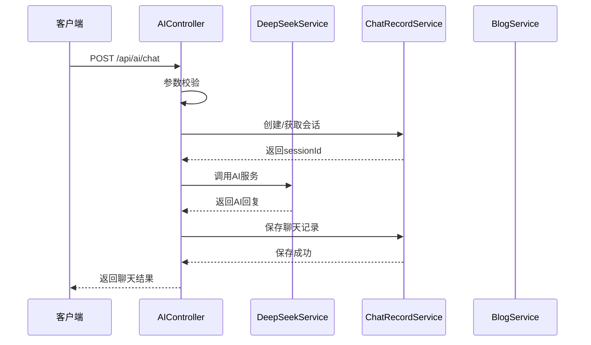

**图表来源**
- [AIController.java:141-235](file://springboot-travel-social/src/main/java/com/cxx/controller/AIController.java#L141-L235)

**章节来源**
- [AIController.java:1-610](file://springboot-travel-social/src/main/java/com/cxx/controller/AIController.java#L1-L610)

### 大模型测试模块

#### 大模型测试接口
大模型测试模块提供快速验证AI服务能力的接口：

| 接口 | 方法 | 路径 | 参数 | 功能描述 |
|------|------|------|------|----------|
| GET测试 | GET | `/bigModel/{text}` | text | 测试GET请求，直接返回AI响应 |
| POST消息 | POST | `/bigModel/sendMsg` | content | 测试POST请求，发送消息给AI |

**章节来源**
- [BigModelController.java:1-51](file://springboot-travel-social/src/main/java/com/cxx/controller/BigModelController.java#L1-L51)

### 行程协作模块

#### 行程协作服务接口
行程协作模块提供多人协作制定旅行计划的完整功能：

| 接口 | 方法 | 路径 | 参数 | 功能描述 |
|------|------|------|------|----------|
| 创建协作房间 | POST | `/itinerary/collab/create` | creatorId, title, destination, days | 创建新的行程协作房间 |
| 通过邀请码加入房间 | POST | `/itinerary/collab/join/{code}` | userId | 使用邀请码加入协作房间 |
| 获取房间成员列表 | GET | `/itinerary/collab/members/{roomId}` | roomId | 查询房间内所有成员信息 |
| 发送协作消息 | POST | `/itinerary/collab/{roomId}/message` | userId, content | 在房间内发送协作消息 |
| AI生成行程计划 | POST | `/itinerary/collab/{roomId}/generate` | userId | 触发AI综合生成行程计划 |
| 获取历史消息 | GET | `/itinerary/collab/{roomId}/messages` | roomId | 获取房间历史消息记录 |

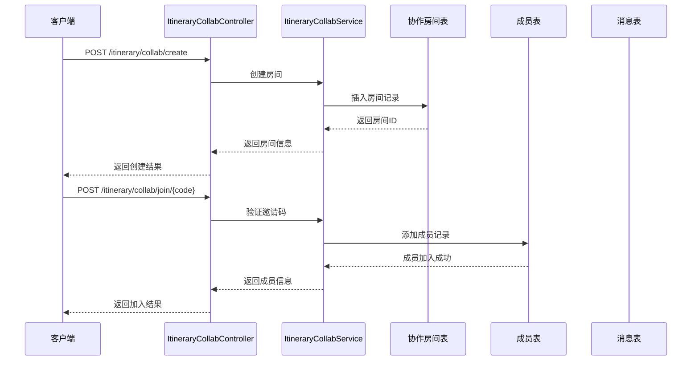

**图表来源**
- [ItineraryCollabController.java:28-137](file://springboot-travel-social/src/main/java/com/cxx/controller/ItineraryCollabController.java#L28-L137)

**章节来源**
- [ItineraryCollabController.java:1-139](file://springboot-travel-social/src/main/java/com/cxx/controller/ItineraryCollabController.java#L1-L139)

#### 行程协作实体模型

**协作房间实体 (ItineraryCollabRoom)**
- 主键：房间ID
- 邀请码：6位唯一标识
- 行程ID：关联的行程ID
- 创建者：用户ID
- 主题：协作标题
- 目的地：旅行地点
- 天数：行程天数
- 成员数：最大成员限制
- 状态：规划中/已生成/已结束
- AI摘要：成员偏好的综合摘要
- 过期时间：邀请码有效期
- 创建/更新时间：数据时间戳

**协作成员实体 (ItineraryCollabMember)**
- 房间ID：关联的协作房间
- 用户ID：成员用户标识
- 角色：拥有者/成员
- 昵称快照：用户当时的昵称
- 头像快照：用户当时的头像
- 偏好输入：成员的偏好描述
- 加入时间：成员加入时间

**协作消息实体 (ItineraryCollabMessage)**
- 房间ID：消息所属房间
- 用户ID：发送用户（0表示AI/系统）
- 角色：用户/AI/系统
- 内容：消息文本
- 类型：文本/行程/系统
- 昵称快照：用户当时的昵称
- 头像快照：用户当时的头像
- 创建时间：消息发送时间

**章节来源**
- [ItineraryCollabRoom.java:1-67](file://springboot-travel-social/src/main/java/com/cxx/entity/ItineraryCollabRoom.java#L1-L67)
- [ItineraryCollabMember.java:1-48](file://springboot-travel-social/src/main/java/com/cxx/entity/ItineraryCollabMember.java#L1-L48)
- [ItineraryCollabMessage.java:1-52](file://springboot-travel-social/src/main/java/com/cxx/entity/ItineraryCollabMessage.java#L1-L52)

### 用户偏好模块

#### 用户旅行偏好接口
用户偏好模块提供旅行偏好的智能分析和快照管理功能：

| 接口 | 方法 | 路径 | 参数 | 功能描述 |
|------|------|------|------|----------|
| 获取用户偏好快照 | GET | `/user/preference/{userId}` | userId, refresh | 获取用户旅行偏好快照 |
| 刷新用户偏好 | POST | `/user/preference/refresh/{userId}` | userId | 主动触发偏好快照刷新 |

**用户偏好实体 (UserPreference)**
- 用户ID：偏好所属用户
- 标签：旅行偏好标签数组
- 访问城市：去过城市数组
- 最近出行：最近一次出行信息
- 消费水平：低/中/高/奢华
- 旅行风格：自然语言描述
- AI摘要：注入AI的用户画像
- 数据版本：行为变化时递增
- 过期时间：快照有效期
- 创建/更新时间：数据时间戳

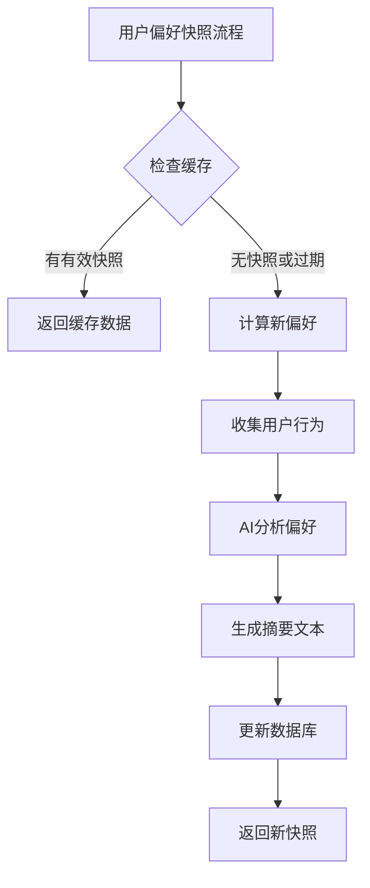

**图表来源**
- [UserPreferenceController.java:31-54](file://springboot-travel-social/src/main/java/com/cxx/controller/UserPreferenceController.java#L31-L54)

**章节来源**
- [UserPreferenceController.java:1-56](file://springboot-travel-social/src/main/java/com/cxx/controller/UserPreferenceController.java#L1-L56)
- [UserPreference.java:1-74](file://springboot-travel-social/src/main/java/com/cxx/entity/UserPreference.java#L1-L74)

### 节假日配置模块

#### 节假日查询接口
节假日配置模块提供节假日信息查询和出行建议功能：

| 接口 | 方法 | 路径 | 参数 | 功能描述 |
|------|------|------|------|----------|
| 查询节假日情况 | GET | `/api/holiday/check` | date, days | 查询指定日期起N天内的节假日 |

**节假日配置实体 (HolidayConfig)**
- 节假日日期：具体日期
- 节假日名称：如五一、国庆
- 是否节假日：1=节假日 0=调休工作日
- 高峰等级：1=一般 2=高峰 3=超高峰
- 出行建议：具体的出行提示
- 所属年份：年份标识
- 创建/更新时间：数据时间戳

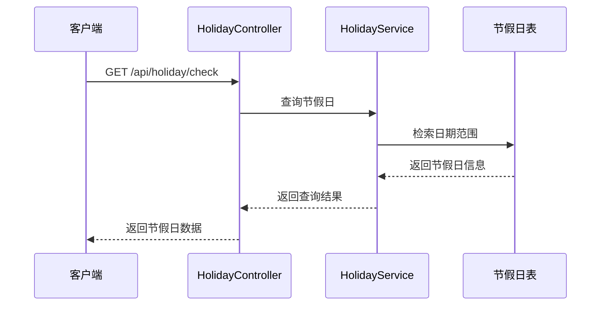

**图表来源**
- [HolidayController.java:33-40](file://springboot-travel-social/src/main/java/com/cxx/controller/HolidayController.java#L33-L40)

**章节来源**
- [HolidayController.java:1-42](file://springboot-travel-social/src/main/java/com/cxx/controller/HolidayController.java#L1-L42)
- [HolidayConfig.java:1-58](file://springboot-travel-social/src/main/java/com/cxx/entity/HolidayConfig.java#L1-L58)

### 行程上下文聚合模块

#### 行程上下文服务接口
行程上下文模块提供一次调用获取多种上下文信息的能力：

| 接口 | 方法 | 路径 | 参数 | 功能描述 |
|------|------|------|------|----------|
| 获取出行上下文 | GET | `/trip/context` | city, startDate, days | 获取天气+节假日+AI摘要 |

**行程上下文聚合流程**
- 输入：城市、开始日期、行程天数
- 输出：天气信息、节假日信息、AI摘要文本
- 用途：为聊天机器人提供systemPrompt上下文

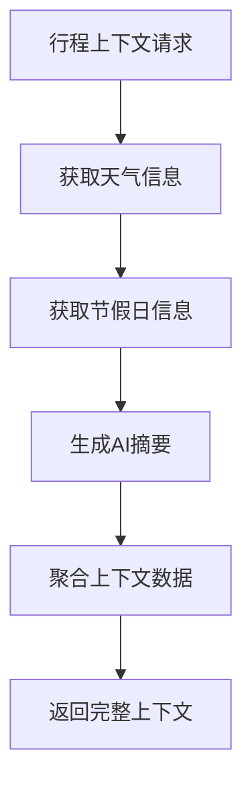

**图表来源**
- [TripContextController.java:35-43](file://springboot-travel-social/src/main/java/com/cxx/controller/TripContextController.java#L35-L43)

**章节来源**
- [TripContextController.java:1-45](file://springboot-travel-social/src/main/java/com/cxx/controller/TripContextController.java#L1-L45)

### AI推荐模块

#### AI推荐服务接口
AI推荐模块提供基于协同过滤的游记推荐和周边服务推荐功能：

| 接口 | 方法 | 路径 | 参数 | 功能描述 |
|------|------|------|------|----------|
| 用户游记推荐 | GET | `/getRecommend/recommend/{userId}` | userId | 基于用户协同过滤的游记推荐 |
| 周边服务推荐 | GET | `/getRecommend/nearby-services` | city, types, limit | 周边摄影、酒店等服务推荐 |

**推荐系统工作流程**
- 用户协同过滤：基于相似用户的偏好推荐
- 冷启动处理：无用户数据时返回热门游记
- 周边服务：根据城市和类型推荐相关服务

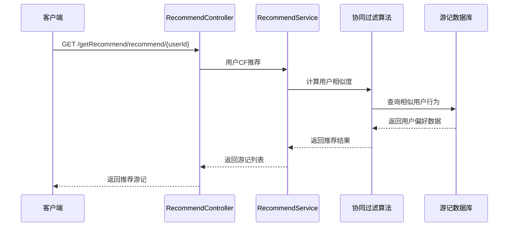

**图表来源**
- [RecommendController.java:40-83](file://springboot-travel-social/src/main/java/com/cxx/controller/RecommendController.java#L40-L83)

**章节来源**
- [RecommendController.java:1-83](file://springboot-travel-social/src/main/java/com/cxx/controller/RecommendController.java#L1-L83)

## 依赖分析

### 核心依赖关系

```mermaid
graph TB
subgraph "Spring Boot生态"
A[Spring Boot Starter Web]
B[Spring Boot Starter Validation]
C[Spring Boot Starter Data Redis]
D[Spring Boot Starter AMQP]
E[Spring Boot Actuator]
end
subgraph "数据库相关"
F[MyBatis-Plus]
G[MySQL Connector Java]
H[Redisson]
end
subgraph "第三方服务"
I[Knife4j Swagger]
J[GoEasy实时通信]
K[阿里云OSS]
L[Fastjson]
M[JWT]
end
subgraph "AI服务"
N[XunFei Spark]
O[DeepSeek]
P[Zhipu AI]
Q[AI服务集成]
R[协同过滤算法]
S[预算模板系统]
T[语音识别集成]
U[本地景点检索算法]
V[小众地点知识库]
W[本地向导认证系统]
X[AI聊天服务]
Y[大模型服务]
end
end
A --> F
A --> G
A --> H
F --> G
A --> I
A --> J
A --> K
A --> L
A --> M
A --> N
A --> O
A --> P
A --> Q
A --> R
A --> S
A --> T
A --> U
A --> V
A --> W
A --> X
A --> Y
```

**图表来源**
- [pom.xml:16-182](file://springboot-travel-social/pom.xml#L16-L182)

### 数据库连接配置

系统使用MySQL作为主要数据库，Redis作为缓存层：

| 配置项 | 值 | 说明 |
|--------|-----|------|
| 数据库URL | jdbc:mysql://127.0.0.1:3306/travel_1 | 数据库连接地址 |
| 用户名 | root | 数据库用户名 |
| 密码 | root | 数据库密码 |
| 驱动类 | com.mysql.cj.jdbc.Driver | MySQL驱动 |
| Redis主机 | 127.0.0.1 | Redis服务器地址 |
| Redis端口 | 6379 | Redis服务器端口 |

### 新增数据库表结构

**预算管理相关表**
- `transport_fare`：交通费用参考表，支持预算估算
- `budget_template`：预算主题模板表，定义不同旅行主题的费用系数

**行程协作相关表**
- `itinerary_collab_room`：协作房间表，支持邀请码和房间管理
- `itinerary_collab_member`：协作成员表，管理房间成员关系
- `itinerary_collab_message`：协作消息表，记录房间内消息历史

**本地景点相关表**
- `local_spot`：本地小众地点知识库，存储小众地点信息
- `local_guide_cert`：本地向导认证表，管理向导认证状态

**用户偏好表**
- `user_preference`：用户偏好快照表，存储AI分析的用户画像

**节假日配置表**
- `holiday_config`：节假日配置表，存储节假日和出行建议信息

**AI推荐相关表**
- `ai_itinerary`：扩展协作字段，支持多人协作行程

**章节来源**
- [application.properties:1-64](file://springboot-travel-social/src/main/resources/application.properties#L1-L64)
- [itinerary_collab.sql:1-60](file://springboot-travel-social/src/main/resources/sql/itinerary_collab.sql#L1-L60)
- [local_spot.sql:1-68](file://springboot-travel-social/src/main/resources/sql/local_spot.sql#L1-L68)
- [budget.sql:1-77](file://springboot-travel-social/src/main/resources/sql/budget.sql#L1-L77)

## 性能考虑

### 缓存策略
系统采用多层缓存策略提升性能：

1. **Redis缓存**：用于存储验证码、用户会话、热点数据
2. **数据库缓存**：MyBatis Plus自带二级缓存
3. **静态资源缓存**：前端静态资源CDN缓存
4. **用户偏好快照缓存**：用户偏好数据的短期缓存
5. **AI推荐结果缓存**：推荐结果的短期缓存
6. **预算估算缓存**：预算计算结果的短期缓存
7. **本地景点缓存**：小众地点检索结果的短期缓存
8. **协作消息缓存**：行程协作消息的历史缓存

### 分页优化
所有列表查询都支持分页，避免一次性加载大量数据：

- 默认每页10条记录
- 支持自定义页大小
- 提供总数统计
- 协作消息按时间排序分页
- 周边服务推荐支持限制数量
- 预算模板数据预加载
- 本地景点支持分页查询

### 异步处理
系统集成RabbitMQ实现消息队列，支持异步任务处理：
- 邮件发送
- 日志记录
- 数据同步
- AI偏好计算
- 协同过滤计算
- 预算估算计算
- 本地景点检索
- 协作消息广播

### 新增性能考虑

**预算管理优化**
- 交通费用缓存
- 预算模板缓存
- AI费用计算优化
- 实时汇率处理

**本地景点优化**
- 小众地点缓存
- 分类索引优化
- 地理位置查询优化
- 认证状态缓存
- 质量评分排序

**行程协作优化**
- 房间成员数量限制（默认10人）
- 邀请码过期时间控制（默认24小时）
- 消息历史分页查询
- AI生成行程的异步处理
- WebSocket实时消息推送

**用户偏好优化**
- 快照过期时间管理
- 缓存命中率优化
- AI摘要的增量更新
- 偏好数据的版本控制

**AI聊天优化**
- 会话状态缓存
- 消息持久化优化
- RAG检索性能优化
- 语音识别降级处理

**AI推荐优化**
- 协同过滤算法优化
- 冷启动用户降级处理
- 推荐结果缓存策略
- 实时行为数据处理

## 故障排除指南

### 常见问题及解决方案

#### 1. 跨域问题
**症状**：前端请求被浏览器阻止
**解决方案**：检查CORS配置是否正确

#### 2. JWT认证失败
**症状**：用户登录后无法访问受保护接口
**解决方案**：验证JWT密钥和过期时间设置

#### 3. 数据库连接异常
**症状**：应用启动失败或查询超时
**解决方案**：检查数据库连接配置和网络连通性

#### 4. Redis连接问题
**症状**：缓存功能异常
**解决方案**：验证Redis服务器状态和连接参数

#### 5. 预算估算计算错误
**症状**：预算计算结果异常
**解决方案**：检查预算模板数据、交通费用配置和AI服务状态

#### 6. 本地景点检索失败
**症状**：小众地点查询为空
**解决方案**：检查本地景点表数据、地理位置索引和缓存状态

#### 7. 行程协作房间创建失败
**症状**：创建房间时报错
**解决方案**：检查邀请码唯一性、房间状态和用户权限

#### 8. 用户偏好计算错误
**症状**：获取偏好快照为空
**解决方案**：检查用户行为数据完整性、AI服务可用性

#### 9. 节假日查询异常
**症状**：节假日信息不准确
**解决方案**：检查节假日配置表数据、年份范围设置

#### 10. AI推荐失败
**症状**：推荐结果为空或异常
**解决方案**：检查协同过滤算法、用户数据完整性和缓存状态

#### 11. AI聊天服务异常
**症状**：聊天功能不可用
**解决方案**：检查DeepSeek API配置、会话状态和消息持久化

#### 12. 大模型测试失败
**症状**：大模型接口调用失败
**解决方案**：验证AI服务配置、网络连接和API密钥

#### 13. 语音识别问题
**症状**：语音转文字功能异常
**解决方案**：检查讯飞SDK配置、音频格式和网络连接

#### 14. 本地向导认证失败
**症状**：认证申请提交失败
**解决方案**：检查用户权限、认证数据完整性和审核状态

**章节来源**
- [CorsFilter.java:1-28](file://springboot-travel-social/src/main/java/com/cxx/config/CorsFilter.java#L1-L28)

## 结论

本API接口文档涵盖了旅游攻略社交小程序后端的所有核心功能模块，包括新增的预算管理、本地景点、AI聊天、大模型测试、行程协作、用户偏好、节假日配置、AI推荐等高级功能。系统采用现代化的Spring Boot技术栈，提供了完整的RESTful API设计，支持用户认证、内容管理、电商交易、多人协作、智能推荐、预算规划、AI对话、本地向导等多样化业务场景。

### 主要特点
- **模块化设计**：清晰的功能模块划分，包括新增的协作、偏好、推荐、预算、聊天、本地景点模块
- **统一响应格式**：标准化的API响应结构，便于前端处理
- **完善的认证机制**：基于JWT的安全认证体系
- **高性能架构**：多层缓存、异步处理和数据库优化
- **智能化服务**：AI驱动的用户偏好分析、行程生成、预算估算、聊天对话、本地向导推荐
- **扩展性强**：易于添加新的业务模块和功能特性
- **多模态支持**：文本、语音等多种交互方式
- **RAG增强**：基于真实用户经验的智能增强聊天
- **本地化特色**：小众地点发现和本地向导认证系统

### 新增功能价值
- **预算管理**：智能旅行预算拆解，提供详细的费用明细和省钱建议
- **本地景点**：小众地点发现，提供本地向导认证和优质体验分享
- **AI聊天**：全方位的智能对话能力，支持会话管理、RAG增强、行程生成
- **大模型测试**：快速验证AI服务能力，便于开发调试
- **行程协作**：支持多人共同制定旅行计划，提升用户体验
- **用户偏好**：通过AI分析用户行为，提供个性化推荐
- **节假日配置**：为用户提供出行决策支持和风险提示
- **行程上下文**：简化前端开发，提供完整的AI对话上下文
- **AI推荐**：基于协同过滤算法，提供精准的内容推荐

建议在实际部署时关注数据库连接、Redis缓存、AI服务集成、第三方API配置、预算模板维护、推荐算法优化、本地景点数据更新和协作消息同步，确保系统的稳定运行和良好的用户体验。