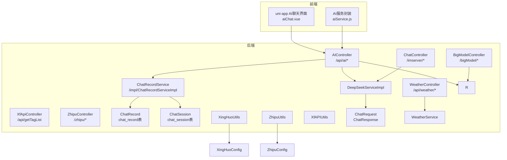
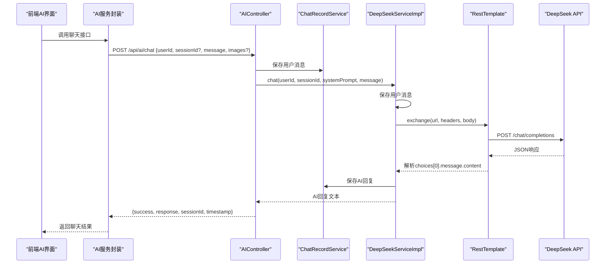
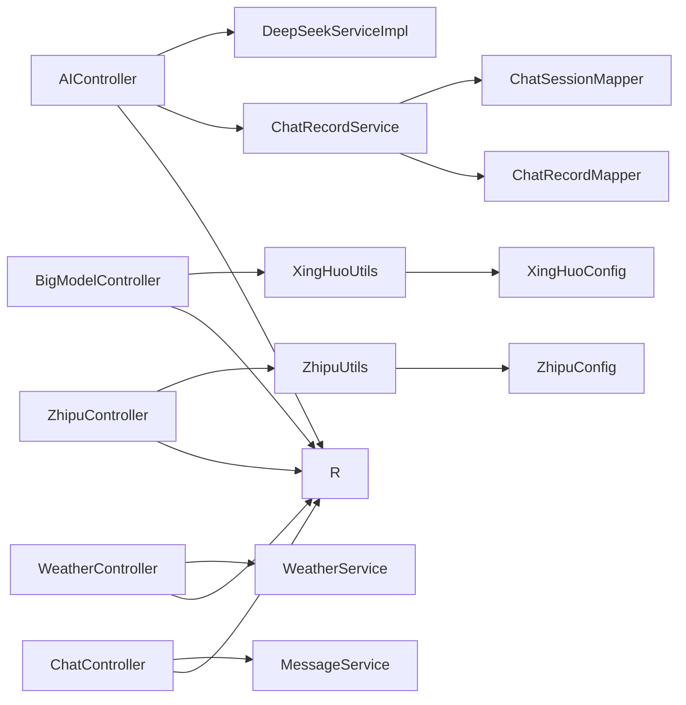

# AI智能服务接口

<cite>
**本文引用的文件**
- [AIController.java](file://springboot-travel-social/src/main/java/com/cxx/controller/AIController.java)
- [BigModelController.java](file://springboot-travel-social/src/main/java/com/cxx/controller/BigModelController.java)
- [WeatherController.java](file://springboot-travel-social/src/main/java/com/cxx/controller/WeatherController.java)
- [XfApiController.java](file://springboot-travel-social/src/main/java/com/cxx/controller/XfApiController.java)
- [ZhipuController.java](file://springboot-travel-social/src/main/java/com/cxx/controller/ZhipuController.java)
- [ChatController.java](file://springboot-travel-social/src/main/java/com/cxx/controller/ChatController.java)
- [ChatRequest.java](file://springboot-travel-social/src/main/java/com/cxx/dto/ChatRequest.java)
- [ChatResponse.java](file://springboot-travel-social/src/main/java/com/cxx/dto/ChatResponse.java)
- [ChatRecordService.java](file://springboot-travel-social/src/main/java/com/cxx/service/ChatRecordService.java)
- [ChatRecordServiceImpl.java](file://springboot-travel-social/src/main/java/com/cxx/service/impl/ChatRecordServiceImpl.java)
- [ChatRecord.java](file://springboot-travel-social/src/main/java/com/cxx/entity/ChatRecord.java)
- [ChatSession.java](file://springboot-travel-social/src/main/java/com/cxx/entity/ChatSession.java)
- [DeepSeekServiceImpl.java](file://springboot-travel-social/src/main/java/com/cxx/service/impl/DeepSeekServiceImpl.java)
- [XingHuoUtils.java](file://springboot-travel-social/src/main/java/com/cxx/utils/XingHuoUtils.java)
- [ZhipuUtils.java](file://springboot-travel-social/src/main/java/com/cxx/utils/ZhipuUtils.java)
- [XfAPIUtils.java](file://springboot-travel-social/src/main/java/com/cxx/utils/XfAPIUtils.java)
- [WeatherService.java](file://springboot-travel-social/src/main/java/com/cxx/service/WeatherService.java)
- [XingHuoConfig.java](file://springboot-travel-social/src/main/java/com/cxx/config/XingHuoConfig.java)
- [ZhipuConfig.java](file://springboot-travel-social/src/main/java/com/cxx/config/ZhipuConfig.java)
- [R.java](file://springboot-travel-social/src/main/java/com/cxx/entity/R.java)
- [aiChat.vue](file://uniapp-travel-social/homePages/aiChat/aiChat.vue)
- [aiService.js](file://uniapp-travel-social/services/aiService.js)
- [application.properties](file://springboot-travel-social/src/main/resources/application.properties)
- [ChatRecordMapper.java](file://springboot-travel-social/src/main/java/com/cxx/mapper/ChatRecordMapper.java)
- [ChatSessionMapper.java](file://springboot-travel-social/src/main/java/com/cxx/mapper/ChatSessionMapper.java)
</cite>

## 更新摘要
**所做更改**
- 新增AI聊天接口章节，详细说明/simple-chat和/chat接口的功能差异和使用场景
- 更新会话管理功能章节，强调用户身份验证和会话生命周期管理
- 新增用户身份验证机制说明，所有接口都需要userId参数
- 更新多模态聊天功能章节，包含图片上传和图文问答支持
- 新增完整的API调用示例，包含请求参数、响应结构和错误处理
- 更新前端AI服务封装，包含完整的参数验证和错误处理机制

## 目录
1. [简介](#简介)
2. [项目结构](#项目结构)
3. [核心组件](#核心组件)
4. [架构总览](#架构总览)
5. [详细组件分析](#详细组件分析)
6. [AI聊天接口](#ai聊天接口)
7. [会话管理功能](#会话管理功能)
8. [用户身份验证](#用户身份验证)
9. [多模态聊天功能](#多模态聊天功能)
10. [AI服务调用示例](#ai服务调用示例)
11. [前端AI服务封装](#前端ai服务封装)
12. [依赖关系分析](#依赖关系分析)
13. [性能与成本优化](#性能与成本优化)
14. [故障排查指南](#故障排查指南)
15. [结论](#结论)
16. [附录](#附录)

## 简介
本文件面向"AI智能服务"相关API接口，覆盖以下能力：
- **通用AI聊天接口**：支持多轮对话与上下文保持，基于会话ID管理历史消息，新增多模态聊天支持。
- **大模型API集成**：讯飞星火、智谱清言、DeepSeek等模型的调用封装与控制器暴露。
- **天气查询接口**：实时天气、天气预警、7天预报、城市搜索。
- **内容生成接口**：游记生成、文案创作、路线规划建议等（通过AI聊天接口与大模型控制器组合实现）。
- **完整的调用示例**：请求参数、响应结构、错误处理。
- **限流与成本优化**：基于Redis与脚本的限流策略与线程池异步处理。
- **配置管理与版本切换**：通过配置文件与工具类实现模型参数与版本切换。
- **会话管理**：完整的会话生命周期管理，包括创建、查询、删除、重命名、清空等操作。

## 项目结构
后端采用Spring Boot工程，AI相关模块主要分布在controller、service、utils、config、dto、entity等包中；前端uni-app侧提供调用示例与界面入口。



**图表来源**
- [AIController.java:1-505](file://springboot-travel-social/src/main/java/com/cxx/controller/AIController.java#L1-L505)
- [ChatRecordServiceImpl.java:1-92](file://springboot-travel-social/src/main/java/com/cxx/service/impl/ChatRecordServiceImpl.java#L1-L92)
- [ChatRecord.java:1-48](file://springboot-travel-social/src/main/java/com/cxx/entity/ChatRecord.java#L1-L48)
- [ChatSession.java:1-44](file://springboot-travel-social/src/main/java/com/cxx/entity/ChatSession.java#L1-L44)
- [aiChat.vue:1-1139](file://uniapp-travel-social/homePages/aiChat/aiChat.vue#L1-L1139)
- [aiService.js:1-293](file://uniapp-travel-social/services/aiService.js#L1-L293)

## 核心组件
- **AI聊天控制器**：提供通用聊天、简单聊天、会话管理、状态检查等接口，支持多模态聊天。
- **会话管理服务**：完整的会话生命周期管理，包括创建、查询、删除、重命名、清空等操作。
- **大模型控制器**：提供讯飞星火、智谱清言、通用消息发送接口。
- **天气控制器**：提供实时天气、预警、预报、城市搜索接口。
- **工具与服务**：封装各模型调用细节，统一请求头与响应解析。
- **统一返回体**：R类用于前后端一致的响应结构。
- **前端AI服务**：封装所有AI相关API调用，提供多模态聊天、会话管理等功能。

**章节来源**
- [AIController.java:1-505](file://springboot-travel-social/src/main/java/com/cxx/controller/AIController.java#L1-L505)
- [ChatRecordService.java:1-54](file://springboot-travel-social/src/main/java/com/cxx/service/ChatRecordService.java#L1-L54)
- [ChatRecordServiceImpl.java:1-92](file://springboot-travel-social/src/main/java/com/cxx/service/impl/ChatRecordServiceImpl.java#L1-L92)
- [BigModelController.java:1-51](file://springboot-travel-social/src/main/java/com/cxx/controller/BigModelController.java#L1-L51)
- [WeatherController.java:1-87](file://springboot-travel-social/src/main/java/com/cxx/controller/WeatherController.java#L1-L87)
- [ZhipuController.java:1-98](file://springboot-travel-social/src/main/java/com/cxx/controller/ZhipuController.java#L1-L98)
- [XfApiController.java:1-20](file://springboot-travel-social/src/main/java/com/cxx/controller/XfApiController.java#L1-L20)
- [R.java:1-32](file://springboot-travel-social/src/main/java/com/cxx/entity/R.java#L1-L32)
- [aiService.js:1-293](file://uniapp-travel-social/services/aiService.js#L1-L293)

## 架构总览
AI服务整体由"控制器—服务/工具—配置—外部模型API"构成，控制器负责参数校验、会话管理与统一返回；服务/工具负责构建请求、调用第三方API并解析响应；配置类从application.properties读取密钥与基础地址；统一返回体R保证前后端一致性。新增的会话管理服务提供完整的数据库持久化支持。



**图表来源**
- [aiService.js:88-119](file://uniapp-travel-social/services/aiService.js#L88-L119)
- [AIController.java:136-229](file://springboot-travel-social/src/main/java/com/cxx/controller/AIController.java#L136-L229)
- [ChatRecordServiceImpl.java:34-48](file://springboot-travel-social/src/main/java/com/cxx/service/impl/ChatRecordServiceImpl.java#L34-L48)
- [DeepSeekServiceImpl.java:92-111](file://springboot-travel-social/src/main/java/com/cxx/service/impl/DeepSeekServiceImpl.java#L92-L111)

## 详细组件分析

### AI聊天接口

#### 简单聊天接口（/api/ai/simple-chat）
- **功能特点**
  - 最基础的聊天接口，仅支持用户ID、会话ID和消息内容
  - 自动创建会话，会话标题为消息前20个字符
  - 不支持自定义系统提示词
- **请求参数**
  - `userId` (必填)：用户唯一标识符
  - `sessionId` (可选)：会话ID，为空则自动创建
  - `message` (必填)：用户消息内容，最大4000字符
- **响应结构**
  - `success`：布尔值，请求是否成功
  - `response`：AI回复内容
  - `sessionId`：会话ID
  - `timestamp`：时间戳

#### 通用聊天接口（/api/ai/chat）
- **功能特点**
  - 支持自定义系统提示词
  - 完整的会话管理功能
  - 支持多模态消息（文本、图片）
- **请求参数**
  - `userId` (必填)：用户唯一标识符
  - `sessionId` (可选)：会话ID
  - `systemPrompt` (可选)：系统提示词，默认为"You are a helpful assistant"
  - `message` (必填)：用户消息内容
  - `images` (可选)：图片URL数组
- **响应结构**
  - `success`：布尔值，请求是否成功
  - `response`：AI回复内容
  - `sessionId`：会话ID
  - `timestamp`：时间戳

**章节来源**
- [AIController.java:28-231](file://springboot-travel-social/src/main/java/com/cxx/controller/AIController.java#L28-L231)
- [aiService.js:52-119](file://uniapp-travel-social/services/aiService.js#L52-L119)

### 会话管理功能
- **会话创建**
  - POST `/api/ai/create-session`：创建新会话，返回会话ID
- **会话查询**
  - GET `/api/ai/sessions/{userId}`：查询用户的所有会话，按更新时间排序
  - GET `/api/ai/session/{sessionId}`：查询特定会话详情
- **会话操作**
  - DELETE `/api/ai/session/{sessionId}/{userId}`：删除会话（级联删除消息）
  - PUT `/api/ai/session/{sessionId}/rename`：重命名会话
  - DELETE `/api/ai/records/{sessionId}/{userId}`：清空会话内的消息
- **消息管理**
  - GET `/api/ai/records/{sessionId}`：获取会话内所有消息，按时间顺序排列
- **数据库设计**
  - ChatSession表：存储会话基本信息，包括用户ID、标题、时间戳
  - ChatRecord表：存储消息记录，包括会话ID、用户ID、消息内容、角色

**章节来源**
- [ChatRecordService.java:1-54](file://springboot-travel-social/src/main/java/com/cxx/service/ChatRecordService.java#L1-L54)
- [ChatRecordServiceImpl.java:1-92](file://springboot-travel-social/src/main/java/com/cxx/service/impl/ChatRecordServiceImpl.java#L1-L92)
- [ChatRecord.java:1-48](file://springboot-travel-social/src/main/java/com/cxx/entity/ChatRecord.java#L1-L48)
- [ChatSession.java:1-44](file://springboot-travel-social/src/main/java/com/cxx/entity/ChatSession.java#L1-L44)

### 用户身份验证
- **认证机制**
  - 所有AI接口都要求提供`userId`参数进行身份验证
  - 前端通过`aiService.js`自动添加Authorization头
  - 支持JWT令牌认证
- **参数校验**
  - `userId`不能为空
  - `message`长度限制在4000字符以内
  - `sessionId`必须为数字格式
- **安全措施**
  - 会话与用户绑定，防止跨用户访问
  - 数据库层面的逻辑删除保护
  - 详细的日志记录便于审计

**章节来源**
- [AIController.java:33-231](file://springboot-travel-social/src/main/java/com/cxx/controller/AIController.java#L33-L231)
- [aiService.js:52-119](file://uniapp-travel-social/services/aiService.js#L52-L119)

### 多模态聊天功能
- **功能特性**
  - 支持图片上传和图文混合问答
  - 自动识别图片并生成相关旅游建议
  - 支持多张图片同时处理
- **实现机制**
  - 前端通过`multimodalChat`方法调用
  - 自动将图片描述添加到消息内容中
  - 使用专门的系统提示词处理图片内容
- **消息类型支持**
  - 文本消息：标准的聊天消息
  - 图片消息：包含多张图片的聊天消息
  - 卡片消息：景点、酒店等推荐卡片
  - 地图消息：位置信息的地图展示

**章节来源**
- [aiService.js:267-290](file://uniapp-travel-social/services/aiService.js#L267-L290)
- [aiChat.vue:98-113](file://uniapp-travel-social/homePages/aiChat/aiChat.vue#L98-L113)

## AI服务调用示例

### 基础聊天调用
```javascript
// 简单聊天
const response = await aiService.simpleChat({
  userId: "U001",
  message: "推荐北京景点",
  sessionId: 123456
});

// 通用聊天
const response = await aiService.chat({
  userId: "U001",
  sessionId: 123456,
  systemPrompt: "你是旅游助手",
  message: "帮我写一段旅行文案"
});
```

### 会话管理调用
```javascript
// 创建会话
const response = await aiService.createSession({
  userId: "U001",
  title: "新对话"
});

// 获取会话列表
const response = await aiService.getSessions("U001");

// 删除会话
const response = await aiService.deleteSession({
  sessionId: 123456,
  userId: "U001"
});
```

### 多模态聊天调用
```javascript
// 图片+文字问答
const response = await aiService.multimodalChat({
  userId: "U001",
  sessionId: 123456,
  message: "这是什么景点？",
  images: [
    "/temp/image1.jpg",
    "/temp/image2.jpg"
  ]
});
```

**章节来源**
- [aiService.js:52-290](file://uniapp-travel-social/services/aiService.js#L52-L290)

## 前端AI服务封装
- **核心功能**
  - 简单聊天：基础的文字聊天功能
  - 通用聊天：支持systemPrompt和sessionId的完整聊天功能
  - 多模态聊天：支持图片上传和图文混合问答
  - 会话管理：创建、查询、删除、重命名、清空消息等操作
  - 参数验证：完整的输入参数校验和错误处理
- **错误处理**
  - 统一的错误捕获和抛出机制
  - 降级处理：当后端不支持某些功能时的兼容处理
  - 用户友好的错误提示
- **认证机制**
  - 自动添加Authorization头
  - 支持JWT令牌认证
  - 未授权时的处理逻辑

**章节来源**
- [aiService.js:1-293](file://uniapp-travel-social/services/aiService.js#L1-L293)

## 依赖关系分析
- **控制器依赖**
  - AIController依赖DeepSeekServiceImpl与ChatRecordService（会话与消息持久化）
  - BigModelController依赖XingHuoUtils
  - ZhipuController依赖ZhipuUtils
  - WeatherController依赖WeatherService
  - XfApiController依赖XfAPIUtils
  - ChatController依赖MessageService
- **服务层依赖**
  - ChatRecordServiceImpl实现ChatRecordService接口，提供完整的会话管理功能
  - ChatRecordService依赖ChatSessionMapper和ChatRecordMapper进行数据库操作
- **配置依赖**
  - XingHuoConfig与ZhipuConfig分别注入SparkClient与RestTemplate，提供模型访问凭证与基础地址
- **统一返回**
  - R类用于控制器统一返回结构，简化前端处理



**图表来源**
- [AIController.java:1-505](file://springboot-travel-social/src/main/java/com/cxx/controller/AIController.java#L1-L505)
- [ChatRecordService.java:1-54](file://springboot-travel-social/src/main/java/com/cxx/service/ChatRecordService.java#L1-L54)
- [ChatRecordServiceImpl.java:1-92](file://springboot-travel-social/src/main/java/com/cxx/service/impl/ChatRecordServiceImpl.java#L1-L92)
- [BigModelController.java:1-51](file://springboot-travel-social/src/main/java/com/cxx/controller/BigModelController.java#L1-L51)
- [WeatherController.java:1-87](file://springboot-travel-social/src/main/java/com/cxx/controller/WeatherController.java#L1-L87)
- [XfApiController.java:1-20](file://springboot-travel-social/src/main/java/com/cxx/controller/XfApiController.java#L1-L20)
- [ZhipuController.java:1-98](file://springboot-travel-social/src/main/java/com/cxx/controller/ZhipuController.java#L1-L98)
- [XingHuoConfig.java:1-32](file://springboot-travel-social/src/main/java/com/cxx/config/XingHuoConfig.java#L1-L32)
- [ZhipuConfig.java:1-20](file://springboot-travel-social/src/main/java/com/cxx/config/ZhipuConfig.java#L1-L20)
- [R.java:1-32](file://springboot-travel-social/src/main/java/com/cxx/entity/R.java#L1-L32)

## 性能与成本优化
- **线程池异步处理**
  - DeepSeekServiceImpl内置固定大小线程池，异步聊天方法chatAsync使用CompletableFuture提升并发吞吐
- **请求参数优化**
  - 通过配置项控制temperature、max_tokens等，平衡质量与成本
- **限流策略**
  - 工程包含限流过滤器与Lua脚本，可用于对AI接口进行QPS限制，避免突发流量导致成本飙升与服务不稳定
- **日志与可观测性**
  - 控制器与服务层均包含日志记录，便于定位慢请求与异常
- **数据库优化**
  - ChatRecordServiceImpl使用事务确保会话和消息的一致性
  - 支持逻辑删除，避免物理删除造成的数据丢失

**章节来源**
- [DeepSeekServiceImpl.java:194-200](file://springboot-travel-social/src/main/java/com/cxx/service/impl/DeepSeekServiceImpl.java#L194-L200)
- [application.properties:50-61](file://springboot-travel-social/src/main/resources/application.properties#L50-L61)
- [ChatRecordServiceImpl.java:34-48](file://springboot-travel-social/src/main/java/com/cxx/service/impl/ChatRecordServiceImpl.java#L34-L48)

## 故障排查指南
- **常见错误类型**
  - 请求体为空或字段缺失：返回错误信息并包含timestamp
  - 消息过长：限制在4000字符内
  - sessionId格式错误：需为数字
  - 服务器内部错误：返回500与错误信息
  - 图片上传失败：检查图片格式和大小限制
- **模型调用失败**
  - DeepSeek：检查apiKey、baseUrl、model配置是否正确；查看响应状态码与异常日志
  - 讯飞星火：确认XingHuoConfig中的appid、apiSecret、apiKey；SparkClient初始化是否成功
  - 智谱清言：确认ZhipuConfig中的key、baseUrl、model；请求体结构是否符合要求
- **天气接口**
  - 若WeatherService实现缺失，将导致调用失败；需补充实现或接入真实天气API
- **会话管理问题**
  - 会话创建失败：检查数据库连接和表结构
  - 消息查询异常：确认sessionId和userId的匹配关系
  - 会话删除不生效：检查逻辑删除标记和级联删除配置

**章节来源**
- [AIController.java:32-129](file://springboot-travel-social/src/main/java/com/cxx/controller/AIController.java#L32-L129)
- [DeepSeekServiceImpl.java:171-184](file://springboot-travel-social/src/main/java/com/cxx/service/impl/DeepSeekServiceImpl.java#L171-L184)
- [XingHuoUtils.java:47-58](file://springboot-travel-social/src/main/java/com/cxx/utils/XingHuoUtils.java#L47-L58)
- [ZhipuUtils.java:170-204](file://springboot-travel-social/src/main/java/com/cxx/utils/ZhipuUtils.java#L170-L204)

## 结论
本项目提供了完善的AI智能服务接口体系：通用聊天与会话管理、多模型集成（讯飞星火、智谱清言、DeepSeek）、天气查询与标签提取、统一响应与配置管理。新增的AI聊天接口功能增强了用户体验，支持多模态聊天、会话管理、用户身份验证等高级功能。通过线程池异步与限流策略，可在保证用户体验的同时控制成本与稳定性。建议后续完善WeatherService实现与数据库会话存储，进一步增强上下文持久化与历史回溯能力。

## 附录

### API一览与调用示例

#### 通用聊天接口
- **简单聊天** (`/api/ai/simple-chat`)
  - 方法：POST
  - 请求体：`{"userId":"U001","message":"推荐北京景点","sessionId":"123456"}`
  - 响应：`{"success":true,"response":"...","sessionId":123456,"timestamp":...}`
  - 错误：`{"success":false,"error":"...","timestamp":...}`

- **通用聊天** (`/api/ai/chat`)
  - 方法：POST
  - 请求体：`{"userId":"U001","sessionId":"123456","systemPrompt":"你是助手","message":"你好","images":["/temp/img1.jpg"]}`
  - 响应：`{"success":true,"response":"...","sessionId":123456,"timestamp":...}`

#### 会话管理接口
- **创建会话** (`/api/ai/create-session`)
  - 方法：POST
  - 请求体：`{"userId":"U001","title":"新对话"}`
  - 响应：`{"success":true,"sessionId":123456,"message":"会话创建成功","timestamp":...}`

- **查询会话** (`/api/ai/sessions/{userId}`)
  - 方法：GET
  - 响应：`{"success":true,"data":[],"count":0,"timestamp":...}`

- **删除会话** (`/api/ai/session/{sessionId}/{userId}`)
  - 方法：DELETE
  - 响应：`{"success":true,"message":"会话删除成功","timestamp":...}`

- **清空消息** (`/api/ai/records/{sessionId}/{userId}`)
  - 方法：DELETE
  - 响应：`{"success":true,"message":"消息清空成功","timestamp":...}`

#### 大模型接口
- **讯飞星火** (`/bigModel`)
  - GET `/bigModel/{text}`：`{"code":1,"msg":"success","data":"..."}`
  - POST `/bigModel/sendMsg`：`{"code":1,"msg":"success","data":"..."}`

- **智谱清言** (`/zhipu`)
  - POST `/zhipu/chat`：`{"code":1,"msg":"success","data":"..."}`
  - POST `/zhipu/vision`：`{"code":1,"msg":"success","data":"..."}`
  - POST `/zhipu/multi-vision`：`{"code":1,"msg":"success","data":"..."}`

#### 天气查询接口
- **实时天气** (`/api/weather/realtime`)
  - GET `/api/weather/realtime?location=北京`
  - 响应：`{"code":1,"msg":"success","data":"..."}`

- **天气预警** (`/api/weather/warning`)
  - GET `/api/weather/warning?location=北京`

- **天气预报** (`/api/weather/forecast`)
  - GET `/api/weather/forecast?location=北京`

- **城市搜索** (`/api/weather/search`)
  - GET `/api/weather/search?location=北京&number=5`

#### 讯飞文本标签
- **文本标签** (`/api/getTagList`)
  - GET `/api/getTagList?text=...`

### 前端AI服务调用示例

#### 基础聊天
```javascript
// 简单聊天
await aiService.simpleChat({
  userId: "U001",
  message: "你好"
});

// 通用聊天
await aiService.chat({
  userId: "U001",
  sessionId: 123456,
  message: "你好",
  systemPrompt: "你是助手"
});
```

#### 多模态聊天
```javascript
// 多模态聊天
await aiService.multimodalChat({
  userId: "U001",
  images: ["/temp/img1.jpg"],
  message: "这是什么"
});
```

#### 会话管理
```javascript
// 创建会话
await aiService.createSession({
  userId: "U001",
  title: "新对话"
});

// 获取会话列表
await aiService.getSessions("U001");

// 删除会话
await aiService.deleteSession({
  sessionId: 123456,
  userId: "U001"
});
```

### 消息类型与界面渲染

#### 文本消息（type: 'text'）
- 支持Markdown渲染，包括粗体、代码块、标题、列表等格式
- 用户消息：蓝色气泡，AI消息：白色气泡
- 支持长按复制、分享到圈子等操作

#### 图片消息（type: 'image'）
- 支持多张图片预览，每张图片180×180rpx
- 图片可点击放大预览
- 可同时包含文字描述

#### 卡片消息（type: 'cards'）
- 景点卡片：显示图片、名称、评分、价格、描述
- 酒店卡片：显示图片、星级、评分、价格、描述
- 支持点击跳转到详情页面

#### 地图消息（type: 'map'）
- 显示地图组件，包含标记点和标注信息
- 支持缩放和平移操作

#### 选项按钮消息（type: 'options'）
- AI提供的操作选项按钮，如"生成详细行程"、"推荐附近酒店"等
- 支持一键选择并执行相应操作

**章节来源**
- [AIController.java:27-505](file://springboot-travel-social/src/main/java/com/cxx/controller/AIController.java#L27-L505)
- [BigModelController.java:29-49](file://springboot-travel-social/src/main/java/com/cxx/controller/BigModelController.java#L29-L49)
- [ZhipuController.java:29-77](file://springboot-travel-social/src/main/java/com/cxx/controller/ZhipuController.java#L29-L77)
- [WeatherController.java:32-85](file://springboot-travel-social/src/main/java/com/cxx/controller/WeatherController.java#L32-L85)
- [XfApiController.java:15-18](file://springboot-travel-social/src/main/java/com/cxx/controller/XfApiController.java#L15-L18)
- [aiService.js:1-293](file://uniapp-travel-social/services/aiService.js#L1-L293)
- [aiChat.vue:89-172](file://uniapp-travel-social/homePages/aiChat/aiChat.vue#L89-L172)

### 配置与版本切换
- **配置项**（application.properties）
  - 讯飞：`xunfei.client.appid`、`xunfei.client.apiSecret`、`xunfei.client.apiKey`
  - DeepSeek：`deepseek.api.key`、`deepseek.api.base-url`、`deepseek.api.model`
  - 智谱：`zhipu.api.key`、`zhipu.api.base-url`、`zhipu.api.model`
- **版本切换**
  - 通过修改`zhipu.api.model`与`deepseek.api.model`实现模型版本切换
  - 通过调整temperature、max_tokens等参数平衡质量与成本

**章节来源**
- [application.properties:46-58](file://springboot-travel-social/src/main/resources/application.properties#L46-L58)
- [ZhipuConfig.java:15-18](file://springboot-travel-social/src/main/java/com/cxx/config/ZhipuConfig.java#L15-L18)
- [XingHuoConfig.java:19-30](file://springboot-travel-social/src/main/java/com/cxx/config/XingHuoConfig.java#L19-L30)
- [DeepSeekServiceImpl.java:32-45](file://springboot-travel-social/src/main/java/com/cxx/service/impl/DeepSeekServiceImpl.java#L32-L45)