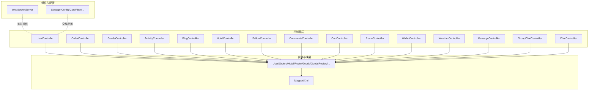
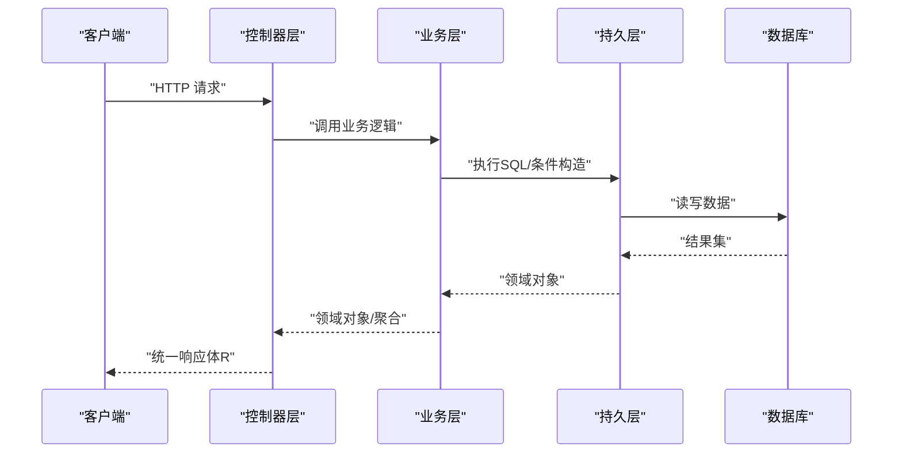
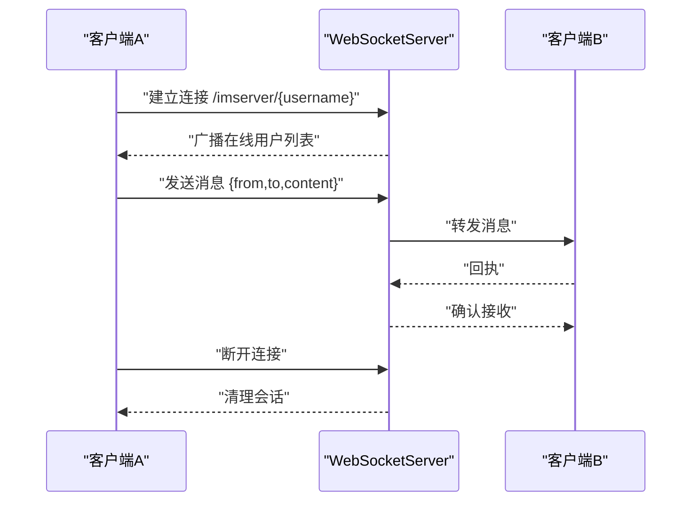
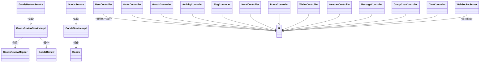

# API接口文档

<cite>
**本文引用的文件**
- [UserController.java](file://springboot-travel-social/src/main/java/com/cxx/controller/UserController.java)
- [OrderController.java](file://springboot-travel-social/src/main/java/com/cxx/controller/OrderController.java)
- [GoodsController.java](file://springboot-travel-social/src/main/java/com/cxx/controller/GoodsController.java)
- [ActivityController.java](file://springboot-travel-social/src/main/java/com/cxx/controller/ActivityController.java)
- [BlogController.java](file://springboot-travel-social/src/main/java/com/cxx/controller/BlogController.java)
- [HotelController.java](file://springboot-travel-social/src/main/java/com/cxx/controller/HotelController.java)
- [FollowController.java](file://springboot-travel-social/src/main/java/com/cxx/controller/FollowController.java)
- [CommentsController.java](file://springboot-travel-social/src/main/java/com/cxx/controller/CommentsController.java)
- [CartController.java](file://springboot-travel-social/src/main/java/com/cxx/controller/CartController.java)
- [RouteController.java](file://springboot-travel-social/src/main/java/com/cxx/controller/RouteController.java)
- [WalletController.java](file://springboot-travel-social/src/main/java/com/cxx/controller/WalletController.java)
- [WeatherController.java](file://springboot-travel-social/src/main/java/com/cxx/controller/WeatherController.java)
- [MessageController.java](file://springboot-travel-social/src/main/java/com/cxx/controller/MessageController.java)
- [GroupChatController.java](file://springboot-travel-social/src/main/java/com/cxx/controller/GroupChatController.java)
- [ChatController.java](file://springboot-travel-social/src/main/java/com/cxx/controller/ChatController.java)
- [WebSocketServer.java](file://springboot-travel-social/src/main/java/com/cxx/component/WebSocketServer.java)
- [GoodsReviewService.java](file://springboot-travel-social/src/main/java/com/cxx/service/GoodsReviewService.java)
- [GoodsReviewServiceImpl.java](file://springboot-travel-social/src/main/java/com/cxx/service/impl/GoodsReviewServiceImpl.java)
- [GoodsReviewMapper.java](file://springboot-travel-social/src/main/java/com/cxx/mapper/GoodsReviewMapper.java)
- [GoodsReview.java](file://springboot-travel-social/src/main/java/com/cxx/entity/GoodsReview.java)
- [GoodsService.java](file://springboot-travel-social/src/main/java/com/cxx/service/GoodsService.java)
- [GoodsServiceImpl.java](file://springboot-travel-social/src/main/java/com/cxx/service/impl/GoodsServiceImpl.java)
- [Goods.java](file://springboot-travel-social/src/main/java/com/cxx/entity/Goods.java)
- [R.java](file://springboot-travel-social/src/main/java/com/cxx/entity/R.java)
- [LoginFormDTO.java](file://springboot-travel-social/src/main/java/com/cxx/dto/LoginFormDTO.java)
- [application.properties](file://springboot-travel-social/src/main/resources/application.properties)
</cite>

## 目录
1. [简介](#简介)
2. [项目结构](#项目结构)
3. [核心组件](#核心组件)
4. [架构总览](#架构总览)
5. [详细接口文档](#详细接口文档)
6. [依赖关系分析](#依赖关系分析)
7. [性能与安全](#性能与安全)
8. [故障排查指南](#故障排查指南)
9. [结论](#结论)
10. [附录](#附录)

## 简介
本项目为"旅游攻略社交小程序"的后端服务，采用Spring Boot + MyBatis-Plus构建，提供RESTful API与WebSocket实时通信能力。本文档覆盖用户认证、社交互动、旅游服务、订单管理、商品评价、钱包、天气查询等模块的接口定义，包含请求方法、URL路径、参数说明、响应格式、错误处理与调用示例，并对WebSocket通信协议进行说明。

## 项目结构
后端采用标准的分层架构：控制器层（Controller）、业务层（Service）、持久层（Mapper/Entity）、工具与配置（Utils/Config）。控制器层统一返回统一响应体R，便于前端统一处理。

**图表来源**
- [UserController.java:31-136](file://springboot-travel-social/src/main/java/com/cxx/controller/UserController.java#L31-L136)
- [OrderController.java:12-55](file://springboot-travel-social/src/main/java/com/cxx/controller/OrderController.java#L12-L55)
- [GoodsController.java:12-51](file://springboot-travel-social/src/main/java/com/cxx/controller/GoodsController.java#L12-L51)
- [ActivityController.java:24-178](file://springboot-travel-social/src/main/java/com/cxx/controller/ActivityController.java#L24-L178)
- [BlogController.java:35-219](file://springboot-travel-social/src/main/java/com/cxx/controller/BlogController.java#L35-L219)
- [HotelController.java:16-133](file://springboot-travel-social/src/main/java/com/cxx/controller/HotelController.java#L16-L133)
- [FollowController.java:16-48](file://springboot-travel-social/src/main/java/com/cxx/controller/FollowController.java#L16-L48)
- [CommentsController.java:21-68](file://springboot-travel-social/src/main/java/com/cxx/controller/CommentsController.java#L21-L68)
- [CartController.java:13-93](file://springboot-travel-social/src/main/java/com/cxx/controller/CartController.java#L13-L93)
- [RouteController.java:21-129](file://springboot-travel-social/src/main/java/com/cxx/controller/RouteController.java#L21-L129)
- [WalletController.java:24-135](file://springboot-travel-social/src/main/java/com/cxx/controller/WalletController.java#L24-L135)
- [WeatherController.java:19-87](file://springboot-travel-social/src/main/java/com/cxx/controller/WeatherController.java#L19-L87)
- [MessageController.java:13-28](file://springboot-travel-social/src/main/java/com/cxx/controller/MessageController.java#L13-L28)
- [GroupChatController.java:18-42](file://springboot-travel-social/src/main/java/com/cxx/controller/GroupChatController.java#L18-L42)
- [ChatController.java:16-42](file://springboot-travel-social/src/main/java/com/cxx/controller/ChatController.java#L16-L42)
- [WebSocketServer.java:23-137](file://springboot-travel-social/src/main/java/com/cxx/component/WebSocketServer.java#L23-L137)

**章节来源**
- [application.properties](file://springboot-travel-social/src/main/resources/application.properties)

## 核心组件
- 统一响应体R：所有接口返回统一结构，包含状态码、消息与数据体，便于前后端约定。
- 控制器层：按功能域划分模块控制器，如UserController、OrderController、GoodsController等。
- WebSocket组件：提供IM实时通信能力，支持单聊广播、在线用户列表推送。
- 商品评价系统：独立的评价模块，支持商品评价查询与提交，包含评分验证与用户绑定。

**章节来源**
- [R.java](file://springboot-travel-social/src/main/java/com/cxx/entity/R.java)
- [WebSocketServer.java:23-137](file://springboot-travel-social/src/main/java/com/cxx/component/WebSocketServer.java#L23-L137)
- [GoodsController.java:12-51](file://springboot-travel-social/src/main/java/com/cxx/controller/GoodsController.java#L12-L51)

## 架构总览
后端通过REST接口对外提供服务，部分模块通过WebSocket实现长连接通信；全局拦截器与过滤器负责跨域、鉴权与限流等横切关注点。

**图表来源**
- [UserController.java:31-136](file://springboot-travel-social/src/main/java/com/cxx/controller/UserController.java#L31-L136)
- [OrderController.java:12-55](file://springboot-travel-social/src/main/java/com/cxx/controller/OrderController.java#L12-L55)
- [GoodsController.java:12-51](file://springboot-travel-social/src/main/java/com/cxx/controller/GoodsController.java#L12-L51)
- [BlogController.java:35-219](file://springboot-travel-social/src/main/java/com/cxx/controller/BlogController.java#L35-L219)

## 详细接口文档

### 一、用户认证与个人信息
- 1.1 发送邮箱验证码
  - 方法与路径：POST /user/sendMsg
  - 请求头：Content-Type: application/json
  - 请求体字段：
    - email: 字符串，必填，邮箱地址（含@qq.com）
  - 响应：统一响应体R
  - 说明：同一IP限制频率，超限将被锁定12小时
  - 示例(curl)：curl -X POST http://localhost:8080/user/sendMsg -H "Content-Type: application/json" -d '{"email":"user@xxx.com"}'

- 1.2 邮箱快捷登录
  - 方法与路径：POST /user/login
  - 请求体：LoginFormDTO
  - 响应：统一响应体R
  - 示例(curl)：curl -X POST http://localhost:8080/user/login -H "Content-Type: application/json" -d '{"email":"...","code":"..."}'

- 1.3 账号密码登录
  - 方法与路径：POST /user/login/email
  - 请求体：LoginFormDTO
  - 响应：统一响应体R

- 1.4 查询用户信息
  - 方法与路径：GET /user/queryUserById?userId=...
  - 响应：统一响应体R，数据为用户对象

- 1.5 总用户数
  - 方法与路径：GET /user/getTotalUserCount
  - 响应：统一响应体R

- 1.6 修改用户名
  - 方法与路径：PUT /user/updateUsername
  - 请求体：UpdateUsernameDTO
  - 响应：统一响应体R

- 1.7 修改密码
  - 方法与路径：PUT /user/updatePassword
  - 请求体：UpdatePasswordDTO
  - 响应：统一响应体R

- 1.8 修改头像
  - 方法与路径：PUT /user/updateAvatar
  - 请求体：UpdateAvatarDTO
  - 响应：统一响应体R

**章节来源**
- [UserController.java:31-136](file://springboot-travel-social/src/main/java/com/cxx/controller/UserController.java#L31-L136)
- [LoginFormDTO.java](file://springboot-travel-social/src/main/java/com/cxx/dto/LoginFormDTO.java)

### 二、社交互动
- 2.1 关注/取消关注
  - 方法与路径：PUT /follow/{id}/{isFollow}，DELETE /follow/cancelFollow/{followUserId}
  - 参数：路径变量id、isFollow布尔值；或路径变量followUserId
  - 响应：统一响应体R

- 2.2 是否已关注
  - 方法与路径：GET /follow/or/not?followUserId=...
  - 响应：统一响应体R

- 2.3 共同关注
  - 方法与路径：GET /follow/common?userId=...
  - 响应：统一响应体R

- 2.4 朋友圈动态
  - 方法与路径：GET /follow/friendCircle
  - 响应：统一响应体R

- 2.5 评论模块
  - 保存评论：POST /comments/save
  - 获取评论：GET /comments/getComments?foreignId=...
  - 删除评论：DELETE /comments/delComment?commentId=...
  - 获取用户评论：GET /comments/getCommentByUserId
  - 点赞评论：PUT /comments/likeComment/{commentId}
  - 响应：统一响应体R

- 2.6 游记模块
  - 热门游记：GET /blog/hot?pageNum=&pageSize=
  - 全部游记：GET /blog/queryBlog?pageNum=&pageSize=
  - 用户点赞游记：GET /blog/getUserLikeBlog
  - 关键词搜索：GET /blog/getBlogByKey/{key}
  - 浏览量：GET /blog/queryBrowse?blogId=&id=
  - 发布游记：POST /blog/save
  - 通过ID查询：GET /blog/queryBlogById?id=
  - 点赞：PUT /blog/like
  - 通过游记查用户ID：GET /blog/getBlogUserId?blogId=
  - 删除游记：DELETE /blog/deleteById/{blogId}
  - 我的游记：GET /blog/queryById?pageNum=&pageSize=&userId=
  - 我的攻略：GET /blog/queryStrategyById?userId=
  - 响应：统一响应体R

- 2.7 群聊模块
  - 群聊详情：GET /groupChat/getGroupChatInfo/{userId}
  - 我的群聊：GET /groupChat/getMyGroupChat/{userId}
  - 群成员：GET /groupChat/getGroupChatUserInfo/{chatId}
  - 响应：统一响应体R

- 2.8 私信历史
  - 方法与路径：GET /message/getHistoryMessage?senderId=&receiverId=
  - 响应：统一响应体R

**章节来源**
- [FollowController.java:16-48](file://springboot-travel-social/src/main/java/com/cxx/controller/FollowController.java#L16-L48)
- [CommentsController.java:21-68](file://springboot-travel-social/src/main/java/com/cxx/controller/CommentsController.java#L21-L68)
- [BlogController.java:35-219](file://springboot-travel-social/src/main/java/com/cxx/controller/BlogController.java#L35-L219)
- [GroupChatController.java:18-42](file://springboot-travel-social/src/main/java/com/cxx/controller/GroupChatController.java#L18-L42)
- [MessageController.java:13-28](file://springboot-travel-social/src/main/java/com/cxx/controller/MessageController.java#L13-L28)

### 三、商品评价系统
- 3.1 商品列表查询
  - 方法与路径：GET /goods/getGoodsList
  - 响应：统一响应体R，数据为商品列表（按价格降序排列）

- 3.2 商品详情查询
  - 方法与路径：GET /goods/getGoodsInfoById/{id}
  - 路径参数：id - 商品ID
  - 响应：统一响应体R，数据为商品详情

- 3.3 商品评价列表
  - 方法与路径：GET /goods/getReviews?goodsId=1
  - 查询参数：goodsId - 商品ID（必填）
  - 响应：统一响应体R，数据为评价列表（包含用户昵称和头像信息）
  - 说明：评价按创建时间降序排列，支持用户昵称和头像的关联查询

- 3.4 提交商品评价
  - 方法与路径：POST /goods/addReview
  - 请求体：GoodsReview对象
  - 请求体字段：
    - goodsId: 商品ID（必填）
    - orderNo: 订单号（选填）
    - rating: 评分（1-5，默认5）
    - content: 评价内容（必填）
    - images: 评价图片（JSON数组字符串，选填）
  - 响应：统一响应体R
  - 说明：自动绑定当前登录用户ID，评分默认5分且验证范围

**章节来源**
- [GoodsController.java:21-50](file://springboot-travel-social/src/main/java/com/cxx/controller/GoodsController.java#L21-L50)
- [GoodsReviewService.java:7-14](file://springboot-travel-social/src/main/java/com/cxx/service/GoodsReviewService.java#L7-L14)
- [GoodsReviewServiceImpl.java:17-38](file://springboot-travel-social/src/main/java/com/cxx/service/impl/GoodsReviewServiceImpl.java#L17-L38)
- [GoodsReviewMapper.java:11-22](file://springboot-travel-social/src/main/java/com/cxx/mapper/GoodsReviewMapper.java#L11-L22)
- [GoodsReview.java:18-58](file://springboot-travel-social/src/main/java/com/cxx/entity/GoodsReview.java#L18-L58)

### 四、旅游服务
- 4.1 酒店服务
  - 列表：GET /hotel/list?keyword=&star=&sortBy=&page=&pageSize=
    - sortBy支持：price_asc、price_desc、star_desc、distance_asc
  - 详情：GET /hotel/detail/{id}
  - 响应：统一响应体R，包含list/total或详情对象

- 4.2 路线服务
  - 分类：GET /route/getCategories
  - 列表：GET /route/getRouteList?keyword=&category=&page=&pageSize=
  - 详情：GET /route/detail/{id}
  - 响应：统一响应体R

- 4.3 天气服务
  - 实时天气：GET /api/weather/realtime?location=
  - 天气预警：GET /api/weather/warning?location=
  - 7天预报：GET /api/weather/forecast?location=
  - 城市搜索：GET /api/weather/search?location=&adm=&range=&number=&lang=
  - 响应：统一响应体R

**章节来源**
- [HotelController.java:16-133](file://springboot-travel-social/src/main/java/com/cxx/controller/HotelController.java#L16-L133)
- [RouteController.java:21-129](file://springboot-travel-social/src/main/java/com/cxx/controller/RouteController.java#L21-L129)
- [WeatherController.java:19-87](file://springboot-travel-social/src/main/java/com/cxx/controller/WeatherController.java#L19-L87)

### 五、订单与购物车
- 5.1 订单管理
  - 我的订单：GET /order/getOrderByUserId?status=
  - 确认收货：PUT /order/updateOrderStatus/{orderId}
  - 创建订单：POST /order/create
  - 删除订单：DELETE /order/deleteOrder/{orderNo}
  - 响应：统一响应体R

- 5.2 购物车
  - 查询购物车：GET /cart/getCartByUserId/{userId}
  - 加入购物车：POST /cart/addToCart
  - 移除商品：DELETE /cart/removeFromCart?userId=&goodsId=
  - 更新数量：PUT /cart/updateQuantity
  - 商品清单：GET /cart/getCartItems/{userId}
  - 清空购物车：DELETE /cart/clearCart/{userId}
  - 钱包支付：POST /cart/payWithWallet?userId=&orderId=
  - 响应：统一响应体R

- 5.3 钱包
  - 余额查询：GET /wallet/getBalance?userId=
  - 最近收支：GET /wallet/getRecentRecords?userId=&limit=
  - 所有收支：GET /wallet/getAllRecords?userId=
  - 充值：POST /wallet/recharge?userId=&amount=&bizId=
  - 提现：POST /wallet/withdraw?userId=&amount=&bizId=
  - 响应：统一响应体R

**章节来源**
- [OrderController.java:12-55](file://springboot-travel-social/src/main/java/com/cxx/controller/OrderController.java#L12-L55)
- [CartController.java:13-93](file://springboot-travel-social/src/main/java/com/cxx/controller/CartController.java#L13-L93)
- [WalletController.java:24-135](file://springboot-travel-social/src/main/java/com/cxx/controller/WalletController.java#L24-L135)

### 六、活动与内容
- 6.1 活动模块
  - 发布活动：POST /activity/createActivity
  - 已参加成员：GET /activity/getJoinedUserInfo/{acticityId}
  - 移除成员：DELETE /activity/removeJoinedUser?userId=&acticityId=
  - 活动列表：GET /activity/getActivityList?pageNum=&pageSize=&activityName=
  - 我的活动：GET /activity/getActivityListByUserId/{userId}
  - 活动详情：GET /activity/getActivityInfo/{activityId}
  - 删除活动：DELETE /activity/deleteById/{activityId}
  - 响应：统一响应体R

**章节来源**
- [ActivityController.java:24-178](file://springboot-travel-social/src/main/java/com/cxx/controller/ActivityController.java#L24-L178)

### 七、WebSocket实时通信
- 7.1 连接建立
  - URL：ws://host:port/imserver/{username}
  - 握手：携带路径参数username作为会话标识
  - 上线通知：服务端向所有客户端广播当前在线用户列表

- 7.2 消息格式
  - 发送方：{"from":"用户名","to":"用户名","content":"消息内容"}
  - 接收方：服务端转发对应用户的Session，或在未找到目标用户时广播

- 7.3 事件类型
  - OnOpen：用户上线，推送在线用户列表
  - OnMessage：消息中转，支持单聊
  - OnClose：用户离线，清理会话
  - OnError：异常日志记录

**图表来源**
- [WebSocketServer.java:23-137](file://springboot-travel-social/src/main/java/com/cxx/component/WebSocketServer.java#L23-L137)

**章节来源**
- [WebSocketServer.java:23-137](file://springboot-travel-social/src/main/java/com/cxx/component/WebSocketServer.java#L23-L137)

### 八、IM历史入库（WebHook）
- WebHook入口：POST /imserver/webHookImHistory
  - 请求参数：content（JSON数组字符串，元素为Message对象）
  - 响应：{"code":200,"content":"success"}

**章节来源**
- [ChatController.java:16-42](file://springboot-travel-social/src/main/java/com/cxx/controller/ChatController.java#L16-L42)

## 依赖关系分析
- 控制器依赖服务层，服务层依赖Mapper与实体；统一响应体R贯穿各层。
- 商品评价系统独立于主业务流程，通过GoodsReviewService实现评价查询与提交。
- WebSocketServer通过静态上下文注入UserService与MessageMapper，实现消息路由与持久化触发。
- 全局配置（如跨域、Swagger）影响控制器层的可访问性与文档生成。

**图表来源**
- [UserController.java:31-136](file://springboot-travel-social/src/main/java/com/cxx/controller/UserController.java#L31-L136)
- [OrderController.java:12-55](file://springboot-travel-social/src/main/java/com/cxx/controller/OrderController.java#L12-L55)
- [GoodsController.java:12-51](file://springboot-travel-social/src/main/java/com/cxx/controller/GoodsController.java#L12-L51)
- [ActivityController.java:24-178](file://springboot-travel-social/src/main/java/com/cxx/controller/ActivityController.java#L24-L178)
- [BlogController.java:35-219](file://springboot-travel-social/src/main/java/com/cxx/controller/BlogController.java#L35-L219)
- [HotelController.java:16-133](file://springboot-travel-social/src/main/java/com/cxx/controller/HotelController.java#L16-L133)
- [RouteController.java:21-129](file://springboot-travel-social/src/main/java/com/cxx/controller/RouteController.java#L21-L129)
- [WalletController.java:24-135](file://springboot-travel-social/src/main/java/com/cxx/controller/WalletController.java#L24-L135)
- [WeatherController.java:19-87](file://springboot-travel-social/src/main/java/com/cxx/controller/WeatherController.java#L19-L87)
- [MessageController.java:13-28](file://springboot-travel-social/src/main/java/com/cxx/controller/MessageController.java#L13-L28)
- [GroupChatController.java:18-42](file://springboot-travel-social/src/main/java/com/cxx/controller/GroupChatController.java#L18-L42)
- [ChatController.java:16-42](file://springboot-travel-social/src/main/java/com/cxx/controller/ChatController.java#L16-L42)
- [WebSocketServer.java:23-137](file://springboot-travel-social/src/main/java/com/cxx/component/WebSocketServer.java#L23-L137)
- [GoodsReviewService.java:7-14](file://springboot-travel-social/src/main/java/com/cxx/service/GoodsReviewService.java#L7-L14)
- [GoodsReviewServiceImpl.java:14-38](file://springboot-travel-social/src/main/java/com/cxx/service/impl/GoodsReviewServiceImpl.java#L14-L38)
- [GoodsReviewMapper.java:11-22](file://springboot-travel-social/src/main/java/com/cxx/mapper/GoodsReviewMapper.java#L11-L22)
- [GoodsReview.java:18-58](file://springboot-travel-social/src/main/java/com/cxx/entity/GoodsReview.java#L18-L58)
- [GoodsService.java:6-8](file://springboot-travel-social/src/main/java/com/cxx/service/GoodsService.java#L6-L8)
- [GoodsServiceImpl.java:10-12](file://springboot-travel-social/src/main/java/com/cxx/service/impl/GoodsServiceImpl.java#L10-L12)
- [Goods.java:18-36](file://springboot-travel-social/src/main/java/com/cxx/entity/Goods.java#L18-L36)
- [R.java](file://springboot-travel-social/src/main/java/com/cxx/entity/R.java)

## 性能与安全
- 性能特性
  - 分页查询广泛使用MyBatis-Plus Page，降低大列表查询压力。
  - 酒店/路线列表支持关键词与筛选，建议前端合理传参以减少无效扫描。
  - 购物车与订单操作建议结合缓存与幂等设计，避免重复下单。
  - 商品评价系统使用关联查询获取用户昵称和头像，注意数据库索引优化。
- 安全与鉴权
  - 登录流程包含邮箱验证码与账号密码两种方式，建议配合Token与拦截器实现会话管理。
  - 验证码接口对同一IP频率限制，防止暴力破解。
  - 商品评价自动绑定当前用户ID，防止越权操作。
  - 建议在生产环境启用HTTPS、CORS白名单与请求头校验。

## 故障排查指南
- 统一响应体R
  - 成功：code=1，msg=success，data=具体数据
  - 失败：code=0，msg=错误信息，data=null
- 常见问题
  - 验证码频繁获取：检查IP保护键是否过期或被锁定
  - 订单创建异常：捕获运行时异常与通用异常，返回明确提示
  - 购物车支付失败：余额不足、钱包禁用或购物车为空
  - 商品评价提交失败：检查用户登录状态、评分范围验证
  - WebSocket消息未达：确认目标用户是否在线，或检查会话映射

**章节来源**
- [R.java](file://springboot-travel-social/src/main/java/com/cxx/entity/R.java)
- [UserController.java:31-136](file://springboot-travel-social/src/main/java/com/cxx/controller/UserController.java#L31-L136)
- [OrderController.java:12-55](file://springboot-travel-social/src/main/java/com/cxx/controller/OrderController.java#L12-L55)
- [GoodsController.java:21-50](file://springboot-travel-social/src/main/java/com/cxx/controller/GoodsController.java#L21-L50)
- [CartController.java:13-93](file://springboot-travel-social/src/main/java/com/cxx/controller/CartController.java#L13-L93)
- [WebSocketServer.java:23-137](file://springboot-travel-social/src/main/java/com/cxx/component/WebSocketServer.java#L23-L137)

## 结论
本接口文档覆盖了用户认证、社交互动、商品评价、旅游服务、订单与钱包、天气查询以及WebSocket通信等核心能力。新增的商品评价系统提供了完整的商品评价查询与提交功能，增强了电商相关的用户体验。建议在生产环境中完善鉴权、限流与监控体系，并持续优化分页与缓存策略以提升用户体验。

## 附录
- API版本管理与兼容
  - 当前接口未显式声明版本号，建议在URL前缀增加/v1、/v2等版本段，或通过Accept头协商版本，确保向后兼容。
- 请求头与认证
  - Content-Type: application/json
  - 如启用Token，建议在Header中携带Authorization: Bearer {token}
- 错误码约定
  - 成功：code=1
  - 失败：code=0，msg包含错误描述
- 商品评价系统特殊说明
  - 评分范围：1-5分，超出范围自动设为默认5分
  - 用户绑定：评价自动绑定当前登录用户ID
  - 数据关联：评价查询自动关联用户昵称和头像信息