# 旅游服务接口

<cite>
**本文引用的文件**
- [AttractionsController.java](file://springboot-travel-social/src/main/java/com/cxx/controller/AttractionsController.java)
- [HotelController.java](file://springboot-travel-social/src/main/java/com/cxx/controller/HotelController.java)
- [FoodController.java](file://springboot-travel-social/src/main/java/com/cxx/controller/FoodController.java)
- [RouteController.java](file://springboot-travel-social/src/main/java/com/cxx/controller/RouteController.java)
- [InsuranceController.java](file://springboot-travel-social/src/main/java/com/cxx/controller/InsuranceController.java)
- [TaxiOrderController.java](file://springboot-travel-social/src/main/java/com/cxx/controller/TaxiOrderController.java)
- [RoutePlanningController.java](file://springboot-travel-social/src/main/java/com/cxx/controller/RoutePlanningController.java)
- [HotelOrderController.java](file://springboot-travel-social/src/main/java/com/cxx/controller/HotelOrderController.java)
- [FoodOrderController.java](file://springboot-travel-social/src/main/java/com/cxx/controller/FoodOrderController.java)
- [RouteOrderController.java](file://springboot-travel-social/src/main/java/com/cxx/controller/RouteOrderController.java)
- [GoodsController.java](file://springboot-travel-social/src/main/java/com/cxx/controller/GoodsController.java)
- [GoodsReview.java](file://springboot-travel-social/src/main/java/com/cxx/entity/GoodsReview.java)
- [GoodsReviewMapper.java](file://springboot-travel-social/src/main/java/com/cxx/mapper/GoodsReviewMapper.java)
- [GoodsReviewService.java](file://springboot-travel-social/src/main/java/com/cxx/service/GoodsReviewService.java)
- [GoodsReviewServiceImpl.java](file://springboot-travel-social/src/main/java/com/cxx/service/impl/GoodsReviewServiceImpl.java)
- [Goods.java](file://springboot-travel-social/src/main/java/com/cxx/entity/Goods.java)
- [Attractions.java](file://springboot-travel-social/src/main/java/com/cxx/entity/Attractions.java)
- [Hotel.java](file://springboot-travel-social/src/main/java/com/cxx/entity/Hotel.java)
- [Food.java](file://springboot-travel-social/src/main/java/com/cxx/entity/Food.java)
- [MapApiUtils.java](file://springboot-travel-social/src/main/java/com/cxx/utils/MapApiUtils.java)
- [RoutePlanningUtils.java](file://springboot-travel-social/src/main/java/com/cxx/utils/RoutePlanningUtils.java)
</cite>

## 目录
1. [简介](#简介)
2. [项目结构](#项目结构)
3. [核心组件](#核心组件)
4. [架构总览](#架构总览)
5. [详细组件分析](#详细组件分析)
6. [依赖分析](#依赖分析)
7. [性能考虑](#性能考虑)
8. [故障排查指南](#故障排查指南)
9. [结论](#结论)
10. [附录](#附录)

## 简介
本文件面向"旅游服务接口"的后端API，覆盖以下能力：
- 景点信息服务：查询、详情、评分与评价
- 酒店预订服务：房间查询、价格计算、预订确认与支付
- 美食推荐与订单服务：菜品详情、下单流程、支付集成
- 交通出行服务：出租车预约、路线规划
- 保险购买服务：保险列表、详情、购买与订单管理
- 商品评价服务：商品评价查询与提交功能
- 地理位置服务：基于高德/百度地图的地理编码与兴趣点检索
- 分页查询、条件筛选、排序等通用能力

## 项目结构
后端采用Spring Boot工程，控制器层按功能域划分，统一返回包装对象，便于前端消费。

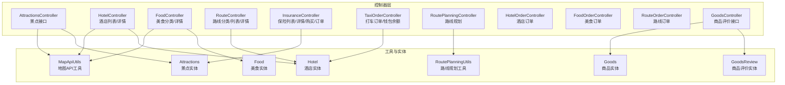

**更新** 新增商品评价服务模块，包括商品评价实体、数据访问层、服务层和控制器

图表来源
- [AttractionsController.java:1-61](file://springboot-travel-social/src/main/java/com/cxx/controller/AttractionsController.java#L1-L61)
- [HotelController.java:1-133](file://springboot-travel-social/src/main/java/com/cxx/controller/HotelController.java#L1-L133)
- [FoodController.java:1-168](file://springboot-travel-social/src/main/java/com/cxx/controller/FoodController.java#L1-L168)
- [RouteController.java:1-129](file://springboot-travel-social/src/main/java/com/cxx/controller/RouteController.java#L1-L129)
- [InsuranceController.java:1-138](file://springboot-travel-social/src/main/java/com/cxx/controller/InsuranceController.java#L1-L138)
- [TaxiOrderController.java:1-208](file://springboot-travel-social/src/main/java/com/cxx/controller/TaxiOrderController.java#L1-L208)
- [RoutePlanningController.java:1-31](file://springboot-travel-social/src/main/java/com/cxx/controller/RoutePlanningController.java#L1-L31)
- [HotelOrderController.java:1-104](file://springboot-travel-social/src/main/java/com/cxx/controller/HotelOrderController.java#L1-L104)
- [FoodOrderController.java:1-119](file://springboot-travel-social/src/main/java/com/cxx/controller/FoodOrderController.java#L1-L119)
- [RouteOrderController.java:1-112](file://springboot-travel-social/src/main/java/com/cxx/controller/RouteOrderController.java#L1-L112)
- [GoodsController.java:1-51](file://springboot-travel-social/src/main/java/com/cxx/controller/GoodsController.java#L1-L51)
- [GoodsReview.java:1-58](file://springboot-travel-social/src/main/java/com/cxx/entity/GoodsReview.java#L1-L58)
- [MapApiUtils.java:1-45](file://springboot-travel-social/src/main/java/com/cxx/utils/MapApiUtils.java#L1-L45)
- [RoutePlanningUtils.java:1-36](file://springboot-travel-social/src/main/java/com/cxx/utils/RoutePlanningUtils.java#L1-L36)

章节来源
- [AttractionsController.java:1-61](file://springboot-travel-social/src/main/java/com/cxx/controller/AttractionsController.java#L1-L61)
- [HotelController.java:1-133](file://springboot-travel-social/src/main/java/com/cxx/controller/HotelController.java#L1-L133)
- [FoodController.java:1-168](file://springboot-travel-social/src/main/java/com/cxx/controller/FoodController.java#L1-L168)
- [RouteController.java:1-129](file://springboot-travel-social/src/main/java/com/cxx/controller/RouteController.java#L1-L129)
- [InsuranceController.java:1-138](file://springboot-travel-social/src/main/java/com/cxx/controller/InsuranceController.java#L1-L138)
- [TaxiOrderController.java:1-208](file://springboot-travel-social/src/main/java/com/cxx/controller/TaxiOrderController.java#L1-L208)
- [RoutePlanningController.java:1-31](file://springboot-travel-social/src/main/java/com/cxx/controller/RoutePlanningController.java#L1-L31)
- [HotelOrderController.java:1-104](file://springboot-travel-social/src/main/java/com/cxx/controller/HotelOrderController.java#L1-L104)
- [FoodOrderController.java:1-119](file://springboot-travel-social/src/main/java/com/cxx/controller/FoodOrderController.java#L1-L119)
- [RouteOrderController.java:1-112](file://springboot-travel-social/src/main/java/com/cxx/controller/RouteOrderController.java#L1-L112)
- [GoodsController.java:1-51](file://springboot-travel-social/src/main/java/com/cxx/controller/GoodsController.java#L1-L51)
- [GoodsReview.java:1-58](file://springboot-travel-social/src/main/java/com/cxx/entity/GoodsReview.java#L1-L58)
- [MapApiUtils.java:1-45](file://springboot-travel-social/src/main/java/com/cxx/utils/MapApiUtils.java#L1-L45)
- [RoutePlanningUtils.java:1-36](file://springboot-travel-social/src/main/java/com/cxx/utils/RoutePlanningUtils.java#L1-L36)

## 核心组件
- 景点服务：按省/名称查询、按ID查看详情
- 酒店服务：关键词/星级/排序/分页查询；详情适配前端字段
- 美食服务：分类列表、分类+关键词筛选、详情模拟数据
- 路线服务：分类列表、关键词+分类筛选、分页、详情
- 保险服务：列表/详情、购买（订单创建）、订单列表/详情
- 出行服务：打车订单创建/查询/取消/确认到达/删除、钱包余额查询
- 商品评价服务：商品评价查询（含用户昵称头像）、评价提交
- 订单服务：酒店/美食/路线订单创建、支付、取消
- 地图服务：地理逆编码、兴趣点检索、路线规划

**更新** 新增商品评价服务，支持商品评价的查询和提交功能

章节来源
- [AttractionsController.java:21-60](file://springboot-travel-social/src/main/java/com/cxx/controller/AttractionsController.java#L21-L60)
- [HotelController.java:27-131](file://springboot-travel-social/src/main/java/com/cxx/controller/HotelController.java#L27-L131)
- [FoodController.java:27-166](file://springboot-travel-social/src/main/java/com/cxx/controller/FoodController.java#L27-L166)
- [RouteController.java:32-128](file://springboot-travel-social/src/main/java/com/cxx/controller/RouteController.java#L32-L128)
- [InsuranceController.java:31-112](file://springboot-travel-social/src/main/java/com/cxx/controller/InsuranceController.java#L31-L112)
- [TaxiOrderController.java:33-207](file://springboot-travel-social/src/main/java/com/cxx/controller/TaxiOrderController.java#L33-L207)
- [GoodsController.java:33-49](file://springboot-travel-social/src/main/java/com/cxx/controller/GoodsController.java#L33-L49)
- [HotelOrderController.java:29-103](file://springboot-travel-social/src/main/java/com/cxx/controller/HotelOrderController.java#L29-L103)
- [FoodOrderController.java:30-118](file://springboot-travel-social/src/main/java/com/cxx/controller/FoodOrderController.java#L30-L118)
- [RouteOrderController.java:26-111](file://springboot-travel-social/src/main/java/com/cxx/controller/RouteOrderController.java#L26-L111)
- [MapApiUtils.java:19-43](file://springboot-travel-social/src/main/java/com/cxx/utils/MapApiUtils.java#L19-L43)
- [RoutePlanningUtils.java:23-34](file://springboot-travel-social/src/main/java/com/cxx/utils/RoutePlanningUtils.java#L23-L34)

## 架构总览
后端以REST风格暴露接口，统一返回包装对象，控制器负责参数解析与调用服务层，工具类封装第三方地图API。

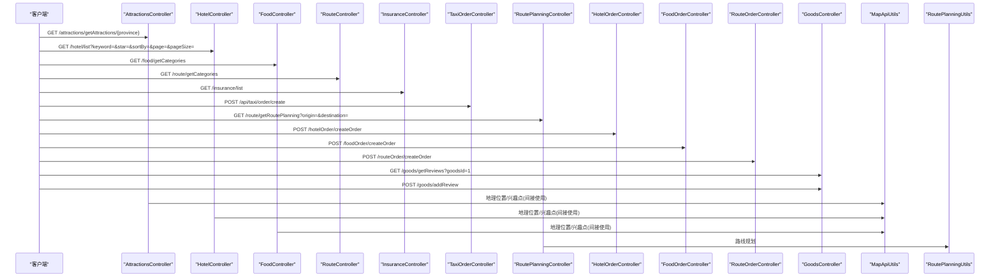

**更新** 新增商品评价接口调用序列，包括评价查询和提交功能

图表来源
- [AttractionsController.java:21-60](file://springboot-travel-social/src/main/java/com/cxx/controller/AttractionsController.java#L21-L60)
- [HotelController.java:27-131](file://springboot-travel-social/src/main/java/com/cxx/controller/HotelController.java#L27-L131)
- [FoodController.java:27-166](file://springboot-travel-social/src/main/java/com/cxx/controller/FoodController.java#L27-L166)
- [RouteController.java:32-128](file://springboot-travel-social/src/main/java/com/cxx/controller/RouteController.java#L32-L128)
- [InsuranceController.java:31-112](file://springboot-travel-social/src/main/java/com/cxx/controller/InsuranceController.java#L31-L112)
- [TaxiOrderController.java:33-207](file://springboot-travel-social/src/main/java/com/cxx/controller/TaxiOrderController.java#L33-L207)
- [RoutePlanningController.java:25-29](file://springboot-travel-social/src/main/java/com/cxx/controller/RoutePlanningController.java#L25-L29)
- [HotelOrderController.java:43-103](file://springboot-travel-social/src/main/java/com/cxx/controller/HotelOrderController.java#L43-L103)
- [FoodOrderController.java:47-118](file://springboot-travel-social/src/main/java/com/cxx/controller/FoodOrderController.java#L47-L118)
- [RouteOrderController.java:45-111](file://springboot-travel-social/src/main/java/com/cxx/controller/RouteOrderController.java#L45-L111)
- [GoodsController.java:33-49](file://springboot-travel-social/src/main/java/com/cxx/controller/GoodsController.java#L33-L49)
- [MapApiUtils.java:19-43](file://springboot-travel-social/src/main/java/com/cxx/utils/MapApiUtils.java#L19-L43)
- [RoutePlanningUtils.java:23-34](file://springboot-travel-social/src/main/java/com/cxx/utils/RoutePlanningUtils.java#L23-L34)

## 详细组件分析

### 景点信息服务
- 接口能力
  - 根据省份查询景点（按评分降序）
  - 根据名称模糊查询（按评分降序）
  - 根据ID查询详情
- 参数与返回
  - 路径参数：省名、景点ID（URL编码需解码）
  - 返回统一包装对象，包含景点列表或单个景点详情
- 示例
  - GET /attractions/getAttractions/北京
  - GET /attractions/getAttractionByName/故宫
  - GET /attractions/getAttractionsById/1001

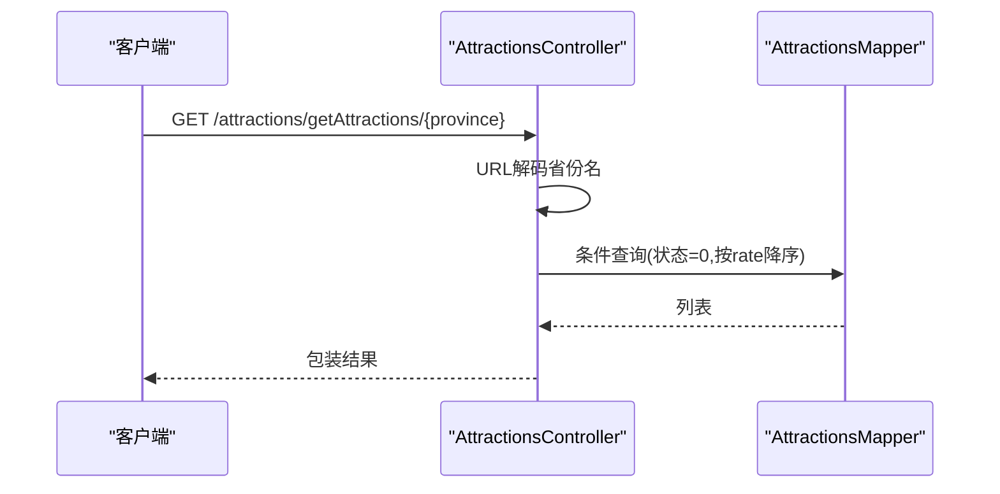

图表来源
- [AttractionsController.java:21-36](file://springboot-travel-social/src/main/java/com/cxx/controller/AttractionsController.java#L21-L36)
- [Attractions.java:1-41](file://springboot-travel-social/src/main/java/com/cxx/entity/Attractions.java#L1-L41)

章节来源
- [AttractionsController.java:21-60](file://springboot-travel-social/src/main/java/com/cxx/controller/AttractionsController.java#L21-L60)
- [Attractions.java:1-41](file://springboot-travel-social/src/main/java/com/cxx/entity/Attractions.java#L1-L41)

### 酒店预订服务
- 接口能力
  - 酒店列表：关键词（名称/地址）、星级、排序（价格升/降、星级降、距离升）、分页
  - 酒店详情：适配前端字段（含设施、经纬度、图片数组）
- 参数与返回
  - 查询参数：keyword、star、sortBy、page、pageSize
  - sortBy可选值：price_asc、price_desc、star_desc、distance_asc
  - 返回统一包装对象，包含list、total等
- 示例
  - GET /hotel/list?keyword=市中心&star=4&sortBy=price_asc&page=1&pageSize=10
  - GET /hotel/detail/1001

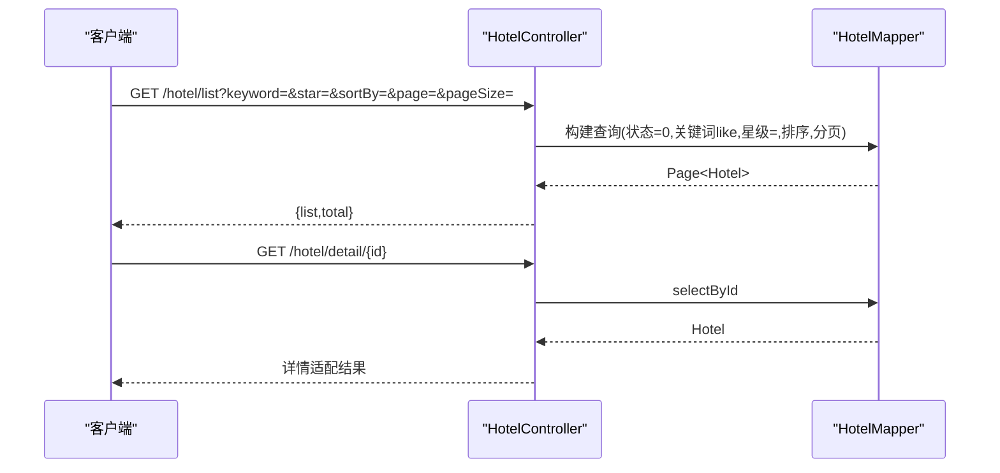

图表来源
- [HotelController.java:27-131](file://springboot-travel-social/src/main/java/com/cxx/controller/HotelController.java#L27-L131)
- [Hotel.java:1-30](file://springboot-travel-social/src/main/java/com/cxx/entity/Hotel.java#L1-L30)

章节来源
- [HotelController.java:27-131](file://springboot-travel-social/src/main/java/com/cxx/controller/HotelController.java#L27-L131)
- [Hotel.java:1-30](file://springboot-travel-social/src/main/java/com/cxx/entity/Hotel.java#L1-L30)

### 美食推荐与订单服务
- 接口能力
  - 美食分类：固定分类列表
  - 分类+关键词筛选：按评分降序
  - 美食详情：模拟图片、标签、营业时间、推荐菜品、评价
- 订单能力
  - 根据用户ID查询订单列表
  - 创建订单：补充商品信息、创建时间
  - 支付订单：按订单状态与余额判定
  - 取消订单：按状态变更控制
- 示例
  - GET /food/getCategories
  - GET /food/getFoodByCategory?category=地方特色&keyword=烤鸭
  - GET /food/detail/1001
  - GET /foodOrder/getOrdersByUserId?userId=10001
  - POST /foodOrder/createOrder
  - POST /foodOrder/payOrder
  - POST /foodOrder/cancelOrder

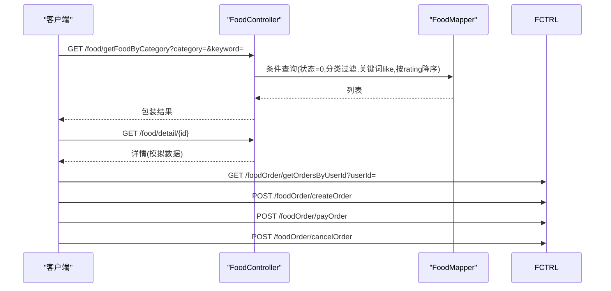

图表来源
- [FoodController.java:27-166](file://springboot-travel-social/src/main/java/com/cxx/controller/FoodController.java#L27-L166)
- [Food.java:1-32](file://springboot-travel-social/src/main/java/com/cxx/entity/Food.java#L1-L32)
- [FoodOrderController.java:30-118](file://springboot-travel-social/src/main/java/com/cxx/controller/FoodOrderController.java#L30-L118)

章节来源
- [FoodController.java:27-166](file://springboot-travel-social/src/main/java/com/cxx/controller/FoodController.java#L27-L166)
- [Food.java:1-32](file://springboot-travel-social/src/main/java/com/cxx/entity/Food.java#L1-L32)
- [FoodOrderController.java:30-118](file://springboot-travel-social/src/main/java/com/cxx/controller/FoodOrderController.java#L30-L118)

### 路线服务与订单
- 接口能力
  - 路线分类：去重列表（含"全部"）
  - 路线列表：关键词（标题/目的地）、分类筛选、分页
  - 路线详情：状态校验
- 订单能力
  - 根据用户ID查询订单列表
  - 创建订单：校验金额>0、补全创建时间
  - 支付订单：按状态与余额判定
  - 取消订单：按状态变更控制
- 示例
  - GET /route/getCategories
  - GET /route/getRouteList?keyword=&category=&page=&pageSize=
  - GET /route/detail/1001
  - GET /routeOrder/getOrdersByUserId?userId=10001
  - POST /routeOrder/createOrder
  - POST /routeOrder/payOrder
  - POST /routeOrder/cancelOrder

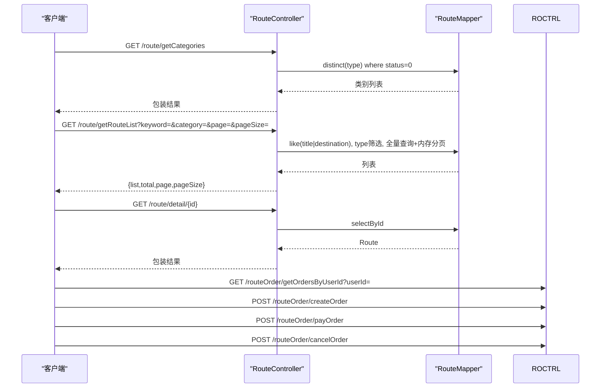

图表来源
- [RouteController.java:32-128](file://springboot-travel-social/src/main/java/com/cxx/controller/RouteController.java#L32-L128)
- [RouteOrderController.java:26-111](file://springboot-travel-social/src/main/java/com/cxx/controller/RouteOrderController.java#L26-L111)

章节来源
- [RouteController.java:32-128](file://springboot-travel-social/src/main/java/com/cxx/controller/RouteController.java#L32-L128)
- [RouteOrderController.java:26-111](file://springboot-travel-social/src/main/java/com/cxx/controller/RouteOrderController.java#L26-L111)

### 保险购买服务
- 接口能力
  - 保险列表：查询有效保险
  - 保险详情：按ID查询
  - 购买保险：创建保险订单（用户ID、保险ID、起止时间）
  - 保险订单：列表、详情
- 时间格式
  - 请求体时间字段使用特定JSON格式化模式与时区，确保与实体一致
- 示例
  - GET /insurance/list
  - GET /insurance/detail/1001
  - POST /insurance/buy（请求体包含userId、insuranceId、startTime、endTime）
  - GET /insurance/order/list?userId=10001
  - GET /insurance/order/detail/100001

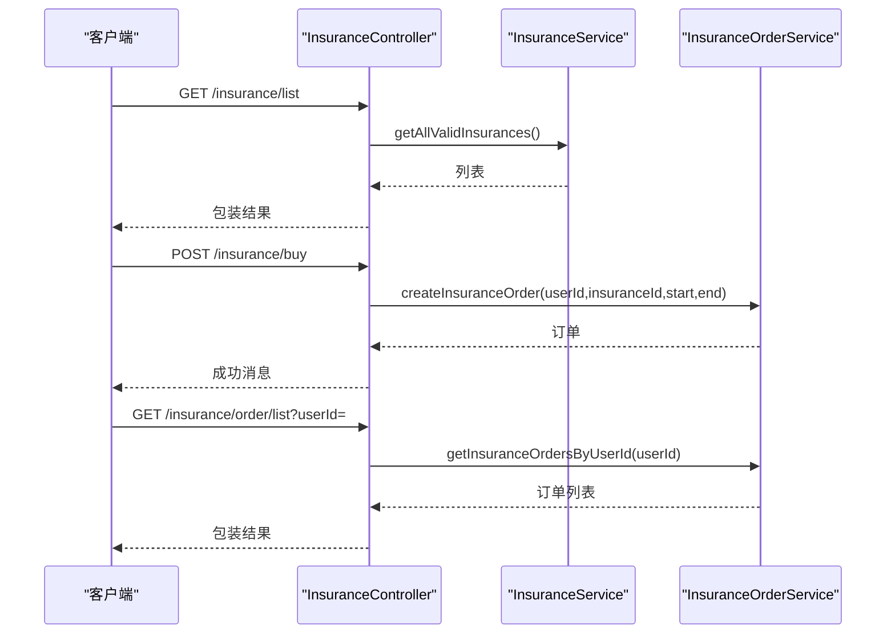

图表来源
- [InsuranceController.java:31-112](file://springboot-travel-social/src/main/java/com/cxx/controller/InsuranceController.java#L31-L112)

章节来源
- [InsuranceController.java:31-112](file://springboot-travel-social/src/main/java/com/cxx/controller/InsuranceController.java#L31-L112)

### 商品评价服务
- 接口能力
  - 商品评价查询：根据商品ID查询评价列表，关联用户昵称和头像，按创建时间倒序
  - 商品评价提交：登录用户提交评价，自动填充用户ID，评分默认5分（1-5范围内）
- 参数与返回
  - 查询参数：goodsId（Long）
  - 提交参数：GoodsReview对象（包含商品ID、评分、内容、图片等）
  - 返回统一包装对象，包含评价列表或操作结果
- 示例
  - GET /goods/getReviews?goodsId=1
  - POST /goods/addReview（请求体包含商品ID、评分、内容、图片等）

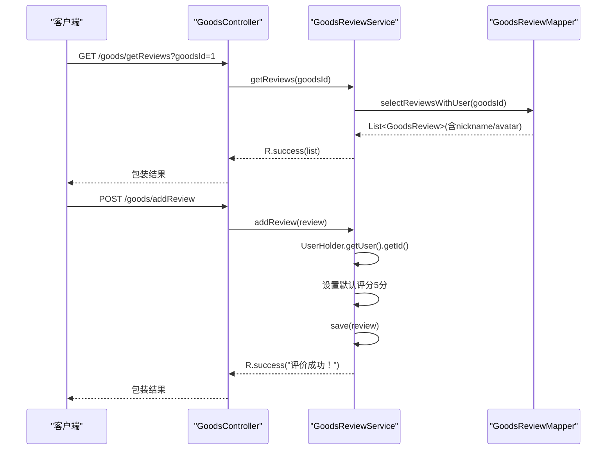

**新增** 商品评价服务的完整接口流程，包括查询和提交两个核心功能

图表来源
- [GoodsController.java:33-49](file://springboot-travel-social/src/main/java/com/cxx/controller/GoodsController.java#L33-L49)
- [GoodsReviewService.java:9-14](file://springboot-travel-social/src/main/java/com/cxx/service/GoodsReviewService.java#L9-L14)
- [GoodsReviewMapper.java:16-21](file://springboot-travel-social/src/main/java/com/cxx/mapper/GoodsReviewMapper.java#L16-L21)
- [GoodsReviewServiceImpl.java:18-37](file://springboot-travel-social/src/main/java/com/cxx/service/impl/GoodsReviewServiceImpl.java#L18-L37)

章节来源
- [GoodsController.java:33-49](file://springboot-travel-social/src/main/java/com/cxx/controller/GoodsController.java#L33-L49)
- [GoodsReviewService.java:9-14](file://springboot-travel-social/src/main/java/com/cxx/service/GoodsReviewService.java#L9-L14)
- [GoodsReviewMapper.java:16-21](file://springboot-travel-social/src/main/java/com/cxx/mapper/GoodsReviewMapper.java#L16-L21)
- [GoodsReviewServiceImpl.java:18-37](file://springboot-travel-social/src/main/java/com/cxx/service/impl/GoodsReviewServiceImpl.java#L18-L37)

### 出行服务（出租车）
- 接口能力
  - 创建订单：需要登录态
  - 订单列表：按当前用户查询
  - 订单详情：鉴权校验
  - 取消订单：按当前用户与状态控制
  - 确认到达：多参数兼容（路径/查询/请求体）
  - 快速状态更新：测试用途
  - 删除订单：按当前用户与存在性校验
  - 查询钱包余额：按当前用户
- 示例
  - POST /api/taxi/order/create
  - GET /api/taxi/order/list
  - GET /api/taxi/order/detail/{id}
  - POST /api/taxi/order/cancel/{id}
  - POST /api/taxi/order/confirm/{id}
  - POST /api/taxi/order/wallet/balance

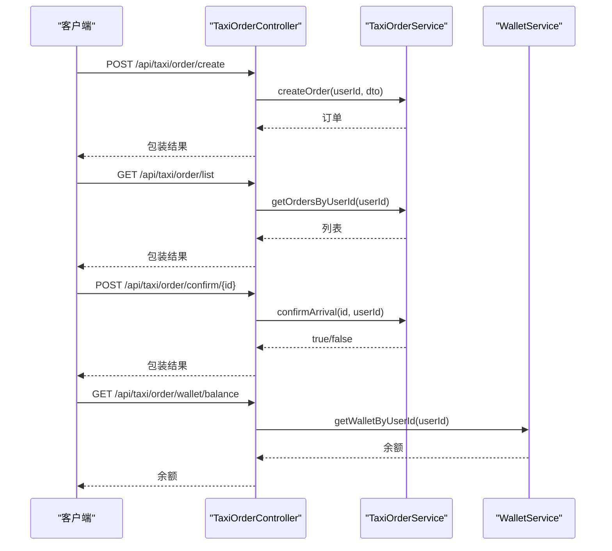

图表来源
- [TaxiOrderController.java:33-207](file://springboot-travel-social/src/main/java/com/cxx/controller/TaxiOrderController.java#L33-L207)

章节来源
- [TaxiOrderController.java:33-207](file://springboot-travel-social/src/main/java/com/cxx/controller/TaxiOrderController.java#L33-L207)

### 地理位置与路线规划
- 地图API工具
  - 百度地图逆地理编码（高德AK）
  - 高德地图输入提示（兴趣点检索）
- 路线规划工具
  - 百度地图驾车路线规划
- 示例
  - GET /route/getRoutePlanning?origin=起点&destination=终点

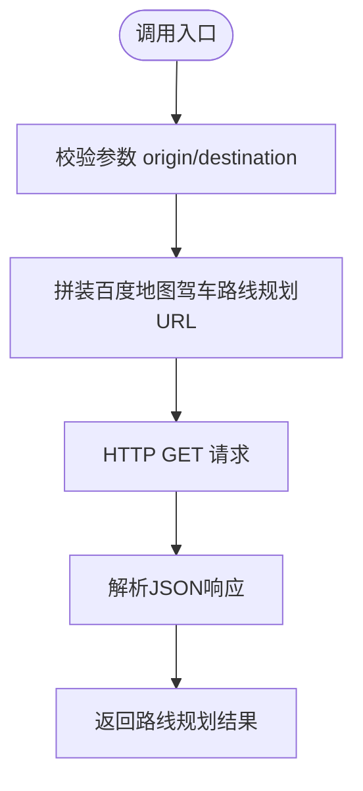

图表来源
- [RoutePlanningController.java:25-29](file://springboot-travel-social/src/main/java/com/cxx/controller/RoutePlanningController.java#L25-L29)
- [RoutePlanningUtils.java:23-34](file://springboot-travel-social/src/main/java/com/cxx/utils/RoutePlanningUtils.java#L23-L34)

章节来源
- [MapApiUtils.java:19-43](file://springboot-travel-social/src/main/java/com/cxx/utils/MapApiUtils.java#L19-L43)
- [RoutePlanningUtils.java:23-34](file://springboot-travel-social/src/main/java/com/cxx/utils/RoutePlanningUtils.java#L23-L34)
- [RoutePlanningController.java:25-29](file://springboot-travel-social/src/main/java/com/cxx/controller/RoutePlanningController.java#L25-L29)

## 依赖分析
- 控制器与实体
  - 景点/酒店/美食控制器分别依赖对应实体类
  - 商品评价控制器依赖商品评价实体和商品实体
- 控制器与工具
  - 地图相关能力通过工具类封装，控制器仅做调用
- 控制器与服务
  - 订单类控制器依赖各自服务层完成业务逻辑（创建、支付、取消）
  - 商品评价控制器依赖商品评价服务层处理评价业务

**更新** 新增商品评价相关依赖关系，包括实体、数据访问层、服务层的完整依赖链

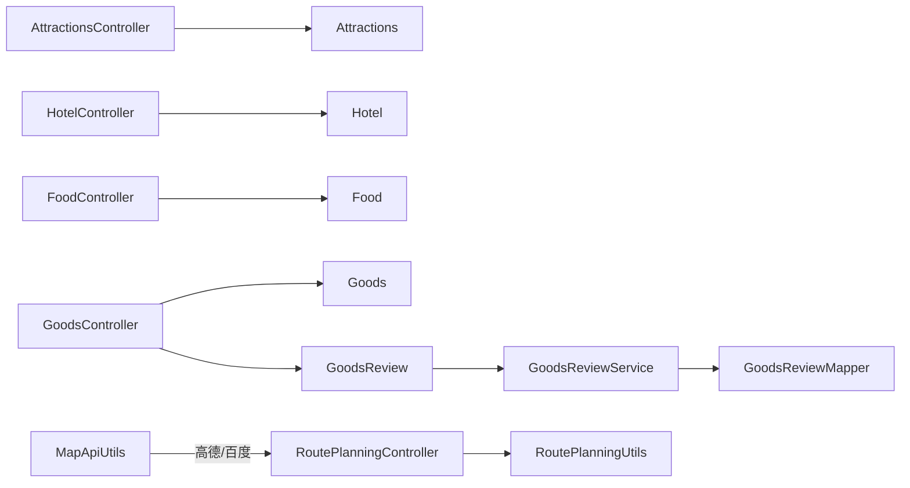

图表来源
- [AttractionsController.java:1-61](file://springboot-travel-social/src/main/java/com/cxx/controller/AttractionsController.java#L1-L61)
- [HotelController.java:1-133](file://springboot-travel-social/src/main/java/com/cxx/controller/HotelController.java#L1-L133)
- [FoodController.java:1-168](file://springboot-travel-social/src/main/java/com/cxx/controller/FoodController.java#L1-L168)
- [GoodsController.java:1-51](file://springboot-travel-social/src/main/java/com/cxx/controller/GoodsController.java#L1-L51)
- [GoodsReview.java:1-58](file://springboot-travel-social/src/main/java/com/cxx/entity/GoodsReview.java#L1-L58)
- [RoutePlanningController.java:1-31](file://springboot-travel-social/src/main/java/com/cxx/controller/RoutePlanningController.java#L1-L31)
- [RoutePlanningUtils.java:1-36](file://springboot-travel-social/src/main/java/com/cxx/utils/RoutePlanningUtils.java#L1-L36)
- [MapApiUtils.java:1-45](file://springboot-travel-social/src/main/java/com/cxx/utils/MapApiUtils.java#L1-L45)

章节来源
- [AttractionsController.java:1-61](file://springboot-travel-social/src/main/java/com/cxx/controller/AttractionsController.java#L1-L61)
- [HotelController.java:1-133](file://springboot-travel-social/src/main/java/com/cxx/controller/HotelController.java#L1-L133)
- [FoodController.java:1-168](file://springboot-travel-social/src/main/java/com/cxx/controller/FoodController.java#L1-L168)
- [GoodsController.java:1-51](file://springboot-travel-social/src/main/java/com/cxx/controller/GoodsController.java#L1-L51)
- [GoodsReview.java:1-58](file://springboot-travel-social/src/main/java/com/cxx/entity/GoodsReview.java#L1-L58)
- [RoutePlanningController.java:1-31](file://springboot-travel-social/src/main/java/com/cxx/controller/RoutePlanningController.java#L1-L31)
- [RoutePlanningUtils.java:1-36](file://springboot-travel-social/src/main/java/com/cxx/utils/RoutePlanningUtils.java#L1-L36)
- [MapApiUtils.java:1-45](file://springboot-travel-social/src/main/java/com/cxx/utils/MapApiUtils.java#L1-L45)

## 性能考虑
- 分页查询
  - 酒店列表使用分页组件，避免一次性加载大量数据
  - 路线列表采用全量查询+内存分页，建议后续迁移至数据库分页
- 排序策略
  - 酒店支持多维度排序；路线规划接口直接返回第三方JSON，无需本地排序
- 缓存与限流
  - 工具类直接发起HTTP请求，建议在网关或工具层增加缓存与限流策略
- 数据一致性
  - 订单支付/取消依赖状态机，建议结合分布式锁或幂等设计
- 商品评价查询
  - 评价查询使用关联查询获取用户昵称和头像，建议在数据库层面建立适当的索引以提升查询性能

**更新** 新增商品评价查询的性能考虑，包括数据库索引优化建议

## 故障排查指南
- 统一返回包装
  - 所有接口返回统一包装对象，错误信息通过包装对象承载
- 登录态校验
  - 出行/订单相关接口对登录态进行前置校验，未登录返回明确提示
- 参数校验
  - 订单创建/支付/取消接口对关键参数进行非空与范围校验
  - 商品评价提交接口对评分范围进行校验，默认值处理
- 异常捕获
  - 订单与保险接口对运行时异常与通用异常进行捕获并返回友好提示
  - 商品评价提交接口对异常情况进行捕获并返回错误信息

**更新** 新增商品评价相关的异常处理和参数校验说明

章节来源
- [TaxiOrderController.java:33-207](file://springboot-travel-social/src/main/java/com/cxx/controller/TaxiOrderController.java#L33-L207)
- [HotelOrderController.java:43-103](file://springboot-travel-social/src/main/java/com/cxx/controller/HotelOrderController.java#L43-L103)
- [FoodOrderController.java:47-118](file://springboot-travel-social/src/main/java/com/cxx/controller/FoodOrderController.java#L47-L118)
- [RouteOrderController.java:45-111](file://springboot-travel-social/src/main/java/com/cxx/controller/RouteOrderController.java#L45-L111)
- [InsuranceController.java:62-112](file://springboot-travel-social/src/main/java/com/cxx/controller/InsuranceController.java#L62-L112)
- [GoodsReviewServiceImpl.java:24-37](file://springboot-travel-social/src/main/java/com/cxx/service/impl/GoodsReviewServiceImpl.java#L24-L37)

## 结论
本项目围绕"景点、酒店、美食、路线、保险、出行、订单、地图、商品评价"九大模块构建了完整的旅游服务API体系。接口设计遵循统一返回、参数校验与登录态校验，具备分页、筛选、排序等通用能力。新增的商品评价功能完善了商品交易后的用户反馈机制，支持评价查询和提交，提升了用户体验。建议后续优化方向包括：数据库分页迁移、缓存与限流增强、状态机与幂等保障、第三方API接入监控与降级、商品评价查询性能优化。

**更新** 在结论中新增商品评价功能的总结和后续优化建议

## 附录
- 接口调用示例（路径与参数）
  - 景点
    - GET /attractions/getAttractions/北京
    - GET /attractions/getAttractionByName/故宫
    - GET /attractions/getAttractionsById/1001
  - 酒店
    - GET /hotel/list?keyword=市中心&star=4&sortBy=price_asc&page=1&pageSize=10
    - GET /hotel/detail/1001
  - 美食
    - GET /food/getCategories
    - GET /food/getFoodByCategory?category=地方特色&keyword=烤鸭
    - GET /food/detail/1001
    - GET /foodOrder/getOrdersByUserId?userId=10001
    - POST /foodOrder/createOrder
    - POST /foodOrder/payOrder
    - POST /foodOrder/cancelOrder
  - 路线
    - GET /route/getCategories
    - GET /route/getRouteList?keyword=&category=&page=&pageSize=
    - GET /route/detail/1001
    - GET /routeOrder/getOrdersByUserId?userId=10001
    - POST /routeOrder/createOrder
    - POST /routeOrder/payOrder
    - POST /routeOrder/cancelOrder
  - 保险
    - GET /insurance/list
    - GET /insurance/detail/1001
    - POST /insurance/buy（请求体包含userId、insuranceId、startTime、endTime）
    - GET /insurance/order/list?userId=10001
    - GET /insurance/order/detail/100001
  - 出行
    - POST /api/taxi/order/create
    - GET /api/taxi/order/list
    - GET /api/taxi/order/detail/{id}
    - POST /api/taxi/order/cancel/{id}
    - POST /api/taxi/order/confirm/{id}
    - POST /api/taxi/order/wallet/balance
  - 商品评价
    - GET /goods/getReviews?goodsId=1
    - POST /goods/addReview（请求体包含商品ID、评分、内容、图片等）
  - 地图与路线规划
    - GET /route/getRoutePlanning?origin=起点&destination=终点
</appendix>

**更新** 在附录中新增商品评价接口的调用示例