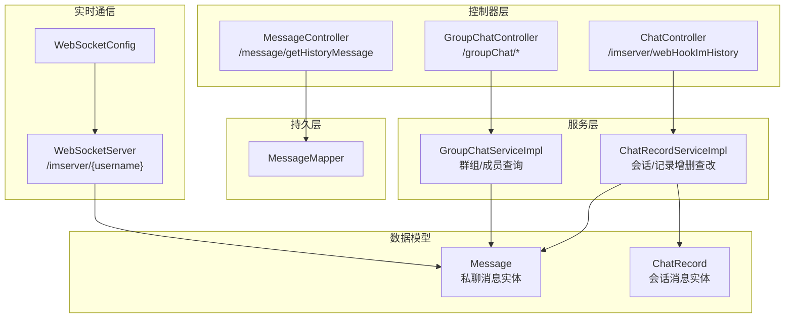
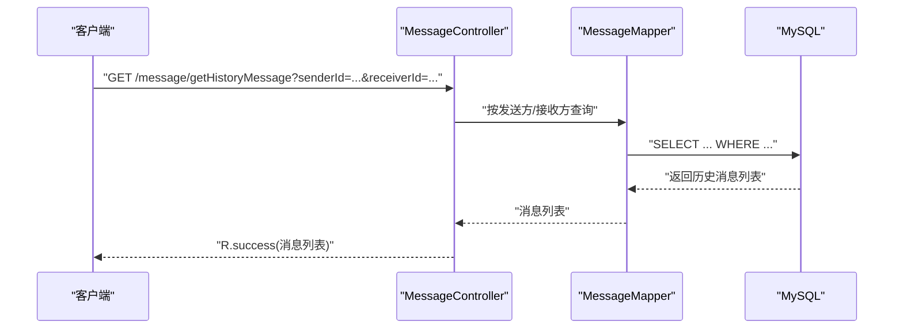
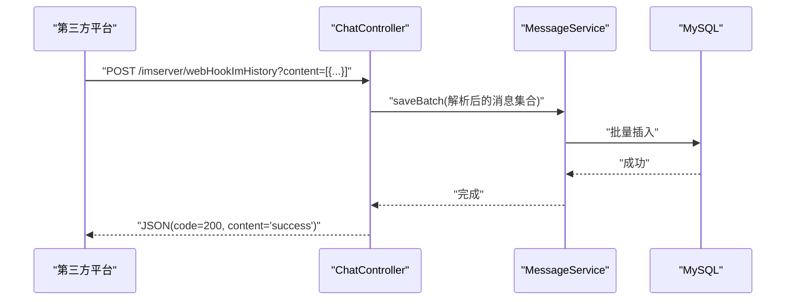
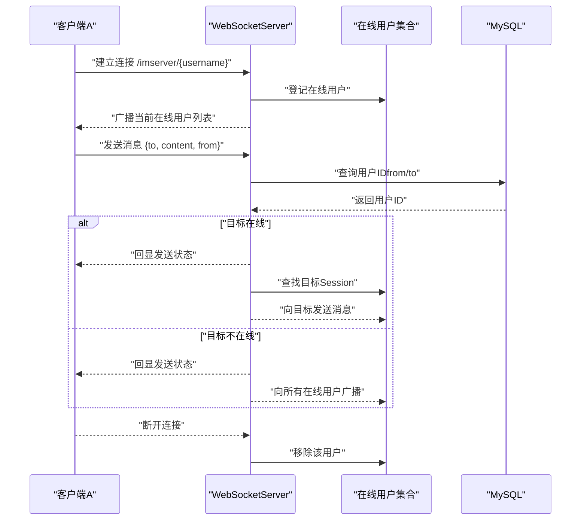
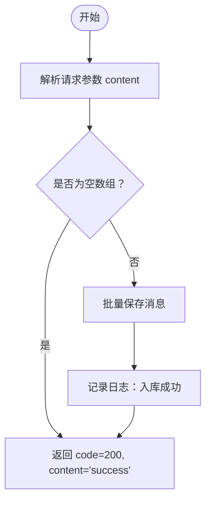
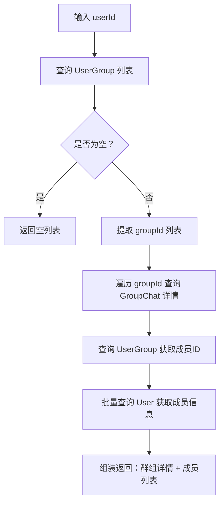
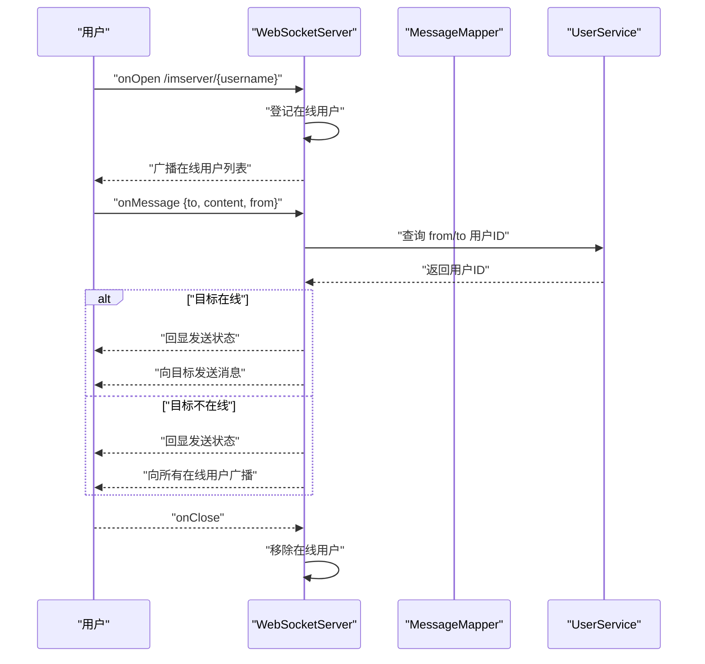
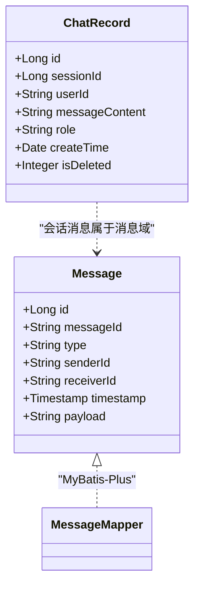
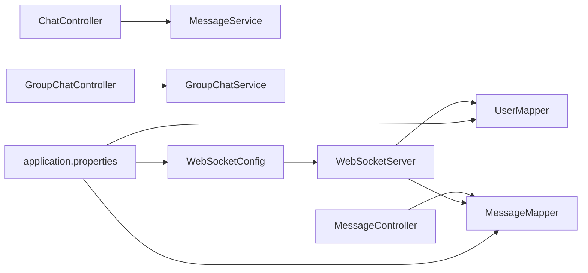

# 消息通信接口

<cite>
**本文引用的文件**
- [ChatController.java](file://springboot-travel-social/src/main/java/com/cxx/controller/ChatController.java)
- [MessageController.java](file://springboot-travel-social/src/main/java/com/cxx/controller/MessageController.java)
- [GroupChatController.java](file://springboot-travel-social/src/main/java/com/cxx/controller/GroupChatController.java)
- [ChatRecordServiceImpl.java](file://springboot-travel-social/src/main/java/com/cxx/service/impl/ChatRecordServiceImpl.java)
- [GroupChatServiceImpl.java](file://springboot-travel-social/src/main/java/com/cxx/service/impl/GroupChatServiceImpl.java)
- [WebSocketServer.java](file://springboot-travel-social/src/main/java/com/cxx/component/WebSocketServer.java)
- [WebSocketConfig.java](file://springboot-travel-social/src/main/java/com/cxx/config/WebSocketConfig.java)
- [Message.java](file://springboot-travel-social/src/main/java/com/cxx/entity/Message.java)
- [ChatRecord.java](file://springboot-travel-social/src/main/java/com/cxx/entity/ChatRecord.java)
- [MessageMapper.java](file://springboot-travel-social/src/main/java/com/cxx/mapper/MessageMapper.java)
- [ChatRequest.java](file://springboot-travel-social/src/main/java/com/cxx/dto/ChatRequest.java)
- [ChatResponse.java](file://springboot-travel-social/src/main/java/com/cxx/dto/ChatResponse.java)
- [application.properties](file://springboot-travel-social/src/main/resources/application.properties)
</cite>

## 目录
1. [简介](#简介)
2. [项目结构](#项目结构)
3. [核心组件](#核心组件)
4. [架构总览](#架构总览)
5. [详细组件分析](#详细组件分析)
6. [依赖分析](#依赖分析)
7. [性能考虑](#性能考虑)
8. [故障排查指南](#故障排查指南)
9. [结论](#结论)
10. [附录](#附录)

## 简介
本文件面向“消息通信相关API接口”的使用与集成，覆盖以下能力：
- 私聊消息：消息发送、接收、历史记录查询
- 群聊接口：群组创建、成员管理、群内消息广播
- WebSocket 实时通信：连接建立、消息收发、广播、异常处理
- 消息推送与离线消息：基于WebSocket的在线广播与落库策略
- 消息存储与检索：消息实体、持久化、查询条件
- 安全与权限：鉴权拦截器与接口访问控制建议

说明：本项目同时包含Spring Boot后端与UniApp前端工程。本文档聚焦后端消息通信能力与接口定义，前端交互细节请参考前端工程对应页面。

## 项目结构
后端采用Spring Boot标准分层结构，消息通信相关代码主要分布在以下包：
- controller：对外HTTP接口（私聊历史、WebHook导入、群聊信息）
- service/impl：业务逻辑（会话与消息记录、群聊成员与信息）
- entity：数据模型（Message、ChatRecord等）
- mapper：MyBatis-Plus映射
- component：WebSocket服务端点
- config：WebSocket配置
- dto：外部大模型请求/响应封装

图表来源
- [ChatController.java:1-42](file://springboot-travel-social/src/main/java/com/cxx/controller/ChatController.java#L1-L42)
- [MessageController.java:1-28](file://springboot-travel-social/src/main/java/com/cxx/controller/MessageController.java#L1-L28)
- [GroupChatController.java:1-42](file://springboot-travel-social/src/main/java/com/cxx/controller/GroupChatController.java#L1-L42)
- [ChatRecordServiceImpl.java:1-92](file://springboot-travel-social/src/main/java/com/cxx/service/impl/ChatRecordServiceImpl.java#L1-L92)
- [GroupChatServiceImpl.java:1-86](file://springboot-travel-social/src/main/java/com/cxx/service/impl/GroupChatServiceImpl.java#L1-L86)
- [Message.java:1-29](file://springboot-travel-social/src/main/java/com/cxx/entity/Message.java#L1-L29)
- [ChatRecord.java:1-48](file://springboot-travel-social/src/main/java/com/cxx/entity/ChatRecord.java#L1-L48)
- [MessageMapper.java:1-12](file://springboot-travel-social/src/main/java/com/cxx/mapper/MessageMapper.java#L1-L12)
- [WebSocketServer.java:1-137](file://springboot-travel-social/src/main/java/com/cxx/component/WebSocketServer.java#L1-L137)
- [WebSocketConfig.java:1-14](file://springboot-travel-social/src/main/java/com/cxx/config/WebSocketConfig.java#L1-L14)

章节来源
- [ChatController.java:1-42](file://springboot-travel-social/src/main/java/com/cxx/controller/ChatController.java#L1-L42)
- [MessageController.java:1-28](file://springboot-travel-social/src/main/java/com/cxx/controller/MessageController.java#L1-L28)
- [GroupChatController.java:1-42](file://springboot-travel-social/src/main/java/com/cxx/controller/GroupChatController.java#L1-L42)
- [ChatRecordServiceImpl.java:1-92](file://springboot-travel-social/src/main/java/com/cxx/service/impl/ChatRecordServiceImpl.java#L1-L92)
- [GroupChatServiceImpl.java:1-86](file://springboot-travel-social/src/main/java/com/cxx/service/impl/GroupChatServiceImpl.java#L1-L86)
- [WebSocketServer.java:1-137](file://springboot-travel-social/src/main/java/com/cxx/component/WebSocketServer.java#L1-L137)
- [WebSocketConfig.java:1-14](file://springboot-travel-social/src/main/java/com/cxx/config/WebSocketConfig.java#L1-L14)
- [Message.java:1-29](file://springboot-travel-social/src/main/java/com/cxx/entity/Message.java#L1-L29)
- [ChatRecord.java:1-48](file://springboot-travel-social/src/main/java/com/cxx/entity/ChatRecord.java#L1-L48)
- [MessageMapper.java:1-12](file://springboot-travel-social/src/main/java/com/cxx/mapper/MessageMapper.java#L1-L12)

## 核心组件
- 私聊消息接口
  - 历史记录查询：GET /message/getHistoryMessage?senderId=...&receiverId=...
  - WebHook批量导入：POST /imserver/webHookImHistory（用于第三方平台导入历史消息）
- 群聊接口
  - 获取用户加入的群组：GET /groupChat/getMyGroupChat/{userId}
  - 获取群组详情（含成员ID列表）：GET /groupChat/getGroupChatInfo/{userId}
  - 获取群组内用户信息：GET /groupChat/getGroupChatUserInfo/{chatId}
- WebSocket实时通信
  - 服务端点：/imserver/{username}
  - 功能：用户上线/下线广播、点对点消息转发、广播消息
- 消息存储与检索
  - Message实体：消息ID、类型、发送方、接收方、时间戳、负载载荷
  - ChatRecord实体：会话ID、用户ID、消息内容、角色（user/ai）、逻辑删除字段
  - MessageMapper：基于MyBatis-Plus的通用Mapper
- 大模型对话DTO
  - ChatRequest：模型参数、消息数组、流式输出开关
  - ChatResponse：响应结构、选择项、用量统计

章节来源
- [MessageController.java:1-28](file://springboot-travel-social/src/main/java/com/cxx/controller/MessageController.java#L1-L28)
- [ChatController.java:1-42](file://springboot-travel-social/src/main/java/com/cxx/controller/ChatController.java#L1-L42)
- [GroupChatController.java:1-42](file://springboot-travel-social/src/main/java/com/cxx/controller/GroupChatController.java#L1-L42)
- [WebSocketServer.java:1-137](file://springboot-travel-social/src/main/java/com/cxx/component/WebSocketServer.java#L1-L137)
- [Message.java:1-29](file://springboot-travel-social/src/main/java/com/cxx/entity/Message.java#L1-L29)
- [ChatRecord.java:1-48](file://springboot-travel-social/src/main/java/com/cxx/entity/ChatRecord.java#L1-L48)
- [MessageMapper.java:1-12](file://springboot-travel-social/src/main/java/com/cxx/mapper/MessageMapper.java#L1-L12)
- [ChatRequest.java:1-56](file://springboot-travel-social/src/main/java/com/cxx/dto/ChatRequest.java#L1-L56)
- [ChatResponse.java:1-43](file://springboot-travel-social/src/main/java/com/cxx/dto/ChatResponse.java#L1-L43)

## 架构总览
后端通过REST接口提供消息能力，WebSocket提供实时双向通信；消息历史通过数据库持久化，WebHook支持第三方导入。

图表来源
- [MessageController.java:1-28](file://springboot-travel-social/src/main/java/com/cxx/controller/MessageController.java#L1-L28)
- [MessageMapper.java:1-12](file://springboot-travel-social/src/main/java/com/cxx/mapper/MessageMapper.java#L1-L12)

图表来源
- [ChatController.java:1-42](file://springboot-travel-social/src/main/java/com/cxx/controller/ChatController.java#L1-L42)

图表来源
- [WebSocketServer.java:1-137](file://springboot-travel-social/src/main/java/com/cxx/component/WebSocketServer.java#L1-L137)

## 详细组件分析

### 私聊消息接口
- 历史记录查询
  - 路径：GET /message/getHistoryMessage
  - 参数：senderId（发送方标识）、receiverId（接收方标识）
  - 查询条件：按发送方与接收方精确匹配
  - 返回：统一结果对象（R.success），包含消息列表
- WebHook批量导入
  - 路径：POST /imserver/webHookImHistory
  - 请求体：表单参数 content（JSON数组字符串，元素为消息对象）
  - 处理流程：解析content为消息列表，若非空则批量保存，返回固定JSON结构（code=200）

图表来源
- [ChatController.java:1-42](file://springboot-travel-social/src/main/java/com/cxx/controller/ChatController.java#L1-L42)

章节来源
- [MessageController.java:1-28](file://springboot-travel-social/src/main/java/com/cxx/controller/MessageController.java#L1-L28)
- [ChatController.java:1-42](file://springboot-travel-social/src/main/java/com/cxx/controller/ChatController.java#L1-L42)
- [MessageMapper.java:1-12](file://springboot-travel-social/src/main/java/com/cxx/mapper/MessageMapper.java#L1-L12)
- [Message.java:1-29](file://springboot-travel-social/src/main/java/com/cxx/entity/Message.java#L1-L29)

### 群聊接口
- 获取用户加入的群组ID列表
  - 路径：GET /groupChat/getMyGroupChat/{userId}
  - 逻辑：根据用户ID查询其加入的所有群组ID，返回ID列表
- 获取群组详情（含成员ID列表）
  - 路径：GET /groupChat/getGroupChatInfo/{userId}
  - 逻辑：先获取群组ID列表，再查询每个群组详情，并补充成员ID字符串列表
- 获取群组内用户信息
  - 路径：GET /groupChat/getGroupChatUserInfo/{chatId}
  - 逻辑：根据群组ID查询所有成员ID，再批量查询用户基础信息

图表来源
- [GroupChatServiceImpl.java:1-86](file://springboot-travel-social/src/main/java/com/cxx/service/impl/GroupChatServiceImpl.java#L1-L86)

章节来源
- [GroupChatController.java:1-42](file://springboot-travel-social/src/main/java/com/cxx/controller/GroupChatController.java#L1-L42)
- [GroupChatServiceImpl.java:1-86](file://springboot-travel-social/src/main/java/com/cxx/service/impl/GroupChatServiceImpl.java#L1-L86)

### WebSocket实时通信
- 连接建立
  - 服务端点：/imserver/{username}
  - 注册在线用户，广播当前在线用户列表
- 消息收发
  - onMessage：解析消息JSON，获取 to、content、from 字段；查询发送方/接收方用户ID；若目标在线则直接发送，否则广播
- 断开与异常
  - onClose：移除在线用户
  - onError：记录错误堆栈

图表来源
- [WebSocketServer.java:1-137](file://springboot-travel-social/src/main/java/com/cxx/component/WebSocketServer.java#L1-L137)

章节来源
- [WebSocketServer.java:1-137](file://springboot-travel-social/src/main/java/com/cxx/component/WebSocketServer.java#L1-L137)
- [WebSocketConfig.java:1-14](file://springboot-travel-social/src/main/java/com/cxx/config/WebSocketConfig.java#L1-L14)

### 消息存储与检索
- 数据模型
  - Message：消息主键、消息ID、类型、发送方、接收方、时间戳、payload
  - ChatRecord：会话ID、用户ID、消息内容、角色、逻辑删除
- 存储流程
  - 私聊历史：MessageMapper按发送方/接收方查询
  - 会话记录：ChatRecordServiceImpl维护会话与消息，支持按会话ID排序查询
- 去重与顺序
  - 去重：可基于消息ID（Message.messageId）在入库前进行幂等校验（建议）
  - 顺序：按创建时间升序排列（ChatRecord.createTime）

图表来源
- [Message.java:1-29](file://springboot-travel-social/src/main/java/com/cxx/entity/Message.java#L1-L29)
- [ChatRecord.java:1-48](file://springboot-travel-social/src/main/java/com/cxx/entity/ChatRecord.java#L1-L48)
- [MessageMapper.java:1-12](file://springboot-travel-social/src/main/java/com/cxx/mapper/MessageMapper.java#L1-L12)

章节来源
- [Message.java:1-29](file://springboot-travel-social/src/main/java/com/cxx/entity/Message.java#L1-L29)
- [ChatRecord.java:1-48](file://springboot-travel-social/src/main/java/com/cxx/entity/ChatRecord.java#L1-L48)
- [MessageMapper.java:1-12](file://springboot-travel-social/src/main/java/com/cxx/mapper/MessageMapper.java#L1-L12)
- [ChatRecordServiceImpl.java:1-92](file://springboot-travel-social/src/main/java/com/cxx/service/impl/ChatRecordServiceImpl.java#L1-L92)

### 大模型对话DTO（扩展能力）
- ChatRequest：模型参数（stream、max_tokens、temperature、top_p、频率/出现惩罚）
- ChatResponse：响应结构（choices、usage）

章节来源
- [ChatRequest.java:1-56](file://springboot-travel-social/src/main/java/com/cxx/dto/ChatRequest.java#L1-L56)
- [ChatResponse.java:1-43](file://springboot-travel-social/src/main/java/com/cxx/dto/ChatResponse.java#L1-L43)

## 依赖分析
- 组件耦合
  - 控制器依赖服务层；服务层依赖Mapper与实体；WebSocket依赖UserService与MessageMapper进行用户ID解析
- 外部依赖
  - MySQL：消息与会话数据存储
  - Redis：应用配置（项目中存在Redis配置项）
  - RabbitMQ：消息队列配置（项目中存在RabbitMQ配置项）
  - 邮件：邮件配置（项目中存在SMTP配置项）

图表来源
- [ChatController.java:1-42](file://springboot-travel-social/src/main/java/com/cxx/controller/ChatController.java#L1-L42)
- [MessageController.java:1-28](file://springboot-travel-social/src/main/java/com/cxx/controller/MessageController.java#L1-L28)
- [GroupChatController.java:1-42](file://springboot-travel-social/src/main/java/com/cxx/controller/GroupChatController.java#L1-L42)
- [WebSocketServer.java:1-137](file://springboot-travel-social/src/main/java/com/cxx/component/WebSocketServer.java#L1-L137)
- [WebSocketConfig.java:1-14](file://springboot-travel-social/src/main/java/com/cxx/config/WebSocketConfig.java#L1-L14)
- [application.properties:1-61](file://springboot-travel-social/src/main/resources/application.properties#L1-L61)

章节来源
- [application.properties:1-61](file://springboot-travel-social/src/main/resources/application.properties#L1-L61)

## 性能考虑
- WebSocket并发
  - 使用ConcurrentHashMap维护在线会话，注意高并发下的锁竞争；建议结合连接池与限流策略
- 数据库查询
  - 历史消息查询建议在 senderId/receiverId 上建立索引；分页查询避免一次性加载过多历史
- 批量导入
  - WebHook导入使用批量写入，减少事务次数；建议增加幂等校验字段（如消息ID唯一性）
- 缓存策略
  - 在线用户列表与群组成员可引入Redis缓存，降低数据库压力

## 故障排查指南
- WebSocket连接失败
  - 检查WebSocket配置是否启用（ServerEndpointExporter）
  - 查看服务端日志中的错误堆栈（onError）
- 消息未送达
  - 确认目标用户是否在线；若不在线，消息将被广播
  - 检查用户ID解析逻辑（from/to）是否正确
- 历史消息为空
  - 确认查询参数 senderId/receiverId 是否一致
  - 检查数据库中是否存在对应记录
- WebHook导入失败
  - 确认content参数格式为合法JSON数组
  - 检查批量保存过程中的异常日志

章节来源
- [WebSocketServer.java:1-137](file://springboot-travel-social/src/main/java/com/cxx/component/WebSocketServer.java#L1-L137)
- [MessageController.java:1-28](file://springboot-travel-social/src/main/java/com/cxx/controller/MessageController.java#L1-L28)
- [ChatController.java:1-42](file://springboot-travel-social/src/main/java/com/cxx/controller/ChatController.java#L1-L42)

## 结论
本项目提供了完整的私聊消息、群聊管理与WebSocket实时通信能力。通过REST接口实现消息历史查询与第三方导入，通过WebSocket实现点对点与广播消息；配合实体与Mapper实现消息持久化。建议在生产环境中完善鉴权、限流、幂等与缓存策略，以提升安全性与稳定性。

## 附录

### 接口清单与参数
- GET /message/getHistoryMessage
  - 参数：senderId（发送方标识）、receiverId（接收方标识）
  - 返回：R.success(消息列表)
- POST /imserver/webHookImHistory
  - 参数：content（JSON数组字符串）
  - 返回：JSON(code=200, content='success')
- GET /groupChat/getMyGroupChat/{userId}
  - 返回：R.success(群组ID列表)
- GET /groupChat/getGroupChatInfo/{userId}
  - 返回：R.success(群组详情 + 成员ID列表)
- GET /groupChat/getGroupChatUserInfo/{chatId}
  - 返回：R.success(成员用户信息列表)

章节来源
- [MessageController.java:1-28](file://springboot-travel-social/src/main/java/com/cxx/controller/MessageController.java#L1-L28)
- [ChatController.java:1-42](file://springboot-travel-social/src/main/java/com/cxx/controller/ChatController.java#L1-L42)
- [GroupChatController.java:1-42](file://springboot-travel-social/src/main/java/com/cxx/controller/GroupChatController.java#L1-L42)

### WebSocket连接示例（步骤说明）
- 连接地址：ws://host:port/imserver/{username}
- 心跳检测：建议客户端定期发送ping消息，服务端未实现内置心跳
- 断线重连：客户端监听onclose事件并实现指数退避重连
- 消息格式：
  - 发送：{"to": "目标用户名", "content": "消息内容", "from": "发送用户名"}
  - 广播：服务端向所有在线用户广播当前在线列表
- 事件处理：
  - onOpen：登记在线用户并接收广播
  - onMessage：接收点对点或广播消息
  - onClose：清理本地状态
  - onError：记录错误并尝试重连

章节来源
- [WebSocketServer.java:1-137](file://springboot-travel-social/src/main/java/com/cxx/component/WebSocketServer.java#L1-L137)

### 消息安全与权限控制建议
- 鉴权
  - 在控制器与WebSocket端点增加登录态校验（如JWT）
  - 对群组操作接口限制仅群成员可访问
- 防刷与限流
  - 对历史查询与WebHook导入接口增加限流策略
- 数据脱敏
  - 对敏感字段进行脱敏展示（如手机号、身份证号）
- 日志审计
  - 记录关键操作（导入、发送、删除）与异常事件