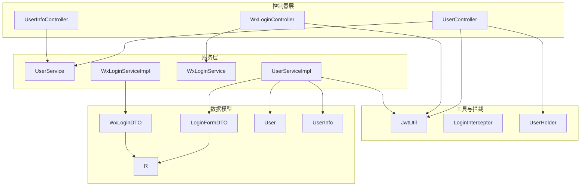
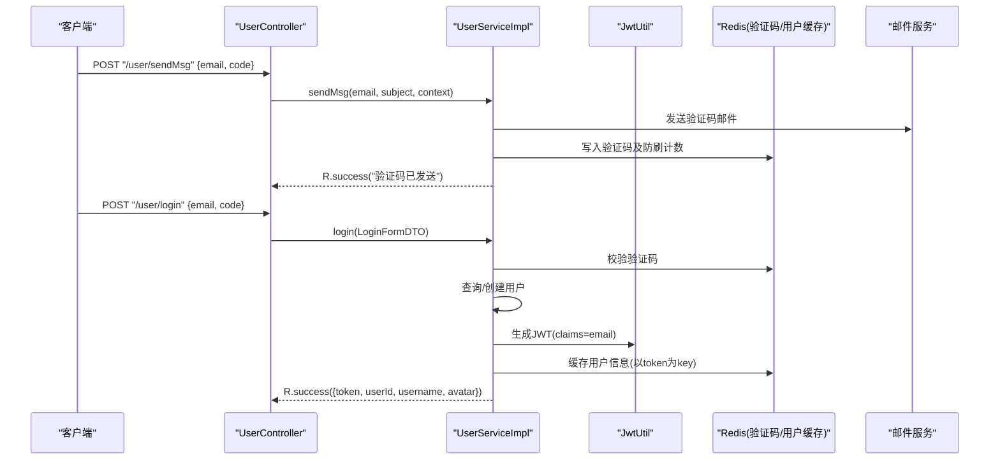
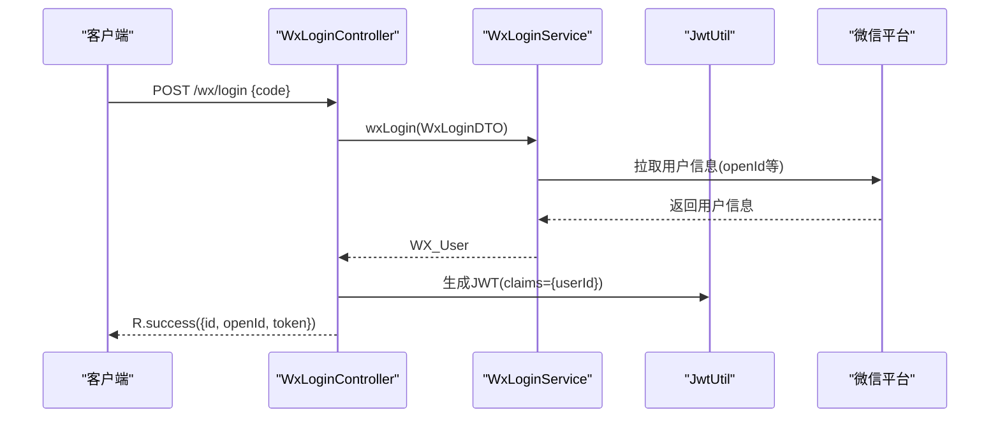
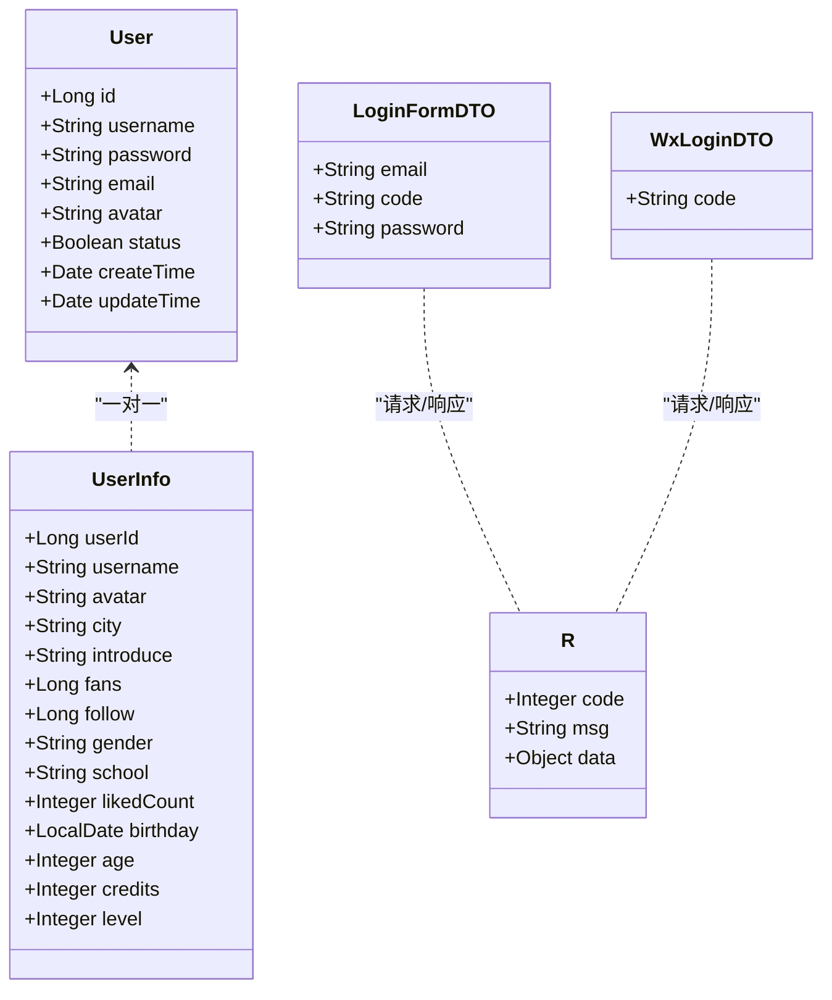
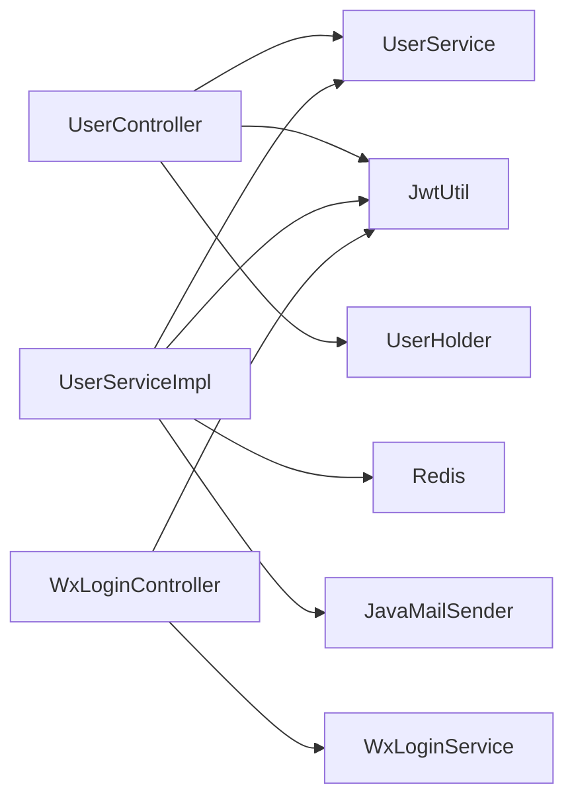

# 用户认证接口

<cite>
**本文引用的文件**
- [UserController.java](file://springboot-travel-social/src/main/java/com/cxx/controller/UserController.java)
- [WxLoginController.java](file://springboot-travel-social/src/main/java/com/cxx/controller/WxLoginController.java)
- [UserInfoController.java](file://springboot-travel-social/src/main/java/com/cxx/controller/UserInfoController.java)
- [UserService.java](file://springboot-travel-social/src/main/java/com/cxx/service/UserService.java)
- [UserServiceImpl.java](file://springboot-travel-social/src/main/java/com/cxx/service/impl/UserServiceImpl.java)
- [WxLoginService.java](file://springboot-travel-social/src/main/java/com/cxx/service/WxLoginService.java)
- [WxLoginServiceImpl.java](file://springboot-travel-social/src/main/java/com/cxx/service/impl/WxLoginServiceImpl.java)
- [JwtUtil.java](file://springboot-travel-social/src/main/java/com/cxx/utils/JwtUtil.java)
- [LoginInterceptor.java](file://springboot-travel-social/src/main/java/com/cxx/utils/LoginInterceptor.java)
- [UserHolder.java](file://springboot-travel-social/src/main/java/com/cxx/utils/UserHolder.java)
- [LoginFormDTO.java](file://springboot-travel-social/src/main/java/com/cxx/dto/LoginFormDTO.java)
- [WxLoginDTO.java](file://springboot-travel-social/src/main/java/com/cxx/dto/WxLoginDTO.java)
- [R.java](file://springboot-travel-social/src/main/java/com/cxx/entity/R.java)
- [User.java](file://springboot-travel-social/src/main/java/com/cxx/entity/User.java)
- [UserInfo.java](file://springboot-travel-social/src/main/java/com/cxx/entity/UserInfo.java)
- [application.properties](file://springboot-travel-social/src/main/resources/application.properties)
</cite>

## 目录
1. [简介](#简介)
2. [项目结构](#项目结构)
3. [核心组件](#核心组件)
4. [架构总览](#架构总览)
5. [详细组件分析](#详细组件分析)
6. [依赖分析](#依赖分析)
7. [性能考虑](#性能考虑)
8. [故障排查指南](#故障排查指南)
9. [结论](#结论)
10. [附录](#附录)

## 简介
本文件面向后端用户认证相关API接口，覆盖以下能力：
- 邮箱验证码获取与邮箱快捷登录
- 账号密码登录
- 用户信息管理（昵称、头像、个人资料）
- 密码修改
- 退出登录（基于会话/令牌清理）
- 微信第三方登录（授权码换取用户标识并签发JWT）
- JWT令牌生成与验证机制（请求头Authorization: Bearer token）
- 参数校验、权限拦截、错误处理与统一返回格式

## 项目结构
围绕用户认证的关键模块与文件如下：
- 控制器层：UserController、WxLoginController、UserInfoController
- 服务层：UserService、UserServiceImpl、WxLoginService、WxLoginServiceImpl
- 工具与拦截：JwtUtil、LoginInterceptor、UserHolder
- DTO/Entity/R：LoginFormDTO、WxLoginDTO、User、UserInfo、R
- 配置：application.properties

图表来源
- [UserController.java:31-136](file://springboot-travel-social/src/main/java/com/cxx/controller/UserController.java#L31-L136)
- [WxLoginController.java:18-35](file://springboot-travel-social/src/main/java/com/cxx/controller/WxLoginController.java#L18-L35)
- [UserInfoController.java:17-89](file://springboot-travel-social/src/main/java/com/cxx/controller/UserInfoController.java#L17-L89)
- [UserService.java:18-36](file://springboot-travel-social/src/main/java/com/cxx/service/UserService.java#L18-L36)
- [UserServiceImpl.java:43-268](file://springboot-travel-social/src/main/java/com/cxx/service/impl/UserServiceImpl.java#L43-L268)
- [WxLoginService.java](file://springboot-travel-social/src/main/java/com/cxx/service/WxLoginService.java)
- [WxLoginServiceImpl.java](file://springboot-travel-social/src/main/java/com/cxx/service/impl/WxLoginServiceImpl.java)
- [JwtUtil.java:8-19](file://springboot-travel-social/src/main/java/com/cxx/utils/JwtUtil.java#L8-L19)
- [LoginInterceptor.java:7-18](file://springboot-travel-social/src/main/java/com/cxx/utils/LoginInterceptor.java#L7-L18)
- [UserHolder.java:5-20](file://springboot-travel-social/src/main/java/com/cxx/utils/UserHolder.java#L5-L20)
- [LoginFormDTO.java:8-12](file://springboot-travel-social/src/main/java/com/cxx/dto/LoginFormDTO.java#L8-L12)
- [WxLoginDTO.java:7-10](file://springboot-travel-social/src/main/java/com/cxx/dto/WxLoginDTO.java#L7-L10)
- [R.java:14-32](file://springboot-travel-social/src/main/java/com/cxx/entity/R.java#L14-L32)
- [User.java:22-81](file://springboot-travel-social/src/main/java/com/cxx/entity/User.java#L22-L81)
- [UserInfo.java:22-104](file://springboot-travel-social/src/main/java/com/cxx/entity/UserInfo.java#L22-L104)

章节来源
- [UserController.java:31-136](file://springboot-travel-social/src/main/java/com/cxx/controller/UserController.java#L31-L136)
- [WxLoginController.java:18-35](file://springboot-travel-social/src/main/java/com/cxx/controller/WxLoginController.java#L18-L35)
- [UserInfoController.java:17-89](file://springboot-travel-social/src/main/java/com/cxx/controller/UserInfoController.java#L17-L89)
- [UserService.java:18-36](file://springboot-travel-social/src/main/java/com/cxx/service/UserService.java#L18-L36)
- [UserServiceImpl.java:43-268](file://springboot-travel-social/src/main/java/com/cxx/service/impl/UserServiceImpl.java#L43-L268)
- [JwtUtil.java:8-19](file://springboot-travel-social/src/main/java/com/cxx/utils/JwtUtil.java#L8-L19)
- [LoginInterceptor.java:7-18](file://springboot-travel-social/src/main/java/com/cxx/utils/LoginInterceptor.java#L7-L18)
- [UserHolder.java:5-20](file://springboot-travel-social/src/main/java/com/cxx/utils/UserHolder.java#L5-L20)
- [LoginFormDTO.java:8-12](file://springboot-travel-social/src/main/java/com/cxx/dto/LoginFormDTO.java#L8-L12)
- [WxLoginDTO.java:7-10](file://springboot-travel-social/src/main/java/com/cxx/dto/WxLoginDTO.java#L7-L10)
- [R.java:14-32](file://springboot-travel-social/src/main/java/com/cxx/entity/R.java#L14-L32)
- [User.java:22-81](file://springboot-travel-social/src/main/java/com/cxx/entity/User.java#L22-L81)
- [UserInfo.java:22-104](file://springboot-travel-social/src/main/java/com/cxx/entity/UserInfo.java#L22-L104)
- [application.properties:1-61](file://springboot-travel-social/src/main/resources/application.properties#L1-L61)

## 核心组件
- 用户控制器 UserController：提供验证码发送、邮箱快捷登录、账号密码登录、用户信息更新（昵称、头像）、密码修改等接口。
- 微信登录控制器 WxLoginController：接收微信授权码，调用微信服务获取用户信息并签发JWT。
- 用户信息服务 UserService/UserServiceImpl：实现登录、验证码发送、用户信息查询与更新、密码修改、头像更新等业务逻辑。
- JWT工具 JwtUtil：生成JWT令牌（固定过期时长）。
- 登录拦截器 LoginInterceptor：校验请求是否携带合法用户上下文（用于需要登录态的接口）。
- 用户上下文 UserHolder：线程本地存储当前登录用户信息。
- 统一返回 R：统一封装接口返回结构（code/msg/data）。

章节来源
- [UserController.java:31-136](file://springboot-travel-social/src/main/java/com/cxx/controller/UserController.java#L31-L136)
- [WxLoginController.java:18-35](file://springboot-travel-social/src/main/java/com/cxx/controller/WxLoginController.java#L18-L35)
- [UserService.java:18-36](file://springboot-travel-social/src/main/java/com/cxx/service/UserService.java#L18-L36)
- [UserServiceImpl.java:43-268](file://springboot-travel-social/src/main/java/com/cxx/service/impl/UserServiceImpl.java#L43-L268)
- [JwtUtil.java:8-19](file://springboot-travel-social/src/main/java/com/cxx/utils/JwtUtil.java#L8-L19)
- [LoginInterceptor.java:7-18](file://springboot-travel-social/src/main/java/com/cxx/utils/LoginInterceptor.java#L7-L18)
- [UserHolder.java:5-20](file://springboot-travel-social/src/main/java/com/cxx/utils/UserHolder.java#L5-L20)
- [R.java:14-32](file://springboot-travel-social/src/main/java/com/cxx/entity/R.java#L14-L32)

## 架构总览
下图展示用户认证相关接口的调用链路与组件交互：

图表来源
- [UserController.java:42-87](file://springboot-travel-social/src/main/java/com/cxx/controller/UserController.java#L42-L87)
- [UserServiceImpl.java:75-110](file://springboot-travel-social/src/main/java/com/cxx/service/impl/UserServiceImpl.java#L75-L110)
- [JwtUtil.java:11-17](file://springboot-travel-social/src/main/java/com/cxx/utils/JwtUtil.java#L11-L17)
- [application.properties:31-42](file://springboot-travel-social/src/main/resources/application.properties#L31-L42)

## 详细组件分析

### 用户注册与登录接口
- 接口：POST /user/sendMsg
  - 功能：向邮箱发送验证码；对特定IP进行防刷限制。
  - 请求体：LoginFormDTO（email, code, password为空）
  - 成功响应：R.success("验证码已发送")
  - 失败响应：R.error("验证码获取失败...") 或被限制提示
  - 参数校验：邮箱格式修正、重复“@qq.com”拼接处理
  - 权限控制：无需登录
  - 错误处理：Redis中验证码键过期时间、防刷阈值判断
  - 章节来源
    - [UserController.java:42-80](file://springboot-travel-social/src/main/java/com/cxx/controller/UserController.java#L42-L80)
    - [UserServiceImpl.java:113-120](file://springboot-travel-social/src/main/java/com/cxx/service/impl/UserServiceImpl.java#L113-L120)

- 接口：POST /user/login
  - 功能：邮箱+验证码快捷登录；若邮箱不存在则自动注册新用户。
  - 请求体：LoginFormDTO（email, code）
  - 成功响应：R.success({token, userId, username, avatar})
  - 失败响应：R.error("验证码错误")、R.error("该用户已被禁用")
  - 参数校验：验证码匹配、用户状态检查
  - 权限控制：无需登录
  - 错误处理：Redis中验证码校验、用户不存在时创建默认用户并初始化用户信息
  - 章节来源
    - [UserController.java:83-87](file://springboot-travel-social/src/main/java/com/cxx/controller/UserController.java#L83-L87)
    - [UserServiceImpl.java:75-110](file://springboot-travel-social/src/main/java/com/cxx/service/impl/UserServiceImpl.java#L75-L110)

- 接口：POST /user/login/email
  - 功能：邮箱+密码登录。
  - 请求体：LoginFormDTO（email, password）
  - 成功响应：R.success({token, userId, username, avatar})
  - 失败响应：R.error("该邮箱尚未注册")、R.error("你输入的密码错误")、R.error("该用户已被禁用")
  - 参数校验：邮箱存在性、密码正确性
  - 权限控制：无需登录
  - 错误处理：用户状态检查、密码比对
  - 章节来源
    - [UserController.java:89-93](file://springboot-travel-social/src/main/java/com/cxx/controller/UserController.java#L89-L93)
    - [UserServiceImpl.java:122-162](file://springboot-travel-social/src/main/java/com/cxx/service/impl/UserServiceImpl.java#L122-L162)

- 退出登录
  - 当前实现：通过前端清除本地token即可视为退出；后端未提供专门的“登出”接口。
  - 若需服务端强制失效，可在Redis中删除对应token的用户缓存键。
  - 章节来源
    - [UserServiceImpl.java:95-109](file://springboot-travel-social/src/main/java/com/cxx/service/impl/UserServiceImpl.java#L95-L109)

- 请求示例（仅示意）
  - 获取验证码
    - 方法：POST /user/sendMsg
    - 请求体：{"email":"xxx@qq.com","code":"","password":""}
  - 邮箱快捷登录
    - 方法：POST /user/login
    - 请求体：{"email":"xxx@qq.com","code":"123456"}
  - 邮箱密码登录
    - 方法：POST /user/login/email
    - 请求体：{"email":"xxx@qq.com","password":"your_password"}

- 响应格式
  - 统一返回：R（code, msg, data）
  - 成功：code=1, msg="success", data=具体数据
  - 失败：code=0, msg=错误信息, data=null
  - 章节来源
    - [R.java:14-32](file://springboot-travel-social/src/main/java/com/cxx/entity/R.java#L14-L32)

### JWT令牌生成与验证机制
- 生成
  - Claims：包含email字段
  - 过期时间：当前实现固定为一天（毫秒）
  - 签名算法：HS256，密钥为固定字符串
  - 章节来源
    - [JwtUtil.java:8-19](file://springboot-travel-social/src/main/java/com/cxx/utils/JwtUtil.java#L8-L19)
    - [UserServiceImpl.java:91-109](file://springboot-travel-social/src/main/java/com/cxx/service/impl/UserServiceImpl.java#L91-L109)

- 验证
  - 当前未在代码中直接解析/验证JWT的逻辑；登录成功后返回token供前端使用。
  - 如需服务端验证，建议在拦截器中解析Authorization头并校验签名与过期时间。
  - 章节来源
    - [LoginInterceptor.java:7-18](file://springboot-travel-social/src/main/java/com/cxx/utils/LoginInterceptor.java#L7-L18)
    - [UserHolder.java:5-20](file://springboot-travel-social/src/main/java/com/cxx/utils/UserHolder.java#L5-L20)

- 请求头设置
  - Authorization: Bearer <token>
  - 章节来源
    - [LoginInterceptor.java:7-18](file://springboot-travel-social/src/main/java/com/cxx/utils/LoginInterceptor.java#L7-L18)

### 微信第三方登录接口
- 接口：POST /wx/login
  - 功能：使用微信授权码换取用户标识并签发JWT。
  - 请求体：WxLoginDTO（code）
  - 成功响应：R.success({id, openId, token})
  - 失败响应：异常抛出由全局异常处理捕获（见附录）
  - 参数校验：code必填
  - 权限控制：无需登录
  - 错误处理：微信服务调用异常
  - 章节来源
    - [WxLoginController.java:25-33](file://springboot-travel-social/src/main/java/com/cxx/controller/WxLoginController.java#L25-L33)
    - [WxLoginDTO.java:7-10](file://springboot-travel-social/src/main/java/com/cxx/dto/WxLoginDTO.java#L7-L10)

- 调用流程（概念）

图表来源
- [WxLoginController.java:25-33](file://springboot-travel-social/src/main/java/com/cxx/controller/WxLoginController.java#L25-L33)
- [WxLoginService.java](file://springboot-travel-social/src/main/java/com/cxx/service/WxLoginService.java)
- [WxLoginServiceImpl.java](file://springboot-travel-social/src/main/java/com/cxx/service/impl/WxLoginServiceImpl.java)
- [JwtUtil.java:11-17](file://springboot-travel-social/src/main/java/com/cxx/utils/JwtUtil.java#L11-L17)

### 用户信息管理接口
- 接口：PUT /user/updateUsername
  - 功能：修改用户名；同时同步活动、视频评论、评论中的用户名。
  - 请求体：UpdateUsernameDTO（username, userId）
  - 成功响应：R.success()
  - 失败响应：R.error("用户名已存在,换一个试试!")
  - 参数校验：用户名唯一性
  - 章节来源
    - [UserController.java:109-113](file://springboot-travel-social/src/main/java/com/cxx/controller/UserController.java#L109-L113)
    - [UserServiceImpl.java:191-217](file://springboot-travel-social/src/main/java/com/cxx/service/impl/UserServiceImpl.java#L191-L217)

- 接口：PUT /user/updatePassword
  - 功能：根据邮箱与旧密码修改新密码。
  - 请求体：UpdatePasswordDTO（email, password, newPassword）
  - 成功响应：R.success()
  - 失败响应：R.error("QQ号码或旧密码错误!")
  - 参数校验：邮箱与旧密码匹配
  - 章节来源
    - [UserController.java:115-120](file://springboot-travel-social/src/main/java/com/cxx/controller/UserController.java#L115-L120)
    - [UserServiceImpl.java:219-227](file://springboot-travel-social/src/main/java/com/cxx/service/impl/UserServiceImpl.java#L219-L227)

- 接口：PUT /user/updateAvatar
  - 功能：更新头像；同步活动中的头像字段。
  - 请求体：UpdateAvatarDTO（avatar, userId）
  - 成功响应：R.success()
  - 章节来源
    - [UserController.java:122-125](file://springboot-travel-social/src/main/java/com/cxx/controller/UserController.java#L122-L125)
    - [UserServiceImpl.java:229-239](file://springboot-travel-social/src/main/java/com/cxx/service/impl/UserServiceImpl.java#L229-L239)

- 接口：POST /userInfo/saveMyInfo
  - 功能：保存用户基本信息（头像、昵称），同步更新用户表与用户信息表，并回写评论中的用户名与头像。
  - 请求体：UserInfo（包含userId、username、avatar等）
  - 成功响应：R.success()
  - 章节来源
    - [UserInfoController.java:71-87](file://springboot-travel-social/src/main/java/com/cxx/controller/UserInfoController.java#L71-L87)
    - [UserServiceImpl.java:241-266](file://springboot-travel-social/src/main/java/com/cxx/service/impl/UserServiceImpl.java#L241-L266)

- 请求示例（仅示意）
  - 修改昵称
    - 方法：PUT /user/updateUsername
    - 请求体：{"username":"新昵称","userId":1}
  - 修改密码
    - 方法：PUT /user/updatePassword
    - 请求体：{"email":"xxx@qq.com","password":"old","newPassword":"new"}
  - 更新头像
    - 方法：PUT /user/updateAvatar
    - 请求体：{"avatar":"https://example.com/avatar.jpg","userId":1}
  - 保存个人信息
    - 方法：POST /userInfo/saveMyInfo
    - 请求体：{"userId":1,"username":"昵称","avatar":"https://...jpg"}

- 响应格式
  - 统一返回：R（code, msg, data）
  - 章节来源
    - [R.java:14-32](file://springboot-travel-social/src/main/java/com/cxx/entity/R.java#L14-L32)

### 数据模型与DTO

图表来源
- [User.java:22-81](file://springboot-travel-social/src/main/java/com/cxx/entity/User.java#L22-L81)
- [UserInfo.java:22-104](file://springboot-travel-social/src/main/java/com/cxx/entity/UserInfo.java#L22-L104)
- [LoginFormDTO.java:8-12](file://springboot-travel-social/src/main/java/com/cxx/dto/LoginFormDTO.java#L8-L12)
- [WxLoginDTO.java:7-10](file://springboot-travel-social/src/main/java/com/cxx/dto/WxLoginDTO.java#L7-L10)
- [R.java:14-32](file://springboot-travel-social/src/main/java/com/cxx/entity/R.java#L14-L32)

## 依赖分析
- 控制器依赖服务接口，服务实现依赖Mapper与工具类。
- 登录流程依赖Redis存储验证码与用户信息哈希。
- JWT工具独立生成令牌，不依赖外部配置。
- 登录拦截器依赖UserHolder进行用户上下文校验。

图表来源
- [UserController.java:35-38](file://springboot-travel-social/src/main/java/com/cxx/controller/UserController.java#L35-L38)
- [UserServiceImpl.java:44-73](file://springboot-travel-social/src/main/java/com/cxx/service/impl/UserServiceImpl.java#L44-L73)
- [WxLoginController.java:22-23](file://springboot-travel-social/src/main/java/com/cxx/controller/WxLoginController.java#L22-L23)
- [JwtUtil.java:8-19](file://springboot-travel-social/src/main/java/com/cxx/utils/JwtUtil.java#L8-L19)
- [LoginInterceptor.java:7-18](file://springboot-travel-social/src/main/java/com/cxx/utils/LoginInterceptor.java#L7-L18)
- [UserHolder.java:5-20](file://springboot-travel-social/src/main/java/com/cxx/utils/UserHolder.java#L5-L20)

章节来源
- [UserController.java:35-38](file://springboot-travel-social/src/main/java/com/cxx/controller/UserController.java#L35-L38)
- [UserServiceImpl.java:44-73](file://springboot-travel-social/src/main/java/com/cxx/service/impl/UserServiceImpl.java#L44-L73)
- [WxLoginController.java:22-23](file://springboot-travel-social/src/main/java/com/cxx/controller/WxLoginController.java#L22-L23)
- [JwtUtil.java:8-19](file://springboot-travel-social/src/main/java/com/cxx/utils/JwtUtil.java#L8-L19)
- [LoginInterceptor.java:7-18](file://springboot-travel-social/src/main/java/com/cxx/utils/LoginInterceptor.java#L7-L18)
- [UserHolder.java:5-20](file://springboot-travel-social/src/main/java/com/cxx/utils/UserHolder.java#L5-L20)

## 性能考虑
- 验证码防刷：Redis记录IP访问次数并在阈值触发时锁定IP一段时间，降低暴力尝试风险。
- Redis缓存：登录成功后将用户信息以哈希形式缓存，减少数据库压力；建议为token键设置过期策略。
- 邮件发送：使用异步或队列方式优化邮件发送延迟。
- 分页查询：用户总数统计采用分页查询，避免一次性加载过多数据。
- 章节来源
  - [UserServiceImpl.java:175-189](file://springboot-travel-social/src/main/java/com/cxx/service/impl/UserServiceImpl.java#L175-L189)
  - [UserController.java:50-64](file://springboot-travel-social/src/main/java/com/cxx/controller/UserController.java#L50-L64)

## 故障排查指南
- 验证码错误
  - 现象：登录时报错“验证码错误”
  - 排查：确认Redis中验证码是否存在且未过期；检查请求体code与缓存一致
  - 章节来源
    - [UserServiceImpl.java:79-81](file://springboot-travel-social/src/main/java/com/cxx/service/impl/UserServiceImpl.java#L79-L81)

- 邮箱未注册或密码错误
  - 现象：账号密码登录报错“该邮箱尚未注册”或“你输入的密码错误”
  - 排查：确认邮箱是否已注册；核对密码是否正确；检查用户状态
  - 章节来源
    - [UserServiceImpl.java:129-161](file://springboot-travel-social/src/main/java/com/cxx/service/impl/UserServiceImpl.java#L129-L161)

- 用户被禁用
  - 现象：登录时报错“该用户已被禁用”
  - 排查：检查用户状态字段
  - 章节来源
    - [UserServiceImpl.java:85-87](file://springboot-travel-social/src/main/java/com/cxx/service/impl/UserServiceImpl.java#L85-L87)

- IP限制
  - 现象：频繁获取验证码被限制
  - 排查：Redis中IP计数键是否超过阈值；等待锁定时间结束
  - 章节来源
    - [UserController.java:59-63](file://springboot-travel-social/src/main/java/com/cxx/controller/UserController.java#L59-L63)

- JWT验证
  - 现象：携带token但接口仍返回未登录
  - 排查：确认Authorization头格式为Bearer <token>；当前拦截器仅检查UserHolder是否有用户，未解析JWT签名与过期
  - 章节来源
    - [LoginInterceptor.java:10-15](file://springboot-travel-social/src/main/java/com/cxx/utils/LoginInterceptor.java#L10-L15)

## 结论
本项目提供了完善的用户认证与信息管理能力，涵盖邮箱验证码登录、账号密码登录、微信第三方登录、用户信息更新与密码修改等场景。JWT令牌生成简单可靠，配合Redis缓存提升性能。建议后续增强：
- 完善JWT解析与校验（签名、过期、黑名单）
- 提供专用“登出”接口，支持服务端主动失效token
- 对敏感操作增加更细粒度的权限控制与参数校验
- 引入统一的全局异常处理与日志审计

## 附录

### 请求与响应示例
- 获取验证码
  - 请求：POST /user/sendMsg
  - 请求体：{"email":"xxx@qq.com","code":"","password":""}
  - 成功：{"code":1,"msg":"success","data":"验证码已发送成功,请及时查看QQ邮箱!"}
  - 失败：{"code":0,"msg":"验证码获取失败,请避免重复获取,还剩：...秒可重新获取！","data":null}

- 邮箱快捷登录
  - 请求：POST /user/login
  - 请求体：{"email":"xxx@qq.com","code":"123456"}
  - 成功：{"code":1,"msg":"success","data":{"token":"...","userId":1,"username":"...","avatar":"..."}}

- 邮箱密码登录
  - 请求：POST /user/login/email
  - 请求体：{"email":"xxx@qq.com","password":"your_password"}
  - 成功：{"code":1,"msg":"success","data":{"token":"...","userId":1,"username":"...","avatar":"..."}}

- 微信登录
  - 请求：POST /wx/login
  - 请求体：{"code":"wx_authorization_code"}
  - 成功：{"code":1,"msg":"success","data":{"id":1,"openId":"...","token":"..."}}

- 修改昵称
  - 请求：PUT /user/updateUsername
  - 请求体：{"username":"新昵称","userId":1}
  - 成功：{"code":1,"msg":"success","data":null}

- 修改密码
  - 请求：PUT /user/updatePassword
  - 请求体：{"email":"xxx@qq.com","password":"old","newPassword":"new"}
  - 成功：{"code":1,"msg":"success","data":null}

- 更新头像
  - 请求：PUT /user/updateAvatar
  - 请求体：{"avatar":"https://example.com/avatar.jpg","userId":1}
  - 成功：{"code":1,"msg":"success","data":null}

- 保存个人信息
  - 请求：POST /userInfo/saveMyInfo
  - 请求体：{"userId":1,"username":"昵称","avatar":"https://...jpg"}
  - 成功：{"code":1,"msg":"success","data":null}

### 参数验证规则
- LoginFormDTO
  - email：必填
  - code/password：快捷登录时code必填；密码登录时password必填
- WxLoginDTO
  - code：必填
- 更新类接口
  - username：唯一性校验
  - email/password/newPassword：密码修改需匹配旧密码
  - avatar/username：更新头像/昵称时必填userId

章节来源
- [LoginFormDTO.java:8-12](file://springboot-travel-social/src/main/java/com/cxx/dto/LoginFormDTO.java#L8-L12)
- [WxLoginDTO.java:7-10](file://springboot-travel-social/src/main/java/com/cxx/dto/WxLoginDTO.java#L7-L10)
- [UserServiceImpl.java:191-239](file://springboot-travel-social/src/main/java/com/cxx/service/impl/UserServiceImpl.java#L191-L239)