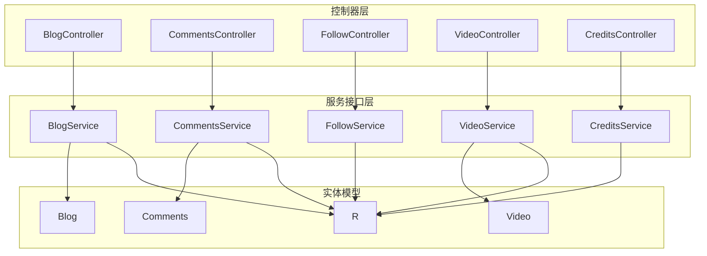
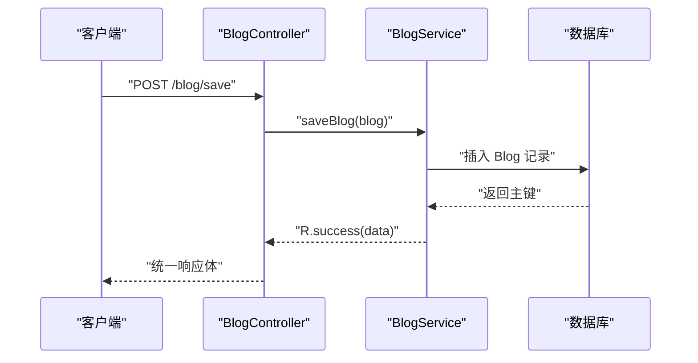
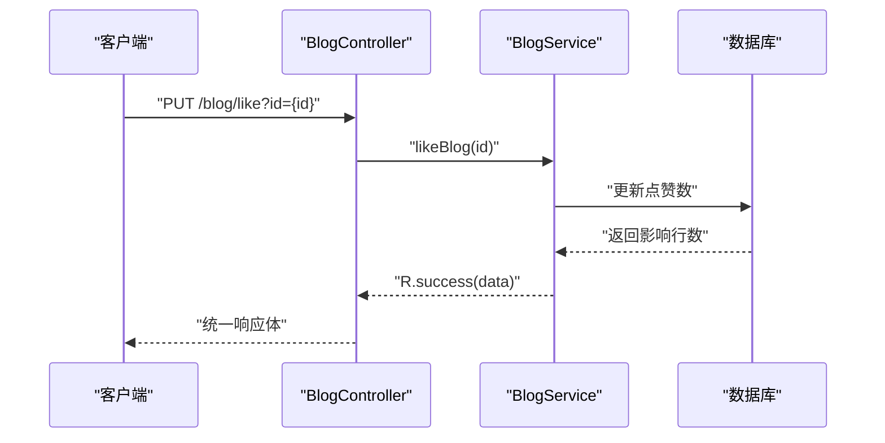
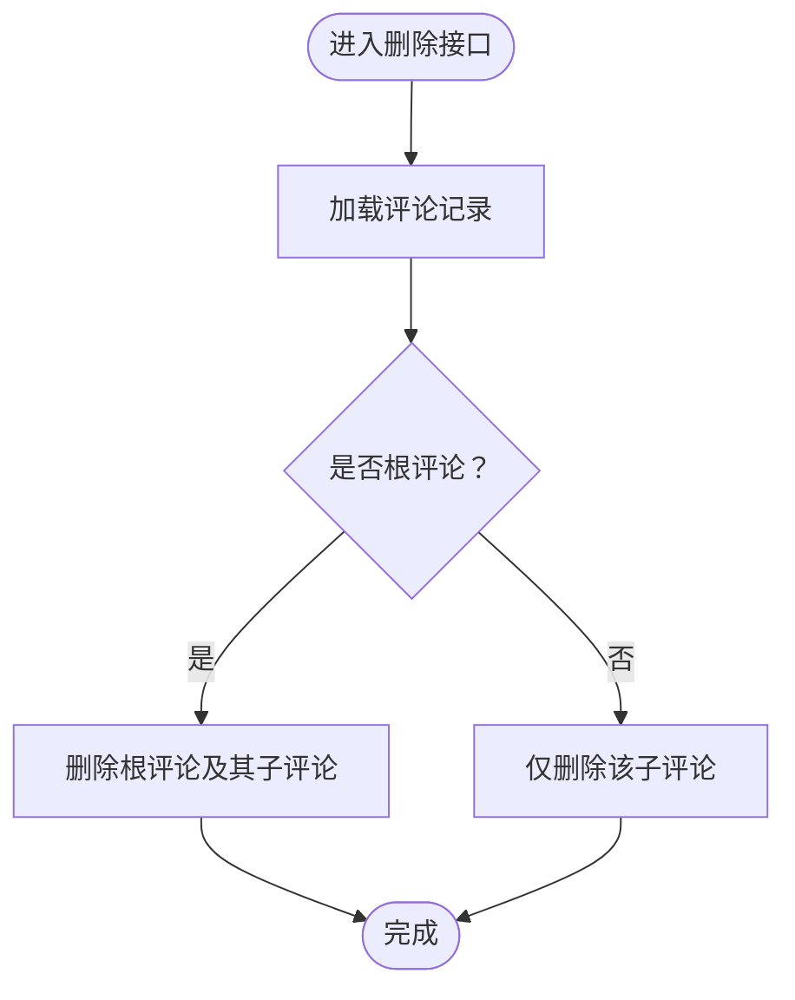
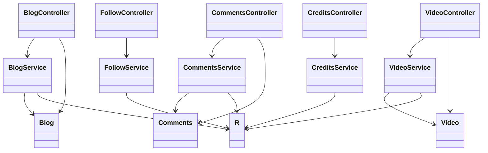

# 社交互动接口

<cite>
**本文引用的文件**
- [BlogController.java](file://springboot-travel-social/src/main/java/com/cxx/controller/BlogController.java)
- [BlogService.java](file://springboot-travel-social/src/main/java/com/cxx/service/BlogService.java)
- [Blog.java](file://springboot-travel-social/src/main/java/com/cxx/entity/Blog.java)
- [CommentsController.java](file://springboot-travel-social/src/main/java/com/cxx/controller/CommentsController.java)
- [CommentsService.java](file://springboot-travel-social/src/main/java/com/cxx/service/CommentsService.java)
- [Comments.java](file://springboot-travel-social/src/main/java/com/cxx/entity/Comments.java)
- [FollowController.java](file://springboot-travel-social/src/main/java/com/cxx/controller/FollowController.java)
- [FollowService.java](file://springboot-travel-social/src/main/java/com/cxx/service/FollowService.java)
- [VideoController.java](file://springboot-travel-social/src/main/java/com/cxx/controller/VideoController.java)
- [VideoService.java](file://springboot-travel-social/src/main/java/com/cxx/service/VideoService.java)
- [Video.java](file://springboot-travel-social/src/main/java/com/cxx/entity/Video.java)
- [CreditsController.java](file://springboot-travel-social/src/main/java/com/cxx/controller/CreditsController.java)
- [CreditsService.java](file://springboot-travel-social/src/main/java/com/cxx/service/CreditsService.java)
- [R.java](file://springboot-travel-social/src/main/java/com/cxx/entity/R.java)
</cite>

## 目录
1. [简介](#简介)
2. [项目结构](#项目结构)
3. [核心组件](#核心组件)
4. [架构总览](#架构总览)
5. [详细组件分析](#详细组件分析)
6. [依赖分析](#依赖分析)
7. [性能考虑](#性能考虑)
8. [故障排查指南](#故障排查指南)
9. [结论](#结论)
10. [附录](#附录)

## 简介
本文件面向社交互动相关接口的使用与集成，覆盖以下能力：
- 游记：发布、编辑（更新）、删除、点赞、评论、搜索、分页查询、浏览量统计
- 评论：新增、删除（含子评论联动删除）、按游记查询、点赞
- 关注/取消关注：关注、是否已关注、共同关注、好友动态、取消关注
- 视频：列表、详情、发布、点赞、收藏、用户发布/收藏查询
- 积分：查询用户积分
- 富文本编辑器数据格式：游记内容字段采用 HTML 文本存储，封面图提取策略
- 文件上传：multipart/form-data 的典型场景与建议字段命名
- 接口调用示例：请求方法、路径、参数、响应体结构

## 项目结构
后端采用 Spring Boot + MyBatis-Plus 架构，控制器位于 controller 包，服务接口位于 service 包，实体类位于 entity 包；统一响应体 R 提供成功/错误封装。

图表来源
- [BlogController.java:35-219](file://springboot-travel-social/src/main/java/com/cxx/controller/BlogController.java#L35-L219)
- [BlogService.java:15-26](file://springboot-travel-social/src/main/java/com/cxx/service/BlogService.java#L15-L26)
- [Blog.java:24-135](file://springboot-travel-social/src/main/java/com/cxx/entity/Blog.java#L24-L135)
- [CommentsController.java:21-68](file://springboot-travel-social/src/main/java/com/cxx/controller/CommentsController.java#L21-L68)
- [CommentsService.java:17-26](file://springboot-travel-social/src/main/java/com/cxx/service/CommentsService.java#L17-L26)
- [Comments.java:29-125](file://springboot-travel-social/src/main/java/com/cxx/entity/Comments.java#L29-L125)
- [FollowController.java:16-48](file://springboot-travel-social/src/main/java/com/cxx/controller/FollowController.java#L16-L48)
- [FollowService.java:15-26](file://springboot-travel-social/src/main/java/com/cxx/service/FollowService.java#L15-L26)
- [VideoController.java:13-68](file://springboot-travel-social/src/main/java/com/cxx/controller/VideoController.java#L13-L68)
- [VideoService.java:7-21](file://springboot-travel-social/src/main/java/com/cxx/service/VideoService.java#L7-L21)
- [Video.java:13-49](file://springboot-travel-social/src/main/java/com/cxx/entity/Video.java#L13-L49)
- [CreditsController.java:13-27](file://springboot-travel-social/src/main/java/com/cxx/controller/CreditsController.java#L13-L27)
- [CreditsService.java:7-10](file://springboot-travel-social/src/main/java/com/cxx/service/CreditsService.java#L7-L10)
- [R.java:9-32](file://springboot-travel-social/src/main/java/com/cxx/entity/R.java#L9-L32)

章节来源
- [BlogController.java:35-219](file://springboot-travel-social/src/main/java/com/cxx/controller/BlogController.java#L35-L219)
- [CommentsController.java:21-68](file://springboot-travel-social/src/main/java/com/cxx/controller/CommentsController.java#L21-L68)
- [FollowController.java:16-48](file://springboot-travel-social/src/main/java/com/cxx/controller/FollowController.java#L16-L48)
- [VideoController.java:13-68](file://springboot-travel-social/src/main/java/com/cxx/controller/VideoController.java#L13-L68)
- [CreditsController.java:13-27](file://springboot-travel-social/src/main/java/com/cxx/controller/CreditsController.java#L13-L27)

## 核心组件
- 统一响应体 R：所有接口返回统一结构，包含 code、msg、data 字段，便于前端处理。
- 实体模型：
  - Blog：游记实体，包含标题、内容（HTML）、图片、地点、标签、类型、点赞数、状态等。
  - Comments：评论实体，支持父子评论（parentId + children），包含内容、点赞、外键 foreignId 等。
  - Video：视频实体，包含标题、内容（HTML）、URL、点赞数、收藏数、标签等。
- 控制器与服务：
  - BlogController：游记 CRUD、点赞、搜索、分页、浏览量统计等。
  - CommentsController：评论新增、删除、查询、点赞。
  - FollowController：关注/取消关注、是否关注、共同关注、好友动态。
  - VideoController：视频列表、详情、发布、点赞、收藏、用户发布/收藏查询。
  - CreditsController：查询用户积分。

章节来源
- [R.java:9-32](file://springboot-travel-social/src/main/java/com/cxx/entity/R.java#L9-L32)
- [Blog.java:24-135](file://springboot-travel-social/src/main/java/com/cxx/entity/Blog.java#L24-L135)
- [Comments.java:29-125](file://springboot-travel-social/src/main/java/com/cxx/entity/Comments.java#L29-L125)
- [Video.java:13-49](file://springboot-travel-social/src/main/java/com/cxx/entity/Video.java#L13-L49)

## 架构总览
后端采用典型的 MVC 分层，控制器负责路由与参数校验，服务层编排业务逻辑，实体与 Mapper 负责数据持久化。统一响应体 R 保证前后端契约一致。

图表来源
- [BlogController.java:117-122](file://springboot-travel-social/src/main/java/com/cxx/controller/BlogController.java#L117-L122)
- [BlogService.java:15-26](file://springboot-travel-social/src/main/java/com/cxx/service/BlogService.java#L15-L26)

## 详细组件分析

### 游记接口（Blog）
- 功能清单
  - 发布游记：POST /blog/save
  - 编辑游记：PUT /blog/update（由控制器未暴露，需在服务层或扩展）
  - 删除游记：DELETE /blog/deleteById/{blogId}
  - 点赞游记：PUT /blog/like
  - 搜索游记：GET /blog/getBlogByKey/{key}
  - 分页查询：GET /blog/queryBlog
  - 热门推荐：GET /blog/hot
  - 浏览量统计：GET /blog/queryBrowse
  - 按用户查询游记：GET /blog/queryById
  - 按用户查询攻略：GET /blog/queryStrategyById
  - 通过游记查询用户ID：GET /blog/getBlogUserId
  - 通过ID查询游记：GET /blog/queryBlogById
  - 获取用户点赞的游记：GET /blog/getUserLikeBlog

- 富文本编辑器数据格式
  - 内容字段 content 为 HTML 文本，封面图提取策略：解析 HTML 中的图片 src 作为封面图首图，若无则使用默认图。

- 接口调用示例
  - 发布游记
    - 方法：POST
    - 路径：/blog/save
    - 请求体：Blog 对象（包含 title、content、images、location、tag、musicUrl、type、status 等）
    - 响应：R.success(data)
  - 删除游记
    - 方法：DELETE
    - 路径：/blog/deleteById/{blogId}
    - 路径参数：blogId
    - 响应：R.success()

- 错误处理
  - 控制器层对异常进行统一包装，服务层抛出的异常最终由全局异常处理器转换为 R.error(msg)。

章节来源
- [BlogController.java:48-195](file://springboot-travel-social/src/main/java/com/cxx/controller/BlogController.java#L48-L195)
- [BlogService.java:15-26](file://springboot-travel-social/src/main/java/com/cxx/service/BlogService.java#L15-L26)
- [Blog.java:24-135](file://springboot-travel-social/src/main/java/com/cxx/entity/Blog.java#L24-L135)

#### 游记点赞流程

图表来源
- [BlogController.java:130-134](file://springboot-travel-social/src/main/java/com/cxx/controller/BlogController.java#L130-L134)
- [BlogService.java:15-26](file://springboot-travel-social/src/main/java/com/cxx/service/BlogService.java#L15-L26)

### 评论接口（Comments）
- 功能清单
  - 新增评论：POST /comments/save
  - 删除评论：DELETE /comments/delComment
  - 查询某游记评论：GET /comments/getComments
  - 用户发布的评论：GET /comments/getCommentByUserId
  - 点赞评论：PUT /comments/likeComment/{commentId}

- 回复机制
  - 支持父子评论：通过 parentId 关联；删除根评论时会级联删除其子评论。

- 接口调用示例
  - 新增评论
    - 方法：POST
    - 路径：/comments/save
    - 请求体：Comments 对象（包含 content、foreignId、parentId、target 等）
    - 响应：R.success(data)
  - 删除评论
    - 方法：DELETE
    - 路径：/comments/delComment
    - 查询参数：commentId
    - 响应：R.success()

章节来源
- [CommentsController.java:21-68](file://springboot-travel-social/src/main/java/com/cxx/controller/CommentsController.java#L21-L68)
- [CommentsService.java:17-26](file://springboot-travel-social/src/main/java/com/cxx/service/CommentsService.java#L17-L26)
- [Comments.java:29-125](file://springboot-travel-social/src/main/java/com/cxx/entity/Comments.java#L29-L125)

#### 评论删除流程

图表来源
- [CommentsController.java:40-53](file://springboot-travel-social/src/main/java/com/cxx/controller/CommentsController.java#L40-L53)

### 关注/取消关注接口（Follow）
- 功能清单
  - 关注：PUT /follow/{id}/{isFollow}
  - 取消关注：DELETE /follow/cancelFollow/{followUserId}
  - 是否关注：GET /follow/or/not
  - 共同关注：GET /follow/common
  - 好友动态：GET /follow/friendCircle

- 接口调用示例
  - 关注/取关
    - 方法：PUT
    - 路径：/follow/{id}/{isFollow}
    - 路径参数：id（被关注用户ID）、isFollow（true/false）
    - 响应：R.success()

章节来源
- [FollowController.java:16-48](file://springboot-travel-social/src/main/java/com/cxx/controller/FollowController.java#L16-L48)
- [FollowService.java:15-26](file://springboot-travel-social/src/main/java/com/cxx/service/FollowService.java#L15-L26)

### 视频接口（Video）
- 功能清单
  - 获取视频列表：GET /video/getVideoList
  - 获取视频详情：GET /video/getVideoInfo/{videoId}
  - 发布视频：POST /video/save
  - 用户发布的视频：GET /video/queryVideoByUserId/{userId}
  - 点赞视频：PUT /video/like/{videoId}
  - 收藏视频：PUT /video/collection/{videoId}
  - 用户收藏的视频：GET /video/getUserSaveVideo

- 接口调用示例
  - 发布视频
    - 方法：POST
    - 路径：/video/save
    - 请求体：Video 对象（包含 title、content、url、tag、userId 等）
    - 响应：R.success(data)
  - 点赞/收藏
    - 方法：PUT
    - 路径：/video/like/{videoId} 或 /video/collection/{videoId}
    - 路径参数：videoId
    - 响应：R.success()

章节来源
- [VideoController.java:13-68](file://springboot-travel-social/src/main/java/com/cxx/controller/VideoController.java#L13-L68)
- [VideoService.java:7-21](file://springboot-travel-social/src/main/java/com/cxx/service/VideoService.java#L7-L21)
- [Video.java:13-49](file://springboot-travel-social/src/main/java/com/cxx/entity/Video.java#L13-L49)

### 积分接口（Credits）
- 功能清单
  - 查询用户积分：GET /credits/getCreditsInfoById/{userId}

- 接口调用示例
  - 查询积分
    - 方法：GET
    - 路径：/credits/getCreditsInfoById/{userId}
    - 路径参数：userId
    - 响应：R.success(data)

章节来源
- [CreditsController.java:13-27](file://springboot-travel-social/src/main/java/com/cxx/controller/CreditsController.java#L13-L27)
- [CreditsService.java:7-10](file://springboot-travel-social/src/main/java/com/cxx/service/CreditsService.java#L7-L10)

## 依赖分析
- 控制器到服务：各控制器均通过 @Resource/@Autowired 注入对应服务接口，遵循面向接口编程。
- 服务到实体：服务层接收/返回实体对象，控制器负责参数绑定与统一响应。
- 统一响应：所有控制器返回 R，简化前端处理。

图表来源
- [BlogController.java:35-219](file://springboot-travel-social/src/main/java/com/cxx/controller/BlogController.java#L35-L219)
- [BlogService.java:15-26](file://springboot-travel-social/src/main/java/com/cxx/service/BlogService.java#L15-L26)
- [Blog.java:24-135](file://springboot-travel-social/src/main/java/com/cxx/entity/Blog.java#L24-L135)
- [CommentsController.java:21-68](file://springboot-travel-social/src/main/java/com/cxx/controller/CommentsController.java#L21-L68)
- [CommentsService.java:17-26](file://springboot-travel-social/src/main/java/com/cxx/service/CommentsService.java#L17-L26)
- [Comments.java:29-125](file://springboot-travel-social/src/main/java/com/cxx/entity/Comments.java#L29-L125)
- [FollowController.java:16-48](file://springboot-travel-social/src/main/java/com/cxx/controller/FollowController.java#L16-L48)
- [FollowService.java:15-26](file://springboot-travel-social/src/main/java/com/cxx/service/FollowService.java#L15-L26)
- [VideoController.java:13-68](file://springboot-travel-social/src/main/java/com/cxx/controller/VideoController.java#L13-L68)
- [VideoService.java:7-21](file://springboot-travel-social/src/main/java/com/cxx/service/VideoService.java#L7-L21)
- [Video.java:13-49](file://springboot-travel-social/src/main/java/com/cxx/entity/Video.java#L13-L49)
- [CreditsController.java:13-27](file://springboot-travel-social/src/main/java/com/cxx/controller/CreditsController.java#L13-L27)
- [CreditsService.java:7-10](file://springboot-travel-social/src/main/java/com/cxx/service/CreditsService.java#L7-L10)
- [R.java:9-32](file://springboot-travel-social/src/main/java/com/cxx/entity/R.java#L9-L32)

## 性能考虑
- 分页查询：游记与视频列表均支持分页参数，建议前端传入合理的 pageNum/pageSize，避免一次性拉取过多数据。
- 点赞/收藏：采用原子更新策略，减少并发冲突；建议在服务层增加幂等控制与缓存优化。
- 富文本封面提取：解析 HTML 图片可能带来额外 CPU 开销，建议在后台异步处理或缓存首图结果。
- 统一响应体：减少前端分支判断，提升交互一致性。

## 故障排查指南
- 返回码约定
  - 成功：code=1，msg="success"
  - 失败：code=0，msg 为错误信息
- 常见问题
  - 参数缺失：检查路径参数/查询参数/请求体字段是否完整
  - 权限校验：关注/取消关注、删除游记等需要登录态与权限校验
  - 并发写入：点赞/收藏需注意重复提交与幂等性
- 定位步骤
  - 查看控制器日志与异常栈
  - 校验服务层入参与业务规则
  - 使用统一响应体 R.error(msg) 快速定位错误原因

章节来源
- [R.java:9-32](file://springboot-travel-social/src/main/java/com/cxx/entity/R.java#L9-L32)

## 结论
本项目围绕游记、评论、关注、视频与积分构建了完整的社交互动能力，接口设计清晰、职责明确，并通过统一响应体提升了前后端协作效率。建议在生产环境中进一步完善鉴权、限流、缓存与异步处理，以提升稳定性与性能。

## 附录

### 接口一览与调用示例

- 游记
  - 发布：POST /blog/save
  - 删除：DELETE /blog/deleteById/{blogId}
  - 点赞：PUT /blog/like
  - 搜索：GET /blog/getBlogByKey/{key}
  - 列表：GET /blog/queryBlog
  - 热榜：GET /blog/hot
  - 浏览量：GET /blog/queryBrowse
  - 用户游记：GET /blog/queryById
  - 用户攻略：GET /blog/queryStrategyById
  - 通过ID查询：GET /blog/queryBlogById
  - 用户点赞游记：GET /blog/getUserLikeBlog

- 评论
  - 新增：POST /comments/save
  - 删除：DELETE /comments/delComment
  - 查询：GET /comments/getComments
  - 用户评论：GET /comments/getCommentByUserId
  - 点赞：PUT /comments/likeComment/{commentId}

- 关注
  - 关注/取关：PUT /follow/{id}/{isFollow}
  - 取消关注：DELETE /follow/cancelFollow/{followUserId}
  - 是否关注：GET /follow/or/not
  - 共同关注：GET /follow/common
  - 好友动态：GET /follow/friendCircle

- 视频
  - 列表：GET /video/getVideoList
  - 详情：GET /video/getVideoInfo/{videoId}
  - 发布：POST /video/save
  - 用户发布：GET /video/queryVideoByUserId/{userId}
  - 点赞：PUT /video/like/{videoId}
  - 收藏：PUT /video/collection/{videoId}
  - 用户收藏：GET /video/getUserSaveVideo

- 积分
  - 查询：GET /credits/getCreditsInfoById/{userId}

### 富文本与封面图
- 游记内容字段 content 为 HTML 文本
- 封面图提取：解析 HTML 中的图片 src 作为首图；若无图片，使用默认图

章节来源
- [BlogController.java:197-216](file://springboot-travel-social/src/main/java/com/cxx/controller/BlogController.java#L197-L216)
- [Blog.java:84-85](file://springboot-travel-social/src/main/java/com/cxx/entity/Blog.java#L84-L85)

### 文件上传 multipart/form-data 建议
- 场景：视频上传、头像上传、图片上传
- 建议字段命名
  - 视频：file（二进制流）、title、content、tag、userId
  - 图片：file（二进制流）、bizType（业务类型标识）
- 注意事项
  - 后端需配置文件大小限制与白名单校验
  - 建议使用 OSS 等对象存储并返回访问 URL