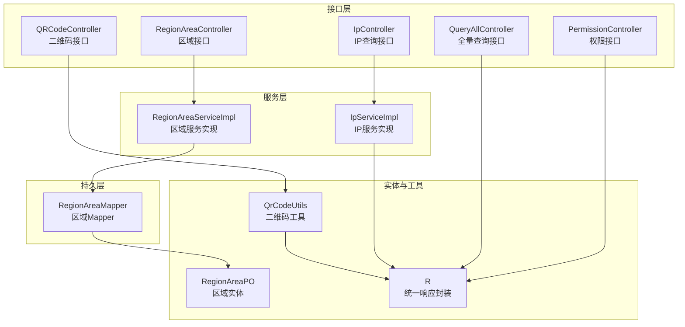
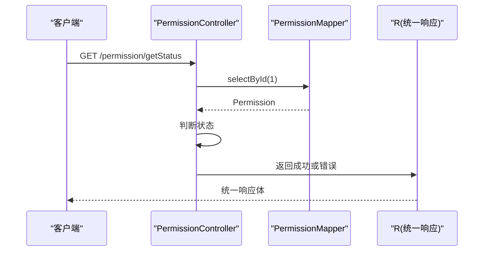
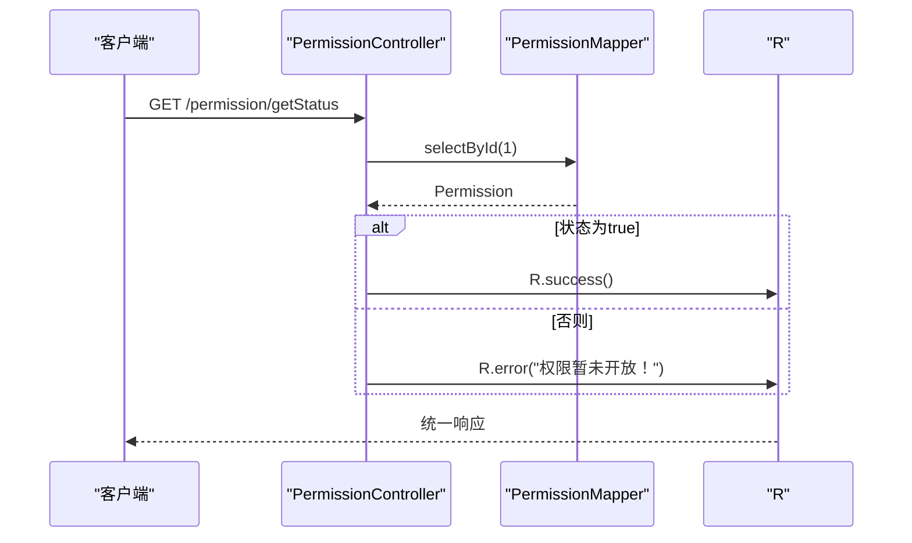
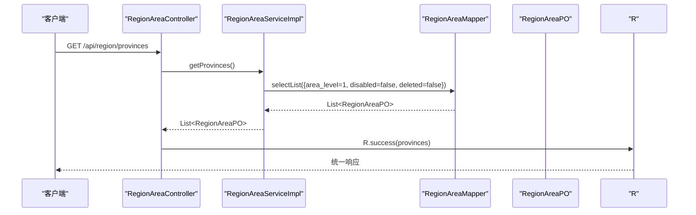
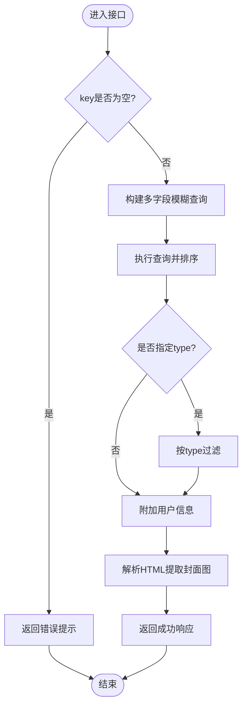
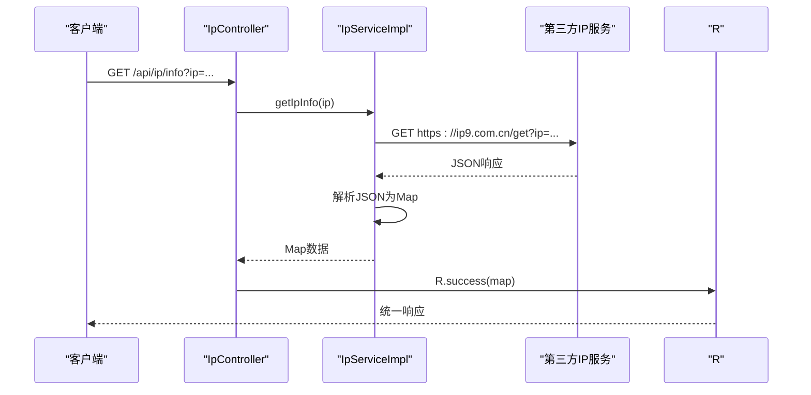
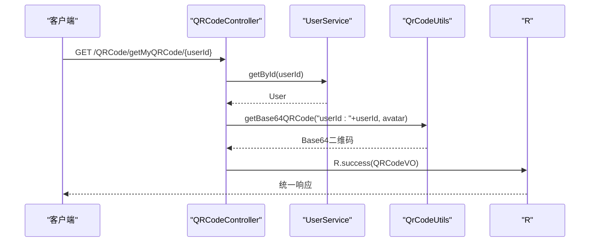
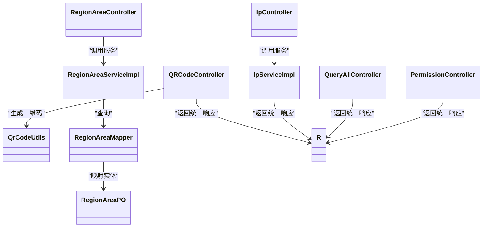

# 系统管理接口

<cite>
**本文档引用的文件**
- [PermissionController.java](file://springboot-travel-social/src/main/java/com/cxx/controller/PermissionController.java)
- [RegionAreaController.java](file://springboot-travel-social/src/main/java/com/cxx/controller/RegionAreaController.java)
- [QueryAllController.java](file://springboot-travel-social/src/main/java/com/cxx/controller/QueryAllController.java)
- [IpController.java](file://springboot-travel-social/src/main/java/com/cxx/controller/IpController.java)
- [QRCodeController.java](file://springboot-travel-social/src/main/java/com/cxx/controller/QRCodeController.java)
- [RegionAreaServiceImpl.java](file://springboot-travel-social/src/main/java/com/cxx/service/impl/RegionAreaServiceImpl.java)
- [IpServiceImpl.java](file://springboot-travel-social/src/main/java/com/cxx/service/impl/IpServiceImpl.java)
- [QrCodeUtils.java](file://springboot-travel-social/src/main/java/com/cxx/utils/QrCodeUtils.java)
- [RegionAreaPO.java](file://springboot-travel-social/src/main/java/com/cxx/entity/RegionAreaPO.java)
- [RegionAreaMapper.java](file://springboot-travel-social/src/main/java/com/cxx/mapper/RegionAreaMapper.java)
- [R.java](file://springboot-travel-social/src/main/java/com/cxx/entity/R.java)
- [application.properties](file://springboot-travel-social/src/main/resources/application.properties)
</cite>

## 目录
1. [简介](#简介)
2. [项目结构](#项目结构)
3. [核心组件](#核心组件)
4. [架构总览](#架构总览)
5. [详细组件分析](#详细组件分析)
6. [依赖关系分析](#依赖关系分析)
7. [性能考虑](#性能考虑)
8. [故障排除指南](#故障排除指南)
9. [结论](#结论)

## 简介
本文件面向系统管理相关API接口，涵盖以下主题：
- 权限管理接口：角色分配、权限查询、访问控制等
- 地区区域接口：省市区数据查询、行政区划管理
- 全量查询接口：数据字典、配置参数等系统级数据获取
- IP地址查询接口：地理位置解析、反爬虫处理
- 二维码生成功能：订单二维码、活动二维码等
- 系统配置接口：参数设置、开关控制
- 系统监控与日志接口：实现机制说明

注：当前仓库中权限管理接口仅提供一个简化的开关状态查询；系统监控与日志接口未在后端控制器中发现具体实现。

## 项目结构
后端采用Spring Boot标准分层架构，主要目录如下：
- controller：对外HTTP接口层（权限、区域、查询、IP、二维码等）
- service/impl：业务逻辑层（区域、IP等服务实现）
- mapper：MyBatis映射层
- entity：数据模型
- utils：工具类（二维码生成）
- resources：配置文件（数据库、Redis、邮件、AI等）

**图表来源**
- [PermissionController.java:18-32](file://springboot-travel-social/src/main/java/com/cxx/controller/PermissionController.java#L18-L32)
- [RegionAreaController.java:20-76](file://springboot-travel-social/src/main/java/com/cxx/controller/RegionAreaController.java#L20-L76)
- [QueryAllController.java:22-251](file://springboot-travel-social/src/main/java/com/cxx/controller/QueryAllController.java#L22-L251)
- [IpController.java:19-39](file://springboot-travel-social/src/main/java/com/cxx/controller/IpController.java#L19-L39)
- [QRCodeController.java:21-37](file://springboot-travel-social/src/main/java/com/cxx/controller/QRCodeController.java#L21-L37)
- [RegionAreaServiceImpl.java:16-113](file://springboot-travel-social/src/main/java/com/cxx/service/impl/RegionAreaServiceImpl.java#L16-L113)
- [IpServiceImpl.java:20-106](file://springboot-travel-social/src/main/java/com/cxx/service/impl/IpServiceImpl.java#L20-L106)
- [QrCodeUtils.java:27-150](file://springboot-travel-social/src/main/java/com/cxx/utils/QrCodeUtils.java#L27-L150)
- [RegionAreaPO.java:18-77](file://springboot-travel-social/src/main/java/com/cxx/entity/RegionAreaPO.java#L18-L77)
- [RegionAreaMapper.java:12-14](file://springboot-travel-social/src/main/java/com/cxx/mapper/RegionAreaMapper.java#L12-L14)
- [R.java:14-30](file://springboot-travel-social/src/main/java/com/cxx/entity/R.java#L14-L30)

**章节来源**
- [PermissionController.java:18-32](file://springboot-travel-social/src/main/java/com/cxx/controller/PermissionController.java#L18-L32)
- [RegionAreaController.java:20-76](file://springboot-travel-social/src/main/java/com/cxx/controller/RegionAreaController.java#L20-L76)
- [QueryAllController.java:22-251](file://springboot-travel-social/src/main/java/com/cxx/controller/QueryAllController.java#L22-L251)
- [IpController.java:19-39](file://springboot-travel-social/src/main/java/com/cxx/controller/IpController.java#L19-L39)
- [QRCodeController.java:21-37](file://springboot-travel-social/src/main/java/com/cxx/controller/QRCodeController.java#L21-L37)

## 核心组件
- 统一响应封装R：所有接口返回统一结构（状态码、消息、数据），便于前端处理与调试。
- 区域实体RegionAreaPO：描述省市区层级、排序、禁用状态、逻辑删除等字段。
- 区域Mapper/Service：提供省市区数据查询与层级过滤能力。
- IP服务：封装第三方IP查询接口，支持异常兜底与超时控制。
- 二维码工具：基于ZXing生成带Logo的Base64二维码，供名片/分享场景使用。

**章节来源**
- [R.java:14-30](file://springboot-travel-social/src/main/java/com/cxx/entity/R.java#L14-L30)
- [RegionAreaPO.java:18-77](file://springboot-travel-social/src/main/java/com/cxx/entity/RegionAreaPO.java#L18-L77)
- [RegionAreaMapper.java:12-14](file://springboot-travel-social/src/main/java/com/cxx/mapper/RegionAreaMapper.java#L12-L14)
- [IpServiceImpl.java:20-106](file://springboot-travel-social/src/main/java/com/cxx/service/impl/IpServiceImpl.java#L20-L106)
- [QrCodeUtils.java:27-150](file://springboot-travel-social/src/main/java/com/cxx/utils/QrCodeUtils.java#L27-L150)

## 架构总览
系统采用前后端分离模式，后端通过REST接口提供数据与服务能力。接口层负责参数校验与调用服务层，服务层执行业务逻辑并访问数据层，最终返回统一响应。

**图表来源**
- [PermissionController.java:24-31](file://springboot-travel-social/src/main/java/com/cxx/controller/PermissionController.java#L24-L31)

## 详细组件分析

### 权限管理接口
- 接口路径：/permission/getStatus
- 功能：读取权限表第一条记录的状态字段，用于快速判断系统某项功能是否开放
- 访问控制：当前为公开接口，未做鉴权校验
- 返回：统一响应封装，成功或错误提示

**图表来源**
- [PermissionController.java:24-31](file://springboot-travel-social/src/main/java/com/cxx/controller/PermissionController.java#L24-L31)

**章节来源**
- [PermissionController.java:18-32](file://springboot-travel-social/src/main/java/com/cxx/controller/PermissionController.java#L18-L32)

### 地区区域接口
- 接口路径：/api/region
- 提供能力：
  - 获取所有省份：GET /api/region/provinces
  - 根据省份代码获取城市：GET /api/region/cities?provinceCode=xxx
  - 根据城市代码获取区县：GET /api/region/districts?cityCode=xxx
  - 根据区域代码获取区域信息：GET /api/region/info?areaCode=xxx
- 实现机制：
  - 控制器调用RegionAreaService
  - 服务层按层级与筛选条件查询数据库
  - 返回统一响应封装

**图表来源**
- [RegionAreaController.java:32-36](file://springboot-travel-social/src/main/java/com/cxx/controller/RegionAreaController.java#L32-L36)
- [RegionAreaServiceImpl.java:26-43](file://springboot-travel-social/src/main/java/com/cxx/service/impl/RegionAreaServiceImpl.java#L26-L43)
- [RegionAreaMapper.java:12-14](file://springboot-travel-social/src/main/java/com/cxx/mapper/RegionAreaMapper.java#L12-L14)
- [RegionAreaPO.java:18-77](file://springboot-travel-social/src/main/java/com/cxx/entity/RegionAreaPO.java#L18-L77)

**章节来源**
- [RegionAreaController.java:20-76](file://springboot-travel-social/src/main/java/com/cxx/controller/RegionAreaController.java#L20-L76)
- [RegionAreaServiceImpl.java:16-113](file://springboot-travel-social/src/main/java/com/cxx/service/impl/RegionAreaServiceImpl.java#L16-L113)
- [RegionAreaMapper.java:12-14](file://springboot-travel-social/src/main/java/com/cxx/mapper/RegionAreaMapper.java#L12-L14)
- [RegionAreaPO.java:18-77](file://springboot-travel-social/src/main/java/com/cxx/entity/RegionAreaPO.java#L18-L77)

### 全量查询接口
- 接口路径：/queryAll
- 主要能力：
  - 搜索博客（含标题、内容、地点）：GET /queryAll/searchByKey?key=...&type=...
  - 搜索策略（带封面图解析）：GET /queryAll/searStrategychByKey?key=...&type=...
  - 获取热门攻略（分页）：GET /queryAll/getStrategy
  - 获取最新攻略列表：GET /queryAll/getStrategyList
  - 全量搜索（按内容/标题/地点）：GET /queryAll/getAll?key=...
  - 用户搜索（粉丝/关注数统计）：GET /queryAll/searchUser?key=...
  - 建议搜索（地点/标签）：GET /queryAll/getSuggestion?key=...
- 实现要点：
  - 使用MyBatis-Plus条件构造器进行多字段模糊查询
  - 对HTML内容解析提取首张图片作为封面
  - 聚合用户头像、昵称、等级、粉丝数、关注数等信息

**图表来源**
- [QueryAllController.java:34-63](file://springboot-travel-social/src/main/java/com/cxx/controller/QueryAllController.java#L34-L63)
- [QueryAllController.java:65-98](file://springboot-travel-social/src/main/java/com/cxx/controller/QueryAllController.java#L65-L98)
- [QueryAllController.java:100-135](file://springboot-travel-social/src/main/java/com/cxx/controller/QueryAllController.java#L100-L135)
- [QueryAllController.java:137-170](file://springboot-travel-social/src/main/java/com/cxx/controller/QueryAllController.java#L137-L170)
- [QueryAllController.java:193-212](file://springboot-travel-social/src/main/java/com/cxx/controller/QueryAllController.java#L193-L212)
- [QueryAllController.java:214-236](file://springboot-travel-social/src/main/java/com/cxx/controller/QueryAllController.java#L214-L236)
- [QueryAllController.java:238-250](file://springboot-travel-social/src/main/java/com/cxx/controller/QueryAllController.java#L238-L250)

**章节来源**
- [QueryAllController.java:22-251](file://springboot-travel-social/src/main/java/com/cxx/controller/QueryAllController.java#L22-L251)

### IP地址查询接口
- 接口路径：/api/ip/info?ip=...
- 功能：调用第三方IP查询服务，返回地理位置等信息
- 实现机制：
  - 控制器接收IP参数并调用IpService
  - 服务层拼装URL并发送HTTP GET请求
  - 解析JSON响应为Map并返回统一响应
  - 异常时返回包含错误信息的Map

**图表来源**
- [IpController.java:32-38](file://springboot-travel-social/src/main/java/com/cxx/controller/IpController.java#L32-L38)
- [IpServiceImpl.java:31-56](file://springboot-travel-social/src/main/java/com/cxx/service/impl/IpServiceImpl.java#L31-L56)

**章节来源**
- [IpController.java:19-39](file://springboot-travel-social/src/main/java/com/cxx/controller/IpController.java#L19-L39)
- [IpServiceImpl.java:20-106](file://springboot-travel-social/src/main/java/com/cxx/service/impl/IpServiceImpl.java#L20-L106)

### 二维码生成功能
- 接口路径：/QRCode/getMyQRCode/{userId}
- 功能：生成用户名片二维码（包含用户头像Logo），返回Base64数据
- 实现机制：
  - 控制器根据userId查询用户信息
  - 调用QrCodeUtils生成二维码图像并转换为Base64
  - 封装用户名、头像、二维码链接返回统一响应

**图表来源**
- [QRCodeController.java:28-36](file://springboot-travel-social/src/main/java/com/cxx/controller/QRCodeController.java#L28-L36)
- [QrCodeUtils.java:62-76](file://springboot-travel-social/src/main/java/com/cxx/utils/QrCodeUtils.java#L62-L76)

**章节来源**
- [QRCodeController.java:21-37](file://springboot-travel-social/src/main/java/com/cxx/controller/QRCodeController.java#L21-L37)
- [QrCodeUtils.java:27-150](file://springboot-travel-social/src/main/java/com/cxx/utils/QrCodeUtils.java#L27-L150)

### 系统配置接口
- 当前后端未提供专门的“系统配置”接口（如参数设置、开关控制）。若需扩展，建议：
  - 新增配置实体与Mapper
  - 新增配置控制器与服务层
  - 提供增删改查与批量更新接口
  - 结合统一响应R进行返回
- 可参考现有结构（如权限接口）进行开发，保持一致的命名与返回规范。

**章节来源**
- [R.java:14-30](file://springboot-travel-social/src/main/java/com/cxx/entity/R.java#L14-L30)

### 系统监控与日志接口
- 当前后端未发现专门的“系统监控与日志”接口控制器。
- 日志方面：
  - 工具类QrCodeUtils使用SLF4J记录错误日志
  - 应用配置文件中定义了部分日志级别（如事务管理器）
- 若需扩展监控接口，可在控制器层新增对应端点，并结合服务层采集指标数据。

**章节来源**
- [QrCodeUtils.java:27-28](file://springboot-travel-social/src/main/java/com/cxx/utils/QrCodeUtils.java#L27-L28)
- [application.properties:18](file://springboot-travel-social/src/main/resources/application.properties#L18)

## 依赖关系分析
- 控制器依赖服务层，服务层依赖Mapper与实体
- 统一响应R贯穿所有接口，保证返回一致性
- IP服务依赖第三方HTTP接口，具备异常兜底
- 二维码工具依赖第三方库（ZXing、Base64），生成带Logo的二维码

**图表来源**
- [PermissionController.java:18-32](file://springboot-travel-social/src/main/java/com/cxx/controller/PermissionController.java#L18-L32)
- [RegionAreaController.java:20-76](file://springboot-travel-social/src/main/java/com/cxx/controller/RegionAreaController.java#L20-L76)
- [QueryAllController.java:22-251](file://springboot-travel-social/src/main/java/com/cxx/controller/QueryAllController.java#L22-L251)
- [IpController.java:19-39](file://springboot-travel-social/src/main/java/com/cxx/controller/IpController.java#L19-L39)
- [QRCodeController.java:21-37](file://springboot-travel-social/src/main/java/com/cxx/controller/QRCodeController.java#L21-L37)
- [RegionAreaServiceImpl.java:16-113](file://springboot-travel-social/src/main/java/com/cxx/service/impl/RegionAreaServiceImpl.java#L16-L113)
- [IpServiceImpl.java:20-106](file://springboot-travel-social/src/main/java/com/cxx/service/impl/IpServiceImpl.java#L20-L106)
- [QrCodeUtils.java:27-150](file://springboot-travel-social/src/main/java/com/cxx/utils/QrCodeUtils.java#L27-L150)
- [RegionAreaPO.java:18-77](file://springboot-travel-social/src/main/java/com/cxx/entity/RegionAreaPO.java#L18-L77)
- [RegionAreaMapper.java:12-14](file://springboot-travel-social/src/main/java/com/cxx/mapper/RegionAreaMapper.java#L12-L14)
- [R.java:14-30](file://springboot-travel-social/src/main/java/com/cxx/entity/R.java#L14-L30)

**章节来源**
- [RegionAreaServiceImpl.java:16-113](file://springboot-travel-social/src/main/java/com/cxx/service/impl/RegionAreaServiceImpl.java#L16-L113)
- [IpServiceImpl.java:20-106](file://springboot-travel-social/src/main/java/com/cxx/service/impl/IpServiceImpl.java#L20-L106)
- [QrCodeUtils.java:27-150](file://springboot-travel-social/src/main/java/com/cxx/utils/QrCodeUtils.java#L27-L150)

## 性能考虑
- 查询优化：
  - 区域查询已按层级与禁用/删除状态过滤，建议在area_code、city_code、province_code等字段建立索引
  - 全量查询使用多字段模糊匹配，建议对常用查询字段建立复合索引
- IO与网络：
  - IP查询依赖第三方HTTP接口，已设置连接与读取超时，建议增加重试与熔断策略
  - 二维码生成涉及IO与图像处理，建议限制并发与缓存热点二维码
- 分页与排序：
  - 全量查询接口已使用分页，建议对排序字段建立索引以提升性能

[本节为通用指导，无需特定文件来源]

## 故障排除指南
- 权限接口返回“权限暂未开放”
  - 检查权限表第一条记录的状态值
  - 确认数据库连接与权限表数据正确性
- 区域接口返回空数据
  - 检查sys_region_area表中area_level层级与disabled/deleted字段
  - 确认Mapper映射与实体字段一致
- IP查询接口返回错误
  - 检查第三方服务可用性与网络连通性
  - 查看服务层异常日志与超时设置
- 二维码生成失败
  - 检查用户头像URL可访问性
  - 查看工具类日志输出，确认Base64编码与图像写入流程

**章节来源**
- [PermissionController.java:24-31](file://springboot-travel-social/src/main/java/com/cxx/controller/PermissionController.java#L24-L31)
- [RegionAreaServiceImpl.java:26-43](file://springboot-travel-social/src/main/java/com/cxx/service/impl/RegionAreaServiceImpl.java#L26-L43)
- [IpServiceImpl.java:31-56](file://springboot-travel-social/src/main/java/com/cxx/service/impl/IpServiceImpl.java#L31-L56)
- [QrCodeUtils.java:62-76](file://springboot-travel-social/src/main/java/com/cxx/utils/QrCodeUtils.java#L62-L76)

## 结论
本系统管理接口覆盖了权限开关、区域数据、全量查询、IP解析与二维码生成等核心能力。接口设计遵循统一响应规范，服务层职责清晰，具备良好的扩展性。对于权限管理与系统监控，当前仓库提供了简化的实现，后续可根据业务需求进一步完善与增强。