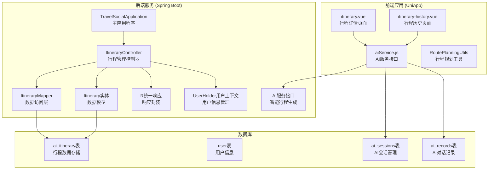
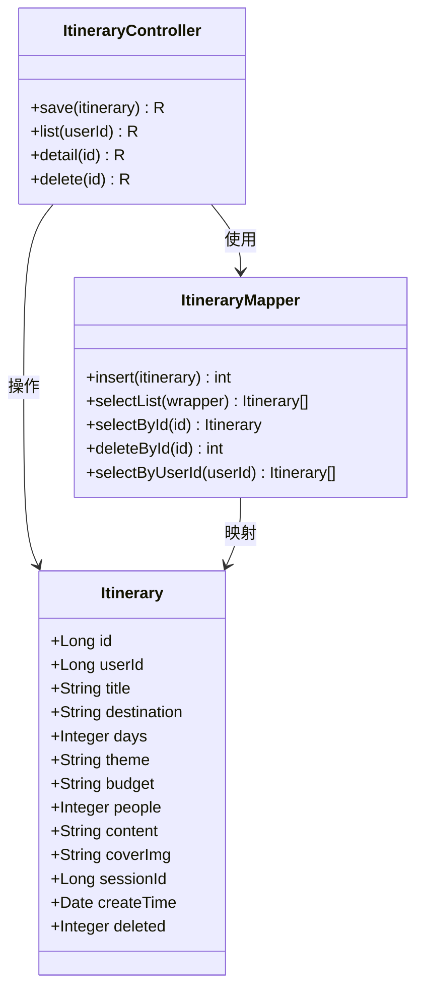
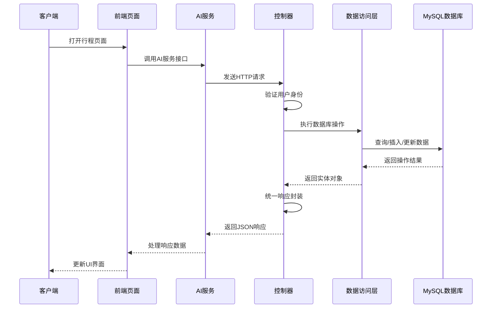
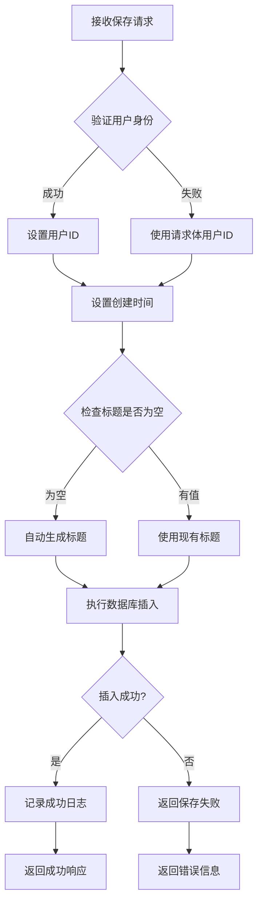
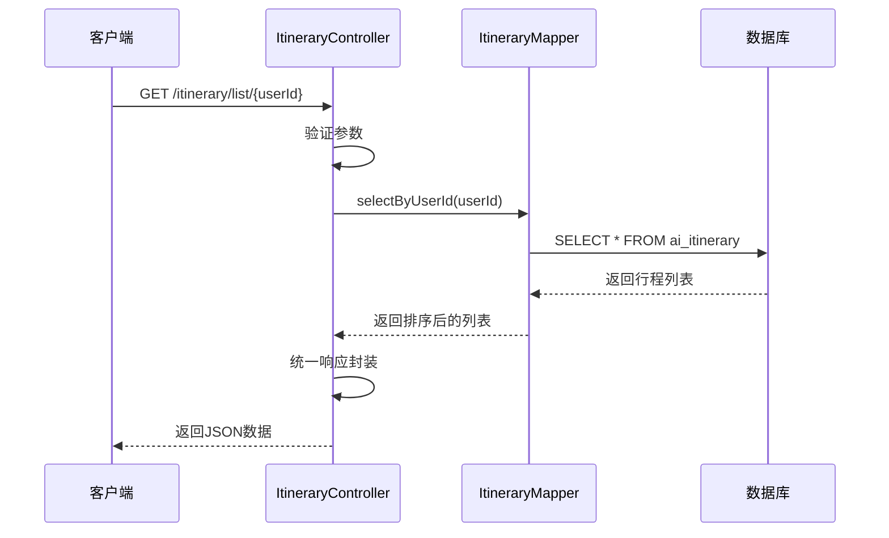
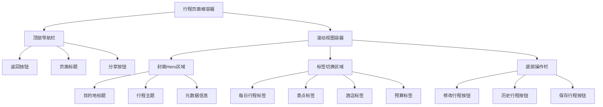
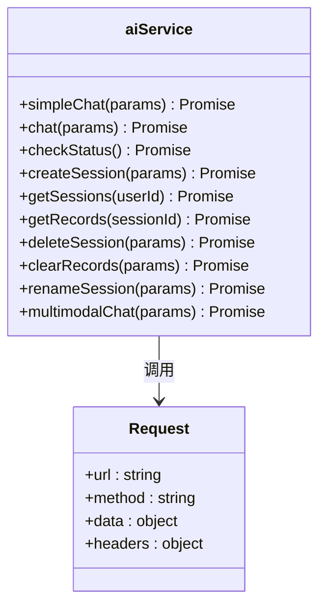
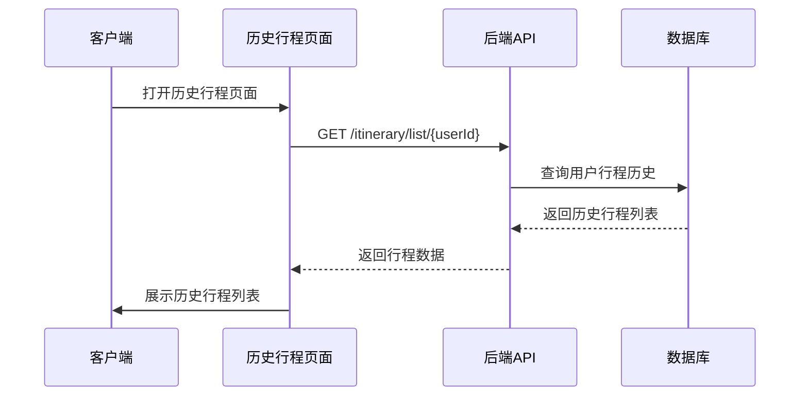
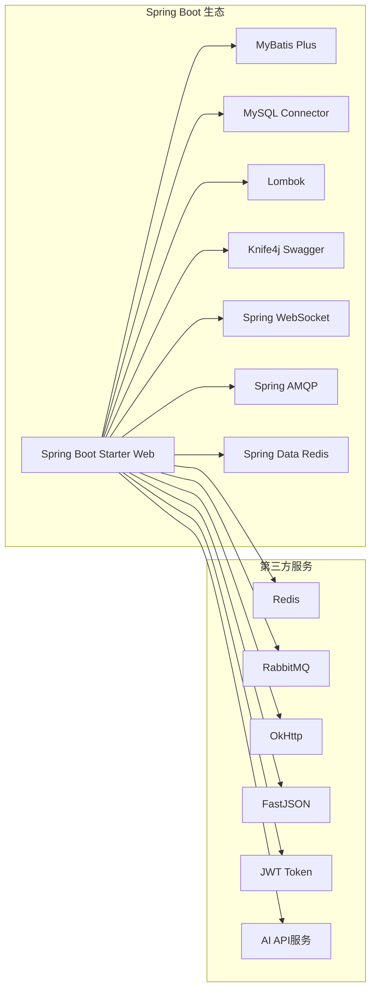

# 行程管理接口

<cite>
**本文档引用的文件**
- [ItineraryController.java](file://springboot-travel-social/src/main/java/com/cxx/controller/ItineraryController.java)
- [Itinerary.java](file://springboot-travel-social/src/main/java/com/cxx/entity/Itinerary.java)
- [ItineraryMapper.java](file://springboot-travel-social/src/main/java/com/cxx/mapper/ItineraryMapper.java)
- [UserHolder.java](file://springboot-travel-social/src/main/java/com/cxx/utils/UserHolder.java)
- [R.java](file://springboot-travel-social/src/main/java/com/cxx/entity/R.java)
- [application.properties](file://springboot-travel-social/src/main/resources/application.properties)
- [pom.xml](file://springboot-travel-social/pom.xml)
- [itinerary.vue](file://uniapp-travel-social/homePages/itinerary/itinerary.vue)
- [itinerary-history.vue](file://uniapp-travel-social/homePages/itinerary/itinerary-history.vue)
- [aiService.js](file://uniapp-travel-social/services/aiService.js)
- [TravelSocialApplication.java](file://springboot-travel-social/src/main/java/com/cxx/TravelSocialApplication.java)
- [travel_socical.sql](file://travel_socical.sql)
</cite>

## 更新摘要
**变更内容**
- 新增完整的行程管理API接口（保存、查询、详情、删除）
- 新增AI服务集成接口，支持智能行程生成和修改
- 新增行程历史管理功能
- 完善用户认证和会话管理机制
- 增强前后端数据交互和错误处理

## 目录
1. [项目概述](#项目概述)
2. [项目结构](#项目结构)
3. [核心组件](#核心组件)
4. [架构概览](#架构概览)
5. [详细组件分析](#详细组件分析)
6. [依赖关系分析](#依赖关系分析)
7. [性能考虑](#性能考虑)
8. [故障排除指南](#故障排除指南)
9. [结论](#结论)

## 项目概述

这是一个基于Spring Boot和UniApp开发的旅游攻略社交小程序，专注于AI智能行程管理功能。系统提供了完整的行程规划、保存、查询、修改和分享功能，支持用户创建个性化旅游行程并进行管理。系统集成了AI服务，能够智能生成和修改行程内容，提供更加智能化的旅游体验。

## 项目结构

**图表来源**
- [TravelSocialApplication.java:16-25](file://springboot-travel-social/src/main/java/com/cxx/TravelSocialApplication.java#L16-L25)
- [ItineraryController.java:23-25](file://springboot-travel-social/src/main/java/com/cxx/controller/ItineraryController.java#L23-L25)
- [itinerary.vue:1-261](file://uniapp-travel-social/homePages/itinerary/itinerary.vue#L1-L261)

**章节来源**
- [TravelSocialApplication.java:1-54](file://springboot-travel-social/src/main/java/com/cxx/TravelSocialApplication.java#L1-L54)
- [pom.xml:1-243](file://springboot-travel-social/pom.xml#L1-L243)

## 核心组件

### 行程实体模型

行程管理系统的核心数据模型基于AI生成的行程内容，支持完整的旅游规划信息存储：

**图表来源**
- [Itinerary.java:21-64](file://springboot-travel-social/src/main/java/com/cxx/entity/Itinerary.java#L21-L64)
- [ItineraryController.java:25-122](file://springboot-travel-social/src/main/java/com/cxx/controller/ItineraryController.java#L25-L122)
- [ItineraryMapper.java:11-18](file://springboot-travel-social/src/main/java/com/cxx/mapper/ItineraryMapper.java#L11-L18)

### 统一响应机制

系统采用统一的响应封装机制，确保前后端交互的一致性和规范性：

| 字段 | 类型 | 描述 | 示例 |
|------|------|------|------|
| code | Integer | 响应码 | 1 (成功), 0 (失败) |
| msg | String | 响应消息 | "success", "保存失败" |
| data | Object | 返回数据 | 行程详情, 错误信息 |

**章节来源**
- [R.java:14-30](file://springboot-travel-social/src/main/java/com/cxx/entity/R.java#L14-L30)

## 架构概览

**图表来源**
- [aiService.js:5-40](file://uniapp-travel-social/services/aiService.js#L5-L40)
- [ItineraryController.java:32-67](file://springboot-travel-social/src/main/java/com/cxx/controller/ItineraryController.java#L32-L67)

## 详细组件分析

### 行程控制器 (ItineraryController)

行程控制器提供了完整的RESTful API接口，支持行程的CRUD操作：

#### 保存行程接口

**图表来源**
- [ItineraryController.java:32-67](file://springboot-travel-social/src/main/java/com/cxx/controller/ItineraryController.java#L32-L67)

#### 查询行程列表接口
支持按用户ID查询所有行程，按创建时间倒序排列：

**图表来源**
- [ItineraryController.java:74-86](file://springboot-travel-social/src/main/java/com/cxx/controller/ItineraryController.java#L74-L86)
- [ItineraryMapper.java:16-17](file://springboot-travel-social/src/main/java/com/cxx/mapper/ItineraryMapper.java#L16-L17)

#### 行程详情查询接口
提供单个行程的详细信息查询，包含完整的行程内容和元数据。

#### 行程删除接口
支持软删除机制，通过逻辑删除字段标记删除状态，确保数据安全。

**章节来源**
- [ItineraryController.java:74-122](file://springboot-travel-social/src/main/java/com/cxx/controller/ItineraryController.java#L74-L122)

### 前端行程页面 (itinerary.vue)

前端采用UniApp框架开发，提供丰富的行程展示和交互功能：

#### 页面布局结构

**图表来源**
- [itinerary.vue:1-261](file://uniapp-travel-social/homePages/itinerary/itinerary.vue#L1-L261)

#### 行程数据展示
前端页面支持多种数据展示格式：

| 展示类型 | 数据结构 | 功能特性 |
|----------|----------|----------|
| 每日行程 | days_list数组 | 时间轴展示、活动详情、评分信息 |
| 景点推荐 | spots数组 | 图片展示、评分系统、最佳游玩时间 |
| 酒店推荐 | hotels数组 | 价格对比、星级筛选、标签分类 |
| 预算分析 | budgetItems数组 | 费用占比、省钱建议、可视化图表 |

**章节来源**
- [itinerary.vue:275-402](file://uniapp-travel-social/homePages/itinerary/itinerary.vue#L275-L402)

### AI服务集成

系统集成了AI服务，支持智能行程生成和修改：

#### AI服务接口封装

**图表来源**
- [aiService.js:42-291](file://uniapp-travel-social/services/aiService.js#L42-L291)

**章节来源**
- [aiService.js:1-293](file://uniapp-travel-social/services/aiService.js#L1-L293)

### 行程历史管理

系统提供了完整的行程历史管理功能：

#### 历史行程页面

**图表来源**
- [itinerary-history.vue:1-200](file://uniapp-travel-social/homePages/itinerary/itinerary-history.vue#L1-L200)

## 依赖关系分析

### 后端技术栈依赖

**图表来源**
- [pom.xml:16-182](file://springboot-travel-social/pom.xml#L16-L182)

### 数据库表结构

系统使用MySQL数据库存储行程相关信息：

| 表名 | 描述 | 主要字段 |
|------|------|----------|
| ai_itinerary | AI生成的行程表 | id, user_id, title, destination, content, create_time, deleted |
| user | 用户表 | id, username, password, avatar |
| ai_sessions | AI会话表 | id, user_id, title, create_time |
| ai_records | AI对话记录表 | id, session_id, content, role, timestamp |
| 其他业务表 | 活动、酒店、评论等 | 相关业务字段 |

**章节来源**
- [travel_socical.sql:1-200](file://travel_socical.sql#L1-L200)

## 性能考虑

### 数据库优化策略

1. **索引优化**: 在`user_id`和`create_time`字段上建立索引，提高查询性能
2. **逻辑删除**: 使用`deleted`字段实现软删除，避免物理删除影响性能
3. **分页查询**: 对行程列表查询实现分页机制，限制单次查询数据量
4. **会话缓存**: 使用Redis缓存AI会话信息，减少数据库查询

### 缓存策略

1. **Redis缓存**: 使用Redis缓存热门行程和用户信息
2. **会话管理**: 通过ThreadLocal管理用户上下文，减少数据库查询
3. **响应缓存**: 对频繁访问的静态数据进行缓存
4. **AI会话缓存**: 缓存AI对话会话，提升响应速度

### 异步处理

1. **消息队列**: 使用RabbitMQ处理异步任务
2. **WebSocket**: 实现实时通信功能
3. **定时任务**: 通过CommandLineRunner实现启动时的数据初始化
4. **AI服务异步**: 异步处理AI对话请求，提升用户体验

## 故障排除指南

### 常见问题及解决方案

#### 1. 用户认证失败
**问题**: 保存行程时报"用户未登录"
**解决方案**: 
- 检查前端是否正确传递token
- 验证UserHolder中用户信息是否正确设置
- 确认JWT令牌的有效期

#### 2. 数据库连接异常
**问题**: 系统启动时报数据库连接错误
**解决方案**:
- 检查application.properties中的数据库配置
- 验证MySQL服务是否正常运行
- 确认数据库用户名和密码正确

#### 3. CORS跨域问题
**问题**: 前端请求后端接口出现跨域错误
**解决方案**:
- 检查CorsFilter配置
- 确认允许的域名和端口设置
- 验证预检请求的处理

#### 4. AI服务调用失败
**问题**: 行程生成或修改功能异常
**解决方案**:
- 检查AI服务API密钥配置
- 验证网络连接和防火墙设置
- 查看AI服务状态和可用性

#### 5. 文件上传失败
**问题**: 图片上传或文件上传功能异常
**解决方案**:
- 检查文件大小限制配置
- 验证OSS存储配置
- 确认文件类型和权限设置

**章节来源**
- [application.properties:1-62](file://springboot-travel-social/src/main/resources/application.properties#L1-L62)

## 结论

该行程管理接口系统提供了完整的AI智能行程管理功能，具有以下特点：

1. **模块化设计**: 采用清晰的分层架构，职责分离明确
2. **统一响应**: 标准化的API响应格式，便于前后端协作
3. **用户友好**: 前端提供直观的行程展示和交互体验
4. **AI智能**: 集成AI服务，支持智能行程生成和修改
5. **历史管理**: 提供完整的行程历史记录和管理功能
6. **扩展性强**: 支持AI服务集成和第三方API接入
7. **性能优化**: 通过缓存、索引等技术手段提升系统性能

系统支持完整的行程生命周期管理，从AI生成、用户保存、查询展示到修改删除，为用户提供便捷的旅游行程管理服务。通过合理的架构设计和技术选型，系统具备良好的可维护性和扩展性，能够满足未来的业务发展需求。