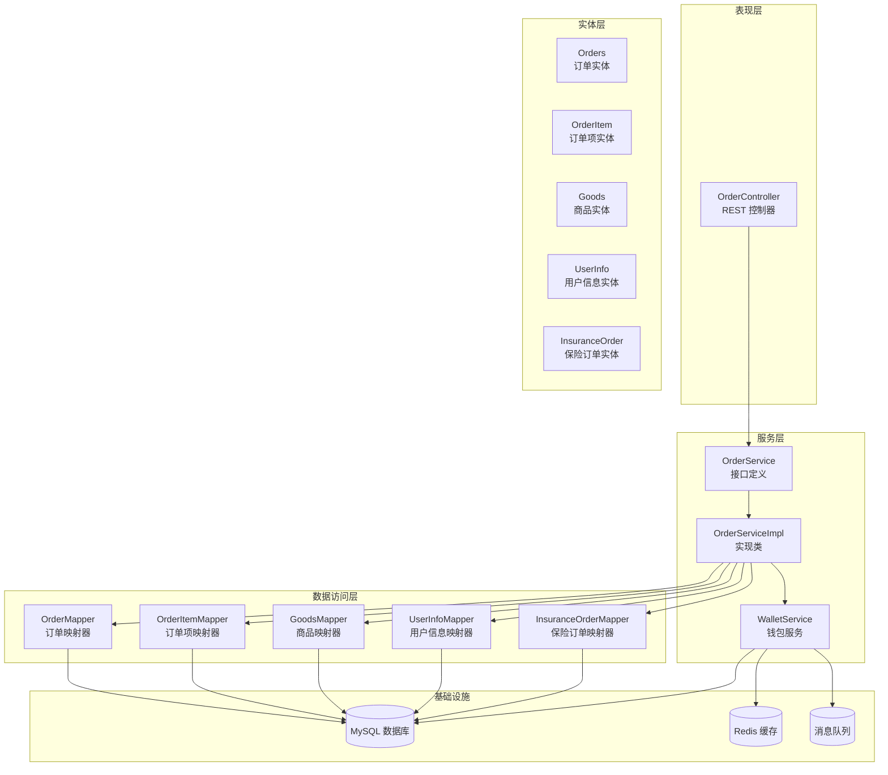
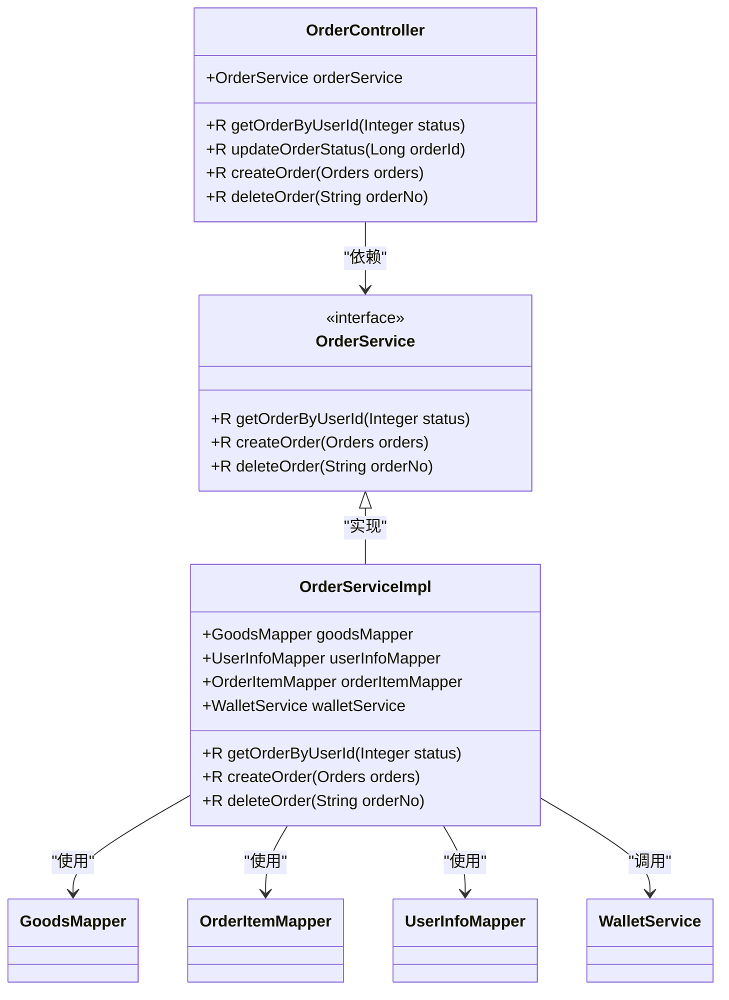
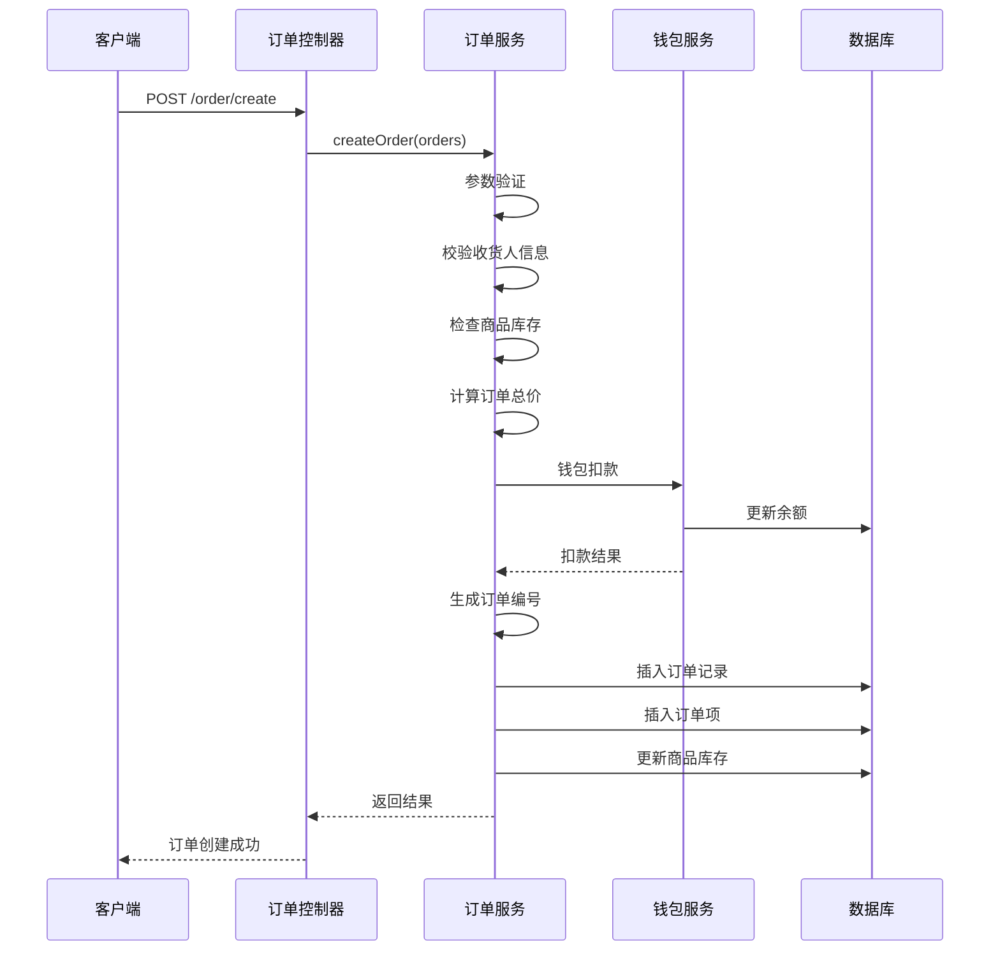
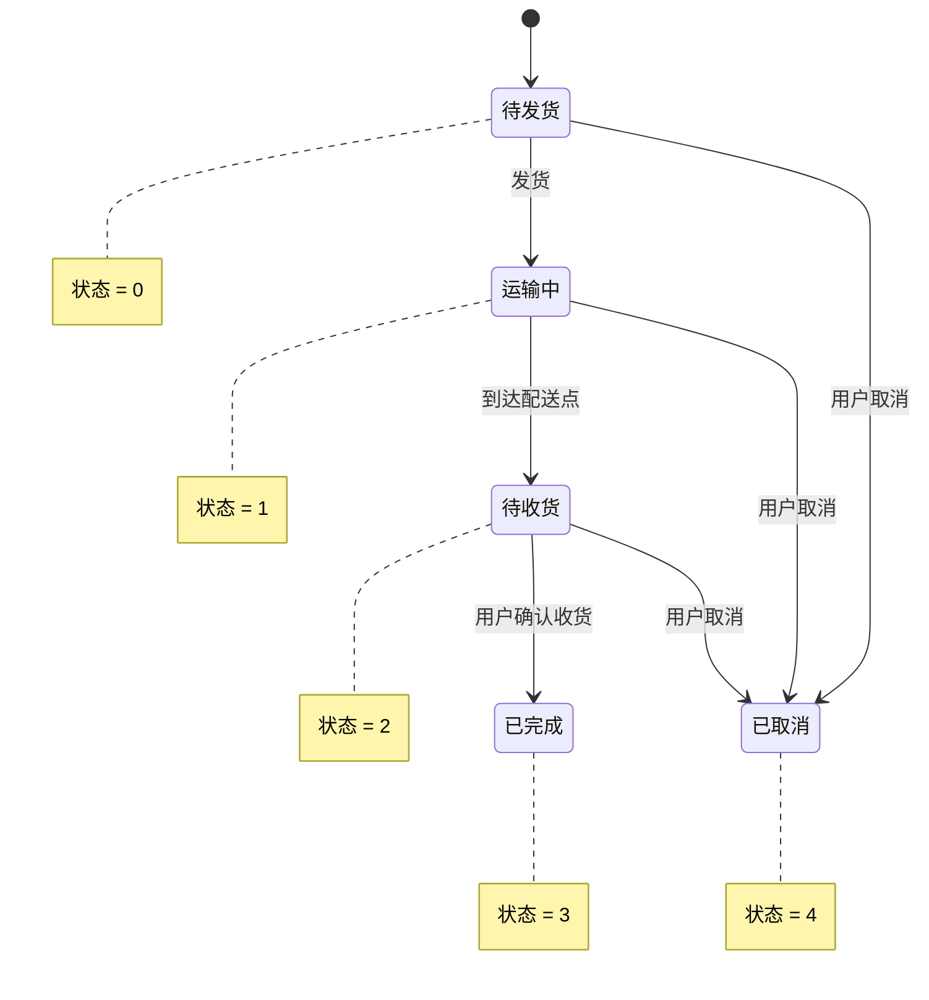
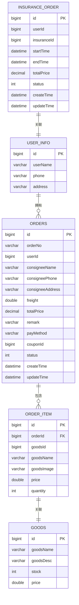
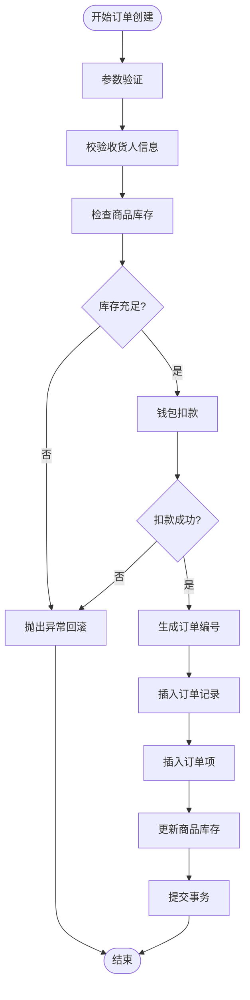
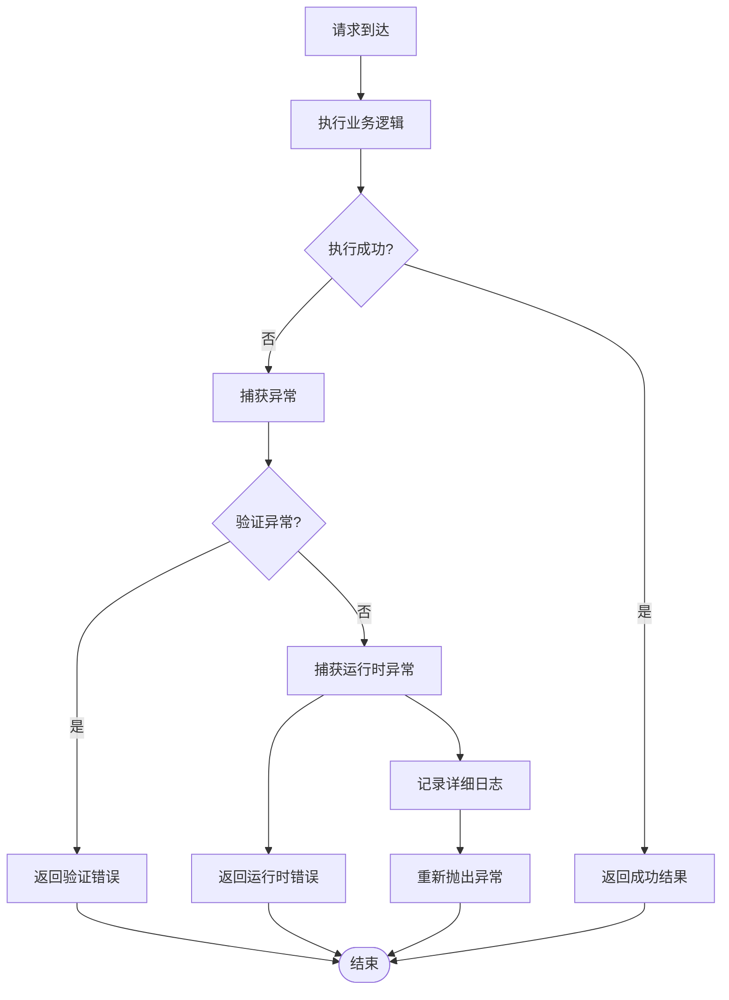
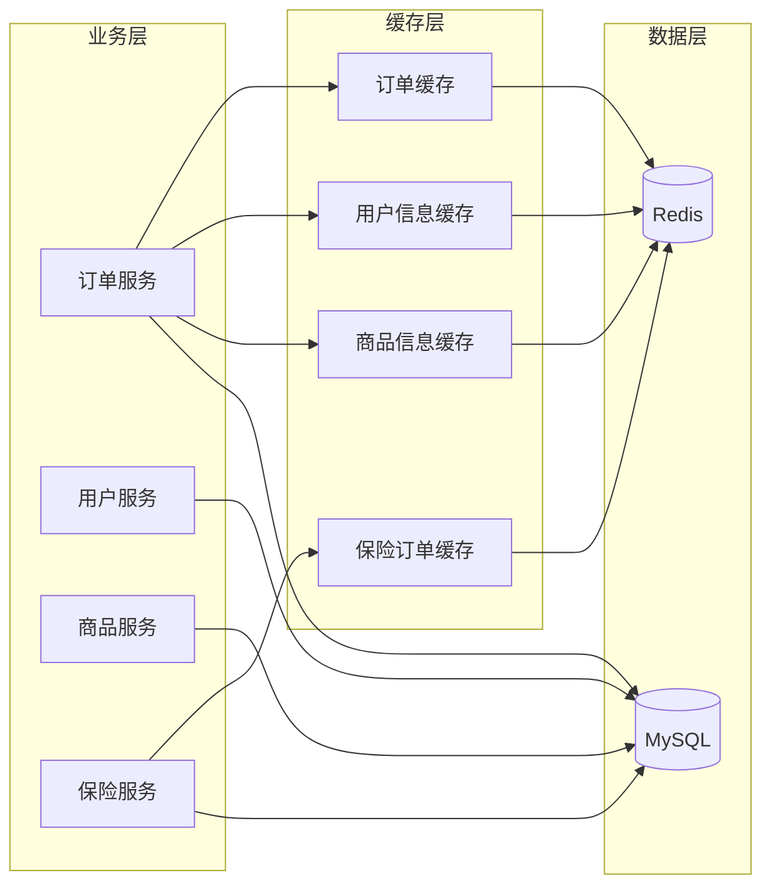
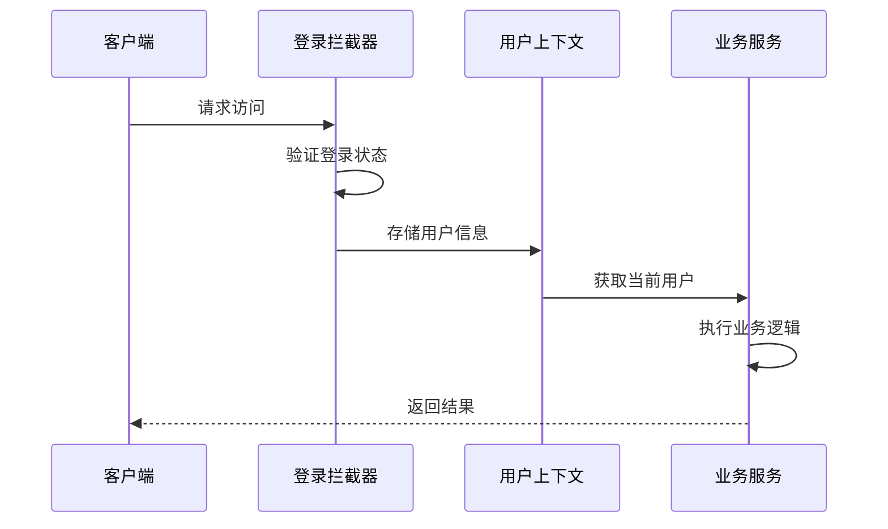

# 订单管理接口

<cite>
**本文档引用的文件**
- [OrderController.java](file://springboot-travel-social/src/main/java/com/cxx/controller/OrderController.java)
- [OrderService.java](file://springboot-travel-social/src/main/java/com/cxx/service/OrderService.java)
- [OrderServiceImpl.java](file://springboot-travel-social/src/main/java/com/cxx/service/impl/OrderServiceImpl.java)
- [Orders.java](file://springboot-travel-social/src/main/java/com/cxx/entity/Orders.java)
- [OrderItem.java](file://springboot-travel-social/src/main/java/com/cxx/entity/OrderItem.java)
- [OrderMapper.java](file://springboot-travel-social/src/main/java/com/cxx/mapper/OrderMapper.java)
- [OrderItemMapper.java](file://springboot-travel-social/src/main/java/com/cxx/mapper/OrderItemMapper.java)
- [UserHolder.java](file://springboot-travel-social/src/main/java/com/cxx/utils/UserHolder.java)
- [FoodOrder.java](file://springboot-travel-social/src/main/java/com/cxx/entity/FoodOrder.java)
- [HotelOrder.java](file://springboot-travel-social/src/main/java/com/cxx/entity/HotelOrder.java)
- [RouteOrder.java](file://springboot-travel-social/src/main/java/com/cxx/entity/RouteOrder.java)
- [InsuranceOrder.java](file://springboot-travel-social/src/main/java/com/cxx/entity/InsuranceOrder.java)
</cite>

## 更新摘要
**变更内容**
- 新增了保险订单实体类和相关映射文件
- 完善了订单管理接口的文档内容，包括新增的订单相关实体类
- 增强了订单创建流程中的收货人信息验证逻辑
- 更新了订单状态管理的数据模型分析
- 完善了订单管理流程图和数据模型图

## 目录
1. [项目概述](#项目概述)
2. [架构设计](#架构设计)
3. [核心组件](#核心组件)
4. [订单管理流程](#订单管理流程)
5. [数据模型](#数据模型)
6. [API 接口规范](#api-接口规范)
7. [事务处理机制](#事务处理机制)
8. [错误处理与异常管理](#错误处理与异常管理)
9. [性能优化策略](#性能优化策略)
10. [安全考虑](#安全考虑)
11. [总结](#总结)

## 项目概述

本项目是一个基于 Spring Boot 的旅游攻略社交小程序后端系统，主要提供订单管理功能。该系统支持多种类型的订单管理，包括商品订单、美食订单、酒店订单、路线订单、保险订单等，为用户提供完整的旅行服务预订和管理功能。

系统采用分层架构设计，包含控制层、服务层、数据访问层和实体层，通过 MyBatis-Plus 进行数据持久化操作，使用 Lombok 简化代码编写，通过 Swagger 提供 API 文档。

## 架构设计



**图表来源**
- [OrderController.java:1-55](file://springboot-travel-social/src/main/java/com/cxx/controller/OrderController.java#L1-L55)
- [OrderServiceImpl.java:1-171](file://springboot-travel-social/src/main/java/com/cxx/service/impl/OrderServiceImpl.java#L1-L171)

## 核心组件

### 订单控制器 (OrderController)

订单控制器是系统的入口点，负责处理所有与订单相关的 HTTP 请求。它提供了以下核心功能：

- 获取用户订单列表
- 更新订单状态
- 创建新订单
- 删除订单



**图表来源**
- [OrderController.java:1-55](file://springboot-travel-social/src/main/java/com/cxx/controller/OrderController.java#L1-L55)
- [OrderService.java:1-14](file://springboot-travel-social/src/main/java/com/cxx/service/OrderService.java#L1-L14)
- [OrderServiceImpl.java:1-171](file://springboot-travel-social/src/main/java/com/cxx/service/impl/OrderServiceImpl.java#L1-L171)

**章节来源**
- [OrderController.java:1-55](file://springboot-travel-social/src/main/java/com/cxx/controller/OrderController.java#L1-L55)
- [OrderService.java:1-14](file://springboot-travel-social/src/main/java/com/cxx/service/OrderService.java#L1-L14)
- [OrderServiceImpl.java:1-171](file://springboot-travel-social/src/main/java/com/cxx/service/impl/OrderServiceImpl.java#L1-L171)

## 订单管理流程

### 订单创建流程

订单创建是整个系统的核心业务流程，涉及多个步骤和复杂的业务逻辑：



**图表来源**
- [OrderController.java:39-49](file://springboot-travel-social/src/main/java/com/cxx/controller/OrderController.java#L39-L49)
- [OrderServiceImpl.java:82-171](file://springboot-travel-social/src/main/java/com/cxx/service/impl/OrderServiceImpl.java#L82-L171)

### 订单状态管理

系统支持完整的订单生命周期管理，包括订单状态的流转：



**图表来源**
- [Orders.java:37](file://springboot-travel-social/src/main/java/com/cxx/entity/Orders.java#L37)

**章节来源**
- [OrderServiceImpl.java:82-171](file://springboot-travel-social/src/main/java/com/cxx/service/impl/OrderServiceImpl.java#L82-L171)
- [Orders.java:37](file://springboot-travel-social/src/main/java/com/cxx/entity/Orders.java#L37)

## 数据模型

### 订单实体模型

系统采用清晰的数据模型设计，支持多种类型的订单管理：



**图表来源**
- [Orders.java:1-51](file://springboot-travel-social/src/main/java/com/cxx/entity/Orders.java#L1-L51)
- [OrderItem.java:1-24](file://springboot-travel-social/src/main/java/com/cxx/entity/OrderItem.java#L1-L24)
- [InsuranceOrder.java:1-33](file://springboot-travel-social/src/main/java/com/cxx/entity/InsuranceOrder.java#L1-L33)

### 订单字段详细说明

**订单实体 Orders 字段说明**：

| 字段名 | 类型 | 是否必填 | 描述 | 默认值 |
|--------|------|----------|------|--------|
| id | Long | 否 | 订单主键ID | 自增 |
| orderNo | String | 是 | 订单编号 | 自动生成 |
| userId | Long | 是 | 用户ID | 当前登录用户 |
| consigneeName | String | 是 | 收货人姓名 | - |
| consigneePhone | String | 是 | 收货人手机号 | - |
| consigneeAddress | String | 是 | 收货人地址 | - |
| freight | Double | 否 | 运费 | 0.0 |
| totalPrice | BigDecimal | 是 | 订单总价 | 计算得出 |
| remark | String | 否 | 买家备注 | - |
| payMethod | String | 否 | 支付方式 | - |
| couponId | Long | 否 | 使用的优惠券ID | - |
| status | Integer | 是 | 订单状态 | 0（待发货） |
| createTime | Date | 否 | 创建时间 | 当前时间 |
| updateTime | Date | 否 | 更新时间 | 当前时间 |
| orderItems | List<OrderItem> | 否 | 订单商品列表 | - |

**新增收货人信息字段**：
- `consigneeName`：收货人姓名，必填字段，用于物流配送
- `consigneePhone`：收货人手机号，必填字段，用于配送联系
- `consigneeAddress`：收货人详细地址，必填字段，用于精确配送

**保险订单实体 InsuranceOrder 字段说明**：

| 字段名 | 类型 | 是否必填 | 描述 | 默认值 |
|--------|------|----------|------|--------|
| id | Long | 否 | 订单主键ID | 自增 |
| userId | Long | 是 | 用户ID | 当前登录用户 |
| insuranceId | Long | 是 | 保险产品ID | - |
| startTime | Date | 是 | 保险开始时间 | - |
| endTime | Date | 是 | 保险结束时间 | - |
| totalPrice | BigDecimal | 是 | 订单总价 | 计算得出 |
| status | Integer | 是 | 订单状态 | 0（待支付） |
| createTime | Date | 否 | 创建时间 | 当前时间 |
| updateTime | Date | 否 | 更新时间 | 当前时间 |

**章节来源**
- [Orders.java:1-51](file://springboot-travel-social/src/main/java/com/cxx/entity/Orders.java#L1-L51)
- [OrderItem.java:1-24](file://springboot-travel-social/src/main/java/com/cxx/entity/OrderItem.java#L1-L24)
- [InsuranceOrder.java:1-33](file://springboot-travel-social/src/main/java/com/cxx/entity/InsuranceOrder.java#L1-L33)

### 订单类型扩展

系统支持多种订单类型，每种类型都有其特定的业务需求：

| 订单类型 | 实体类 | 数据表 | 主要用途 |
|---------|--------|--------|----------|
| 商品订单 | Orders | checkout_order | 旅游商品购买 |
| 美食订单 | FoodOrder | food_order | 餐厅预订 |
| 酒店订单 | HotelOrder | hotel_order | 住宿预订 |
| 路线订单 | RouteOrder | route_order | 旅行路线购买 |
| 保险订单 | InsuranceOrder | insurance_order | 旅行保险购买 |

**章节来源**
- [Orders.java:1-51](file://springboot-travel-social/src/main/java/com/cxx/entity/Orders.java#L1-L51)
- [OrderItem.java:1-24](file://springboot-travel-social/src/main/java/com/cxx/entity/OrderItem.java#L1-L24)
- [FoodOrder.java:1-33](file://springboot-travel-social/src/main/java/com/cxx/entity/FoodOrder.java#L1-L33)
- [HotelOrder.java:1-43](file://springboot-travel-social/src/main/java/com/cxx/entity/HotelOrder.java#L1-L43)
- [RouteOrder.java:1-36](file://springboot-travel-social/src/main/java/com/cxx/entity/RouteOrder.java#L1-L36)
- [InsuranceOrder.java:1-33](file://springboot-travel-social/src/main/java/com/cxx/entity/InsuranceOrder.java#L1-L33)

## API 接口规范

### 订单管理接口

系统提供完整的订单管理 REST API：

| 方法 | 路径 | 功能描述 | 请求参数 | 响应内容 |
|------|------|----------|----------|----------|
| GET | /order/getOrderByUserId | 获取用户订单列表 | status: 订单状态 | 订单列表 |
| PUT | /order/updateOrderStatus/{orderId} | 更新订单状态 | orderId: 订单ID | 操作结果 |
| POST | /order/create | 创建新订单 | Orders 对象 | 订单创建结果 |
| DELETE | /order/deleteOrder/{orderNo} | 删除订单 | orderNo: 订单号 | 删除结果 |

### 订单创建请求示例

订单创建接口接收完整的订单信息，包括商品详情和收货信息：

```json
{
    "consigneeName": "张三",
    "consigneePhone": "13800138000",
    "consigneeAddress": "北京市朝阳区xxx街道",
    "freight": 10.0,
    "remark": "请尽快发货",
    "payMethod": "wallet",
    "orderItems": [
        {
            "goodsId": 1,
            "goodsName": "精美纪念品",
            "goodsImage": "image_url",
            "price": 99.0,
            "quantity": 2
        }
    ]
}
```

**章节来源**
- [OrderController.java:20-54](file://springboot-travel-social/src/main/java/com/cxx/controller/OrderController.java#L20-L54)

## 事务处理机制

### 分布式事务保证

系统采用严格的事务管理机制确保数据一致性：



**图表来源**
- [OrderServiceImpl.java:82-171](file://springboot-travel-social/src/main/java/com/cxx/service/impl/OrderServiceImpl.java#L82-L171)

### 锁机制应用

为了防止并发场景下的数据不一致，系统在关键业务逻辑上使用了同步锁：

- 使用类级别的同步锁确保订单创建的原子性
- 防止同一时间多个请求同时处理同一个用户的订单创建
- 确保库存检查和扣款操作的完整性

**章节来源**
- [OrderServiceImpl.java:86](file://springboot-travel-social/src/main/java/com/cxx/service/impl/OrderServiceImpl.java#L86)
- [OrderServiceImpl.java:164](file://springboot-travel-social/src/main/java/com/cxx/service/impl/OrderServiceImpl.java#L164)

## 错误处理与异常管理

### 异常处理策略

系统建立了完善的异常处理机制：



**图表来源**
- [OrderController.java:43-48](file://springboot-travel-social/src/main/java/com/cxx/controller/OrderController.java#L43-L48)
- [OrderServiceImpl.java:165-169](file://springboot-travel-social/src/main/java/com/cxx/service/impl/OrderServiceImpl.java#L165-L169)

### 错误码定义

系统采用统一的错误响应格式，包含标准的状态码和错误信息：

| 错误类型 | 状态码 | 错误信息 | 说明 |
|----------|--------|----------|------|
| 参数错误 | 400 | 订单商品不能为空！ | 订单必须包含至少一个商品 |
| 参数错误 | 400 | 收货人姓名不能为空！ | 收货人姓名为必填字段 |
| 参数错误 | 400 | 收货人手机号不能为空！ | 收货人手机号为必填字段 |
| 参数错误 | 400 | 收货人地址不能为空！ | 收货人地址为必填字段 |
| 库存不足 | 400 | 商品库存不足！ | 商品库存小于购买数量 |
| 余额不足 | 400 | 钱包余额不足或钱包状态异常 | 用户钱包余额不足 |
| 系统异常 | 500 | 系统异常，请稍后重试！ | 服务器内部错误 |

**章节来源**
- [OrderServiceImpl.java:90-134](file://springboot-travel-social/src/main/java/com/cxx/service/impl/OrderServiceImpl.java#L90-L134)
- [OrderController.java:43-48](file://springboot-travel-social/src/main/java/com/cxx/controller/OrderController.java#L43-L48)

## 性能优化策略

### 查询优化

系统针对订单查询进行了专门的优化：

- 使用 LambdaQueryWrapper 进行高效的条件查询
- 支持按状态过滤和时间排序
- 采用延迟加载机制避免不必要的数据加载

### 缓存策略



**图表来源**
- [OrderServiceImpl.java:38-62](file://springboot-travel-social/src/main/java/com/cxx/service/impl/OrderServiceImpl.java#L38-L62)

### 并发控制

系统通过多种机制确保高并发场景下的数据一致性：

- 使用 synchronized 关键字保护关键业务逻辑
- 结合数据库层面的乐观锁机制
- 实施合理的索引策略提升查询性能

## 安全考虑

### 用户身份验证

系统通过 UserHolder 类管理用户上下文信息：



**图表来源**
- [UserHolder.java:1-20](file://springboot-travel-social/src/main/java/com/cxx/utils/UserHolder.java#L1-L20)

### 权限控制

系统实现了多层级的安全控制：

- 基于 Token 的身份验证
- 按用户 ID 限制订单操作范围
- 敏感操作的日志记录和审计

**章节来源**
- [UserHolder.java:1-20](file://springboot-travel-social/src/main/java/com/cxx/utils/UserHolder.java#L1-L20)
- [OrderController.java:28-32](file://springboot-travel-social/src/main/java/com/cxx/controller/OrderController.java#L28-L32)

## 总结

本订单管理系统具有以下特点：

1. **完整的订单生命周期管理**：从创建到完成的全流程支持
2. **严格的数据一致性保证**：通过事务和锁机制确保数据正确性
3. **灵活的扩展性设计**：支持多种订单类型的扩展，包括新增的保险订单
4. **完善的错误处理机制**：提供友好的错误反馈和日志记录
5. **高性能的查询优化**：针对订单查询进行专门优化
6. **多层次的安全保障**：从身份验证到权限控制的完整体系
7. **增强的收货人信息管理**：新增收货人姓名、手机号、地址的完整验证机制
8. **全面的订单类型覆盖**：支持商品、美食、酒店、路线、保险等多种订单类型

系统采用现代化的 Spring Boot 技术栈，结合 MyBatis-Plus ORM 框架，为旅游攻略社交小程序提供了稳定可靠的订单管理能力。通过合理的架构设计和完善的业务逻辑，能够满足旅游行业复杂的订单管理需求。

**更新要点**：
- 新增了保险订单实体类和相关映射文件
- 完善了订单管理接口的文档内容，包括新增的订单相关实体类
- 新增了收货人信息字段的完整验证机制
- 增强了订单创建流程的健壮性
- 完善了订单状态管理的数据模型
- 更新了相关的API接口规范和错误处理机制