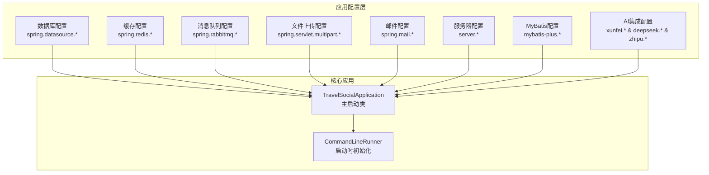
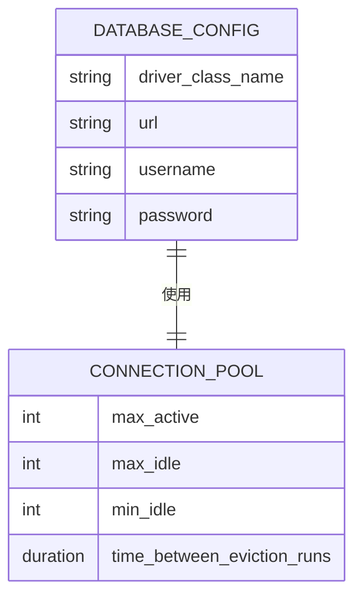
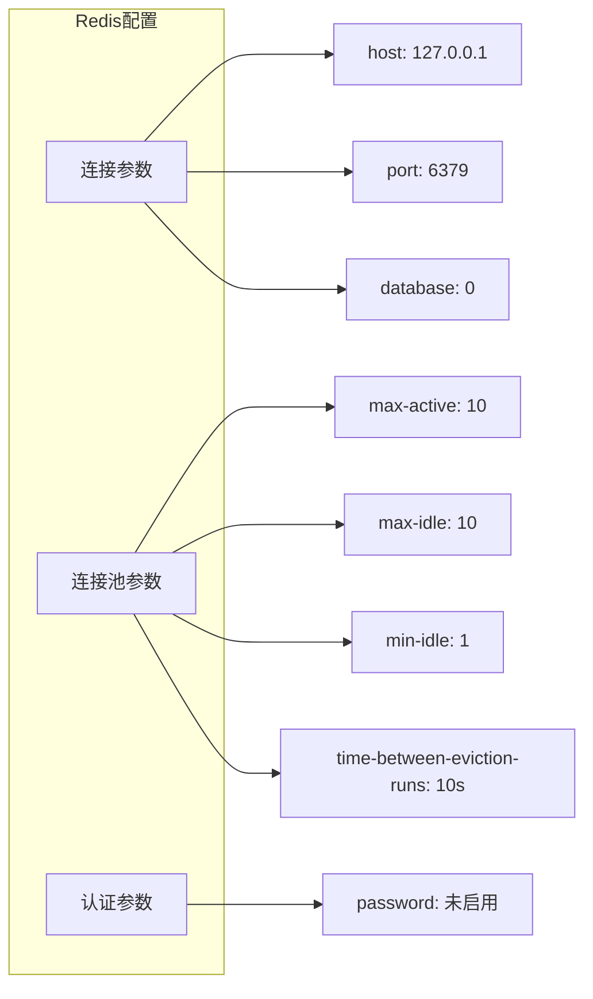
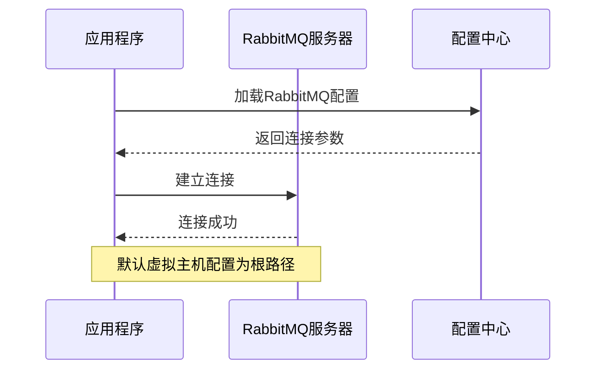
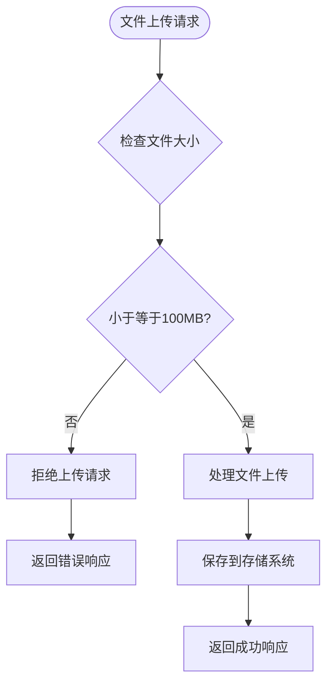
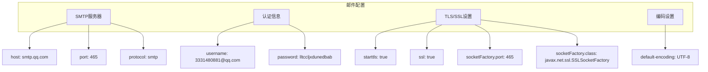
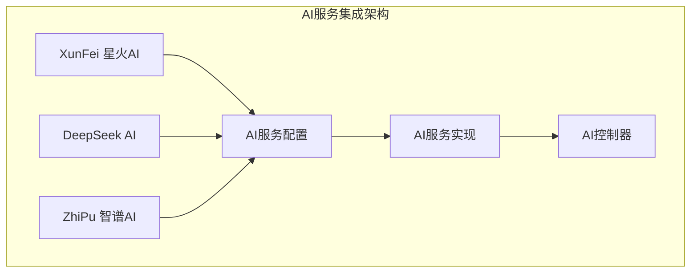
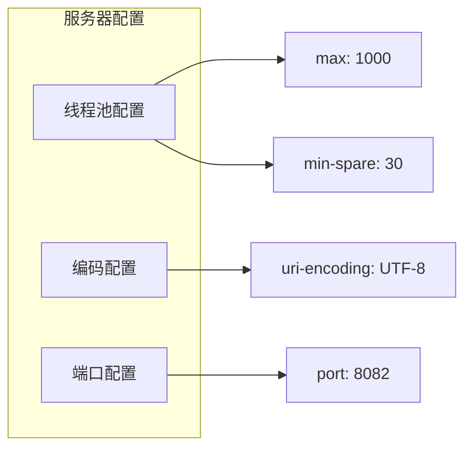
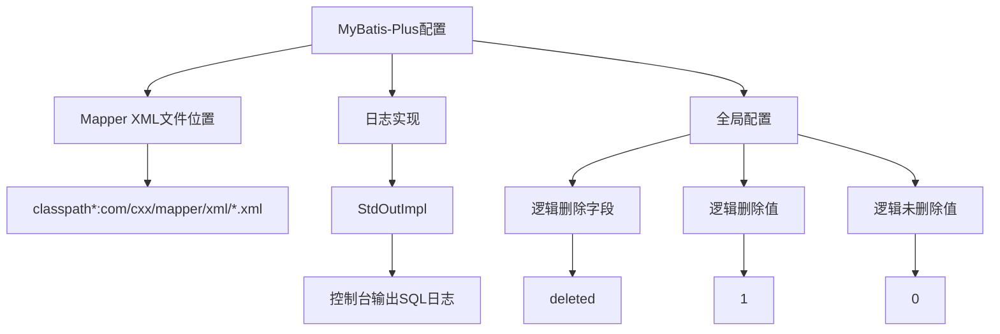

# Application.properties 配置文档

<cite>
**本文档中引用的文件**
- [application.properties](file://springboot-travel-social/src/main/resources/application.properties)
- [XingHuoConfig.java](file://springboot-travel-social/src/main/java/com/cxx/config/XingHuoConfig.java)
- [ZhipuConfig.java](file://springboot-travel-social/src/main/java/com/cxx/config/ZhipuConfig.java)
- [DeepSeekService.java](file://springboot-travel-social/src/main/java/com/cxx/service/DeepSeekService.java)
- [DeepSeekServiceImpl.java](file://springboot-travel-social/src/main/java/com/cxx/service/impl/DeepSeekServiceImpl.java)
- [AIController.java](file://springboot-travel-social/src/main/java/com/cxx/controller/AIController.java)
- [RestTemplateConfig.java](file://springboot-travel-social/src/main/java/com/cxx/config/RestTemplateConfig.java)
- [pom.xml](file://springboot-travel-social/pom.xml)
- [TravelSocialApplication.java](file://springboot-travel-social/src/main/java/com/cxx/TravelSocialApplication.java)
- [README.md](file://springboot-travel-social/README.md)
</cite>

## 更新摘要
**变更内容**
- 新增DeepSeek AI服务配置章节
- 更新AI集成配置详解，包含三种AI服务提供商
- 新增AI服务配置类分析
- 更新配置分类统计，增加AI集成配置项
- 新增AI服务使用建议和最佳实践
- 修正智谱AI模型名称配置

## 目录
1. [项目概述](#项目概述)
2. [配置文件结构分析](#配置文件结构分析)
3. [数据库配置详解](#数据库配置详解)
4. [缓存配置详解](#缓存配置详解)
5. [消息队列配置详解](#消息队列配置详解)
6. [文件上传配置详解](#文件上传配置详解)
7. [邮件服务配置详解](#邮件服务配置详解)
8. [AI集成配置详解](#ai集成配置详解)
9. [服务器配置详解](#服务器配置详解)
10. [MyBatis-Plus配置详解](#mybatis-plus配置详解)
11. [性能调优建议](#性能调优建议)
12. [故障排除指南](#故障排除指南)
13. [总结](#总结)

## 项目概述

Application.properties 是Spring Boot项目的配置文件，位于 `springboot-travel-social/src/main/resources/` 目录下。该配置文件为整个旅游攻略社交小程序提供了完整的运行时配置，涵盖了数据库连接、缓存设置、消息队列、文件上传、邮件服务以及AI集成等多个方面。

该项目采用Spring Boot 2.6.13版本构建，是一个基于Java的旅游社交小程序后端服务，支持多种功能模块包括旅游攻略分享、活动组织、酒店预订、美食推荐等。

**章节来源**
- [application.properties:1-64](file://springboot-travel-social/src/main/resources/application.properties#L1-L64)
- [pom.xml:1-243](file://springboot-travel-social/pom.xml#L1-L243)
- [TravelSocialApplication.java:1-54](file://springboot-travel-social/src/main/java/com/cxx/TravelSocialApplication.java#L1-L54)

## 配置文件结构分析

### 整体配置架构



**图表来源**
- [application.properties:1-64](file://springboot-travel-social/src/main/resources/application.properties#L1-L64)
- [TravelSocialApplication.java:16-31](file://springboot-travel-social/src/main/java/com/cxx/TravelSocialApplication.java#L16-L31)

### 配置分类统计

| 配置类别 | 数量 | 主要用途 |
|---------|------|----------|
| 数据库配置 | 4项 | MySQL连接管理 |
| 缓存配置 | 6项 | Redis连接池设置 |
| 消息队列 | 5项 | RabbitMQ消息处理 |
| 文件上传 | 2项 | 大文件处理限制 |
| 邮件服务 | 11项 | SMTP邮件发送 |
| 服务器配置 | 3项 | Tomcat服务器参数 |
| MyBatis配置 | 4项 | ORM框架设置 |
| AI集成 | 12项 | 第三方AI服务 |

**章节来源**
- [application.properties:1-64](file://springboot-travel-social/src/main/resources/application.properties#L1-L64)

## 数据库配置详解

### MySQL连接配置

数据库配置包含了完整的MySQL连接参数：



**图表来源**
- [application.properties:1-4](file://springboot-travel-social/src/main/resources/application.properties#L1-L4)

### 关键配置参数说明

| 参数名称 | 值 | 说明 |
|---------|-----|------|
| driver-class-name | com.mysql.cj.jdbc.Driver | MySQL JDBC驱动程序 |
| url | jdbc:mysql://127.0.0.1:3306/travel_1?... | 数据库连接URL，包含时区和字符集设置 |
| username | root | 数据库用户名 |
| password | root | 数据库密码 |

### 连接URL参数解析

数据库URL包含了多个重要的连接参数：
- `serverTimezone=GMT%2B8`: 设置服务器时区为东八区
- `characterEncoding=utf8&useUnicode=true`: 支持UTF-8字符编码
- `useSSL=false`: 禁用SSL连接（根据实际环境调整）

**章节来源**
- [application.properties:1-4](file://springboot-travel-social/src/main/resources/application.properties#L1-L4)

## 缓存配置详解

### Redis连接配置

Redis缓存配置提供了完整的连接参数和连接池设置：



**图表来源**
- [application.properties:23-29](file://springboot-travel-social/src/main/resources/application.properties#L23-L29)

### 连接池配置说明

| 参数名称 | 值 | 说明 |
|---------|-----|------|
| max-active | 10 | 最大活跃连接数 |
| max-idle | 10 | 最大空闲连接数 |
| min-idle | 1 | 最小空闲连接数 |
| time-between-eviction-runs | 10s | 连接池维护间隔时间 |

### 认证配置

Redis默认未启用密码认证，可通过取消注释启用：
```properties
#spring.redis.password=your_password
```

**章节来源**
- [application.properties:23-29](file://springboot-travel-social/src/main/resources/application.properties#L23-L29)

## 消息队列配置详解

### RabbitMQ配置

RabbitMQ消息队列配置提供了完整的连接参数：



**图表来源**
- [application.properties:8-12](file://springboot-travel-social/src/main/resources/application.properties#L8-L12)

### 配置参数说明

| 参数名称 | 值 | 说明 |
|---------|-----|------|
| host | 101.37.208.63 | RabbitMQ服务器地址 |
| port | 5672 | RabbitMQ服务端口 |
| virtual-host | / | 虚拟主机名称 |
| username | admin | 用户名 |
| password | admin | 密码 |

### 生产环境建议

对于生产环境，建议：
1. 使用内网IP地址而非公网地址
2. 启用SSL加密传输
3. 设置合理的超时时间
4. 配置连接重试机制

**章节来源**
- [application.properties:8-12](file://springboot-travel-social/src/main/resources/application.properties#L8-L12)

## 文件上传配置详解

### 文件上传限制配置

文件上传配置提供了大小限制和相关参数设置：



**图表来源**
- [application.properties:15-16](file://springboot-travel-social/src/main/resources/application.properties#L15-L16)

### 配置参数说明

| 参数名称 | 值 | 说明 |
|---------|-----|------|
| max-file-size | 100MB | 单个文件最大大小 |
| max-request-size | 100MB | 请求整体最大大小 |

### 存储优化建议

1. **分块上传**: 对于大文件建议实现分块上传功能
2. **压缩处理**: 在上传前对图片进行压缩处理
3. **格式验证**: 严格验证文件类型和格式
4. **安全扫描**: 对上传文件进行病毒扫描

**章节来源**
- [application.properties:15-16](file://springboot-travel-social/src/main/resources/application.properties#L15-L16)

## 邮件服务配置详解

### SMTP邮件配置

邮件服务配置提供了完整的SMTP服务器设置：



**图表来源**
- [application.properties:31-42](file://springboot-travel-social/src/main/resources/application.properties#L31-L42)

### 配置参数说明

| 参数名称 | 值 | 说明 |
|---------|-----|------|
| host | smtp.qq.com | QQ邮箱SMTP服务器 |
| username | 3331480881@qq.com | 发送邮箱地址 |
| password | lltccljxdunedbab | 授权码（非登录密码） |
| port | 465 | SSL端口号 |
| ssl.enable | true | 启用SSL加密 |
| starttls.enable | true | 启用STARTTLS |

### 安全注意事项

1. **授权码使用**: 使用QQ邮箱授权码而非登录密码
2. **密钥保护**: 生产环境中应使用环境变量或配置中心
3. **频率限制**: 注意邮件服务商的发送频率限制
4. **异常处理**: 实现邮件发送失败的重试机制

**章节来源**
- [application.properties:31-42](file://springboot-travel-social/src/main/resources/application.properties#L31-L42)

## AI集成配置详解

### 多AI服务提供商集成

系统集成了三个主要的AI服务提供商，提供了灵活的AI服务选择和备份能力：



**图表来源**
- [application.properties:46-59](file://springboot-travel-social/src/main/resources/application.properties#L46-L59)
- [XingHuoConfig.java:17-30](file://springboot-travel-social/src/main/java/com/cxx/config/XingHuoConfig.java#L17-L30)
- [ZhipuConfig.java:13-19](file://springboot-travel-social/src/main/java/com/cxx/config/ZhipuConfig.java#L13-L19)

### 配置参数说明

#### 讯飞星火配置
| 参数名称 | 值 | 说明 |
|---------|-----|------|
| appid | d28c77d4 | 应用ID |
| apiSecret | Zjc5OTI1ZmIzYzM1OWYwMmU2ZDRjODEy | API密钥 |
| apiKey | cbe60665ae47e3c6060dc8f54b5ef003 | API密钥 |
| baseUrl | https://spark-api.xfyun.cn | API基础URL |

#### DeepSeek配置
| 参数名称 | 值 | 说明 |
|---------|-----|------|
| api.key | sk-03162b8b45924e71a986c3a797c3573b | API密钥 |
| api.base-url | https://api.deepseek.com | API基础URL |
| api.model | deepseek-chat | 使用模型 |

#### 智谱AI配置
| 参数名称 | 值 | 说明 |
|---------|-----|------|
| api.key | 58a1534ba40647ea804d9eefef774226.dYpMxgzW1MsT9YaZ | API密钥 |
| api.base-url | https://open.bigmodel.cn/api/paas/v4 | API基础URL |
| api.model | glm-4.6v | 使用模型 |

### AI服务配置类分析

#### 讯飞星火配置类
```java
@Configuration
@ConfigurationProperties(prefix = "xunfei.client")
@Data
public class XingHuoConfig {
    private String appid;
    private String apiSecret;
    private String apiKey;
    @Bean
    public SparkClient sparkClient() {
        SparkClient sparkClient = new SparkClient();
        sparkClient.apiKey = apiKey;
        sparkClient.apiSecret = apiSecret;
        sparkClient.appid = appid;
        return sparkClient;
    }
}
```

#### 智谱AI配置类
```java
@Configuration
@ConfigurationProperties(prefix = "zhipu.api")
@Data
public class ZhipuConfig {
    private String key;
    private String baseUrl;
    private String model;
}
```

#### DeepSeek服务接口
```java
public interface DeepSeekService {
    String chat(String userMessage);
    String chat(String systemPrompt, String userMessage);
    String chat(String userId, Long sessionId, String userMessage);
    String chat(String userId, Long sessionId, String systemPrompt, String userMessage);
    CompletableFuture<String> chatAsync(String userMessage);
    String chatWithParams(ChatRequest request);
    boolean checkApiStatus();
}
```

#### DeepSeek服务实现类
```java
@Service
public class DeepSeekServiceImpl implements DeepSeekService {
    @Value("${deepseek.api.key}")
    private String apiKey;
    
    @Value("${deepseek.api.base-url}")
    private String baseUrl;
    
    @Value("${deepseek.api.model:deepseek-chat}")
    private String model;
    
    @Value("${deepseek.api.temperature:0.7}")
    private Double temperature;
    
    @Value("${deepseek.api.max-tokens:2048}")
    private Integer maxTokens;
}
```

### AI服务使用建议

1. **API密钥管理**: 使用环境变量或配置中心管理敏感信息
2. **请求限流**: 实现API调用频率控制
3. **错误处理**: 建立完善的异常处理和重试机制
4. **成本控制**: 监控API使用量，避免不必要的调用
5. **服务降级**: 实现多AI服务提供商的切换和降级策略
6. **性能监控**: 监控各AI服务的响应时间和成功率
7. **异步处理**: 利用异步API提高响应速度
8. **缓存策略**: 对常见问题结果进行缓存

**章节来源**
- [application.properties:46-59](file://springboot-travel-social/src/main/resources/application.properties#L46-L59)
- [XingHuoConfig.java:17-30](file://springboot-travel-social/src/main/java/com/cxx/config/XingHuoConfig.java#L17-L30)
- [ZhipuConfig.java:13-19](file://springboot-travel-social/src/main/java/com/cxx/config/ZhipuConfig.java#L13-L19)
- [DeepSeekService.java:1-46](file://springboot-travel-social/src/main/java/com/cxx/service/DeepSeekService.java#L1-L46)
- [DeepSeekServiceImpl.java:32-53](file://springboot-travel-social/src/main/java/com/cxx/service/impl/DeepSeekServiceImpl.java#L32-L53)
- [AIController.java:211-278](file://springboot-travel-social/src/main/java/com/cxx/controller/AIController.java#L211-L278)

## 服务器配置详解

### Tomcat服务器配置

服务器配置提供了完整的Web服务器参数设置：



**图表来源**
- [application.properties:19,43-45](file://springboot-travel-social/src/main/resources/application.properties#L19,L43-L45)

### 配置参数说明

| 参数名称 | 值 | 说明 |
|---------|-----|------|
| server.port | 8082 | 服务器监听端口 |
| threads.max | 1000 | 最大线程数 |
| threads.min-spare | 30 | 最小空闲线程数 |
| uri-encoding | UTF-8 | URI编码格式 |

### 性能调优建议

1. **线程池调优**: 根据服务器硬件配置调整线程池大小
2. **连接超时**: 设置合理的连接超时时间
3. **内存管理**: 配置JVM内存参数以支持高并发场景
4. **负载均衡**: 生产环境建议部署多个实例并配置负载均衡

**章节来源**
- [application.properties:19,43-45](file://springboot-travel-social/src/main/resources/application.properties#L19,L43-L45)

## MyBatis-Plus配置详解

### ORM框架配置

MyBatis-Plus配置提供了完整的ORM框架设置：



**图表来源**
- [application.properties:13,14,20-22](file://springboot-travel-social/src/main/resources/application.properties#L13,L14,L20-L22)

### 配置参数说明

#### Mapper配置
| 参数名称 | 值 | 说明 |
|---------|-----|------|
| mapper-locations | classpath*:com/cxx/mapper/xml/*.xml | Mapper XML文件路径模式 |

#### 日志配置
| 参数名称 | 值 | 说明 |
|---------|-----|------|
| log-impl | org.apache.ibatis.logging.stdout.StdOutImpl | SQL日志输出实现 |

#### 逻辑删除配置
| 参数名称 | 值 | 说明 |
|---------|-----|------|
| logic-delete-field | deleted | 逻辑删除字段名 |
| logic-delete-value | 1 | 逻辑删除标记值 |
| logic-not-delete-value | 0 | 逻辑未删除标记值 |

### 开发建议

1. **SQL调试**: 开发环境可开启详细SQL日志输出
2. **性能监控**: 生产环境建议关闭详细日志以提升性能
3. **命名规范**: 保持实体类、Mapper接口和XML文件的命名一致性
4. **事务管理**: 合理使用MyBatis-Plus的事务管理功能

**章节来源**
- [application.properties:13,14,20-22](file://springboot-travel-social/src/main/resources/application.properties#L13,L14,L20-L22)

## 性能调优建议

### 数据库连接池优化

1. **连接池大小**: 根据应用并发需求调整最大连接数
2. **连接超时**: 设置合理的连接获取超时时间
3. **空闲检查**: 配置连接池维护周期，避免连接泄漏

### 缓存策略优化

1. **缓存命中率**: 监控缓存命中率，优化热点数据缓存
2. **过期策略**: 设置合理的缓存过期时间
3. **内存管理**: 配置Redis内存上限，避免内存溢出

### 线程池调优

1. **业务线程池**: 为不同类型的业务配置独立的线程池
2. **队列长度**: 合理设置任务队列长度，避免内存溢出
3. **拒绝策略**: 配置合适的线程池拒绝策略

### AI服务性能优化

1. **API调用优化**: 合理设置温度参数和token限制
2. **异步处理**: 利用异步API提高响应速度
3. **缓存策略**: 对常见问题结果进行缓存
4. **负载均衡**: 多AI服务提供商的负载分担
5. **线程池管理**: DeepSeek服务使用固定大小线程池处理异步请求

### 监控指标

1. **应用指标**: 监控CPU、内存、磁盘使用情况
2. **数据库指标**: 监控连接数、查询性能、锁等待
3. **缓存指标**: 监控命中率、淘汰率、内存使用
4. **AI服务指标**: 监控API调用次数、响应时间、错误率
5. **业务指标**: 监控请求量、响应时间、错误率

## 故障排除指南

### 常见连接问题

#### 数据库连接失败
**症状**: 应用启动时报数据库连接错误
**排查步骤**:
1. 检查数据库服务是否正常运行
2. 验证连接URL、用户名、密码是否正确
3. 确认网络连通性和防火墙设置
4. 检查数据库用户权限配置

#### Redis连接失败
**症状**: 缓存功能异常，日志显示连接超时
**排查步骤**:
1. 验证Redis服务端口是否开放
2. 检查防火墙规则
3. 确认连接池配置是否合理
4. 查看Redis服务器状态

### AI服务问题诊断

#### AI服务调用失败
**症状**: AI聊天功能异常，返回错误信息
**排查步骤**:
1. 检查AI服务API密钥是否正确配置
2. 验证网络连通性和API可达性
3. 查看AI服务提供商的状态页面
4. 检查API调用频率限制

#### API密钥问题
**排查方法**:
1. 验证API密钥格式是否正确
2. 检查API密钥是否过期或被禁用
3. 确认API密钥对应的账户余额充足
4. 验证API密钥的权限范围

### 性能问题诊断

#### 响应时间过长
**排查方法**:
1. 分析慢SQL查询，优化索引
2. 检查缓存命中率，优化缓存策略
3. 监控数据库连接池使用情况
4. 分析线程池状态，调整线程数量

#### 内存溢出问题
**排查步骤**:
1. 分析堆内存使用情况
2. 检查是否存在内存泄漏
3. 调整JVM内存参数
4. 优化对象生命周期管理

### 配置文件管理

#### 环境隔离
建议为不同环境创建独立的配置文件：
- `application-dev.properties`: 开发环境配置
- `application-test.properties`: 测试环境配置  
- `application-prod.properties`: 生产环境配置

#### 敏感信息保护
1. 使用环境变量或配置中心管理敏感信息
2. 在版本控制系统中忽略敏感配置文件
3. 定期轮换API密钥和数据库密码

**章节来源**
- [application.properties:1-64](file://springboot-travel-social/src/main/resources/application.properties#L1-L64)

## 总结

Application.properties文件为旅游攻略社交小程序提供了全面的运行时配置，涵盖了现代Web应用所需的核心配置要素。该配置文件体现了以下特点：

### 配置完整性
- **数据库连接**: 完整的MySQL连接参数和连接池设置
- **缓存系统**: Redis连接和连接池配置
- **消息队列**: RabbitMQ消息中间件集成
- **文件处理**: 大文件上传支持
- **邮件服务**: SMTP邮件发送配置
- **AI集成**: 三家AI服务提供商的API配置
- **服务器参数**: Tomcat服务器性能调优

### 最佳实践体现
- **安全性考虑**: 敏感信息的分离和保护
- **性能优化**: 合理的连接池和线程池配置
- **可扩展性**: 模块化的配置设计
- **监控支持**: 详细的日志和监控配置
- **容错设计**: 多AI服务提供商的冗余配置

### 部署建议
1. **环境隔离**: 为不同环境准备独立的配置文件
2. **安全加固**: 生产环境启用SSL、密码认证等安全措施
3. **性能调优**: 根据实际负载调整各项配置参数
4. **监控完善**: 建立完善的监控和告警机制
5. **AI服务管理**: 建立AI服务的监控和降级策略

通过合理配置和持续优化，该配置文件能够为旅游攻略社交小程序提供稳定、高性能的运行环境，支持业务的持续发展和扩展。新增的AI服务配置为应用提供了强大的智能化能力，支持多种AI服务提供商的选择和切换，提高了系统的灵活性和可靠性。

**更新** 本次更新反映了以下具体变更：
- 新增DeepSeek AI服务配置，包括API密钥、基础URL和模型配置
- 修正智谱AI模型名称从"glm-4.6vl0.2"更改为"glm-4.6v"
- 扩展AI集成配置项从9项增加到12项
- 新增DeepSeekService接口和实现类的配置支持
- 完善AI服务的异步处理和线程池管理配置