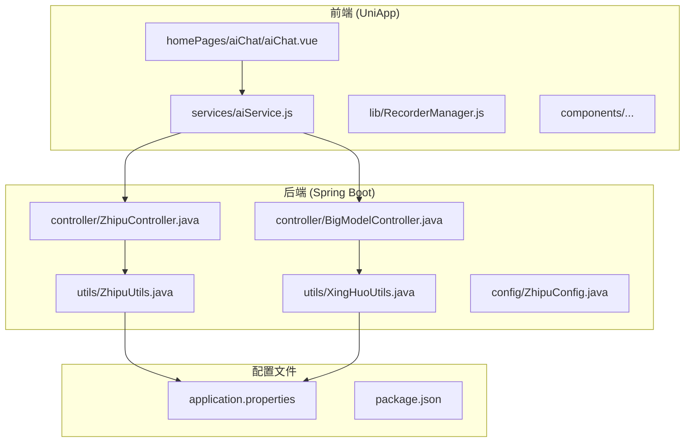
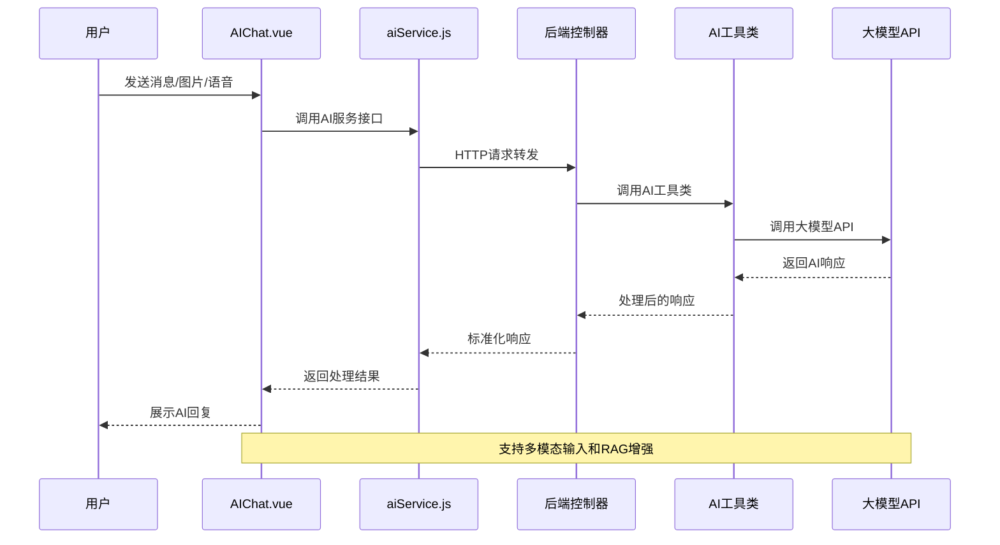
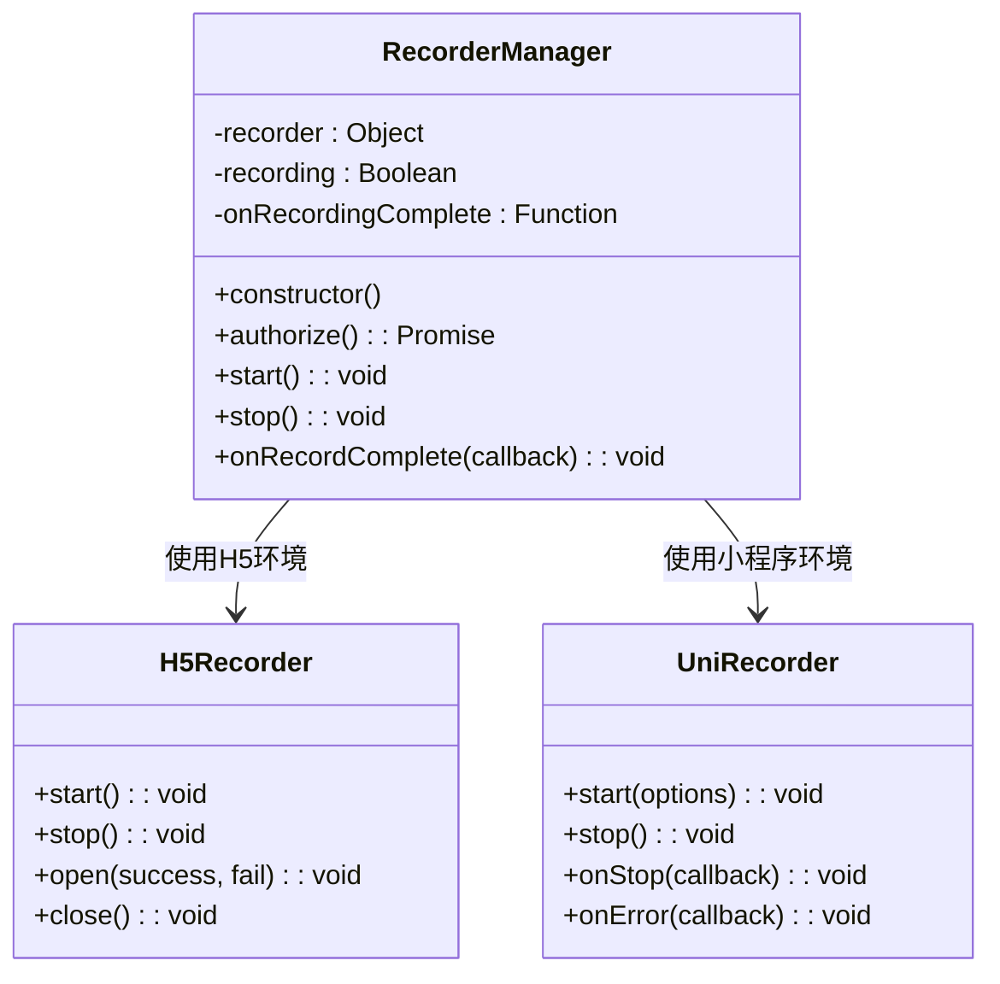
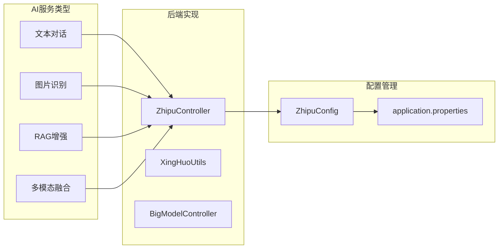
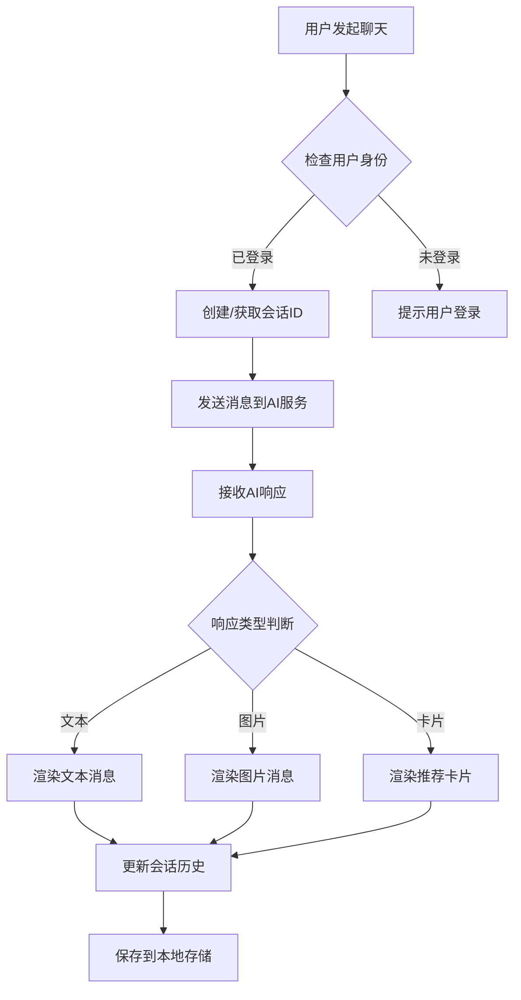
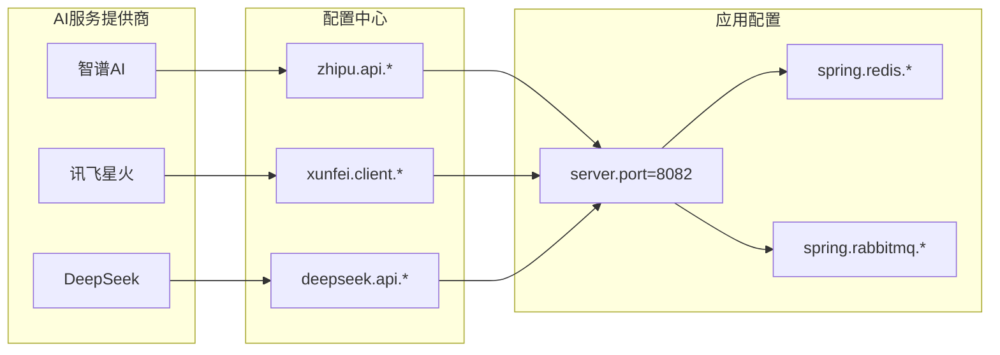

# HomePages AiChat AiChat

<cite>
**本文档引用的文件**
- [aiChat.vue](file://uniapp-travel-social/homePages/aiChat/aiChat.vue)
- [aiService.js](file://uniapp-travel-social/services/aiService.js)
- [RecorderManager.js](file://uniapp-travel-social/lib/RecorderManager.js)
- [BigModelController.java](file://springboot-travel-social/src/main/java/com/xx/controller/BigModelController.java)
- [ZhipuController.java](file://springboot-travel-social/src/main/java/com/xx/controller/ZhipuController.java)
- [ZhipuConfig.java](file://springboot-travel-social/src/main/java/com/xx/config/ZhipuConfig.java)
- [ZhipuUtils.java](file://springboot-travel-social/src/main/java/com/xx/utils/ZhipuUtils.java)
- [XingHuoUtils.java](file://springboot-travel-social/src/main/java/com/xx/utils/XingHuoUtils.java)
- [application.properties](file://springboot-travel-social/src/main/resources/application.properties)
- [package.json](file://uniapp-travel-social/package.json)
</cite>

## 目录
1. [简介](#简介)
2. [项目结构](#项目结构)
3. [核心组件](#核心组件)
4. [架构概览](#架构概览)
5. [详细组件分析](#详细组件分析)
6. [依赖关系分析](#依赖关系分析)
7. [性能考虑](#性能考虑)
8. [故障排除指南](#故障排除指南)
9. [结论](#结论)

## 简介

HomePages AiChat 是一个基于 UniApp 开发的智能旅行助手聊天界面，集成了多种 AI 大模型服务，提供智能化的旅行规划、景点推荐、美食攻略等功能。该组件采用现代化的设计理念，支持深色模式切换、语音输入、图片识别等高级功能。

## 项目结构

该项目采用前后端分离架构，主要分为两个部分：



**图表来源**
- [aiChat.vue:1-50](file://uniapp-travel-social/homePages/aiChat/aiChat.vue#L1-L50)
- [aiService.js:1-30](file://uniapp-travel-social/services/aiService.js#L1-L30)
- [application.properties:1-64](file://springboot-travel-social/src/main/resources/application.properties#L1-L64)

**章节来源**
- [aiChat.vue:1-100](file://uniapp-travel-social/homePages/aiChat/aiChat.vue#L1-L100)
- [package.json:1-27](file://uniapp-travel-social/package.json#L1-L27)

## 核心组件

### AI 聊天主组件

AIChat.vue 是整个聊天系统的核心组件，具有以下关键特性：

- **多模态交互**：支持文本、图片、语音等多种输入方式
- **智能会话管理**：完整的会话历史记录和管理功能
- **个性化推荐**：基于用户画像和位置信息的智能推荐
- **深色模式支持**：自适应的主题切换机制
- **快捷指令面板**：提供常用旅行相关的快捷操作

### AI 服务封装

aiService.js 提供了统一的 AI 服务接口封装：

- **简单聊天接口**：基础的对话功能
- **通用聊天接口**：支持系统提示词的对话
- **RAG 增强聊天**：基于游记的智能问答
- **多模态聊天**：支持图片和文本的混合输入
- **会话管理**：完整的会话生命周期管理

**章节来源**
- [aiChat.vue:441-527](file://uniapp-travel-social/homePages/aiChat/aiChat.vue#L441-L527)
- [aiService.js:42-324](file://uniapp-travel-social/services/aiService.js#L42-L324)

## 架构概览

系统采用三层架构设计，从前端到后端形成完整的 AI 服务链路：



**图表来源**
- [aiChat.vue:944-1116](file://uniapp-travel-social/homePages/aiChat/aiChat.vue#L944-L1116)
- [aiService.js:52-321](file://uniapp-travel-social/services/aiService.js#L52-L321)

## 详细组件分析

### 语音输入组件

RecorderManager.js 实现了跨平台的语音录制功能：



**图表来源**
- [RecorderManager.js:5-121](file://uniapp-travel-social/lib/RecorderManager.js#L5-L121)

### 多模态 AI 服务

系统支持多种 AI 大模型服务：



**图表来源**
- [ZhipuController.java:29-77](file://springboot-travel-social/src/main/java/com/xx/controller/ZhipuController.java#L29-L77)
- [ZhipuConfig.java:12-19](file://springboot-travel-social/src/main/java/com/xx/config/ZhipuConfig.java#L12-L19)

**章节来源**
- [RecorderManager.js:1-121](file://uniapp-travel-social/lib/RecorderManager.js#L1-L121)
- [ZhipuController.java:1-98](file://springboot-travel-social/src/main/java/com/xx/controller/ZhipuController.java#L1-L98)

### 会话管理系统

AIChat.vue 内置了完整的会话管理功能：



**图表来源**
- [aiChat.vue:944-1116](file://uniapp-travel-social/homePages/aiChat/aiChat.vue#L944-L1116)

**章节来源**
- [aiChat.vue:672-795](file://uniapp-travel-social/homePages/aiChat/aiChat.vue#L672-L795)

## 依赖关系分析

### 前端依赖

```mermaid
graph TB
subgraph "UI框架"
A[uview-ui]
B[uni-app]
end
subgraph "第三方库"
C[@escook/request-miniprogram]
D[goeasy]
E[color-convert]
end
subgraph "业务模块"
F[aiChat.vue]
G[aiService.js]
H[RecorderManager.js]
end
F --> G
G --> C
F --> A
F --> B
F --> D
F --> E
```

**图表来源**
- [package.json:15-21](file://uniapp-travel-social/package.json#L15-L21)

### 后端依赖

后端系统依赖多种 AI 服务提供商：



**图表来源**
- [application.properties:46-60](file://springboot-travel-social/src/main/resources/application.properties#L46-L60)

**章节来源**
- [application.properties:1-64](file://springboot-travel-social/src/main/resources/application.properties#L1-L64)
- [package.json:1-27](file://uniapp-travel-social/package.json#L1-L27)

## 性能考虑

### 前端性能优化

1. **虚拟滚动**：使用 scroll-view 实现长列表的虚拟滚动
2. **懒加载**：图片和卡片采用懒加载策略
3. **内存管理**：及时清理定时器和事件监听器
4. **缓存策略**：会话历史和用户偏好数据本地缓存

### 后端性能优化

1. **连接池配置**：合理配置数据库和Redis连接池
2. **异步处理**：使用消息队列处理耗时任务
3. **缓存机制**：Redis缓存热点数据
4. **负载均衡**：支持多实例部署

## 故障排除指南

### 常见问题及解决方案

| 问题类型 | 症状描述 | 解决方案 |
|---------|----------|----------|
| 登录失效 | 401未授权错误 | 检查token有效期，重新登录 |
| 网络超时 | 请求超时或失败 | 检查网络连接，重试请求 |
| AI服务异常 | 返回错误信息 | 检查AI服务配置和密钥 |
| 语音识别失败 | 无法转换语音 | 检查麦克风权限设置 |

### 调试技巧

1. **控制台日志**：启用详细的日志输出
2. **网络监控**：使用浏览器开发者工具监控网络请求
3. **状态检查**：定期检查AI服务状态
4. **错误捕获**：完善的异常处理机制

**章节来源**
- [aiService.js:5-40](file://uniapp-travel-social/services/aiService.js#L5-L40)

## 结论

HomePages AiChat 是一个功能完备的智能旅行助手系统，具有以下特点：

1. **多模态交互**：支持文本、图片、语音等多种输入方式
2. **智能推荐**：基于用户画像和实时上下文的个性化推荐
3. **跨平台兼容**：支持微信小程序、H5等多种平台
4. **可扩展性**：模块化的架构设计便于功能扩展
5. **用户体验**：现代化的界面设计和流畅的交互体验

该系统为旅行爱好者提供了全方位的智能服务，从行程规划到实时问答，满足了用户在旅行过程中的各种需求。