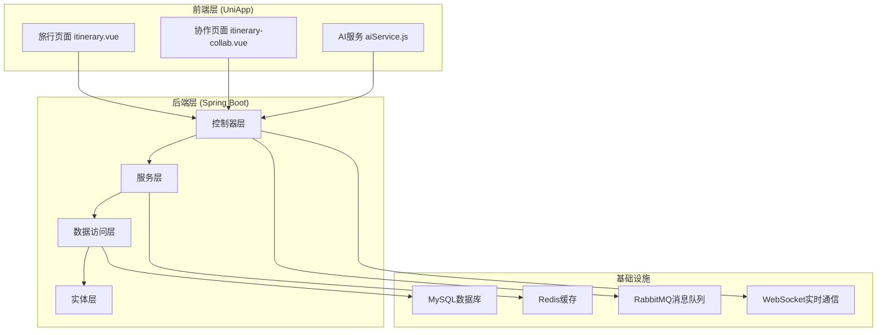
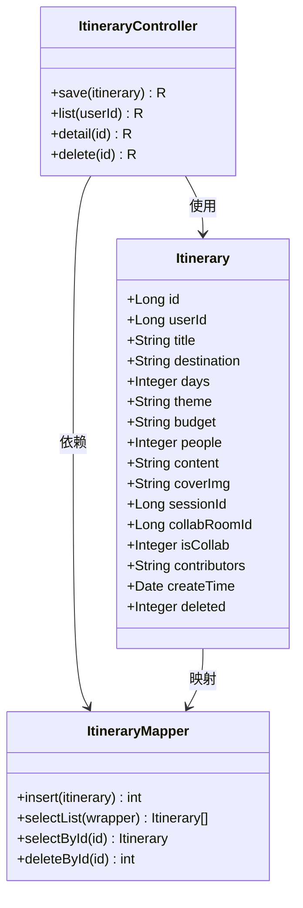
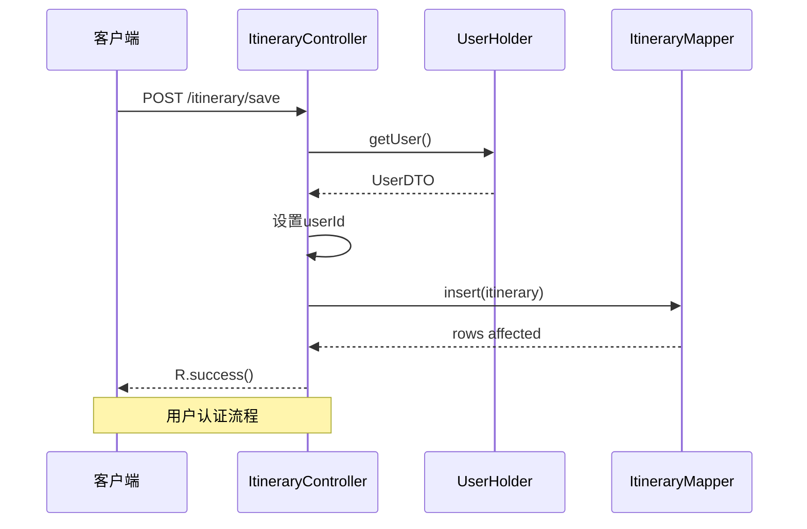
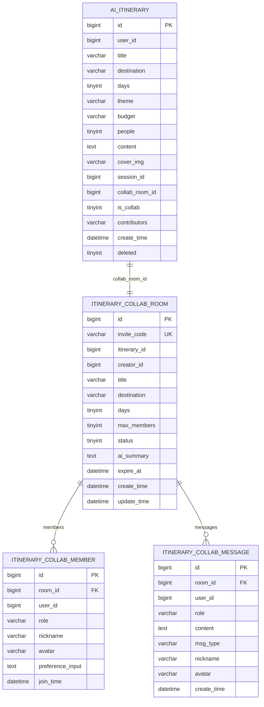
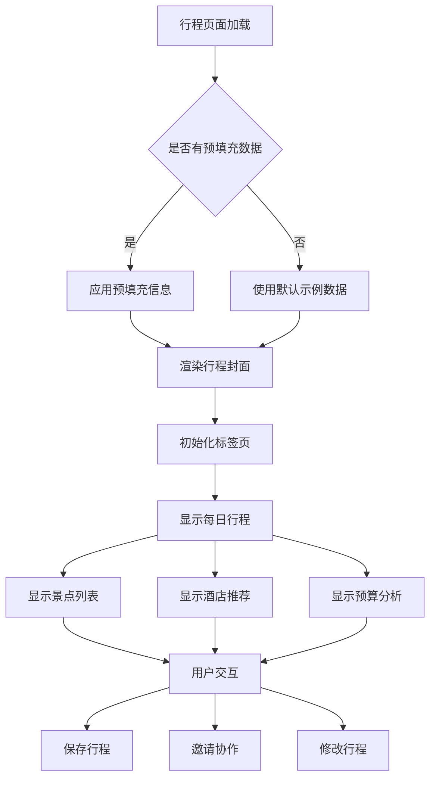
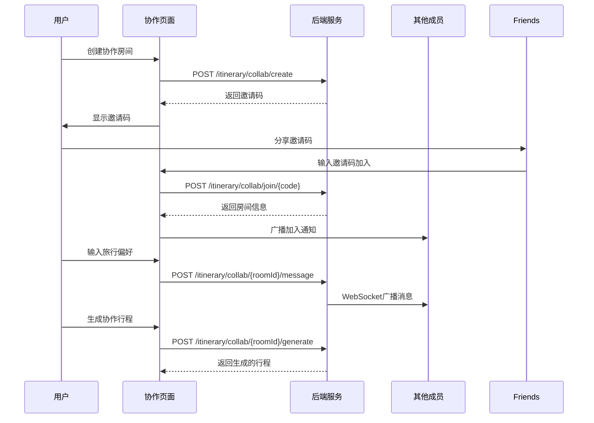
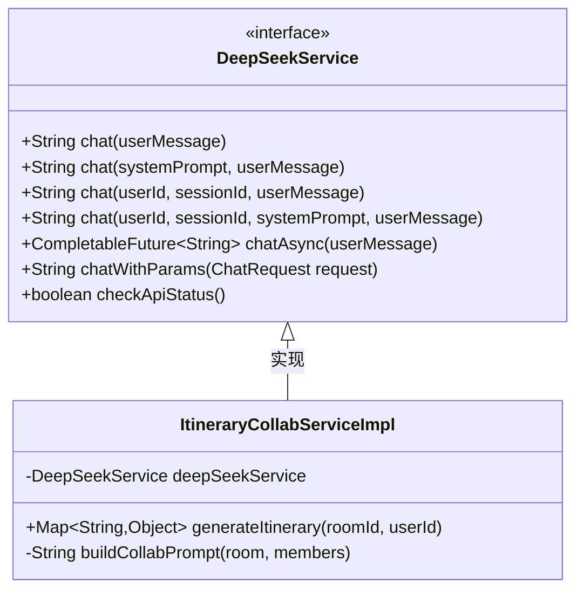

# 旅行攻略社交小程序 - 行程规划系统

<cite>
**本文档引用的文件**
- [ItineraryController.java](file://springboot-travel-social/src/main/java/com/cxx/controller/ItineraryController.java)
- [ItineraryCollabController.java](file://springboot-travel-social/src/main/java/com/cxx/controller/ItineraryCollabController.java)
- [Itinerary.java](file://springboot-travel-social/src/main/java/com/cxx/entity/Itinerary.java)
- [ItineraryCollabRoom.java](file://springboot-travel-social/src/main/java/com/cxx/entity/ItineraryCollabRoom.java)
- [ItineraryCollabMessage.java](file://springboot-travel-social/src/main/java/com/cxx/entity/ItineraryCollabMessage.java)
- [ItineraryCollabService.java](file://springboot-travel-social/src/main/java/com/cxx/service/ItineraryCollabService.java)
- [ItineraryCollabServiceImpl.java](file://springboot-travel-social/src/main/java/com/cxx/service/impl/ItineraryCollabServiceImpl.java)
- [itinerary_collab.sql](file://springboot-travel-social/src/main/resources/sql/itinerary_collab.sql)
- [UserHolder.java](file://springboot-travel-social/src/main/java/com/cxx/utils/UserHolder.java)
- [itinerary.vue](file://uniapp-travel-social/homePages/itinerary/itinerary.vue)
- [itinerary-collab.vue](file://uniapp-travel-social/homePages/itinerary/itinerary-collab.vue)
- [aiService.js](file://uniapp-travel-social/services/aiService.js)
- [DeepSeekService.java](file://springboot-travel-social/src/main/java/com/cxx/service/DeepSeekService.java)
- [application.properties](file://springboot-travel-social/src/main/resources/application.properties)
</cite>

## 目录
1. [项目概述](#项目概述)
2. [系统架构](#系统架构)
3. [核心组件](#核心组件)
4. [数据库设计](#数据库设计)
5. [前端界面](#前端界面)
6. [AI集成](#ai集成)
7. [协作功能](#协作功能)
8. [API接口](#api接口)
9. [性能优化](#性能优化)
10. [故障排除](#故障排除)
11. [总结](#总结)

## 项目概述

旅行攻略社交小程序是一个基于Spring Boot和UniApp开发的综合性旅游服务平台，专注于提供智能化的行程规划和社交功能。系统的核心亮点是AI驱动的行程生成和多人协作规划能力。

### 主要功能特性

- **AI智能行程规划**：基于用户偏好自动生成个性化旅行行程
- **多人协作规划**：支持朋友间共同制定旅行计划
- **实时聊天互动**：内置AI聊天助手提供旅行咨询
- **行程管理**：个人和团队行程的创建、编辑、分享
- **社交功能**：游记分享、评论互动、关注系统

## 系统架构



**架构图来源**
- [ItineraryController.java:19-23](file://springboot-travel-social/src/main/java/com/cxx/controller/ItineraryController.java#L19-L23)
- [ItineraryCollabController.java:19-24](file://springboot-travel-social/src/main/java/com/cxx/controller/ItineraryCollabController.java#L19-L24)

## 核心组件

### 行程管理模块

行程管理是系统的核心功能，负责个人旅行计划的创建、存储和管理。



**类图来源**
- [Itinerary.java:21-73](file://springboot-travel-social/src/main/java/com/cxx/entity/Itinerary.java#L21-L73)
- [ItineraryController.java:25-26](file://springboot-travel-social/src/main/java/com/cxx/controller/ItineraryController.java#L25-L26)

**章节来源**
- [ItineraryController.java:16-122](file://springboot-travel-social/src/main/java/com/cxx/controller/ItineraryController.java#L16-L122)
- [Itinerary.java:13-73](file://springboot-travel-social/src/main/java/com/cxx/entity/Itinerary.java#L13-L73)

### 用户认证与会话管理

系统采用ThreadLocal方式管理用户会话状态，确保API调用的安全性和一致性。



**序列图来源**
- [ItineraryController.java:32-67](file://springboot-travel-social/src/main/java/com/cxx/controller/ItineraryController.java#L32-L67)
- [UserHolder.java:5-19](file://springboot-travel-social/src/main/java/com/cxx/utils/UserHolder.java#L5-L19)

**章节来源**
- [UserHolder.java:1-20](file://springboot-travel-social/src/main/java/com/cxx/utils/UserHolder.java#L1-L20)

## 数据库设计

系统采用MySQL数据库存储旅行相关的所有数据，包括行程、用户偏好、协作信息等。



**实体关系图来源**
- [itinerary_collab.sql:5-59](file://springboot-travel-social/src/main/resources/sql/itinerary_collab.sql#L5-L59)

**章节来源**
- [itinerary_collab.sql:1-60](file://springboot-travel-social/src/main/resources/sql/itinerary_collab.sql#L1-L60)

## 前端界面

### 个人行程页面

个人行程页面提供了完整的旅行计划展示功能，包括每日行程、景点列表、酒店推荐和预算分析。



**流程图来源**
- [itinerary.vue:362-382](file://uniapp-travel-social/homePages/itinerary/itinerary.vue#L362-L382)

**章节来源**
- [itinerary.vue:1-784](file://uniapp-travel-social/homePages/itinerary/itinerary.vue#L1-L784)

### 协作规划页面

协作规划页面支持多人实时讨论旅行计划，具备邀请码机制和权限控制。



**序列图来源**
- [itinerary-collab.vue:158-169](file://uniapp-travel-social/homePages/itinerary/itinerary-collab.vue#L158-L169)
- [ItineraryCollabController.java:32-47](file://springboot-travel-social/src/main/java/com/cxx/controller/ItineraryCollabController.java#L32-L47)

**章节来源**
- [itinerary-collab.vue:1-443](file://uniapp-travel-social/homePages/itinerary/itinerary-collab.vue#L1-L443)

## AI集成

### DeepSeek AI服务

系统集成了DeepSeek AI服务，提供强大的自然语言处理能力来生成旅行建议和行程规划。



**类图来源**
- [DeepSeekService.java:7-46](file://springboot-travel-social/src/main/java/com/cxx/service/DeepSeekService.java#L7-L46)
- [ItineraryCollabServiceImpl.java:27-35](file://springboot-travel-social/src/main/java/com/cxx/service/impl/ItineraryCollabServiceImpl.java#L27-L35)

**章节来源**
- [DeepSeekService.java:1-46](file://springboot-travel-social/src/main/java/com/cxx/service/DeepSeekService.java#L1-L46)
- [ItineraryCollabServiceImpl.java:174-239](file://springboot-travel-social/src/main/java/com/cxx/service/impl/ItineraryCollabServiceImpl.java#L174-L239)

### AI配置管理

系统通过配置文件管理多个AI服务提供商的API密钥和基础URL。

**章节来源**
- [application.properties:50-64](file://springboot-travel-social/src/main/resources/application.properties#L50-L64)

## 协作功能

### 邀请码机制

协作房间采用6位邀请码机制，确保房间访问的安全性和可控性。

```mermaid
flowchart TD
A[创建协作房间] --> B[生成唯一邀请码]
B --> C[设置过期时间(24小时)]
C --> D[保存房间信息]
D --> E[添加创建者为owner]
E --> F[发送系统消息]
F --> G[返回房间信息]
H[用户加入房间] --> I[验证邀请码]
I --> J{邀请码有效?}
J --> |否| K[抛出异常]
J --> |是| L[检查房间状态]
L --> M{房间未结束?}
M --> |否| K
M --> |是| N[检查有效期]
N --> O{未过期?}
O --> |否| K
O --> |是| P[检查成员数量]
P --> Q{未满员?}
Q --> |否| K
Q --> |是| R[添加成员]
R --> S[发送加入通知]
S --> T[返回房间信息]
```

**流程图来源**
- [ItineraryCollabServiceImpl.java:85-122](file://springboot-travel-social/src/main/java/com/cxx/service/impl/ItineraryCollabServiceImpl.java#L85-L122)

**章节来源**
- [ItineraryCollabServiceImpl.java:36-81](file://springboot-travel-social/src/main/java/com/cxx/service/impl/ItineraryCollabServiceImpl.java#L36-L81)

### 权限控制

系统实现了严格的权限控制机制，确保只有房间创建者可以触发AI生成行程。

**章节来源**
- [ItineraryCollabServiceImpl.java:175-186](file://springboot-travel-social/src/main/java/com/cxx/service/impl/ItineraryCollabServiceImpl.java#L175-L186)

## API接口

### 行程管理API

系统提供了完整的RESTful API来管理个人行程。

| 接口 | 方法 | 描述 | 请求参数 | 响应 |
|------|------|------|----------|------|
| `/itinerary/save` | POST | 保存行程 | Itinerary对象 | R结果 |
| `/itinerary/list/{userId}` | GET | 获取用户行程列表 | userId路径参数 | 行程列表 |
| `/itinerary/detail/{id}` | GET | 获取行程详情 | id路径参数 | Itinerary对象 |
| `/itinerary/delete/{id}` | DELETE | 删除行程 | id路径参数 | R结果 |

### 协作规划API

协作功能提供了专门的API接口来管理多人行程规划。

| 接口 | 方法 | 描述 | 请求参数 | 响应 |
|------|------|------|----------|------|
| `/itinerary/collab/create` | POST | 创建协作房间 | creatorId, title, destination, days | 房间信息 |
| `/itinerary/collab/join/{code}` | POST | 通过邀请码加入房间 | 邀请码路径参数, userId | 房间详情 |
| `/itinerary/collab/members/{roomId}` | GET | 获取房间成员列表 | roomId路径参数 | 成员列表 |
| `/itinerary/collab/{roomId}/message` | POST | 发送协作消息 | roomId路径参数, content | 消息对象 |
| `/itinerary/collab/{roomId}/generate` | POST | 生成协作行程 | roomId路径参数, userId | 行程信息 |
| `/itinerary/collab/{roomId}/messages` | GET | 获取历史消息 | roomId路径参数 | 消息列表 |

**章节来源**
- [ItineraryController.java:74-121](file://springboot-travel-social/src/main/java/com/cxx/controller/ItineraryController.java#L74-L121)
- [ItineraryCollabController.java:32-137](file://springboot-travel-social/src/main/java/com/cxx/controller/ItineraryCollabController.java#L32-L137)

## 性能优化

### 缓存策略

系统采用了多层次的缓存策略来提升性能：

1. **Redis缓存**：用户会话信息、热门数据
2. **数据库索引**：关键查询字段建立索引
3. **连接池优化**：数据库连接池配置

### 异步处理

对于耗时的操作，系统采用了异步处理机制：

- WebSocket消息广播
- 文件上传处理
- 邮件发送任务

## 故障排除

### 常见问题及解决方案

**问题1：邀请码无效**
- 检查邀请码是否正确
- 确认邀请码是否过期（24小时有效期）
- 验证房间状态是否正常

**问题2：AI生成失败**
- 检查DeepSeek API配置
- 验证API密钥有效性
- 确认网络连接正常

**问题3：WebSocket连接失败**
- 检查服务器端WebSocket配置
- 验证客户端连接状态
- 确认防火墙设置

**章节来源**
- [ItineraryCollabServiceImpl.java:88-97](file://springboot-travel-social/src/main/java/com/cxx/service/impl/ItineraryCollabServiceImpl.java#L88-L97)

## 总结

旅行攻略社交小程序的行程规划系统是一个功能完整、架构清晰的现代化Web应用。系统的主要优势包括：

1. **智能化程度高**：集成AI服务提供智能行程规划
2. **协作性强**：支持多人实时协作制定旅行计划
3. **用户体验好**：界面友好，操作简便
4. **扩展性佳**：模块化设计便于功能扩展
5. **性能稳定**：采用多种优化策略确保系统稳定运行

该系统为用户提供了一个完整的旅行规划解决方案，从个人定制到多人协作，从智能建议到实时互动，满足了现代旅行者多样化的需求。