# 优选购物系统

<cite>
**本文档引用的文件**
- [TravelSocialApplication.java](file://springboot-travel-social/src/main/java/com/cxx/TravelSocialApplication.java)
- [pom.xml](file://springboot-travel-social/pom.xml)
- [application.properties](file://springboot-travel-social/src/main/resources/application.properties)
- [CartController.java](file://springboot-travel-social/src/main/java/com/cxx/controller/CartController.java)
- [CartService.java](file://springboot-travel-social/src/main/java/com/cxx/service/CartService.java)
- [CartServiceImpl.java](file://springboot-travel-social/src/main/java/com/cxx/service/impl/CartServiceImpl.java)
- [Cart.java](file://springboot-travel-social/src/main/java/com/cxx/entity/Cart.java)
- [CartItem.java](file://springboot-travel-social/src/main/java/com/cxx/entity/CartItem.java)
- [CartMapper.java](file://springboot-travel-social/src/main/java/com/cxx/mapper/CartMapper.java)
- [OrderController.java](file://springboot-travel-social/src/main/java/com/cxx/controller/OrderController.java)
- [OrderService.java](file://springboot-travel-social/src/main/java/com/cxx/service/OrderService.java)
- [OrderServiceImpl.java](file://springboot-travel-social/src/main/java/com/cxx/service/impl/OrderServiceImpl.java)
- [preferred.vue](file://uniapp-travel-social/pages/preferred/preferred.vue)
- [pages.json](file://uniapp-travel-social/pages.json)
- [package.json](file://uniapp-travel-social/package.json)
- [cart.vue](file://uniapp-travel-social/pages/preferredPages/cart.vue)
- [checkout.vue](file://uniapp-travel-social/preferredPages/checkout.vue)
- [order.vue](file://uniapp-travel-social/preferredPages/order.vue)
- [product.vue](file://uniapp-travel-social/preferredPages/product.vue)
- [collect.vue](file://uniapp-travel-social/preferredPages/collect.vue)
- [coupon.vue](file://uniapp-travel-social/preferredPages/coupon.vue)
- [topic.vue](file://uniapp-travel-social/preferredPages/topic.vue)
- [reviews.vue](file://uniapp-travel-social/preferredPages/reviews.vue)
</cite>

## 更新摘要
**所做更改**
- 新增完整的购物流程页面分析，包括结算、订单、产品详情等页面
- 更新购物车功能详解，增加结算流程和订单管理
- 新增订单管理系统架构图和流程图
- 完善前端页面结构分析，涵盖完整的电商购物流程
- 新增订单状态管理和物流跟踪功能说明
- 新增收藏、优惠券、专题页面的完整实现分析
- 新增商品评价系统的详细功能说明

## 目录
1. [项目概述](#项目概述)
2. [系统架构](#系统架构)
3. [核心模块](#核心模块)
4. [购物车功能详解](#购物车功能详解)
5. [订单管理系统](#订单管理系统)
6. [前端界面设计](#前端界面设计)
7. [技术栈分析](#技术栈分析)
8. [数据库设计](#数据库设计)
9. [部署与配置](#部署与配置)
10. [性能优化建议](#性能优化建议)
11. [总结](#总结)

## 项目概述

优选购物系统是一个基于Spring Boot和UniApp开发的综合性旅游购物平台，主要为用户提供商品浏览、购物车管理、订单处理、物流跟踪等完整的电商功能。该系统采用前后端分离架构，后端使用Java Spring Boot框架，前端使用Vue.js的UniApp跨平台开发框架。

系统的核心特色包括：
- 实时购物车管理功能
- 多维度商品筛选和排序
- 完整的订单生命周期管理
- 积分和优惠券系统
- 社交化购物体验
- 跨平台支持（微信小程序、H5等）
- 物流跟踪和订单状态管理
- 商品收藏和专题推荐功能
- 用户评价和反馈系统

**更新** 新增了完整的购物流程页面，包括结算、订单管理、产品详情等核心电商功能，以及收藏、优惠券、专题等辅助功能的完整实现

## 系统架构

系统采用典型的三层架构设计，实现了清晰的职责分离：

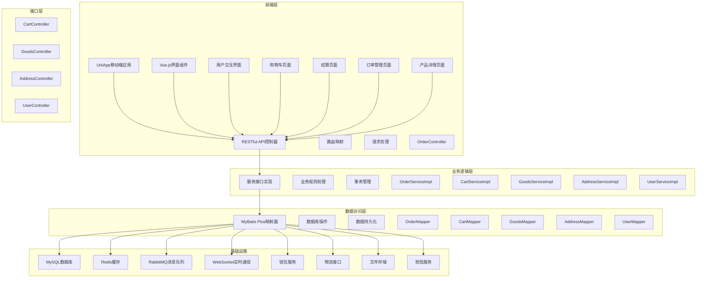

**架构图来源**
- [TravelSocialApplication.java:16-25](file://springboot-travel-social/src/main/java/com/cxx/TravelSocialApplication.java#L16-L25)
- [pom.xml:16-182](file://springboot-travel-social/pom.xml#L16-L182)
- [OrderController.java:12-55](file://springboot-travel-social/src/main/java/com/cxx/controller/OrderController.java#L12-L55)
- [CartController.java:13-93](file://springboot-travel-social/src/main/java/com/cxx/controller/CartController.java#L13-L93)

## 核心模块

### 后端核心模块

系统后端采用模块化设计，主要包含以下核心模块：

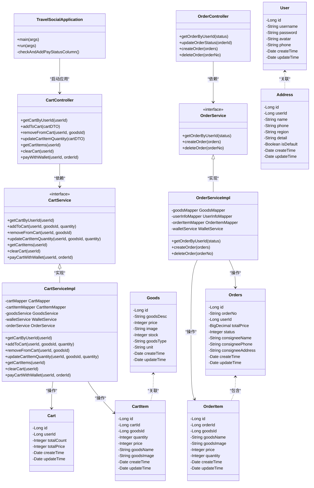

**类图来源**
- [CartController.java:13-93](file://springboot-travel-social/src/main/java/com/cxx/controller/CartController.java#L13-L93)
- [CartService.java:10-31](file://springboot-travel-social/src/main/java/com/cxx/service/CartService.java#L10-L31)
- [CartServiceImpl.java:27-274](file://springboot-travel-social/src/main/java/com/cxx/service/impl/CartServiceImpl.java#L27-L274)
- [OrderController.java:12-55](file://springboot-travel-social/src/main/java/com/cxx/controller/OrderController.java#L12-L55)
- [OrderService.java:1-14](file://springboot-travel-social/src/main/java/com/cxx/service/OrderService.java#L1-L14)
- [OrderServiceImpl.java:22-171](file://springboot-travel-social/src/main/java/com/cxx/service/impl/OrderServiceImpl.java#L22-L171)
- [Cart.java:18-31](file://springboot-travel-social/src/main/java/com/cxx/entity/Cart.java#L18-L31)
- [CartItem.java:18-34](file://springboot-travel-social/src/main/java/com/cxx/entity/CartItem.java#L18-L34)

**章节来源**
- [TravelSocialApplication.java:17-50](file://springboot-travel-social/src/main/java/com/cxx/TravelSocialApplication.java#L17-L50)
- [CartController.java:13-93](file://springboot-travel-social/src/main/java/com/cxx/controller/CartController.java#L13-L93)
- [OrderController.java:12-55](file://springboot-travel-social/src/main/java/com/cxx/controller/OrderController.java#L12-L55)

## 购物车功能详解

### 功能流程图

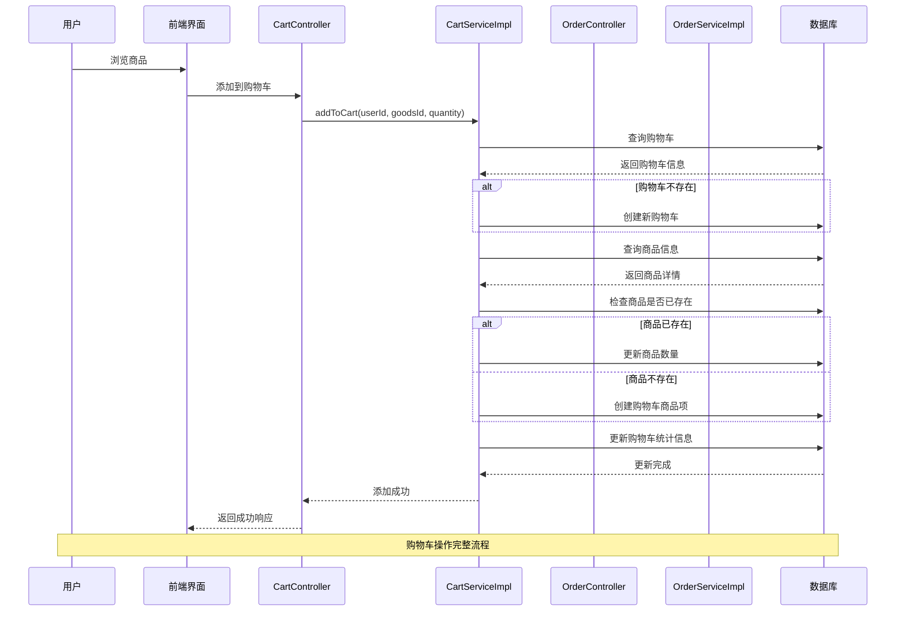

**序列图来源**
- [CartController.java:32-40](file://springboot-travel-social/src/main/java/com/cxx/controller/CartController.java#L32-L40)
- [CartServiceImpl.java:55-100](file://springboot-travel-social/src/main/java/com/cxx/service/impl/CartServiceImpl.java#L55-L100)

### 购物车数据模型

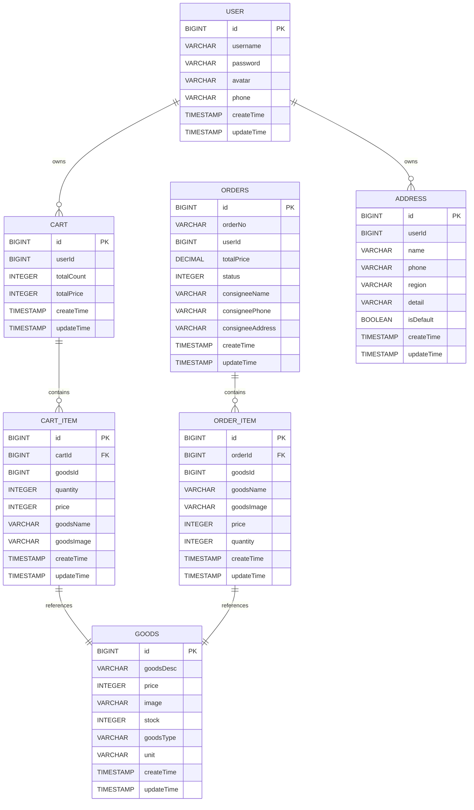

**实体关系图来源**
- [Cart.java:20-31](file://springboot-travel-social/src/main/java/com/cxx/entity/Cart.java#L20-L31)
- [CartItem.java:20-34](file://springboot-travel-social/src/main/java/com/cxx/entity/CartItem.java#L20-L34)
- [OrderServiceImpl.java:36-62](file://springboot-travel-social/src/main/java/com/cxx/service/impl/OrderServiceImpl.java#L36-L62)

**章节来源**
- [CartServiceImpl.java:55-274](file://springboot-travel-social/src/main/java/com/cxx/service/impl/CartServiceImpl.java#L55-L274)
- [CartController.java:20-93](file://springboot-travel-social/src/main/java/com/cxx/controller/CartController.java#L20-L93)

### 结算流程详解

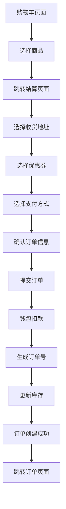

**结算流程图来源**
- [checkout.vue:296-351](file://uniapp-travel-social/preferredPages/checkout.vue#L296-L351)
- [OrderServiceImpl.java:81-171](file://springboot-travel-social/src/main/java/com/cxx/service/impl/OrderServiceImpl.java#L81-L171)

**章节来源**
- [checkout.vue:187-354](file://uniapp-travel-social/preferredPages/checkout.vue#L187-L354)
- [cart.vue:103-229](file://uniapp-travel-social/pages/preferredPages/cart.vue#L103-L229)

## 订单管理系统

### 订单状态管理

系统实现了完整的订单生命周期管理，包含四个主要状态：

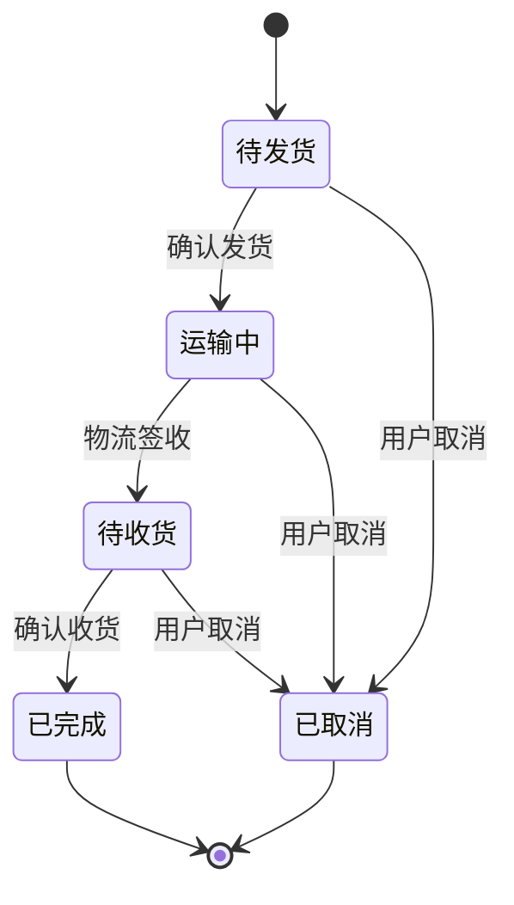

**订单状态图来源**
- [order.vue:33-37](file://uniapp-travel-social/preferredPages/order.vue#L33-L37)
- [OrderServiceImpl.java:142](file://springboot-travel-social/src/main/java/com/cxx/service/impl/OrderServiceImpl.java#L142)

### 订单管理功能

订单管理页面提供了完整的订单操作功能：

| 功能特性 | 实现方式 | 用户价值 |
|---------|----------|----------|
| 订单状态筛选 | 标签页切换 + 状态过滤 | 快速定位特定状态订单 |
| 物流信息查看 | 实时物流接口 + 历史记录 | 实时掌握商品配送状态 |
| 订单操作 | 确认收货 + 删除订单 | 完整的订单生命周期管理 |
| 评价功能 | 评价入口 + 评价列表 | 用户反馈和商品质量评估 |
| 发票管理 | 发票生成 + 管理 | 满足用户报销需求 |

**章节来源**
- [order.vue:352-570](file://uniapp-travel-social/preferredPages/order.vue#L352-L570)
- [OrderController.java:20-55](file://springboot-travel-social/src/main/java/com/cxx/controller/OrderController.java#L20-L55)

## 前端界面设计

### 页面结构分析

系统采用UniApp框架构建，具有良好的跨平台兼容性，新增了完整的购物流程页面：

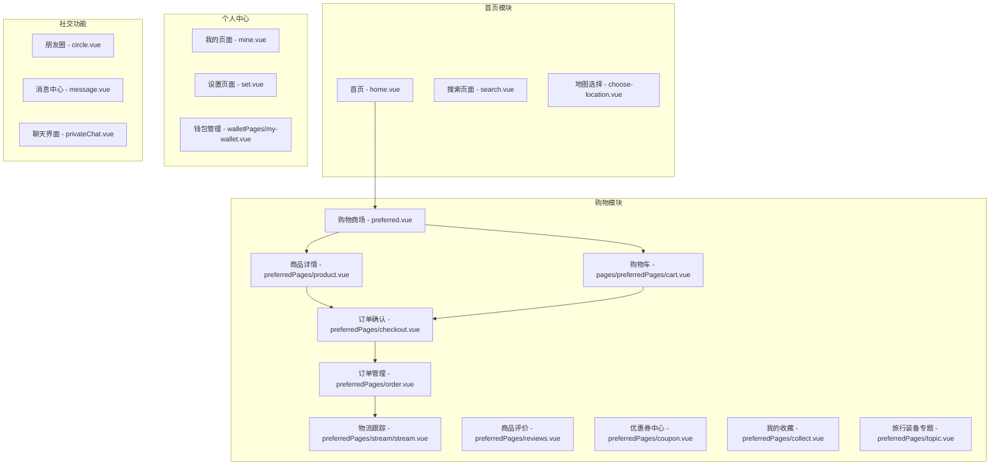

**页面结构图来源**
- [pages.json:490-548](file://uniapp-travel-social/pages.json#L490-L548)

### 购物界面功能

前端购物界面提供了丰富的用户体验，新增了完整的购物流程：

| 功能特性 | 实现方式 | 用户价值 |
|---------|----------|----------|
| 商品浏览 | 网格布局 + 轮播图 | 直观展示商品信息 |
| 搜索功能 | 实时关键词匹配 | 快速定位目标商品 |
| 分类筛选 | Tab切换 + 过滤算法 | 提升查找效率 |
| 排序功能 | 多维度排序（价格、销量、新品） | 满足不同购物需求 |
| 购物车集成 | 实时数量显示 + 操作反馈 | 简化购买流程 |
| 收藏功能 | 本地存储 + 图标标识 | 个性化商品管理 |
| 结算流程 | 多步骤确认 + 支付方式选择 | 安全可靠的购买体验 |
| 订单管理 | 状态可视化 + 操作便捷 | 完整的购后服务 |
| 物流跟踪 | 实时更新 + 历史记录 | 透明的商品配送信息 |
| 优惠券系统 | 优惠券选择 + 满减计算 | 提升购买性价比 |
| 专题推荐 | 编辑精选 + 分类导航 | 个性化商品发现 |
| 用户评价 | 评分展示 + 评价列表 | 参考其他用户意见 |

**章节来源**
- [preferred.vue:176-268](file://uniapp-travel-social/pages/preferred/preferred.vue#L176-L268)
- [pages.json:490-548](file://uniapp-travel-social/pages.json#L490-L548)

### 收藏功能实现

收藏系统提供了完整的商品收藏和管理功能：

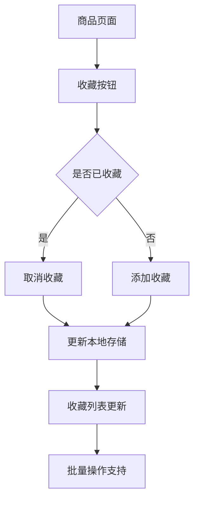

**收藏流程图来源**
- [collect.vue:75-80](file://uniapp-travel-social/preferredPages/collect.vue#L75-L80)

**章节来源**
- [collect.vue:1-174](file://uniapp-travel-social/preferredPages/collect.vue#L1-L174)

### 优惠券系统实现

优惠券系统支持多种状态的优惠券管理：

| 优惠券类型 | 条件要求 | 使用场景 | 用户价值 |
|-----------|----------|----------|----------|
| 新人专享券 | 满100元可用 | 新用户首次购买 | 降低新用户门槛 |
| 旅行装备专属券 | 满200元可用 | 专业旅行装备购买 | 专业领域优惠 |
| 满减优惠券 | 满50元可用 | 任意商品购买 | 通用优惠折扣 |
| 618大促券 | 满150元可用 | 大促活动期间 | 节庆购物优惠 |
| 节日特惠券 | 满80元可用 | 节假日促销 | 节日购物折扣 |

**章节来源**
- [coupon.vue:62-68](file://uniapp-travel-social/preferredPages/coupon.vue#L62-L68)

### 专题页面功能

专题页面提供编辑精选的旅行装备推荐：

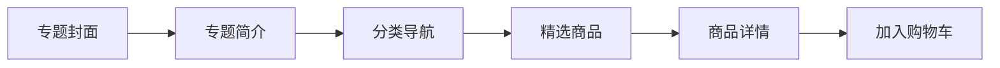

**专题流程图来源**
- [topic.vue:49-73](file://uniapp-travel-social/preferredPages/topic.vue#L49-L73)

**章节来源**
- [topic.vue:1-205](file://uniapp-travel-social/preferredPages/topic.vue#L1-L205)

### 评价系统实现

评价系统提供完整的商品评价展示和筛选功能：

| 评价维度 | 展示方式 | 用户价值 |
|---------|----------|----------|
| 综合评分 | 4.8分显示 | 快速了解商品质量 |
| 星级分布 | 柱状图展示 | 直观显示评价分布 |
| 评价筛选 | 好评/中评/差评 | 快速定位评价类型 |
| 评价列表 | 多维度展示 | 详细了解商品使用体验 |
| 用户头像 | 渐变背景头像 | 个性化用户标识 |

**章节来源**
- [reviews.vue:87-151](file://uniapp-travel-social/preferredPages/reviews.vue#L87-L151)

## 技术栈分析

### 后端技术栈

系统后端采用现代化Java技术栈：

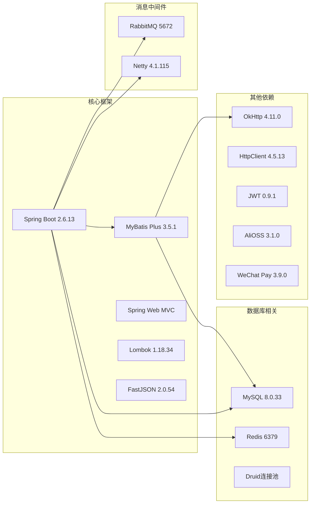

**技术栈图来源**
- [pom.xml:16-182](file://springboot-travel-social/pom.xml#L16-L182)

### 前端技术栈

前端采用UniApp跨平台开发框架，集成了丰富的UI组件：

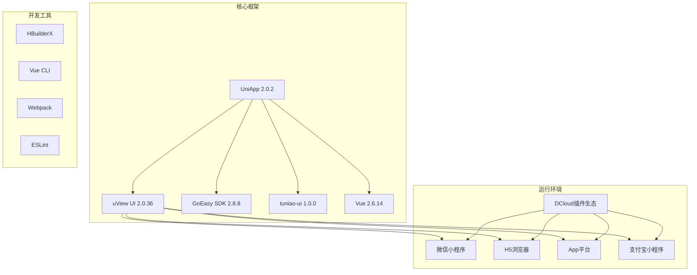

**前端技术栈图来源**
- [package.json:15-21](file://uniapp-travel-social/package.json#L15-L21)

**章节来源**
- [pom.xml:10-182](file://springboot-travel-social/pom.xml#L10-L182)
- [package.json:15-21](file://uniapp-travel-social/package.json#L15-L21)

## 数据库设计

### 核心数据表结构

系统采用关系型数据库设计，主要数据表包括：

| 表名 | 描述 | 主要字段 |
|------|------|----------|
| cart | 购物车主表 | id, userId, totalCount, totalPrice, createTime, updateTime |
| cart_item | 购物车商品项 | id, cartId, goodsId, quantity, price, goodsName, goodsImage, createTime, updateTime |
| goods | 商品信息表 | id, goodsDesc, price, image, stock, goodsType, unit, createTime, updateTime |
| orders | 订单主表 | id, orderNo, userId, totalPrice, status, consigneeName, consigneePhone, consigneeAddress, createTime, updateTime |
| order_item | 订单商品项 | id, orderId, goodsId, goodsName, goodsImage, price, quantity, createTime, updateTime |
| address | 收货地址表 | id, userId, name, phone, region, detail, isDefault, createTime, updateTime |
| user | 用户信息表 | id, username, password, avatar, phone, createTime, updateTime |
| goods_review | 商品评价表 | id, goodsId, userId, rating, content, images, createTime, updateTime |

### 数据一致性保证

系统通过以下机制确保数据一致性：
- 事务管理：使用@Transactional注解确保操作的原子性
- 乐观锁：通过版本号控制并发更新
- 数据校验：前后端双重验证确保数据完整性
- 缓存策略：Redis缓存热点数据提升性能
- 同步锁：订单创建时使用synchronized确保并发安全
- 支付安全：钱包余额操作使用分布式锁防止重复支付

**章节来源**
- [Cart.java:20-31](file://springboot-travel-social/src/main/java/com/cxx/entity/Cart.java#L20-L31)
- [CartItem.java:20-34](file://springboot-travel-social/src/main/java/com/cxx/entity/CartItem.java#L20-L34)
- [OrderServiceImpl.java:86-87](file://springboot-travel-social/src/main/java/com/cxx/service/impl/OrderServiceImpl.java#L86-L87)

## 部署与配置

### 环境配置

系统支持多环境部署，主要配置文件包括：

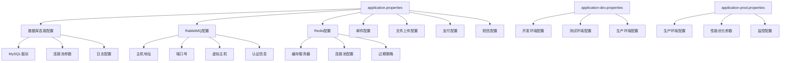

**配置流程图来源**
- [application.properties:1-64](file://springboot-travel-social/src/main/resources/application.properties#L1-L64)

### 依赖管理

系统使用Maven进行依赖管理，主要依赖包括：

| 依赖类别 | 核心组件 | 版本 | 用途 |
|----------|----------|------|------|
| Web框架 | spring-boot-starter-web | 2.6.13 | Web应用基础 |
| 数据库 | mysql-connector-java | 8.0.33 | MySQL驱动 |
| ORM框架 | mybatis-plus-boot-starter | 3.5.1 | 数据库操作 |
| 缓存 | spring-boot-starter-data-redis | 2.6.13 | Redis集成 |
| 消息队列 | spring-boot-starter-amqp | 2.6.13 | RabbitMQ支持 |
| WebSocket | spring-boot-starter-websocket | 2.6.13 | 实时通信 |
| JSON处理 | fastjson | 2.0.54 | JSON序列化 |
| HTTP客户端 | okhttp | 4.11.0 | HTTP请求处理 |
| 工具类 | hutool | 5.8.18 | Java工具类库 |
| 日志 | slf4j-api | 1.7.36 | 日志记录 |
| 安全框架 | spring-boot-starter-security | 2.6.13 | 安全认证 |
| 文件上传 | spring-boot-starter-webflux | 2.6.13 | 文件上传处理 |
| 支付集成 | weixin-pay-sdk | 3.9.0 | 微信支付集成 |
| 对象存储 | aliyun-oss | 3.1.0 | 阿里云OSS存储 |

**章节来源**
- [application.properties:1-64](file://springboot-travel-social/src/main/resources/application.properties#L1-L64)
- [pom.xml:16-182](file://springboot-travel-social/pom.xml#L16-L182)

## 性能优化建议

### 后端性能优化

1. **数据库优化**
   - 为常用查询字段建立索引
   - 使用连接池优化数据库连接
   - 实施分页查询避免全表扫描
   - 优化订单查询条件，添加复合索引
   - 商品列表查询添加goodsType索引

2. **缓存策略**
   - Redis缓存热点商品数据
   - 本地缓存用户购物车信息
   - 实施缓存失效策略
   - 商品详情缓存30分钟
   - 订单状态缓存10分钟

3. **异步处理**
   - 使用消息队列处理耗时操作
   - 异步发送邮件通知
   - 异步文件上传处理
   - 订单状态变更异步通知
   - 支付回调异步处理

4. **订单创建优化**
   - 使用synchronized确保订单创建的原子性
   - 批量更新库存减少数据库交互
   - BigDecimal精确计算避免精度丢失
   - 优惠券使用前检查可用性

5. **文件存储优化**
   - 图片压缩和格式转换
   - CDN加速静态资源
   - 文件分片上传
   - 存储桶权限控制

### 前端性能优化

1. **资源优化**
   - 图片懒加载减少首屏压力
   - 组件按需加载提升性能
   - CSS和JavaScript压缩打包
   - SKU弹窗延迟加载
   - 优惠券列表虚拟滚动

2. **用户体验**
   - 加载动画提升感知速度
   - 错误边界处理提升稳定性
   - 离线数据缓存
   - 订单状态实时更新
   - 收藏列表本地存储

3. **购物流程优化**
   - 购物车数据本地缓存
   - 结算页面数据预加载
   - 地址选择弹窗优化
   - 支付方式缓存
   - 评价数据缓存

4. **内存管理**
   - 页面销毁时清理定时器
   - 及时释放图片资源
   - 避免内存泄漏
   - 优化长列表渲染

## 总结

优选购物系统是一个功能完整、架构清晰的综合性旅游购物平台。系统采用现代化的技术栈，实现了良好的跨平台兼容性和用户体验。

### 系统优势

1. **技术先进性**：采用Spring Boot、UniApp等主流技术
2. **架构合理性**：清晰的分层设计和模块化组织
3. **扩展性强**：良好的代码结构便于功能扩展
4. **用户体验佳**：直观的界面设计和流畅的操作体验
5. **功能完整性**：覆盖电商全流程的完整功能体系
6. **数据安全性**：完善的支付安全和数据保护机制
7. **性能优化**：多层面的性能优化策略

### 新增功能亮点

1. **完整的购物流程**：从商品浏览到订单完成的全流程体验
2. **订单状态管理**：四种状态的完整订单生命周期管理
3. **物流跟踪功能**：实时物流信息和历史记录
4. **支付安全保障**：钱包扣款和事务回滚机制
5. **用户友好界面**：直观的结算流程和订单管理
6. **收藏系统**：完整的商品收藏和批量管理功能
7. **优惠券系统**：多状态优惠券的灵活管理
8. **专题推荐**：编辑精选的个性化商品推荐
9. **评价系统**：完整的商品评价展示和筛选功能

### 发展方向

1. **微服务化改造**：将单体应用拆分为多个微服务
2. **容器化部署**：使用Docker和Kubernetes进行容器编排
3. **AI智能推荐**：集成机器学习算法提供个性化推荐
4. **多端协同**：增强各平台间的数据同步能力
5. **营销功能扩展**：积分系统、优惠券、会员等级等功能完善
6. **数据分析**：用户行为分析和商品销售分析
7. **供应链优化**：库存管理和供应商协作系统
8. **国际化支持**：多语言和多币种支持

该系统为旅游购物场景提供了完整的解决方案，具备良好的商业价值和技术参考价值。新增的完整购物流程和辅助功能进一步提升了系统的实用性和用户体验，为电商运营提供了坚实的技术基础。系统的设计充分考虑了旅游行业的特点，为用户提供了专业的旅行购物体验。