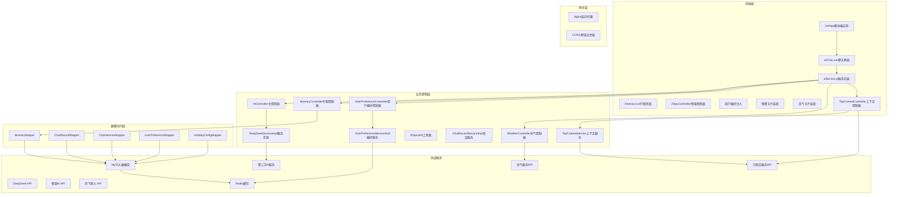
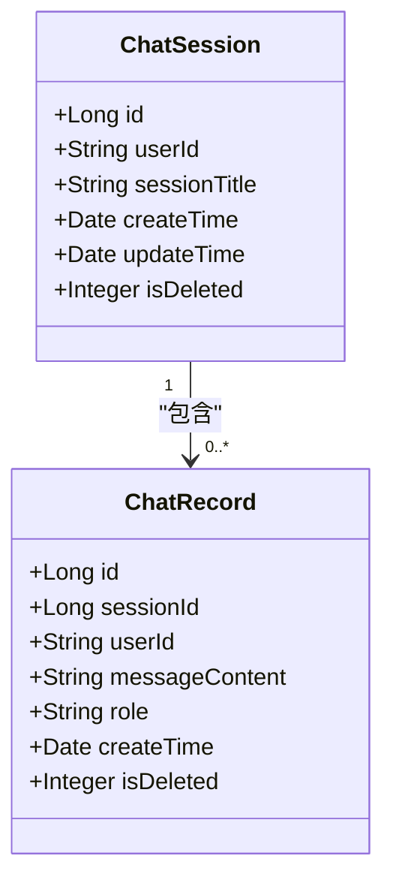
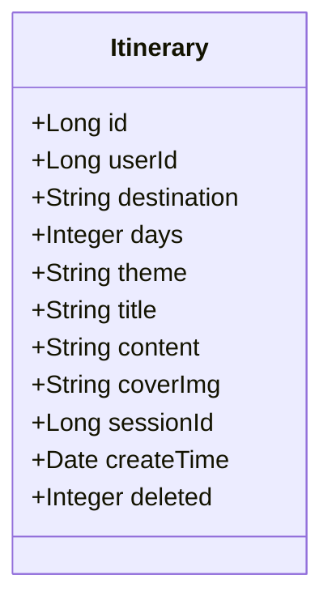
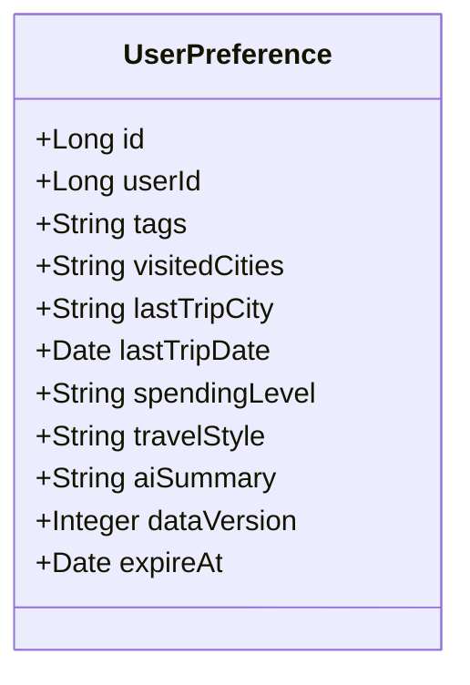
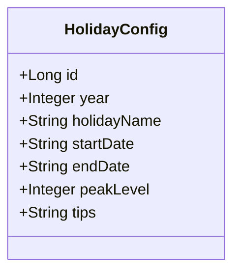
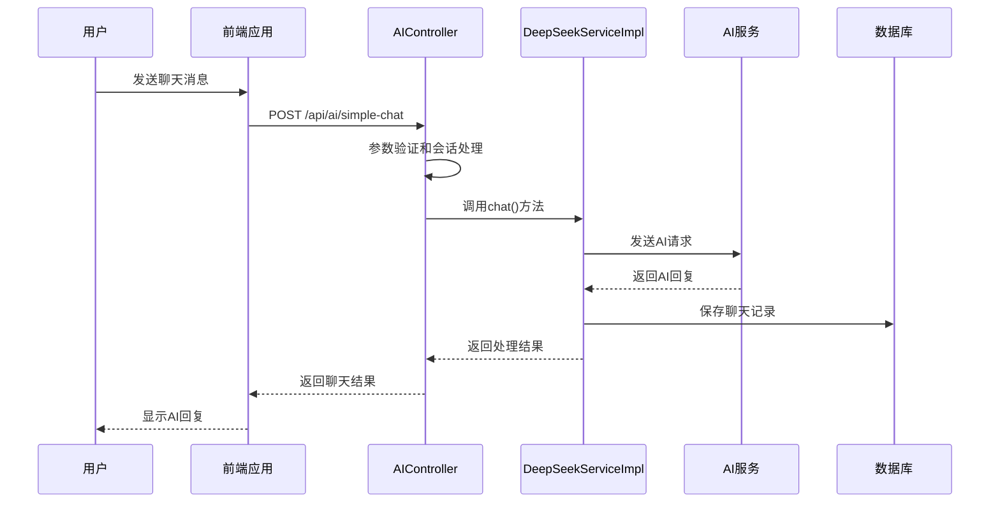
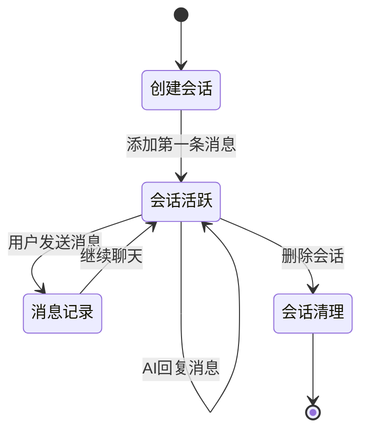
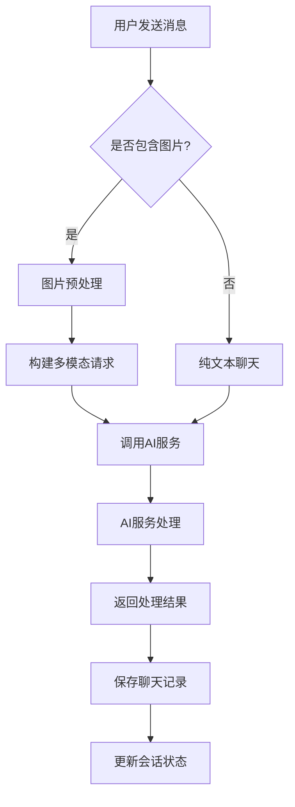
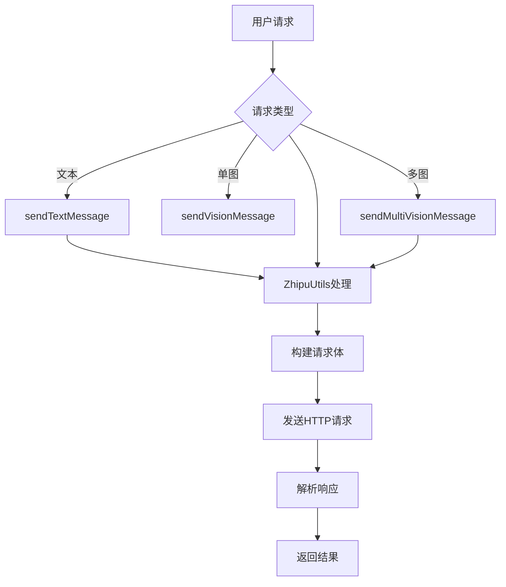
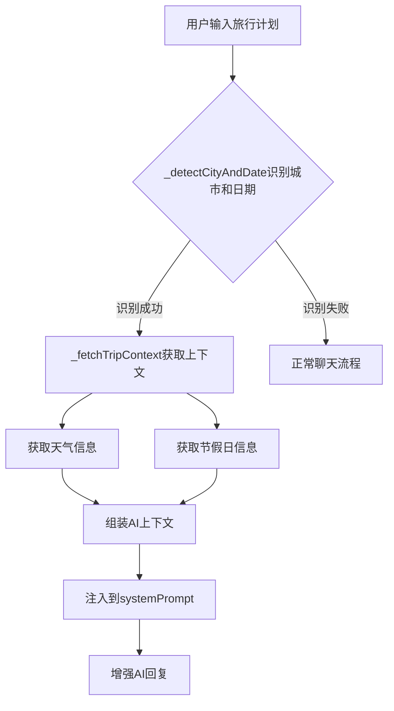

# AI聊天系统

<cite>
**本文档引用的文件**
- [AIController.java](file://springboot-travel-social/src/main/java/com/cxx/controller/AIController.java)
- [ZhipuController.java](file://springboot-travel-social/src/main/java/com/cxx/controller/ZhipuController.java)
- [ItineraryController.java](file://springboot-travel-social/src/main/java/com/cxx/controller/ItineraryController.java)
- [UserPreferenceController.java](file://springboot-travel-social/src/main/java/com/cxx/controller/UserPreferenceController.java)
- [WeatherController.java](file://springboot-travel-social/src/main/java/com/cxx/controller/WeatherController.java)
- [DeepSeekService.java](file://springboot-travel-social/src/main/java/com/cxx/service/DeepSeekService.java)
- [DeepSeekServiceImpl.java](file://springboot-travel-social/src/main/java/com/cxx/service/impl/DeepSeekServiceImpl.java)
- [UserPreferenceService.java](file://springboot-travel-social/src/main/java/com/cxx/service/UserPreferenceService.java)
- [UserPreferenceServiceImpl.java](file://springboot-travel-social/src/main/java/com/cxx/service/impl/UserPreferenceServiceImpl.java)
- [ChatRequest.java](file://springboot-travel-social/src/main/java/com/cxx/dto/ChatRequest.java)
- [ChatResponse.java](file://springboot-travel-social/src/main/java/com/cxx/dto/ChatResponse.java)
- [Itinerary.java](file://springboot-travel-social/src/main/java/com/cxx/entity/Itinerary.java)
- [ZhipuUtils.java](file://springboot-travel-social/src/main/java/com/cxx/utils/ZhipuUtils.java)
- [aiChat.vue](file://uniapp-travel-social/homePages/aiChat/aiChat.vue)
- [aiService.js](file://uniapp-travel-social/services/aiService.js)
- [itinerary.vue](file://uniapp-travel-social/homePages/itinerary/itinerary.vue)
- [方案③-天气节假日感知.md](file://方案③-天气节假日感知.md)
</cite>

## 更新摘要
**所做更改**
- **新增天气节假日感知功能**：集成TripContextController实现城市/日期识别、天气和节假日信息注入
- **增强智能上下文处理**：在前端aiChat.vue中实现完整的TripContext流程，包括城市/日期识别、静默拉取、上下文注入
- **完善行程规划系统**：新增完整的行程管理API和前端界面，支持行程生成、保存、查看功能
- **强化用户偏好注入**：优化UserPreferenceServiceImpl的偏好计算逻辑，支持异步刷新和快照管理
- **扩展多模态AI能力**：新增ZhipuController和ZhipuUtils实现智谱AI的多模态对话功能
- **增强预算卡片系统**：完善预算计算逻辑，支持全国均值降级处理和响应式更新
- **优化天气卡片功能**：集成完整的WeatherController和天气服务API

## 目录
1. [项目概述](#项目概述)
2. [系统架构](#系统架构)
3. [核心组件](#核心组件)
4. [AI聊天功能详解](#ai聊天功能详解)
5. [会话管理系统](#会话管理系统)
6. [多模态AI集成](#多模态ai集成)
7. [智谱AI多模态服务](#智谱ai多模态服务)
8. [用户偏好注入系统](#用户偏好注入系统)
9. [预算卡片智能系统](#预算卡片智能系统)
10. [天气节假日感知系统](#天气节假日感知系统)
11. [行程管理系统](#行程管理系统)
12. [前端交互设计](#前端交互设计)
13. [API接口规范](#api接口规范)
14. [性能优化策略](#性能优化策略)
15. [故障排除指南](#故障排除指南)
16. [总结](#总结)

## 项目概述

AI聊天系统是一个基于Spring Boot和UniApp开发的智能旅游助手平台，集成了多种AI大模型服务，为用户提供全方位的旅行规划和咨询服务。该系统支持文本聊天、语音识别、图片识别、行程规划等多种功能，旨在为用户提供智能化的旅行体验。

### 主要特性
- **多AI模型支持**：集成DeepSeek、智谱AI、讯飞星火等多家AI服务商
- **多模态交互**：支持文本、语音、图片等多种输入方式
- **智能行程规划**：基于用户需求自动生成详细旅行计划
- **会话持久化**：完整的聊天记录存储和管理
- **实时消息推送**：基于WebSocket的实时通信能力
- **独立AI服务接口**：提供标准化的AI服务调用接口
- **多模态AI服务能力**：支持图文混合的智能对话
- **增强的前端交互**：丰富的UI组件和流畅的用户体验
- **智能行程生成**：支持JSON格式的结构化行程输出
- **智能聊天上下文**：自动识别旅行相关信息，提升用户体验
- **新增AI控制器**：专门处理智谱AI多模态对话
- **新增行程管理**：完整的行程CRUD操作
- **新增行程预填**：从聊天上下文自动提取行程参数
- **新增查看行程**：支持直接跳转到行程页面进行管理
- **新增用户偏好注入**：智能注入用户旅行偏好信息
- **新增预算卡片**：实时预算计算和可视化展示
- **新增天气卡片**：集成天气服务和卡片展示
- **增强智能上下文处理**：支持预算和天气信息的自动识别
- **新增天气节假日感知**：智能识别城市/日期并注入实时上下文

## 系统架构



**架构图来源**
- [AIController.java:19-23](file://springboot-travel-social/src/main/java/com/cxx/controller/AIController.java#L19-L23)
- [ItineraryController.java:16-23](file://springboot-travel-social/src/main/java/com/cxx/controller/ItineraryController.java#L16-L23)
- [UserPreferenceController.java:16-21](file://springboot-travel-social/src/main/java/com/cxx/controller/UserPreferenceController.java#L16-L21)
- [WeatherController.java:19-22](file://springboot-travel-social/src/main/java/com/cxx/controller/WeatherController.java#L19-L22)
- [方案③-天气节假日感知.md:186-188](file://方案③-天气节假日感知.md#L186-L188)

## 核心组件

### 控制器层

系统采用分层架构设计，主要控制器包括：

#### AIController - 主要聊天控制器
负责处理所有AI相关的聊天请求，提供多种聊天模式：
- 简单聊天接口（带用户ID和会话ID）
- 通用聊天接口（支持系统提示词）
- 智能行程生成功能
- 语音识别功能
- 会话管理功能
- 多模态聊天功能
- **RAG增强聊天功能**：集成平台游记经验提升回复可信度

#### ZhipuController - 智谱AI控制器
**新增** 专门处理智谱AI的多模态对话：
- 纯文本对话接口
- 单图图文对话接口
- 多图图文对话接口
- 测试接口

#### ItineraryController - 行程管理控制器
**新增** 专门处理行程相关的业务逻辑：
- 保存行程到数据库
- 获取用户行程列表
- 获取行程详情
- 删除行程记录

#### UserPreferenceController - 用户偏好控制器
**新增** 专门处理用户旅行偏好的智能注入：
- 获取用户偏好快照
- 触发偏好快照刷新
- 支持强制刷新机制

#### WeatherController - 天气服务控制器
**新增** 专门处理天气相关的查询服务：
- 实时天气查询
- 天气预警查询
- 未来天气预报
- 城市搜索功能

#### TripContextController - 天气节假日上下文控制器
**新增** 专门处理旅行上下文信息的智能注入：
- 城市/日期识别
- 天气信息获取
- 节假日信息获取
- AI上下文组装

**章节来源**
- [AIController.java:23-610](file://springboot-travel-social/src/main/java/com/cxx/controller/AIController.java#L23-L610)
- [ZhipuController.java:17-97](file://springboot-travel-social/src/main/java/com/cxx/controller/ZhipuController.java#L17-L97)
- [ItineraryController.java:16-123](file://springboot-travel-social/src/main/java/com/cxx/controller/ItineraryController.java#L16-L123)
- [UserPreferenceController.java:16-56](file://springboot-travel-social/src/main/java/com/cxx/controller/UserPreferenceController.java#L16-L56)
- [WeatherController.java:19-87](file://springboot-travel-social/src/main/java/com/cxx/controller/WeatherController.java#L19-L87)

### 服务层

#### DeepSeekServiceImpl - AI服务实现
实现了DeepSeekService接口，提供多种聊天模式：
- 同步聊天方法
- 异步聊天方法  
- 带参数的聊天方法
- API状态检查
- **RAG增强功能**：集成平台游记经验提升回复质量
- **增强的错误处理和日志记录**

#### UserPreferenceServiceImpl - 用户偏好服务实现
**新增** 实现用户旅行偏好的智能计算和注入：
- 用户偏好快照获取
- 偏好标签计算
- 消费水平分析
- 偏好摘要生成
- 快照过期管理
- **异步刷新机制**：支持标记待刷新后延迟更新

#### ChatRecordServiceImpl - 会话记录服务
负责会话和聊天记录的持久化管理：
- 会话创建和查询
- 聊天记录的增删改查
- 会话级联删除

#### TripContextService - 旅行上下文服务
**新增** 实现旅行上下文信息的智能处理：
- 城市/日期识别
- 天气信息获取
- 节假日信息获取
- AI上下文组装

**章节来源**
- [DeepSeekServiceImpl.java:25-324](file://springboot-travel-social/src/main/java/com/cxx/service/impl/DeepSeekServiceImpl.java#L25-L324)
- [UserPreferenceServiceImpl.java:24-227](file://springboot-travel-social/src/main/java/com/cxx/service/impl/UserPreferenceServiceImpl.java#L24-L227)

### 数据模型层

#### ChatSession - 会话实体


#### Itinerary - 行程实体
**新增** 行程数据模型：


#### UserPreference - 用户偏好实体
**新增** 用户偏好数据模型：


#### HolidayConfig - 节假日配置实体
**新增** 节假日数据模型：


**图表来源**
- [ChatSession.java:10-44](file://springboot-travel-social/src/main/java/com/cxx/entity/ChatSession.java#L10-L44)
- [ChatRecord.java:10-48](file://springboot-travel-social/src/main/java/com/cxx/entity/ChatRecord.java#L10-L48)
- [Itinerary.java:13-65](file://springboot-travel-social/src/main/java/com/cxx/entity/Itinerary.java#L13-L65)
- [UserPreference.java](file://springboot-travel-social/src/main/java/com/cxx/entity/UserPreference.java)

**章节来源**
- [Itinerary.java:13-65](file://springboot-travel-social/src/main/java/com/cxx/entity/Itinerary.java#L13-L65)
- [UserPreferenceServiceImpl.java:147-177](file://springboot-travel-social/src/main/java/com/cxx/service/impl/UserPreferenceServiceImpl.java#L147-L177)

## AI聊天功能详解

### 聊天模式分类

系统提供六种主要的聊天模式：

#### 1. 简单聊天模式
适用于基础的问答场景，自动创建会话并保存聊天记录。

#### 2. 通用聊天模式  
支持自定义系统提示词，提供更精确的AI行为控制。

#### 3. 多模态聊天模式
支持图片和文本的组合输入，实现视觉问答功能。

#### 4. 智能行程规划模式
**新增** 专门的行程规划功能，支持目的地、天数、主题、预算等参数配置。

#### 5. RAG增强聊天模式
**新增** 基于平台游记经验的增强聊天，提升回复可信度。

#### 6. 语音识别模式
**部分实现** 支持语音转文字功能（需要配置讯飞SDK）。

### 聊天流程



**图表来源**
- [AIController.java:33-130](file://springboot-travel-social/src/main/java/com/cxx/controller/AIController.java#L33-L130)
- [DeepSeekServiceImpl.java:62-111](file://springboot-travel-social/src/main/java/com/cxx/service/impl/DeepSeekServiceImpl.java#L62-L111)

### 智能行程规划

系统提供专门的行程规划功能，支持：
- 目的地自定义
- 旅行天数配置
- 旅行主题选择
- 预算范围设定
- 其他特殊要求

**新增** 一键生成行程功能：
- 从聊天上下文中提取关键信息
- 自动填充行程参数
- 直接跳转到行程页面
- 支持JSON格式的结构化行程输出

**新增** 智能聊天上下文提取：
- 自动识别旅行天数（支持中文数字和阿拉伯数字）
- 自动提取目的地信息
- 智能识别酒店偏好
- 自动提取旅行主题（海边度假、美食打卡等）
- 记录最近的AI回复内容

**新增** 查看行程功能：
- 聊天界面右上角新增"行程"按钮
- 支持直接跳转到行程页面
- 自动预填行程参数
- 提供完整的行程管理功能

**新增** 智能预算和天气注入：
- 自动识别预算查询意图
- 实时获取预算计算结果
- 自动识别天气查询需求
- 提供实时天气信息卡片
- 智能注入到AI上下文中

**新增** RAG增强功能：
- 检索平台游记经验
- 将真实用户经验拼入systemPrompt
- 提升AI回复可信度和实用性

**章节来源**
- [AIController.java:412-465](file://springboot-travel-social/src/main/java/com/cxx/controller/AIController.java#L412-L465)
- [aiChat.vue:527-538](file://uniapp-travel-social/homePages/aiChat/aiChat.vue#L527-L538)
- [aiChat.vue:649-676](file://uniapp-travel-social/homePages/aiChat/aiChat.vue#L649-L676)

## 会话管理系统

### 会话生命周期



### 会话管理功能

| 功能 | 接口 | 描述 |
|------|------|------|
| 创建会话 | POST /api/ai/create-session | 根据用户ID和标题创建新会话 |
| 获取会话列表 | GET /api/ai/sessions/{userId} | 查询用户的所有会话记录 |
| 获取消息记录 | GET /api/ai/records/{sessionId} | 获取指定会话的所有消息 |
| 删除会话 | DELETE /api/ai/session/{sessionId}/{userId} | 删除会话及其所有消息 |
| 清空消息 | DELETE /api/ai/records/{sessionId}/{userId} | 清空会话中的所有消息 |
| 重命名会话 | PUT /api/ai/session/{sessionId}/rename | 重命名会话标题 |
| 生成行程 | POST /api/ai/generate-itinerary | 智能行程规划 |
| 语音识别 | POST /api/ai/voice2text | 语音转文字 |
| 获取用户偏好 | GET /user/preference/{userId} | 获取用户旅行偏好快照 |
| 刷新用户偏好 | POST /user/preference/refresh/{userId} | 触发偏好快照刷新 |
| 实时天气查询 | GET /api/weather/realtime | 获取实时天气 |
| 天气预警查询 | GET /api/weather/warning | 获取天气预警 |
| 未来天气预报 | GET /api/weather/forecast | 获取未来7天天气预报 |
| 城市搜索 | GET /api/weather/search | 搜索城市 |
| 获取TripContext | GET /trip/context | 获取旅行上下文信息 |
| 生成行程 | POST /itinerary/save | 保存行程到数据库 |
| 获取行程列表 | GET /itinerary/list/{userId} | 查询用户行程列表 |
| 获取行程详情 | GET /itinerary/detail/{id} | 获取行程详情 |
| 删除行程 | DELETE /itinerary/delete/{id} | 删除行程记录 |

**章节来源**
- [AIController.java:262-404](file://springboot-travel-social/src/main/java/com/cxx/controller/AIController.java#L262-L404)
- [UserPreferenceController.java:31-54](file://springboot-travel-social/src/main/java/com/cxx/controller/UserPreferenceController.java#L31-L54)
- [WeatherController.java:32-84](file://springboot-travel-social/src/main/java/com/cxx/controller/WeatherController.java#L32-L84)

## 多模态AI集成

### 支持的AI服务提供商

系统集成了多家AI服务提供商，每种都有其特色功能：

#### DeepSeek AI
- **特点**：高性能对话模型
- **适用场景**：通用聊天、旅行咨询
- **配置参数**：温度系数、最大令牌数

#### 智谱AI (Zhipu AI)
- **特点**：多模态对话能力
- **适用场景**：图文识别、视觉问答
- **功能**：支持单图、多图混合输入

#### 讯飞星火 (XingHuo AI)
- **特点**：中文语境优化
- **适用场景**：中文对话、本地化服务
- **版本**：支持多个API版本

### 多模态聊天实现



**图表来源**
- [aiService.js:267-290](file://uniapp-travel-social/services/aiService.js#L267-L290)

## 智谱AI多模态服务

### 新增智谱AI控制器

系统新增了专门的ZhipuController，提供完整的多模态AI服务接口：

#### 控制器功能
- **纯文本对话**：支持标准文本聊天
- **单图图文对话**：支持图片+文本的混合输入
- **多图图文对话**：支持多张图片+文本的复杂输入
- **测试接口**：提供简单的GET测试接口

#### 多模态对话实现



**图表来源**
- [ZhipuController.java:29-67](file://springboot-travel-social/src/main/java/com/cxx/controller/ZhipuController.java#L29-L67)

### 智谱AI配置管理

#### 配置参数说明
- **API Key**：用于身份认证的密钥
- **Base URL**：API服务的基础URL
- **Model**：使用的AI模型版本

#### 配置示例
```properties
zhipu.api.key=3cc25c88dafc4bec8562efaf668254c9.Uz2dLpqq3vYTLxwn
zhipu.api.base-url=https://open.bigmodel.cn/api/paas/v4
zhipu.api.model=glm-4.6v-flash
```

**章节来源**
- [ZhipuController.java:17-97](file://springboot-travel-social/src/main/java/com/cxx/controller/ZhipuController.java#L17-L97)

## 用户偏好注入系统

### 用户偏好计算逻辑

系统新增了完整的用户偏好注入功能，通过分析用户的历史行为来生成个性化的旅行偏好摘要：

#### 偏好分析维度

**1. 博客内容分析**
- 游历地点统计和海边城市识别
- 博客标签高频词提取
- 点赞博客标签分析

**2. 住宿偏好分析**
- 酒店城市分布统计
- 高星酒店比例分析
- 亲子/团队偏好识别

**3. 消费水平分析**
- 订单平均价格计算
- 消费档次分级（低/中/高/奢华）
- 美食偏好识别

**4. 最近出行分析**
- 最近一次出行城市
- 出行时间统计

### 偏好摘要生成

系统将分析结果组装为AI可理解的摘要字符串：
```
用户旅行偏好：喜欢海边、美食、亲子/团队；消费档次偏中等；曾去过三亚、厦门、青岛；最近一次出行是三亚（2024年1月）。  
```

### 快照管理机制

- **快照有效期**：7天
- **自动刷新**：过期自动重新计算
- **手动刷新**：支持强制刷新
- **异步更新**：标记待刷新后延迟更新

**章节来源**
- [UserPreferenceServiceImpl.java:66-177](file://springboot-travel-social/src/main/java/com/cxx/service/impl/UserPreferenceServiceImpl.java#L66-L177)
- [UserPreferenceController.java:31-54](file://springboot-travel-social/src/main/java/com/cxx/controller/UserPreferenceController.java#L31-L54)

## 预算卡片智能系统

### 预算意图识别

系统能够智能识别用户关于预算查询的意图：

#### 触发关键词
- "预算" / "花多少钱" / "费用" / "多少钱"
- "要花" / "报价" / "价格" / "贵不贵" / "便宜吗"

#### 关键信息提取
- **城市识别**：与天气模块共享城市识别逻辑
- **天数提取**：正则匹配 `(\d+)[天日]`
- **人数提取**：正则匹配 `(\d+)[人口]`，默认2人

### 预算计算逻辑

系统根据真实数据库数据进行精准预算计算：

#### 1. 景点门票费用
- 查询目标城市主要景点
- 解析price字段（"免费"计0）
- 票价合计 × 人数 × 天数

#### 2. 酒店住宿费用
- 按星级过滤（情侣主题取3星均价）
- 价格均值 × (天数-1晚) × 主题系数

#### 3. 餐饮费用
- 价格均值作为参考
- 人均每天 = max(食物均价, 80) × 主题系数
- 餐饮合计 = 人均每天 × 天数 × 人数

#### 4. 交通费用
- 查询对应交通方式价格区间均值
- 乘以人数

#### 5. 总费用计算
- 总计 = 景点 + 酒店 + 餐饮 + 交通
- 杂费 = 总计 × 杂费系数
- 最终总计 = 总计 + 杂费

### 预算卡片展示

#### 卡片组件结构
- **标题行**：城市 + 天数 + 人数（含修改按钮）
- **总价显示**：大字展示总费用 + 人均费用
- **分类条形图**：5个分类各占一行
- **省钱建议**：2-3条tip文字
- **重新计算按钮**：支持人数/天数调整

#### 分类费用条形图实现
使用纯CSS实现，无需图表库：
```html
<view class="budget-bar-item">
  <text class="budget-bar-label">景点门票</text>
  <view class="budget-bar-track">
    <view class="budget-bar-fill" :style="{ width: (item.total/total*100)+'%' }"></view>
  </view>
  <text class="budget-bar-amount">¥{{ item.totalYuan }}</text>
</view>
```

### 降级处理机制

当数据库中缺少城市数据时：
- 使用全国均值数据（景点80元/人、酒店300元/晚、餐饮120元/人/天）
- 在aiSummary中标注"因本平台该城市数据有限，以下为全国均值估算"

### 预算卡片刷新策略

- **原地刷新**：重新计算时不新增消息
- **响应式更新**：通过Vue直接修改msgList对应消息的budget字段
- **自动滚动**：更新后平滑滚动到卡片位置

**章节来源**
- [方案⑥-预算智能拆解.md:233-325](file://方案⑥-预算智能拆解.md#L233-L325)
- [aiChat.vue:431-441](file://uniapp-travel-social/homePages/aiChat/aiChat.vue#L431-L441)

## 天气节假日感知系统

### 天气节假日感知功能

系统集成了完整的天气节假日感知功能，能够智能识别用户输入中的城市和出行日期，并自动注入相关的实时信息：

#### 核心功能流程



#### 城市/日期识别策略
- **简单策略**：维护高频城市词典（省会+热门旅游城市约200个）
- **精准策略**：调用天气搜索API进行精确识别
- **口语化日期转换**：支持"五一"、"国庆"、"明天"、"下周"等表达

#### 上下文信息组成
- **天气信息**：当前天气、未来几天预报、天气预警
- **节假日信息**：是否节假日、高峰期等级、出行建议
- **AI上下文摘要**：自然语言形式的上下文摘要

### TripContextController实现

#### 控制器功能
- **城市/日期识别**：从用户输入中提取城市名和出行日期
- **上下文获取**：调用天气和节假日服务获取相关信息
- **AI上下文组装**：将获取的信息组装为AI可理解的上下文
- **响应格式化**：返回标准化的上下文数据结构

#### 上下文数据结构
```json
{
  "city": "三亚",
  "startDate": "2025-05-01",
  "days": 3,
  "weather": {
    "current": { "temp": 32, "condition": "晴", "wind": "东南风3级" },
    "forecast": [
      { "date": "2025-05-01", "high": 33, "low": 27, "condition": "晴" },
      { "date": "2025-05-02", "high": 32, "low": 26, "condition": "多云" },
      { "date": "2025-05-03", "high": 30, "low": 25, "condition": "阵雨" }
    ],
    "hasWarning": false,
    "warningText": null
  },
  "holiday": {
    "isPeakSeason": true,
    "totalHolidayDays": 3,
    "peakLevel": 3,
    "tips": ["景区限流，建议提前预约门票", "酒店价格普遍上涨30%-50%", "建议避开早晚高峰出行"]
  },
  "aiContext": "出行时间：2025-05-01至05-03，城市：三亚。天气：以晴为主，最高33℃，第3天有阵雨。节假日：五一黄金周，出行高峰等级3级，景区限流，酒店价格偏高。"
}
```

### 前端集成实现

#### 城市/日期识别方法
- **_detectCityAndDate(text)**：从用户输入中提取城市名和日期
- **支持的日期格式**：节日名称、相对日期、绝对日期
- **正则匹配**：支持多种日期表达方式

#### 静默拉取机制
- **触发条件**：同时识别到城市和日期
- **缓存策略**：同一会话中相同城市和日期只拉取一次
- **失败处理**：静默忽略，不影响正常聊天

#### AI上下文注入
- **systemPrompt拼接**：将aiContext直接拼接到systemPrompt
- **自然语言摘要**：后端预生成的自然语言摘要
- **增强AI回复**：AI据此提供更精准的建议

**章节来源**
- [方案③-天气节假日感知.md:155-182](file://方案③-天气节假日感知.md#L155-L182)
- [方案③-天气节假日感知.md:192-233](file://方案③-天气节假日感知.md#L192-L233)

## 行程管理系统

### 行程数据模型

系统新增了完整的行程管理功能，包括数据模型、业务逻辑和前端界面：

#### 行程实体结构
- **基础信息**：目的地、天数、主题、预算、出行人数
- **内容存储**：完整的行程内容（JSON格式）
- **封面图**：行程封面图片URL
- **关联会话**：与AI对话的关联关系
- **时间戳**：创建时间、逻辑删除标识

### 行程管理功能

#### 后端API接口
- **保存行程**：POST /itinerary/save
- **获取行程列表**：GET /itinerary/list/{userId}
- **获取行程详情**：GET /itinerary/detail/{id}
- **删除行程**：DELETE /itinerary/delete/{id}

#### 前端功能特性
- **智能预填**：从聊天上下文自动填充行程参数
- **行程生成**：支持JSON格式的结构化行程输出
- **历史管理**：提供行程历史记录的查看和管理
- **保存功能**：支持行程的云端保存和本地备份

**章节来源**
- [Itinerary.java:13-65](file://springboot-travel-social/src/main/java/com/cxx/entity/Itinerary.java#L13-L65)
- [ItineraryController.java:27-123](file://springboot-travel-social/src/main/java/com/cxx/controller/ItineraryController.java#L27-L123)

## 前端交互设计

### 聊天界面组件

前端采用Vue.js框架开发，主要组件包括：

#### aiChat.vue - 主聊天界面
- **欢迎屏幕**：展示AI助手介绍和快捷问题
- **消息列表**：支持多种消息类型（文本、图片、卡片、地图）
- **输入区域**：支持文本输入、图片上传、语音录制
- **操作面板**：复制、重试、生成行程等功能
- **打字动画**：实时显示AI回复进度
- **快捷问题**：提供热门问题卡片
- **语音录制浮层**：支持长按录音和倒计时显示
- **图片预览条**：支持多张图片上传和删除
- **智能选项按钮**：动态生成操作选项和快捷功能
- **增强的多模态交互**：支持图片+文本的混合输入
- **改进的语音识别**：支持长按录音和语音转文字
- **新增生成行程按钮**：支持从聊天内容一键生成行程
- **新增查看行程按钮**：支持直接跳转到行程页面
- **行程预填功能**：自动从聊天上下文中提取行程参数
- **智能聊天上下文**：自动提取目的地、天数、主题等关键信息
- **新增预算卡片**：智能识别预算意图并展示预算卡片
- **新增天气卡片**：自动识别天气查询并展示天气信息
- **新增用户偏好注入**：智能注入用户旅行偏好摘要
- **新增TripContext集成**：智能识别城市/日期并注入实时上下文

#### aiService.js - 服务封装
提供统一的API调用接口，包含：
- 参数验证和错误处理
- 会话管理和状态维护
- 多模态功能支持

### 用户体验设计

| 功能特性 | 实现方式 | 用户价值 |
|----------|----------|----------|
| 实时打字效果 | CSS动画和状态管理 | 提升交互真实感 |
| 消息长按操作 | 微信式手势支持 | 方便消息管理 |
| 图片预览 | uni.previewImage组件 | 改善图片浏览体验 |
| 语音识别 | RecorderManager封装 | 支持语音输入 |
| 行程生成 | 一键触发AI规划 | 提供智能行程建议 |
| 选项按钮 | 动态生成操作选项 | 提供便捷的操作入口 |
| 地图展示 | uni.map组件 | 直观显示地理位置信息 |
| 卡片列表 | 动态加载景点/酒店信息 | 提供丰富的旅游信息 |
| 语音录制 | 长按录音和倒计时 | 支持语音输入功能 |
| 图片上传 | 多图选择和预览 | 支持图片分享功能 |
| 会话管理 | 自动创建和维护 | 保持聊天连续性 |
| 多模态交互 | 图片+文本混合输入 | 提供更丰富的交互方式 |
| 生成行程按钮 | 智能提取聊天上下文 | 快速生成个性化行程 |
| 行程预填机制 | 自动填充行程参数 | 减少用户输入工作量 |
| 智能上下文提取 | 自动识别旅行相关信息 | 提升行程规划准确性 |
| 智能行程生成 | 基于聊天内容生成JSON | 提供结构化行程输出 |
| 查看行程功能 | 右上角行程按钮 | 直接跳转到行程页面 |
| 智能预算识别 | 自动识别预算查询意图 | 提供精准预算参考 |
| 预算卡片展示 | 可视化预算分解 | 直观展示费用构成 |
| 预算重新计算 | 人数/天数动态调整 | 支持个性化预算调整 |
| 天气卡片展示 | 实时天气信息 | 提供准确天气参考 |
| 用户偏好注入 | 智能旅行偏好摘要 | 提升AI个性化程度 |
| TripContext集成 | 城市/日期识别 | 提供实时旅行上下文 |
| 节假日感知 | 自动识别节假日 | 提供出行风险提醒 |

**章节来源**
- [aiChat.vue:310-754](file://uniapp-travel-social/homePages/aiChat/aiChat.vue#L310-L754)
- [aiService.js:52-85](file://uniapp-travel-social/services/aiService.js#L52-L85)

## API接口规范

### 核心API接口

#### 聊天相关接口

| 接口 | 方法 | 路径 | 功能描述 |
|------|------|------|----------|
| 简单聊天 | POST | /api/ai/simple-chat | 基础聊天功能 |
| 通用聊天 | POST | /api/ai/chat | 支持系统提示词 |
| 检查状态 | GET | /api/ai/status | 检查AI服务状态 |
| 创建会话 | POST | /api/ai/create-session | 创建新会话 |
| 获取会话列表 | GET | /api/ai/sessions/{userId} | 查询用户会话 |
| 获取消息记录 | GET | /api/ai/records/{sessionId} | 查询会话消息 |
| 删除会话 | DELETE | /api/ai/session/{sessionId}/{userId} | 删除会话 |
| 清空消息 | DELETE | /api/ai/records/{sessionId}/{userId} | 清空会话消息 |
| 生成行程 | POST | /api/ai/generate-itinerary | 智能行程规划 |
| 语音识别 | POST | /api/ai/voice2text | 语音转文字 |
| RAG聊天 | POST | /api/ai/rag-chat | 增强聊天功能 |

#### 智谱AI多模态接口

| 接口 | 方法 | 路径 | 功能描述 |
|------|------|------|----------|
| 纯文本对话 | POST | /zhipu/chat | 智谱AI纯文本聊天 |
| 单图图文对话 | POST | /zhipu/vision | 单图+文本对话 |
| 多图图文对话 | POST | /zhipu/multi-vision | 多图+文本对话 |
| 测试接口 | GET | /zhipu/test/{text} | 简单测试接口 |

#### 行程管理接口

**新增** 行程相关的API接口：

| 接口 | 方法 | 路径 | 功能描述 |
|------|------|------|----------|
| 保存行程 | POST | /itinerary/save | 保存用户行程 |
| 获取行程列表 | GET | /itinerary/list/{userId} | 查询用户行程 |
| 获取行程详情 | GET | /itinerary/detail/{id} | 查询行程详情 |
| 删除行程 | DELETE | /itinerary/delete/{id} | 删除行程记录 |

#### 用户偏好接口

**新增** 用户偏好相关的API接口：

| 接口 | 方法 | 路径 | 功能描述 |
|------|------|------|----------|
| 获取偏好 | GET | /user/preference/{userId} | 获取用户旅行偏好快照 |
| 刷新偏好 | POST | /user/preference/refresh/{userId} | 触发偏好快照刷新 |

#### 天气服务接口

**新增** 天气服务相关的API接口：

| 接口 | 方法 | 路径 | 功能描述 |
|------|------|------|----------|
| 实时天气 | GET | /api/weather/realtime | 获取实时天气 |
| 天气预警 | GET | /api/weather/warning | 获取天气预警 |
| 未来预报 | GET | /api/weather/forecast | 获取未来7天天气预报 |
| 城市搜索 | GET | /api/weather/search | 搜索城市 |

#### TripContext接口

**新增** 旅行上下文相关的API接口：

| 接口 | 方法 | 路径 | 功能描述 |
|------|------|------|----------|
| 获取TripContext | GET | /trip/context | 获取旅行上下文信息 |

### 请求参数规范

#### 简单聊天请求参数
```json
{
  "userId": "string",
  "sessionId": "string",
  "message": "string"
}
```

#### 通用聊天请求参数
```json
{
  "userId": "string", 
  "sessionId": "string",
  "systemPrompt": "string",
  "message": "string"
}
```

#### 行程规划请求参数
```json
{
  "userId": "string",
  "sessionId": "string",
  "destination": "string",
  "days": "string",
  "theme": "string",
  "budget": "string",
  "extra": "string"
}
```

#### 智谱AI文本请求参数
```json
{
  "text": "string"
}
```

#### 智谱AI单图请求参数
```json
{
  "text": "string",
  "imageUrl": "string"
}
```

#### 智谱AI多图请求参数
```json
{
  "text": "string",
  "imageUrls": ["string"]
}
```

#### 用户偏好请求参数
```json
{
  "userId": "string",
  "refresh": "boolean"
}
```

#### 天气查询请求参数
```json
{
  "location": "string",
  "adm": "string",
  "range": "string",
  "number": "integer",
  "lang": "string"
}
```

#### TripContext请求参数
```json
{
  "city": "string",
  "startDate": "string",
  "days": "integer"
}
```

### 响应数据格式

所有API接口遵循统一的响应格式：
```json
{
  "success": true,
  "data": {},
  "error": "",
  "timestamp": 1640995200000
}
```

**章节来源**
- [AIController.java:33-610](file://springboot-travel-social/src/main/java/com/cxx/controller/AIController.java#L33-L610)
- [ZhipuController.java:29-97](file://springboot-travel-social/src/main/java/com/cxx/controller/ZhipuController.java#L29-L97)
- [ItineraryController.java:27-123](file://springboot-travel-social/src/main/java/com/cxx/controller/ItineraryController.java#L27-L123)
- [UserPreferenceController.java:31-54](file://springboot-travel-social/src/main/java/com/cxx/controller/UserPreferenceController.java#L31-L54)
- [WeatherController.java:32-84](file://springboot-travel-social/src/main/java/com/cxx/controller/WeatherController.java#L32-L84)

## 性能优化策略

### 后端性能优化

#### 线程池管理
- 使用固定大小的线程池处理异步请求
- 配置合理的线程数量避免资源浪费
- 提供优雅的资源清理机制

#### 缓存策略
- Redis缓存热点数据
- 会话状态缓存
- 频繁查询结果缓存
- **用户偏好快照缓存**：7天有效期缓存
- **TripContext缓存**：同一会话内缓存上下文信息

#### 数据库优化
- 逻辑删除避免物理删除
- 合理的索引设计
- 连接池配置优化
- **预算计算结果缓存**：热门城市预算数据缓存
- **节假日配置缓存**：年度节假日配置缓存

### 前端性能优化

#### 资源加载优化
- 图片懒加载
- 组件按需加载
- CDN资源加速
- **预算卡片组件缓存**：避免重复渲染
- **TripContext结果缓存**：避免重复请求

#### 交互性能优化
- 虚拟滚动列表
- 防抖节流处理
- 内存泄漏防护
- **智能防抖**：预算和天气查询防抖处理
- **异步加载**：用户偏好和TripContext异步加载

## 故障排除指南

### 常见问题及解决方案

#### AI服务连接失败
**症状**：API调用返回"请求失败"
**原因**：
- API密钥配置错误
- 网络连接不稳定
- 服务端限流

**解决方案**：
1. 检查application.properties中的API配置
2. 验证网络连接状态
3. 查看服务端日志获取详细错误信息

#### 会话数据异常
**症状**：会话列表显示异常或消息丢失
**原因**：
- 数据库连接问题
- 事务处理异常
- 逻辑删除状态错误

**解决方案**：
1. 检查数据库连接配置
2. 验证事务管理配置
3. 执行数据一致性检查

#### 前端交互问题
**症状**：聊天界面响应缓慢或功能异常
**原因**：
- 内存泄漏
- 事件绑定冲突
- 组件状态管理问题

**解决方案**：
1. 使用Vue DevTools检查组件状态
2. 检查内存使用情况
3. 重新初始化有问题的组件

#### 生成行程功能异常
**症状**：点击"生成行程"按钮无响应或报错
**原因**：
- 聊天上下文信息缺失
- 后端AI服务不可用
- 网络连接问题

**解决方案**：
1. 确保已完成至少一次聊天对话
2. 检查AI服务状态接口
3. 验证网络连接稳定性
4. 查看浏览器控制台错误信息

#### 智能上下文提取失败
**症状**：行程预填参数不准确或为空
**原因**：
- 用户输入内容不符合识别规则
- 正则表达式匹配失败
- 字符编码问题

**解决方案**：
1. 检查用户输入的旅行相关信息
2. 验证正则表达式的正确性
3. 确认字符编码格式
4. 查看控制台日志获取详细信息

#### 查看行程功能异常
**症状**：点击"行程"按钮无响应或跳转失败
**原因**：
- 聊天上下文信息提取失败
- 行程页面路由配置错误
- 用户未登录状态

**解决方案**：
1. 确保已完成至少一次聊天对话
2. 检查行程页面路由配置
3. 验证用户登录状态
4. 查看浏览器控制台错误信息

#### 行程保存功能异常
**症状**：点击"保存行程"按钮无响应或保存失败
**原因**：
- 用户未登录
- 后端服务异常
- 网络连接问题

**解决方案**：
1. 确保用户已登录
2. 检查后端服务状态
3. 验证网络连接稳定性
4. 查看浏览器控制台错误信息

#### 用户偏好注入异常
**症状**：用户偏好摘要不准确或为空
**原因**：
- 用户历史数据不足
- 偏好计算逻辑异常
- 数据库查询失败

**解决方案**：
1. 检查用户历史数据完整性
2. 验证偏好计算逻辑
3. 查看数据库查询日志
4. 手动触发偏好刷新

#### 预算卡片功能异常
**症状**：预算卡片显示异常或计算错误
**原因**：
- 城市数据缺失
- 预算计算逻辑异常
- 网络连接问题

**解决方案**：
1. 检查城市数据完整性
2. 验证预算计算逻辑
3. 查看网络连接状态
4. 使用全国均值数据降级处理

#### 天气卡片功能异常
**症状**：天气信息显示异常或查询失败
**原因**：
- 天气服务API不可用
- 城市名称识别错误
- 网络连接问题

**解决方案**：
1. 检查天气服务API状态
2. 验证城市名称格式
3. 查看网络连接状态
4. 使用备用天气数据源

#### TripContext功能异常
**症状**：旅行上下文信息不准确或为空
**原因**：
- 城市/日期识别失败
- 天气或节假日服务异常
- 数据库查询失败

**解决方案**：
1. 检查城市/日期识别逻辑
2. 验证天气和节假日服务状态
3. 查看TripContext计算日志
4. 使用降级策略继续聊天

### 日志监控

系统提供了完善的日志记录机制：
- 请求参数记录
- 错误堆栈跟踪
- 性能指标监控
- 用户行为分析
- **用户偏好计算日志**：记录偏好分析过程
- **预算计算日志**：记录预算分析过程
- **天气查询日志**：记录天气服务调用
- **TripContext日志**：记录上下文处理过程

**章节来源**
- [DeepSeekServiceImpl.java:226-236](file://springboot-travel-social/src/main/java/com/cxx/service/impl/DeepSeekServiceImpl.java#L226-L236)
- [UserPreferenceServiceImpl.java:172-177](file://springboot-travel-social/src/main/java/com/cxx/service/impl/UserPreferenceServiceImpl.java#L172-L177)

## 总结

AI聊天系统通过模块化的架构设计和多层技术栈的有机结合，成功构建了一个功能完备、性能优异的智能旅游助手平台。系统的主要优势包括：

### 技ological亮点
- **多AI模型集成**：支持多家AI服务商，提供灵活的服务选择
- **全栈技术栈**：前后端分离架构，便于维护和扩展
- **丰富的交互方式**：文本、语音、图片多模态输入
- **完善的会话管理**：完整的聊天记录持久化和管理
- **独立AI服务接口**：提供标准化的AI服务调用接口
- **多模态AI能力**：支持图文混合的智能对话
- **智能行程生成**：支持JSON格式的结构化行程输出
- **智能聊天上下文**：自动识别旅行相关信息，提升用户体验
- **新增AI控制器**：专门处理智谱AI多模态对话
- **新增行程管理**：完整的行程CRUD操作
- **新增行程预填**：从聊天上下文自动提取行程参数
- **新增查看行程**：支持直接跳转到行程页面进行管理
- **新增用户偏好注入**：智能注入用户旅行偏好摘要
- **新增预算卡片**：实时预算计算和可视化展示
- **新增天气卡片**：集成天气服务和卡片展示
- **增强智能上下文处理**：支持预算和天气信息的自动识别
- **新增TripContext功能**：智能识别城市/日期并注入实时上下文

### 应用价值
- **提升用户体验**：智能化的旅行咨询服务
- **降低运营成本**：自动化AI客服减少人工成本
- **增强产品竞争力**：创新的AI功能吸引更多用户
- **扩展商业场景**：可应用于多种垂直领域
- **标准化服务接口**：便于第三方集成和扩展
- **完整的行程管理**：从生成到保存的一站式服务
- **智能信息提取**：自动识别用户旅行需求，提供精准服务
- **个性化旅行体验**：基于用户偏好的智能推荐
- **实时信息服务**：提供准确的预算和天气信息
- **智能决策支持**：帮助用户做出更好的旅行决策
- **节假日风险提醒**：提供出行高峰期和天气风险提示

### 发展前景
随着AI技术的不断发展和用户需求的持续增长，该系统具有良好的扩展性和发展潜力。未来可以考虑：
- 集成更多AI模型和服务商
- 增强个性化推荐能力
- 扩展到更多应用场景
- 优化性能和用户体验
- 完善多模态AI服务能力
- 增强语音识别和自然语言处理能力
- **新增更多智能卡片**：如交通卡片、美食推荐卡片等
- **增强用户画像**：更精细的用户偏好分析
- **优化预算算法**：更精准的预算预测模型
- **扩展TripContext功能**：支持更多类型的旅行信息注入
- **集成更多第三方服务**：如交通、景点等更多旅行相关服务

通过持续的技术创新和产品优化，AI聊天系统将成为智能旅游服务的重要基础设施，为用户创造更大的价值。