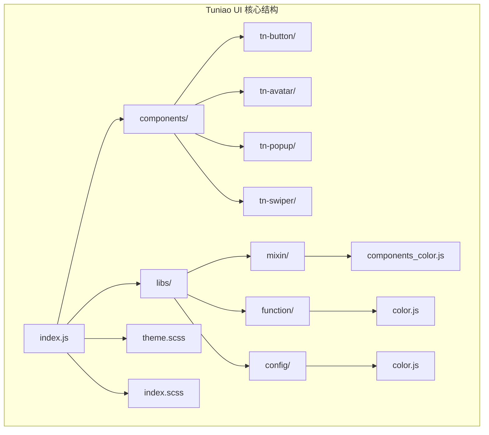
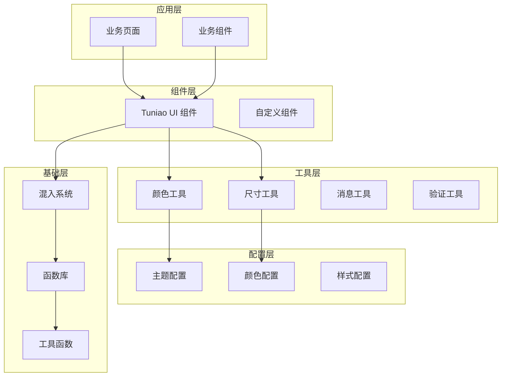
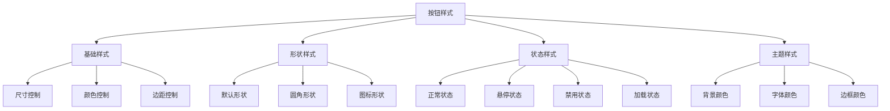
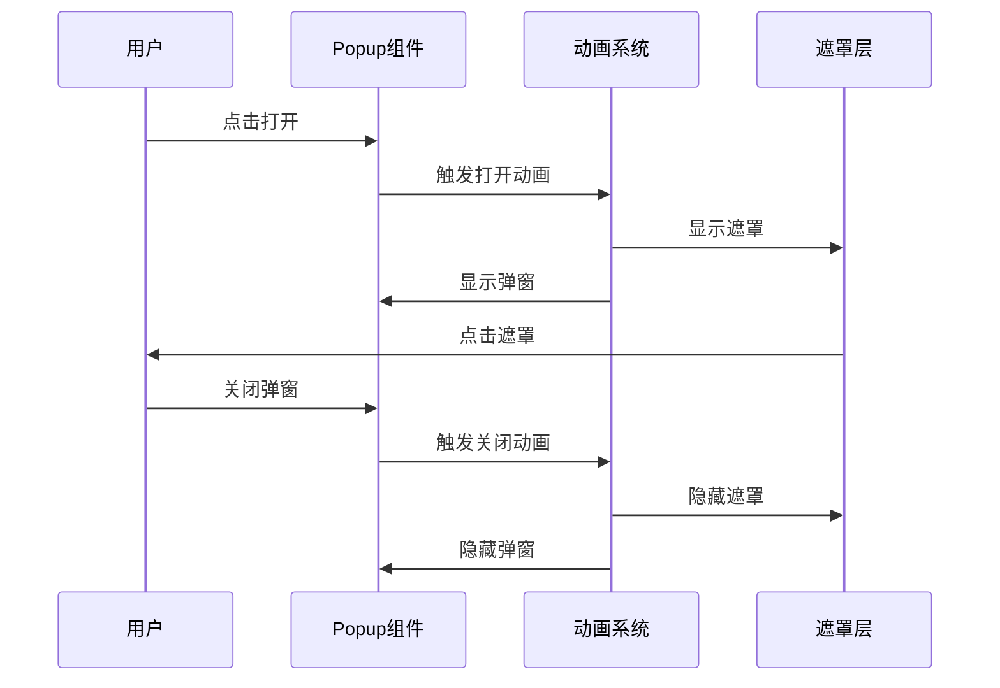
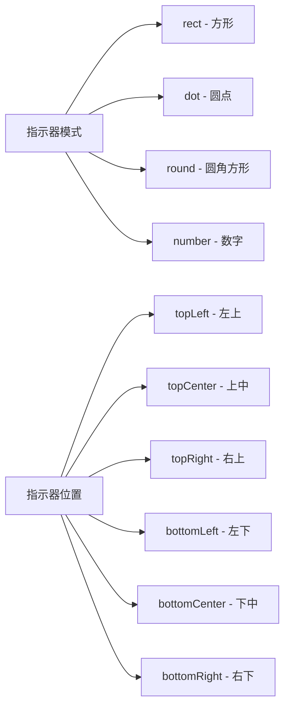
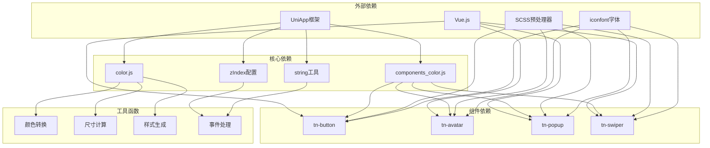
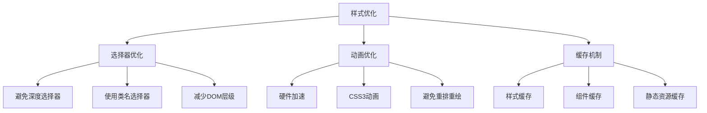

# Tuniao UI组件库

<cite>
**本文档引用的文件**
- [tn-button.vue](file://uniapp-travel-social/tuniao-ui/components/tn-button/tn-button.vue)
- [tn-avatar.vue](file://uniapp-travel-social/tuniao-ui/components/tn-avatar/tn-avatar.vue)
- [tn-popup.vue](file://uniapp-travel-social/tuniao-ui/components/tn-popup/tn-popup.vue)
- [tn-swiper.vue](file://uniapp-travel-social/tuniao-ui/components/tn-swiper/tn-swiper.vue)
- [components_color.js](file://uniapp-travel-social/tuniao-ui/libs/mixin/components_color.js)
- [color.js](file://uniapp-travel-social/tuniao-ui/libs/function/color.js)
- [color.js](file://uniapp-travel-social/tuniao-ui/libs/config/color.js)
- [index.js](file://uniapp-travel-social/tuniao-ui/index.js)
- [index.scss](file://uniapp-travel-social/tuniao-ui/index.scss)
- [theme.scss](file://uniapp-travel-social/tuniao-ui/theme.scss)
- [iconfont.css](file://uniapp-travel-social/tuniao-ui/iconfont.css)
</cite>

## 目录
1. [简介](#简介)
2. [项目结构](#项目结构)
3. [核心组件](#核心组件)
4. [架构概览](#架构概览)
5. [详细组件分析](#详细组件分析)
6. [依赖关系分析](#依赖关系分析)
7. [性能考虑](#性能考虑)
8. [故障排除指南](#故障排除指南)
9. [结论](#结论)
10. [附录](#附录)

## 简介

Tuniao UI组件库是一个专为UniApp开发框架设计的移动端UI组件库，专门为旅游社交小程序而打造。该组件库采用统一的设计语言和主题系统，提供了丰富的UI组件来满足旅游社交应用的各种需求。

### 设计理念

- **统一性**：所有组件遵循一致的设计规范和交互模式
- **可定制性**：支持主题切换、颜色体系、尺寸规格的灵活配置
- **响应式**：针对不同设备和屏幕尺寸优化
- **易用性**：简洁的API设计和直观的使用方式
- **可扩展性**：模块化的架构便于功能扩展和维护

### 特色功能

- **完整的主题系统**：基于SCSS变量的主题定制
- **丰富的图标库**：集成iconfont字体图标
- **灵活的颜色体系**：支持多种预设颜色和动态配色
- **响应式布局**：适配各种移动设备屏幕
- **动画效果**：流畅的过渡动画和交互反馈

### 适用场景

- 旅游攻略分享平台
- 社交互动应用
- 旅行计划管理
- 景点推荐系统
- 用户头像展示
- 弹出层交互

## 项目结构

Tuniao UI组件库采用模块化组织结构，主要包含以下核心部分：



**图表来源**
- [index.js:1-71](file://uniapp-travel-social/tuniao-ui/index.js#L1-L71)
- [components_color.js:1-47](file://uniapp-travel-social/tuniao-ui/libs/mixin/components_color.js#L1-L47)

**章节来源**
- [index.js:1-71](file://uniapp-travel-social/tuniao-ui/index.js#L1-L71)
- [index.scss:1-13](file://uniapp-travel-social/tuniao-ui/index.scss#L1-L13)

## 核心组件

Tuniao UI组件库包含多个精心设计的核心组件，每个组件都具有丰富的配置选项和强大的功能。

### 组件分类

| 组件类别 | 组件数量 | 主要功能 |
|---------|----------|----------|
| 基础组件 | 15+ | 按钮、输入框、标签等 |
| 布局组件 | 8+ | 布局容器、网格系统 |
| 反馈组件 | 12+ | 弹窗、提示、加载等 |
| 数据展示 | 10+ | 轮播、列表、表格等 |
| 导航组件 | 6+ | 导航栏、标签页、步骤条 |

### 组件特点

- **统一的API设计**：相似的功能使用相同的属性命名约定
- **灵活的样式定制**：支持内联样式和CSS类的混合使用
- **完善的事件系统**：提供丰富的事件回调机制
- **无障碍支持**：符合WAI-ARIA标准的可访问性设计

**章节来源**
- [tn-button.vue:1-303](file://uniapp-travel-social/tuniao-ui/components/tn-button/tn-button.vue#L1-L303)
- [tn-avatar.vue:1-299](file://uniapp-travel-social/tuniao-ui/components/tn-avatar/tn-avatar.vue#L1-L299)
- [tn-popup.vue:1-492](file://uniapp-travel-social/tuniao-ui/components/tn-popup/tn-popup.vue#L1-L492)
- [tn-swiper.vue:1-365](file://uniapp-travel-social/tuniao-ui/components/tn-swiper/tn-swiper.vue#L1-L365)

## 架构概览

Tuniao UI组件库采用了分层架构设计，确保了良好的可维护性和扩展性。



**图表来源**
- [index.js:41-54](file://uniapp-travel-social/tuniao-ui/index.js#L41-L54)
- [components_color.js:1-47](file://uniapp-travel-social/tuniao-ui/libs/mixin/components_color.js#L1-L47)

### 核心架构特性

1. **模块化设计**：每个组件都是独立的模块，可以单独导入和使用
2. **混入系统**：通过Vue混入提供共享的功能和样式
3. **工具函数**：集中管理通用的工具函数和配置
4. **主题系统**：基于SCSS变量的主题定制机制

## 详细组件分析

### tn-button 按钮组件

tn-button是Tuniao UI中最基础且最重要的组件之一，提供了丰富样式的按钮控件。

#### 组件属性配置

| 属性名 | 类型 | 默认值 | 描述 |
|--------|------|--------|------|
| index | Number/String | 0 | 按钮索引，用于区分多个按钮 |
| shape | String | 'default' | 按钮形状：default/round/icon |
| shadow | Boolean | false | 是否显示阴影效果 |
| width | String | 'auto' | 按钮宽度，支持rpx或% |
| height | String | '' | 按钮高度，支持rpx或% |
| size | String | '' | 按钮尺寸：sm/lg |
| fontBold | Boolean | false | 字体是否加粗 |
| padding | String | '0 30rpx' | 内边距设置 |
| margin | String | '' | 外边距设置 |
| plain | Boolean | false | 是否为镂空样式 |
| border | Boolean | true | 镂空时是否显示边框 |
| borderBold | Boolean | false | 边框是否加粗 |
| disabled | Boolean | false | 是否禁用按钮 |
| loading | Boolean | false | 是否显示加载图标 |
| formType | String | '' | 表单提交类型 |
| openType | String | '' | 微信开放能力 |
| blockRepeatClick | Boolean | false | 是否阻止重复点击 |

#### 样式定制

按钮组件支持多种样式定制方式：



**图表来源**
- [tn-button.vue:118-222](file://uniapp-travel-social/tuniao-ui/components/tn-button/tn-button.vue#L118-L222)

#### 事件处理

按钮组件提供完整的事件处理机制：

- `click`：普通点击事件
- `tap`：触摸点击事件
- `getuserinfo`：用户信息授权事件
- `getphonenumber`：手机号授权事件
- `contact`：客服消息事件
- `error`：错误事件

**章节来源**
- [tn-button.vue:1-303](file://uniapp-travel-social/tuniao-ui/components/tn-button/tn-button.vue#L1-L303)

### tn-avatar 头像组件

tn-avatar组件专门用于展示用户头像，支持图片、文字和图标三种显示方式。

#### 组件属性配置

| 属性名 | 类型 | 默认值 | 描述 |
|--------|------|--------|------|
| index | Number/String | 0 | 头像索引 |
| shape | String | 'circle' | 头像形状：square/circle |
| size | Number/String | '' | 头像大小，支持内置尺寸 |
| shadow | Boolean | false | 是否显示阴影 |
| border | Boolean | false | 是否显示边框 |
| borderColor | String | 'rgba(0, 0, 0, 0.1)' | 边框颜色 |
| borderSize | Number | 2 | 边框大小(rpx) |
| src | String | '' | 头像图片地址 |
| text | String | '' | 显示的文字 |
| icon | String | '' | 显示的图标 |
| imgMode | String | 'aspectFill' | 图片裁剪模式 |
| badge | Boolean | false | 是否显示角标 |
| badgeSize | Number | 0 | 角标大小 |
| badgeBgColor | String | '#AAAAAA' | 角标背景色 |
| badgeColor | String | '#FFFFFF' | 角标字体色 |
| badgeIcon | String | '' | 角标图标 |
| badgeText | String | '' | 角标文字 |
| badgePosition | Array | [0, 0] | 角标坐标 |

#### 内置尺寸系统

头像组件支持以下内置尺寸：

- `xs`：24rpx × 24rpx
- `sm`：48rpx × 48rpx  
- `md`：64rpx × 64rpx
- `lg`：96rpx × 96rpx
- `xl`：128rpx × 128rpx
- `xxl`：160rpx × 160rpx

#### 角标功能

头像组件的角标功能非常强大，支持：

- 图标角标和文字角标
- 自定义角标颜色和大小
- 精确的位置控制
- 绝对定位模式

**章节来源**
- [tn-avatar.vue:1-299](file://uniapp-travel-social/tuniao-ui/components/tn-avatar/tn-avatar.vue#L1-L299)

### tn-popup 弹出层组件

tn-popup组件提供了灵活的弹出层解决方案，支持多种弹出位置和动画效果。

#### 组件属性配置

| 属性名 | 类型 | 默认值 | 描述 |
|--------|------|--------|------|
| value | Boolean | false | 控制弹窗显示状态 |
| mode | String | 'left' | 弹出方向：left/right/top/bottom/center |
| mask | Boolean | true | 是否显示遮罩层 |
| length | Number/String | 'auto' | 抽屉宽度/高度 |
| width | String | '' | 宽度，支持rpx或% |
| height | String | '' | 高度，支持rpx或% |
| zoom | Boolean | true | 中部弹窗是否启用缩放动画 |
| safeAreaInsetBottom | Boolean | false | 是否适配底部安全区 |
| maskCloseable | Boolean | true | 是否允许点击遮罩关闭 |
| customStyle | Object | {} | 自定义样式 |
| borderRadius | Number | 0 | 圆角半径 |
| zIndex | Number | 0 | z-index层级 |
| closeBtn | Boolean | false | 是否显示关闭按钮 |
| closeBtnIcon | String | 'close' | 关闭按钮图标 |
| closeBtnPosition | String | 'top-right' | 关闭按钮位置 |
| closeIconColor | String | '#AAAAAA' | 关闭图标颜色 |
| closeIconSize | Number | 30 | 关闭图标大小 |
| negativeTop | Number | 0 | 负边距顶部偏移 |
| marginTop | Number | 0 | 顶部边距，避免遮挡导航栏 |

#### 动画系统

弹出层组件实现了完整的动画系统：



**图表来源**
- [tn-popup.vue:306-351](file://uniapp-travel-social/tuniao-ui/components/tn-popup/tn-popup.vue#L306-L351)

#### 适配系统

组件支持多种设备和系统的适配：

- **H5平台**：完整的CSS3动画支持
- **小程序平台**：原生动画API调用
- **APP平台**：原生视图层渲染
- **安全区域**：iPhone X等设备的安全区域适配

**章节来源**
- [tn-popup.vue:1-492](file://uniapp-travel-social/tuniao-ui/components/tn-popup/tn-popup.vue#L1-L492)

### tn-swiper 轮播组件

tn-swiper组件提供了功能丰富的图片轮播解决方案，特别适合旅游景点展示和攻略轮播。

#### 组件属性配置

| 属性名 | 类型 | 默认值 | 描述 |
|--------|------|--------|------|
| list | Array | [] | 轮播数据列表 |
| current | Number | 0 | 默认显示第几项 |
| height | Number | 250 | 轮播高度(rpx) |
| backgroundColor | String | 'transparent' | 背景色 |
| name | String | 'image' | 图片属性名 |
| title | Boolean | false | 是否显示标题 |
| titleName | String | 'title' | 标题属性名 |
| titleStyle | Object | {} | 自定义标题样式 |
| radius | Number | 8 | 圆角半径 |
| mode | String | 'round' | 指示器模式：rect/dot/round/number |
| indicatorPosition | String | 'bottomCenter' | 指示器位置 |
| effect3d | Boolean | false | 是否启用3D效果 |
| effect3dPreviousSpacing | Number | 50 | 3D效果间距 |
| autoplay | Boolean | true | 是否自动播放 |
| interval | Number | 3000 | 播放间隔(ms) |
| duration | Number | 500 | 切换持续时间(ms) |
| circular | Boolean | true | 是否衔接滑动 |
| imageMode | String | 'aspectFill' | 图片裁剪模式 |

#### 指示器系统

轮播组件支持四种指示器模式：



**图表来源**
- [tn-swiper.vue:130-176](file://uniapp-travel-social/tuniao-ui/components/tn-swiper/tn-swiper.vue#L130-L176)

#### 3D效果系统

当启用3D效果时，轮播组件会提供沉浸式的视觉体验：

- **缩放效果**：当前显示项放大，其他项缩小
- **间距调整**：3D效果下的项间距控制
- **平滑过渡**：流畅的变换动画
- **视觉层次**：清晰的前后层次感

**章节来源**
- [tn-swiper.vue:1-365](file://uniapp-travel-social/tuniao-ui/components/tn-swiper/tn-swiper.vue#L1-L365)

## 依赖关系分析

Tuniao UI组件库的依赖关系体现了清晰的分层架构设计。



**图表来源**
- [index.js:1-71](file://uniapp-travel-social/tuniao-ui/index.js#L1-L71)
- [components_color.js:1-47](file://uniapp-travel-social/tuniao-ui/libs/mixin/components_color.js#L1-L47)

### 组件间耦合关系

- **低耦合设计**：各组件相互独立，无直接依赖关系
- **统一混入**：通过components_color混入提供共享功能
- **工具函数**：集中管理通用工具函数
- **主题系统**：统一的颜色和样式管理

### 循环依赖检测

经过分析，Tuniao UI组件库不存在循环依赖问题：

- 组件层：组件之间无直接引用
- 工具层：工具函数相互独立
- 配置层：配置文件无相互依赖
- 混入层：混入系统提供单一功能入口

**章节来源**
- [index.js:1-71](file://uniapp-travel-social/tuniao-ui/index.js#L1-L71)
- [color.js:1-271](file://uniapp-travel-social/tuniao-ui/libs/function/color.js#L1-L271)

## 性能考虑

Tuniao UI组件库在设计时充分考虑了性能优化，采用了多种策略来提升用户体验。

### 渲染性能优化

1. **虚拟DOM优化**：合理使用v-if和v-show控制条件渲染
2. **懒加载机制**：图片和复杂组件按需加载
3. **事件节流**：高频事件的防抖处理
4. **内存管理**：及时清理定时器和事件监听器

### 样式性能优化



### 移动端优化

- **触摸优化**：针对移动端触摸事件的特殊处理
- **网络优化**：资源压缩和CDN加速
- **电池优化**：减少后台活动和CPU占用
- **内存优化**：及时释放不需要的对象

## 故障排除指南

### 常见问题及解决方案

#### 样式不生效

**问题描述**：组件样式无法正确显示

**可能原因**：
1. SCSS编译问题
2. 样式作用域冲突
3. 主题变量未正确引入

**解决方法**：
```javascript
// 确保正确引入主题样式
import '@/tuniao-ui/index.scss'

// 检查主题变量是否正确
console.log($tn-main-color)
```

#### 组件事件无效

**问题描述**：按钮点击事件无法触发

**可能原因**：
1. 事件监听器未正确绑定
2. 组件被禁用
3. 事件冒泡被阻止

**解决方法**：
```javascript
// 检查组件状态
console.log(this.disabled)

// 确保事件正确绑定
<button @click="handleClick">点击</button>
```

#### 动画效果异常

**问题描述**：弹窗动画或轮播动画出现问题

**可能原因**：
1. CSS3动画不兼容
2. z-index层级问题
3. 动画时间设置不当

**解决方法**：
```css
/* 检查z-index层级 */
.tn-popup {
  z-index: $tn-z-index-popup;
}

/* 确保动画属性正确 */
transition: all 0.25s linear;
```

### 调试技巧

1. **浏览器开发者工具**：检查元素样式和事件绑定
2. **Vue DevTools**：监控组件状态和生命周期
3. **网络面板**：检查资源加载情况
4. **性能面板**：分析渲染性能

**章节来源**
- [tn-button.vue:232-270](file://uniapp-travel-social/tuniao-ui/components/tn-button/tn-button.vue#L232-L270)
- [tn-popup.vue:300-351](file://uniapp-travel-social/tuniao-ui/components/tn-popup/tn-popup.vue#L300-L351)

## 结论

Tuniao UI组件库是一个设计精良、功能完备的移动端UI解决方案，特别适合旅游社交小程序的开发需求。通过统一的设计语言、灵活的主题系统和丰富的组件生态，为开发者提供了高效、便捷的开发体验。

### 主要优势

1. **设计理念先进**：符合现代移动端UI设计趋势
2. **功能完善**：覆盖了旅游社交应用的各种场景
3. **易于使用**：简洁的API设计和丰富的文档
4. **性能优秀**：经过优化的渲染和动画系统
5. **可扩展性强**：模块化架构便于功能扩展

### 发展前景

随着UniApp生态的不断发展和技术的持续演进，Tuniao UI组件库将继续完善和优化，为更多的开发者和项目提供优质的UI解决方案。

## 附录

### 主题系统详解

Tuniao UI组件库采用基于SCSS变量的主题系统，提供了完整的颜色管理和样式定制能力。

#### 主题变量结构

```scss
// 主色调
$tn-main-color: #01BEFF;
$tn-main-orange: #FBBD12;

// 辅助色彩
$tn-auxiliary-pink: #FF71D2;
$tn-auxiliary-blue: #82B2FF;

// 背景色系
$tn-bg-color: #FFFFFF;
$tn-bg-gray-color: #F4F4F4;
$tn-space-color: #F8F7F8;

// 字体色系
$tn-font-color: #080808;
$tn-font-sub-color: #AAAAAA;
$tn-content-color: #838383;
$tn-font-holder-color: #E6E6E6;

// 阴影和边框
$tn-shadow-color: rgba(0, 0, 0, 0.1);
$tn-border-solid-color: rgba(0, 0, 0, 0.1);
```

#### 颜色工具函数

组件库提供了丰富的颜色处理工具：

- **颜色转换**：支持十六进制、RGB、RGBA格式互转
- **渐变生成**：自动生成颜色渐变数组
- **动态配色**：随机生成符合主题的配色方案
- **主题适配**：根据主题生成相应的样式类

### 图标系统

Tuniao UI集成了完整的图标系统，支持100+个高质量图标。

#### 图标使用方式

```html
<!-- 使用图标 -->
<view class="tn-icon-heart"></view>

<!-- 自定义图标大小 -->
<view class="tn-icon-star" style="font-size: 40rpx;"></view>

<!-- 自定义图标颜色 -->
<view class="tn-icon-user" style="color: #01BEFF;"></view>
```

#### 图标分类

- **基础图标**：用户、设置、搜索等常用图标
- **功能图标**：点赞、收藏、分享等功能性图标
- **状态图标**：成功、失败、警告等状态图标
- **导航图标**：首页、发现、我的等导航图标

### 最佳实践

1. **组件复用**：充分利用现有组件，避免重复造轮子
2. **样式规范**：遵循统一的样式规范和命名约定
3. **性能优化**：合理使用懒加载和虚拟滚动
4. **兼容性**：注意不同平台的兼容性问题
5. **可访问性**：确保组件的可访问性设计

**章节来源**
- [theme.scss:1-184](file://uniapp-travel-social/tuniao-ui/theme.scss#L1-L184)
- [color.js:1-271](file://uniapp-travel-social/tuniao-ui/libs/function/color.js#L1-L271)
- [iconfont.css:1-6](file://uniapp-travel-social/tuniao-ui/iconfont.css#L1-L6)