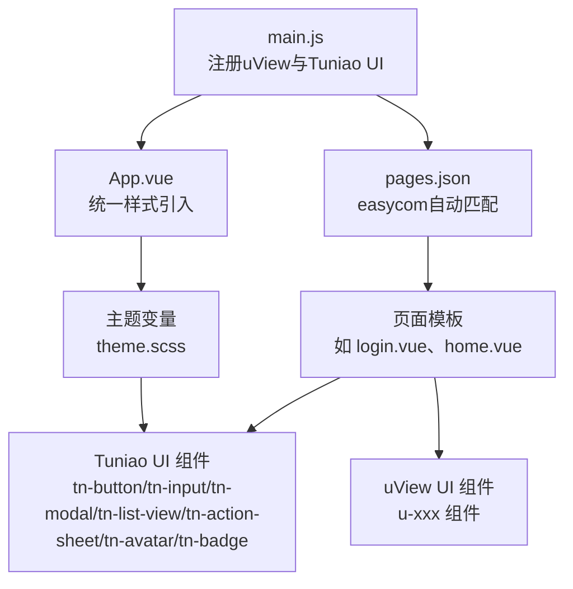
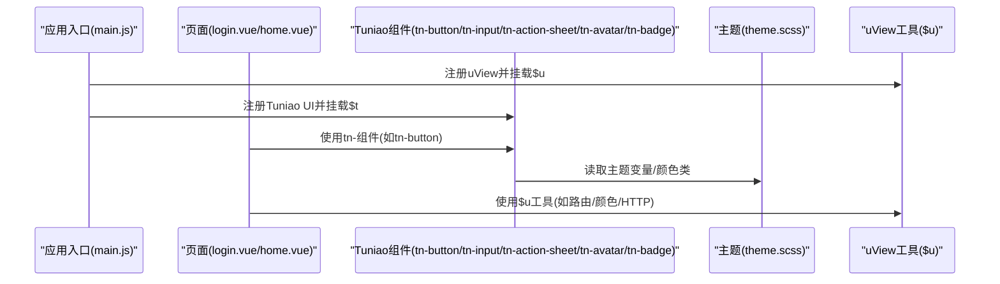
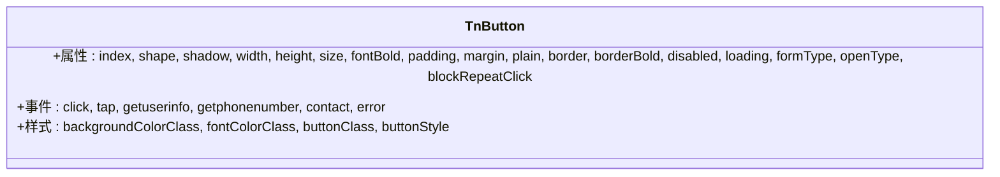
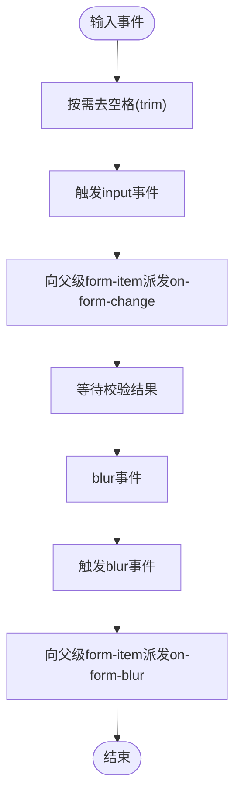
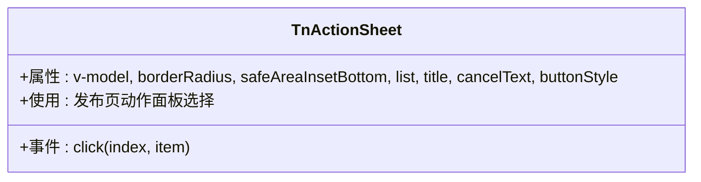
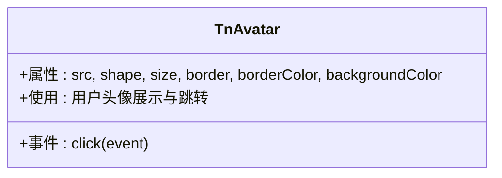
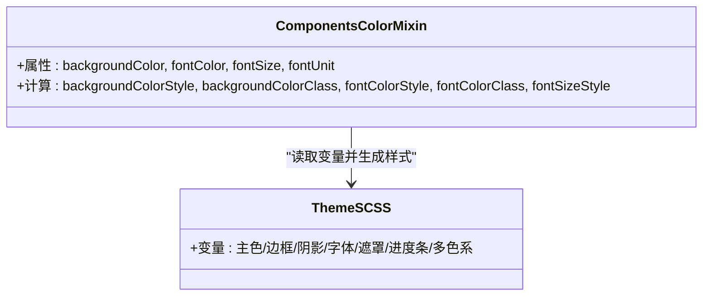
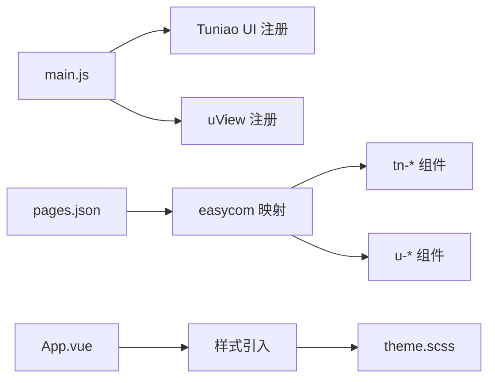

# UI组件库使用

<cite>
**本文引用的文件**
- [main.js](file://uniapp-travel-social/main.js)
- [pages.json](file://uniapp-travel-social/pages.json)
- [App.vue](file://uniapp-travel-social/App.vue)
- [tuniao-ui/index.js](file://uniapp-travel-social/tuniao-ui/index.js)
- [tuniao-ui/theme.scss](file://uniapp-travel-social/tuniao-ui/theme.scss)
- [tuniao-ui/libs/config/color.js](file://uniapp-travel-social/tuniao-ui/libs/config/color.js)
- [tuniao-ui/libs/mixin/components_color.js](file://uniapp-travel-social/tuniao-ui/libs/mixin/components_color.js)
- [tuniao-ui/components/tn-button/tn-button.vue](file://uniapp-travel-social/tuniao-ui/components/tn-button/tn-button.vue)
- [tuniao-ui/components/tn-input/tn-input.vue](file://uniapp-travel-social/tuniao-ui/components/tn-input/tn-input.vue)
- [tuniao-ui/components/tn-modal/tn-modal.vue](file://uniapp-travel-social/tuniao-ui/components/tn-modal/tn-modal.vue)
- [tuniao-ui/components/tn-list-view/tn-list-view.vue](file://uniapp-travel-social/tuniao-ui/components/tn-list-view/tn-list-view.vue)
- [tuniao-ui/components/tn-action-sheet/tn-action-sheet.vue](file://uniapp-travel-social/tuniao-ui/components/tn-action-sheet/tn-action-sheet.vue)
- [tuniao-ui/components/tn-avatar/tn-avatar.vue](file://uniapp-travel-social/tuniao-ui/components/tn-avatar/tn-avatar.vue)
- [tuniao-ui/components/tn-avatar-group/tn-avatar-group.vue](file://uniapp-travel-social/tuniao-ui/components/tn-avatar-group/tn-avatar-group.vue)
- [tuniao-ui/components/tn-badge/tn-badge.vue](file://uniapp-travel-social/tuniao-ui/components/tn-badge/tn-badge.vue)
- [uview-ui/index.js](file://uniapp-travel-social/uni_modules/uview-ui/index.js)
- [homePages/login/login.vue](file://uniapp-travel-social/homePages/login/login.vue)
- [pages/home/home.vue](file://uniapp-travel-social/pages/home/home.vue)
- [store/index.js](file://uniapp-travel-social/store/index.js)
</cite>

## 目录
1. [简介](#简介)
2. [项目结构](#项目结构)
3. [核心组件](#核心组件)
4. [架构总览](#架构总览)
5. [详细组件分析](#详细组件分析)
6. [依赖关系分析](#依赖关系分析)
7. [性能考虑](#性能考虑)
8. [故障排查指南](#故障排查指南)
9. [结论](#结论)
10. [附录](#附录)

## 简介
本文件面向"旅行攻略社交小程序"的前端工程，系统性梳理并说明两类UI组件库的使用方法与最佳实践：
- Tuniao UI：自研组件库，提供按钮、输入框、弹窗、列表、动作面板、头像、徽章等常用组件，具备主题变量、颜色混入、样式覆盖与响应式适配能力。
- uView UI：成熟的第三方组件库，提供路由、颜色渐变、校验、节流防抖、HTTP请求等工具与组件，便于快速构建页面。

文档涵盖组件引入、属性配置、事件处理、样式定制、主题切换、响应式设计、性能优化与调试技巧，并给出常见组件（按钮、输入框、弹窗、列表、动作面板、头像、徽章）的使用示例路径与最佳实践。

## 项目结构
项目采用 uni-app 架构，主应用通过 main.js 注册两个组件库；页面通过 pages.json 的 easycom 自动匹配规则，以"tn-"前缀直接使用组件；App.vue 统一引入样式，确保主题变量与图标字体生效。

**图表来源**
- [main.js:1-118](file://uniapp-travel-social/main.js#L1-L118)
- [pages.json:1-800](file://uniapp-travel-social/pages.json#L1-L800)
- [App.vue:1-93](file://uniapp-travel-social/App.vue#L1-L93)
- [tuniao-ui/index.js:1-71](file://uniapp-travel-social/tuniao-ui/index.js#L1-L71)
- [uview-ui/index.js:1-80](file://uniapp-travel-social/uni_modules/uview-ui/index.js#L1-L80)

**章节来源**
- [main.js:1-118](file://uniapp-travel-social/main.js#L1-L118)
- [pages.json:1-800](file://uniapp-travel-social/pages.json#L1-L800)
- [App.vue:1-93](file://uniapp-travel-social/App.vue#L1-L93)

## 核心组件
- Tuniao UI
  - 组件命名空间：tn-*
  - 提供按钮、输入框、弹窗、列表视图、动作面板、头像、徽章等常用组件
  - 支持颜色混入、尺寸/形状/阴影/镂空等样式属性
- uView UI
  - 组件命名空间：u-*
  - 提供路由、颜色渐变、校验、节流防抖、HTTP请求等工具
  - 通过 easycom 自动映射，简化使用

**章节来源**
- [tuniao-ui/index.js:1-71](file://uniapp-travel-social/tuniao-ui/index.js#L1-L71)
- [uview-ui/index.js:1-80](file://uniapp-travel-social/uni_modules/uview-ui/index.js#L1-L80)
- [pages.json:1-800](file://uniapp-travel-social/pages.json#L1-L800)

## 架构总览
整体架构由"应用入口 -> 页面 -> 组件 -> 工具库/主题"构成。页面通过 easycom 直接使用组件，组件内部通过颜色混入与主题变量实现样式一致性。

**图表来源**
- [main.js:1-118](file://uniapp-travel-social/main.js#L1-L118)
- [tuniao-ui/index.js:1-71](file://uniapp-travel-social/tuniao-ui/index.js#L1-L71)
- [tuniao-ui/theme.scss:1-184](file://uniapp-travel-social/tuniao-ui/theme.scss#L1-L184)
- [uview-ui/index.js:1-80](file://uniapp-travel-social/uni_modules/uview-ui/index.js#L1-L80)

## 详细组件分析

### 组件：tn-button（按钮）
- 属性要点
  - 形状/尺寸/阴影/镂空/边框/禁用/加载/开放能力/重复点击防护
  - 支持通过 backgroundColor/fontColor/size/shape/shadow/plain/border 等属性组合样式
- 事件要点
  - click/tap 事件透传，携带 index
  - 支持开放能力事件：getuserinfo/getphonenumber/contact/error
- 样式要点
  - 通过颜色混入计算内部类与内联样式，支持圆角、阴影、镂空边框等
  - 图标按钮时宽度等于高度，自动清空内边距
- 使用示例
  - 登录页使用：[login.vue:90-120](file://uniapp-travel-social/homePages/login/login.vue#L90-L120)

**图表来源**
- [tuniao-ui/components/tn-button/tn-button.vue:1-303](file://uniapp-travel-social/tuniao-ui/components/tn-button/tn-button.vue#L1-L303)

**章节来源**
- [tuniao-ui/components/tn-button/tn-button.vue:1-303](file://uniapp-travel-social/tuniao-ui/components/tn-button/tn-button.vue#L1-L303)
- [homePages/login/login.vue:90-120](file://uniapp-travel-social/homePages/login/login.vue#L90-L120)

### 组件：tn-input（输入框）
- 属性要点
  - 类型/对齐/占位/禁用/最大长度/高度/自动高度/键盘确认/自定义样式/固定/聚焦/密码图标/边框/可清空/光标间距/选择范围/去空格/显示完成条/右侧图标
- 事件要点
  - input/blur/focus/confirm/click，以及清空事件
- 校验集成
  - 监听 form-item 错误事件，切换错误态边框
- 使用示例
  - 登录页使用：[login.vue:40-100](file://uniapp-travel-social/homePages/login/login.vue#L40-L100)

**图表来源**
- [tuniao-ui/components/tn-input/tn-input.vue:285-363](file://uniapp-travel-social/tuniao-ui/components/tn-input/tn-input.vue#L285-L363)

**章节来源**
- [tuniao-ui/components/tn-input/tn-input.vue:1-428](file://uniapp-travel-social/tuniao-ui/components/tn-input/tn-input.vue#L1-L428)
- [homePages/login/login.vue:40-100](file://uniapp-travel-social/homePages/login/login.vue#L40-L100)

### 组件：tn-modal（弹窗）
- 属性要点
  - 显示控制/宽度/内边距/圆角/标题/内容/按钮/安全区域/遮罩关闭/关闭按钮/缩放动画/自定义内容/z-index
- 事件要点
  - click(cancel)/input(false) 关闭回调
- 使用示例
  - 页面中作为通用弹窗容器使用，结合 tn-button 实现操作按钮

**章节来源**
- [tuniao-ui/components/tn-modal/tn-modal.vue:1-247](file://uniapp-travel-social/tuniao-ui/components/tn-modal/tn-modal.vue#L1-L247)

### 组件：tn-list-view（列表视图）
- 属性要点
  - 标题/无边框策略(top/bottom/all)/上外边距/卡片模式/自定义标题
- 插槽要点
  - 默认插槽承载列表项；title 插槽用于自定义标题区域
- 使用示例
  - 页面中作为列表容器，配合子项组件展示内容

**章节来源**
- [tuniao-ui/components/tn-list-view/tn-list-view.vue:1-185](file://uniapp-travel-social/tuniao-ui/components/tn-list-view/tn-list-view.vue#L1-L185)

### 组件：tn-action-sheet（动作面板）
- 属性要点
  - 显示控制/圆角半径/安全区域适配/列表数据/标题/取消文本/按钮样式
  - 支持 borderRadius/safeAreaInsetBottom/list/title/cancelText/buttonStyle 等属性
- 事件要点
  - click 事件返回选中的列表项索引和数据
- 使用示例
  - 发布页使用：[publish.vue:46-48](file://uniapp-travel-social/interestPages/publish.vue#L46-L48)

**图表来源**
- [tuniao-ui/components/tn-action-sheet/tn-action-sheet.vue:1-200](file://uniapp-travel-social/tuniao-ui/components/tn-action-sheet/tn-action-sheet.vue#L1-L200)

**章节来源**
- [tuniao-ui/components/tn-action-sheet/tn-action-sheet.vue:1-200](file://uniapp-travel-social/tuniao-ui/components/tn-action-sheet/tn-action-sheet.vue#L1-L200)
- [interestPages/publish.vue:46-48](file://uniapp-travel-social/interestPages/publish.vue#L46-L48)

### 组件：tn-avatar（头像）
- 属性要点
  - 图片地址/形状/尺寸/边框/背景色/圆形遮罩
  - 支持 src/shape/size/border/borderColor/backgroundColor 等属性
- 事件要点
  - 支持点击事件，可用于跳转用户主页
- 使用示例
  - 圈子页使用：[circle.vue:20](file://uniapp-travel-social/pages/circle/circle.vue#L20)
  - 博客页使用：[blog.vue:100-101](file://uniapp-travel-social/myPages/blog/blog.vue#L100-L101)

**图表来源**
- [tuniao-ui/components/tn-avatar/tn-avatar.vue:1-150](file://uniapp-travel-social/tuniao-ui/components/tn-avatar/tn-avatar.vue#L1-L150)

**章节来源**
- [tuniao-ui/components/tn-avatar/tn-avatar.vue:1-150](file://uniapp-travel-social/tuniao-ui/components/tn-avatar/tn-avatar.vue#L1-L150)
- [pages/circle/circle.vue:20](file://uniapp-travel-social/pages/circle/circle.vue#L20)
- [myPages/blog/blog.vue:100-101](file://uniapp-travel-social/myPages/blog/blog.vue#L100-L101)

### 组件：tn-avatar-group（头像组）
- 属性要点
  - 头像列表/尺寸/重叠距离/最大显示数量
  - 支持 lists/size/gap/maxShow 等属性
- 使用示例
  - 圈子页使用：[circle.vue:20](file://uniapp-travel-social/pages/circle/circle.vue#L20)

**章节来源**
- [tuniao-ui/components/tn-avatar-group/tn-avatar-group.vue:1-120](file://uniapp-travel-social/tuniao-ui/components/tn-avatar-group/tn-avatar-group.vue#L1-L120)
- [pages/circle/circle.vue:20](file://uniapp-travel-social/pages/circle/circle.vue#L20)

### 组件：tn-badge（徽章）
- 属性要点
  - 背景色/字体色/点状徽章/圆角半径/绝对定位/偏移量
  - 支持 backgroundColor/fontColor/dot/radius/absolute/translateCenter 等属性
- 使用示例
  - 版本页使用：[version.vue:64](file://uniapp-travel-social/minePages/version.vue#L64)

**章节来源**
- [tuniao-ui/components/tn-badge/tn-badge.vue:1-100](file://uniapp-travel-social/tuniao-ui/components/tn-badge/tn-badge.vue#L1-L100)
- [minePages/version.vue:64](file://uniapp-travel-social/minePages/version.vue#L64)

### 组件：颜色混入与主题变量
- 颜色混入
  - 组件通过混入提供 backgroundColor/fontColor/fontSize/fontUnit 属性，计算出内部类与内联样式
- 主题变量
  - 通过 theme.scss 定义主色、边框、阴影、字体、遮罩、进度条、多色系等变量
  - 组件内部通过 $t.color/$t.string 等工具解析变量与单位

**图表来源**
- [tuniao-ui/libs/mixin/components_color.js:1-47](file://uniapp-travel-social/tuniao-ui/libs/mixin/components_color.js#L1-L47)
- [tuniao-ui/theme.scss:1-184](file://uniapp-travel-social/tuniao-ui/theme.scss#L1-L184)
- [tuniao-ui/libs/config/color.js:1-15](file://uniapp-travel-social/tuniao-ui/libs/config/color.js#L1-L15)

**章节来源**
- [tuniao-ui/libs/mixin/components_color.js:1-47](file://uniapp-travel-social/tuniao-ui/libs/mixin/components_color.js#L1-L47)
- [tuniao-ui/theme.scss:1-184](file://uniapp-travel-social/tuniao-ui/theme.scss#L1-L184)
- [tuniao-ui/libs/config/color.js:1-15](file://uniapp-travel-social/tuniao-ui/libs/config/color.js#L1-L15)

## 依赖关系分析
- 组件注册
  - main.js 中分别注册 uView 与 Tuniao UI，并挂载到 Vue.prototype 与 uni 对象
- 自动匹配
  - pages.json 的 easycom 将 "^tn-(.*)" 映射到 Tuniao UI 组件目录，"^u-(.*)" 映射到 uView 组件目录
- 样式引入
  - App.vue 统一引入 uView 与 Tuniao UI 样式及图标字体，保证主题变量与样式生效

**图表来源**
- [main.js:1-118](file://uniapp-travel-social/main.js#L1-L118)
- [pages.json:1-800](file://uniapp-travel-social/pages.json#L1-L800)
- [App.vue:1-93](file://uniapp-travel-social/App.vue#L1-L93)

**章节来源**
- [main.js:1-118](file://uniapp-travel-social/main.js#L1-L118)
- [pages.json:1-800](file://uniapp-travel-social/pages.json#L1-L800)
- [App.vue:1-93](file://uniapp-travel-social/App.vue#L1-L93)

## 性能考虑
- 组件体积与按需使用
  - 优先使用 easycom 自动匹配，避免手动导入，减少冗余引用
- 样式与主题
  - 将主题变量集中维护在 theme.scss，避免在组件内硬编码颜色与尺寸
- 事件与交互
  - 按钮支持重复点击防护，输入框支持去空格与延迟校验，降低无效渲染与网络请求
- 数据持久化
  - store 中对关键状态进行本地持久化，减少重复初始化开销

## 故障排查指南
- 组件无法识别
  - 检查 pages.json 的 easycom 是否正确映射 tn-/u- 前缀
- 样式不生效
  - 确认 App.vue 已引入 uView 与 Tuniao UI 样式及图标字体
- 主题变量未生效
  - 确认 theme.scss 已被 App.vue 引入，且变量命名与组件混入一致
- 登录/网络异常
  - 检查 main.js 中 $http baseUrl 与拦截器逻辑，确保 token 注入与 401 处理正确
- 页面状态栏与导航
  - App.vue 中已通过 updateCustomBarInfo 初始化状态栏与自定义导航高度，可在 store 中读取

**章节来源**
- [pages.json:1-800](file://uniapp-travel-social/pages.json#L1-L800)
- [App.vue:1-93](file://uniapp-travel-social/App.vue#L1-L93)
- [main.js:1-118](file://uniapp-travel-social/main.js#L1-L118)
- [store/index.js:1-75](file://uniapp-travel-social/store/index.js#L1-L75)

## 结论
本项目通过 main.js 注册 uView 与 Tuniao UI，借助 pages.json 的 easycom 实现组件的即插即用；App.vue 统一引入样式与主题变量，保障视觉一致性。Tuniao UI 在按钮、输入框、弹窗、列表、动作面板、头像、徽章等常用场景提供了完善的属性与事件接口，配合颜色混入与主题变量，能够高效实现样式定制与响应式适配。新增的动作面板、头像组件丰富了用户交互体验，头像组和徽章增强了信息展示效果。建议在实际开发中遵循"属性驱动样式、事件透传、主题集中管理"的原则，提升可维护性与性能。

## 附录

### 常用组件使用示例与最佳实践
- 按钮（tn-button）
  - 示例路径：[login.vue:90-120](file://uniapp-travel-social/homePages/login/login.vue#L90-L120)
  - 最佳实践
    - 使用 backgroundColor/fontColor/shape/shadow/plain/border 控制外观
    - 使用 blockRepeatClick 防止重复点击
    - 通过 openType 使用微信开放能力（如授权）
- 输入框（tn-input）
  - 示例路径：[login.vue:40-100](file://uniapp-travel-social/homePages/login/login.vue#L40-L100)
  - 最佳实践
    - 使用 trim 去空格，结合 form-item 实现校验联动
    - textarea 使用 autoHeight 与自定义高度，合理设置 confirmType
- 弹窗（tn-modal）
  - 使用场景：统一弹窗容器，结合 tn-button 实现确认/取消
- 列表视图（tn-list-view）
  - 使用场景：列表容器，支持卡片模式与自定义标题
- 动作面板（tn-action-sheet）
  - 使用场景：发布页动作选择，支持自定义圆角和安全区域适配
  - 示例路径：[publish.vue:46-48](file://uniapp-travel-social/interestPages/publish.vue#L46-L48)
- 头像（tn-avatar）
  - 使用场景：用户头像展示，支持圆形/方形、多种尺寸
  - 示例路径：[circle.vue:20](file://uniapp-travel-social/pages/circle/circle.vue#L20)
- 头像组（tn-avatar-group）
  - 使用场景：多人头像展示，支持重叠显示和最大数量限制
  - 示例路径：[circle.vue:20](file://uniapp-travel-social/pages/circle/circle.vue#L20)
- 徽章（tn-badge）
  - 使用场景：消息提醒、状态标识，支持点状和数字徽章
  - 示例路径：[version.vue:64](file://uniapp-travel-social/minePages/version.vue#L64)

**章节来源**
- [homePages/login/login.vue:40-120](file://uniapp-travel-social/homePages/login/login.vue#L40-L120)
- [tuniao-ui/components/tn-button/tn-button.vue:1-303](file://uniapp-travel-social/tuniao-ui/components/tn-button/tn-button.vue#L1-L303)
- [tuniao-ui/components/tn-input/tn-input.vue:1-428](file://uniapp-travel-social/tuniao-ui/components/tn-input/tn-input.vue#L1-L428)
- [tuniao-ui/components/tn-modal/tn-modal.vue:1-247](file://uniapp-travel-social/tuniao-ui/components/tn-modal/tn-modal.vue#L1-L247)
- [tuniao-ui/components/tn-list-view/tn-list-view.vue:1-185](file://uniapp-travel-social/tuniao-ui/components/tn-list-view/tn-list-view.vue#L1-L185)
- [tuniao-ui/components/tn-action-sheet/tn-action-sheet.vue:1-200](file://uniapp-travel-social/tuniao-ui/components/tn-action-sheet/tn-action-sheet.vue#L1-L200)
- [tuniao-ui/components/tn-avatar/tn-avatar.vue:1-150](file://uniapp-travel-social/tuniao-ui/components/tn-avatar/tn-avatar.vue#L1-L150)
- [tuniao-ui/components/tn-avatar-group/tn-avatar-group.vue:1-120](file://uniapp-travel-social/tuniao-ui/components/tn-avatar-group/tn-avatar-group.vue#L1-L120)
- [tuniao-ui/components/tn-badge/tn-badge.vue:1-100](file://uniapp-travel-social/tuniao-ui/components/tn-badge/tn-badge.vue#L1-L100)
- [interestPages/publish.vue:46-48](file://uniapp-travel-social/interestPages/publish.vue#L46-L48)
- [pages/circle/circle.vue:20](file://uniapp-travel-social/pages/circle/circle.vue#L20)
- [minePages/version.vue:64](file://uniapp-travel-social/minePages/version.vue#L64)

### 主题定制与样式覆盖
- 主题变量
  - 在 theme.scss 中集中定义主色、边框、阴影、字体、遮罩、进度条、多色系等
- 组件样式覆盖
  - 通过 backgroundColor/fontColor/size/shape/shadow/plain 等属性覆盖默认样式
  - 使用自定义内联样式（customStyle）微调细节
- 响应式设计
  - 使用 rpx 单位与组件内置尺寸（sm/lg）适配不同屏幕密度

**章节来源**
- [tuniao-ui/theme.scss:1-184](file://uniapp-travel-social/tuniao-ui/theme.scss#L1-L184)
- [tuniao-ui/components/tn-button/tn-button.vue:160-222](file://uniapp-travel-social/tuniao-ui/components/tn-button/tn-button.vue#L160-L222)
- [tuniao-ui/components/tn-input/tn-input.vue:232-252](file://uniapp-travel-social/tuniao-ui/components/tn-input/tn-input.vue#L232-L252)

### 组件库工具与扩展
- uView 工具
  - 路由、颜色渐变、校验、节流防抖、HTTP 请求等，通过 $u 访问
- Tuniao 工具
  - 颜色解析、消息提示、UUID、数组、测试、父组件查找、字符串/数值格式化、深拷贝、z-index、颜色配置等，通过 $t 访问

**章节来源**
- [uview-ui/index.js:1-80](file://uniapp-travel-social/uni_modules/uview-ui/index.js#L1-L80)
- [tuniao-ui/index.js:1-71](file://uniapp-travel-social/tuniao-ui/index.js#L1-L71)