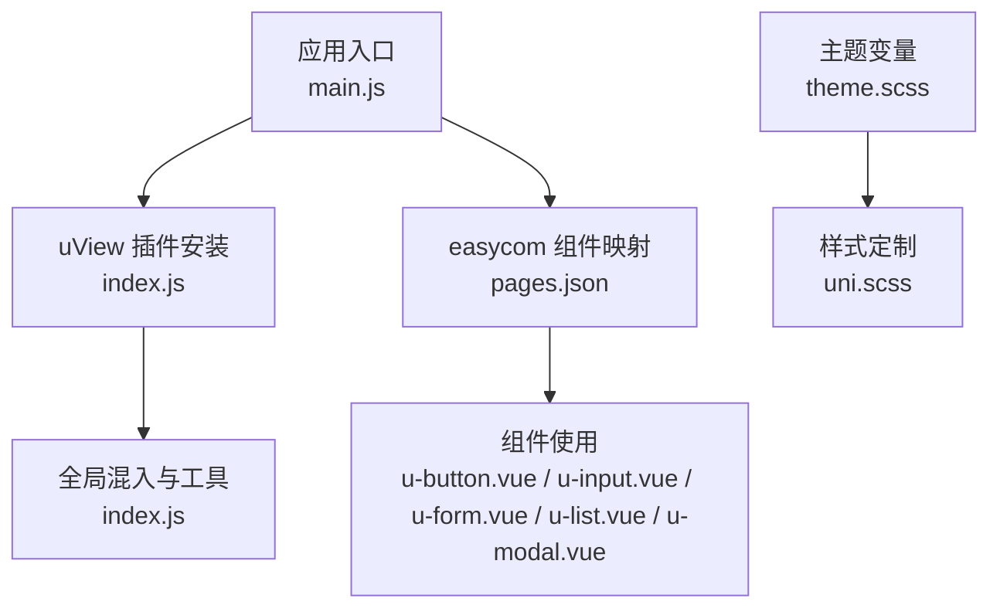
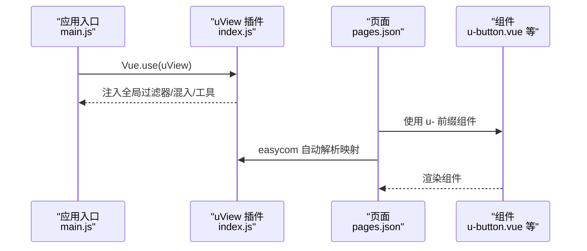
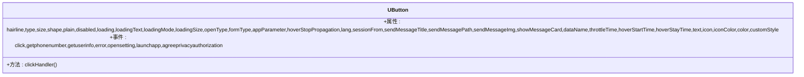
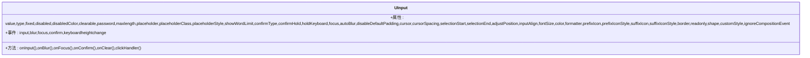
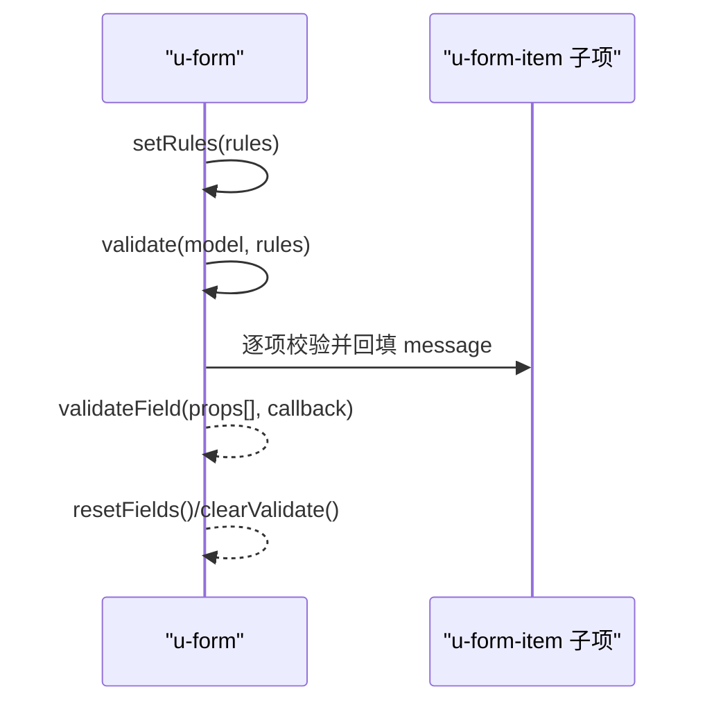
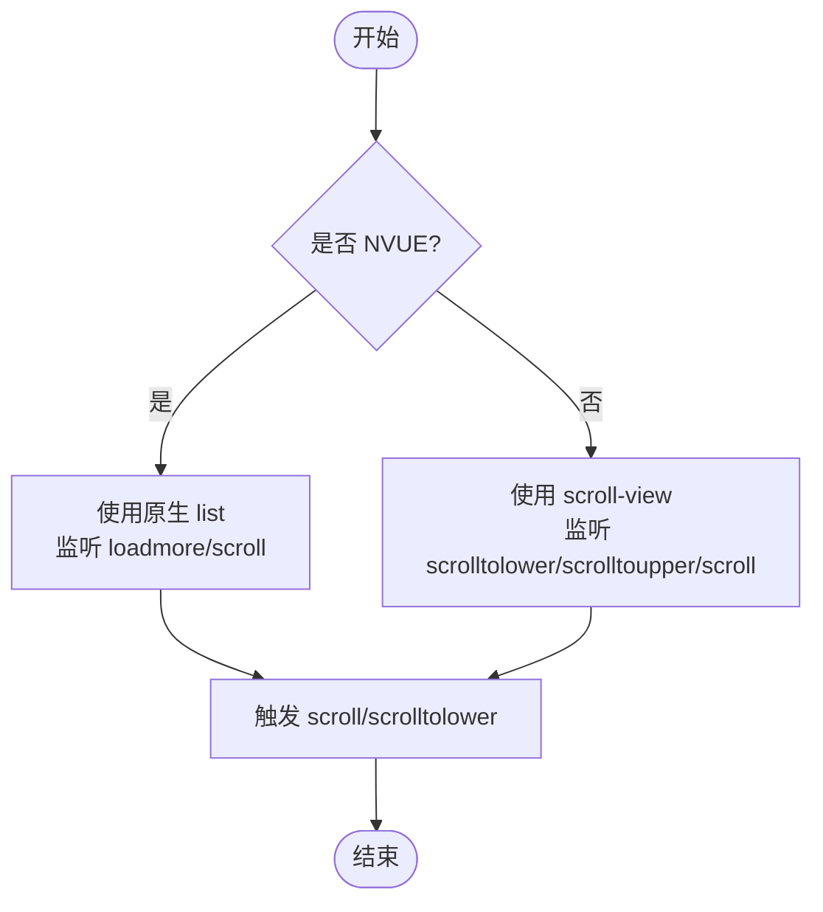
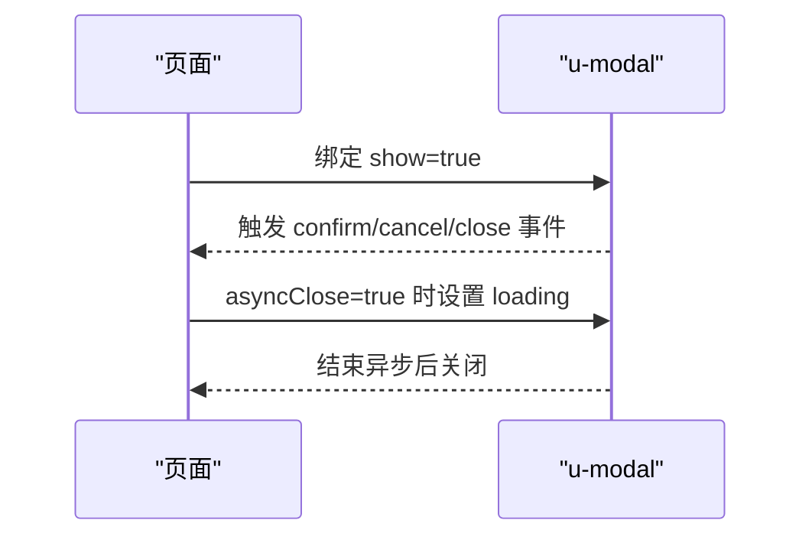
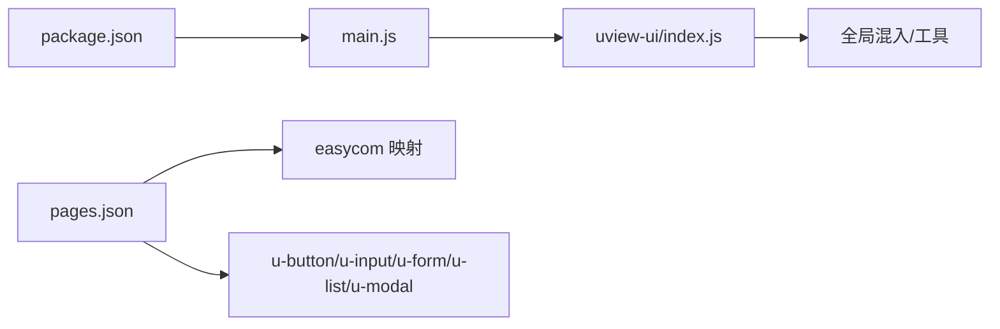

# uView UI组件库

<cite>
**本文档引用的文件**
- [package.json](file://uniapp-travel-social/package.json)
- [main.js](file://uniapp-travel-social/main.js)
- [pages.json](file://uniapp-travel-social/pages.json)
- [index.js](file://uniapp-travel-social/uni_modules/uview-ui/index.js)
- [theme.scss](file://uniapp-travel-social/uni_modules/uview-ui/theme.scss)
- [u-button.vue](file://uniapp-travel-social/uni_modules/uview-ui/components/u-button/u-button.vue)
- [u-input.vue](file://uniapp-travel-social/uni_modules/uview-ui/components/u-input/u-input.vue)
- [u-form.vue](file://uniapp-travel-social/uni_modules/uview-ui/components/u-form/u-form.vue)
- [u-list.vue](file://uniapp-travel-social/uni_modules/uview-ui/components/u-list/u-list.vue)
- [u-modal.vue](file://uniapp-travel-social/uni_modules/uview-ui/components/u-modal/u-modal.vue)
</cite>

## 目录
1. [简介](#简介)
2. [项目结构](#项目结构)
3. [核心组件](#核心组件)
4. [架构总览](#架构总览)
5. [详细组件分析](#详细组件分析)
6. [依赖关系分析](#依赖关系分析)
7. [性能考虑](#性能考虑)
8. [故障排查指南](#故障排查指南)
9. [结论](#结论)
10. [附录](#附录)

## 简介
本文件面向在 uni-app 项目中使用 uView UI 组件库的开发者，提供从安装配置、组件引入方式、基础配置选项到常用组件（u-button、u-input、u-form、u-list、u-modal）的完整使用说明。文档还涵盖响应式设计、主题定制、动画效果、组件组合与性能优化等高级用法，并给出实际项目中的最佳实践。

## 项目结构
在本项目中，uView UI 通过 npm 安装并在应用入口完成全局注册，同时通过 pages.json 的 easycom 自动化规则实现组件按需引入。主题变量通过 theme.scss 提供，可在 uni.scss 中统一管理。

**图表来源**
- [main.js:10-14](file://uniapp-travel-social/main.js#L10-L14)
- [pages.json:2-5](file://uniapp-travel-social/pages.json#L2-L5)
- [index.js:63-79](file://uniapp-travel-social/uni_modules/uview-ui/index.js#L63-L79)
- [theme.scss:1-45](file://uniapp-travel-social/uni_modules/uview-ui/theme.scss#L1-L45)

**章节来源**
- [package.json:20](file://uniapp-travel-social/package.json#L20)
- [main.js:10-14](file://uniapp-travel-social/main.js#L10-L14)
- [pages.json:2-5](file://uniapp-travel-social/pages.json#L2-L5)

## 核心组件
本节概述本次文档重点涉及的组件及其职责：
- u-button：通用按钮，支持多种尺寸、形状、主题色、加载态、图标、开放能力等。
- u-input：输入框，与 u-form 协作实现表单校验与联动。
- u-form：表单容器，提供校验规则、错误提示、重置等能力。
- u-list：高性能列表，适配 NVUE 与非 NVUE 场景，支持滚动事件与分页。
- u-modal：模态框，支持标题、内容、按钮组、异步关闭、遮罩点击等。

**章节来源**
- [u-button.vue:112-159](file://uniapp-travel-social/uni_modules/uview-ui/components/u-button/u-button.vue#L112-L159)
- [u-input.vue:77-120](file://uniapp-travel-social/uni_modules/uview-ui/components/u-input/u-input.vue#L77-L120)
- [u-form.vue:7-25](file://uniapp-travel-social/uni_modules/uview-ui/components/u-form/u-form.vue#L7-L25)
- [u-list.vue:39-65](file://uniapp-travel-social/uni_modules/uview-ui/components/u-list/u-list.vue#L39-L65)
- [u-modal.vue:92-119](file://uniapp-travel-social/uni_modules/uview-ui/components/u-modal/u-modal.vue#L92-L119)

## 架构总览
uView 在应用启动时通过 Vue.use 注册插件，注入全局过滤器、混入、工具方法与 http 请求实例；同时通过 pages.json 的 easycom 将 u- 前缀组件映射到 uview-ui 组件目录，实现按需自动引入。

**图表来源**
- [main.js:10-14](file://uniapp-travel-social/main.js#L10-L14)
- [index.js:63-79](file://uniapp-travel-social/uni_modules/uview-ui/index.js#L63-L79)
- [pages.json:2-5](file://uniapp-travel-social/pages.json#L2-L5)

## 详细组件分析

### u-button 按钮组件
- 功能要点
  - 支持主题色、尺寸、形状、镂空、禁用、加载态、图标、开放能力（openType）等。
  - 支持 hover 开始/停留时间、节流时间、自定义样式等。
  - 提供 click、getphonenumber、getuserinfo、error、opensetting、launchapp、agreeprivacyauthorization 等事件。
- 常用属性参考
  - hairline、type、size、shape、plain、disabled、loading、loadingText、loadingMode、loadingSize、openType、formType、appParameter、hoverStopPropagation、lang、sessionFrom、sendMessageTitle、sendMessagePath、sendMessageImg、showMessageCard、dataName、throttleTime、hoverStartTime、hoverStayTime、text、icon、iconColor、color、customStyle。
- 事件与插槽
  - 事件：click、getphonenumber、getuserinfo、error、opensetting、launchapp、agreeprivacyauthorization。
  - 插槽：默认插槽用于自定义按钮内容；图标通过 icon 属性或插槽 prefix/suffix 控制。
- 样式与主题
  - 通过 color 支持线性渐变；type 与 plain 控制主题与镂空样式；hover-class 与 loading 状态切换视觉反馈。
- 最佳实践
  - 使用 loading 与 asyncClose 组合实现“异步提交”流程；合理设置 hoverStartTime/hoverStayTime 提升交互体验；在 NVUE 与非 NVUE 场景下测试 hover-class 表现。

**图表来源**
- [u-button.vue:112-159](file://uniapp-travel-social/uni_modules/uview-ui/components/u-button/u-button.vue#L112-L159)

**章节来源**
- [u-button.vue:112-159](file://uniapp-travel-social/uni_modules/uview-ui/components/u-button/u-button.vue#L112-L159)

### u-input 输入框组件
- 功能要点
  - 支持前置/后置图标、清除、只读、禁用、密码、最大长度、字数统计、自动聚焦、光标位置、键盘行为等。
  - 与 u-form 协作，通过 formatter 进行内容格式化。
- 常用属性参考
  - value、type、fixed、disabled、disabledColor、clearable、password、maxlength、placeholder、placeholderClass、placeholderStyle、showWordLimit、confirmType、confirmHold、holdKeyboard、focus、autoBlur、disableDefaultPadding、cursor、cursorSpacing、selectionStart、selectionEnd、adjustPosition、inputAlign、fontSize、color、formatter、prefixIcon、prefixIconStyle、suffixIcon、suffixIconStyle、border、readonly、shape、customStyle、ignoreCompositionEvent。
- 事件与插槽
  - 事件：input、blur、focus、confirm、keyboardheightchange。
  - 插槽：prefix/suffix 用于扩展图标。
- 样式与主题
  - border 支持 surround/bottom/none；shape 支持 square/circle；禁用态背景色与内边距按 border 类型动态调整。
- 最佳实践
  - 使用 formatter 统一输入格式；结合 u-form 的 rules 实现联动校验；在 H5 平台注意 value 变化与 @input 的差异。

**图表来源**
- [u-input.vue:77-120](file://uniapp-travel-social/uni_modules/uview-ui/components/u-input/u-input.vue#L77-L120)

**章节来源**
- [u-input.vue:77-120](file://uniapp-travel-social/uni_modules/uview-ui/components/u-input/u-input.vue#L77-L120)

### u-form 表单组件
- 功能要点
  - 作为表单容器，提供 rules 设置、validateField、validate、resetFields、clearValidate 等能力。
  - 通过 provide/inject 向子项 u-form-item 注入上下文。
- 常用属性参考
  - model、rules、errorType、borderBottom、labelPosition、labelWidth、labelAlign、labelStyle。
- 校验流程
  - setRules 初始化规则；validateField 校验指定字段；validate 校验全部；resetFields 重置；clearValidate 清空错误。
- 最佳实践
  - 将 rules 与 model 绑定，确保开发环境下规则存在；使用 labelPosition/labelWidth 控制布局；结合 u-input、u-select 等组件实现复杂表单。

**图表来源**
- [u-form.vue:88-200](file://uniapp-travel-social/uni_modules/uview-ui/components/u-form/u-form.vue#L88-L200)

**章节来源**
- [u-form.vue:7-25](file://uniapp-travel-social/uni_modules/uview-ui/components/u-form/u-form.vue#L7-L25)
- [u-form.vue:88-200](file://uniapp-travel-social/uni_modules/uview-ui/components/u-form/u-form.vue#L88-L200)

### u-list 列表组件
- 功能要点
  - NVUE 使用原生 list，非 NVUE 使用 scroll-view，统一滚动事件与分页加载。
  - 支持 lowerThreshold、upperThreshold、scrollTop、scrollWithAnimation、enableBackToTop、scrollIntoView 等。
- 常用属性参考
  - showScrollbar、lowerThreshold、upperThreshold、scrollTop、offsetAccuracy、enableFlex、pagingEnabled、scrollable、scrollIntoView、scrollWithAnimation、enableBackToTop、height、width、preLoadScreen、customStyle。
- 事件与方法
  - 事件：scroll、scrolltolower、scrolltoupper；方法：onScroll、scrolltolower、scrolltoupper、scrollIntoViewById。
- 最佳实践
  - 结合子项（如 u-list-item）实现长列表；在 NVUE 下关注 offsetAccuracy 与 loadmoreoffset 的性能影响；使用 scrollIntoView 快速定位。

**图表来源**
- [u-list.vue:1-36](file://uniapp-travel-social/uni_modules/uview-ui/components/u-list/u-list.vue#L1-L36)
- [u-list.vue:109-145](file://uniapp-travel-social/uni_modules/uview-ui/components/u-list/u-list.vue#L109-L145)

**章节来源**
- [u-list.vue:39-65](file://uniapp-travel-social/uni_modules/uview-ui/components/u-list/u-list.vue#L39-L65)
- [u-list.vue:109-145](file://uniapp-travel-social/uni_modules/uview-ui/components/u-list/u-list.vue#L109-L145)

### u-modal 弹窗组件
- 功能要点
  - 基于 u-popup 实现居中弹窗，支持标题、内容、按钮组、异步关闭、遮罩点击等。
  - 支持 zoom 缩放、buttonReverse 对调按钮顺序、negativeTop 偏移避免键盘遮挡。
- 常用属性参考
  - show、title、content、confirmText、cancelText、showConfirmButton、showCancelButton、confirmColor、cancelColor、duration、buttonReverse、zoom、asyncClose、closeOnClickOverlay、negativeTop、width、confirmButtonShape。
- 事件与方法
  - 事件：confirm、cancel、close；方法：confirmHandler、cancelHandler、clickHandler。
- 最佳实践
  - 使用 asyncClose 与 loading 实现“提交中”的交互反馈；合理设置 width 与 negativeTop 提升移动端体验；通过插槽自定义按钮组。

**图表来源**
- [u-modal.vue:135-159](file://uniapp-travel-social/uni_modules/uview-ui/components/u-modal/u-modal.vue#L135-L159)

**章节来源**
- [u-modal.vue:92-119](file://uniapp-travel-social/uni_modules/uview-ui/components/u-modal/u-modal.vue#L92-L119)
- [u-modal.vue:135-159](file://uniapp-travel-social/uni_modules/uview-ui/components/u-modal/u-modal.vue#L135-L159)

## 依赖关系分析
- 安装与注册
  - 通过 package.json 引入 uview-ui；在 main.js 中通过 Vue.use 完成全局注册。
- 组件引入
  - 通过 pages.json 的 easycom 将 u- 前缀组件映射至 uview-ui 组件目录，实现按需自动引入。
- 工具与混入
  - uView 插件注入全局过滤器、混入、工具方法与 http 请求实例，统一日期格式化、颜色转换、防抖节流等能力。

**图表来源**
- [package.json:20](file://uniapp-travel-social/package.json#L20)
- [main.js:10-14](file://uniapp-travel-social/main.js#L10-L14)
- [pages.json:2-5](file://uniapp-travel-social/pages.json#L2-L5)
- [index.js:63-79](file://uniapp-travel-social/uni_modules/uview-ui/index.js#L63-L79)

**章节来源**
- [package.json:20](file://uniapp-travel-social/package.json#L20)
- [main.js:10-14](file://uniapp-travel-social/main.js#L10-L14)
- [pages.json:2-5](file://uniapp-travel-social/pages.json#L2-L5)
- [index.js:63-79](file://uniapp-travel-social/uni_modules/uview-ui/index.js#L63-L79)

## 性能考虑
- 列表性能
  - u-list 在 NVUE 下使用原生 list，具备更高滚动性能；可通过 preLoadScreen 与 lowerThreshold 优化加载体验。
- 防抖与节流
  - uView 提供 debounce 与 throttle 工具，适合高频事件（如搜索、滚动）的性能优化。
- 组件懒加载
  - 通过 easycom 按需引入，减少首屏体积；对于大组件（如地图、富文本）建议在使用时再引入。
- 主题与样式
  - 将主题变量集中管理，避免重复覆盖样式导致包体膨胀；在 uni.scss 中仅放置变量与混入，其他样式通过入口引入。

[本节为通用指导，无需列出具体文件来源]

## 故障排查指南
- 组件未生效或样式异常
  - 检查 pages.json 的 easycom 是否正确映射 u- 前缀组件。
  - 确认 main.js 中已执行 Vue.use(uView)。
- 表单校验无效
  - 确保 u-form 的 model 与 rules 已设置；开发环境下若未设置 rules 会输出错误提示。
- 按钮点击无响应
  - 检查 disabled 与 loading 状态；NVUE 下 hover-class 表现与非 NVUE 不同，需分别测试。
- 列表滚动卡顿
  - NVUE 下适当提高 offsetAccuracy；非 NVUE 下减少子项复杂度与重绘。
- 弹窗遮罩点击无效
  - 确认 closeOnClickOverlay 配置；注意 u-modal 基于 u-popup，内部透明遮罩覆盖导致的真实点击区域。

**章节来源**
- [pages.json:2-5](file://uniapp-travel-social/pages.json#L2-L5)
- [main.js:10-14](file://uniapp-travel-social/main.js#L10-L14)
- [u-form.vue:93-96](file://uniapp-travel-social/uni_modules/uview-ui/components/u-form/u-form.vue#L93-L96)
- [u-modal.vue:153-157](file://uniapp-travel-social/uni_modules/uview-ui/components/u-modal/u-modal.vue#L153-L157)

## 结论
uView UI 在本项目中通过 npm 安装与 easycom 自动映射实现了高效的组件引入与统一的全局能力。围绕 u-button、u-input、u-form、u-list、u-modal 的使用，开发者可快速构建一致性的交互体验。通过主题变量、工具方法与性能优化策略，可在多端环境中获得稳定、流畅的用户体验。

[本节为总结性内容，无需列出具体文件来源]

## 附录
- 主题变量与样式定制
  - 通过 theme.scss 定义主色、辅助色、边框色、背景色等；在 uni.scss 中引入变量，实现全局主题替换。
- 响应式与平台差异
  - NVUE 与非 NVUE 在 hover、滚动、遮罩点击等方面存在差异，建议针对不同平台做差异化测试与适配。
- 组件组合与最佳实践
  - 表单场景优先使用 u-form + u-form-item + u-input/u-select/u-picker 等组合；列表场景优先使用 u-list + 子项；弹窗场景优先使用 u-modal + u-button 组合。

**章节来源**
- [theme.scss:1-45](file://uniapp-travel-social/uni_modules/uview-ui/theme.scss#L1-L45)