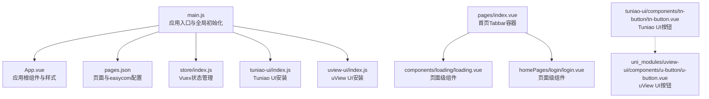
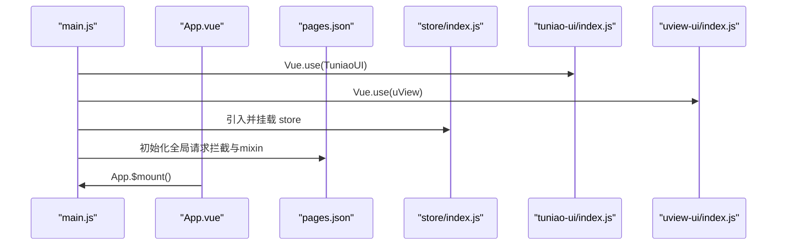
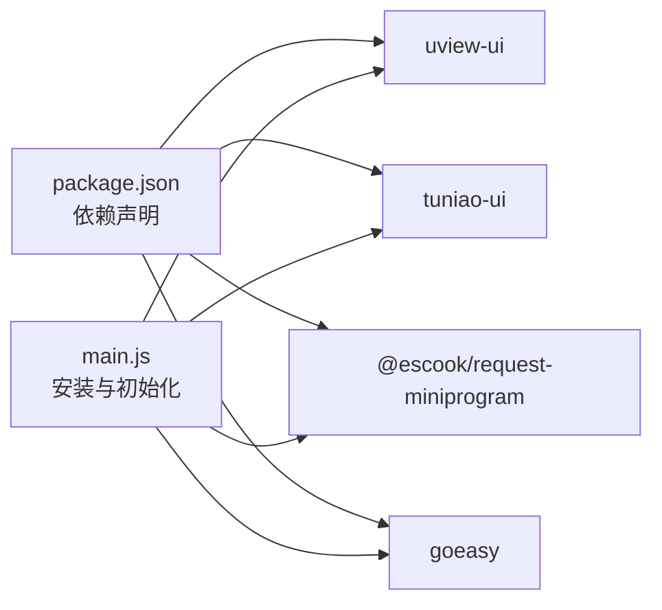

# 组件集成与使用

<cite>
**本文引用的文件**
- [main.js](file://uniapp-travel-social/main.js)
- [App.vue](file://uniapp-travel-social/App.vue)
- [pages.json](file://uniapp-travel-social/pages.json)
- [package.json](file://uniapp-travel-social/package.json)
- [store/index.js](file://uniapp-travel-social/store/index.js)
- [tuniao-ui/index.js](file://uniapp-travel-social/tuniao-ui/index.js)
- [uview-ui/index.js](file://uniapp-travel-social/uni_modules/uview-ui/index.js)
- [components/loading/loading.vue](file://uniapp-travel-social/components/loading/loading.vue)
- [components/cc-addressSet/cc-addressSet.vue](file://uniapp-travel-social/components/cc-addressSet/cc-addressSet.vue)
- [homePages/login/login.vue](file://uniapp-travel-social/homePages/login/login.vue)
- [pages/index.vue](file://uniapp-travel-social/pages/index.vue)
- [tuniao-ui/components/tn-button/tn-button.vue](file://uniapp-travel-social/tuniao-ui/components/tn-button/tn-button.vue)
- [uni_modules/uview-ui/components/u-button/u-button.vue](file://uniapp-travel-social/uni_modules/uview-ui/components/u-button/u-button.vue)
- [libs/mixin/template_page_mixin.js](file://uniapp-travel-social/libs/mixin/template_page_mixin.js)
</cite>

## 目录
1. [简介](#简介)
2. [项目结构](#项目结构)
3. [核心组件](#核心组件)
4. [架构总览](#架构总览)
5. [详细组件分析](#详细组件分析)
6. [依赖关系分析](#依赖关系分析)
7. [性能考虑](#性能考虑)
8. [故障排查指南](#故障排查指南)
9. [结论](#结论)
10. [附录](#附录)

## 简介
本文件面向在 uniapp 旅行社交小程序中集成与使用 UI 组件库的开发者，系统性说明以下内容：
- 全局配置与组件库初始化（uView、Tuniao UI）
- 按需引入与 easycom 自动注册机制
- 组件在页面中的使用方式（页面级、局部、动态）
- 组件间通信最佳实践（父子、兄弟、跨层级）
- 生命周期管理、状态共享、事件处理等高级用法
- 性能优化策略（懒加载、虚拟滚动、组件缓存）
- 常见问题与调试技巧

## 项目结构
项目采用 uniapp 标准目录组织，前端入口位于 uniapp-travel-social，包含主应用入口、页面、组件、UI 库、工具与状态管理等模块。

图表来源
- [main.js:1-118](file://uniapp-travel-social/main.js#L1-L118)
- [App.vue:1-93](file://uniapp-travel-social/App.vue#L1-L93)
- [pages.json:1-814](file://uniapp-travel-social/pages.json#L1-L814)
- [store/index.js:1-75](file://uniapp-travel-social/store/index.js#L1-L75)
- [tuniao-ui/index.js:1-71](file://uniapp-travel-social/tuniao-ui/index.js#L1-L71)
- [uview-ui/index.js:1-80](file://uniapp-travel-social/uni_modules/uview-ui/index.js#L1-L80)
- [pages/index.vue:1-166](file://uniapp-travel-social/pages/index.vue#L1-L166)
- [components/loading/loading.vue:1-246](file://uniapp-travel-social/components/loading/loading.vue#L1-L246)
- [homePages/login/login.vue:1-628](file://uniapp-travel-social/homePages/login/login.vue#L1-L628)
- [tuniao-ui/components/tn-button/tn-button.vue:1-303](file://uniapp-travel-social/tuniao-ui/components/tn-button/tn-button.vue#L1-L303)
- [uni_modules/uview-ui/components/u-button/u-button.vue:1-496](file://uniapp-travel-social/uni_modules/uview-ui/components/u-button/u-button.vue#L1-L496)

章节来源
- [main.js:1-118](file://uniapp-travel-social/main.js#L1-L118)
- [App.vue:1-93](file://uniapp-travel-social/App.vue#L1-L93)
- [pages.json:1-814](file://uniapp-travel-social/pages.json#L1-L814)

## 核心组件
- UI 库安装与全局配置
  - 在应用入口完成 UI 库安装与全局 mixin 注入，统一挂载到 Vue 实例与 uni 对象，便于全项目使用。
  - 示例路径：[main.js:10-24](file://uniapp-travel-social/main.js#L10-L24)
- easycom 自动注册
  - 通过 pages.json 的 easycom 规则，实现以“tn-”“u-”开头的组件自动解析与按需渲染，减少显式导入。
  - 示例路径：[pages.json:2-5](file://uniapp-travel-social/pages.json#L2-L5)
- 页面级组件
  - 如首页 Tabbar 容器 pages/index.vue 动态加载子页面组件，实现页面级组件的懒加载与切换。
  - 示例路径：[pages/index.vue:34-48](file://uniapp-travel-social/pages/index.vue#L34-L48)
- 局部组件
  - 登录页 homePages/login/login.vue 中直接使用 Tuniao UI 组件（如 tn-button、tn-nav-bar 等）。
  - 示例路径：[homePages/login/login.vue:4-10](file://uniapp-travel-social/homePages/login/login.vue#L4-L10)
- 动态组件
  - 首页通过 v-if 控制不同 Tab 页面的渲染，结合 scroll-view 与懒加载策略提升性能。
  - 示例路径：[pages/index.vue:3-31](file://uniapp-travel-social/pages/index.vue#L3-L31)

章节来源
- [main.js:10-24](file://uniapp-travel-social/main.js#L10-L24)
- [pages.json:2-5](file://uniapp-travel-social/pages.json#L2-L5)
- [pages/index.vue:34-48](file://uniapp-travel-social/pages/index.vue#L34-L48)
- [homePages/login/login.vue:4-10](file://uniapp-travel-social/homePages/login/login.vue#L4-L10)
- [pages/index.vue:3-31](file://uniapp-travel-social/pages/index.vue#L3-L31)

## 架构总览
应用启动流程与组件库集成的关键节点如下：

图表来源
- [main.js:10-24](file://uniapp-travel-social/main.js#L10-L24)
- [App.vue:112-118](file://uniapp-travel-social/App.vue#L112-L118)
- [pages.json:2-5](file://uniapp-travel-social/pages.json#L2-L5)
- [store/index.js:1-75](file://uniapp-travel-social/store/index.js#L1-L75)
- [tuniao-ui/index.js:59-71](file://uniapp-travel-social/tuniao-ui/index.js#L59-L71)
- [uview-ui/index.js:63-80](file://uniapp-travel-social/uni_modules/uview-ui/index.js#L63-L80)

## 详细组件分析

### 组件库安装与全局配置
- Tuniao UI
  - 提供全局 mixin、工具函数、颜色配置与组件注册；通过 Vue.use 安装，并将 $t 挂载到 Vue.prototype 与 uni 对象。
  - 示例路径：[tuniao-ui/index.js:59-71](file://uniapp-travel-social/tuniao-ui/index.js#L59-L71)
- uView UI
  - 提供全局 mixin、HTTP 请求封装、颜色渐变、防抖节流等工具；通过 Vue.use 安装，并将 $u 挂载到 Vue.prototype 与 uni 对象。
  - 示例路径：[uview-ui/index.js:63-80](file://uniapp-travel-social/uni_modules/uview-ui/index.js#L63-L80)
- 应用入口
  - 在 main.js 中完成 UI 库安装、全局请求拦截、mixin 注入与全局方法挂载。
  - 示例路径：[main.js:10-24](file://uniapp-travel-social/main.js#L10-L24)

章节来源
- [tuniao-ui/index.js:59-71](file://uniapp-travel-social/tuniao-ui/index.js#L59-L71)
- [uview-ui/index.js:63-80](file://uniapp-travel-social/uni_modules/uview-ui/index.js#L63-L80)
- [main.js:10-24](file://uniapp-travel-social/main.js#L10-L24)

### easycom 自动注册机制
- 规则匹配
  - 以 “^tn-(.*)” 和 “^u-(.*)” 开头的组件名，自动映射到对应目录下的组件文件，实现按需渲染与零样板代码导入。
  - 示例路径：[pages.json:2-5](file://uniapp-travel-social/pages.json#L2-L5)
- 使用建议
  - 在模板中直接使用 tn- 或 u- 前缀组件，无需 import；若需自定义组件，可遵循相同命名规则或在 pages.json 中扩展规则。

章节来源
- [pages.json:2-5](file://uniapp-travel-social/pages.json#L2-L5)

### 页面级组件与动态渲染
- 首页 Tabbar 容器
  - 通过 v-if 控制不同 Tab 页面的渲染，结合 scroll-view 与懒加载标志位，仅在当前激活时加载对应页面。
  - 示例路径：[pages/index.vue:3-31](file://uniapp-travel-social/pages/index.vue#L3-L31)
- 生命周期联动
  - 在切换 Tab 时，根据当前索引调用对应子组件方法（如获取列表数据），并在特定页面进行鉴权跳转。
  - 示例路径：[pages/index.vue:107-141](file://uniapp-travel-social/pages/index.vue#L107-L141)

章节来源
- [pages/index.vue:3-31](file://uniapp-travel-social/pages/index.vue#L3-L31)
- [pages/index.vue:107-141](file://uniapp-travel-social/pages/index.vue#L107-L141)

### 局部组件与业务页面
- 登录页组件使用
  - 登录页直接使用 Tuniao UI 的导航栏与按钮等组件，配合模板 mixin 完成自定义导航栏信息更新与返回逻辑。
  - 示例路径：[homePages/login/login.vue:4-10](file://uniapp-travel-social/homePages/login/login.vue#L4-L10)
- 模板 mixin
  - 提供通用的导航栏信息更新与返回逻辑，简化页面开发。
  - 示例路径：[libs/mixin/template_page_mixin.js:14-59](file://uniapp-travel-social/libs/mixin/template_page_mixin.js#L14-L59)

章节来源
- [homePages/login/login.vue:4-10](file://uniapp-travel-social/homePages/login/login.vue#L4-L10)
- [libs/mixin/template_page_mixin.js:14-59](file://uniapp-travel-social/libs/mixin/template_page_mixin.js#L14-L59)

### 组件间通信最佳实践
- 父子组件通信
  - 子组件通过 $emit 向父组件传递事件（如 cc-addressSet.vue 的 editClick、chooseClick），父组件在模板中绑定相应事件处理函数。
  - 示例路径：[components/cc-addressSet/cc-addressSet.vue:54-61](file://uniapp-travel-social/components/cc-addressSet/cc-addressSet.vue#L54-L61)
- 兄弟组件通信
  - 通过公共父组件作为中介，利用 props 向子组件传递数据，或通过事件向上冒泡后向下分发。
  - 示例路径：[pages/index.vue:42-48](file://uniapp-travel-social/pages/index.vue#L42-L48)
- 跨层级通信
  - 使用全局状态管理（Vuex）或全局工具（uni.$t/$u）在任意层级共享数据与方法。
  - 示例路径：[store/index.js:32-75](file://uniapp-travel-social/store/index.js#L32-L75)

章节来源
- [components/cc-addressSet/cc-addressSet.vue:54-61](file://uniapp-travel-social/components/cc-addressSet/cc-addressSet.vue#L54-L61)
- [pages/index.vue:42-48](file://uniapp-travel-social/pages/index.vue#L42-L48)
- [store/index.js:32-75](file://uniapp-travel-social/store/index.js#L32-L75)

### 生命周期管理、状态共享与事件处理
- 生命周期
  - 在页面 onLoad/onShow 等生命周期中进行数据拉取与状态更新，避免在组件 created 中进行异步操作导致的渲染问题。
  - 示例路径：[pages/index.vue:90-97](file://uniapp-travel-social/pages/index.vue#L90-L97)
- 状态共享
  - 通过 Vuex 管理用户信息、导航栏高度等全局状态，并提供统一的 mutations 接口进行持久化存储。
  - 示例路径：[store/index.js:32-75](file://uniapp-travel-social/store/index.js#L32-L75)
- 事件处理
  - 组件内部通过 props 与 $emit 实现事件解耦；页面中通过事件修饰符与防抖节流优化交互体验。
  - 示例路径：[tuniao-ui/components/tn-button/tn-button.vue:234-255](file://uniapp-travel-social/tuniao-ui/components/tn-button/tn-button.vue#L234-L255)

章节来源
- [pages/index.vue:90-97](file://uniapp-travel-social/pages/index.vue#L90-L97)
- [store/index.js:32-75](file://uniapp-travel-social/store/index.js#L32-L75)
- [tuniao-ui/components/tn-button/tn-button.vue:234-255](file://uniapp-travel-social/tuniao-ui/components/tn-button/tn-button.vue#L234-L255)

### 组件库对比与选择
- Tuniao UI 按钮（tn-button）
  - 支持多种形状、尺寸、阴影与镂空样式，内置防重复点击与开放能力事件透传。
  - 示例路径：[tuniao-ui/components/tn-button/tn-button.vue:1-303](file://uniapp-travel-social/tuniao-ui/components/tn-button/tn-button.vue#L1-L303)
- uView UI 按钮（u-button）
  - 支持渐变色背景、图标、loading 状态与多平台兼容（含 NVUE），提供丰富的 props 与样式变量。
  - 示例路径：[uni_modules/uview-ui/components/u-button/u-button.vue:1-496](file://uniapp-travel-social/uni_modules/uview-ui/components/u-button/u-button.vue#L1-L496)

章节来源
- [tuniao-ui/components/tn-button/tn-button.vue:1-303](file://uniapp-travel-social/tuniao-ui/components/tn-button/tn-button.vue#L1-L303)
- [uni_modules/uview-ui/components/u-button/u-button.vue:1-496](file://uniapp-travel-social/uni_modules/uview-ui/components/u-button/u-button.vue#L1-L496)

## 依赖关系分析
- 应用依赖
  - 项目依赖 @dcloudio/uni-app、uview-ui、goeasy、@escook/request-miniprogram 等，分别用于框架、UI、IM 与网络请求。
  - 示例路径：[package.json:15-21](file://uniapp-travel-social/package.json#L15-L21)
- 组件依赖
  - 页面通过 easycom 自动解析组件，无需显式 import；组件内部依赖各自 mixin 与工具函数。
  - 示例路径：[pages.json:2-5](file://uniapp-travel-social/pages.json#L2-L5)

图表来源
- [package.json:15-21](file://uniapp-travel-social/package.json#L15-L21)
- [main.js:10-24](file://uniapp-travel-social/main.js#L10-L24)

章节来源
- [package.json:15-21](file://uniapp-travel-social/package.json#L15-L21)
- [main.js:10-24](file://uniapp-travel-social/main.js#L10-L24)

## 性能考虑
- 懒加载与按需渲染
  - 使用 v-if 控制页面级组件的渲染时机，结合 scroll-view 与懒加载标志位，降低首屏渲染压力。
  - 示例路径：[pages/index.vue:3-31](file://uniapp-travel-social/pages/index.vue#L3-L31)
- 组件缓存
  - 对频繁切换但数据稳定的页面，可在路由层面开启缓存策略，减少重复实例化与数据拉取。
  - 示例路径：[pages/index.vue:107-141](file://uniapp-travel-social/pages/index.vue#L107-L141)
- 事件节流与去抖
  - 在高频交互组件（如按钮）中使用节流/去抖，避免重复触发与资源浪费。
  - 示例路径：[uni_modules/uview-ui/components/u-button/u-button.vue:266-274](file://uniapp-travel-social/uni_modules/uview-ui/components/u-button/u-button.vue#L266-L274)
- 虚拟滚动
  - 对长列表场景，建议采用虚拟滚动方案（如 uni_modules/liu-indexed-list 等第三方组件）以降低 DOM 节点数量。
  - 示例路径：[pages.json:1-814](file://uniapp-travel-social/pages.json#L1-L814)

章节来源
- [pages/index.vue:3-31](file://uniapp-travel-social/pages/index.vue#L3-L31)
- [pages/index.vue:107-141](file://uniapp-travel-social/pages/index.vue#L107-L141)
- [uni_modules/uview-ui/components/u-button/u-button.vue:266-274](file://uniapp-travel-social/uni_modules/uview-ui/components/u-button/u-button.vue#L266-L274)
- [pages.json:1-814](file://uniapp-travel-social/pages.json#L1-L814)

## 故障排查指南
- 组件未生效或样式异常
  - 检查 pages.json 的 easycom 规则是否正确匹配组件名与路径。
  - 示例路径：[pages.json:2-5](file://uniapp-travel-social/pages.json#L2-L5)
- 请求拦截与鉴权
  - 若接口返回 401，全局拦截器会清除本地 token 并跳转登录页，检查后端返回与本地存储状态。
  - 示例路径：[main.js:43-56](file://uniapp-travel-social/main.js#L43-L56)
- 导航栏信息不一致
  - 使用模板 mixin 的 updateCustomBarInfo 方法更新状态栏与自定义导航栏高度，确保在 onLoad 中调用。
  - 示例路径：[libs/mixin/template_page_mixin.js:37-58](file://uniapp-travel-social/libs/mixin/template_page_mixin.js#L37-L58)
- IM 通知点击跳转
  - 检查 GoEasy 初始化与 onClickNotification 回调逻辑，确保当前路由与目标路由一致时不再重复跳转。
  - 示例路径：[main.js:85-111](file://uniapp-travel-social/main.js#L85-L111)

章节来源
- [pages.json:2-5](file://uniapp-travel-social/pages.json#L2-L5)
- [main.js:43-56](file://uniapp-travel-social/main.js#L43-L56)
- [libs/mixin/template_page_mixin.js:37-58](file://uniapp-travel-social/libs/mixin/template_page_mixin.js#L37-L58)
- [main.js:85-111](file://uniapp-travel-social/main.js#L85-L111)

## 结论
本项目通过 easycom 与 UI 库安装实现了高效的组件集成与按需渲染；借助 Vuex 与全局 mixin 完成状态共享与生命周期管理；在页面级组件与局部组件中灵活运用父子通信与跨层级通信，满足复杂业务场景需求。结合懒加载、事件节流与虚拟滚动等策略，可显著提升应用性能与用户体验。

## 附录
- 组件使用清单
  - 页面级组件：pages/index.vue 中的子页面容器与懒加载控制
  - 局部组件：homePages/login/login.vue 中的 tn-button、tn-nav-bar 等
  - 自定义组件：components/loading/loading.vue、components/cc-addressSet/cc-addressSet.vue
- 常用工具
  - $t/$u 工具：统一挂载于 Vue.prototype 与 uni 对象，提供颜色、消息、UUID、防抖、节流等能力
  - 示例路径：[tuniao-ui/index.js:57-66](file://uniapp-travel-social/tuniao-ui/index.js#L57-L66)，[uview-ui/index.js:61-75](file://uniapp-travel-social/uni_modules/uview-ui/index.js#L61-L75)

章节来源
- [pages/index.vue:34-48](file://uniapp-travel-social/pages/index.vue#L34-L48)
- [homePages/login/login.vue:4-10](file://uniapp-travel-social/homePages/login/login.vue#L4-L10)
- [components/loading/loading.vue:1-246](file://uniapp-travel-social/components/loading/loading.vue#L1-L246)
- [components/cc-addressSet/cc-addressSet.vue:1-193](file://uniapp-travel-social/components/cc-addressSet/cc-addressSet.vue#L1-L193)
- [tuniao-ui/index.js:57-66](file://uniapp-travel-social/tuniao-ui/index.js#L57-L66)
- [uview-ui/index.js:61-75](file://uniapp-travel-social/uni_modules/uview-ui/index.js#L61-L75)