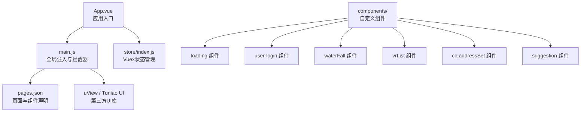
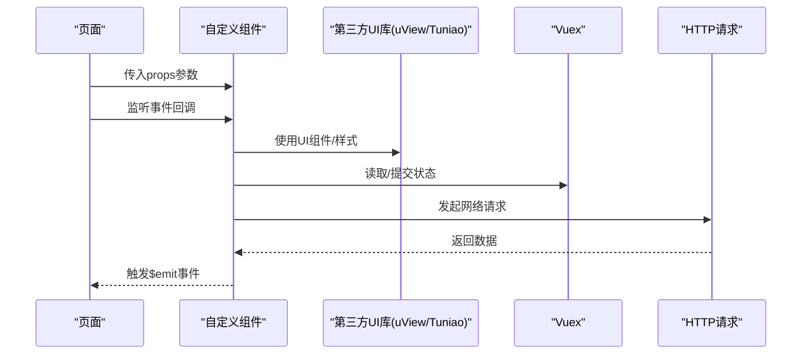
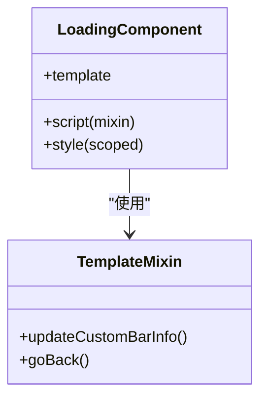
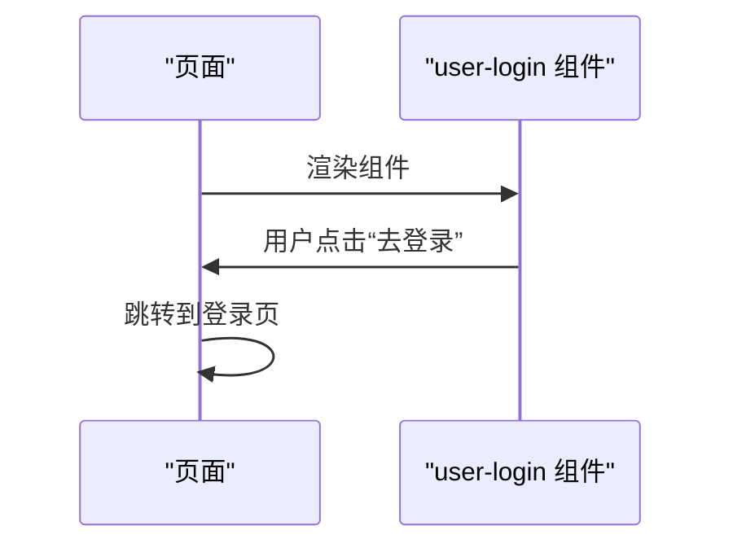
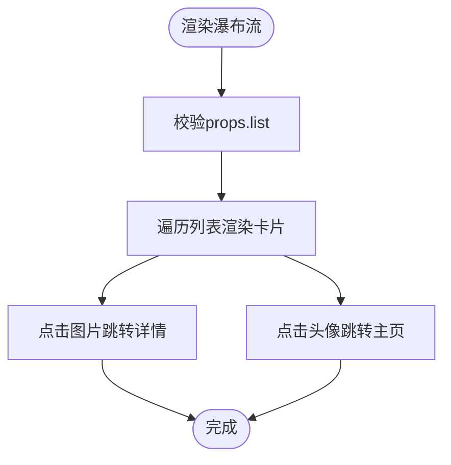
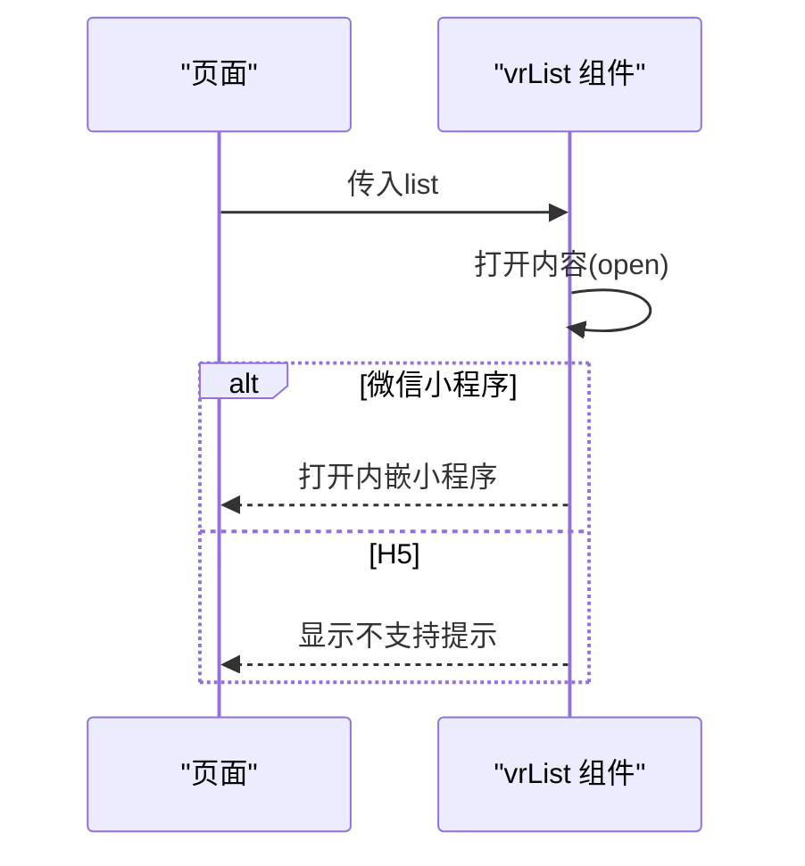
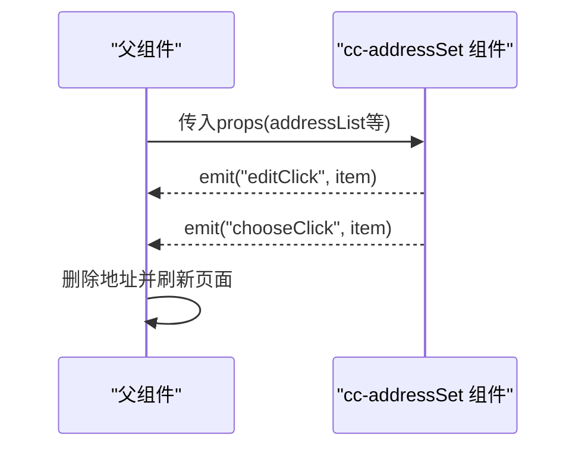
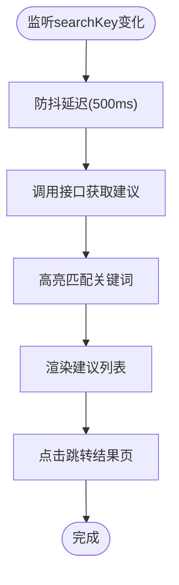
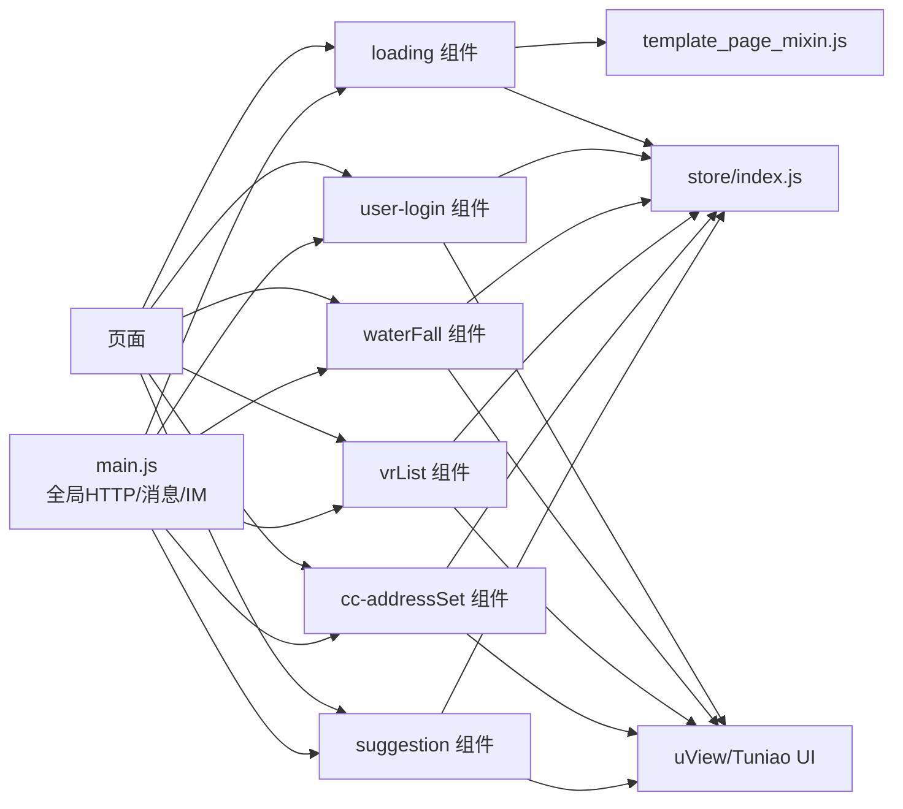

# 自定义组件开发

<cite>
**本文引用的文件**
- [loading.vue](file://uniapp-travel-social/components/loading/loading.vue)
- [user-login.vue](file://uniapp-travel-social/components/user-login/user-login.vue)
- [waterFall.vue](file://uniapp-travel-social/components/waterFall/waterFall.vue)
- [vrList.vue](file://uniapp-travel-social/components/vrList/vrList.vue)
- [cc-addressSet.vue](file://uniapp-travel-social/components/cc-addressSet/cc-addressSet.vue)
- [suggestion.vue](file://uniapp-travel-social/components/suggestion/suggestion.vue)
- [template_page_mixin.js](file://uniapp-travel-social/libs/mixin/template_page_mixin.js)
- [util.js](file://uniapp-travel-social/utils/util.js)
- [main.js](file://uniapp-travel-social/main.js)
- [pages.json](file://uniapp-travel-social/pages.json)
- [App.vue](file://uniapp-travel-social/App.vue)
- [index.js](file://uniapp-travel-social/store/index.js)
- [loading.vue（首页）](file://uniapp-travel-social/homePages/loading.vue)
- [login.vue（登录页）](file://uniapp-travel-social/homePages/login/login.vue)
</cite>

## 目录
1. [引言](#引言)
2. [项目结构](#项目结构)
3. [核心组件](#核心组件)
4. [架构总览](#架构总览)
5. [详细组件分析](#详细组件分析)
6. [依赖关系分析](#依赖关系分析)
7. [性能考虑](#性能考虑)
8. [故障排查指南](#故障排查指南)
9. [结论](#结论)
10. [附录](#附录)

## 引言
本文件面向 uniapp 旅行社交小程序的自定义组件开发，系统梳理组件的设计原则、开发规范与最佳实践，覆盖 template 模板、script 脚本、style 样式三部分组织方式；重点讲解 props 属性定义、事件传递机制、插槽使用方法、组件通信模式；并结合仓库中的 loading 加载组件、user-login 登录组件、waterFall 瀑布流组件等实例，说明组件的复用性设计、可配置性实现与样式隔离处理；最后给出组件测试、调试与性能优化建议。

## 项目结构
uniapp-travel-social 采用“页面+组件”分层组织，组件集中于 components 目录，页面位于 pages.json 声明的各子包中。全局通过 main.js 注入第三方 UI 库与全局 http 请求、消息提示等能力，并在 App.vue 中统一初始化系统信息与导航栏高度。

图表来源
- [App.vue:1-93](file://uniapp-travel-social/App.vue#L1-L93)
- [main.js:1-118](file://uniapp-travel-social/main.js#L1-L118)
- [pages.json:1-800](file://uniapp-travel-social/pages.json#L1-L800)
- [index.js:1-75](file://uniapp-travel-social/store/index.js#L1-L75)

章节来源
- [App.vue:1-93](file://uniapp-travel-social/App.vue#L1-L93)
- [main.js:1-118](file://uniapp-travel-social/main.js#L1-L118)
- [pages.json:1-800](file://uniapp-travel-social/pages.json#L1-L800)
- [index.js:1-75](file://uniapp-travel-social/store/index.js#L1-L75)

## 核心组件
本节聚焦三个典型自定义组件：loading 加载组件、user-login 登录组件、waterFall 瀑布流组件。它们分别体现了动画加载、交互引导与数据展示的典型场景。

- loading 组件
  - 设计要点：纯视觉动画，无业务逻辑，通过 scoped 样式与外部样式解耦，便于复用。
  - 结构：template 使用容器与多个伪类动画元素；script 使用 mixin 处理导航栏兼容；style 使用 scoped 与外部 SCSS。
  - 参考路径：[loading.vue:1-246](file://uniapp-travel-social/components/loading/loading.vue#L1-L246)，[template_page_mixin.js:1-60](file://uniapp-travel-social/libs/mixin/template_page_mixin.js#L1-L60)

- user-login 组件
  - 设计要点：轻量交互组件，提供“去登录”按钮与提示文案，点击跳转登录页。
  - 结构：template 简洁；script 使用传统选项式 API；style scoped 隔离。
  - 参考路径：[user-login.vue:1-67](file://uniapp-travel-social/components/user-login/user-login.vue#L1-L67)

- waterFall 组件
  - 设计要点：瀑布流布局展示列表项，接收 list 数组 props，内部处理跳转与点击事件。
  - 结构：template 使用列布局；script 定义 props 与方法；style scoped。
  - 参考路径：[waterFall.vue:1-155](file://uniapp-travel-social/components/waterFall/waterFall.vue#L1-L155)

章节来源
- [loading.vue:1-246](file://uniapp-travel-social/components/loading/loading.vue#L1-L246)
- [template_page_mixin.js:1-60](file://uniapp-travel-social/libs/mixin/template_page_mixin.js#L1-L60)
- [user-login.vue:1-67](file://uniapp-travel-social/components/user-login/user-login.vue#L1-L67)
- [waterFall.vue:1-155](file://uniapp-travel-social/components/waterFall/waterFall.vue#L1-L155)

## 架构总览
自定义组件与页面的关系如下：页面通过 import 方式引入组件并在模板中使用；全局通过 easycom 机制按约定自动解析第三方 UI 组件；组件间通信主要通过 props 下传与 $emit 上抛事件实现。

图表来源
- [pages.json:2-5](file://uniapp-travel-social/pages.json#L2-L5)
- [main.js:1-118](file://uniapp-travel-social/main.js#L1-L118)
- [index.js:1-75](file://uniapp-travel-social/store/index.js#L1-L75)

## 详细组件分析

### 组件A：loading 加载组件
- 组件职责：提供页面级加载动画，配合 mixin 处理导航栏兼容。
- props 设计：无外部 props，内部通过 mixin 提供导航栏信息。
- 事件机制：无对外事件。
- 插槽使用：无插槽。
- 样式隔离：scoped + 外部 SCSS 引入，避免污染。
- 复用性：独立动画模块，可在任意页面直接使用。

图表来源
- [loading.vue:1-246](file://uniapp-travel-social/components/loading/loading.vue#L1-L246)
- [template_page_mixin.js:1-60](file://uniapp-travel-social/libs/mixin/template_page_mixin.js#L1-L60)

章节来源
- [loading.vue:1-246](file://uniapp-travel-social/components/loading/loading.vue#L1-L246)
- [template_page_mixin.js:1-60](file://uniapp-travel-social/libs/mixin/template_page_mixin.js#L1-L60)

### 组件B：user-login 登录组件
- 组件职责：引导用户登录，点击触发跳转。
- props 设计：无。
- 事件机制：无。
- 插槽使用：无。
- 样式隔离：scoped。
- 复用性：通用登录引导，可嵌入任意需要登录态的页面。

图表来源
- [user-login.vue:1-67](file://uniapp-travel-social/components/user-login/user-login.vue#L1-L67)
- [login.vue（登录页）:1-628](file://uniapp-travel-social/homePages/login/login.vue#L1-L628)

章节来源
- [user-login.vue:1-67](file://uniapp-travel-social/components/user-login/user-login.vue#L1-L67)
- [login.vue（登录页）:1-628](file://uniapp-travel-social/homePages/login/login.vue#L1-L628)

### 组件C：waterFall 瀑布流组件
- 组件职责：以两列瀑布流展示列表项，支持点击跳转与头像点击跳转。
- props 设计：list(Array, 默认值为空字符串)。
- 事件机制：无对外事件。
- 插槽使用：无。
- 样式隔离：scoped + 外部 SCSS。
- 复用性：通用瀑布流展示，适用于图文卡片列表。

图表来源
- [waterFall.vue:1-155](file://uniapp-travel-social/components/waterFall/waterFall.vue#L1-L155)

章节来源
- [waterFall.vue:1-155](file://uniapp-travel-social/components/waterFall/waterFall.vue#L1-L155)

### 组件D：vrList VR 瀑布流组件
- 组件职责：与 waterFall 类似，但针对 VR 内容，支持平台差异打开方式（微信小程序内嵌、H5 提示）。
- props 设计：list(Array)。
- 事件机制：无。
- 插槽使用：无。
- 样式隔离：scoped。
- 复用性：VR 内容专用瀑布流，具备条件编译适配。

图表来源
- [vrList.vue:1-172](file://uniapp-travel-social/components/vrList/vrList.vue#L1-L172)

章节来源
- [vrList.vue:1-172](file://uniapp-travel-social/components/vrList/vrList.vue#L1-L172)

### 组件E：cc-addressSet 地址列表组件
- 组件职责：展示地址列表，支持默认标记、编辑与删除操作，删除通过 $emit 向父组件传递事件。
- props 设计：colors(String)、show(Boolean, 默认true)、addressList(Array)。
- 事件机制：editClick、chooseClick。
- 插槽使用：无。
- 样式隔离：scoped。
- 复用性：通用地址列表，适合订单页、结算页等场景。

图表来源
- [cc-addressSet.vue:1-193](file://uniapp-travel-social/components/cc-addressSet/cc-addressSet.vue#L1-L193)

章节来源
- [cc-addressSet.vue:1-193](file://uniapp-travel-social/components/cc-addressSet/cc-addressSet.vue#L1-L193)

### 组件F：suggestion 搜索建议组件
- 组件职责：根据输入关键字异步获取搜索建议，高亮匹配关键词并跳转结果页。
- props 设计：searchKey(String, require=true)。
- 事件机制：无。
- 插槽使用：无。
- 样式隔离：无。
- 复用性：通用搜索建议，适合搜索页、输入框下方建议面板。

图表来源
- [suggestion.vue:1-70](file://uniapp-travel-social/components/suggestion/suggestion.vue#L1-L70)

章节来源
- [suggestion.vue:1-70](file://uniapp-travel-social/components/suggestion/suggestion.vue#L1-L70)

## 依赖关系分析
- 组件与页面：页面通过 import 引入组件并在模板中使用，props 作为配置入口，$emit 作为事件出口。
- 组件与 UI 库：通过 pages.json 的 easycom 自动解析第三方 UI 组件，减少手动引入成本。
- 组件与全局能力：通过 main.js 注入的 $http、$showMsg、GoEasy 等全局能力，简化网络与 IM 能力接入。
- 组件与状态：通过 store/index.js 管理导航栏高度等跨页面共享状态，组件可通过 mixin 或直接访问。

图表来源
- [pages.json:2-5](file://uniapp-travel-social/pages.json#L2-L5)
- [main.js:1-118](file://uniapp-travel-social/main.js#L1-L118)
- [index.js:1-75](file://uniapp-travel-social/store/index.js#L1-L75)
- [template_page_mixin.js:1-60](file://uniapp-travel-social/libs/mixin/template_page_mixin.js#L1-L60)

章节来源
- [pages.json:1-800](file://uniapp-travel-social/pages.json#L1-L800)
- [main.js:1-118](file://uniapp-travel-social/main.js#L1-L118)
- [index.js:1-75](file://uniapp-travel-social/store/index.js#L1-L75)
- [template_page_mixin.js:1-60](file://uniapp-travel-social/libs/mixin/template_page_mixin.js#L1-L60)

## 性能考虑
- 动画与渲染
  - loading 组件使用 CSS 动画与伪元素，避免复杂 JS 动画，降低主线程压力。
  - waterFall/vrList 使用列布局与 break-inside: avoid，减少重排与回流。
- 数据与网络
  - suggestion 组件使用防抖（500ms）控制请求频率，避免频繁网络请求。
  - main.js 在请求前显示 loading，请求后隐藏，提升交互反馈。
- 样式与体积
  - 组件样式使用 scoped，避免全局污染；同时尽量复用第三方 UI 库样式，减少重复定义。
- 平台差异
  - vrList 对不同平台（微信小程序/H5）做条件编译处理，避免无效调用导致报错或白屏。

章节来源
- [loading.vue:1-246](file://uniapp-travel-social/components/loading/loading.vue#L1-L246)
- [waterFall.vue:1-155](file://uniapp-travel-social/components/waterFall/waterFall.vue#L1-L155)
- [vrList.vue:1-172](file://uniapp-travel-social/components/vrList/vrList.vue#L1-L172)
- [suggestion.vue:1-70](file://uniapp-travel-social/components/suggestion/suggestion.vue#L1-L70)
- [main.js:1-118](file://uniapp-travel-social/main.js#L1-L118)

## 故障排查指南
- 组件样式异常
  - 症状：组件样式被外部覆盖或未生效。
  - 排查：确认是否使用 scoped；检查 pages.json 中 easycom 是否正确解析第三方 UI 组件。
  - 参考：[pages.json:2-5](file://uniapp-travel-social/pages.json#L2-L5)
- 组件事件未触发
  - 症状：父组件监听不到子组件的 $emit。
  - 排查：核对事件名拼写与触发时机；确保父组件正确绑定事件。
  - 参考：[cc-addressSet.vue:54-61](file://uniapp-travel-social/components/cc-addressSet/cc-addressSet.vue#L54-L61)
- 网络请求失败
  - 症状：接口 401 被统一拦截并跳转登录。
  - 排查：检查 token 是否存在；查看 main.js 的 beforeRequest/afterRequest 配置。
  - 参考：[main.js:25-56](file://uniapp-travel-social/main.js#L25-L56)
- 导航栏高度不一致
  - 症状：自定义导航栏高度与实际不符。
  - 排查：确认 App.vue 初始化与 store 中状态同步；检查 mixin 的 updateCustomBarInfo 流程。
  - 参考：[App.vue:27-38](file://uniapp-travel-social/App.vue#L27-L38)，[index.js:32-70](file://uniapp-travel-social/store/index.js#L32-L70)，[template_page_mixin.js:36-58](file://uniapp-travel-social/libs/mixin/template_page_mixin.js#L36-L58)

章节来源
- [pages.json:1-800](file://uniapp-travel-social/pages.json#L1-L800)
- [cc-addressSet.vue:54-61](file://uniapp-travel-social/components/cc-addressSet/cc-addressSet.vue#L54-L61)
- [main.js:25-56](file://uniapp-travel-social/main.js#L25-L56)
- [App.vue:27-38](file://uniapp-travel-social/App.vue#L27-L38)
- [index.js:32-70](file://uniapp-travel-social/store/index.js#L32-L70)
- [template_page_mixin.js:36-58](file://uniapp-travel-social/libs/mixin/template_page_mixin.js#L36-L58)

## 结论
本项目自定义组件遵循“轻交互、强复用、样式隔离”的设计原则，通过 props 与 $emit 实现清晰的单向数据流与事件通信；借助 mixin 与全局能力，统一处理导航栏、网络请求与消息提示；通过 easycom 与第三方 UI 库降低集成成本。建议在后续开发中继续坚持：明确组件边界、保持 props 精简、事件命名规范、样式 scoped 化、平台差异条件编译与必要的性能优化策略。

## 附录
- 开发规范摘要
  - 模板：语义化标签优先，避免过度嵌套；合理使用第三方 UI 组件。
  - 脚本：优先使用组合式 API（如需），保持方法单一职责；事件命名采用 camelCase。
  - 样式：一律使用 scoped；必要时引入外部 SCSS；避免深度选择器滥用。
  - 通信：props 下传配置，$emit 上抛事件；复杂状态交由 store 管理。
  - 可配置性：提供合理的默认值与类型约束；对可选配置提供文档注释。
  - 样式隔离：组件内样式不污染全局；第三方组件样式通过 easycom 解析。
  - 测试与调试：为关键流程编写单元/集成测试；利用浏览器/开发者工具断点定位问题；对高频请求增加防抖与缓存策略。
- 工具与辅助
  - 工具函数：时间格式化、位置格式化、日期人性化处理等，便于组件内复用。
  - 参考路径：[util.js:1-74](file://uniapp-travel-social/utils/util.js#L1-L74)

章节来源
- [util.js:1-74](file://uniapp-travel-social/utils/util.js#L1-L74)