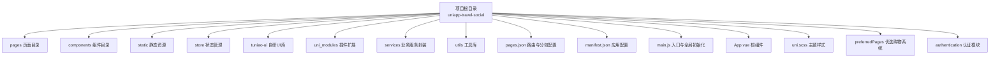
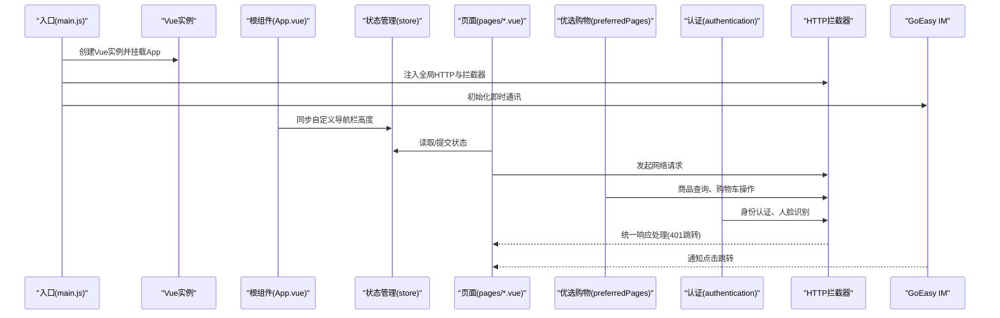
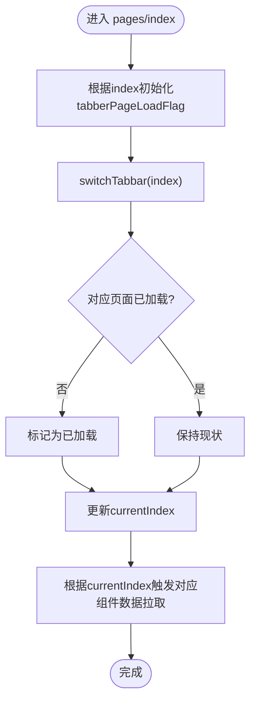
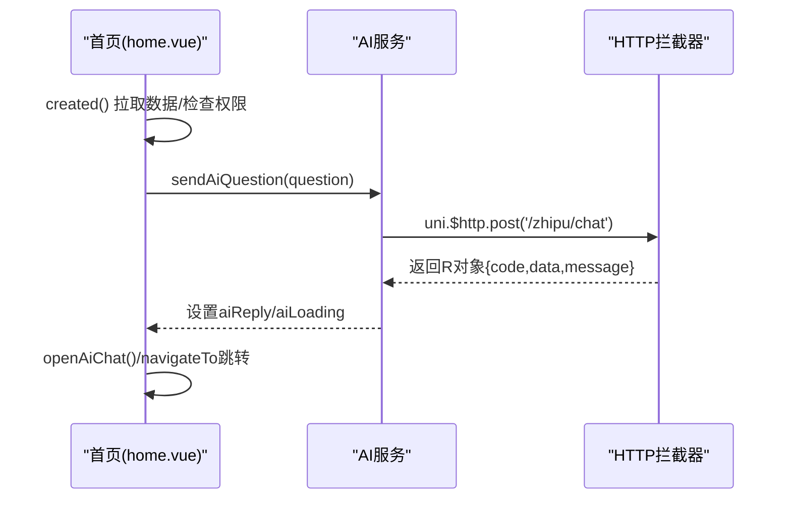
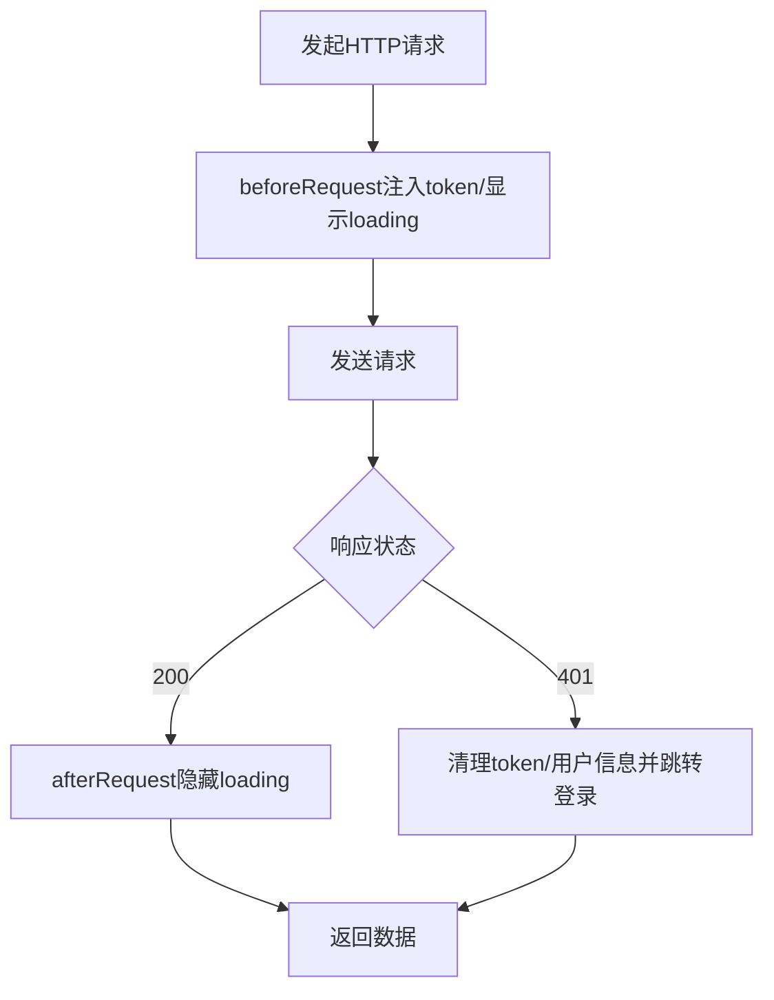
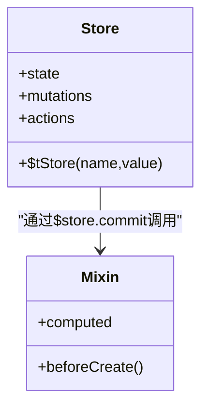
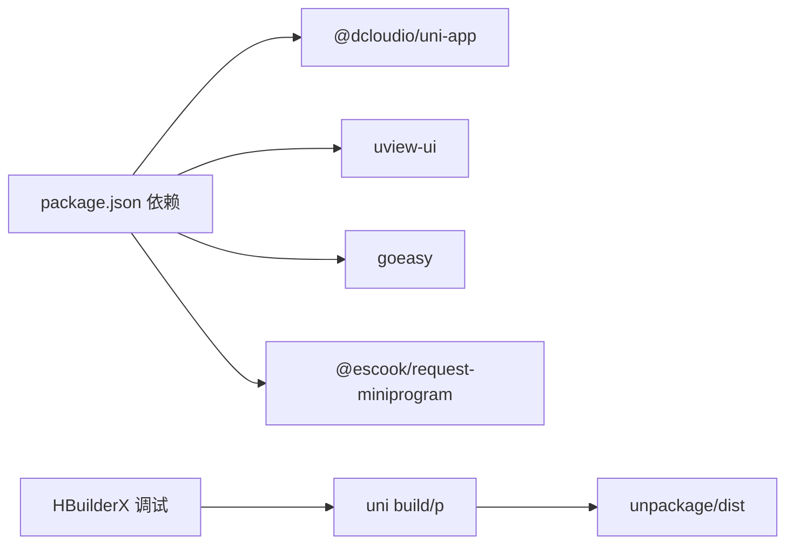

# UniApp项目结构

<cite>
**本文档引用的文件**
- [main.js](file://uniapp-travel-social/main.js)
- [App.vue](file://uniapp-travel-social/App.vue)
- [pages.json](file://uniapp-travel-social/pages.json)
- [manifest.json](file://uniapp-travel-social/manifest.json)
- [package.json](file://uniapp-travel-social/package.json)
- [store/index.js](file://uniapp-travel-social/store/index.js)
- [store/$t.mixin.js](file://uniapp-travel-social/store/$t.mixin.js)
- [tuniao-ui/index.js](file://uniapp-travel-social/tuniao-ui/index.js)
- [project.config.json](file://uniapp-travel-social/project.config.json)
- [pages/index.vue](file://uniapp-travel-social/pages/index.vue)
- [pages/home/home.vue](file://uniapp-travel-social/pages/home/home.vue)
- [pages/preferred/preferred.vue](file://uniapp-travel-social/pages/preferred/preferred.vue)
- [pages/preferredPages/cart.vue](file://uniapp-travel-social/pages/preferredPages/cart.vue)
- [preferredPages/stream/stream.vue](file://uniapp-travel-social/preferredPages/stream/stream.vue)
- [authentication/real-authentication.vue](file://uniapp-travel-social/authentication/real-authentication.vue)
- [authentication/face-authentication.vue](file://uniapp-travel-social/authentication/face-authentication.vue)
- [authentication/local-guide-apply.vue](file://uniapp-travel-social/authentication/local-guide-apply.vue)
- [components/loading/loading.vue](file://uniapp-travel-social/components/loading/loading.vue)
- [static/css/templatePage/custom_nav_bar.scss](file://uniapp-travel-social/static/css/templatePage/custom_nav_bar.scss)
- [uni.scss](file://uniapp-travel-social/uni.scss)
- [services/aiService.js](file://uniapp-travel-social/services/aiService.js)
- [utils/util.js](file://uniapp-travel-social/utils/util.js)
</cite>

## 更新摘要
**变更内容**
- 新增优选购物系统模块（preferredPages）和相关页面
- 新增认证功能模块（authentication），包含实名认证、人脸认证、本地向导申请
- 扩展pages.json中的分包配置，增加新的功能模块
- 增强项目功能完整性，支持电商购物和用户认证体系

## 目录
1. [简介](#简介)
2. [项目结构](#项目结构)
3. [核心组件](#核心组件)
4. [架构总览](#架构总览)
5. [详细组件分析](#详细组件分析)
6. [新增功能模块](#新增功能模块)
7. [依赖关系分析](#依赖关系分析)
8. [性能考虑](#性能考虑)
9. [故障排查指南](#故障排查指南)
10. [结论](#结论)
11. [附录](#附录)

## 简介
本文件面向UniApp开发者与产品团队，系统梳理"旅游攻略社交小程序"项目的工程化结构与实现要点，覆盖入口配置、根组件职责、页面路由与分包策略、应用配置与跨平台兼容、状态管理与全局插件、组件库与样式体系、以及开发规范与最佳实践。项目现已增强优选购物系统和认证功能，支持电商购物和用户身份认证，为用户提供更完整的旅行服务体验。

## 项目结构
项目采用典型的UniApp多端一体化工程组织方式，按功能域划分目录，配合pages.json声明式路由与分包策略，实现模块化与性能优化的平衡。新增的优选购物系统和认证模块进一步丰富了项目功能层次。

**图表来源**
- [pages.json:1-867](file://uniapp-travel-social/pages.json#L1-L867)
- [manifest.json:1-127](file://uniapp-travel-social/manifest.json#L1-L127)
- [main.js:1-118](file://uniapp-travel-social/main.js#L1-L118)
- [App.vue:1-93](file://uniapp-travel-social/App.vue#L1-L93)

**章节来源**
- [pages.json:1-867](file://uniapp-travel-social/pages.json#L1-L867)
- [manifest.json:1-127](file://uniapp-travel-social/manifest.json#L1-L127)
- [main.js:1-118](file://uniapp-travel-social/main.js#L1-L118)
- [App.vue:1-93](file://uniapp-travel-social/App.vue#L1-L93)

## 核心组件
本节聚焦项目关键配置文件与其职责边界，帮助快速定位入口与全局行为。

- 入口与全局初始化（main.js）
  - 创建Vue实例，挂载App根组件
  - 注册第三方库与UI库：uView、Tuniao UI
  - 初始化HTTP请求库与拦截器（含token注入、401跳转登录）
  - 初始化即时通讯（GoEasy IM），处理通知点击跳转
  - 注入全局工具函数（音频播放、消息提示）

- 根组件（App.vue）
  - 应用生命周期：启动、显示、隐藏
  - 设备信息与系统平台判定（iOS/Android/devtools）
  - 自定义导航栏高度状态同步至Vuex
  - 微信小程序更新机制（更新检测、弹窗提示、应用更新）

- 页面路由与分包（pages.json）
  - easycom规则：自动解析tn-/u-组件别名
  - 页面清单：主包与多子包（messagePages、partnerPages、interestPages、preferredPages、authentication等）
  - 平台差异化样式：不同小程序平台的滚动、回弹、导航样式差异
  - 子包内页面样式独立配置（标题、背景、导航风格）

- 应用配置（manifest.json）
  - 应用元信息：名称、版本、描述
  - 多端权限与SDK配置：位置权限、地图密钥、H5代理
  - 平台特定字段：小程序appid、H5标题与代理、编译选项

- 状态管理（store/index.js）
  - 持久化策略：本地lifeData存储、白名单变量
  - 全局状态：用户信息、版本、自定义导航栏开关与高度
  - 便捷方法：$tStore（支持深层嵌套更新）

- UI库与主题（tuniao-ui/index.js、uni.scss）
  - UI库安装与全局mixin注入
  - 主题变量与颜色体系统一管理

**章节来源**
- [main.js:1-118](file://uniapp-travel-social/main.js#L1-L118)
- [App.vue:1-93](file://uniapp-travel-social/App.vue#L1-L93)
- [pages.json:1-867](file://uniapp-travel-social/pages.json#L1-L867)
- [manifest.json:1-127](file://uniapp-travel-social/manifest.json#L1-L127)
- [store/index.js:1-75](file://uniapp-travel-social/store/index.js#L1-L75)
- [store/$t.mixin.js:1-24](file://uniapp-travel-social/store/$t.mixin.js#L1-L24)
- [tuniao-ui/index.js:1-71](file://uniapp-travel-social/tuniao-ui/index.js#L1-L71)
- [uni.scss:1-68](file://uniapp-travel-social/uni.scss#L1-L68)

## 架构总览
下图展示从入口到页面渲染、状态管理与第三方服务的整体调用链路，包括新增的优选购物和认证功能。

**图表来源**
- [main.js:1-118](file://uniapp-travel-social/main.js#L1-L118)
- [App.vue:1-93](file://uniapp-travel-social/App.vue#L1-L93)
- [store/index.js:1-75](file://uniapp-travel-social/store/index.js#L1-L75)

**章节来源**
- [main.js:1-118](file://uniapp-travel-social/main.js#L1-L118)
- [App.vue:1-93](file://uniapp-travel-social/App.vue#L1-L93)
- [store/index.js:1-75](file://uniapp-travel-social/store/index.js#L1-L75)

## 详细组件分析

### 页面容器与Tab切换（pages/index.vue）
- 功能概述
  - 多Tab容器：首页、圈子、消息、周边、我的
  - 懒加载策略：仅在需要时加载对应子页面
  - Tab切换逻辑：根据索引控制子页面显示与数据拉取
  - 权限控制：我的页面需登录态，否则跳转登录

- 关键流程
  - 初始化：根据index参数决定默认激活Tab
  - 切换：调用内部方法更新当前索引与加载标志
  - 数据联动：不同Tab进入时触发对应组件的列表/详情拉取

**图表来源**
- [pages/index.vue:90-160](file://uniapp-travel-social/pages/index.vue#L90-L160)

**章节来源**
- [pages/index.vue:1-166](file://uniapp-travel-social/pages/index.vue#L1-L166)

### 首页功能与AI交互（pages/home/home.vue）
- 功能概述
  - 自定义导航栏、轮播图、功能入口网格
  - AI旅行助手：快捷问答、输入框、推荐标签、继续对话
  - 内容区域：推荐UP、热门攻略、瀑布流游记
  - 跳转与服务：车票、酒店、美食、出行服务、保险、天气、跟拍等

- 关键流程
  - 生命周期：创建时获取系统信息、拉取数据、检查权限
  - AI问答：发送问题、处理响应、错误兜底
  - 跳转：统一tn方法封装导航

**图表来源**
- [pages/home/home.vue:450-477](file://uniapp-travel-social/pages/home/home.vue#L450-L477)
- [main.js:25-56](file://uniapp-travel-social/main.js#L25-L56)

**章节来源**
- [pages/home/home.vue:1-800](file://uniapp-travel-social/pages/home/home.vue#L1-L800)

### 全局HTTP拦截与认证（main.js）
- 功能概述
  - 全局HTTP实例注入与baseUrl配置
  - 请求前拦截：统一loading、注入token
  - 响应后拦截：401自动清理token并跳转登录
  - 全局消息提示：统一toast封装

**图表来源**
- [main.js:15-56](file://uniapp-travel-social/main.js#L15-L56)

**章节来源**
- [main.js:1-118](file://uniapp-travel-social/main.js#L1-L118)

### 状态管理与持久化（store/index.js、store/$t.mixin.js）
- 功能概述
  - 持久化：本地lifeData存储白名单变量
  - 全局方法：$tStore支持深层嵌套更新
  - 全局混入：将state映射到组件计算属性

**图表来源**
- [store/index.js:32-75](file://uniapp-travel-social/store/index.js#L32-L75)
- [store/$t.mixin.js:12-24](file://uniapp-travel-social/store/$t.mixin.js#L12-L24)

**章节来源**
- [store/index.js:1-75](file://uniapp-travel-social/store/index.js#L1-L75)
- [store/$t.mixin.js:1-24](file://uniapp-travel-social/store/$t.mixin.js#L1-L24)

### UI库与主题（tuniao-ui/index.js、uni.scss）
- 功能概述
  - UI库安装：全局mixin、原型方法挂载
  - 主题变量：颜色、字体、边距、圆角等统一管理
  - 自定义导航栏样式：模板页样式复用

**章节来源**
- [tuniao-ui/index.js:1-71](file://uniapp-travel-social/tuniao-ui/index.js#L1-L71)
- [uni.scss:1-68](file://uniapp-travel-social/uni.scss#L1-L68)
- [static/css/templatePage/custom_nav_bar.scss:1-38](file://uniapp-travel-social/static/css/templatePage/custom_nav_bar.scss#L1-L38)

### 组件与工具（components/loading/loading.vue、utils/util.js）
- 加载组件：六边形动画加载效果，适用于页面过渡与等待
- 工具函数：时间格式化、经纬度格式化、人性化时间显示

**章节来源**
- [components/loading/loading.vue:1-246](file://uniapp-travel-social/components/loading/loading.vue#L1-L246)
- [utils/util.js:1-74](file://uniapp-travel-social/utils/util.js#L1-L74)

## 新增功能模块

### 优选购物系统（preferredPages）
优选购物系统是项目新增的重要电商功能模块，提供完整的购物体验。

#### 主要页面与功能
- **购物商场首页**（pages/preferred/preferred.vue）
  - 商品浏览与筛选：支持分类、价格、销量、新品排序
  - 购物车集成：实时购物车数量显示
  - 收藏功能：支持商品收藏管理
  - 优惠券中心：优惠券领取与使用
  - 物流跟踪：商品配送状态查询

- **购物车管理**（pages/preferredPages/cart.vue）
  - 商品选择与批量操作
  - 数量调整与删除
  - 价格计算与总计
  - 结算流程

- **物流跟踪**（preferredPages/stream/stream.vue）
  - 物流状态时间线展示
  - 实时物流信息更新
  - 多状态节点标识

#### 技术特点
- 使用Tuniao UI组件库构建现代化界面
- 支持响应式布局适配不同屏幕尺寸
- 集成本地存储实现购物车持久化
- 与后端API无缝对接，支持完整的电商流程

**章节来源**
- [pages/preferred/preferred.vue:1-477](file://uniapp-travel-social/pages/preferred/preferred.vue#L1-L477)
- [pages/preferredPages/cart.vue:1-493](file://uniapp-travel-social/pages/preferredPages/cart.vue#L1-L493)
- [preferredPages/stream/stream.vue:1-213](file://uniapp-travel-social/preferredPages/stream/stream.vue#L1-L213)

### 认证功能模块（authentication）
认证模块提供完整的用户身份验证体系，确保平台安全性和合规性。

#### 认证流程页面
- **实名认证**（authentication/real-authentication.vue）
  - 身份证OCR识别：百度AI OCR接口
  - 信息提取与验证：自动识别姓名、身份证号、民族
  - 图片上传与预览
  - 认证状态展示

- **人脸认证**（authentication/face-authentication.vue）
  - 实时人脸检测：微信小程序相机接口
  - 人脸姿态校验：角度、位置、遮挡检测
  - 自动拍照与上传
  - 认证结果反馈

- **本地向导申请**（authentication/local-guide-apply.vue）
  - 城市专长申请表单
  - 个人简介填写
  - 认证状态管理
  - 等级说明与展示

#### 技术实现
- 集成百度AI OCR服务进行身份证信息识别
- 使用微信小程序相机API实现人脸检测
- 支持多步骤认证流程，提升用户体验
- 完整的错误处理和状态反馈机制

**章节来源**
- [authentication/real-authentication.vue:1-365](file://uniapp-travel-social/authentication/real-authentication.vue#L1-L365)
- [authentication/face-authentication.vue:1-273](file://uniapp-travel-social/authentication/face-authentication.vue#L1-L273)
- [authentication/local-guide-apply.vue:1-387](file://uniapp-travel-social/authentication/local-guide-apply.vue#L1-L387)

## 依赖关系分析
- 包管理与脚手架
  - 依赖：@dcloudio/uni-app、uview-ui、goeasy、@escook/request-miniprogram
  - 脚本：H5开发与构建命令

- 编译与调试
  - HBuilderX调试配置：launch.json
  - 项目配置：编译选项、打包策略、appid

**图表来源**
- [package.json:1-27](file://uniapp-travel-social/package.json#L1-L27)
- [project.config.json:1-35](file://uniapp-travel-social/project.config.json#L1-L35)

**章节来源**
- [package.json:1-27](file://uniapp-travel-social/package.json#L1-L27)
- [project.config.json:1-35](file://uniapp-travel-social/project.config.json#L1-L35)

## 性能考虑
- 分包策略
  - pages.json中大量子包（message、interest、route、hotel、food、mine、preferred、authentication等），有效降低首屏体积与首次渲染时间
  - 新增的优选购物和认证模块独立分包，避免主包臃肿
  - 子包内页面样式独立配置，避免主包样式冗余

- 懒加载与按需
  - pages/index.vue的懒加载机制，仅在切换时加载对应Tab页面
  - 组件按需引入，减少全局依赖

- 网络与缓存
  - HTTP拦截器统一loading与token注入，避免重复逻辑
  - 本地持久化白名单变量，减少重复请求
  - 购物车数据本地存储，提升用户体验

- 样式与资源
  - 主题变量集中管理，减少重复样式
  - 静态资源按目录存放，便于CDN与缓存策略

**章节来源**
- [pages.json:74-867](file://uniapp-travel-social/pages.json#L74-L867)
- [pages/index.vue:90-160](file://uniapp-travel-social/pages/index.vue#L90-L160)
- [main.js:15-56](file://uniapp-travel-social/main.js#L15-L56)
- [uni.scss:1-68](file://uniapp-travel-social/uni.scss#L1-L68)

## 故障排查指南
- 登录态失效
  - 现象：401错误后自动跳转登录
  - 处理：清理本地token与用户信息，引导重新登录
  - 参考：HTTP拦截器afterRequest逻辑

- 微信小程序更新
  - 现象：新版本检测与弹窗提示
  - 处理：确认更新后重启；若失败，提示删除后重搜
  - 参考：App.vue onLaunch中的更新管理

- H5代理与跨域
  - 现象：H5开发时接口跨域
  - 处理：检查manifest.json中H5 devServer.proxy配置
  - 参考：manifest.json h5.devServer.proxy

- UI样式冲突
  - 现象：组件样式异常或主题变量未生效
  - 处理：确认uni.scss导入顺序与变量覆盖
  - 参考：uni.scss、tuniao-ui/index.js

- 认证功能异常
  - 现象：OCR识别失败、人脸检测异常
  - 处理：检查百度AI API配置、相机权限授权
  - 参考：authentication模块相关配置

- 购物车数据丢失
  - 现象：刷新后购物车为空
  - 处理：检查本地存储权限、数据序列化
  - 参考：pages/preferredPages/cart.vue本地存储逻辑

**章节来源**
- [main.js:43-56](file://uniapp-travel-social/main.js#L43-L56)
- [App.vue:40-77](file://uniapp-travel-social/App.vue#L40-L77)
- [manifest.json:103-114](file://uniapp-travel-social/manifest.json#L103-L114)
- [uni.scss:1-68](file://uniapp-travel-social/uni.scss#L1-L68)
- [authentication/real-authentication.vue:110-164](file://uniapp-travel-social/authentication/real-authentication.vue#L110-L164)
- [pages/preferredPages/cart.vue:133-144](file://uniapp-travel-social/pages/preferredPages/cart.vue#L133-L144)

## 结论
本项目以pages.json的分包策略与多端配置为核心，结合uView与Tuniao UI的组件体系、统一的HTTP拦截与状态管理、以及完善的平台兼容处理，形成了清晰的工程化结构。新增的优选购物系统和认证模块进一步丰富了项目功能，提供了完整的电商购物和用户身份验证能力。遵循本文档的目录划分、初始化流程与开发规范，可在保证多端一致性的同时提升开发效率与维护性。

## 附录
- 开发规范建议
  - 页面命名：采用语义化目录与文件名，如pages/home、pages/message、preferredPages/cart
  - 组件命名：使用功能前缀（如cc-、tn-）避免冲突
  - 样式：优先使用主题变量，避免内联样式
  - 状态：仅持久化必要变量，避免过度存储
  - 分包：将冷启动无关页面放入子包，控制主包体积
  - 认证：实名认证与人脸认证流程需考虑用户体验和安全性

- 跨平台兼容要点
  - 平台条件编译：iOS/Android/devtools平台差异处理
  - 导航栏与安全区：自定义导航栏高度同步至Vuex
  - 地图与权限：统一配置地图密钥与权限声明
  - 相机权限：人脸认证需处理相机授权

- 常用命令
  - H5开发：npm run dev:h5
  - H5构建：npm run build:h5

**章节来源**
- [pages.json:1-867](file://uniapp-travel-social/pages.json#L1-L867)
- [manifest.json:1-127](file://uniapp-travel-social/manifest.json#L1-L127)
- [package.json:22-25](file://uniapp-travel-social/package.json#L22-L25)