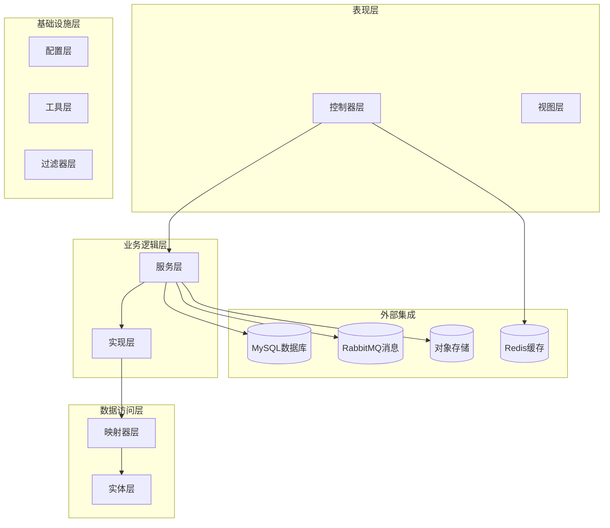
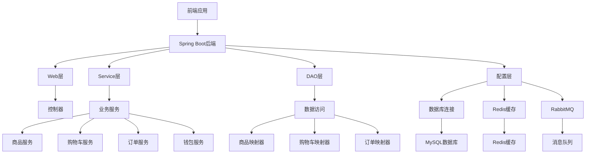
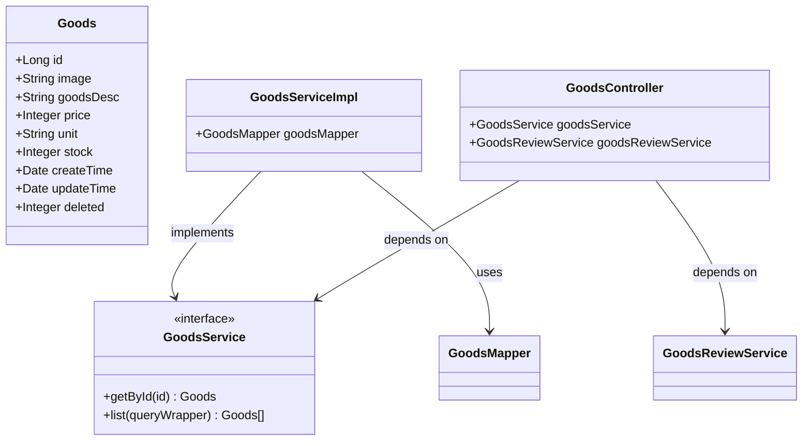
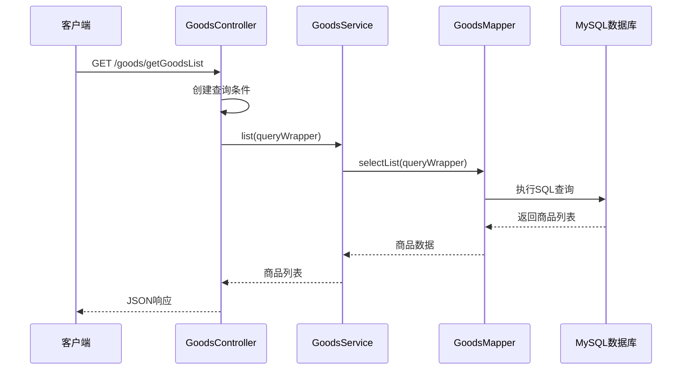
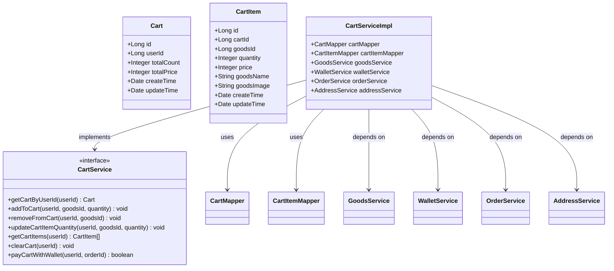
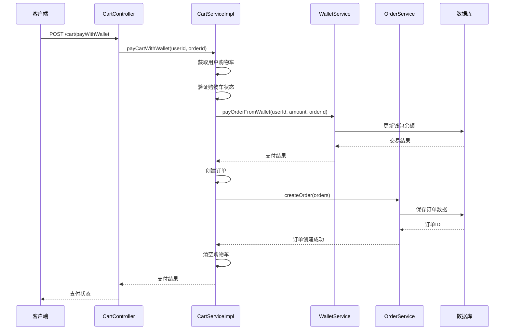
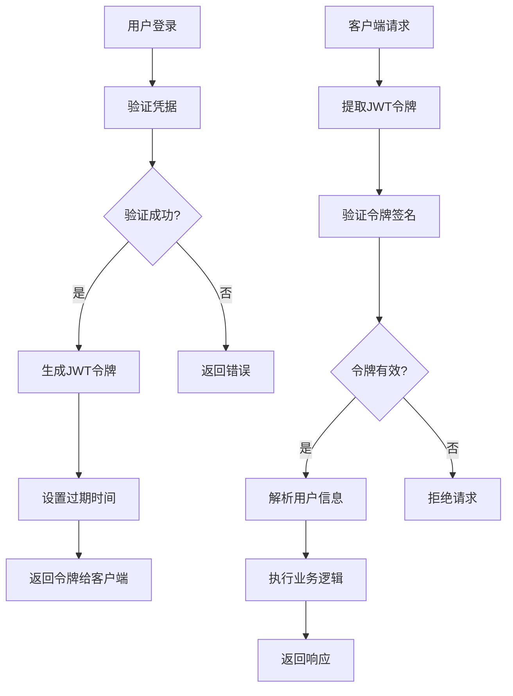
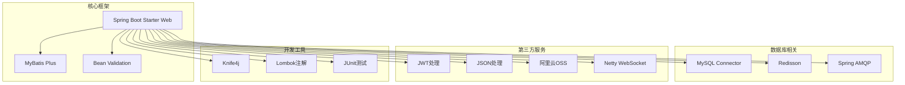

# 优选购物系统

<cite>
**本文档引用的文件**
- [TravelSocialApplication.java](file://springboot-travel-social/src/main/java/com/cxx/TravelSocialApplication.java)
- [pom.xml](file://springboot-travel-social/pom.xml)
- [application.properties](file://springboot-travel-social/src/main/resources/application.properties)
- [README.md](file://springboot-travel-social/README.md)
- [GoodsController.java](file://springboot-travel-social/src/main/java/com/cxx/controller/GoodsController.java)
- [CartController.java](file://springboot-travel-social/src/main/java/com/cxx/controller/CartController.java)
- [GoodsService.java](file://springboot-travel-social/src/main/java/com/cxx/service/GoodsService.java)
- [GoodsServiceImpl.java](file://springboot-travel-social/src/main/java/com/cxx/service/impl/GoodsServiceImpl.java)
- [CartServiceImpl.java](file://springboot-travel-social/src/main/java/com/cxx/service/impl/CartServiceImpl.java)
- [Goods.java](file://springboot-travel-social/src/main/java/com/cxx/entity/Goods.java)
- [Cart.java](file://springboot-travel-social/src/main/java/com/cxx/entity/Cart.java)
- [CartItem.java](file://springboot-travel-social/src/main/java/com/cxx/entity/CartItem.java)
- [GoodsMapper.java](file://springboot-travel-social/src/main/java/com/cxx/mapper/GoodsMapper.java)
- [JwtUtil.java](file://springboot-travel-social/src/main/java/com/cxx/utils/JwtUtil.java)
</cite>

## 目录
1. [简介](#简介)
2. [项目结构](#项目结构)
3. [核心组件](#核心组件)
4. [架构概览](#架构概览)
5. [详细组件分析](#详细组件分析)
6. [依赖关系分析](#依赖关系分析)
7. [性能考虑](#性能考虑)
8. [故障排除指南](#故障排除指南)
9. [结论](#结论)

## 简介

优选购物系统是一个基于Spring Boot开发的旅游社交电商平台，专注于提供优质的购物体验。该系统集成了多种功能模块，包括商品管理、购物车操作、订单处理、用户认证等核心业务功能。

系统采用现代化的技术栈，使用MySQL作为主要数据库，Redis进行缓存管理，RabbitMQ处理消息队列，Netty实现WebSocket实时通信。整个架构设计注重可扩展性和高性能，能够支持高并发的购物场景。

## 项目结构

项目采用标准的Spring Boot多模块架构，主要分为以下几个层次：

**图表来源**
- [TravelSocialApplication.java:16-25](file://springboot-travel-social/src/main/java/com/cxx/TravelSocialApplication.java#L16-L25)
- [pom.xml:16-182](file://springboot-travel-social/pom.xml#L16-L182)

**章节来源**
- [TravelSocialApplication.java:1-54](file://springboot-travel-social/src/main/java/com/cxx/TravelSocialApplication.java#L1-L54)
- [pom.xml:1-243](file://springboot-travel-social/pom.xml#L1-L243)

## 核心组件

### 商品管理系统

商品管理是系统的核心功能之一，提供了完整的商品生命周期管理：

- **商品查询**：支持按价格排序的商品列表查询
- **商品详情**：获取单个商品的详细信息
- **商品评价**：支持商品评价的查看和提交

### 购物车系统

购物车系统实现了完整的电商购物车功能：

- **购物车管理**：支持购物车的创建、查询、更新、删除
- **商品操作**：支持添加商品、移除商品、更新数量
- **批量操作**：支持清空购物车、批量购买
- **支付集成**：支持钱包支付方式

### 用户认证系统

系统集成了JWT令牌认证机制：

- **令牌生成**：基于用户名生成JWT令牌
- **令牌验证**：验证用户身份和权限
- **安全控制**：保护敏感操作的安全性

**章节来源**
- [GoodsController.java:21-50](file://springboot-travel-social/src/main/java/com/cxx/controller/GoodsController.java#L21-L50)
- [CartController.java:20-93](file://springboot-travel-social/src/main/java/com/cxx/controller/CartController.java#L20-L93)
- [JwtUtil.java:8-19](file://springboot-travel-social/src/main/java/com/cxx/utils/JwtUtil.java#L8-L19)

## 架构概览

系统采用分层架构设计，各层职责明确，耦合度低：

**图表来源**
- [TravelSocialApplication.java:16-25](file://springboot-travel-social/src/main/java/com/cxx/TravelSocialApplication.java#L16-L25)
- [pom.xml:78-82](file://springboot-travel-social/pom.xml#L78-L82)

**章节来源**
- [TravelSocialApplication.java:16-51](file://springboot-travel-social/src/main/java/com/cxx/TravelSocialApplication.java#L16-L51)
- [application.properties:1-64](file://springboot-travel-social/src/main/resources/application.properties#L1-L64)

## 详细组件分析

### 商品管理组件

商品管理组件实现了完整的商品业务逻辑：

**图表来源**
- [Goods.java:18-35](file://springboot-travel-social/src/main/java/com/cxx/entity/Goods.java#L18-L35)
- [GoodsService.java:6-7](file://springboot-travel-social/src/main/java/com/cxx/service/GoodsService.java#L6-L7)
- [GoodsServiceImpl.java:10-11](file://springboot-travel-social/src/main/java/com/cxx/service/impl/GoodsServiceImpl.java#L10-L11)
- [GoodsController.java:14-19](file://springboot-travel-social/src/main/java/com/cxx/controller/GoodsController.java#L14-L19)

#### 商品查询流程

**图表来源**
- [GoodsController.java:21-26](file://springboot-travel-social/src/main/java/com/cxx/controller/GoodsController.java#L21-L26)
- [GoodsServiceImpl.java:10-11](file://springboot-travel-social/src/main/java/com/cxx/service/impl/GoodsServiceImpl.java#L10-L11)

**章节来源**
- [GoodsController.java:21-50](file://springboot-travel-social/src/main/java/com/cxx/controller/GoodsController.java#L21-L50)
- [GoodsService.java:6-7](file://springboot-travel-social/src/main/java/com/cxx/service/GoodsService.java#L6-L7)
- [GoodsServiceImpl.java:10-11](file://springboot-travel-social/src/main/java/com/cxx/service/impl/GoodsServiceImpl.java#L10-L11)

### 购物车组件

购物车组件提供了完整的购物车管理功能：

**图表来源**
- [Cart.java:18-31](file://springboot-travel-social/src/main/java/com/cxx/entity/Cart.java#L18-L31)
- [CartItem.java:18-34](file://springboot-travel-social/src/main/java/com/cxx/entity/CartItem.java#L18-L34)
- [CartServiceImpl.java:28-47](file://springboot-travel-social/src/main/java/com/cxx/service/impl/CartServiceImpl.java#L28-L47)

#### 购物车支付流程

**图表来源**
- [CartController.java:80-92](file://springboot-travel-social/src/main/java/com/cxx/controller/CartController.java#L80-L92)
- [CartServiceImpl.java:210-273](file://springboot-travel-social/src/main/java/com/cxx/service/impl/CartServiceImpl.java#L210-L273)

**章节来源**
- [CartController.java:20-93](file://springboot-travel-social/src/main/java/com/cxx/controller/CartController.java#L20-L93)
- [CartServiceImpl.java:48-274](file://springboot-travel-social/src/main/java/com/cxx/service/impl/CartServiceImpl.java#L48-L274)

### 认证授权组件

系统使用JWT实现用户认证和授权：

**图表来源**
- [JwtUtil.java:11-17](file://springboot-travel-social/src/main/java/com/cxx/utils/JwtUtil.java#L11-L17)

**章节来源**
- [JwtUtil.java:8-19](file://springboot-travel-social/src/main/java/com/cxx/utils/JwtUtil.java#L8-L19)

## 依赖关系分析

系统使用Maven管理依赖，主要依赖包括：

**图表来源**
- [pom.xml:16-182](file://springboot-travel-social/pom.xml#L16-L182)

**章节来源**
- [pom.xml:16-243](file://springboot-travel-social/pom.xml#L16-L243)

## 性能考虑

系统在设计时充分考虑了性能优化：

### 数据库优化
- **索引策略**：为常用查询字段建立合适的索引
- **查询优化**：使用MyBatis Plus的条件构造器优化查询
- **连接池配置**：合理配置数据库连接池参数

### 缓存策略
- **Redis缓存**：使用Redis缓存热点数据
- **本地缓存**：结合本地缓存减少数据库压力
- **缓存失效**：设置合理的缓存过期时间

### 异步处理
- **消息队列**：使用RabbitMQ处理异步任务
- **WebSocket**：实现实时通信功能
- **线程池**：合理配置线程池参数

### 并发控制
- **分布式锁**：使用Redis实现分布式锁
- **限流策略**：防止系统过载
- **熔断机制**：保护系统稳定性

## 故障排除指南

### 常见问题及解决方案

#### 数据库连接问题
- **症状**：应用启动时报数据库连接错误
- **原因**：数据库配置不正确或网络问题
- **解决**：检查数据库连接URL、用户名、密码配置

#### 缓存连接问题
- **症状**：Redis连接失败
- **原因**：Redis服务器不可用或配置错误
- **解决**：检查Redis服务器状态和连接配置

#### 认证失败问题
- **症状**：JWT令牌验证失败
- **原因**：令牌过期或签名不匹配
- **解决**：重新生成令牌或检查签名密钥

#### 支付异常问题
- **症状**：购物车支付失败
- **原因**：钱包余额不足或系统异常
- **解决**：检查用户钱包状态和交易记录

**章节来源**
- [application.properties:1-64](file://springboot-travel-social/src/main/resources/application.properties#L1-L64)

## 结论

优选购物系统是一个功能完整、架构清晰的电商购物平台。系统采用了现代化的技术栈和设计模式，具有良好的可扩展性和维护性。

### 主要优势
- **技术架构先进**：采用Spring Boot + MyBatis Plus + MySQL + Redis + RabbitMQ的技术组合
- **功能完善**：涵盖了电商购物的完整业务流程
- **性能优化**：通过缓存、异步处理等手段优化系统性能
- **安全性考虑**：实现了JWT认证和权限控制

### 改进建议
- **监控体系**：建议增加完善的监控和日志系统
- **测试覆盖**：提高单元测试和集成测试覆盖率
- **文档完善**：补充更详细的API文档和技术文档
- **部署优化**：考虑容器化部署和微服务架构

该系统为旅游社交平台的购物功能提供了坚实的技术基础，能够满足当前的业务需求，并为未来的功能扩展奠定了良好的基础。