# 前端开发

<cite>
**本文档引用的文件**
- [App.vue](file://uniapp-travel-social/App.vue)
- [main.js](file://uniapp-travel-social/main.js)
- [pages.json](file://uniapp-travel-social/pages.json)
- [store/index.js](file://uniapp-travel-social/store/index.js)
- [store/$t.mixin.js](file://uniapp-travel-social/store/$t.mixin.js)
- [manifest.json](file://uniapp-travel-social/manifest.json)
- [package.json](file://uniapp-travel-social/package.json)
- [tuniao-ui/index.js](file://uniapp-travel-social/tuniao-ui/index.js)
- [services/aiService.js](file://uniapp-travel-social/services/aiService.js)
- [utils/util.js](file://uniapp-travel-social/utils/util.js)
- [components/loading/loading.vue](file://uniapp-travel-social/components/loading/loading.vue)
- [homePages/login/login.vue](file://uniapp-travel-social/homePages/login/login.vue)
- [pages/home/home.vue](file://uniapp-travel-social/pages/home/home.vue)
- [uni_modules/uview-ui/index.js](file://uniapp-travel-social/uni_modules/uview-ui/index.js)
- [uni_modules/uview-ui/components/u-button/u-button.vue](file://uniapp-travel-social/uni_modules/uview-ui/components/u-button/u-button.vue)
- [pages/preferred/preferred.vue](file://uniapp-travel-social/pages/preferred/preferred.vue)
- [preferredPages/product.vue](file://uniapp-travel-social/preferredPages/product.vue)
- [preferredPages/reviews.vue](file://uniapp-travel-social/preferredPages/reviews.vue)
- [preferredPages/checkout.vue](file://uniapp-travel-social/preferredPages/checkout.vue)
- [preferredPages/order.vue](file://uniapp-travel-social/preferredPages/order.vue)
- [pages/preferredPages/cart.vue](file://uniapp-travel-social/pages/preferredPages/cart.vue)
- [preferredPages/collect.vue](file://uniapp-travel-social/preferredPages/collect.vue)
- [preferredPages/coupon.vue](file://uniapp-travel-social/preferredPages/coupon.vue)
- [preferredPages/topic.vue](file://uniapp-travel-social/preferredPages/topic.vue)
- [preferredPages/stream/stream.vue](file://uniapp-travel-social/preferredPages/stream/stream.vue)
- [homePages/itinerary/itinerary.vue](file://uniapp-travel-social/homePages/itinerary/itinerary.vue)
- [homePages/itinerary/itinerary-history.vue](file://uniapp-travel-social/homePages/itinerary/itinerary-history.vue)
- [homePages/itinerary/itinerary-collab.vue](file://uniapp-travel-social/homePages/itinerary/itinerary-collab.vue)
- [activityPages/editor/editor.vue](file://uniapp-travel-social/activityPages/editor/editor.vue)
- [homePages/aiChat/aiChat.vue](file://uniapp-travel-social/homePages/aiChat/aiChat.vue)
- [homePages/bigModel/bigModel.vue](file://uniapp-travel-social/homePages/bigModel/bigModel.vue)
- [ItineraryCollabController.java](file://springboot-travel-social/src/main/java/com/cxx/controller/ItineraryCollabController.java)
- [ItineraryCollabService.java](file://springboot-travel-social/src/main/java/com/cxx/service/ItineraryCollabService.java)
- [itinerary_collab.sql](file://springboot-travel-social/src/main/resources/sql/itinerary_collab.sql)
</cite>

## 更新摘要
**变更内容**
- 新增完整的行程协作系统前端页面组件，包括行程协作、行程历史、行程协同等功能页面
- 新增AI聊天助手页面（aiChat）和大模型对话页面（bigModel），提供智能旅行规划和AI对话功能
- 新增行程协作相关的后端API接口和数据库表结构支持
- 完善行程规划功能模块，支持AI综合生成协作行程
- 新增协作房间管理、成员邀请、消息聊天等完整协作流程
- 新增活动编辑器页面（editor），支持富文本编辑和内容发布
- 新增优选购物系统页面组件，包括商品详情、评价系统、订单管理、购物车等完整电商功能链路
- 新增AI智能助手功能模块，提供多模态交互和专业化旅行服务

## 目录
1. [引言](#引言)
2. [项目结构](#项目结构)
3. [核心组件](#核心组件)
4. [架构总览](#架构总览)
5. [详细组件分析](#详细组件分析)
6. [依赖关系分析](#依赖关系分析)
7. [性能考虑](#性能考虑)
8. [故障排查指南](#故障排查指南)
9. [结论](#结论)
10. [附录](#附录)

## 引言
本文件面向前端开发者，系统性梳理 UniApp 跨平台开发框架在本项目中的使用方式与最佳实践，覆盖以下重点：
- Vue.js 2.x 在 UniApp 中的特殊用法与注意事项
- 页面路由配置、组件化开发、状态管理
- uView UI 组件库的集成与常用组件使用
- 自定义组件开发规范（设计原则、props 传递、事件触发）
- API 调用封装（请求拦截器、响应处理、错误处理）
- 样式规范与主题定制
- 移动端适配、性能优化与调试技巧

**更新** 新增完整的行程协作系统前端页面组件，包括行程协作、行程历史、行程协同等功能页面，以及相应的后端API支持和数据库表结构。行程协作系统支持多人实时聊天、AI综合生成行程、成员管理等完整功能，为用户提供更加丰富的旅行规划体验。同时新增AI聊天助手页面和大模型对话页面，提供智能旅行规划和AI对话功能，进一步丰富了应用的智能化服务能力。新增活动编辑器页面，支持富文本编辑和内容发布功能。新增优选购物系统页面组件，包括商品详情、评价系统、订单管理、购物车等完整电商功能链路，形成从商品浏览到订单管理的完整购物流程。

## 项目结构
本项目采用典型的 UniApp 工程组织方式，前端代码位于 uniapp-travel-social 目录，后端 Spring Boot 代码位于 springboot-travel-social 目录。前端工程以 pages.json 作为页面与分包配置入口，main.js 初始化全局插件与网络请求，store 提供状态管理，components 与 pages 存放业务组件与页面，uni_modules 集成第三方 UI 组件库。

```mermaid
graph TB
A["App.vue<br/>应用生命周期与全局样式"] --> B["main.js<br/>初始化与全局插件"]
B --> C["pages.json<br/>页面与分包配置"]
B --> D["store/index.js<br/>Vuex 状态管理"]
D --> E["$t.mixin.js<br/>全局状态混入"]
B --> F["uview-ui<br/>UI 组件库"]
B --> G["tuniao-ui<br/>自研 UI 套件"]
B --> H["services/aiService.js<br/>AI 服务封装"]
B --> I["utils/util.js<br/>工具函数"]
J["pages/home/home.vue<br/>首页页面"] --> K["components/loading/loading.vue<br/>加载组件"]
L["homePages/login/login.vue<br/>登录页"] --> F
M["uni_modules/uview-ui/components/u-button/u-button.vue<br/>按钮组件"]
N["pages/preferred/preferred.vue<br/>购物商场首页"]
O["preferredPages/product.vue<br/>商品详情页"]
P["preferredPages/reviews.vue<br/>商品评价页"]
Q["preferredPages/checkout.vue<br/>订单确认页"]
R["preferredPages/order.vue<br/>订单管理页"]
S["pages/preferredPages/cart.vue<br/>购物车页"]
T["preferredPages/collect.vue<br/>收藏夹页"]
U["preferredPages/coupon.vue<br/>优惠券页"]
V["preferredPages/topic.vue<br/>专题页面"]
W["preferredPages/stream/stream.vue<br/>物流信息页"]
X["homePages/itinerary/itinerary.vue<br/>行程规划页"]
Y["homePages/itinerary/itinerary-history.vue<br/>行程历史页"]
Z["homePages/itinerary/itinerary-collab.vue<br/>行程协作页"]
AA["activityPages/editor/editor.vue<br/>活动编辑器页"]
BB["homePages/aiChat/aiChat.vue<br/>AI聊天助手页"]
CC["homePages/bigModel/bigModel.vue<br/>大模型对话页"]
DD["ItineraryCollabController.java<br/>协作控制器"]
EE["ItineraryCollabService.java<br/>协作服务接口"]
FF["itinerary_collab.sql<br/>协作数据库脚本"]
```

**图表来源**
- [App.vue:1-93](file://uniapp-travel-social/App.vue#L1-L93)
- [main.js:1-118](file://uniapp-travel-social/main.js#L1-L118)
- [pages.json:1-867](file://uniapp-travel-social/pages.json#L1-L867)
- [store/index.js:1-75](file://uniapp-travel-social/store/index.js#L1-L75)
- [store/$t.mixin.js:1-24](file://uniapp-travel-social/store/$t.mixin.js#L1-L24)
- [tuniao-ui/index.js:1-71](file://uniapp-travel-social/tuniao-ui/index.js#L1-L71)
- [services/aiService.js:1-293](file://uniapp-travel-social/services/aiService.js#L1-L293)
- [utils/util.js:1-74](file://uniapp-travel-social/utils/util.js#L1-L74)
- [components/loading/loading.vue:1-246](file://uniapp-travel-social/components/loading/loading.vue#L1-L246)
- [homePages/login/login.vue:1-628](file://uniapp-travel-social/homePages/login/login.vue#L1-L628)
- [pages/home/home.vue:1-800](file://uniapp-travel-social/pages/home/home.vue#L1-L800)
- [uni_modules/uview-ui/index.js:1-80](file://uniapp-travel-social/uni_modules/uview-ui/index.js#L1-L80)
- [uni_modules/uview-ui/components/u-button/u-button.vue:1-496](file://uniapp-travel-social/uni_modules/uview-ui/components/u-button/u-button.vue#L1-L496)
- [pages/preferred/preferred.vue:1-477](file://uniapp-travel-social/pages/preferred/preferred.vue#L1-L477)
- [preferredPages/product.vue:1-1054](file://uniapp-travel-social/preferredPages/product.vue#L1-L1054)
- [preferredPages/reviews.vue:1-209](file://uniapp-travel-social/preferredPages/reviews.vue#L1-L209)
- [preferredPages/checkout.vue:1-690](file://uniapp-travel-social/preferredPages/checkout.vue#L1-L690)
- [preferredPages/order.vue:1-796](file://uniapp-travel-social/preferredPages/order.vue#L1-L796)
- [pages/preferredPages/cart.vue:1-493](file://uniapp-travel-social/pages/preferredPages/cart.vue#L1-L493)
- [preferredPages/collect.vue:1-174](file://uniapp-travel-social/preferredPages/collect.vue#L1-L174)
- [preferredPages/coupon.vue:1-154](file://uniapp-travel-social/preferredPages/coupon.vue#L1-L154)
- [preferredPages/topic.vue:1-205](file://uniapp-travel-social/preferredPages/topic.vue#L1-L205)
- [preferredPages/stream/stream.vue:1-200](file://uniapp-travel-social/preferredPages/stream/stream.vue#L1-L200)
- [homePages/itinerary/itinerary.vue:1-784](file://uniapp-travel-social/homePages/itinerary/itinerary.vue#L1-L784)
- [homePages/itinerary/itinerary-history.vue:1-287](file://uniapp-travel-social/homePages/itinerary/itinerary-history.vue#L1-L287)
- [homePages/itinerary/itinerary-collab.vue:1-487](file://uniapp-travel-social/homePages/itinerary/itinerary-collab.vue#L1-L487)
- [activityPages/editor/editor.vue:1-343](file://uniapp-travel-social/activityPages/editor/editor.vue#L1-L343)
- [homePages/aiChat/aiChat.vue:1-800](file://uniapp-travel-social/homePages/aiChat/aiChat.vue#L1-L800)
- [homePages/bigModel/bigModel.vue:1-800](file://uniapp-travel-social/homePages/bigModel/bigModel.vue#L1-L800)
- [ItineraryCollabController.java:1-139](file://springboot-travel-social/src/main/java/com/cxx/controller/ItineraryCollabController.java#L1-L139)
- [ItineraryCollabService.java:1-68](file://springboot-travel-social/src/main/java/com/cxx/service/ItineraryCollabService.java#L1-L68)
- [itinerary_collab.sql:1-60](file://springboot-travel-social/src/main/resources/sql/itinerary_collab.sql#L1-L60)

**章节来源**
- [pages.json:1-867](file://uniapp-travel-social/pages.json#L1-L867)
- [main.js:1-118](file://uniapp-travel-social/main.js#L1-L118)
- [App.vue:1-93](file://uniapp-travel-social/App.vue#L1-L93)

## 核心组件
- 应用入口与生命周期：在 App.vue 中完成系统平台识别、状态栏与自定义导航栏信息初始化、小程序更新检测等。
- 全局初始化：main.js 注册 uView 与 Tuniao UI，配置全局网络请求 $http、GoEasy 即时通讯、全局消息提示、音频播放等。
- 页面与分包：pages.json 定义页面路径、分包 root、各页面样式与导航配置，包含新增的完整电商页面生态和行程协作功能。
- 状态管理：store/index.js 提供 vuex_user、版本号、自定义导航栏开关及状态栏高度等状态；$t.mixin.js 将 store 的 state 注入到全局，简化读写。
- UI 组件：uView 与 Tuniao UI 提供丰富的基础组件与工具方法，统一主题与交互体验。
- 业务组件：components 目录下的可复用组件（如 loading）与页面组件（如 home、login、preferred、product、reviews、checkout、order、cart、collect、coupon、topic、stream、itinerary、editor、aiChat、bigModel）共同构成完整的功能链路。
- 工具与服务：utils/util.js 提供时间与位置格式化工具；services/aiService.js 提供 AI 相关接口封装。
- **新增** 行程协作系统：包含行程规划、历史记录、协作聊天等完整功能模块，支持多人实时协作和AI智能生成。
- **新增** AI智能助手：提供AI聊天助手和大模型对话功能，支持旅行规划、智能问答、多模态交互等智能化服务。
- **新增** 活动编辑器：提供富文本编辑功能，支持图片上传、格式化工具、内容发布等完整编辑流程。
- **新增** 优选购物系统：包含购物商场首页、商品详情、评价系统、订单管理、购物车、收藏夹、优惠券、专题页面、物流信息等完整电商功能链路。

**更新** 新增完整的行程协作系统前端页面组件，包括行程协作、行程历史、行程协同等功能页面，以及相应的后端API支持和数据库表结构。行程协作系统支持多人实时聊天、AI综合生成行程、成员管理等完整功能，为用户提供更加丰富的旅行规划体验。同时新增AI聊天助手页面和大模型对话页面，提供智能旅行规划和AI对话功能，进一步丰富了应用的智能化服务能力。新增活动编辑器页面，支持富文本编辑和内容发布功能。新增优选购物系统页面组件，包括商品详情、评价系统、订单管理、购物车等完整电商功能链路，形成从商品浏览到订单管理的完整购物流程。

**章节来源**
- [App.vue:1-93](file://uniapp-travel-social/App.vue#L1-L93)
- [main.js:1-118](file://uniapp-travel-social/main.js#L1-L118)
- [pages.json:1-867](file://uniapp-travel-social/pages.json#L1-L867)
- [store/index.js:1-75](file://uniapp-travel-social/store/index.js#L1-L75)
- [store/$t.mixin.js:1-24](file://uniapp-travel-social/store/$t.mixin.js#L1-L24)
- [uni_modules/uview-ui/index.js:1-80](file://uniapp-travel-social/uni_modules/uview-ui/index.js#L1-L80)
- [tuniao-ui/index.js:1-71](file://uniapp-travel-social/tuniao-ui/index.js#L1-L71)
- [utils/util.js:1-74](file://uniapp-travel-social/utils/util.js#L1-L74)
- [services/aiService.js:1-293](file://uniapp-travel-social/services/aiService.js#L1-L293)

## 架构总览
下图展示了前端应用的整体架构：应用入口负责初始化与平台适配；全局初始化负责插件注册与网络请求配置；页面与组件通过 UI 组件库与工具库协作；服务层通过封装的 API 与后端交互；电商模块形成完整的购物流程闭环，行程协作模块提供多人协作旅行规划功能，AI智能助手模块提供智能化旅行服务，活动编辑器支持内容创作。

```mermaid
graph TB
subgraph "应用层"
App["App.vue"]
Main["main.js"]
Pages["pages.json"]
end
subgraph "状态与工具"
Store["store/index.js"]
Mixin["$t.mixin.js"]
Utils["utils/util.js"]
AI["services/aiService.js"]
end
subgraph "UI 组件库"
UView["uview-ui/index.js"]
Tuniao["tuniao-ui/index.js"]
Btn["u-button.vue"]
end
subgraph "页面与组件"
Home["pages/home/home.vue"]
Login["homePages/login/login.vue"]
Loading["components/loading/loading.vue"]
Preferred["pages/preferred/preferred.vue"]
Product["preferredPages/product.vue"]
Reviews["preferredPages/reviews.vue"]
Checkout["preferredPages/checkout.vue"]
Order["preferredPages/order.vue"]
Cart["pages/preferredPages/cart.vue"]
Collect["preferredPages/collect.vue"]
Coupon["preferredPages/coupon.vue"]
Topic["preferredPages/topic.vue"]
Stream["preferredPages/stream/stream.vue"]
Itinerary["homePages/itinerary/itinerary.vue"]
ItineraryHistory["homePages/itinerary/itinerary-history.vue"]
ItineraryCollab["homePages/itinerary/itinerary-collab.vue"]
Editor["activityPages/editor/editor.vue"]
AiChat["homePages/aiChat/aiChat.vue"]
BigModel["homePages/bigModel/bigModel.vue"]
end
subgraph "后端协作服务"
CollabController["ItineraryCollabController.java"]
CollabService["ItineraryCollabService.java"]
DBSchema["itinerary_collab.sql"]
end
App --> Main
Main --> Pages
Main --> Store
Store --> Mixin
Main --> UView
Main --> Tuniao
Main --> AI
Main --> Utils
Home --> Btn
Login --> Btn
Home --> Loading
Preferred --> Btn
Product --> Btn
Reviews --> Btn
Checkout --> Btn
Order --> Btn
Cart --> Btn
Collect --> Btn
Coupon --> Btn
Topic --> Btn
Stream --> Btn
Itinerary --> Btn
ItineraryHistory --> Btn
ItineraryCollab --> Btn
Editor --> Btn
AiChat --> Btn
BigModel --> Btn
ItineraryCollab --> CollabController
CollabController --> CollabService
CollabService --> DBSchema
```

**图表来源**
- [App.vue:1-93](file://uniapp-travel-social/App.vue#L1-L93)
- [main.js:1-118](file://uniapp-travel-social/main.js#L1-L118)
- [pages.json:1-867](file://uniapp-travel-social/pages.json#L1-L867)
- [store/index.js:1-75](file://uniapp-travel-social/store/index.js#L1-L75)
- [store/$t.mixin.js:1-24](file://uniapp-travel-social/store/$t.mixin.js#L1-L24)
- [utils/util.js:1-74](file://uniapp-travel-social/utils/util.js#L1-L74)
- [services/aiService.js:1-293](file://uniapp-travel-social/services/aiService.js#L1-L293)
- [uni_modules/uview-ui/index.js:1-80](file://uniapp-travel-social/uni_modules/uview-ui/index.js#L1-L80)
- [tuniao-ui/index.js:1-71](file://uniapp-travel-social/tuniao-ui/index.js#L1-L71)
- [uni_modules/uview-ui/components/u-button/u-button.vue:1-496](file://uniapp-travel-social/uni_modules/uview-ui/components/u-button/u-button.vue#L1-L496)
- [pages/home/home.vue:1-800](file://uniapp-travel-social/pages/home/home.vue#L1-L800)
- [homePages/login/login.vue:1-628](file://uniapp-travel-social/homePages/login/login.vue#L1-L628)
- [components/loading/loading.vue:1-246](file://uniapp-travel-social/components/loading/loading.vue#L1-L246)
- [pages/preferred/preferred.vue:1-477](file://uniapp-travel-social/pages/preferred/preferred.vue#L1-L477)
- [preferredPages/product.vue:1-1054](file://uniapp-travel-social/preferredPages/product.vue#L1-L1054)
- [preferredPages/reviews.vue:1-209](file://uniapp-travel-social/preferredPages/reviews.vue#L1-L209)
- [preferredPages/checkout.vue:1-690](file://uniapp-travel-social/preferredPages/checkout.vue#L1-L690)
- [preferredPages/order.vue:1-796](file://uniapp-travel-social/preferredPages/order.vue#L1-L796)
- [pages/preferredPages/cart.vue:1-493](file://uniapp-travel-social/pages/preferredPages/cart.vue#L1-L493)
- [preferredPages/collect.vue:1-174](file://uniapp-travel-social/preferredPages/collect.vue#L1-L174)
- [preferredPages/coupon.vue:1-154](file://uniapp-travel-social/preferredPages/coupon.vue#L1-L154)
- [preferredPages/topic.vue:1-205](file://uniapp-travel-social/preferredPages/topic.vue#L1-L205)
- [preferredPages/stream/stream.vue:1-200](file://uniapp-travel-social/preferredPages/stream/stream.vue#L1-L200)
- [homePages/itinerary/itinerary.vue:1-784](file://uniapp-travel-social/homePages/itinerary/itinerary.vue#L1-L784)
- [homePages/itinerary/itinerary-history.vue:1-287](file://uniapp-travel-social/homePages/itinerary/itinerary-history.vue#L1-L287)
- [homePages/itinerary/itinerary-collab.vue:1-487](file://uniapp-travel-social/homePages/itinerary/itinerary-collab.vue#L1-L487)
- [activityPages/editor/editor.vue:1-343](file://uniapp-travel-social/activityPages/editor/editor.vue#L1-L343)
- [homePages/aiChat/aiChat.vue:1-800](file://uniapp-travel-social/homePages/aiChat/aiChat.vue#L1-L800)
- [homePages/bigModel/bigModel.vue:1-800](file://uniapp-travel-social/homePages/bigModel/bigModel.vue#L1-L800)
- [ItineraryCollabController.java:1-139](file://springboot-travel-social/src/main/java/com/cxx/controller/ItineraryCollabController.java#L1-L139)
- [ItineraryCollabService.java:1-68](file://springboot-travel-social/src/main/java/com/cxx/service/ItineraryCollabService.java#L1-L68)
- [itinerary_collab.sql:1-60](file://springboot-travel-social/src/main/resources/sql/itinerary_collab.sql#L1-L60)

## 详细组件分析

### 应用入口与生命周期（App.vue）
- 平台识别：根据系统信息设置 Vue.prototype.SystemPlatform，便于条件渲染与平台差异处理。
- 状态栏与自定义导航栏：通过工具函数获取状态栏高度与自定义导航栏高度，并写入 store，供页面使用。
- 小程序更新检测：在微信小程序平台使用 UpdateManager 实现静默更新与手动重启逻辑。

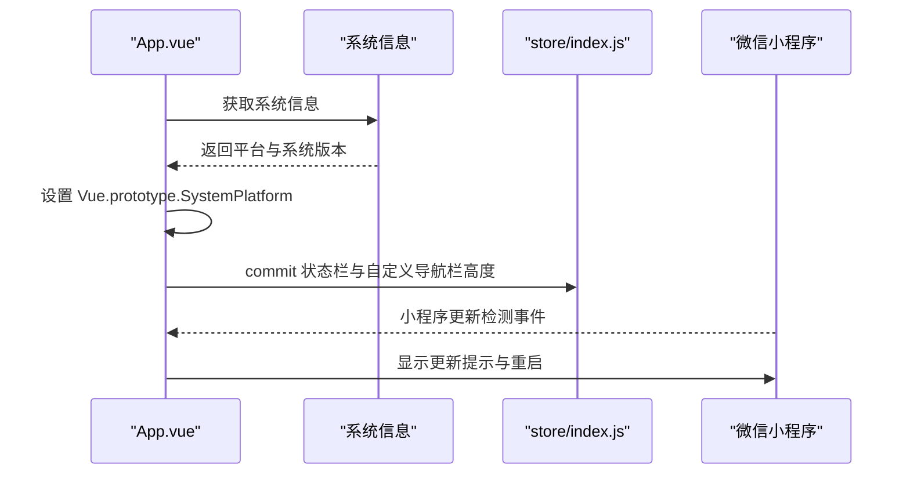

**图表来源**
- [App.vue:1-93](file://uniapp-travel-social/App.vue#L1-L93)
- [store/index.js:1-75](file://uniapp-travel-social/store/index.js#L1-L75)

**章节来源**
- [App.vue:1-93](file://uniapp-travel-social/App.vue#L1-L93)
- [store/index.js:1-75](file://uniapp-travel-social/store/index.js#L1-L75)

### 全局初始化与插件（main.js）
- 插件注册：引入并安装 uView 与 Tuniao UI，使全局可用。
- 网络请求：基于 @escook/request-miniprogram 封装 $http，设置 baseUrl 与全局请求/响应拦截器。
- 全局消息：定义 uni.$showMsg 作为统一消息提示。
- 即时通讯：初始化 GoEasy，配置通知点击跳转逻辑。
- 全局音频：提供 uni.$ScanAudio 播放音频的便捷方法。

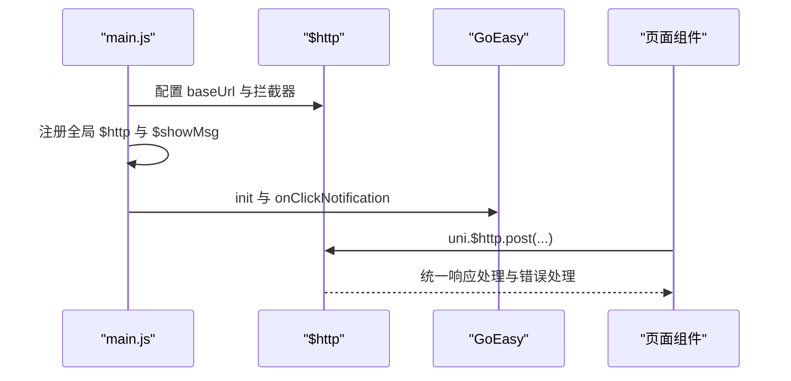

**图表来源**
- [main.js:1-118](file://uniapp-travel-social/main.js#L1-L118)

**章节来源**
- [main.js:1-118](file://uniapp-travel-social/main.js#L1-L118)

### 页面路由与分包（pages.json）
- easycom：通过正则映射自定义组件，简化引入。
- 页面与分包：定义主包 pages 与多个子包（如 messagePages、homePages、routePages 等），每个页面可设置导航标题、下拉刷新、自定义导航样式等。
- 平台差异化：针对不同小程序平台设置 bounce、disableScroll、allowsBounceVertical 等属性。
- **新增页面配置**：包含完整的电商页面生态，包括购物商场首页（preferred）、商品详情（product）、评价（reviews）、订单确认（checkout）、订单管理（order）、购物车（cart）、收藏夹（collect）、优惠券（coupon）、专题（topic）、物流信息（stream）等。同时新增行程协作相关页面（itinerary、itinerary-history、itinerary-collab）和活动编辑器页面（editor）、AI聊天助手页面（aiChat）、大模型对话页面（bigModel）。

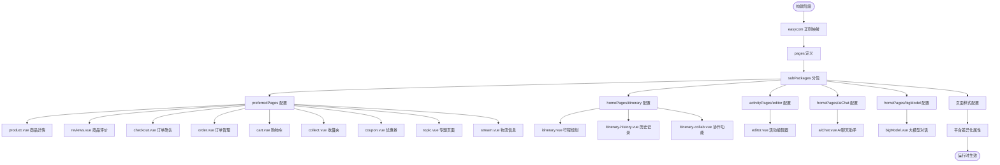

**图表来源**
- [pages.json:1-867](file://uniapp-travel-social/pages.json#L1-L867)

**章节来源**
- [pages.json:1-867](file://uniapp-travel-social/pages.json#L1-L867)

### 状态管理（store/index.js 与 $t.mixin.js）
- store/index.js：持久化存储关键状态（如用户信息、版本号、自定义导航栏开关、状态栏高度），提供 $tStore mutation 支持多层嵌套写入与本地持久化。
- $t.mixin.js：将 store 的 state 注入到组件实例，提供 this.$t.vuex(name, value) 写入与计算属性映射，简化全局状态读取。

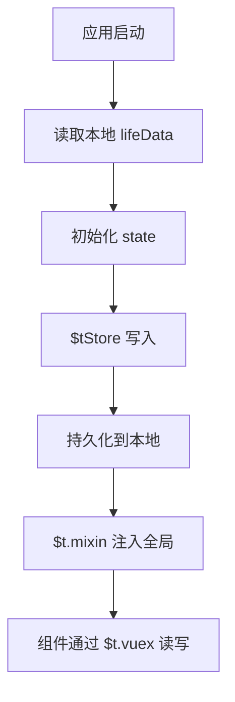

**图表来源**
- [store/index.js:1-75](file://uniapp-travel-social/store/index.js#L1-L75)
- [store/$t.mixin.js:1-24](file://uniapp-travel-social/store/$t.mixin.js#L1-L24)

**章节来源**
- [store/index.js:1-75](file://uniapp-travel-social/store/index.js#L1-L75)
- [store/$t.mixin.js:1-24](file://uniapp-travel-social/store/$t.mixin.js#L1-L24)

### UI 组件库（uView 与 Tuniao UI）
- uView：提供丰富的基础组件（如 u-button），支持多种尺寸、形状、主题与开放能力；通过 index.js 挂载到 uni.$u，提供全局过滤器与工具方法。
- Tuniao UI：提供自定义导航栏、表单、弹窗等组件与工具方法，通过 index.js 挂载到 uni.$t，提供颜色、消息、UUID、数组、测试、深度克隆等工具。

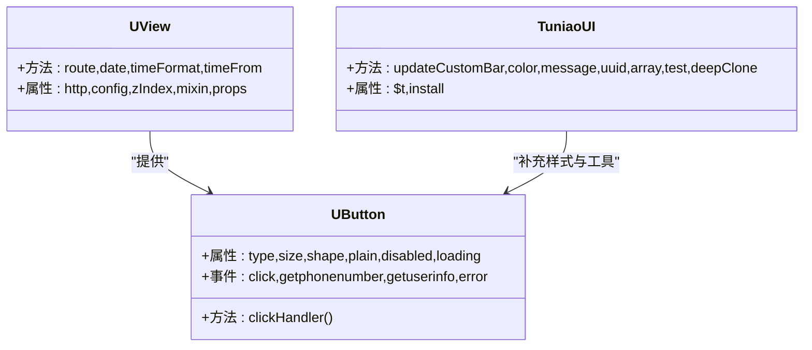

**图表来源**
- [uni_modules/uview-ui/components/u-button/u-button.vue:1-496](file://uniapp-travel-social/uni_modules/uview-ui/components/u-button/u-button.vue#L1-L496)
- [uni_modules/uview-ui/index.js:1-80](file://uniapp-travel-social/uni_modules/uview-ui/index.js#L1-L80)
- [tuniao-ui/index.js:1-71](file://uniapp-travel-social/tuniao-ui/index.js#L1-L71)

**章节来源**
- [uni_modules/uview-ui/index.js:1-80](file://uniapp-travel-social/uni_modules/uview-ui/index.js#L1-L80)
- [uni_modules/uview-ui/components/u-button/u-button.vue:1-496](file://uniapp-travel-social/uni_modules/uview-ui/components/u-button/u-button.vue#L1-L496)
- [tuniao-ui/index.js:1-71](file://uniapp-travel-social/tuniao-ui/index.js#L1-L71)

### 自定义组件开发规范（以 loading.vue 为例）
- 组件职责单一：loading.vue 专注于加载动画展示，避免与业务耦合。
- 样式隔离：使用 scoped 作用域与外部样式导入，确保组件样式不污染全局。
- 混入与复用：通过引入模板页面混入（如 template_page_mixin）复用页面级通用逻辑。
- 动画与性能：合理使用 CSS 动画与媒体查询，减少重排与重绘。

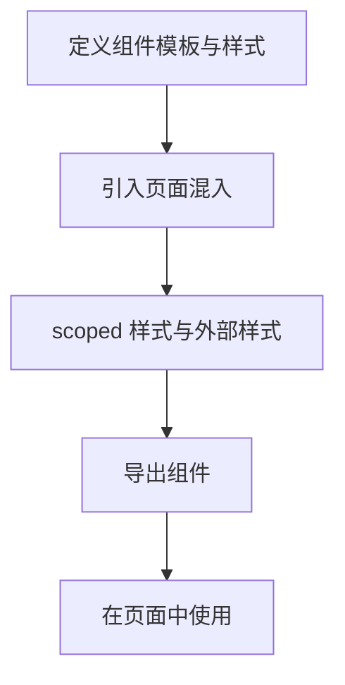

**图表来源**
- [components/loading/loading.vue:1-246](file://uniapp-travel-social/components/loading/loading.vue#L1-L246)

**章节来源**
- [components/loading/loading.vue:1-246](file://uniapp-travel-social/components/loading/loading.vue#L1-L246)

### API 调用封装与最佳实践（main.js 与 services/aiService.js）
- 全局请求拦截器：统一显示/隐藏加载、注入 token、处理 401 登录失效。
- 响应处理：统一 toast 提示与错误处理，保证用户体验一致性。
- 业务服务封装：aiService.js 提供 AI 相关接口（聊天、会话、状态检查等），统一参数校验、错误降级与返回格式。

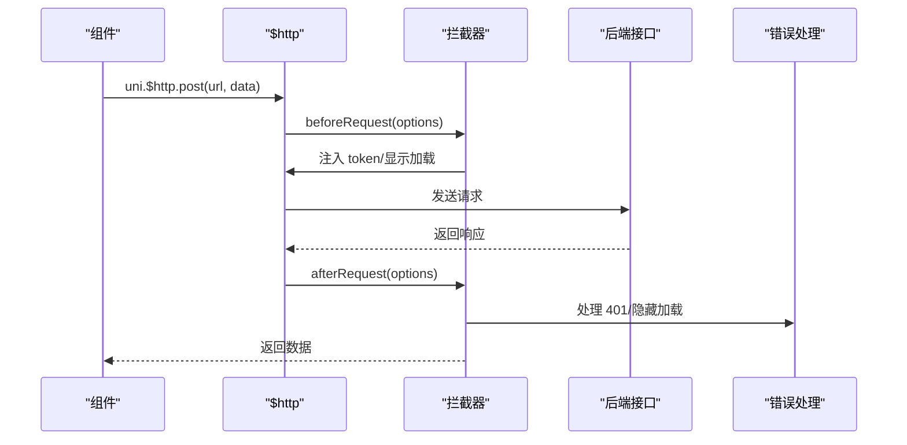

**图表来源**
- [main.js:1-118](file://uniapp-travel-social/main.js#L1-L118)
- [services/aiService.js:1-293](file://uniapp-travel-social/services/aiService.js#L1-L293)

**章节来源**
- [main.js:1-118](file://uniapp-travel-social/main.js#L1-L118)
- [services/aiService.js:1-293](file://uniapp-travel-social/services/aiService.js#L1-L293)

### 页面与组件示例（功能模块）

#### 电商功能模块

##### 购物商场首页（preferred.vue）
- 商品浏览：支持商品分类、搜索、排序、收藏功能
- 轮播广告：展示促销活动与专题内容
- 热销榜单：展示热门商品排行
- 专题入口：提供编辑精选专题页面跳转
- 购物车集成：支持一键加入购物车

##### 商品详情页（product.vue）
- 商品轮播展示：支持多图轮播与指示点显示
- 价格与库存：展示商品价格、原价对比、库存状态
- SKU 选择：支持颜色、规格、数量选择，弹窗式交互
- 地址选择：集成收货地址选择功能
- 相关推荐：展示相似商品，支持跳转查看详情
- 购买流程：支持加入购物车和立即购买

##### 商品评价页（reviews.vue）
- 评分总览：展示综合评分与星级分布
- 评价筛选：支持全部、好评、中评、差评筛选
- 评价列表：展示用户评价内容、评分、时间、图片
- Mock 数据：提供降级 mock 数据，确保页面正常显示

##### 订单确认页（checkout.vue）
- 商品清单：展示选中的商品详情
- 配送信息：集成收货地址选择与管理
- 优惠券系统：支持优惠券选择与使用
- 支付方式：支持微信支付、支付宝、余额支付
- 价格计算：自动计算商品总价、运费、优惠金额
- 订单提交：支持订单创建与状态管理

##### 订单管理页（order.vue）
- 标签导航：支持全部、待发货、运输中、待收货状态筛选
- 订单列表：展示订单详情、状态、商品信息
- 操作功能：支持确认收货、查看物流、删除订单、再次购买
- 物流追踪：集成物流信息查看功能
- 评价入口：已完成订单支持跳转评价页面

##### 购物车页（cart.vue）
- 商品管理：支持勾选、数量修改、删除操作
- 价格计算：实时计算选中商品总价
- 批量操作：支持全选、批量删除
- 跳转结算：支持一键跳转订单确认页面
- 空状态处理：购物车为空时的友好提示

##### 收藏夹页（collect.vue）
- 收藏管理：支持取消收藏、批量加购
- 商品展示：以网格形式展示收藏的商品
- 操作便捷：支持直接跳转商品详情与购物车
- 空状态处理：无收藏商品时的引导提示

##### 优惠券页（coupon.vue）
- 优惠券分类：支持未使用、已使用、已过期状态筛选
- 优惠券展示：以卡片形式展示优惠券详情
- 使用引导：支持跳转到可用商品页面
- 状态标识：已使用与已过期的视觉区分

##### 专题页面（topic.vue）
- 专题展示：以横幅形式展示专题内容
- 分类导航：支持按分类筛选商品
- 商品列表：以横向列表形式展示专题商品
- 加购功能：支持一键加入购物车

##### 物流信息页（stream.vue）
- 物流追踪：展示商品配送进度与状态
- 配送信息：显示快递公司、运单号、预计送达时间
- 历史轨迹：展示配送过程中的关键节点
- 实时更新：支持物流状态的实时刷新

#### 行程协作功能模块

##### 行程规划页（itinerary.vue）
- 行程创建：支持自定义行程名称、时间、地点
- 地点管理：添加、编辑、删除行程地点
- 时间安排：设置每个地点的停留时间和活动安排
- 地图集成：集成地图显示行程路线与地点
- 分享功能：支持分享行程给好友或生成分享链接
- **新增协作功能**：支持邀请好友加入协作，实时查看协作进度

##### 行程历史页（itinerary-history.vue）
- 历史记录：展示用户创建过的所有行程
- 状态管理：显示行程状态（进行中、已完成、已取消）
- 详情查看：支持查看历史行程的详细信息
- 重新编辑：支持基于历史行程创建新行程
- 删除功能：支持删除不需要的历史记录
- **新增协作标记**：显示协作行程与其他行程的区别

##### 行程协作页（itinerary-collab.vue）
- **核心协作聊天界面**：支持多人实时聊天，显示系统消息、AI消息和用户消息
- **成员管理**：显示协作成员头像列表，支持展开查看完整成员列表
- **邀请码系统**：显示房间邀请码，支持复制邀请码
- **AI综合生成**：房主可触发AI综合生成最终行程
- **消息类型**：支持文本消息、AI行程消息、系统消息等不同类型
- **轮询机制**：使用定时器轮询替代WebSocket，兼容小程序环境
- **权限控制**：仅房主可触发AI生成行程，其他成员可发送消息参与讨论

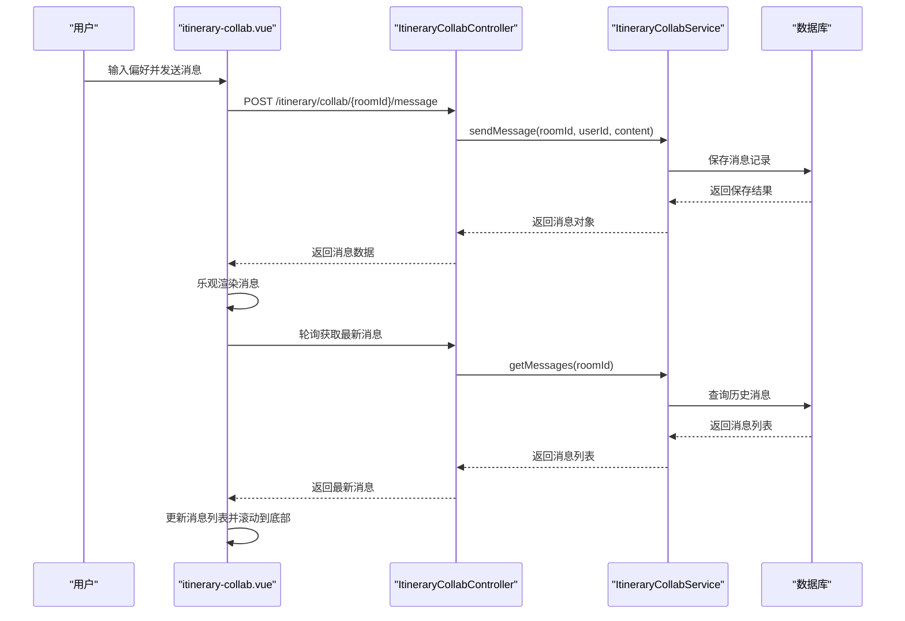

**图表来源**
- [homePages/itinerary/itinerary-collab.vue:192-317](file://uniapp-travel-social/homePages/itinerary/itinerary-collab.vue#L192-L317)
- [ItineraryCollabController.java:88-102](file://springboot-travel-social/src/main/java/com/cxx/controller/ItineraryCollabController.java#L88-L102)
- [ItineraryCollabService.java:49-49](file://springboot-travel-social/src/main/java/com/cxx/service/ItineraryCollabService.java#L49-L49)

##### 协作数据库设计
- **ai_itinerary 表扩展**：新增协作相关字段，支持个人行程与协作行程的区分
- **itinerary_collab_room 房间表**：存储协作房间基本信息，包括邀请码、创建者、目的地、天数等
- **itinerary_collab_member 成员表**：记录协作成员信息，包括用户快照、角色、偏好输入等
- **itinerary_collab_message 消息表**：存储协作房间的所有消息记录，支持消息类型和时间排序

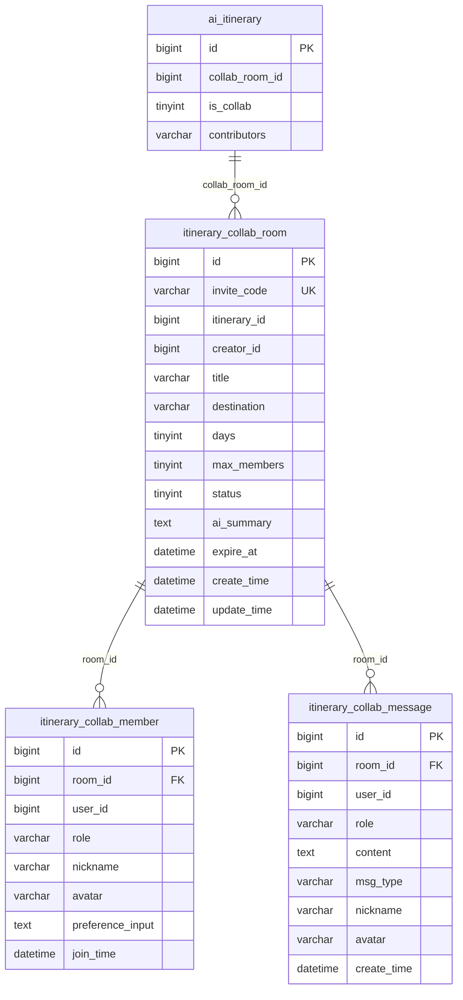

**图表来源**
- [itinerary_collab.sql:5-29](file://springboot-travel-social/src/main/resources/sql/itinerary_collab.sql#L5-L29)
- [itinerary_collab.sql:31-44](file://springboot-travel-social/src/main/resources/sql/itinerary_collab.sql#L31-L44)
- [itinerary_collab.sql:46-59](file://springboot-travel-social/src/main/resources/sql/itinerary_collab.sql#L46-L59)

#### AI智能助手功能模块

##### AI聊天助手页（aiChat.vue）
- **智能对话界面**：支持文本、图片、语音等多种输入方式
- **历史记录管理**：支持对话历史的查看、删除、重命名
- **快捷指令面板**：提供旅行相关的快捷指令和热门问题
- **多模态交互**：支持图片上传、语音识别、文件解析
- **多人协作集成**：支持创建协作房间，邀请好友共同规划行程
- **深度思考模式**：提供更详细的旅行规划和建议
- **主题切换**：支持明暗主题切换，适配不同使用场景

##### 大模型对话页（bigModel.vue）
- **简洁对话界面**：采用极简设计风格，专注对话体验
- **会话管理**：支持对话列表的搜索、删除、重命名
- **快捷问题**：提供旅行相关的预设问题，快速获取答案
- **多模式支持**：支持通用、攻略顾问、预算管家、拍摄助手、美食向导等不同模式
- **语音输入**：支持语音识别和语音输出
- **图片识别**：支持上传图片进行智能问答
- **状态监控**：实时显示AI服务状态和连接状态

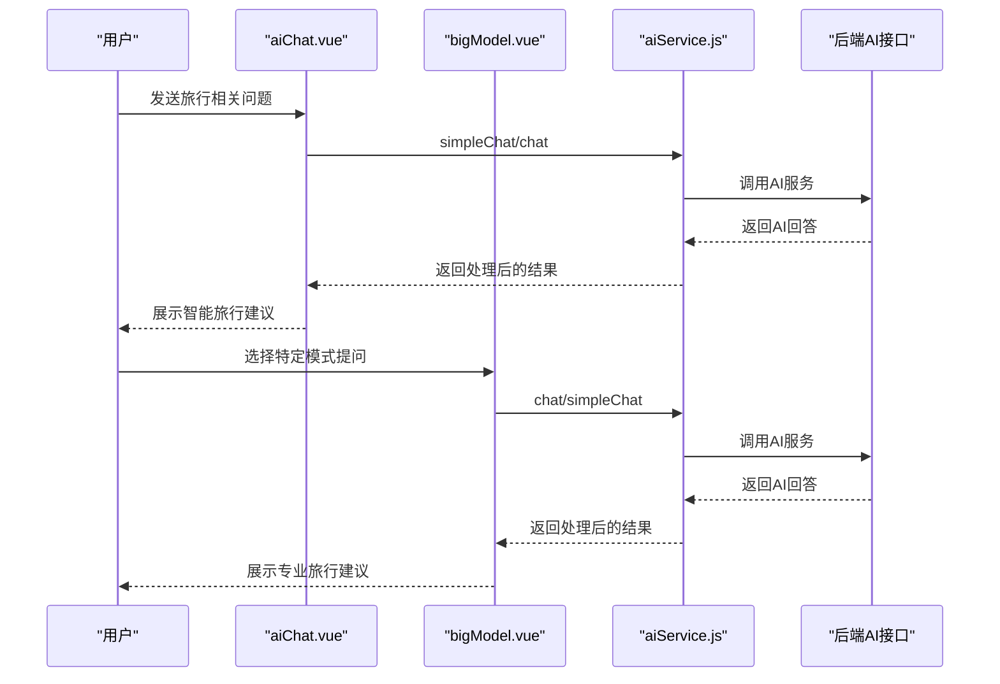

**图表来源**
- [homePages/aiChat/aiChat.vue:1-800](file://uniapp-travel-social/homePages/aiChat/aiChat.vue#L1-L800)
- [homePages/bigModel/bigModel.vue:1-800](file://uniapp-travel-social/homePages/bigModel/bigModel.vue#L1-L800)
- [services/aiService.js:1-293](file://uniapp-travel-social/services/aiService.js#L1-L293)

#### 活动编辑器功能模块

##### 活动编辑器页（editor.vue）
- 富文本编辑：支持文字、图片、视频的混合编辑
- 多媒体支持：集成图片上传、视频录制、语音输入
- 格式化工具：提供字体、颜色、对齐等格式化选项
- 预览功能：实时预览编辑效果
- 发布管理：支持草稿保存、定时发布、批量管理
- 样式模板：提供多种编辑器样式模板供选择

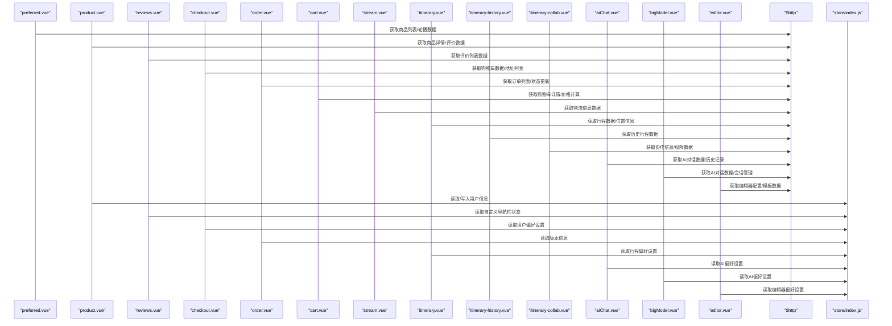

**图表来源**
- [pages/preferred/preferred.vue:1-477](file://uniapp-travel-social/pages/preferred/preferred.vue#L1-L477)
- [preferredPages/product.vue:1-1054](file://uniapp-travel-social/preferredPages/product.vue#L1-L1054)
- [preferredPages/reviews.vue:1-209](file://uniapp-travel-social/preferredPages/reviews.vue#L1-L209)
- [preferredPages/checkout.vue:1-690](file://uniapp-travel-social/preferredPages/checkout.vue#L1-L690)
- [preferredPages/order.vue:1-796](file://uniapp-travel-social/preferredPages/order.vue#L1-L796)
- [pages/preferredPages/cart.vue:1-493](file://uniapp-travel-social/pages/preferredPages/cart.vue#L1-L493)
- [preferredPages/stream/stream.vue:1-200](file://uniapp-travel-social/preferredPages/stream/stream.vue#L1-L200)
- [homePages/itinerary/itinerary.vue:1-784](file://uniapp-travel-social/homePages/itinerary/itinerary.vue#L1-L784)
- [homePages/itinerary/itinerary-history.vue:1-287](file://uniapp-travel-social/homePages/itinerary/itinerary-history.vue#L1-L287)
- [homePages/itinerary/itinerary-collab.vue:1-487](file://uniapp-travel-social/homePages/itinerary/itinerary-collab.vue#L1-L487)
- [homePages/aiChat/aiChat.vue:1-800](file://uniapp-travel-social/homePages/aiChat/aiChat.vue#L1-L800)
- [homePages/bigModel/bigModel.vue:1-800](file://uniapp-travel-social/homePages/bigModel/bigModel.vue#L1-L800)
- [activityPages/editor/editor.vue:1-343](file://uniapp-travel-social/activityPages/editor/editor.vue#L1-L343)
- [main.js:1-118](file://uniapp-travel-social/main.js#L1-L118)
- [store/index.js:1-75](file://uniapp-travel-social/store/index.js#L1-L75)

**章节来源**
- [pages/home/home.vue:1-800](file://uniapp-travel-social/pages/home/home.vue#L1-L800)
- [homePages/login/login.vue:1-628](file://uniapp-travel-social/homePages/login/login.vue#L1-L628)
- [main.js:1-118](file://uniapp-travel-social/main.js#L1-L118)
- [store/index.js:1-75](file://uniapp-travel-social/store/index.js#L1-L75)
- [pages/preferred/preferred.vue:1-477](file://uniapp-travel-social/pages/preferred/preferred.vue#L1-L477)
- [preferredPages/product.vue:1-1054](file://uniapp-travel-social/preferredPages/product.vue#L1-L1054)
- [preferredPages/reviews.vue:1-209](file://uniapp-travel-social/preferredPages/reviews.vue#L1-L209)
- [preferredPages/checkout.vue:1-690](file://uniapp-travel-social/preferredPages/checkout.vue#L1-L690)
- [preferredPages/order.vue:1-796](file://uniapp-travel-social/preferredPages/order.vue#L1-L796)
- [pages/preferredPages/cart.vue:1-493](file://uniapp-travel-social/pages/preferredPages/cart.vue#L1-L493)
- [preferredPages/collect.vue:1-174](file://uniapp-travel-social/preferredPages/collect.vue#L1-L174)
- [preferredPages/coupon.vue:1-154](file://uniapp-travel-social/preferredPages/coupon.vue#L1-L154)
- [preferredPages/topic.vue:1-205](file://uniapp-travel-social/preferredPages/topic.vue#L1-L205)
- [preferredPages/stream/stream.vue:1-200](file://uniapp-travel-social/preferredPages/stream/stream.vue#L1-L200)
- [homePages/itinerary/itinerary.vue:1-784](file://uniapp-travel-social/homePages/itinerary/itinerary.vue#L1-L784)
- [homePages/itinerary/itinerary-history.vue:1-287](file://uniapp-travel-social/homePages/itinerary/itinerary-history.vue#L1-L287)
- [homePages/itinerary/itinerary-collab.vue:1-487](file://uniapp-travel-social/homePages/itinerary/itinerary-collab.vue#L1-L487)
- [homePages/aiChat/aiChat.vue:1-800](file://uniapp-travel-social/homePages/aiChat/aiChat.vue#L1-L800)
- [homePages/bigModel/bigModel.vue:1-800](file://uniapp-travel-social/homePages/bigModel/bigModel.vue#L1-L800)
- [activityPages/editor/editor.vue:1-343](file://uniapp-travel-social/activityPages/editor/editor.vue#L1-L343)

## 依赖关系分析
- 依赖声明：package.json 声明 @dcloudio/uni-app、uview-ui、@escook/request-miniprogram、goeasy 等依赖。
- 平台配置：manifest.json 指定 Vue 版本为 2，配置地图 SDK、权限、H5 代理等。
- 运行脚本：提供 dev:h5 与 build:h5 脚本，便于 H5 端调试与构建。

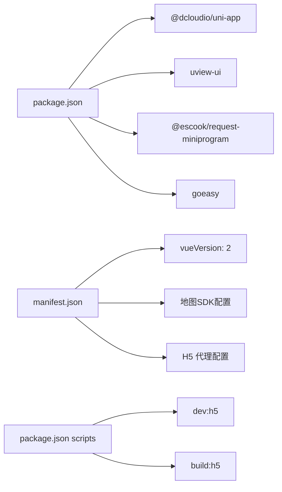

**图表来源**
- [package.json:1-27](file://uniapp-travel-social/package.json#L1-L27)
- [manifest.json:1-127](file://uniapp-travel-social/manifest.json#L1-L127)

**章节来源**
- [package.json:1-27](file://uniapp-travel-social/package.json#L1-L27)
- [manifest.json:1-127](file://uniapp-travel-social/manifest.json#L1-L127)

## 性能考虑
- 组件懒加载与分包：通过 pages.json 的 subPackages 将大模块拆分为子包，减少首屏体积。
- 图片与资源：使用合适的图片尺寸与格式，避免大图全量加载；结合懒加载组件提升首屏性能。
- 动画与重绘：减少复杂 CSS 动画与频繁重排，优先使用 transform 与 opacity。
- 网络请求：合并请求、缓存策略与节流防抖，降低请求频率与带宽占用。
- 状态持久化：store 中仅持久化必要状态，避免存储大对象导致内存压力。
- **电商页面优化**：商品详情页使用轮播图懒加载，评价页实现虚拟滚动，SKU 弹窗按需渲染，购物车支持本地存储与实时计算。
- **行程协作优化**：协作页面使用定时器轮询替代WebSocket，避免频繁连接开销；消息列表支持虚拟滚动；成员头像使用懒加载。
- **AI智能助手优化**：聊天页面支持消息类型区分与权限控制，大模型页面提供多种模式选择；语音识别与图片上传采用异步处理。
- **数据库优化**：协作相关表建立合适索引，支持房间ID、用户ID、创建时间等常用查询字段。
- **AI生成优化**：协作行程生成采用异步处理，避免阻塞用户界面；支持生成进度提示。
- **页面路由优化**：新增页面配置块需要避免重复配置，确保页面访问正常。
- **活动编辑器优化**：富文本编辑器使用 Quill 编辑器，支持图片懒加载与内容压缩，发布流程采用进度条反馈。
- **优选购物系统优化**：购物商场首页实现商品列表虚拟滚动，商品详情页使用图片懒加载，评价系统支持分页加载，订单管理支持状态筛选与缓存。

## 故障排查指南
- 登录失效：全局响应拦截器对 401 进行 token 清理与跳转，检查 token 注入与清理逻辑。
- 小程序更新：App.vue 中的更新检测需确保微信版本兼容与用户确认流程。
- 网络异常：统一 toast 提示与错误降级，检查 baseUrl 与代理配置。
- 组件样式冲突：使用 scoped 与外部样式导入，避免全局污染；必要时使用 ::v-deep 或更严格的命名空间。
- **页面路由冲突**：pages.json 中存在重复的 preferredPages 配置块，可能导致页面访问异常，需检查并修正配置。
- **API 接口异常**：电商相关接口可能因后端服务未完全对接而返回 mock 数据，需等待后端接口完善。
- **购物车数据**：购物车数据需要与后端接口对接，当前实现支持本地存储与基本操作，需完善后端集成。
- **订单状态**：订单状态管理需要与后端状态同步，当前实现支持基本操作，需完善状态更新机制。
- **行程协作问题**：协作房间创建失败可能由于邀请码重复或过期，需检查邀请码生成逻辑和过期时间设置。
- **消息同步延迟**：协作消息可能存在延迟，检查轮询间隔设置和网络状况，考虑优化为真正的WebSocket连接。
- **AI生成失败**：协作行程AI生成可能由于成员偏好不足或网络问题，需提供重试机制和错误提示。
- **编辑器内容丢失**：富文本编辑器需要实现内容自动保存，当前实现支持草稿保存，需完善离线同步功能。
- **AI智能助手问题**：聊天页面可能出现消息显示异常或历史记录加载失败，需检查AI服务状态和网络连接。
- **大模型对话问题**：大模型页面可能出现模式切换异常或会话管理问题，需检查AI服务配置和会话状态。
- **活动编辑器问题**：富文本编辑器可能出现格式化失效或图片上传失败，需检查编辑器初始化和上传配置。
- **优选购物系统问题**：商品详情页可能出现图片加载失败或SKU选择异常，需检查图片资源和SKU数据格式。

**章节来源**
- [main.js:1-118](file://uniapp-travel-social/main.js#L1-L118)
- [App.vue:1-93](file://uniapp-travel-social/App.vue#L1-L93)
- [pages.json:1-867](file://uniapp-travel-social/pages.json#L1-L867)

## 结论
本项目在 UniApp 2.x 基础上，结合 uView 与 Tuniao UI，实现了统一的 UI 体系与良好的跨平台体验。通过全局初始化、状态管理与 API 封装，提升了开发效率与维护性。新增的完整电商功能模块形成了从商品浏览到订单管理的完整购物流程，包括购物商场首页、商品详情、评价系统、订单确认、订单管理、购物车、收藏夹、优惠券、专题页面、物流信息等，进一步完善了项目的业务功能。同时新增的行程协作功能模块（itinerary、itinerary-history、itinerary-collab）和活动编辑器功能（editor）丰富了应用的功能生态，为用户提供更全面的旅行服务体验。

**更新** 新增的行程协作系统和AI智能助手是本次更新的核心亮点，包含完整的多人协作旅行规划功能和智能化旅行服务。系统支持实时聊天、成员管理、邀请码分享、AI综合生成等多种功能，配合完善的后端API和数据库设计，为用户提供了专业的协作旅行解决方案。AI聊天助手和大模型对话页面提供了丰富的智能化服务，支持旅行规划、智能问答、多模态交互等功能，进一步提升了应用的智能化水平。活动编辑器页面支持富文本编辑和内容发布，为用户提供了专业的写作和内容创作工具。优选购物系统页面组件提供了完整的电商功能链路，从商品浏览到订单管理形成闭环，提升了用户的购物体验。

建议在后续迭代中持续优化分包策略、网络请求与动画性能，并完善组件文档与规范，以支撑更大规模的业务扩展。特别需要关注电商功能与后端接口的完全对接，以及行程协作功能的实时同步机制完善，确保用户体验的一致性和稳定性。同时需要完善AI智能助手的多模态交互能力和大模型对话的专业性，为用户提供更加优质的智能化旅行服务体验。活动编辑器需要进一步完善内容发布流程和图片处理功能，提升用户的创作体验。优选购物系统需要完善商品推荐算法和个性化功能，提升用户的购物转化率。

## 附录
- Vue.js 2.x 在 UniApp 中的注意事项
  - 使用 Vue.prototype 注入全局方法与变量时需注意平台差异（如 iOS/Android）。
  - 组件生命周期与平台差异（如 H5 与小程序）需在组件中做兼容处理。
- 移动端适配
  - 使用 rpx 单位与相对单位，配合 CSS 媒体查询与动态 rem 方案。
  - 针对刘海屏与底部安全区域，使用 env(safe-area-inset-*) 与内置安全区类。
- 调试技巧
  - 使用 H5 dev 脚本在浏览器调试，结合浏览器开发者工具定位问题。
  - 在小程序中开启"真机调试"与"远程调试"，结合日志与断点定位。
- **电商功能开发建议**
  - 购物商场首页应支持商品分类筛选与搜索功能
  - 商品详情页需要实现 SKU 选择器与库存实时更新
  - 评价系统需要支持图片上传与多级评价功能
  - 订单管理需要完善物流状态实时更新与通知机制
  - 购物车需要与商品详情页的数据同步与价格实时计算
  - 收藏夹需要支持批量操作与商品状态跟踪
  - 优惠券系统需要支持规则验证与使用限制
  - 物流追踪需要集成第三方物流接口与状态更新
- **行程协作功能开发建议**
  - 协作房间需要支持邀请码过期机制与房间状态管理
  - 消息系统需要支持消息类型区分与权限控制
  - AI生成功能需要提供生成进度反馈与失败重试机制
  - 成员管理需要支持角色权限与贡献度统计
  - 聊天界面需要优化消息渲染性能与用户体验
- **AI智能助手功能开发建议**
  - 聊天页面需要实现消息类型区分与权限控制
  - 大模型页面需要提供多种专业模式与智能问答能力
  - 多模态交互需要支持图片上传、语音识别、文件解析
  - 历史记录需要支持搜索、删除、重命名等管理功能
  - 语音输入需要优化录音质量与识别准确率
  - 主题切换需要适配不同使用场景与用户偏好
- **活动编辑器功能开发建议**
  - 富文本编辑器需要实现内容的自动保存与版本控制
  - 多媒体资源需要支持云端存储与CDN加速
  - 编辑器需要实现离线编辑与在线同步功能
  - 预览功能需要支持多种设备与分辨率的适配
  - 发布流程需要提供进度反馈与错误处理机制
- **优选购物系统功能开发建议**
  - 商品推荐需要实现个性化算法与协同过滤
  - 搜索功能需要支持模糊匹配与联想词
  - 评价系统需要支持评价统计与晒图功能
  - 订单流程需要支持订单状态流转与提醒
  - 支付流程需要支持多种支付方式与安全保障
  - 物流跟踪需要支持实时更新与异常处理