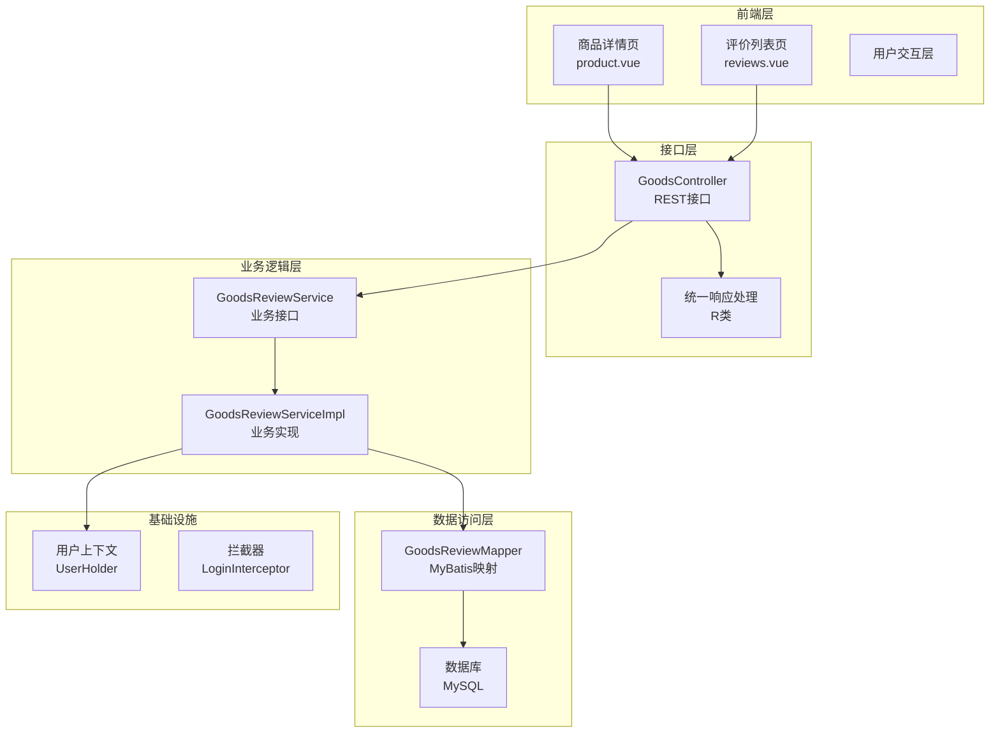
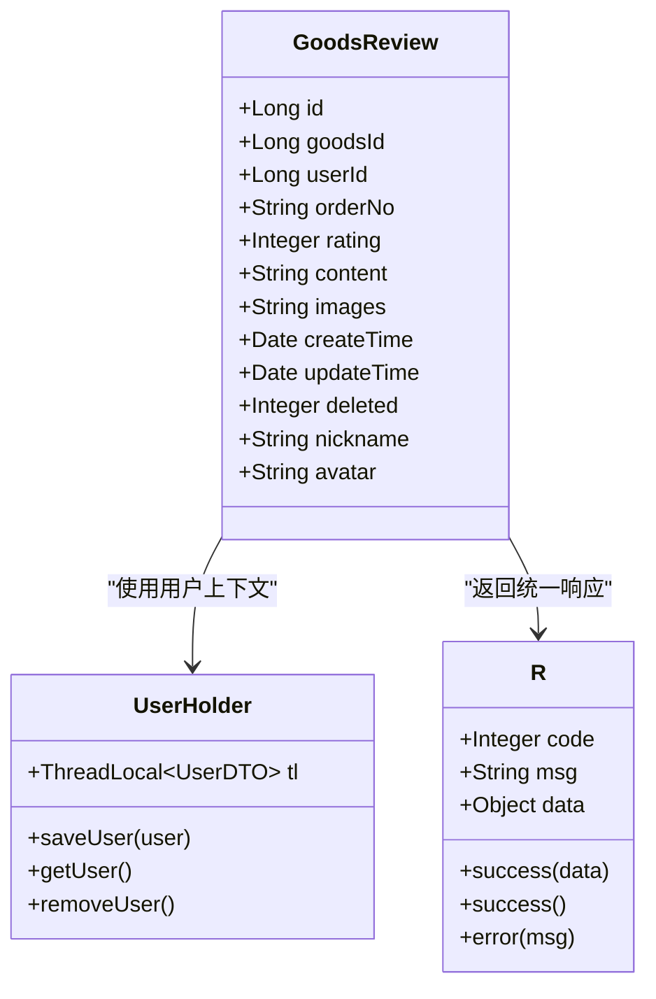
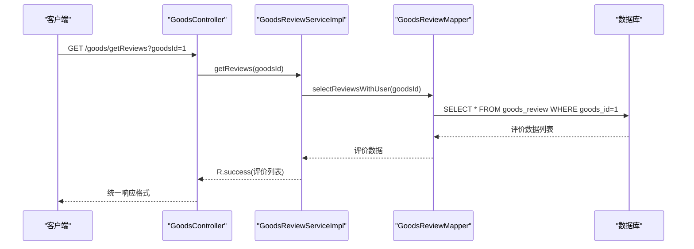
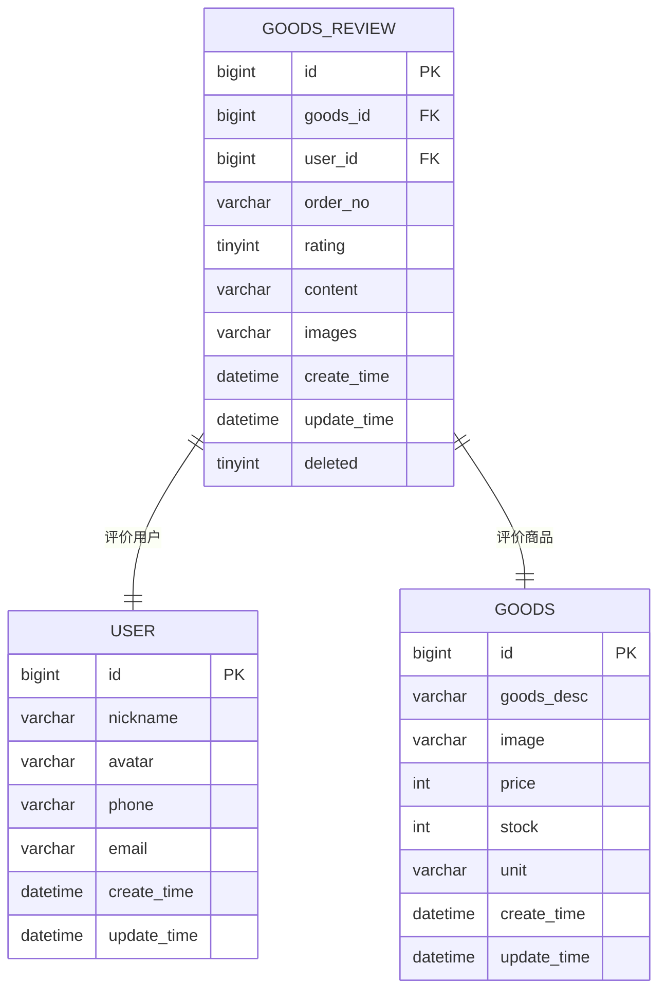
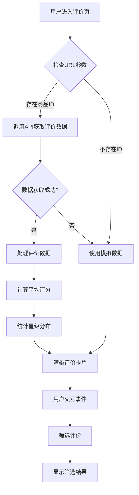
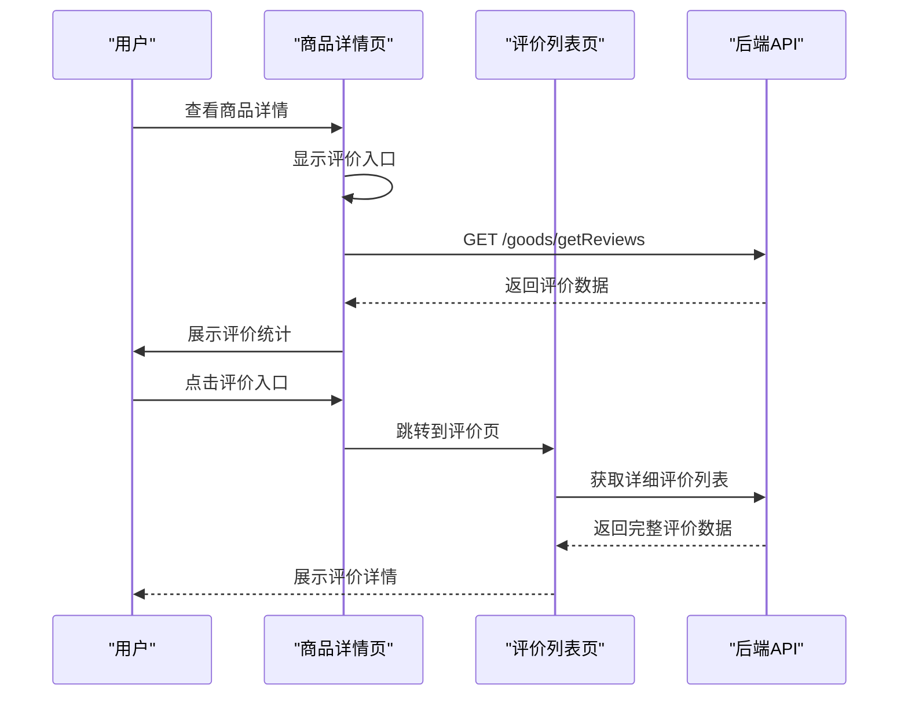
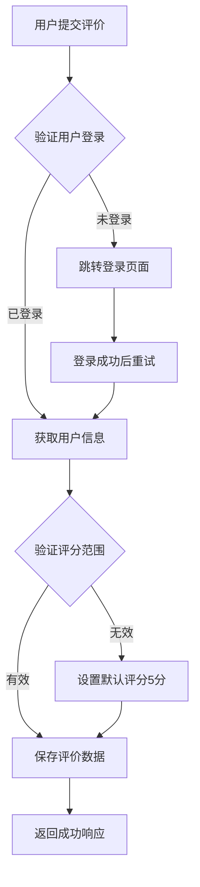
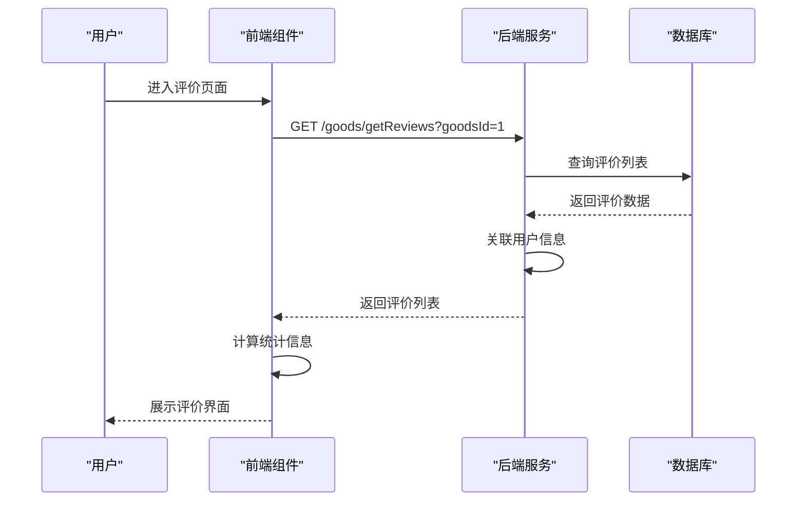
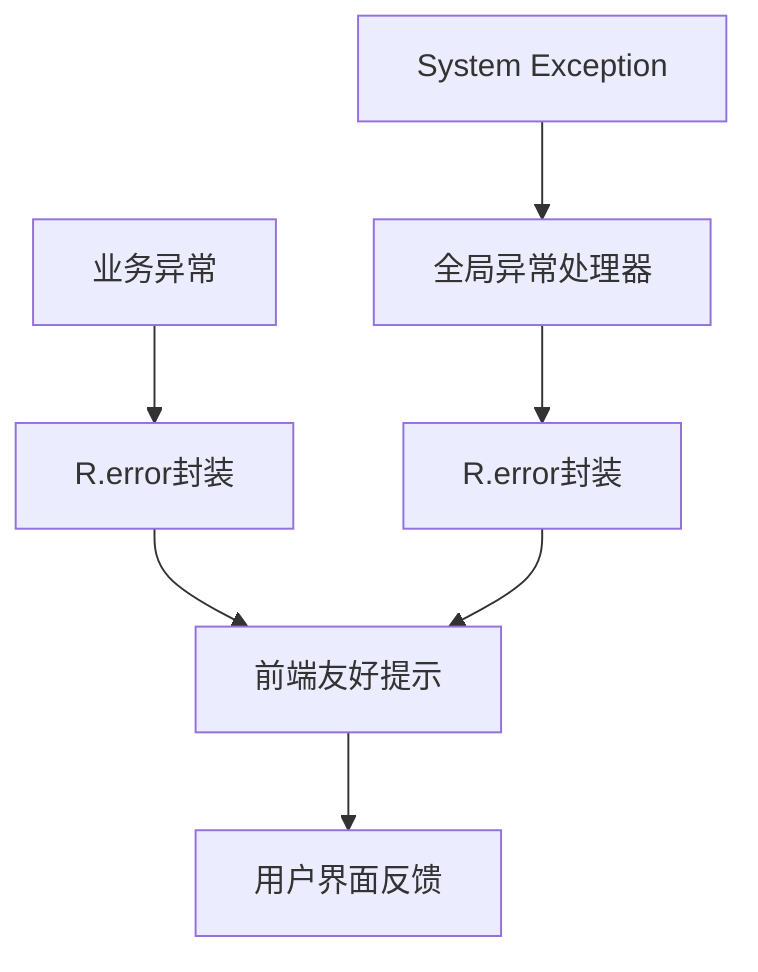

# 商品评价系统

<cite>
**本文档引用的文件**
- [GoodsReview.java](file://springboot-travel-social/src/main/java/com/cxx/entity/GoodsReview.java)
- [GoodsReviewMapper.java](file://springboot-travel-social/src/main/java/com/cxx/mapper/GoodsReviewMapper.java)
- [GoodsReviewService.java](file://springboot-travel-social/src/main/java/com/cxx/service/GoodsReviewService.java)
- [GoodsReviewServiceImpl.java](file://springboot-travel-social/src/main/java/com/cxx/service/impl/GoodsReviewServiceImpl.java)
- [GoodsController.java](file://springboot-travel-social/src/main/java/com/cxx/controller/GoodsController.java)
- [R.java](file://springboot-travel-social/src/main/java/com/cxx/entity/R.java)
- [UserHolder.java](file://springboot-travel-social/src/main/java/com/cxx/utils/UserHolder.java)
- [reviews.vue](file://uniapp-travel-social/preferredPages/reviews.vue)
- [product.vue](file://uniapp-travel-social/preferredPages/product.vue)
- [travel_socical.sql](file://travel_socical.sql)
</cite>

## 更新摘要
**变更内容**
- 新增完整的商品评价系统架构设计
- 更新后端服务层实现细节
- 完善前端评价页面组件分析
- 补充数据库表结构和索引设计
- 增强性能优化和错误处理机制

## 目录
1. [项目概述](#项目概述)
2. [系统架构](#系统架构)
3. [核心组件分析](#核心组件分析)
4. [数据模型设计](#数据模型设计)
5. [前端组件实现](#前端组件实现)
6. [后端接口设计](#后端接口设计)
7. [评价流程分析](#评价流程分析)
8. [性能优化策略](#性能优化策略)
9. [错误处理机制](#错误处理机制)
10. [总结](#总结)

## 项目概述

商品评价系统是旅游攻略社交小程序的重要组成部分，负责管理用户对商品的评价和评分。该系统采用前后端分离架构，后端基于Spring Boot框架，前端使用UniApp开发，实现了完整的商品评价功能，包括评价展示、评分统计、筛选过滤等功能。

系统支持用户对购买的商品进行评价，评价内容包含评分（1-5星）、文字评价、图片上传等，同时提供评价统计和筛选功能，帮助其他用户更好地了解商品质量。该系统通过独立的评价表设计，实现了与商品和用户表的关联查询，提供了完整的评价生命周期管理。

## 系统架构



**图表来源**
- [GoodsController.java:1-52](file://springboot-travel-social/src/main/java/com/cxx/controller/GoodsController.java#L1-L52)
- [GoodsReviewService.java:1-15](file://springboot-travel-social/src/main/java/com/cxx/service/GoodsReviewService.java#L1-L15)
- [GoodsReviewServiceImpl.java:1-39](file://springboot-travel-social/src/main/java/com/cxx/service/impl/GoodsReviewServiceImpl.java#L1-L39)

## 核心组件分析

### 后端核心组件

#### 实体类设计
商品评价实体类采用标准的Java Bean模式，使用MyBatis-Plus注解进行数据库映射：



**图表来源**
- [GoodsReview.java:13-58](file://springboot-travel-social/src/main/java/com/cxx/entity/GoodsReview.java#L13-L58)
- [UserHolder.java:1-20](file://springboot-travel-social/src/main/java/com/cxx/utils/UserHolder.java#L1-L20)
- [R.java:14-32](file://springboot-travel-social/src/main/java/com/cxx/entity/R.java#L14-L32)

#### 服务层实现
服务层采用接口+实现类的模式，提供评价查询和添加功能：



**图表来源**
- [GoodsController.java:33-49](file://springboot-travel-social/src/main/java/com/cxx/controller/GoodsController.java#L33-L49)
- [GoodsReviewServiceImpl.java:17-21](file://springboot-travel-social/src/main/java/com/cxx/service/impl/GoodsReviewServiceImpl.java#L17-L21)

**章节来源**
- [GoodsReview.java:13-58](file://springboot-travel-social/src/main/java/com/cxx/entity/GoodsReview.java#L13-L58)
- [GoodsReviewService.java:7-14](file://springboot-travel-social/src/main/java/com/cxx/service/GoodsReviewService.java#L7-L14)
- [GoodsReviewServiceImpl.java:14-39](file://springboot-travel-social/src/main/java/com/cxx/service/impl/GoodsReviewServiceImpl.java#L14-L39)

## 数据模型设计

### 数据库表结构

商品评价系统使用独立的评价表存储评价信息，与用户表进行关联查询：



**图表来源**
- [travel_socical.sql:1-1596](file://travel_socical.sql#L1-L1596)
- [GoodsReview.java:18-50](file://springboot-travel-social/src/main/java/com/cxx/entity/GoodsReview.java#L18-L50)

### 关键字段说明

| 字段名 | 类型 | 约束 | 描述 |
|--------|------|------|------|
| id | bigint | 主键, 自增 | 评价记录唯一标识 |
| goods_id | bigint | 外键 | 关联的商品ID |
| user_id | bigint | 外键 | 评价用户的ID |
| order_no | varchar(64) |  | 订单编号 |
| rating | tinyint | 1-5, 默认5 | 评分等级 |
| content | varchar(500) |  | 评价内容 |
| images | varchar(1000) |  | 评价图片JSON数组 |
| create_time | datetime | 默认当前时间 | 创建时间 |
| update_time | datetime | 默认当前时间, 自动更新 | 更新时间 |
| deleted | tinyint | 0/1, 默认0 | 逻辑删除标识 |

**章节来源**
- [travel_socical.sql:1-1596](file://travel_socical.sql#L1-L1596)
- [GoodsReview.java:20-50](file://springboot-travel-social/src/main/java/com/cxx/entity/GoodsReview.java#L20-L50)

## 前端组件实现

### 评价列表组件

评价列表组件实现了完整的评价展示功能，包括评分统计、筛选过滤、图片展示等：



**图表来源**
- [reviews.vue:107-147](file://uniapp-travel-social/preferredPages/reviews.vue#L107-L147)

### 商品详情集成

商品详情页集成了评价入口，用户可以直观地查看商品评价：



**图表来源**
- [product.vue:123-133](file://uniapp-travel-social/preferredPages/product.vue#L123-L133)
- [reviews.vue:112-133](file://uniapp-travel-social/preferredPages/reviews.vue#L112-L133)

**章节来源**
- [reviews.vue:1-205](file://uniapp-travel-social/preferredPages/reviews.vue#L1-L205)
- [product.vue:123-133](file://uniapp-travel-social/preferredPages/product.vue#L123-L133)

## 后端接口设计

### REST API规范

系统提供了标准化的REST接口，遵循HTTP协议规范：

| 接口 | 方法 | 路径 | 功能 | 请求参数 | 响应数据 |
|------|------|------|------|----------|----------|
| 获取评价列表 | GET | /goods/getReviews | 查询商品评价列表 | goodsId: 商品ID | 评价数据列表 |
| 添加评价 | POST | /goods/addReview | 用户添加商品评价 | GoodsReview对象 | 操作结果 |

### 统一响应格式

所有接口返回统一的响应格式，便于前端处理：

```mermaid
classDiagram
class R {
+Integer code
+String msg
+Object data
+success(data) R
+success() R
+error(msg) R
}
note for R : "统一响应包装类\n- code : 1成功, 0失败\n- msg : 操作消息\n- data : 返回数据"
```

**图表来源**
- [R.java:14-32](file://springboot-travel-social/src/main/java/com/cxx/entity/R.java#L14-L32)

**章节来源**
- [GoodsController.java:33-49](file://springboot-travel-social/src/main/java/com/cxx/controller/GoodsController.java#L33-L49)
- [R.java:14-32](file://springboot-travel-social/src/main/java/com/cxx/entity/R.java#L14-L32)

## 评价流程分析

### 评价提交流程



### 评价展示流程



**图表来源**
- [GoodsReviewServiceImpl.java:17-21](file://springboot-travel-social/src/main/java/com/cxx/service/impl/GoodsReviewServiceImpl.java#L17-L21)
- [GoodsReviewMapper.java:16-21](file://springboot-travel-social/src/main/java/com/cxx/mapper/GoodsReviewMapper.java#L16-L21)

**章节来源**
- [GoodsReviewServiceImpl.java:23-37](file://springboot-travel-social/src/main/java/com/cxx/service/impl/GoodsReviewServiceImpl.java#L23-L37)
- [GoodsReviewMapper.java:16-21](file://springboot-travel-social/src/main/java/com/cxx/mapper/GoodsReviewMapper.java#L16-L21)

## 性能优化策略

### 数据库优化

1. **索引优化**: 在`goods_id`和`user_id`字段上建立索引，提高查询性能
2. **分页查询**: 对评价列表实施分页机制，避免一次性加载大量数据
3. **缓存策略**: 使用Redis缓存热门商品的评价数据

### 前端优化

1. **懒加载**: 评价图片采用懒加载技术，提升页面加载速度
2. **虚拟滚动**: 大量评价数据时使用虚拟滚动，减少DOM节点数量
3. **数据缓存**: 缓存已加载的评价数据，避免重复请求

### 后端优化

1. **批量查询**: 使用JOIN查询关联用户信息，减少数据库查询次数
2. **异步处理**: 对图片上传等耗时操作采用异步处理
3. **连接池**: 合理配置数据库连接池，提高并发处理能力

## 错误处理机制

### 异常处理策略

系统采用统一的异常处理机制，确保错误信息的标准化：



### 错误码规范

| 错误码 | 含义 | 处理建议 |
|--------|------|----------|
| 0 | 操作失败 | 显示具体错误信息，提供重试机会 |
| 1 | 操作成功 | 正常业务流程，无需额外处理 |
| 401 | 未授权 | 跳转登录页面 |
| 404 | 资源不存在 | 提示用户刷新页面 |

**章节来源**
- [GoodsReviewServiceImpl.java:34-36](file://springboot-travel-social/src/main/java/com/cxx/service/impl/GoodsReviewServiceImpl.java#L34-L36)
- [R.java:27-29](file://springboot-travel-social/src/main/java/com/cxx/entity/R.java#L27-L29)

## 总结

商品评价系统通过合理的架构设计和完整的功能实现，为用户提供了一个完整的商品评价体验。系统具有以下特点：

1. **模块化设计**: 采用分层架构，职责清晰，易于维护和扩展
2. **前后端分离**: 前后端职责明确，提高了开发效率和用户体验
3. **数据一致性**: 通过事务管理和数据校验，确保数据的准确性和完整性
4. **性能优化**: 采用多种优化策略，提升了系统的响应速度和并发处理能力
5. **错误处理**: 完善的异常处理机制，提供了良好的用户体验

该系统为旅游攻略社交小程序的商品交易提供了重要的信任基础，有助于提升平台的整体质量和用户满意度。通过持续的优化和改进，系统能够更好地满足用户需求，为平台的发展提供有力支撑。

**章节来源**
- [GoodsReview.java:13-58](file://springboot-travel-social/src/main/java/com/cxx/entity/GoodsReview.java#L13-L58)
- [GoodsReviewService.java:7-14](file://springboot-travel-social/src/main/java/com/cxx/service/GoodsReviewService.java#L7-L14)
- [GoodsReviewServiceImpl.java:14-39](file://springboot-travel-social/src/main/java/com/cxx/service/impl/GoodsReviewServiceImpl.java#L14-L39)
- [GoodsController.java:33-49](file://springboot-travel-social/src/main/java/com/cxx/controller/GoodsController.java#L33-L49)
- [reviews.vue:1-205](file://uniapp-travel-social/preferredPages/reviews.vue#L1-L205)
- [product.vue:123-133](file://uniapp-travel-social/preferredPages/product.vue#L123-L133)
- [travel_socical.sql:1-1596](file://travel_socical.sql#L1-L1596)