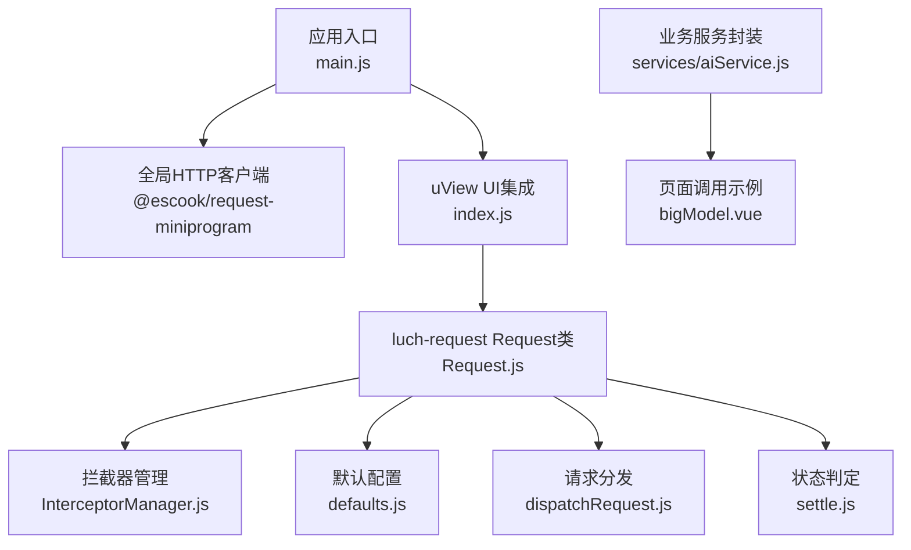
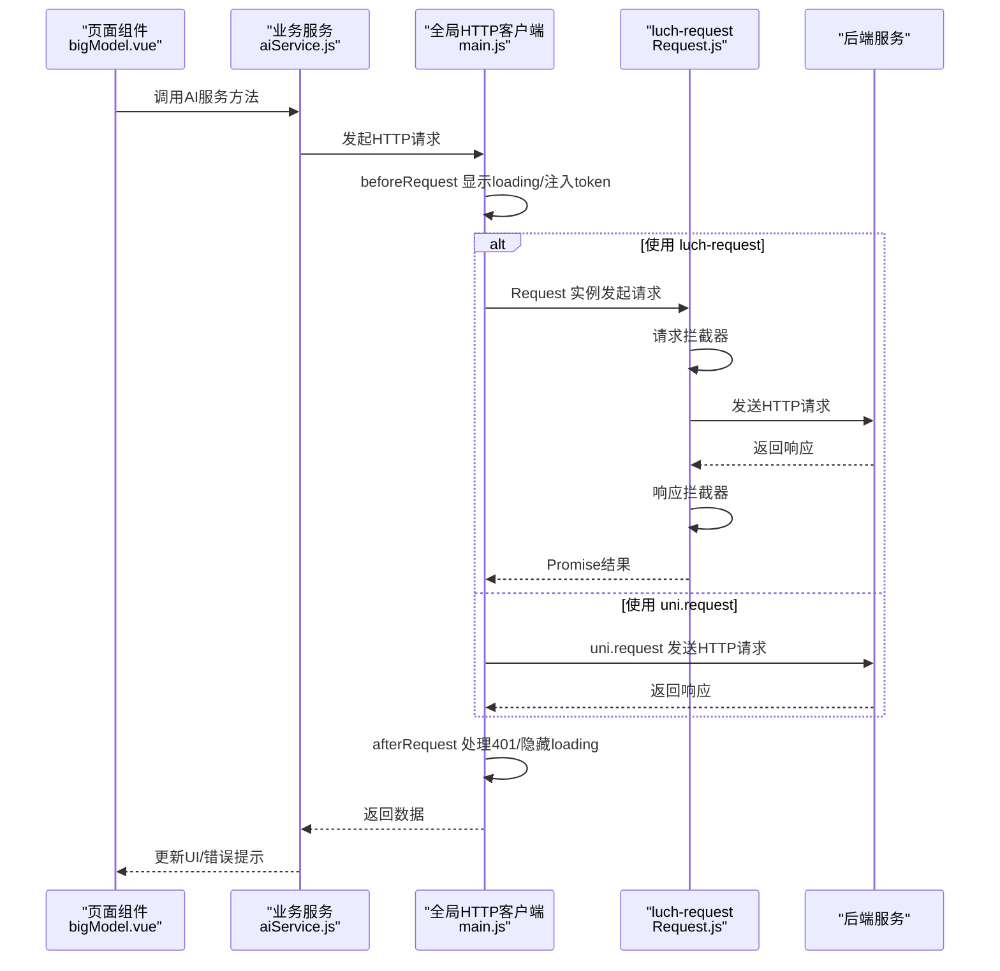
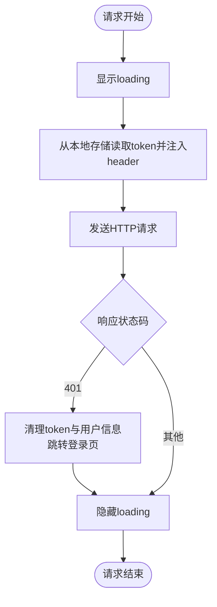
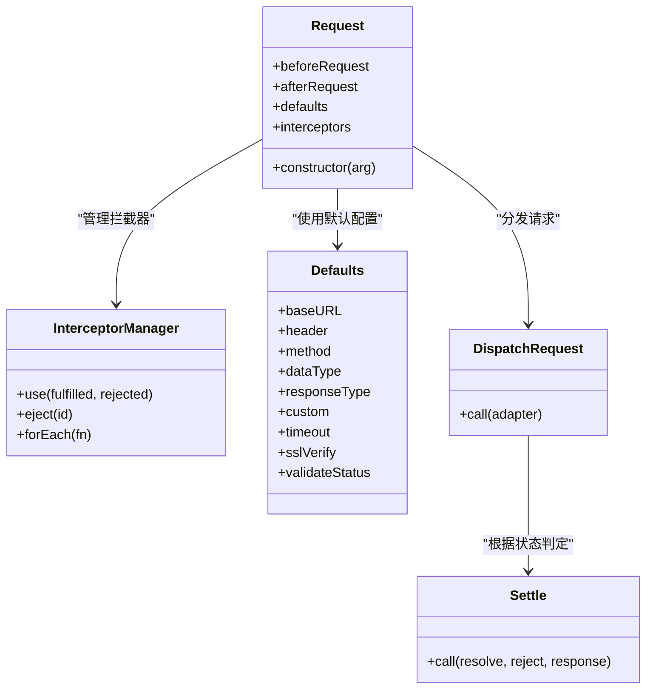
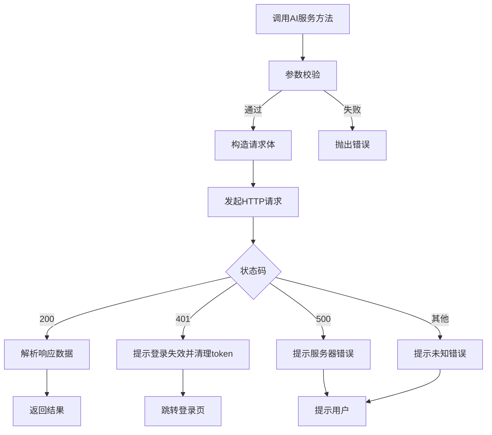
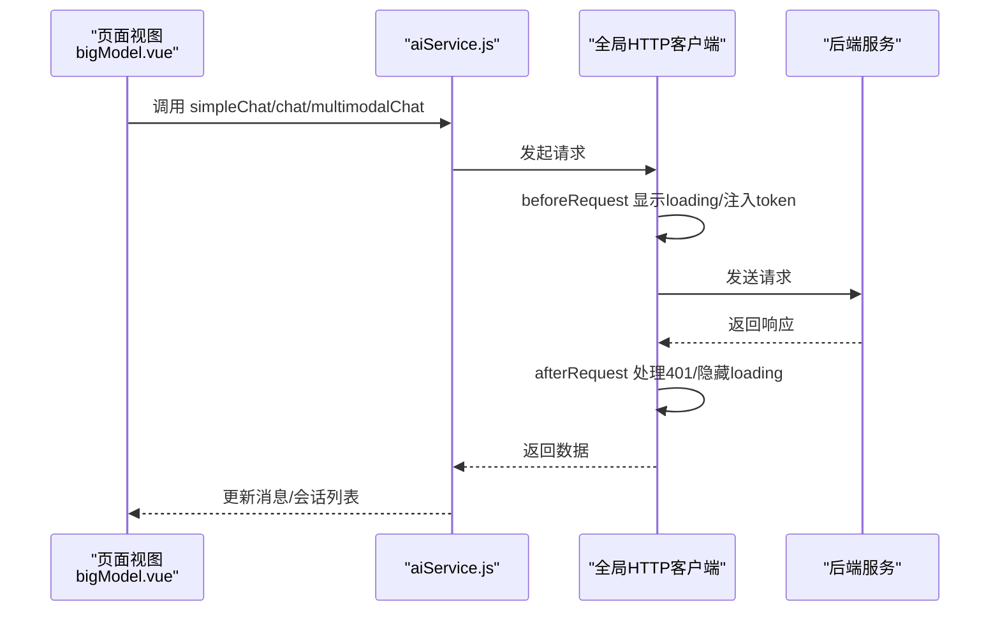
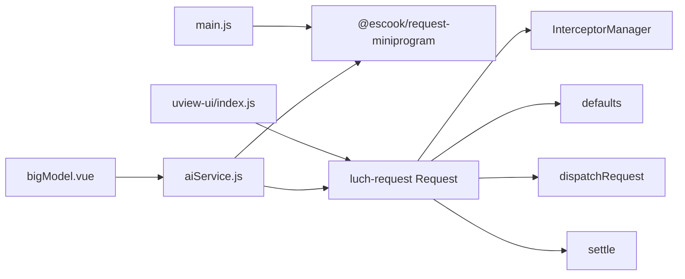

# API调用

<cite>
**本文引用的文件**
- [main.js](file://uniapp-travel-social/main.js)
- [aiService.js](file://uniapp-travel-social/services/aiService.js)
- [bigModel.vue](file://uniapp-travel-social/homePages/bigModel/bigModel.vue)
- [index.js](file://uniapp-travel-social/uni_modules/uview-ui/index.js)
- [Request.js](file://uniapp-travel-social/uni_modules/uview-ui/libs/luch-request/core/Request.js)
- [defaults.js](file://uniapp-travel-social/uni_modules/uview-ui/libs/luch-request/core/defaults.js)
- [InterceptorManager.js](file://uniapp-travel-social/uni_modules/uview-ui/libs/luch-request/core/InterceptorManager.js)
- [dispatchRequest.js](file://uniapp-travel-social/uni_modules/uview-ui/libs/luch-request/core/dispatchRequest.js)
- [settle.js](file://uniapp-travel-social/uni_modules/uview-ui/libs/luch-request/core/settle.js)
</cite>

## 目录
1. [简介](#简介)
2. [项目结构](#项目结构)
3. [核心组件](#核心组件)
4. [架构总览](#架构总览)
5. [详细组件分析](#详细组件分析)
6. [依赖关系分析](#依赖关系分析)
7. [性能考量](#性能考量)
8. [故障排查指南](#故障排查指南)
9. [结论](#结论)
10. [附录](#附录)

## 简介
本文件面向“API调用”的使用与最佳实践，围绕项目中使用的两类HTTP客户端展开：
- uni-app生态内置的 @escook/request-miniprogram（基于 uni.request 的封装），用于全局请求拦截、loading提示、登录状态检查与token传递。
- uView UI 提供的 luch-request（基于 Request 类与拦截器体系），用于更细粒度的请求配置与扩展。

文档重点覆盖：
- HTTP请求配置（baseUrl、请求头、超时、ssl校验等）
- 请求拦截器与响应拦截器（beforeRequest、afterRequest）
- token传递机制与登录状态检查
- 钩子函数（loading提示、错误处理、登录状态检查）
- API封装与服务层设计（aiService.js）
- 请求参数传递、响应数据处理、错误状态码处理
- 高级特性（超时、重试、并发控制）

## 项目结构
本项目的API调用涉及以下关键位置：
- 全局HTTP客户端初始化与拦截器：main.js
- 业务服务封装：services/aiService.js
- 页面使用示例：homePages/bigModel/bigModel.vue
- luch-request核心实现：uni_modules/uview-ui/libs/luch-request

图表来源
- [main.js:15-56](file://uniapp-travel-social/main.js#L15-L56)
- [index.js:47](file://uniapp-travel-social/uni_modules/uview-ui/index.js#L47-L47)
- [Request.js:21-31](file://uniapp-travel-social/uni_modules/uview-ui/libs/luch-request/core/Request.js#L21-L31)
- [defaults.js:5-29](file://uniapp-travel-social/uni_modules/uview-ui/libs/luch-request/core/defaults.js#L5-L29)
- [InterceptorManager.js:15-32](file://uniapp-travel-social/uni_modules/uview-ui/libs/luch-request/core/InterceptorManager.js#L15-L32)
- [dispatchRequest.js:1-4](file://uniapp-travel-social/uni_modules/uview-ui/libs/luch-request/core/dispatchRequest.js#L1-L4)
- [settle.js:8-16](file://uniapp-travel-social/uni_modules/uview-ui/libs/luch-request/core/settle.js#L8-L16)

章节来源
- [main.js:15-56](file://uniapp-travel-social/main.js#L15-L56)
- [index.js:47](file://uniapp-travel-social/uni_modules/uview-ui/index.js#L47-L47)

## 核心组件
- 全局HTTP客户端（@escook/request-miniprogram）
  - 在入口文件中初始化，并设置 baseUrl、beforeRequest、afterRequest 钩子。
  - beforeRequest：显示loading、注入token到header。
  - afterRequest：处理401未授权，清理本地token并跳转登录。
- luch-request（uView UI）
  - Request 类提供全局配置、拦截器注册、请求分发与状态判定。
  - 支持默认配置（timeout、sslVerify、validateStatus等）。
  - InterceptorManager 管理请求/响应拦截器链。
- 业务服务封装（aiService.js）
  - 封装AI相关接口，统一参数校验、错误处理与响应格式。
  - 提供聊天、会话管理、状态检查等方法。
- 页面调用（bigModel.vue）
  - 通过 aiService 调用后端接口，展示loading、处理错误与更新UI。

章节来源
- [main.js:15-56](file://uniapp-travel-social/main.js#L15-L56)
- [Request.js:21-31](file://uniapp-travel-social/uni_modules/uview-ui/libs/luch-request/core/Request.js#L21-L31)
- [defaults.js:5-29](file://uniapp-travel-social/uni_modules/uview-ui/libs/luch-request/core/defaults.js#L5-L29)
- [InterceptorManager.js:15-32](file://uniapp-travel-social/uni_modules/uview-ui/libs/luch-request/core/InterceptorManager.js#L15-L32)
- [aiService.js:42-291](file://uniapp-travel-social/services/aiService.js#L42-L291)
- [bigModel.vue:320-531](file://uniapp-travel-social/homePages/bigModel/bigModel.vue#L320-L531)

## 架构总览
整体调用链路如下：
- 应用启动时，main.js 初始化全局HTTP客户端并设置拦截器。
- 页面组件通过 aiService.js 调用后端接口。
- aiService.js 内部可使用 uni.request 或 luch-request（若后续迁移）。
- luch-request 通过 Request 类与拦截器链处理请求与响应。

图表来源
- [main.js:15-56](file://uniapp-travel-social/main.js#L15-L56)
- [Request.js:21-31](file://uniapp-travel-social/uni_modules/uview-ui/libs/luch-request/core/Request.js#L21-L31)
- [aiService.js:42-291](file://uniapp-travel-social/services/aiService.js#L42-L291)
- [bigModel.vue:474-531](file://uniapp-travel-social/homePages/bigModel/bigModel.vue#L474-L531)

## 详细组件分析

### 全局HTTP客户端与拦截器（main.js）
- 全局基础地址：通过 baseUrl 设置统一前缀。
- 请求前钩子（beforeRequest）：
  - 显示loading提示。
  - 从本地存储读取token并注入到header。
- 响应后钩子（afterRequest）：
  - 若状态码为401，清理token与用户信息，跳转登录页，并提示登录失效。
  - 隐藏loading。

图表来源
- [main.js:25-56](file://uniapp-travel-social/main.js#L25-L56)

章节来源
- [main.js:15-56](file://uniapp-travel-social/main.js#L15-L56)

### luch-request核心实现（Request.js、defaults.js、InterceptorManager.js、dispatchRequest.js、settle.js）
- Request 类
  - 接收全局配置（baseURL、header、method、dataType、responseType、custom、timeout、sslVerify、validateStatus）。
  - 提供拦截器注册与移除能力。
- defaults 默认配置
  - 定义默认超时、SSL校验、withCredentials、IPv4优先等平台差异配置。
  - validateStatus 默认2xx视为成功。
- InterceptorManager
  - use 注册拦截器，eject 移除，forEach 迭代。
- dispatchRequest
  - 将配置交给适配器执行请求。
- settle
  - 根据状态码与validateStatus决定resolve/reject。

图表来源
- [Request.js:21-31](file://uniapp-travel-social/uni_modules/uview-ui/libs/luch-request/core/Request.js#L21-L31)
- [defaults.js:5-29](file://uniapp-travel-social/uni_modules/uview-ui/libs/luch-request/core/defaults.js#L5-L29)
- [InterceptorManager.js:15-32](file://uniapp-travel-social/uni_modules/uview-ui/libs/luch-request/core/InterceptorManager.js#L15-L32)
- [dispatchRequest.js:1-4](file://uniapp-travel-social/uni_modules/uview-ui/libs/luch-request/core/dispatchRequest.js#L1-L4)
- [settle.js:8-16](file://uniapp-travel-social/uni_modules/uview-ui/libs/luch-request/core/settle.js#L8-L16)

章节来源
- [Request.js:21-31](file://uniapp-travel-social/uni_modules/uview-ui/libs/luch-request/core/Request.js#L21-L31)
- [defaults.js:5-29](file://uniapp-travel-social/uni_modules/uview-ui/libs/luch-request/core/defaults.js#L5-L29)
- [InterceptorManager.js:15-32](file://uniapp-travel-social/uni_modules/uview-ui/libs/luch-request/core/InterceptorManager.js#L15-L32)
- [dispatchRequest.js:1-4](file://uniapp-travel-social/uni_modules/uview-ui/libs/luch-request/core/dispatchRequest.js#L1-L4)
- [settle.js:8-16](file://uniapp-travel-social/uni_modules/uview-ui/libs/luch-request/core/settle.js#L8-L16)

### 业务服务封装（aiService.js）
- 统一请求封装：封装 request 方法，负责token注入、状态码判断、错误处理。
- AI服务接口：
  - 简单聊天、通用聊天（可带systemPrompt）、会话管理（创建、获取、删除、重命名、清空）、多模态图片+文字问答、状态检查。
- 参数校验与错误处理：
  - 对必填字段、长度限制进行校验。
  - 统一返回 {success, data/error} 结构，便于前端处理。
- 与页面交互：
  - 页面通过 aiService 调用接口，统一loading与错误提示。

图表来源
- [aiService.js:42-291](file://uniapp-travel-social/services/aiService.js#L42-L291)

章节来源
- [aiService.js:42-291](file://uniapp-travel-social/services/aiService.js#L42-L291)

### 页面调用示例（bigModel.vue）
- 页面在发送消息时，根据是否有图片或特定模式，调用 aiService 的不同方法。
- 统一处理loading、错误提示、消息渲染与会话列表刷新。
- 通过 uni.request 上传语音文件（用于语音转文字）。

图表来源
- [bigModel.vue:474-531](file://uniapp-travel-social/homePages/bigModel/bigModel.vue#L474-L531)
- [aiService.js:42-291](file://uniapp-travel-social/services/aiService.js#L42-L291)
- [main.js:25-56](file://uniapp-travel-social/main.js#L25-L56)

章节来源
- [bigModel.vue:320-531](file://uniapp-travel-social/homePages/bigModel/bigModel.vue#L320-L531)

## 依赖关系分析
- main.js 依赖 @escook/request-miniprogram，设置全局拦截器与基础地址。
- uView UI 的 index.js 暴露 Request 实例，供组件按需使用。
- luch-request 内部通过 InterceptorManager 管理拦截器，defaults 提供默认配置，dispatchRequest 调度请求，settle 判定成功/失败。
- aiService.js 作为业务层，封装具体接口，供页面调用。
- bigModel.vue 作为典型页面调用方，展示loading、错误处理与UI更新。

图表来源
- [main.js:15-56](file://uniapp-travel-social/main.js#L15-L56)
- [index.js:47](file://uniapp-travel-social/uni_modules/uview-ui/index.js#L47-L47)
- [Request.js:21-31](file://uniapp-travel-social/uni_modules/uview-ui/libs/luch-request/core/Request.js#L21-L31)
- [InterceptorManager.js:15-32](file://uniapp-travel-social/uni_modules/uview-ui/libs/luch-request/core/InterceptorManager.js#L15-L32)
- [defaults.js:5-29](file://uniapp-travel-social/uni_modules/uview-ui/libs/luch-request/core/defaults.js#L5-L29)
- [dispatchRequest.js:1-4](file://uniapp-travel-social/uni_modules/uview-ui/libs/luch-request/core/dispatchRequest.js#L1-L4)
- [settle.js:8-16](file://uniapp-travel-social/uni_modules/uview-ui/libs/luch-request/core/settle.js#L8-L16)
- [aiService.js:42-291](file://uniapp-travel-social/services/aiService.js#L42-L291)
- [bigModel.vue:320-531](file://uniapp-travel-social/homePages/bigModel/bigModel.vue#L320-L531)

章节来源
- [main.js:15-56](file://uniapp-travel-social/main.js#L15-L56)
- [index.js:47](file://uniapp-travel-social/uni_modules/uview-ui/index.js#L47-L47)

## 性能考量
- 超时设置
  - 全局默认超时由 defaults.js 中 timeout 控制；可在初始化时覆盖。
- SSL校验
  - defaults.js 提供 sslVerify，默认开启，确保App端安全。
- 并发控制
  - 项目未见显式并发队列或限流实现，建议在业务层增加队列/节流策略，避免频繁请求导致资源竞争。
- 重试机制
  - 未见内置重试逻辑，可在 beforeRequest/afterRequest 或业务封装中增加指数退避重试。
- 响应类型
  - defaults.js 中 responseType 默认 text，注意与后端返回格式一致，避免解析异常。

章节来源
- [defaults.js:14-25](file://uniapp-travel-social/uni_modules/uview-ui/libs/luch-request/core/defaults.js#L14-L25)

## 故障排查指南
- 登录失效（401）
  - afterRequest 会清理token并跳转登录页，确认本地存储的token是否正确注入与过期。
- 网络错误
  - 统一在 aiService.js 中捕获并提示“网络连接失败”，检查网络状态与域名白名单。
- 状态码处理
  - 200：正常返回；401：登录失效；500：服务器错误；其他：未知错误，检查后端返回结构。
- loading提示
  - beforeRequest 显示loading，afterRequest 隐藏loading；若出现卡住，检查异步流程是否正确结束。
- 语音识别
  - bigModel.vue 中通过 uni.uploadFile 调用语音转文字接口，确认后端接口可用与跨平台兼容性。

章节来源
- [main.js:25-56](file://uniapp-travel-social/main.js#L25-L56)
- [aiService.js:18-38](file://uniapp-travel-social/services/aiService.js#L18-L38)
- [bigModel.vue:697-722](file://uniapp-travel-social/homePages/bigModel/bigModel.vue#L697-L722)

## 结论
- 项目采用“全局HTTP客户端 + 业务服务封装”的双层设计：全局层负责拦截、token与loading，业务层负责接口语义与错误处理。
- luch-request 提供了完善的拦截器与默认配置能力，适合进一步扩展（如统一重试、并发控制、日志上报）。
- aiService.js 已实现较完整的参数校验与错误处理，页面调用简洁清晰。

## 附录
- 最佳实践清单
  - 统一在 beforeRequest 注入token，避免重复代码。
  - 在 afterRequest 统一处理401，确保登录态一致性。
  - 业务层统一返回 {success, data/error}，便于前端处理。
  - 对长文本、图片数量等做参数校验与长度限制。
  - 对高频接口增加节流/去抖，避免过度请求。
  - 对网络异常与401进行明确提示与引导（如跳转登录）。