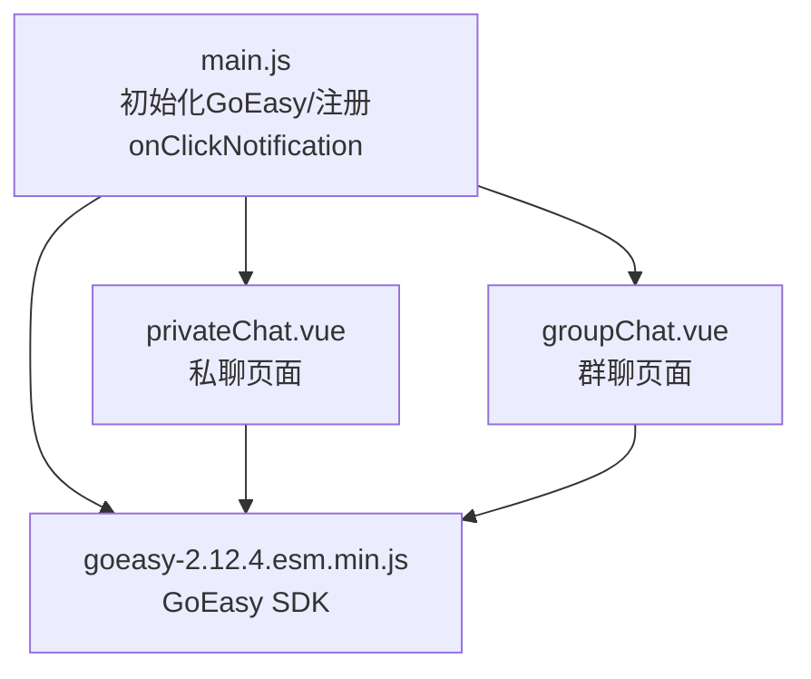
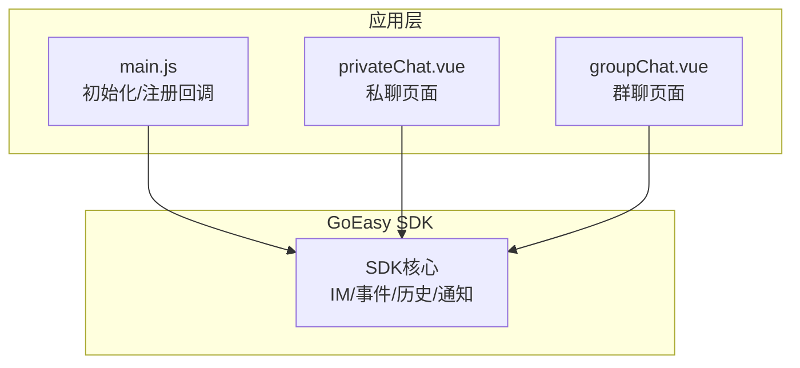
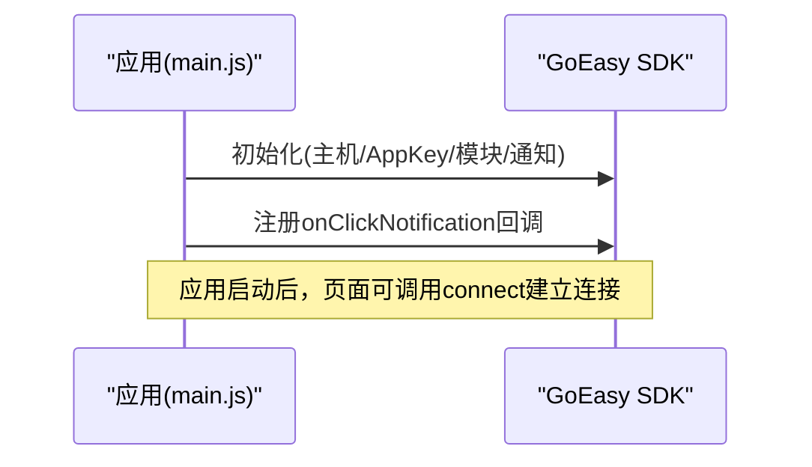
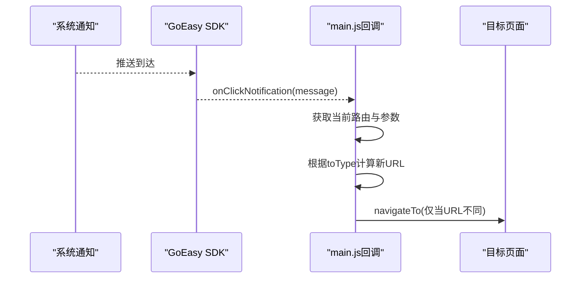
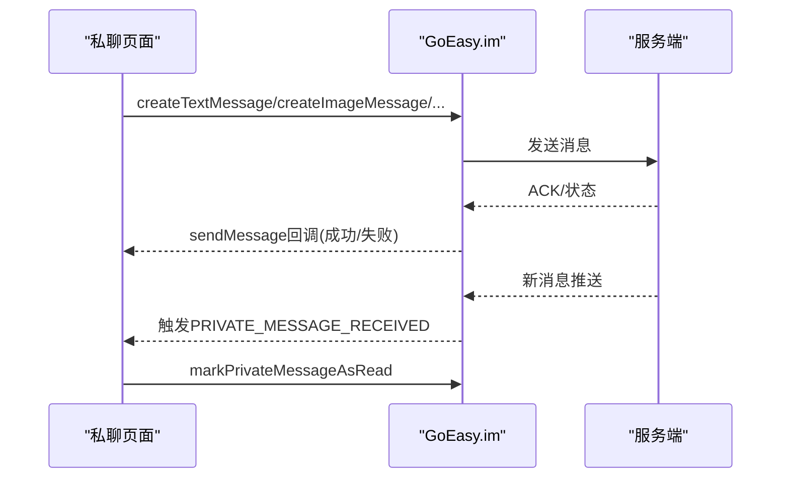
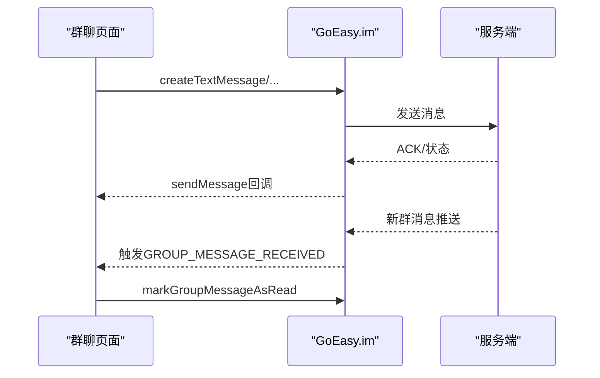
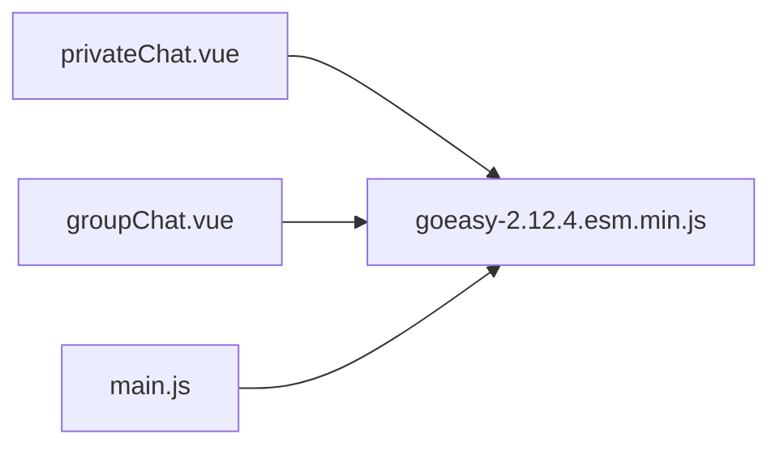

# 实时通信

<cite>
**本文引用的文件**
- [main.js](file://uniapp-travel-social/main.js)
- [goeasy-2.12.4.esm.min.js](file://uniapp-travel-social/uni_modules/GOEASY-IM/js_sdk/goeasy-2.12.4.esm.min.js)
- [privateChat.vue](file://uniapp-travel-social/messagePages/privateChat.vue)
- [groupChat.vue](file://uniapp-travel-social/messagePages/groupChat.vue)
</cite>

## 目录
1. [简介](#简介)
2. [项目结构](#项目结构)
3. [核心组件](#核心组件)
4. [架构总览](#架构总览)
5. [详细组件分析](#详细组件分析)
6. [依赖关系分析](#依赖关系分析)
7. [性能考量](#性能考量)
8. [故障排查指南](#故障排查指南)
9. [结论](#结论)
10. [附录](#附录)

## 简介
本文件面向“旅行攻略社交小程序”的实时通信能力，系统化梳理基于 GoEasy 即时通讯 SDK 的集成与使用，覆盖初始化配置、连接建立、断线重连、私聊与群聊的消息收发与存储、onClickNotification 回调的页面跳转逻辑、消息类型判断与路由参数传递、当前页面检测、通知权限与环境兼容性、WebSocket 连接状态管理、消息队列与离线消息同步、错误处理、性能优化与安全建议等。

## 项目结构
- 前端（UniApp）通过 main.js 引入并初始化 GoEasy SDK，统一挂载到全局，并注册 onClickNotification 全局通知点击回调。
- 私聊与群聊页面分别在 privateChat.vue 与 groupChat.vue 中实现消息的发送、接收、历史拉取、删除、撤回、已读标记、音频播放与录音授权等完整链路。
- GoEasy SDK 以 UniApp 插件形式引入，内部封装了连接、事件、IM 会话、历史消息、消息删除与撤回、本地通知等能力。

图示来源
- [main.js:76-111](file://uniapp-travel-social/main.js#L76-L111)
- [privateChat.vue:393-432](file://uniapp-travel-social/messagePages/privateChat.vue#L393-L432)
- [groupChat.vue:372-410](file://uniapp-travel-social/messagePages/groupChat.vue#L372-L410)
- [goeasy-2.12.4.esm.min.js:1-2](file://uniapp-travel-social/uni_modules/GOEASY-IM/js_sdk/goeasy-2.12.4.esm.min.js#L1-L2)

章节来源
- [main.js:1-118](file://uniapp-travel-social/main.js#L1-L118)
- [goeasy-2.12.4.esm.min.js:1-2](file://uniapp-travel-social/uni_modules/GOEASY-IM/js_sdk/goeasy-2.12.4.esm.min.js#L1-L2)

## 核心组件
- 初始化与全局配置
  - 在 main.js 中引入 GoEasy SDK，设置 host、appkey、模块（im）、允许通知（allowNotification），并将实例挂载到 uni.$GoEasy；随后注册 onClickNotification 全局回调，用于处理推送点击跳转。
- 私聊页面（privateChat.vue）
  - 负责私聊消息的监听、渲染、发送、历史拉取、删除、撤回、已读标记、音频播放与录音授权。
- 群聊页面（groupChat.vue）
  - 负责群聊消息的监听、渲染、发送、历史拉取、删除、撤回、已读标记、成员列表展示、音频播放与录音授权。
- GoEasy SDK（goeasy-2.12.4.esm.min.js）
  - 提供 IM 场景常量（私聊/群聊）、事件常量（消息接收/删除/撤回/会话更新）、历史消息、消息发送、删除、撤回、已读标记、本地通知、平台检测、连接状态等能力。

章节来源
- [main.js:76-111](file://uniapp-travel-social/main.js#L76-L111)
- [privateChat.vue:452-470](file://uniapp-travel-social/messagePages/privateChat.vue#L452-L470)
- [groupChat.vue:439-454](file://uniapp-travel-social/messagePages/groupChat.vue#L439-L454)
- [goeasy-2.12.4.esm.min.js:1-2](file://uniapp-travel-social/uni_modules/GOEASY-IM/js_sdk/goeasy-2.12.4.esm.min.js#L1-L2)

## 架构总览
下图展示了从应用启动到页面交互的实时通信架构：main.js 初始化 GoEasy 并注册通知点击回调；私聊/群聊页面通过 GoEasy.im 订阅消息、发送消息、标记已读、拉取历史；SDK 内部负责连接、事件分发与本地通知。

图示来源
- [main.js:76-111](file://uniapp-travel-social/main.js#L76-L111)
- [privateChat.vue:452-470](file://uniapp-travel-social/messagePages/privateChat.vue#L452-L470)
- [groupChat.vue:439-454](file://uniapp-travel-social/messagePages/groupChat.vue#L439-L454)
- [goeasy-2.12.4.esm.min.js:1-2](file://uniapp-travel-social/uni_modules/GOEASY-IM/js_sdk/goeasy-2.12.4.esm.min.js#L1-L2)

## 详细组件分析

### 初始化与连接建立
- 初始化配置
  - 主机地址、AppKey、启用模块（im）、通知开关（根据系统信息动态判定）。
- 连接建立
  - 页面进入时可调用 GoEasy.connect，传入用户标识与用户资料；SDK 内部维护连接状态与断线重连策略。
- 断线重连机制
  - SDK 内部具备连接状态枚举与重连策略，页面可在连接状态变化时刷新 UI 或触发重连流程。

图示来源
- [main.js:76-111](file://uniapp-travel-social/main.js#L76-L111)
- [goeasy-2.12.4.esm.min.js:1-2](file://uniapp-travel-social/uni_modules/GOEASY-IM/js_sdk/goeasy-2.12.4.esm.min.js#L1-L2)

章节来源
- [main.js:76-111](file://uniapp-travel-social/main.js#L76-L111)
- [goeasy-2.12.4.esm.min.js:1-2](file://uniapp-travel-social/uni_modules/GOEASY-IM/js_sdk/goeasy-2.12.4.esm.min.js#L1-L2)

### onClickNotification 回调与页面跳转
- 功能概述
  - 当收到推送通知时，onClickNotification 会被触发，内部获取当前页面路由与参数，根据消息的 toType（私聊/群聊）计算目标页面 URL，若与当前页面不同则进行导航跳转。
- 关键点
  - 路由参数传递：从当前页 options 中读取 to 参数拼接到新 URL。
  - 场景判断：根据 message.toType 判断跳转至私聊或群聊页面。
  - 页面检测：比较 currentUrl 与 newUrl，避免重复跳转。

图示来源
- [main.js:85-111](file://uniapp-travel-social/main.js#L85-L111)

章节来源
- [main.js:85-111](file://uniapp-travel-social/main.js#L85-L111)

### 私聊实现（私聊页面）
- 消息监听
  - 页面加载时注册 GoEasy.IM_EVENT.PRIVATE_MESSAGE_RECEIVED 与 MESSAGE_DELETED 事件，收到消息后追加到历史列表并滚动到底部。
- 发送消息
  - 文本、图片、视频、语音均通过 GoEasy.im.createXxxMessage 创建消息体，再调用 GoEasy.im.sendMessage 发送。
- 历史消息
  - 通过 GoEasy.im.history 拉取最近 N 条消息，支持上拉加载更多。
- 删除与撤回
  - 支持单条/多条删除与撤回，SDK 内部同步服务端状态并在本地更新。
- 已读标记
  - 收到消息时调用 markPrivateMessageAsRead 标记已读。
- 录音与权限
  - 录音前需授权，录音完成后自动上传并发送。
- 音频播放
  - 使用 uni.createInnerAudioContext 控制播放与停止。

图示来源
- [privateChat.vue:452-470](file://uniapp-travel-social/messagePages/privateChat.vue#L452-L470)
- [privateChat.vue:546-562](file://uniapp-travel-social/messagePages/privateChat.vue#L546-L562)
- [privateChat.vue:733-774](file://uniapp-travel-social/messagePages/privateChat.vue#L733-L774)

章节来源
- [privateChat.vue:393-432](file://uniapp-travel-social/messagePages/privateChat.vue#L393-L432)
- [privateChat.vue:452-470](file://uniapp-travel-social/messagePages/privateChat.vue#L452-L470)
- [privateChat.vue:546-562](file://uniapp-travel-social/messagePages/privateChat.vue#L546-L562)
- [privateChat.vue:733-774](file://uniapp-travel-social/messagePages/privateChat.vue#L733-L774)

### 群聊实现（群聊页面）
- 消息监听
  - 注册 GoEasy.IM_EVENT.GROUP_MESSAGE_RECEIVED 与 MESSAGE_DELETED 事件，收到消息后追加到历史列表并滚动到底部。
- 发送消息
  - 同私聊，通过 GoEasy.im.createXxxMessage + sendMessage 发送。
- 历史消息
  - 通过 GoEasy.im.history(groupId, ...) 拉取群组历史。
- 成员列表
  - 加载群成员并展示，支持点击跳转查看成员信息。
- 已读标记
  - 收到消息时调用 markGroupMessageAsRead 标记已读。
- 录音与权限
  - 录音前授权，完成后自动上传并发送。
- 音频播放
  - 使用 uni.createInnerAudioContext 控制播放与停止。

图示来源
- [groupChat.vue:439-454](file://uniapp-travel-social/messagePages/groupChat.vue#L439-L454)
- [groupChat.vue:516-532](file://uniapp-travel-social/messagePages/groupChat.vue#L516-L532)
- [groupChat.vue:702-742](file://uniapp-travel-social/messagePages/groupChat.vue#L702-L742)

章节来源
- [groupChat.vue:372-410](file://uniapp-travel-social/messagePages/groupChat.vue#L372-L410)
- [groupChat.vue:439-454](file://uniapp-travel-social/messagePages/groupChat.vue#L439-L454)
- [groupChat.vue:516-532](file://uniapp-travel-social/messagePages/groupChat.vue#L516-L532)
- [groupChat.vue:702-742](file://uniapp-travel-social/messagePages/groupChat.vue#L702-L742)

### 消息类型判断与路由参数传递
- 消息类型判断
  - 页面通过 message.type 区分文本、图片、视频、文件、音频等类型，分别渲染对应 UI。
- 路由参数传递
  - onClickNotification 回调中从当前页 options 读取 to 参数拼接到新 URL，确保跳转到正确的聊天页。
- 当前页面检测
  - 对比 currentUrl 与 newUrl，避免重复跳转。

章节来源
- [privateChat.vue:438-451](file://uniapp-travel-social/messagePages/privateChat.vue#L438-L451)
- [groupChat.vue:426-438](file://uniapp-travel-social/messagePages/groupChat.vue#L426-L438)
- [main.js:85-111](file://uniapp-travel-social/main.js#L85-L111)

### 通知权限检查与环境兼容性
- 通知权限检查
  - 在 main.js 中尝试获取系统信息以判断是否允许通知，从而设置 allowNotification。
- 环境兼容性
  - SDK 内部包含平台检测（UniApp iOS/Android、小程序等），并提供本地通知组装与点击监听逻辑。

章节来源
- [main.js:64-81](file://uniapp-travel-social/main.js#L64-L81)
- [goeasy-2.12.4.esm.min.js:1-2](file://uniapp-travel-social/uni_modules/GOEASY-IM/js_sdk/goeasy-2.12.4.esm.min.js#L1-L2)

### WebSocket 连接状态管理、消息队列与离线消息同步
- 连接状态管理
  - SDK 内部维护 CONNECTING/CONNECTED/DISCONNECTED/RECONNECTING 等状态，页面可通过 getConnectionStatus 判断并刷新 UI。
- 消息队列
  - SDK 内部维护消息缓存与历史消息队列，支持上限裁剪与位置修正。
- 离线消息同步
  - 通过历史接口与变更同步接口，拉取服务端增量并更新本地消息与已读偏移。

章节来源
- [privateChat.vue:733-774](file://uniapp-travel-social/messagePages/privateChat.vue#L733-L774)
- [groupChat.vue:702-742](file://uniapp-travel-social/messagePages/groupChat.vue#L702-L742)
- [goeasy-2.12.4.esm.min.js:1-2](file://uniapp-travel-social/uni_modules/GOEASY-IM/js_sdk/goeasy-2.12.4.esm.min.js#L1-L2)

## 依赖关系分析
- 组件耦合
  - 私聊/群聊页面均依赖 uni.$GoEasy 实例与 GoEasy.im 能力，耦合度低、职责清晰。
- 外部依赖
  - 依赖 GoEasy SDK（UniApp 版本），内部封装了连接、事件、IM、历史、通知等能力。
- 可能的循环依赖
  - 无直接循环依赖，main.js 仅做初始化与回调注册，页面按需调用 SDK。

图示来源
- [privateChat.vue:187-187](file://uniapp-travel-social/messagePages/privateChat.vue#L187-L187)
- [groupChat.vue:166-166](file://uniapp-travel-social/messagePages/groupChat.vue#L166-L166)
- [main.js:7-7](file://uniapp-travel-social/main.js#L7-L7)
- [goeasy-2.12.4.esm.min.js:1-2](file://uniapp-travel-social/uni_modules/GOEASY-IM/js_sdk/goeasy-2.12.4.esm.min.js#L1-L2)

章节来源
- [privateChat.vue:187-187](file://uniapp-travel-social/messagePages/privateChat.vue#L187-L187)
- [groupChat.vue:166-166](file://uniapp-travel-social/messagePages/groupChat.vue#L166-L166)
- [main.js:7-7](file://uniapp-travel-social/main.js#L7-L7)
- [goeasy-2.12.4.esm.min.js:1-2](file://uniapp-travel-social/uni_modules/GOEASY-IM/js_sdk/goeasy-2.12.4.esm.min.js#L1-L2)

## 性能考量
- 消息渲染
  - 使用虚拟列表思想（按需渲染可见区域），减少 DOM 数量。
- 图片/视频缩略图
  - 根据宽高限制生成缩略图尺寸，避免过大资源占用。
- 历史消息分页
  - 采用 limit 分页拉取，避免一次性加载过多消息。
- 音频播放复用
  - 通过 innerAudioContext 复用播放器，避免频繁创建销毁。
- 本地缓存与裁剪
  - SDK 内部维护消息缓存上限，超出后自动裁剪尾部，降低内存压力。

## 故障排查指南
- 连接失败
  - 检查 host、appkey 是否正确；查看控制台输出的错误码与内容；必要时触发重连。
- 推送点击未跳转
  - 确认 onClickNotification 回调是否注册；核对当前路由与参数；确保 newUrl 与 currentUrl 不同。
- 消息发送失败
  - 检查消息类型长度限制与文件大小限制；关注错误码（如 507 文件/媒体类发送失败）。
- 录音权限被拒
  - 录音前需授权，失败时弹窗提示并引导用户前往设置开启权限。
- 历史消息为空
  - 检查 lastTimestamp 与 limit 参数；确认服务端历史接口返回；注意 allLoaded 标志。

章节来源
- [main.js:85-111](file://uniapp-travel-social/main.js#L85-L111)
- [privateChat.vue:546-562](file://uniapp-travel-social/messagePages/privateChat.vue#L546-L562)
- [privateChat.vue:775-788](file://uniapp-travel-social/messagePages/privateChat.vue#L775-L788)
- [groupChat.vue:516-532](file://uniapp-travel-social/messagePages/groupChat.vue#L516-L532)
- [groupChat.vue:760-774](file://uniapp-travel-social/messagePages/groupChat.vue#L760-L774)

## 结论
本项目基于 GoEasy SDK 在 UniApp 中实现了完整的实时通信能力，涵盖初始化配置、连接与重连、私聊/群聊消息收发、历史拉取、删除/撤回、已读标记、录音与本地通知、以及通知点击跳转等关键场景。通过合理的页面解耦与 SDK 能力封装，整体架构清晰、扩展性强，适合在小程序环境中稳定运行。

## 附录
- 常用 API 速览（路径参考）
  - 初始化与回调：[main.js:76-111](file://uniapp-travel-social/main.js#L76-L111)
  - 私聊消息监听与发送：[privateChat.vue:452-562](file://uniapp-travel-social/messagePages/privateChat.vue#L452-L562)
  - 群聊消息监听与发送：[groupChat.vue:439-532](file://uniapp-travel-social/messagePages/groupChat.vue#L439-L532)
  - 历史消息拉取：[privateChat.vue:733-774](file://uniapp-travel-social/messagePages/privateChat.vue#L733-L774)、[groupChat.vue:702-742](file://uniapp-travel-social/messagePages/groupChat.vue#L702-L742)
  - SDK 内部能力（连接/事件/历史/通知等）：[goeasy-2.12.4.esm.min.js:1-2](file://uniapp-travel-social/uni_modules/GOEASY-IM/js_sdk/goeasy-2.12.4.esm.min.js#L1-L2)