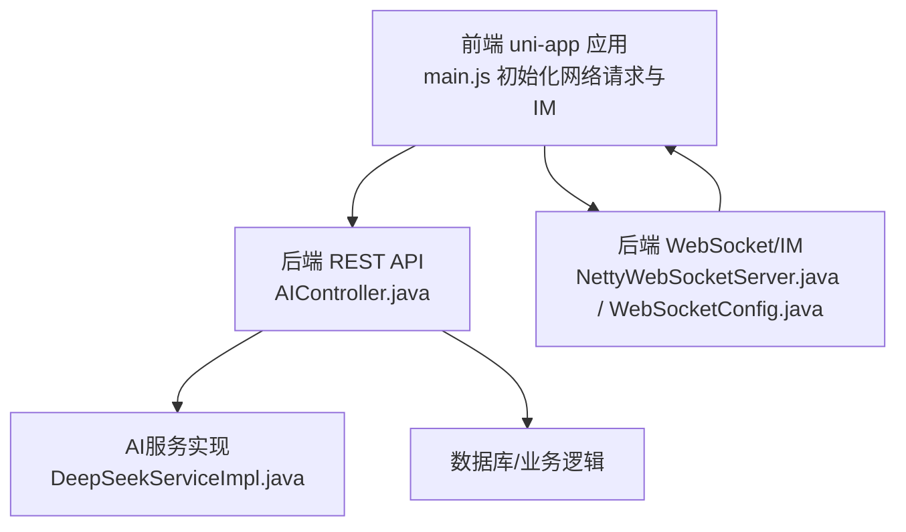
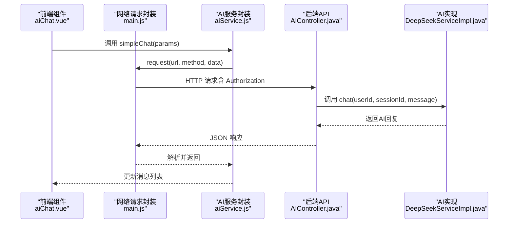
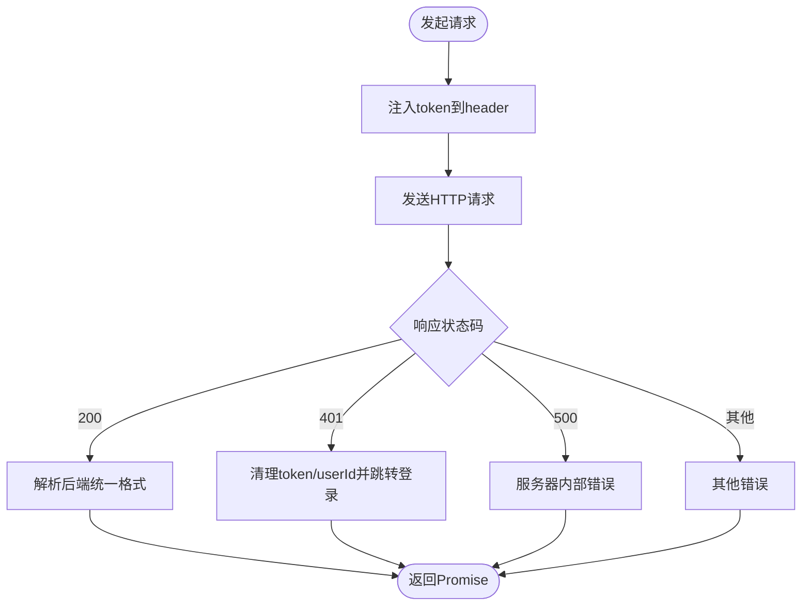
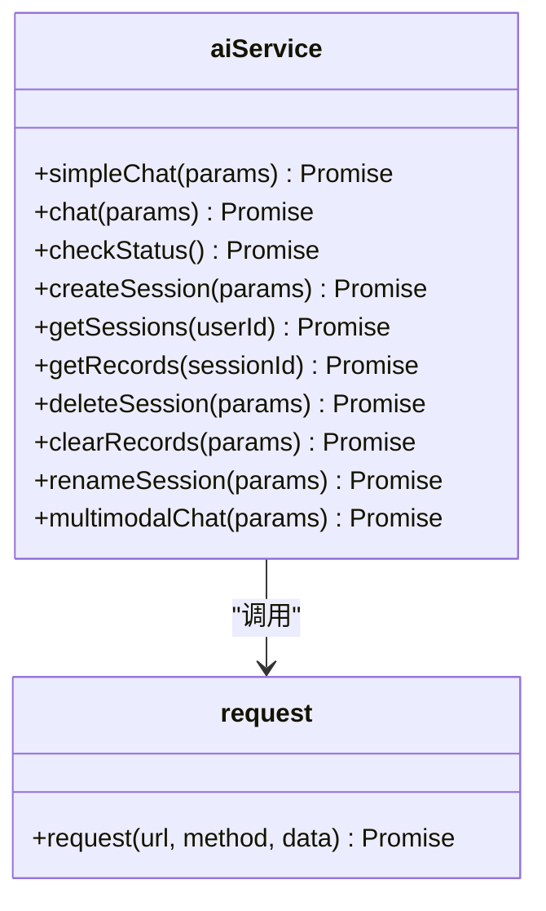
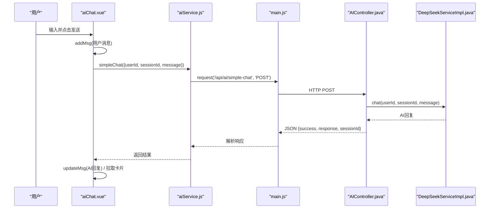
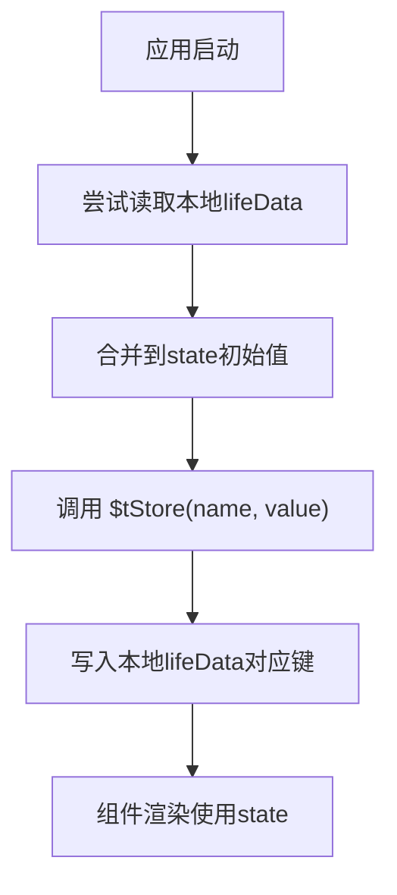
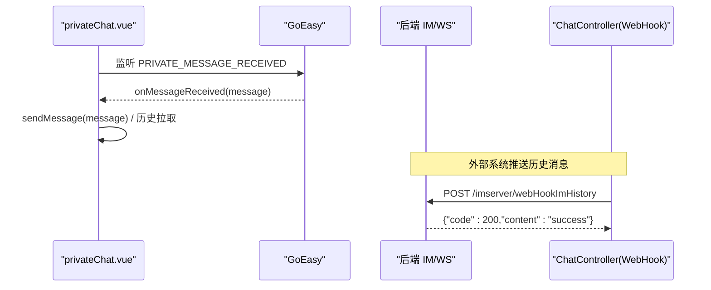
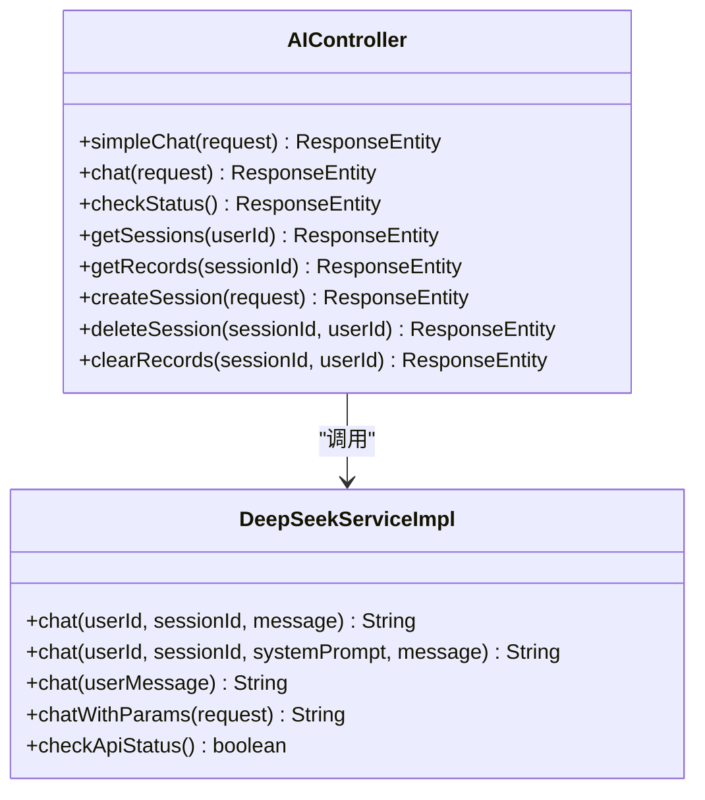
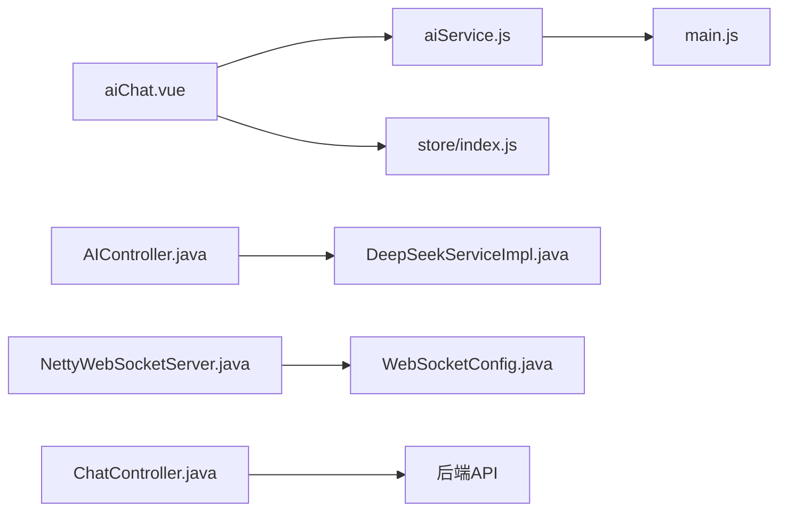

# 数据交互

<cite>
**本文引用的文件**
- [aiService.js](file://uniapp-travel-social/services/aiService.js)
- [aiChat.vue](file://uniapp-travel-social/homePages/aiChat/aiChat.vue)
- [main.js](file://uniapp-travel-social/main.js)
- [index.js](file://uniapp-travel-social/store/index.js)
- [privateChat.vue](file://uniapp-travel-social/messagePages/privateChat.vue)
- [groupChat.vue](file://uniapp-travel-social/messagePages/groupChat.vue)
- [AIController.java](file://springboot-travel-social/src/main/java/com/cxx/controller/AIController.java)
- [DeepSeekServiceImpl.java](file://springboot-travel-social/src/main/java/com/cxx/service/impl/DeepSeekServiceImpl.java)
- [NettyWebSocketServer.java](file://springboot-travel-social/src/main/java/com/cxx/component/NettyWebSocketServer.java)
- [WebSocketConfig.java](file://springboot-travel-social/src/main/java/com/cxx/config/WebSocketConfig.java)
- [ChatController.java](file://springboot-travel-social/src/main/java/com/cxx/controller/ChatController.java)
</cite>

## 目录
1. [简介](#简介)
2. [项目结构](#项目结构)
3. [核心组件](#核心组件)
4. [架构总览](#架构总览)
5. [详细组件分析](#详细组件分析)
6. [依赖分析](#依赖分析)
7. [性能考虑](#性能考虑)
8. [故障排查指南](#故障排查指南)
9. [结论](#结论)
10. [附录](#附录)

## 简介
本文件聚焦于"数据交互"的综合文档，覆盖前端与后端API的数据交互方式、luch-request库的使用与配置、Vuex状态管理、AI服务封装、WebSocket实时通信、数据缓存与本地存储、会话管理以及网络请求优化与错误处理最佳实践。目标是帮助开发者快速理解并高效扩展数据交互能力。

## 项目结构
本项目采用前后端分离架构：
- 前端基于 uni-app，通过封装的网络请求库与后端交互，并集成即时通讯（GoEasy IM）与Vuex状态管理。
- 后端基于 Spring Boot，提供REST API与WebSocket服务，支撑AI聊天、消息历史、会话管理等功能。

图表来源
- [main.js:15-56](file://uniapp-travel-social/main.js#L15-L56)
- [AIController.java:22-129](file://springboot-travel-social/src/main/java/com/cxx/controller/AIController.java#L22-L129)
- [DeepSeekServiceImpl.java:25-187](file://springboot-travel-social/src/main/java/com/cxx/service/impl/DeepSeekServiceImpl.java#L25-L187)
- [NettyWebSocketServer.java:28-75](file://springboot-travel-social/src/main/java/com/cxx/component/NettyWebSocketServer.java#L28-L75)
- [WebSocketConfig.java:8-13](file://springboot-travel-social/src/main/java/com/cxx/config/WebSocketConfig.java#L8-L13)

章节来源
- [main.js:15-56](file://uniapp-travel-social/main.js#L15-L56)
- [AIController.java:22-129](file://springboot-travel-social/src/main/java/com/cxx/controller/AIController.java#L22-L129)
- [DeepSeekServiceImpl.java:25-187](file://springboot-travel-social/src/main/java/com/cxx/service/impl/DeepSeekServiceImpl.java#L25-L187)
- [NettyWebSocketServer.java:28-75](file://springboot-travel-social/src/main/java/com/cxx/component/NettyWebSocketServer.java#L28-L75)
- [WebSocketConfig.java:8-13](file://springboot-travel-social/src/main/java/com/cxx/config/WebSocketConfig.java#L8-L13)

## 核心组件
- 前端网络请求封装与拦截器：统一注入token、全局loading、401处理。
- AI服务封装：aiService.js 提供统一的AI聊天、会话管理、状态检查等接口。
- Vue组件：aiChat.vue 调用 aiService 实现聊天界面；privateChat.vue、groupChat.vue 集成GoEasy IM实现实时消息。
- 后端API：AIController 提供聊天、会话、记录查询等接口；DeepSeekServiceImpl 调用第三方AI服务。
- WebSocket/IM：NettyWebSocketServer 与 WebSocketConfig 提供WebSocket接入；ChatController 支持WebHook历史消息入库。

章节来源
- [aiService.js:4-40](file://uniapp-travel-social/services/aiService.js#L4-L40)
- [aiChat.vue:341-402](file://uniapp-travel-social/homePages/aiChat/aiChat.vue#L341-L402)
- [privateChat.vue:452-470](file://uniapp-travel-social/messagePages/privateChat.vue#L452-L470)
- [groupChat.vue:439-454](file://uniapp-travel-social/messagePages/groupChat.vue#L439-L454)
- [AIController.java:22-129](file://springboot-travel-social/src/main/java/com/cxx/controller/AIController.java#L22-L129)
- [DeepSeekServiceImpl.java:25-187](file://springboot-travel-social/src/main/java/com/cxx/service/impl/DeepSeekServiceImpl.java#L25-L187)
- [NettyWebSocketServer.java:28-75](file://springboot-travel-social/src/main/java/com/cxx/component/NettyWebSocketServer.java#L28-L75)
- [WebSocketConfig.java:8-13](file://springboot-travel-social/src/main/java/com/cxx/config/WebSocketConfig.java#L8-L13)
- [ChatController.java:23-40](file://springboot-travel-social/src/main/java/com/cxx/controller/ChatController.java#L23-L40)

## 架构总览
从前端到后端的数据交互链路如下：

图表来源
- [aiChat.vue:354-364](file://uniapp-travel-social/homePages/aiChat/aiChat.vue#L354-L364)
- [aiService.js:52-84](file://uniapp-travel-social/services/aiService.js#L52-L84)
- [main.js:25-32](file://uniapp-travel-social/main.js#L25-L32)
- [AIController.java:32-129](file://springboot-travel-social/src/main/java/com/cxx/controller/AIController.java#L32-L129)
- [DeepSeekServiceImpl.java:62-82](file://springboot-travel-social/src/main/java/com/cxx/service/impl/DeepSeekServiceImpl.java#L62-L82)

## 详细组件分析

### 前端网络请求封装与拦截器
- 全局初始化：设置基础URL、全局beforeRequest注入token、afterRequest统一处理401登出。
- 请求封装：request函数统一处理成功/失败/网络错误，返回后端统一格式数据。
- 会话与鉴权：自动携带token，401时清理本地存储并跳转登录。

图表来源
- [main.js:15-56](file://uniapp-travel-social/main.js#L15-L56)
- [aiService.js:4-40](file://uniapp-travel-social/services/aiService.js#L4-L40)

章节来源
- [main.js:15-56](file://uniapp-travel-social/main.js#L15-L56)
- [aiService.js:4-40](file://uniapp-travel-social/services/aiService.js#L4-L40)

### luch-request库使用与配置
- 基础配置：baseUrl、全局header注入token。
- 生命周期钩子：beforeRequest、afterRequest分别用于加载提示与401处理。
- 与uni.$http绑定，全局可用。

章节来源
- [main.js:15-56](file://uniapp-travel-social/main.js#L15-L56)

### AI服务封装（aiService.js）
- 统一封装：simpleChat、chat、checkStatus、createSession、getSessions、getRecords、deleteSession、clearRecords、renameSession、multimodalChat。
- 参数校验与请求构造：对必填项、长度限制进行前置校验，构造后端所需参数。
- 错误处理：捕获异常并抛出，由调用方统一提示。
- 会话管理：支持传入sessionId或自动创建新会话。

图表来源
- [aiService.js:42-291](file://uniapp-travel-social/services/aiService.js#L42-L291)

章节来源
- [aiService.js:42-291](file://uniapp-travel-social/services/aiService.js#L42-L291)

### Vue组件中的AI调用流程（aiChat.vue）
- 登录态与用户信息：从本地存储获取userId与头像。
- 发送消息：构建消息、添加"正在输入"占位、调用aiService.simpleChat。
- 结果处理：更新消息列表、拉取卡片数据、更新上下文、滚动到底部。
- 停止与重试：支持停止生成与重试。

图表来源
- [aiChat.vue:341-402](file://uniapp-travel-social/homePages/aiChat/aiChat.vue#L341-L402)
- [aiService.js:52-84](file://uniapp-travel-social/services/aiService.js#L52-L84)
- [main.js:25-32](file://uniapp-travel-social/main.js#L25-L32)
- [AIController.java:32-129](file://springboot-travel-social/src/main/java/com/cxx/controller/AIController.java#L32-L129)
- [DeepSeekServiceImpl.java:62-82](file://springboot-travel-social/src/main/java/com/cxx/service/impl/DeepSeekServiceImpl.java#L62-L82)

章节来源
- [aiChat.vue:286-402](file://uniapp-travel-social/homePages/aiChat/aiChat.vue#L286-L402)
- [aiService.js:52-84](file://uniapp-travel-social/services/aiService.js#L52-L84)
- [AIController.java:32-129](file://springboot-travel-social/src/main/java/com/cxx/controller/AIController.java#L32-L129)
- [DeepSeekServiceImpl.java:62-82](file://springboot-travel-social/src/main/java/com/cxx/service/impl/DeepSeekServiceImpl.java#L62-L82)

### Vuex状态管理（index.js）
- 持久化策略：通过$store简写方法将指定state同步到本地存储lifeData，实现跨会话保留。
- 通用写入：$tStore(name, value) 支持多层嵌套更新，自动落盘。
- 典型场景：导航栏高度、版本号、用户信息等。

图表来源
- [index.js:6-30](file://uniapp-travel-social/store/index.js#L6-L30)
- [index.js:32-75](file://uniapp-travel-social/store/index.js#L32-L75)

章节来源
- [index.js:6-30](file://uniapp-travel-social/store/index.js#L6-L30)
- [index.js:32-75](file://uniapp-travel-social/store/index.js#L32-L75)

### 即时通讯（GoEasy IM）与WebSocket
- 私聊与群聊：privateChat.vue、groupChat.vue 分别监听私聊/群聊事件，实现消息收发、历史拉取、撤回、删除、多选等。
- IM初始化：main.js 中初始化GoEasy，设置host、appkey、模块与通知策略。
- WebHook：ChatController 接收外部历史消息WebHook，批量入库。

图表来源
- [privateChat.vue:452-470](file://uniapp-travel-social/messagePages/privateChat.vue#L452-L470)
- [groupChat.vue:439-454](file://uniapp-travel-social/messagePages/groupChat.vue#L439-L454)
- [main.js:76-111](file://uniapp-travel-social/main.js#L76-L111)
- [ChatController.java:23-40](file://springboot-travel-social/src/main/java/com/cxx/controller/ChatController.java#L23-L40)

章节来源
- [privateChat.vue:452-470](file://uniapp-travel-social/messagePages/privateChat.vue#L452-L470)
- [groupChat.vue:439-454](file://uniapp-travel-social/messagePages/groupChat.vue#L439-L454)
- [main.js:76-111](file://uniapp-travel-social/main.js#L76-L111)
- [ChatController.java:23-40](file://springboot-travel-social/src/main/java/com/cxx/controller/ChatController.java#L23-L40)

### WebSocket服务端实现
- Netty服务：NettyWebSocketServer 在启动时绑定端口，配置IdleStateHandler、Http编解码、WebSocket协议处理器。
- Spring WebSocket：WebSocketConfig 提供ServerEndpointExporter Bean，便于注解式端点。

章节来源
- [NettyWebSocketServer.java:28-75](file://springboot-travel-social/src/main/java/com/cxx/component/NettyWebSocketServer.java#L28-L75)
- [WebSocketConfig.java:8-13](file://springboot-travel-social/src/main/java/com/cxx/config/WebSocketConfig.java#L8-L13)

### 后端API与AI服务
- AIController：提供简单聊天、通用聊天、状态检查、会话与记录查询、会话管理等接口；内置参数校验与异常处理。
- DeepSeekServiceImpl：封装RestTemplate调用第三方AI接口，支持系统提示、温度、最大token等参数；异步与同步两种调用方式；提供API状态检查。

图表来源
- [AIController.java:22-404](file://springboot-travel-social/src/main/java/com/cxx/controller/AIController.java#L22-L404)
- [DeepSeekServiceImpl.java:25-324](file://springboot-travel-social/src/main/java/com/cxx/service/impl/DeepSeekServiceImpl.java#L25-L324)

章节来源
- [AIController.java:22-404](file://springboot-travel-social/src/main/java/com/cxx/controller/AIController.java#L22-L404)
- [DeepSeekServiceImpl.java:25-324](file://springboot-travel-social/src/main/java/com/cxx/service/impl/DeepSeekServiceImpl.java#L25-L324)

## 依赖分析
- 前端依赖关系：aiChat.vue 依赖 aiService.js；aiService.js 依赖 main.js 的全局请求封装；Vuex 依赖 store/index.js。
- 后端依赖关系：AIController 依赖 DeepSeekServiceImpl；NettyWebSocketServer 与 WebSocketConfig 提供WebSocket接入；ChatController 作为WebHook入口。

图表来源
- [aiChat.vue:236-236](file://uniapp-travel-social/homePages/aiChat/aiChat.vue#L236-L236)
- [aiService.js:42-43](file://uniapp-travel-social/services/aiService.js#L42-L43)
- [main.js:15-16](file://uniapp-travel-social/main.js#L15-L16)
- [index.js:32-75](file://uniapp-travel-social/store/index.js#L32-L75)
- [AIController.java:22-129](file://springboot-travel-social/src/main/java/com/cxx/controller/AIController.java#L22-L129)
- [DeepSeekServiceImpl.java:25-187](file://springboot-travel-social/src/main/java/com/cxx/service/impl/DeepSeekServiceImpl.java#L25-L187)
- [NettyWebSocketServer.java:28-75](file://springboot-travel-social/src/main/java/com/cxx/component/NettyWebSocketServer.java#L28-L75)
- [WebSocketConfig.java:8-13](file://springboot-travel-social/src/main/java/com/cxx/config/WebSocketConfig.java#L8-L13)
- [ChatController.java:23-40](file://springboot-travel-social/src/main/java/com/cxx/controller/ChatController.java#L23-L40)

章节来源
- [aiChat.vue:236-236](file://uniapp-travel-social/homePages/aiChat/aiChat.vue#L236-L236)
- [aiService.js:42-43](file://uniapp-travel-social/services/aiService.js#L42-L43)
- [main.js:15-16](file://uniapp-travel-social/main.js#L15-L16)
- [index.js:32-75](file://uniapp-travel-social/store/index.js#L32-L75)
- [AIController.java:22-129](file://springboot-travel-social/src/main/java/com/cxx/controller/AIController.java#L22-L129)
- [DeepSeekServiceImpl.java:25-187](file://springboot-travel-social/src/main/java/com/cxx/service/impl/DeepSeekServiceImpl.java#L25-L187)
- [NettyWebSocketServer.java:28-75](file://springboot-travel-social/src/main/java/com/cxx/component/NettyWebSocketServer.java#L28-L75)
- [WebSocketConfig.java:8-13](file://springboot-travel-social/src/main/java/com/cxx/config/WebSocketConfig.java#L8-L13)
- [ChatController.java:23-40](file://springboot-travel-social/src/main/java/com/cxx/controller/ChatController.java#L23-L40)

## 性能考虑
- 请求并发与节流：在高频输入场景下，建议在前端增加防抖/节流，避免频繁触发网络请求。
- 本地缓存：利用Vuex持久化与本地存储，减少重复请求；对卡片数据可做内存缓存。
- 分页与懒加载：消息列表采用分页与懒加载，降低首屏压力。
- WebSocket长连接：保持连接稳定，合理设置心跳与超时，避免频繁重连。
- 图片/视频压缩：发送多媒体前进行压缩与缩略图生成，提升传输效率。

## 故障排查指南
- 401未授权：检查token是否过期或缺失；确认main.js afterRequest是否正确清理本地存储并跳转登录。
- 请求失败：查看aiService.js中统一错误处理分支，定位网络错误或后端错误码。
- AI接口异常：检查AIController参数校验与DeepSeekServiceImpl调用链，关注系统提示、温度、最大token等配置。
- IM消息不同步：确认GoEasy初始化与事件监听是否正确；检查WebHook是否成功入库。
- WebSocket连接问题：核对Netty端口与Idle配置，确保客户端与服务端协议一致。

章节来源
- [main.js:44-54](file://uniapp-travel-social/main.js#L44-L54)
- [aiService.js:18-37](file://uniapp-travel-social/services/aiService.js#L18-L37)
- [AIController.java:32-129](file://springboot-travel-social/src/main/java/com/cxx/controller/AIController.java#L32-L129)
- [DeepSeekServiceImpl.java:133-187](file://springboot-travel-social/src/main/java/com/cxx/service/impl/DeepSeekServiceImpl.java#L133-L187)
- [privateChat.vue:452-470](file://uniapp-travel-social/messagePages/privateChat.vue#L452-L470)
- [groupChat.vue:439-454](file://uniapp-travel-social/messagePages/groupChat.vue#L439-L454)
- [ChatController.java:23-40](file://springboot-travel-social/src/main/java/com/cxx/controller/ChatController.java#L23-L40)
- [NettyWebSocketServer.java:63-71](file://springboot-travel-social/src/main/java/com/cxx/component/NettyWebSocketServer.java#L63-L71)

## 结论
本项目在前端通过统一的网络请求封装与Vuex持久化，配合后端REST API与WebSocket/IM，实现了完整的数据交互闭环。AI服务封装清晰、错误处理完备、会话管理灵活；IM模块支持私聊与群聊，具备良好的扩展性。建议在后续迭代中进一步完善请求节流、缓存策略与监控埋点，持续优化用户体验与系统稳定性。

## 附录
- 最佳实践清单
  - 前端：统一拦截器、参数校验、错误提示、本地缓存、分页懒加载。
  - 后端：参数校验、异常日志、限流与熔断、健康检查、WebHook幂等。
  - IM：事件去重、离线消息补推、断线重连、消息回执。
  - WebSocket：心跳与超时、协议升级、异常恢复、资源释放。