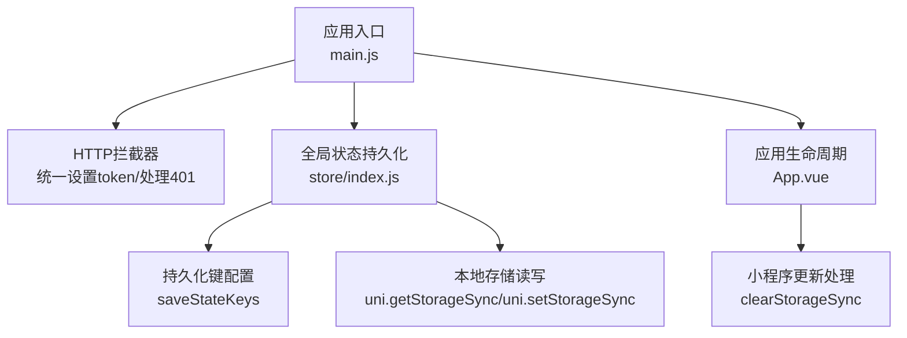
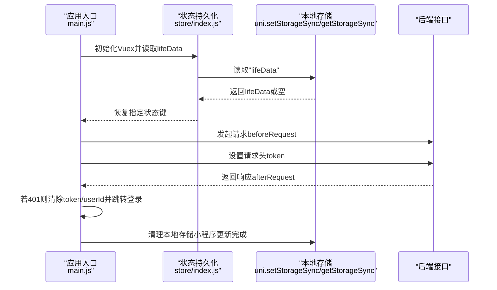
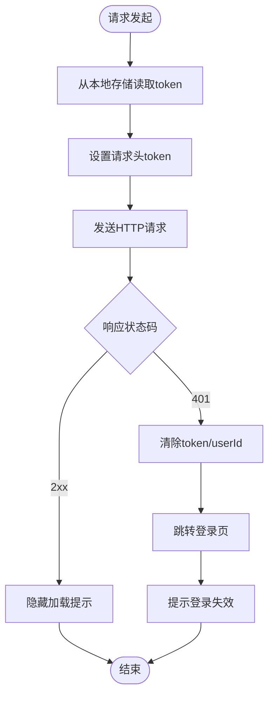
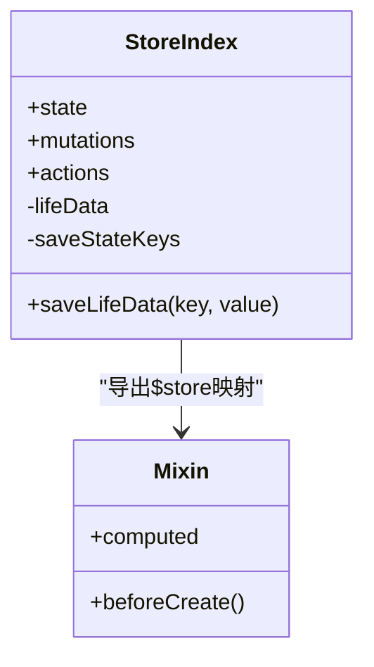
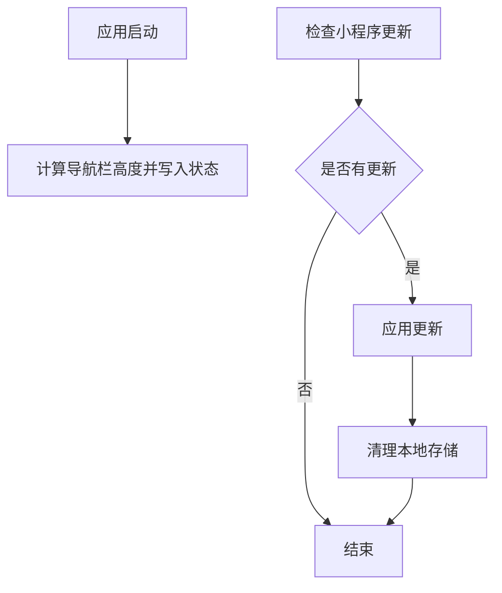
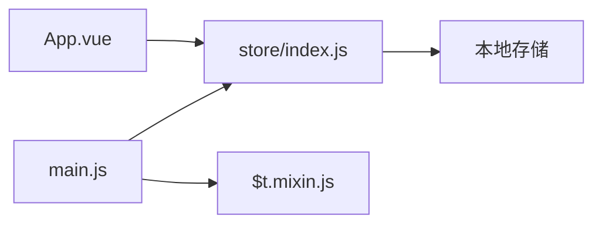

# 数据持久化

<cite>
**本文引用的文件**
- [main.js](file://uniapp-travel-social/main.js)
- [App.vue](file://uniapp-travel-social/App.vue)
- [store/index.js](file://uniapp-travel-social/store/index.js)
- [$t.mixin.js](file://uniapp-travel-social/store/$t.mixin.js)
</cite>

## 目录
1. [引言](#引言)
2. [项目结构](#项目结构)
3. [核心组件](#核心组件)
4. [架构总览](#架构总览)
5. [详细组件分析](#详细组件分析)
6. [依赖关系分析](#依赖关系分析)
7. [性能考量](#性能考量)
8. [故障排查指南](#故障排查指南)
9. [结论](#结论)
10. [附录](#附录)

## 引言
本文件聚焦于“数据持久化”的综合实践，围绕本地存储（localStorage/uni.setStorageSync）、token存储与管理、用户信息缓存策略、Vuex状态持久化、会话管理、缓存策略设计以及数据生命周期管理（备份、迁移、清理）展开。通过对现有代码的深入分析，给出可操作的实现建议与最佳实践，帮助开发者在保证用户体验的同时提升系统的稳定性与安全性。

## 项目结构
本项目采用 UniApp 前端框架，结合 Vue + Vuex 构建状态管理与持久化方案；后端通过 HTTP 请求与服务端交互。数据持久化主要涉及以下模块：
- 应用入口与全局拦截：在应用入口统一注入 HTTP 请求拦截器，携带 token 并处理 401 失效跳转。
- 全局状态持久化：通过 Vuex 的自定义持久化机制，将指定状态键写入本地存储并在应用启动时恢复。
- 应用生命周期与更新：在应用启动时进行系统信息获取与自定义导航栏高度计算，并在小程序更新完成时清理本地存储以确保一致性。

图表来源
- [main.js:25-56](file://uniapp-travel-social/main.js#L25-L56)
- [store/index.js:15-30](file://uniapp-travel-social/store/index.js#L15-L30)
- [store/index.js:32-75](file://uniapp-travel-social/store/index.js#L32-L75)
- [App.vue:40-77](file://uniapp-travel-social/App.vue#L40-L77)

章节来源
- [main.js:1-118](file://uniapp-travel-social/main.js#L1-L118)
- [App.vue:1-93](file://uniapp-travel-social/App.vue#L1-L93)
- [store/index.js:1-75](file://uniapp-travel-social/store/index.js#L1-L75)
- [$t.mixin.js:1-24](file://uniapp-travel-social/store/$t.mixin.js#L1-L24)

## 核心组件
- HTTP 请求拦截与 token 管理
  - 在请求前将 token 写入请求头，确保接口鉴权。
  - 在响应后当状态码为 401 时，清除 token 与 userId，并跳转至登录页，实现自动登出与安全退出。
- Vuex 状态持久化
  - 启动时从本地存储读取 lifeData，恢复指定状态键。
  - 提供统一的 $tStore 提交方法，将被标记的键写回本地存储，实现状态与本地存储的双向同步。
- 应用生命周期与更新
  - 应用启动时计算自定义导航栏高度并写入状态。
  - 小程序更新完成后清理本地存储，避免旧数据导致的兼容性问题。

章节来源
- [main.js:25-56](file://uniapp-travel-social/main.js#L25-L56)
- [store/index.js:15-30](file://uniapp-travel-social/store/index.js#L15-L30)
- [store/index.js:32-75](file://uniapp-travel-social/store/index.js#L32-L75)
- [App.vue:40-77](file://uniapp-travel-social/App.vue#L40-L77)

## 架构总览
下图展示了数据持久化在应用中的整体流程：应用启动时恢复状态，请求阶段携带 token，响应阶段根据状态码处理会话失效，更新流程中清理本地存储以确保一致性。

图表来源
- [main.js:25-56](file://uniapp-travel-social/main.js#L25-L56)
- [store/index.js:8-13](file://uniapp-travel-social/store/index.js#L8-L13)
- [store/index.js:19-30](file://uniapp-travel-social/store/index.js#L19-L30)
- [App.vue:52](file://uniapp-travel-social/App.vue#L52)

## 详细组件分析

### 组件A：HTTP 请求拦截与 token 管理
- 功能要点
  - 请求前钩子：从本地存储读取 token 并写入请求头，确保接口鉴权。
  - 响应后钩子：当响应状态码为 401 时，清除 token 与 userId，并跳转至登录页，实现自动登出与安全退出。
- 关键路径
  - 请求前设置 token：[main.js:25-32](file://uniapp-travel-social/main.js#L25-L32)
  - 响应后处理 401：[main.js:44-56](file://uniapp-travel-social/main.js#L44-L56)

图表来源
- [main.js:25-56](file://uniapp-travel-social/main.js#L25-L56)

章节来源
- [main.js:25-56](file://uniapp-travel-social/main.js#L25-L56)

### 组件B：Vuex 状态持久化与本地存储同步
- 功能要点
  - 启动恢复：应用启动时从本地存储读取 lifeData，并恢复指定状态键。
  - 实时持久化：通过统一的 $tStore 提交流程，将被标记的键写回本地存储，实现状态与本地存储的双向同步。
  - 键配置：通过 saveStateKeys 控制哪些状态键需要持久化。
- 关键路径
  - 读取 lifeData：[store/index.js:8-13](file://uniapp-travel-social/store/index.js#L8-L13)
  - 持久化保存函数：[store/index.js:19-30](file://uniapp-travel-social/store/index.js#L19-L30)
  - 状态提交与持久化：[store/index.js:48-70](file://uniapp-travel-social/store/index.js#L48-L70)
  - 全局混入导出：[$t.mixin.js:12-24](file://uniapp-travel-social/store/$t.mixin.js#L12-L24)

图表来源
- [store/index.js:32-75](file://uniapp-travel-social/store/index.js#L32-L75)
- [$t.mixin.js:12-24](file://uniapp-travel-social/store/$t.mixin.js#L12-L24)

章节来源
- [store/index.js:15-30](file://uniapp-travel-social/store/index.js#L15-L30)
- [store/index.js:32-75](file://uniapp-travel-social/store/index.js#L32-L75)
- [$t.mixin.js:1-24](file://uniapp-travel-social/store/$t.mixin.js#L1-L24)

### 组件C：应用生命周期与更新处理
- 功能要点
  - 启动阶段：计算系统平台类型与自定义导航栏高度，写入状态。
  - 更新阶段：小程序更新完成后，清理本地存储，确保新版本数据一致性。
- 关键路径
  - 计算导航栏高度并写入状态：[App.vue:29-38](file://uniapp-travel-social/App.vue#L29-L38)
  - 小程序更新与清理：[App.vue:42-77](file://uniapp-travel-social/App.vue#L42-L77)

图表来源
- [App.vue:29-38](file://uniapp-travel-social/App.vue#L29-L38)
- [App.vue:42-77](file://uniapp-travel-social/App.vue#L42-L77)

章节来源
- [App.vue:29-38](file://uniapp-travel-social/App.vue#L29-L38)
- [App.vue:42-77](file://uniapp-travel-social/App.vue#L42-L77)

### 组件D：会话管理与安全退出
- 登录状态保持
  - 在请求前统一注入 token，确保后续接口调用具备鉴权信息。
- 自动登录实现
  - 当前实现未包含自动登录逻辑，仅在 401 时触发登出与跳转。
- 权限验证与安全退出
  - 401 响应触发 token 清除与跳转登录，实现权限失效后的安全退出。

章节来源
- [main.js:25-56](file://uniapp-travel-social/main.js#L25-L56)

### 组件E：用户信息缓存策略
- 缓存键与范围
  - 通过 saveStateKeys 控制哪些状态键参与持久化，当前示例中包含用户相关信息键。
- 更新时机
  - 状态变更通过 $tStore 提交流程实时写回本地存储，确保数据即时落盘。
- 失效机制
  - 401 响应触发 token 清理，间接使用户信息失效；应用更新完成后清理本地存储，进一步保证一致性。

章节来源
- [store/index.js:15-30](file://uniapp-travel-social/store/index.js#L15-L30)
- [store/index.js:48-70](file://uniapp-travel-social/store/index.js#L48-L70)
- [main.js:44-56](file://uniapp-travel-social/main.js#L44-L56)
- [App.vue:52](file://uniapp-travel-social/App.vue#L52)

### 组件F：数据缓存策略设计
- 缓存命中率优化
  - 将高频访问且变化频率较低的状态键（如用户信息、导航栏高度）纳入持久化，减少重复拉取。
- 内存管理
  - 仅持久化必要键，避免将大体量数据写入本地存储，降低内存占用。
- 存储空间控制
  - 通过 saveStateKeys 精准控制持久化范围；在应用更新完成后主动清理本地存储，释放空间并避免脏数据。

章节来源
- [store/index.js:15-30](file://uniapp-travel-social/store/index.js#L15-L30)
- [store/index.js:48-70](file://uniapp-travel-social/store/index.js#L48-L70)
- [App.vue:52](file://uniapp-travel-social/App.vue#L52)

### 组件G：数据生命周期管理（备份、迁移、清理）
- 备份
  - 建议在关键业务节点（如用户信息变更）将 lifeData 进行深拷贝并写入额外的备份键，便于回滚。
- 迁移
  - 版本升级时，可在启动阶段读取旧 lifeData 并进行字段映射与转换，再写回新的 lifeData 结构。
- 清理
  - 小程序更新完成后清理本地存储，确保新旧数据隔离；在用户登出时同步清理 token 与用户信息。

章节来源
- [store/index.js:8-13](file://uniapp-travel-social/store/index.js#L8-L13)
- [store/index.js:19-30](file://uniapp-travel-social/store/index.js#L19-L30)
- [App.vue:52](file://uniapp-travel-social/App.vue#L52)
- [main.js:44-56](file://uniapp-travel-social/main.js#L44-L56)

## 依赖关系分析
- 组件耦合
  - main.js 依赖 store/index.js 提供的持久化能力，并通过全局混入使组件可通过 $t.vuex 使用统一的状态提交方法。
  - App.vue 负责应用生命周期与更新处理，间接影响本地存储的一致性。
- 外部依赖
  - 使用 uni.setStorageSync/uni.getStorageSync 进行本地存储读写。
  - 使用 @escook/request-miniprogram 进行 HTTP 请求与拦截。

图表来源
- [main.js:19-24](file://uniapp-travel-social/main.js#L19-L24)
- [store/index.js:32-75](file://uniapp-travel-social/store/index.js#L32-L75)
- [App.vue:40-77](file://uniapp-travel-social/App.vue#L40-L77)

章节来源
- [main.js:19-24](file://uniapp-travel-social/main.js#L19-L24)
- [store/index.js:32-75](file://uniapp-travel-social/store/index.js#L32-L75)
- [App.vue:40-77](file://uniapp-travel-social/App.vue#L40-L77)

## 性能考量
- 本地存储读写开销
  - 频繁的持久化写入可能影响主线程性能，建议合并状态变更或节流写入。
- 网络与鉴权
  - 统一注入 token 减少重复设置，但需注意 token 有效期与刷新策略。
- 内存与存储
  - 仅持久化必要键，避免大对象写入；在应用更新后清理本地存储，释放内存与存储空间。

## 故障排查指南
- token 无效或频繁 401
  - 检查请求前是否正确读取并设置 token；确认后端 token 有效期与刷新机制。
  - 观察响应后钩子是否按预期清除 token 并跳转登录。
- 用户信息未恢复
  - 确认 saveStateKeys 中是否包含目标状态键；检查 lifeData 是否存在且结构正确。
- 应用更新后数据异常
  - 确认更新完成回调中是否执行了本地存储清理；检查新旧版本的数据结构差异。

章节来源
- [main.js:25-56](file://uniapp-travel-social/main.js#L25-L56)
- [store/index.js:15-30](file://uniapp-travel-social/store/index.js#L15-L30)
- [store/index.js:8-13](file://uniapp-travel-social/store/index.js#L8-L13)
- [App.vue:52](file://uniapp-travel-social/App.vue#L52)

## 结论
本项目已实现基础的 token 管理与 Vuex 状态持久化，配合应用生命周期与更新处理，形成较为完整的数据持久化闭环。为进一步提升系统稳定性与用户体验，建议补充自动登录机制、完善 token 刷新策略、细化缓存键粒度与失效规则，并在版本升级时引入更稳健的数据迁移与备份方案。

## 附录
- 最佳实践清单
  - 仅持久化必要状态键，避免大对象写入。
  - 在用户登出与 401 场景下同步清理 token 与用户信息。
  - 应用更新完成后清理本地存储，确保新旧数据隔离。
  - 在关键业务节点增加数据备份与迁移策略，保障版本升级的平滑过渡。