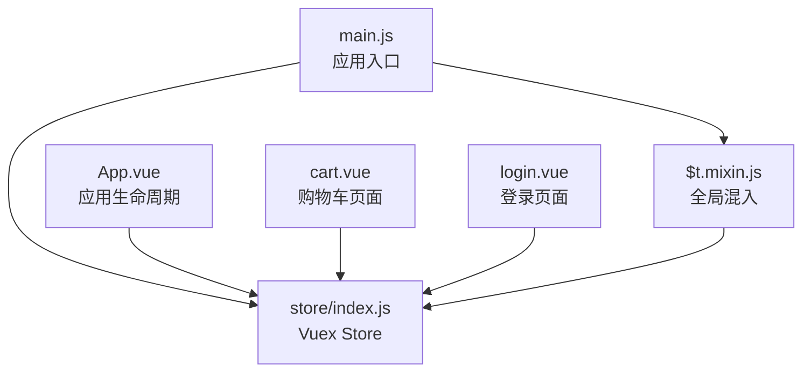
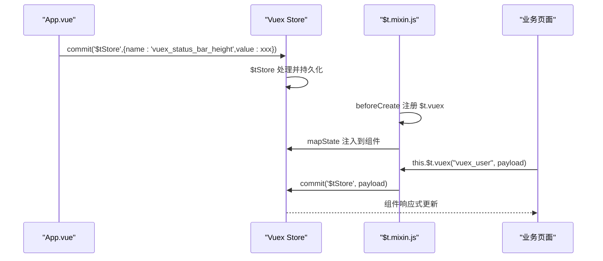
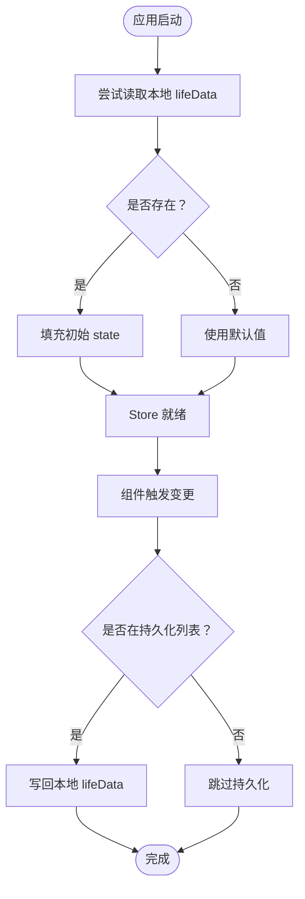
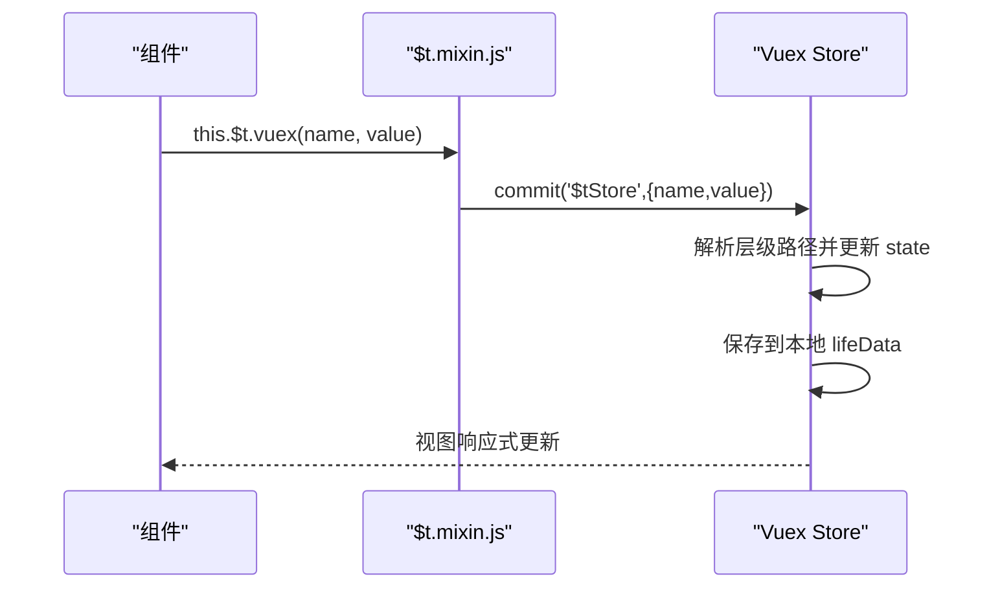
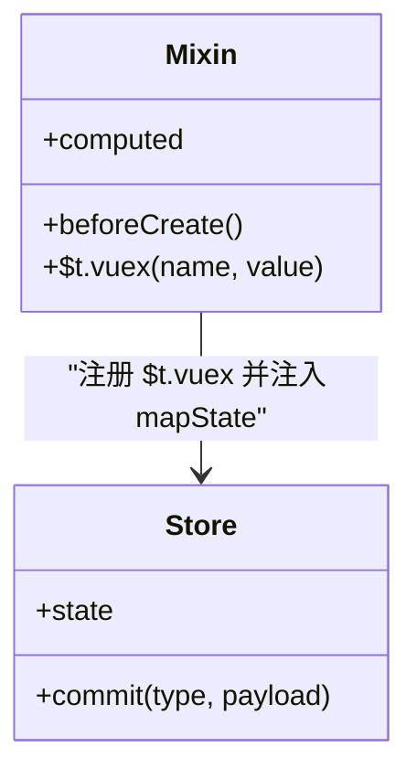
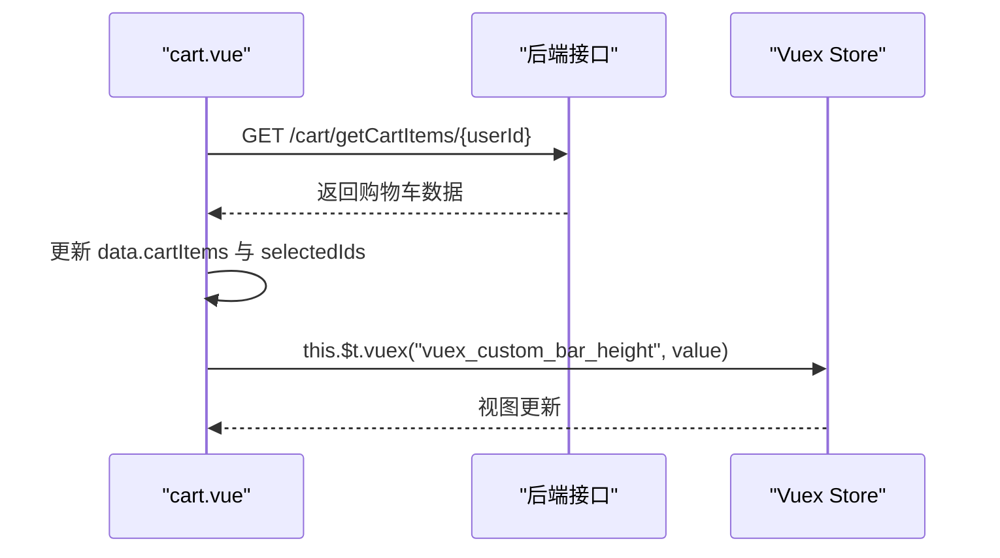
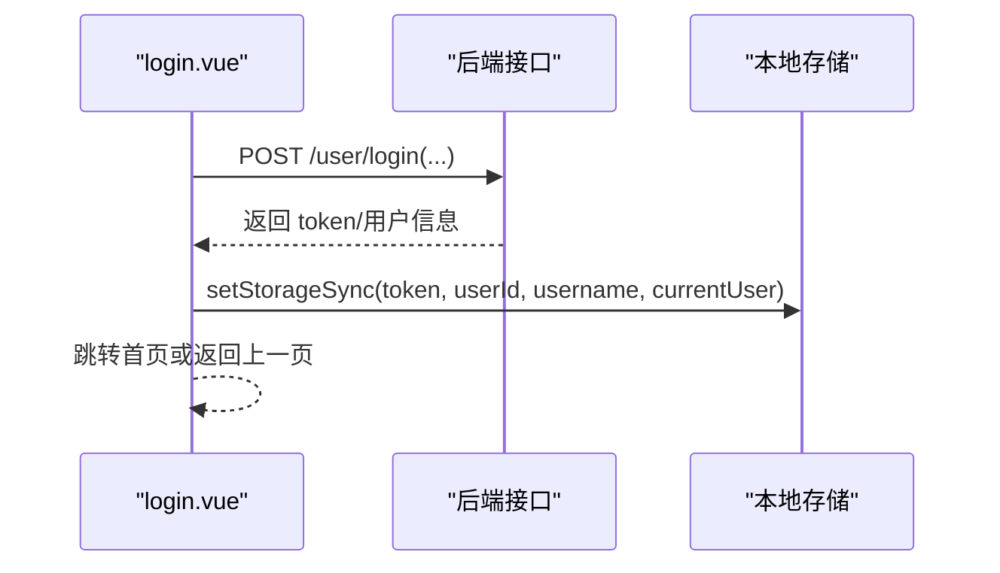
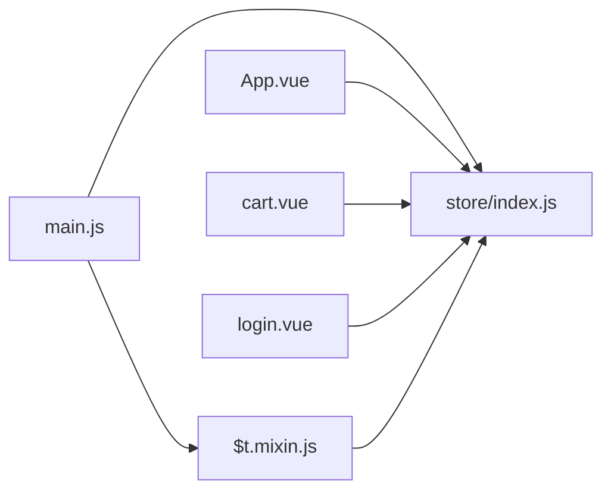

# 状态管理

<cite>
**本文引用的文件**
- [store/index.js](file://uniapp-travel-social/store/index.js)
- [$t.mixin.js](file://uniapp-travel-social/store/$t.mixin.js)
- [main.js](file://uniapp-travel-social/main.js)
- [App.vue](file://uniapp-travel-social/App.vue)
- [cart.vue](file://uniapp-travel-social/pages/preferredPages/cart.vue)
- [login.vue](file://uniapp-travel-social/homePages/login/login.vue)
</cite>

## 目录
1. [简介](#简介)
2. [项目结构](#项目结构)
3. [核心组件](#核心组件)
4. [架构总览](#架构总览)
5. [详细组件分析](#详细组件分析)
6. [依赖分析](#依赖分析)
7. [性能考虑](#性能考虑)
8. [故障排查指南](#故障排查指南)
9. [结论](#结论)
10. [附录](#附录)

## 简介
本文件系统性梳理 uniapp-travel-social 项目的状态管理实现，围绕 Vuex Store 的初始化与配置、模块化设计思路、state 数据结构、mutations 同步更新机制、actions 异步处理、getters 使用建议、以及 $t.mixin.js 中的 Vuex 简写方法进行深入解析，并结合购物车、登录等页面展示状态管理的实际使用场景，最后给出状态持久化、模块间通信与调试的最佳实践。

## 项目结构
本项目采用 uni-app 技术栈，前端状态管理集中在 store 目录：
- store/index.js：Vuex Store 初始化、state 定义、mutations、actions
- store/$t.mixin.js：全局混入，提供 $t.vuex 简写与 mapState 注入
- main.js：应用入口，引入 store 与 $t.mixin.js
- App.vue：应用生命周期中通过 commit 触发导航栏高度等状态更新
- 页面示例：pages/preferredPages/cart.vue（购物车）、homePages/login/login.vue（登录）

图表来源
- [main.js:1-118](file://uniapp-travel-social/main.js#L1-L118)
- [store/index.js:1-75](file://uniapp-travel-social/store/index.js#L1-L75)
- [store/$t.mixin.js:1-24](file://uniapp-travel-social/store/$t.mixin.js#L1-L24)
- [App.vue:1-93](file://uniapp-travel-social/App.vue#L1-L93)
- [cart.vue:1-493](file://uniapp-travel-social/pages/preferredPages/cart.vue#L1-L493)
- [login.vue:1-628](file://uniapp-travel-social/homePages/login/login.vue#L1-L628)

章节来源
- [store/index.js:1-75](file://uniapp-travel-social/store/index.js#L1-L75)
- [store/$t.mixin.js:1-24](file://uniapp-travel-social/store/$t.mixin.js#L1-L24)
- [main.js:1-118](file://uniapp-travel-social/main.js#L1-L118)
- [App.vue:1-93](file://uniapp-travel-social/App.vue#L1-L93)
- [cart.vue:1-493](file://uniapp-travel-social/pages/preferredPages/cart.vue#L1-L493)
- [login.vue:1-628](file://uniapp-travel-social/homePages/login/login.vue#L1-L628)

## 核心组件
- Store 初始化与持久化
  - 通过 uni.getStorageSync 读取本地 lifeData，用于恢复初始 state
  - saveStateKeys 指定需要持久化的 key（如 vuex_user），并在每次变更时写回本地
- State 数据结构
  - vuex_user：用户信息（含默认值）
  - vuex_version：应用版本
  - vuex_custom_nav_bar：是否使用自定义导航栏
  - vuex_status_bar_height、vuex_custom_bar_height：系统状态栏与自定义导航栏高度
- Mutations
  - $tStore：通用状态更新入口，支持单层与多层嵌套路径更新，并自动持久化
- Actions
  - 当前为空，预留异步处理扩展点
- Getters
  - 当前未定义，可在后续按需扩展

章节来源
- [store/index.js:1-75](file://uniapp-travel-social/store/index.js#L1-L75)

## 架构总览
整体状态流：应用启动时从本地恢复状态；页面通过 $t.vuex 或直接 commit 触发更新；$t.mixin.js 将 store 中的 state 注入到组件实例，简化访问；App.vue 在 onLaunch 中根据设备信息设置导航栏高度。

图表来源
- [App.vue:27-38](file://uniapp-travel-social/App.vue#L27-L38)
- [store/index.js:48-70](file://uniapp-travel-social/store/index.js#L48-L70)
- [store/$t.mixin.js:12-24](file://uniapp-travel-social/store/$t.mixin.js#L12-L24)

## 详细组件分析

### Store 初始化与持久化
- 本地恢复
  - 启动时尝试读取本地 lifeData，若存在则填充对应 state 字段
- 持久化策略
  - saveStateKeys 指定需持久化的 key
  - saveLifeData 在每次变更时将指定字段写回本地存储
- 关键点
  - 以 vuex_ 前缀命名避免命名冲突
  - 支持深层路径更新（如 user.info.score）

图表来源
- [store/index.js:6-30](file://uniapp-travel-social/store/index.js#L6-L30)
- [store/index.js:32-75](file://uniapp-travel-social/store/index.js#L32-L75)

章节来源
- [store/index.js:1-75](file://uniapp-travel-social/store/index.js#L1-L75)

### Mutations 设计与实现
- $tStore 实现要点
  - 解析 payload.name 的层级路径（以 . 分隔）
  - 支持单层与多层嵌套更新
  - 自动识别持久化 key 并写回本地
- 使用场景
  - App.vue 在 onLaunch 中设置导航栏高度
  - 页面通过 $t.vuex 更新用户信息等

图表来源
- [store/$t.mixin.js:13-18](file://uniapp-travel-social/store/$t.mixin.js#L13-L18)
- [store/index.js:48-70](file://uniapp-travel-social/store/index.js#L48-L70)

章节来源
- [store/$t.mixin.js:1-24](file://uniapp-travel-social/store/$t.mixin.js#L1-L24)
- [store/index.js:48-70](file://uniapp-travel-social/store/index.js#L48-L70)

### Actions 异步处理
- 当前 store/actions 为空，适合后续扩展：
  - API 调用：封装统一的请求拦截与响应处理
  - 状态更新：在成功回调中 commit 对应 mutations
  - 错误处理：集中处理 401、网络异常等场景
- 示例扩展方向
  - 用户登录：提交用户名/密码，成功后更新 vuex_user、token 等
  - 购物车：拉取/更新/删除，联动本地缓存与后端接口

章节来源
- [store/index.js:71-73](file://uniapp-travel-social/store/index.js#L71-L73)

### Getters 使用建议
- 当前未定义 getters，建议按需扩展：
  - 派生状态：如用户权限标识、购物车统计
  - 数据过滤：如筛选已选中商品、按类型分类
  - 性能优化：利用缓存避免重复计算

章节来源
- [store/index.js:71-73](file://uniapp-travel-social/store/index.js#L71-L73)

### $t.mixin.js 的 Vuex 简写方法
- beforeCreate 注册 this.$t.vuex，统一调用 commit('$tStore')
- computed 中通过 mapState 将 store.state 的 key 注入到组件实例
- 优点
  - 统一的状态更新入口，便于调试与持久化
  - 降低组件对 store 的直接耦合

图表来源
- [store/$t.mixin.js:12-24](file://uniapp-travel-social/store/$t.mixin.js#L12-L24)
- [store/index.js:32-75](file://uniapp-travel-social/store/index.js#L32-L75)

章节来源
- [store/$t.mixin.js:1-24](file://uniapp-travel-social/store/$t.mixin.js#L1-L24)

### 页面中的状态管理使用示例

#### 购物车页面（cart.vue）
- 数据来源
  - 通过 API 拉取购物车数据，填充本地 data.cartItems
- 交互逻辑
  - 勾选/全选、数量增减、删除、清空
- 状态联动
  - 通过本地计算属性 computed 计算合计与选中数量
  - 选中项传递至下单页

图表来源
- [cart.vue:129-144](file://uniapp-travel-social/pages/preferredPages/cart.vue#L129-L144)
- [cart.vue:145-227](file://uniapp-travel-social/pages/preferredPages/cart.vue#L145-L227)
- [App.vue:27-38](file://uniapp-travel-social/App.vue#L27-L38)

章节来源
- [cart.vue:1-493](file://uniapp-travel-social/pages/preferredPages/cart.vue#L1-L493)
- [App.vue:27-38](file://uniapp-travel-social/App.vue#L27-L38)

#### 登录页面（login.vue）
- 登录流程
  - 快捷登录/密码登录，成功后写入 token、userId、username、currentUser
- 状态联动
  - 通过 uni.setStorageSync 存储用户态
  - 页面跳转或返回首页

图表来源
- [login.vue:258-293](file://uniapp-travel-social/homePages/login/login.vue#L258-L293)
- [login.vue:294-330](file://uniapp-travel-social/homePages/login/login.vue#L294-L330)

章节来源
- [login.vue:1-628](file://uniapp-travel-social/homePages/login/login.vue#L1-L628)

## 依赖分析
- main.js
  - 引入 store 与 $t.mixin.js，全局混入提供 $t.vuex 与 mapState
- App.vue
  - 在 onLaunch 中根据系统信息设置导航栏高度，通过 commit 触发
- store/index.js
  - 提供 $tStore 通用更新与本地持久化
- store/$t.mixin.js
  - 将 store.state 的 key 注入到组件实例，简化访问

图表来源
- [main.js:1-118](file://uniapp-travel-social/main.js#L1-L118)
- [store/index.js:1-75](file://uniapp-travel-social/store/index.js#L1-L75)
- [store/$t.mixin.js:1-24](file://uniapp-travel-social/store/$t.mixin.js#L1-L24)
- [App.vue:1-93](file://uniapp-travel-social/App.vue#L1-L93)
- [cart.vue:1-493](file://uniapp-travel-social/pages/preferredPages/cart.vue#L1-L493)
- [login.vue:1-628](file://uniapp-travel-social/homePages/login/login.vue#L1-L628)

章节来源
- [main.js:1-118](file://uniapp-travel-social/main.js#L1-L118)
- [store/index.js:1-75](file://uniapp-travel-social/store/index.js#L1-L75)
- [store/$t.mixin.js:1-24](file://uniapp-travel-social/store/$t.mixin.js#L1-L24)
- [App.vue:1-93](file://uniapp-travel-social/App.vue#L1-L93)
- [cart.vue:1-493](file://uniapp-travel-social/pages/preferredPages/cart.vue#L1-L493)
- [login.vue:1-628](file://uniapp-travel-social/homePages/login/login.vue#L1-L628)

## 性能考虑
- 计算属性与缓存
  - 在页面内使用 computed 进行派生计算，减少重复计算
- 精准更新
  - 通过 $tStore 的层级更新，避免不必要的整树替换
- 持久化粒度
  - 仅对必要字段进行本地持久化，降低 IO 开销
- 异步处理
  - 将耗时操作放入 actions，避免阻塞 UI 线程

## 故障排查指南
- 本地持久化异常
  - 检查 saveStateKeys 是否包含目标 key
  - 确认 uni.getStorageSync/uni.setStorageSync 的可用性
- 状态更新无效
  - 确认 name 路径正确且 payload.value 类型匹配
  - 检查是否命中持久化列表
- 页面未响应
  - 确认 $t.mixin.js 已全局混入
  - 检查组件是否正确使用 this.$t.vuex 或 mapState 注入的字段

章节来源
- [store/index.js:18-30](file://uniapp-travel-social/store/index.js#L18-L30)
- [store/index.js:48-70](file://uniapp-travel-social/store/index.js#L48-L70)
- [store/$t.mixin.js:12-24](file://uniapp-travel-social/store/$t.mixin.js#L12-L24)

## 结论
本项目基于 Vuex 实现了简洁而实用的状态管理方案：通过 $t.mixin.js 提供统一的状态更新入口与便捷的 mapState 注入；通过 $tStore 实现通用的层级更新与本地持久化；在 App.vue 与页面中以 commit 方式驱动导航栏等系统级状态。后续可按需扩展 actions 与 getters，完善异步处理与派生状态能力，进一步提升可维护性与性能。

## 附录
- 最佳实践清单
  - 明确 state 分层与命名规范（如 vuex_ 前缀）
  - 严格控制持久化范围，避免过度 IO
  - 将异步逻辑迁移至 actions，保持 mutations 纯净
  - 使用 getters 进行派生与过滤，提升复用性
  - 在 main.js 中统一混入 $t.mixin.js，确保全局可用
  - 在 App.vue 中集中处理系统信息类状态（如导航栏高度）