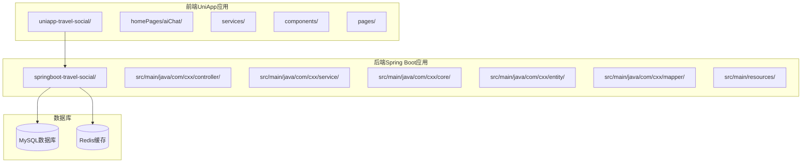
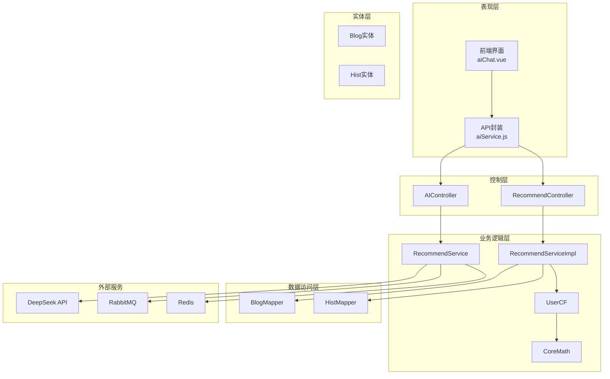
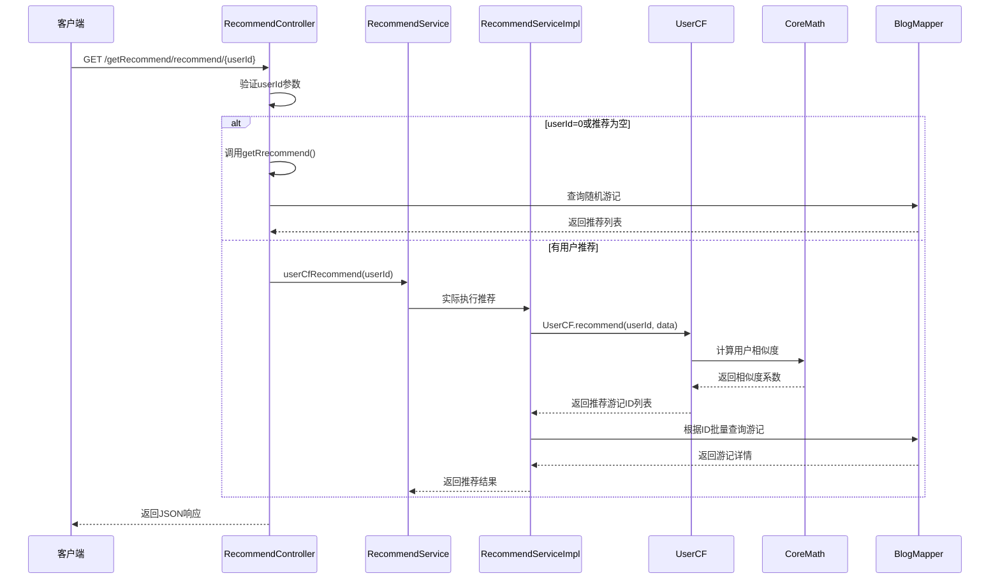
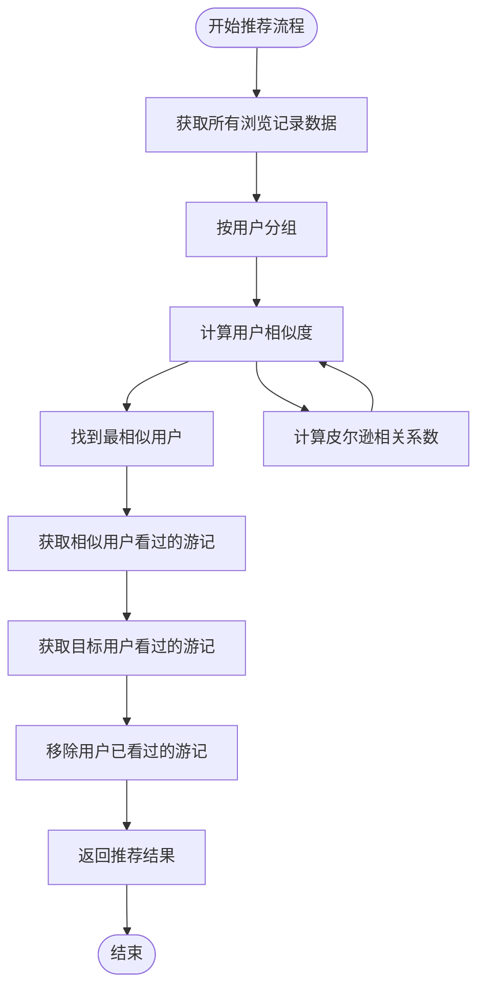
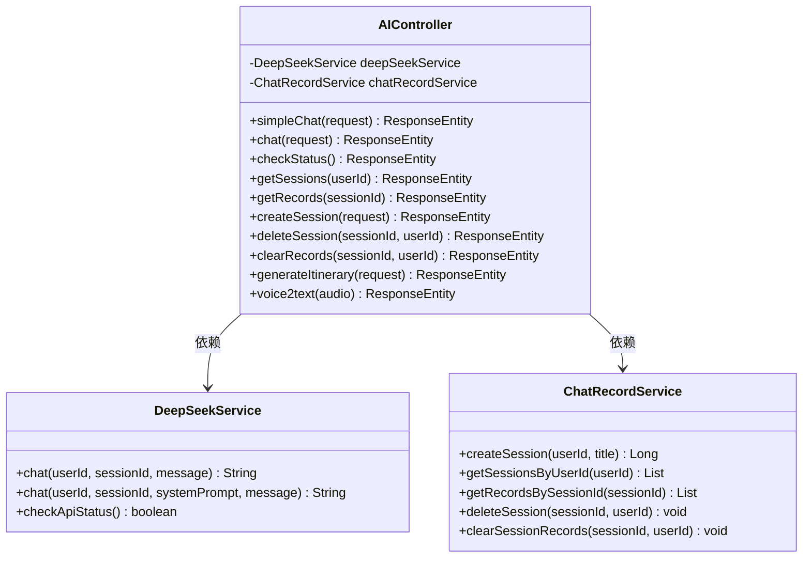
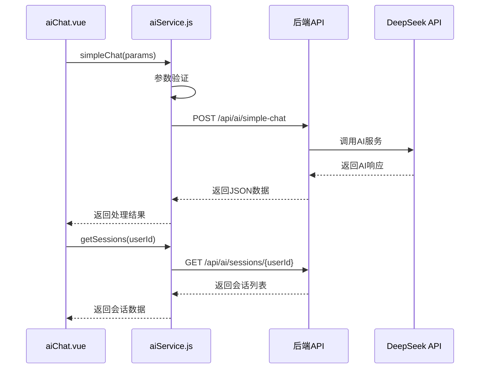
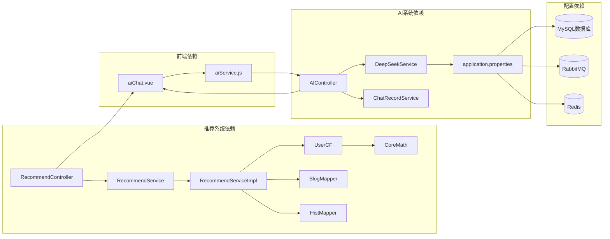

# 方案①-个性化AI推荐

<cite>
**本文档引用的文件**
- [RecommendController.java](file://springboot-travel-social/src/main/java/com/cxx/controller/RecommendController.java)
- [RecommendService.java](file://springboot-travel-social/src/main/java/com/cxx/service/RecommendService.java)
- [RecommendServiceImpl.java](file://springboot-travel-social/src/main/java/com/cxx/service/impl/RecommendServiceImpl.java)
- [UserCF.java](file://springboot-travel-social/src/main/java/com/cxx/core/UserCF.java)
- [CoreMath.java](file://springboot-travel-social/src/main/java/com/cxx/core/CoreMath.java)
- [Hist.java](file://springboot-travel-social/src/main/java/com/cxx/entity/Hist.java)
- [Blog.java](file://springboot-travel-social/src/main/java/com/cxx/entity/Blog.java)
- [BlogMapper.java](file://springboot-travel-social/src/main/java/com/cxx/mapper/BlogMapper.java)
- [HistMapper.java](file://springboot-travel-social/src/main/java/com/cxx/mapper/HistMapper.java)
- [AIController.java](file://springboot-travel-social/src/main/java/com/cxx/controller/AIController.java)
- [aiService.js](file://uniapp-travel-social/services/aiService.js)
- [aiChat.vue](file://uniapp-travel-social/homePages/aiChat/aiChat.vue)
- [application.properties](file://springboot-travel-social/src/main/resources/application.properties)
- [manifest.json](file://uniapp-travel-social/manifest.json)
</cite>

## 目录
1. [简介](#简介)
2. [项目结构](#项目结构)
3. [核心组件](#核心组件)
4. [架构概览](#架构概览)
5. [详细组件分析](#详细组件分析)
6. [依赖关系分析](#依赖关系分析)
7. [性能考虑](#性能考虑)
8. [故障排除指南](#故障排除指南)
9. [结论](#结论)

## 简介

方案①-个性化AI推荐是一个基于Spring Boot和UniApp开发的旅游攻略社交小程序中的核心功能模块。该系统集成了两种主要的个性化推荐机制：

1. **协同过滤推荐系统**：基于用户行为数据的相似用户推荐
2. **AI智能助手**：集成DeepSeek大模型的智能聊天和行程规划功能

系统采用前后端分离架构，后端使用Java Spring Boot框架，前端使用Vue.js和UniApp技术栈。推荐算法基于用户浏览历史和点赞数据，通过皮尔逊相关系数计算用户相似度，实现精准的个性化内容推荐。

## 项目结构

该项目采用标准的Maven项目结构，分为后端Spring Boot应用和前端UniApp应用两大部分：

**图表来源**
- [RecommendController.java:27-65](file://springboot-travel-social/src/main/java/com/cxx/controller/RecommendController.java#L27-L65)
- [AIController.java:21-505](file://springboot-travel-social/src/main/java/com/cxx/controller/AIController.java#L21-L505)

**章节来源**
- [RecommendController.java:1-65](file://springboot-travel-social/src/main/java/com/cxx/controller/RecommendController.java#L1-L65)
- [AIController.java:1-505](file://springboot-travel-social/src/main/java/com/cxx/controller/AIController.java#L1-L505)

## 核心组件

### 推荐系统核心组件

系统的核心推荐功能由以下关键组件构成：

1. **RecommendController**：RESTful API控制器，提供推荐接口
2. **RecommendService**：推荐服务接口定义
3. **RecommendServiceImpl**：推荐服务实现，包含协同过滤算法
4. **UserCF**：用户协同过滤算法实现
5. **CoreMath**：核心数学计算工具，包含皮尔逊相关系数计算

### AI智能助手组件

AI功能由以下组件组成：

1. **AIController**：AI聊天控制器，处理各种AI相关请求
2. **aiService.js**：前端AI服务封装，提供统一的API调用接口
3. **aiChat.vue**：AI聊天界面组件，包含完整的聊天UI和交互逻辑

**章节来源**
- [RecommendService.java:1-17](file://springboot-travel-social/src/main/java/com/cxx/service/RecommendService.java#L1-L17)
- [RecommendServiceImpl.java:1-64](file://springboot-travel-social/src/main/java/com/cxx/service/impl/RecommendServiceImpl.java#L1-L64)
- [UserCF.java:1-41](file://springboot-travel-social/src/main/java/com/cxx/core/UserCF.java#L1-L41)
- [CoreMath.java:1-89](file://springboot-travel-social/src/main/java/com/cxx/core/CoreMath.java#L1-L89)

## 架构概览

系统采用分层架构设计，实现了清晰的职责分离：

**图表来源**
- [RecommendController.java:27-65](file://springboot-travel-social/src/main/java/com/cxx/controller/RecommendController.java#L27-L65)
- [AIController.java:21-505](file://springboot-travel-social/src/main/java/com/cxx/controller/AIController.java#L21-L505)
- [RecommendServiceImpl.java:27-64](file://springboot-travel-social/src/main/java/com/cxx/service/impl/RecommendServiceImpl.java#L27-L64)

## 详细组件分析

### 推荐控制器分析

RecommendController是推荐系统的主要入口点，提供了灵活的推荐接口：

**图表来源**
- [RecommendController.java:39-63](file://springboot-travel-social/src/main/java/com/cxx/controller/RecommendController.java#L39-L63)
- [RecommendServiceImpl.java:39-62](file://springboot-travel-social/src/main/java/com/cxx/service/impl/RecommendServiceImpl.java#L39-L62)

### 协同过滤算法实现

UserCF类实现了基于用户的协同过滤算法：

**图表来源**
- [UserCF.java:16-39](file://springboot-travel-social/src/main/java/com/cxx/core/UserCF.java#L16-L39)
- [CoreMath.java:22-87](file://springboot-travel-social/src/main/java/com/cxx/core/CoreMath.java#L22-L87)

### AI聊天控制器分析

AIController提供了完整的AI聊天功能：

**图表来源**
- [AIController.java:21-505](file://springboot-travel-social/src/main/java/com/cxx/controller/AIController.java#L21-L505)

### 前端AI服务封装

aiService.js提供了统一的AI服务调用接口：

**图表来源**
- [aiService.js:52-85](file://uniapp-travel-social/services/aiService.js#L52-L85)
- [aiChat.vue:546-596](file://uniapp-travel-social/homePages/aiChat/aiChat.vue#L546-L596)

**章节来源**
- [RecommendController.java:1-65](file://springboot-travel-social/src/main/java/com/cxx/controller/RecommendController.java#L1-L65)
- [UserCF.java:1-41](file://springboot-travel-social/src/main/java/com/cxx/core/UserCF.java#L1-L41)
- [CoreMath.java:1-89](file://springboot-travel-social/src/main/java/com/cxx/core/CoreMath.java#L1-L89)
- [AIController.java:1-505](file://springboot-travel-social/src/main/java/com/cxx/controller/AIController.java#L1-L505)
- [aiService.js:1-293](file://uniapp-travel-social/services/aiService.js#L1-L293)

## 依赖关系分析

系统的关键依赖关系如下：

**图表来源**
- [RecommendController.java:30-37](file://springboot-travel-social/src/main/java/com/cxx/controller/RecommendController.java#L30-L37)
- [AIController.java:25-26](file://springboot-travel-social/src/main/java/com/cxx/controller/AIController.java#L25-L26)
- [application.properties:1-64](file://springboot-travel-social/src/main/resources/application.properties#L1-L64)

**章节来源**
- [application.properties:1-64](file://springboot-travel-social/src/main/resources/application.properties#L1-L64)
- [manifest.json:101-125](file://uniapp-travel-social/manifest.json#L101-L125)

## 性能考虑

### 推荐算法优化

1. **数据预处理优化**：UserCF类通过Stream API进行数据分组，提高了代码可读性和维护性
2. **相似度计算优化**：CoreMath类实现了高效的皮尔逊相关系数计算，避免了重复计算
3. **缓存策略**：系统集成了Redis缓存，可以缓存热门推荐结果

### AI服务性能

1. **异步处理**：AI聊天请求采用异步处理方式，避免阻塞主线程
2. **会话管理**：通过会话ID管理用户对话状态，支持断点续聊
3. **资源限制**：对消息长度和请求频率进行了限制，防止滥用

### 数据库优化

1. **索引优化**：在用户ID和游记ID上建立了适当的索引
2. **查询优化**：使用MyBatis Plus的条件构造器进行高效查询
3. **连接池配置**：合理配置了数据库连接池参数

## 故障排除指南

### 推荐系统常见问题

1. **推荐结果为空**
   - 检查用户是否有足够的浏览历史数据
   - 验证数据库连接是否正常
   - 确认推荐算法参数设置正确

2. **推荐性能问题**
   - 检查数据库查询性能
   - 考虑添加适当的索引
   - 优化推荐算法的计算复杂度

### AI系统常见问题

1. **API调用失败**
   - 检查DeepSeek API密钥配置
   - 验证网络连接状态
   - 确认API端点URL正确性

2. **会话管理异常**
   - 检查Redis连接状态
   - 验证会话ID格式正确性
   - 确认会话超时配置合理

**章节来源**
- [RecommendController.java:40-48](file://springboot-travel-social/src/main/java/com/cxx/controller/RecommendController.java#L40-L48)
- [AIController.java:112-130](file://springboot-travel-social/src/main/java/com/cxx/controller/AIController.java#L112-L130)

## 结论

方案①-个性化AI推荐系统成功实现了两个核心功能：

1. **智能推荐系统**：基于用户行为数据的协同过滤算法，能够为用户提供个性化的游记推荐
2. **AI智能助手**：集成DeepSeek大模型的聊天功能，支持智能对话和行程规划

系统具有以下优势：

- **模块化设计**：清晰的分层架构便于维护和扩展
- **高性能实现**：优化的数据结构和算法确保了良好的用户体验
- **完整的功能**：从推荐到AI聊天的完整解决方案
- **良好的可扩展性**：支持多种AI模型和服务的集成

未来可以考虑的改进方向：

- 增加更多的推荐算法（如内容推荐、混合推荐）
- 优化AI模型的集成方式，支持更多类型的AI服务
- 增强数据分析功能，提供更深入的用户行为洞察
- 改进缓存策略，提高系统的整体性能