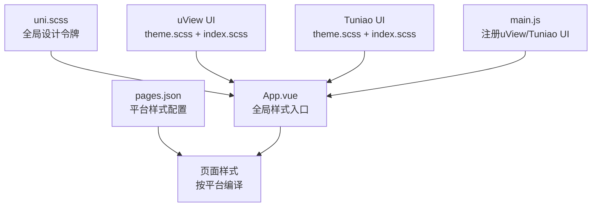
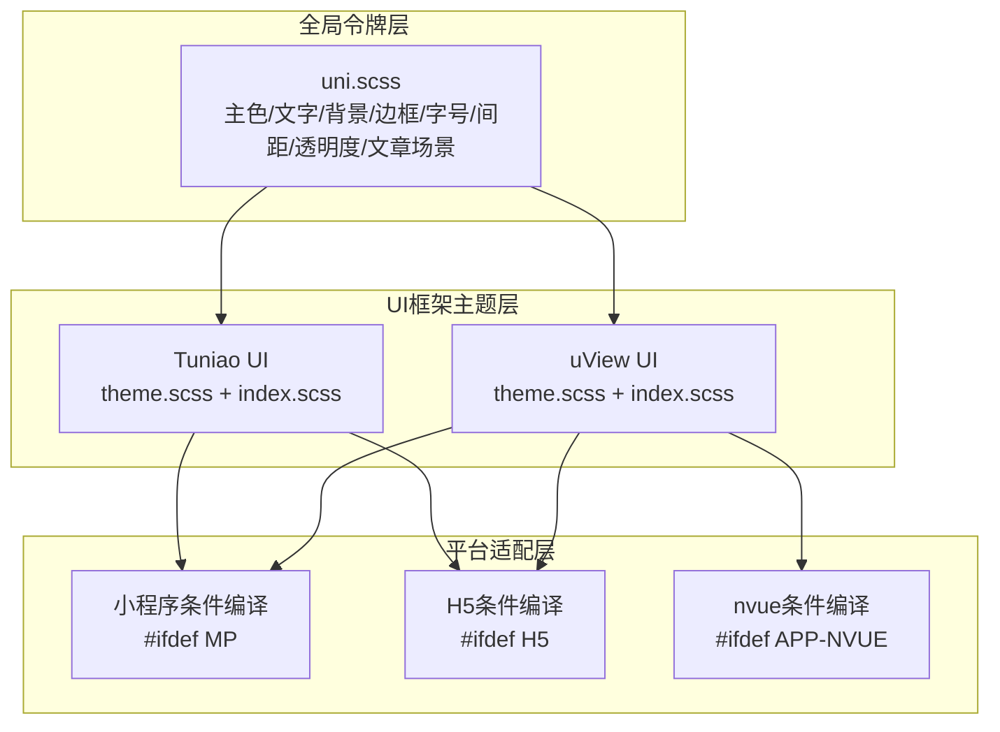
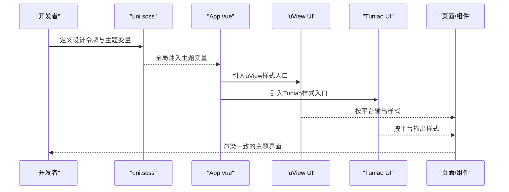
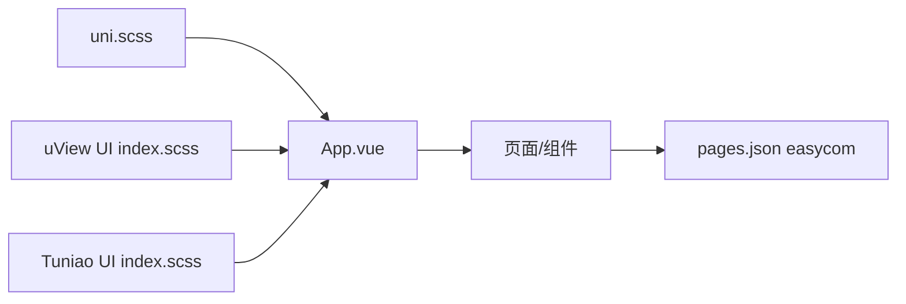

# 样式与主题

<cite>
**本文引用的文件**
- [uni.scss](file://uniapp-travel-social/uni.scss)
- [theme.scss（Tuniao UI）](file://uniapp-travel-social/tuniao-ui/theme.scss)
- [theme.scss（uView UI）](file://uniapp-travel-social/uni_modules/uview-ui/theme.scss)
- [main.js](file://uniapp-travel-social/main.js)
- [App.vue](file://uniapp-travel-social/App.vue)
- [index.scss（Tuniao UI）](file://uniapp-travel-social/tuniao-ui/index.scss)
- [index.scss（uView UI）](file://uniapp-travel-social/uni_modules/uview-ui/index.scss)
- [manifest.json](file://uniapp-travel-social/manifest.json)
- [pages.json](file://uniapp-travel-social/pages.json)
- [main.scss（Tuniao UI 基础样式）](file://uniapp-travel-social/tuniao-ui/libs/css/main.scss)
- [color.scss（Tuniao UI 颜色体系）](file://uniapp-travel-social/tuniao-ui/libs/css/color.scss)
- [demo_page_common.scss](file://uniapp-travel-social/static/css/components/demo_page_common.scss)
- [custom_nav_bar.scss](file://uniapp-travel-social/static/css/templatePage/custom_nav_bar.scss)
- [mixin.js（uView UI）](file://uniapp-travel-social/uni_modules/uview-ui/libs/mixin/mixin.js)
</cite>

## 目录
1. [简介](#简介)
2. [项目结构](#项目结构)
3. [核心组件](#核心组件)
4. [架构总览](#架构总览)
5. [详细组件分析](#详细组件分析)
6. [依赖关系分析](#依赖关系分析)
7. [性能考量](#性能考量)
8. [故障排查指南](#故障排查指南)
9. [结论](#结论)
10. [附录](#附录)

## 简介
本文件系统性梳理本项目的样式与主题系统，涵盖以下要点：
- 样式架构与CSS预处理器（SCSS）的使用
- uni.scss全局样式的定义与作用
- uView UI与Tuniao UI的主题定制方法（颜色、字号、间距等设计令牌）
- 自定义组件的样式开发规范（样式隔离、BEM命名、响应式）
- 不同平台（微信小程序、H5、APP）的样式适配差异与解决方案
- 样式性能优化技巧（压缩、按需加载、动画优化）
- 移动端适配最佳实践与调试方法

## 项目结构
本项目采用“全局样式 + 组件库主题 + 平台条件编译”的组织方式：
- 全局样式入口：uni.scss集中定义设计令牌与主题变量
- UI框架主题：uView UI与Tuniao UI各自提供主题变量与按平台拆分的样式入口
- 应用入口：App.vue引入UI框架样式，main.js注册UI框架插件
- 页面与组件：通过pages.json与各页面/组件样式实现平台差异化

图表来源
- [uni.scss:1-68](file://uniapp-travel-social/uni.scss#L1-L68)
- [App.vue:88-93](file://uniapp-travel-social/App.vue#L88-L93)
- [index.scss（uView UI）:1-23](file://uniapp-travel-social/uni_modules/uview-ui/index.scss#L1-L23)
- [index.scss（Tuniao UI）:1-13](file://uniapp-travel-social/tuniao-ui/index.scss#L1-L13)
- [main.js:10-14](file://uniapp-travel-social/main.js#L10-L14)
- [pages.json:1-814](file://uniapp-travel-social/pages.json#L1-L814)

章节来源
- [uni.scss:1-68](file://uniapp-travel-social/uni.scss#L1-L68)
- [App.vue:88-93](file://uniapp-travel-social/App.vue#L88-L93)
- [index.scss（uView UI）:1-23](file://uniapp-travel-social/uni_modules/uview-ui/index.scss#L1-L23)
- [index.scss（Tuniao UI）:1-13](file://uniapp-travel-social/tuniao-ui/index.scss#L1-L13)
- [main.js:10-14](file://uniapp-travel-social/main.js#L10-L14)
- [pages.json:1-814](file://uniapp-travel-social/pages.json#L1-L814)

## 核心组件
- 全局设计令牌与主题变量
  - uni.scss：统一定义主色、文字色、背景色、边框色、字号、图片尺寸、圆角半径、间距、透明度及文章场景相关变量
  - Tuniao UI theme.scss：提供丰富的主色、辅助色、阴影、进度条、遮罩等主题变量
  - uView UI theme.scss：提供主色、信息色、成功/警告/错误/信息等语义色及常用混入
- UI框架样式入口
  - uView UI index.scss：按平台引入通用、nvue、小程序、H5样式
  - Tuniao UI index.scss：按平台引入基础、颜色、小程序/H5样式
- 应用入口
  - App.vue：全局引入uView与Tuniao UI样式
  - main.js：注册uView与Tuniao UI插件，供全局使用

章节来源
- [uni.scss:9-68](file://uniapp-travel-social/uni.scss#L9-L68)
- [theme.scss（Tuniao UI）:1-184](file://uniapp-travel-social/tuniao-ui/theme.scss#L1-L184)
- [theme.scss（uView UI）:1-45](file://uniapp-travel-social/uni_modules/uview-ui/theme.scss#L1-L45)
- [index.scss（uView UI）:1-23](file://uniapp-travel-social/uni_modules/uview-ui/index.scss#L1-L23)
- [index.scss（Tuniao UI）:1-13](file://uniapp-travel-social/tuniao-ui/index.scss#L1-L13)
- [App.vue:88-93](file://uniapp-travel-social/App.vue#L88-L93)
- [main.js:10-14](file://uniapp-travel-social/main.js#L10-L14)

## 架构总览
样式系统由“全局令牌层 + UI框架主题层 + 平台适配层”构成，通过uni.scss统一注入，再由App.vue与各组件按需引入。

图表来源
- [uni.scss:1-68](file://uniapp-travel-social/uni.scss#L1-L68)
- [theme.scss（uView UI）:1-45](file://uniapp-travel-social/uni_modules/uview-ui/theme.scss#L1-L45)
- [index.scss（uView UI）:1-23](file://uniapp-travel-social/uni_modules/uview-ui/index.scss#L1-L23)
- [theme.scss（Tuniao UI）:1-184](file://uniapp-travel-social/tuniao-ui/theme.scss#L1-L184)
- [index.scss（Tuniao UI）:1-13](file://uniapp-travel-social/tuniao-ui/index.scss#L1-L13)

## 详细组件分析

### 全局样式与设计令牌（uni.scss）
- 主色与语义色：定义主色、成功、警告、错误等，便于全局一致的主题风格
- 文字与背景：基础文字色、反色、占位符、禁用态；背景色、浅灰背景、悬停色、遮罩色
- 边框与圆角：边框色、圆角半径（小/中/大/圆形）
- 尺寸与间距：文字尺寸、图片尺寸、水平/垂直间距、透明度
- 文章场景：标题、副标题、正文的颜色与字号

章节来源
- [uni.scss:9-68](file://uniapp-travel-social/uni.scss#L9-L68)

### uView UI 主题定制
- 主题变量：主色、信息色、成功/警告/错误/信息等语义色及其深浅/禁用态
- 平台适配：通过条件编译分别引入通用、nvue、小程序、H5样式
- 混入：提供flex布局混入，兼容不同平台渲染差异

章节来源
- [theme.scss（uView UI）:1-45](file://uniapp-travel-social/uni_modules/uview-ui/theme.scss#L1-L45)
- [index.scss（uView UI）:1-23](file://uniapp-travel-social/uni_modules/uview-ui/index.scss#L1-L23)

### Tuniao UI 主题定制
- 主题变量：主色、辅助色（红/紫红/紫/蓝紫/青蓝/蓝/靛/青/绿/黄绿/柠檬/黄/橙黄/橙/橙红/棕/冷/灰/灰等）、阴影、遮罩、进度条等
- 平台适配：通过条件编译引入小程序/H5特定样式
- 颜色体系：提供大量颜色类名与渐变、阴影、酷炫背景等实用样式

章节来源
- [theme.scss（Tuniao UI）:1-184](file://uniapp-travel-social/tuniao-ui/theme.scss#L1-L184)
- [index.scss（Tuniao UI）:1-13](file://uniapp-travel-social/tuniao-ui/index.scss#L1-L13)

### App.vue 全局样式入口
- 引入uView与Tuniao UI样式，确保全局可用
- 通过lang="scss"与@import实现样式注入

章节来源
- [App.vue:88-93](file://uniapp-travel-social/App.vue#L88-L93)

### 页面与平台适配（pages.json）
- easycom：自动按组件前缀映射到对应UI组件，简化使用
- 页面级样式：针对不同平台设置导航栏、下拉刷新、回弹等差异化配置

章节来源
- [pages.json:2-5](file://uniapp-travel-social/pages.json#L2-L5)

### 自定义组件样式开发规范
- 样式隔离：优先使用组件内部样式，避免污染全局；必要时通过作用域或命名空间限定
- BEM命名：参考uView UI的bem规则生成机制，保证类名可读与可维护
- 响应式设计：结合uni.scss中的间距与字号变量，配合媒体查询或rpx单位实现响应式布局
- 组件样式示例：demo_page_common.scss与custom_nav_bar.scss展示了基于主题变量的样式组织方式

章节来源
- [demo_page_common.scss:1-193](file://uniapp-travel-social/static/css/components/demo_page_common.scss#L1-L193)
- [custom_nav_bar.scss:1-38](file://uniapp-travel-social/static/css/templatePage/custom_nav_bar.scss#L1-L38)
- [mixin.js（uView UI）:61-84](file://uniapp-travel-social/uni_modules/uview-ui/libs/mixin/mixin.js#L61-L84)

### 样式开发流程（序列图）

图表来源
- [uni.scss:1-68](file://uniapp-travel-social/uni.scss#L1-L68)
- [App.vue:88-93](file://uniapp-travel-social/App.vue#L88-L93)
- [index.scss（uView UI）:1-23](file://uniapp-travel-social/uni_modules/uview-ui/index.scss#L1-L23)
- [index.scss（Tuniao UI）:1-13](file://uniapp-travel-social/tuniao-ui/index.scss#L1-L13)

## 依赖关系分析
- 全局依赖：uni.scss为所有主题变量的唯一来源
- 框架依赖：App.vue统一引入uView与Tuniao UI样式入口
- 平台依赖：index.scss通过条件编译实现平台差异化
- 组件依赖：pages.json的easycom映射简化组件引用

图表来源
- [uni.scss:1-68](file://uniapp-travel-social/uni.scss#L1-L68)
- [App.vue:88-93](file://uniapp-travel-social/App.vue#L88-L93)
- [index.scss（uView UI）:1-23](file://uniapp-travel-social/uni_modules/uview-ui/index.scss#L1-L23)
- [index.scss（Tuniao UI）:1-13](file://uniapp-travel-social/tuniao-ui/index.scss#L1-L13)
- [pages.json:2-5](file://uniapp-travel-social/pages.json#L2-L5)

章节来源
- [uni.scss:1-68](file://uniapp-travel-social/uni.scss#L1-L68)
- [App.vue:88-93](file://uniapp-travel-social/App.vue#L88-L93)
- [index.scss（uView UI）:1-23](file://uniapp-travel-social/uni_modules/uview-ui/index.scss#L1-L23)
- [index.scss（Tuniao UI）:1-13](file://uniapp-travel-social/tuniao-ui/index.scss#L1-L13)
- [pages.json:2-5](file://uniapp-travel-social/pages.json#L2-L5)

## 性能考量
- CSS压缩与按需加载
  - 使用manifest.json中的Sass实现与压缩配置，减少构建体积
  - 仅在App.vue引入全局样式，避免在每个页面重复注入
- 动画与阴影优化
  - 合理使用Tuniao UI提供的阴影与渐变类，避免过度复杂动画导致掉帧
- 条件编译
  - 通过uView与Tuniao UI的index.scss条件编译，仅在目标平台输出所需样式，降低包体

章节来源
- [manifest.json:7-8](file://uniapp-travel-social/manifest.json#L7-L8)
- [index.scss（uView UI）:1-23](file://uniapp-travel-social/uni_modules/uview-ui/index.scss#L1-L23)
- [index.scss（Tuniao UI）:1-13](file://uniapp-travel-social/tuniao-ui/index.scss#L1-L13)
- [App.vue:88-93](file://uniapp-travel-social/App.vue#L88-L93)

## 故障排查指南
- 主题变量未生效
  - 检查uni.scss是否正确导入至App.vue的style块
  - 确认main.js已注册uView与Tuniao UI插件
- 平台样式异常
  - 检查pages.json中页面style配置是否覆盖默认行为
  - 确认index.scss条件编译是否匹配当前平台
- 组件样式冲突
  - 使用组件内部样式或作用域，避免全局污染
  - 遵循BEM命名，避免类名冲突

章节来源
- [App.vue:88-93](file://uniapp-travel-social/App.vue#L88-L93)
- [main.js:10-14](file://uniapp-travel-social/main.js#L10-L14)
- [pages.json:1-814](file://uniapp-travel-social/pages.json#L1-L814)
- [mixin.js（uView UI）:61-84](file://uniapp-travel-social/uni_modules/uview-ui/libs/mixin/mixin.js#L61-L84)

## 结论
本项目通过uni.scss统一管理设计令牌，结合uView与Tuniao UI的主题变量与平台适配能力，形成清晰、可扩展且跨平台一致的样式体系。遵循样式隔离、BEM命名与条件编译策略，可在多端保持良好的性能与一致性。

## 附录
- 设计令牌清单（摘自uni.scss）
  - 主色与语义色：主色、成功、警告、错误
  - 文字与背景：基础文字色、反色、占位符、禁用态；背景色、浅灰背景、悬停色、遮罩色
  - 边框与圆角：边框色、圆角半径（小/中/大/圆形）
  - 尺寸与间距：文字尺寸、图片尺寸、水平/垂直间距、透明度
  - 文章场景：标题、副标题、正文的颜色与字号

章节来源
- [uni.scss:9-68](file://uniapp-travel-social/uni.scss#L9-L68)