# 行程规划系统

<cite>
**本文档引用的文件**
- [ItineraryController.java](file://springboot-travel-social/src/main/java/com/cxx/controller/ItineraryController.java)
- [TripContextController.java](file://springboot-travel-social/src/main/java/com/cxx/controller/TripContextController.java)
- [ItineraryCollabController.java](file://springboot-travel-social/src/main/java/com/cxx/controller/ItineraryCollabController.java)
- [AIController.java](file://springboot-travel-social/src/main/java/com/cxx/controller/AIController.java)
- [Itinerary.java](file://springboot-travel-social/src/main/java/com/cxx/entity/Itinerary.java)
- [ItineraryCollabRoom.java](file://springboot-travel-social/src/main/java/com/cxx/entity/ItineraryCollabRoom.java)
- [ItineraryCollabMember.java](file://springboot-travel-social/src/main/java/com/cxx/entity/ItineraryCollabMember.java)
- [ItineraryCollabMessage.java](file://springboot-travel-social/src/main/java/com/cxx/entity/ItineraryCollabMessage.java)
- [ItineraryCollabService.java](file://springboot-travel-social/src/main/java/com/cxx/service/ItineraryCollabService.java)
- [ItineraryCollabServiceImpl.java](file://springboot-travel-social/src/main/java/com/cxx/service/impl/ItineraryCollabServiceImpl.java)
- [TripContextService.java](file://springboot-travel-social/src/main/java/com/cxx/service/TripContextService.java)
- [TripContextServiceImpl.java](file://springboot-travel-social/src/main/java/com/cxx/service/impl/TripContextServiceImpl.java)
- [ItineraryCollabRoomMapper.java](file://springboot-travel-social/src/main/java/com/cxx/mapper/ItineraryCollabRoomMapper.java)
- [ItineraryCollabMemberMapper.java](file://springboot-travel-social/src/main/java/com/cxx/mapper/ItineraryCollabMemberMapper.java)
- [ItineraryCollabMessageMapper.java](file://springboot-travel-social/src/main/java/com/cxx/mapper/ItineraryCollabMessageMapper.java)
- [RoutePlanningController.java](file://springboot-travel-social/src/main/java/com/cxx/controller/RoutePlanningController.java)
- [RoutePlanningUtils.java](file://springboot-travel-social/src/main/java/com/cxx/utils/RoutePlanningUtils.java)
- [WebSocketServer.java](file://springboot-travel-social/src/main/java/com/cxx/component/WebSocketServer.java)
- [itinerary.vue](file://uniapp-travel-social/homePages/itinerary/itinerary.vue)
- [itinerary-history.vue](file://uniapp-travel-social/homePages/itinerary/itinerary-history.vue)
- [itinerary-collab.vue](file://uniapp-travel-social/homePages/itinerary/itinerary-collab.vue)
- [aiService.js](file://uniapp-travel-social/services/aiService.js)
- [itinerary_collab.sql](file://springboot-travel-social/src/main/resources/sql/itinerary_collab.sql)
- [application.properties](file://springboot-travel-social/src/main/resources/application.properties)
- [travel_socical.sql](file://travel_socical.sql)
</cite>

## 更新摘要
**变更内容**
- 新增完整的行程协作功能模块，包括协作房间管理、成员邀请、实时消息通信和AI综合生成
- 新增ItineraryCollabController控制器，提供RESTful API接口
- 新增ItineraryCollabService服务接口及其实现类
- 新增协作相关实体类：ItineraryCollabRoom、ItineraryCollabMember、ItineraryCollabMessage
- 新增协作相关映射器：ItineraryCollabRoomMapper、ItineraryCollabMemberMapper、ItineraryCollabMessageMapper
- 新增协作数据库建表脚本，支持完整的协作数据模型
- 新增前端协作房间Vue组件，提供完整的协作界面
- 新增WebSocket实时通信机制，支持协作房间的即时消息推送
- 扩展AI行程生成能力，支持多人偏好的综合分析

## 目录
1. [简介](#简介)
2. [项目结构](#项目结构)
3. [核心组件](#核心组件)
4. [架构概览](#架构概览)
5. [详细组件分析](#详细组件分析)
6. [依赖关系分析](#依赖关系分析)
7. [性能考虑](#性能考虑)
8. [故障排除指南](#故障排除指南)
9. [结论](#结论)

## 简介

行程规划系统是一个基于Spring Boot和UniApp开发的智能旅行规划平台，主要功能包括AI智能行程生成、行程管理、路线规划、旅行预算分析和多人协作行程规划。该系统通过集成大模型AI服务，为用户提供个性化的旅行规划解决方案，并支持多人实时协作制定旅行计划。

系统采用前后端分离架构，后端使用Java Spring Boot框架提供RESTful API服务，前端使用UniApp框架构建跨平台移动应用。核心特性包括：

- **AI智能行程生成**：基于用户输入的目的地、天数、主题等信息生成个性化行程
- **行程管理**：支持行程的创建、查看、编辑和删除
- **路线规划**：集成百度地图API提供驾车路线规划
- **旅行预算分析**：提供详细的费用预算和省钱建议
- **会话管理**：支持AI聊天会话的创建、管理和历史记录
- **行程历史管理**：提供完整的行程历史记录和管理功能
- **新增**：完整的行程详情展示页面和历史行程管理页面
- **新增**：AI智能行程生成功能，支持基于用户需求的智能行程规划
- **新增**：行程上下文聚合服务，提供天气、节假日和AI摘要的一站式获取
- **新增**：智能上下文感知的AI提示词生成，提升行程生成质量
- **新增**：多人实时协作行程规划功能，支持邀请码邀请、实时消息通信和AI综合生成
- **新增**：完整的协作房间管理系统，包含成员管理、权限控制和状态跟踪
- **新增**：WebSocket实时消息推送，实现协作房间的即时通信
- **新增**：完整的协作数据模型，支持房间、成员、消息的全生命周期管理

## 项目结构

整个项目采用标准的Maven多模块结构，分为后端Spring Boot应用和前端UniApp应用两大部分：

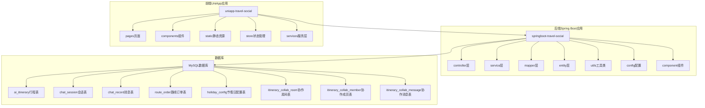

**图表来源**
- [ItineraryController.java:1-123](file://springboot-travel-social/src/main/java/com/cxx/controller/ItineraryController.java#L1-L123)
- [TripContextController.java:1-45](file://springboot-travel-social/src/main/java/com/cxx/controller/TripContextController.java#L1-L45)
- [ItineraryCollabController.java:1-139](file://springboot-travel-social/src/main/java/com/cxx/controller/ItineraryCollabController.java#L1-L139)
- [AIController.java:1-505](file://springboot-travel-social/src/main/java/com/cxx/controller/AIController.java#L1-L505)
- [WebSocketServer.java:1-137](file://springboot-travel-social/src/main/java/com/cxx/component/WebSocketServer.java#L1-L137)

**章节来源**
- [ItineraryController.java:1-123](file://springboot-travel-social/src/main/java/com/cxx/controller/ItineraryController.java#L1-L123)
- [TripContextController.java:1-45](file://springboot-travel-social/src/main/java/com/cxx/controller/TripContextController.java#L1-L45)
- [ItineraryCollabController.java:1-139](file://springboot-travel-social/src/main/java/com/cxx/controller/ItineraryCollabController.java#L1-L139)
- [AIController.java:1-505](file://springboot-travel-social/src/main/java/com/cxx/controller/AIController.java#L1-L505)
- [WebSocketServer.java:1-137](file://springboot-travel-social/src/main/java/com/cxx/component/WebSocketServer.java#L1-L137)

## 核心组件

### 行程管理核心组件

系统的核心组件围绕AI行程管理展开，主要包括以下关键组件：

#### 实体层组件
- **Itinerary实体**：表示AI生成的行程信息，包含目的地、天数、主题、预算等核心属性，**新增**协作相关字段支持多人行程管理
- **ItineraryCollabRoom实体**：管理协作房间信息，包括邀请码、创建者、目的地、天数、状态等核心属性
- **ItineraryCollabMember实体**：管理协作房间成员信息，包括用户快照、角色、加入时间等属性
- **ItineraryCollabMessage实体**：管理协作房间消息记录，支持用户消息、AI消息和系统消息
- **ChatSession实体**：管理AI聊天会话，支持会话的创建、管理和历史记录
- **ChatRecord实体**：存储聊天记录，支持用户与AI的对话历史
- **HolidayConfig实体**：管理节假日配置信息，支持节假日查询和出行建议

#### 控制器层组件
- **ItineraryController**：提供行程相关的REST API接口，支持完整的CRUD操作
- **ItineraryCollabController**：**新增**提供完整的行程协作服务接口，包括房间管理、成员管理、消息通信和AI生成
- **AIController**：集成AI服务，提供智能行程生成和聊天功能
- **RoutePlanningController**：提供路线规划服务
- **TripContextController**：**新增**提供行程上下文聚合服务，支持天气、节假日和AI摘要的一次性获取

#### 服务层组件
- **ChatRecordService**：定义会话和消息管理的服务接口
- **DeepSeekService**：封装AI服务调用，支持同步和异步聊天
- **TripContextService**：**新增**定义行程上下文聚合服务接口
- **WeatherService**：定义天气查询服务接口
- **HolidayService**：定义节假日查询服务接口
- **ItineraryCollabService**：**新增**定义行程协作服务接口，包含房间管理、成员管理、消息处理和AI生成
- **ItineraryCollabServiceImpl**：**新增**实现行程协作服务的核心业务逻辑

#### **新增** 前端组件
- **itinerary.vue**：AI行程详情展示页面，提供完整的行程浏览和交互功能
- **itinerary-history.vue**：历史行程管理页面，支持行程列表查看、删除和详情查看
- **itinerary-collab.vue**：协作房间页面，提供实时消息展示和行程生成功能

**章节来源**
- [Itinerary.java:1-74](file://springboot-travel-social/src/main/java/com/cxx/entity/Itinerary.java#L1-L74)
- [ItineraryCollabRoom.java:1-66](file://springboot-travel-social/src/main/java/com/cxx/entity/ItineraryCollabRoom.java#L1-L66)
- [ItineraryCollabMember.java:1-47](file://springboot-travel-social/src/main/java/com/cxx/entity/ItineraryCollabMember.java#L1-L47)
- [ItineraryCollabMessage.java:1-51](file://springboot-travel-social/src/main/java/com/cxx/entity/ItineraryCollabMessage.java#L1-L51)
- [ChatSession.java:1-44](file://springboot-travel-social/src/main/java/com/cxx/entity/ChatSession.java#L1-L44)
- [ChatRecord.java:1-48](file://springboot-travel-social/src/main/java/com/cxx/entity/ChatRecord.java#L1-L48)
- [HolidayConfig.java:1-58](file://springboot-travel-social/src/main/java/com/cxx/entity/HolidayConfig.java#L1-L58)
- [ItineraryController.java:1-123](file://springboot-travel-social/src/main/java/com/cxx/controller/ItineraryController.java#L1-L123)
- [ItineraryCollabController.java:1-139](file://springboot-travel-social/src/main/java/com/cxx/controller/ItineraryCollabController.java#L1-L139)
- [AIController.java:1-505](file://springboot-travel-social/src/main/java/com/cxx/controller/AIController.java#L1-L505)
- [TripContextController.java:1-45](file://springboot-travel-social/src/main/java/com/cxx/controller/TripContextController.java#L1-L45)
- [TripContextService.java:1-21](file://springboot-travel-social/src/main/java/com/cxx/service/TripContextService.java#L1-L21)
- [WeatherService.java:1-42](file://springboot-travel-social/src/main/java/com/cxx/service/WeatherService.java#L1-L42)
- [HolidayService.java:1-19](file://springboot-travel-social/src/main/java/com/cxx/service/HolidayService.java#L1-L19)
- [ItineraryCollabService.java:1-67](file://springboot-travel-social/src/main/java/com/cxx/service/ItineraryCollabService.java#L1-L67)
- [itinerary.vue:1-784](file://uniapp-travel-social/homePages/itinerary/itinerary.vue#L1-L784)
- [itinerary-history.vue:1-287](file://uniapp-travel-social/homePages/itinerary/itinerary-history.vue#L1-L287)
- [itinerary-collab.vue:1-443](file://uniapp-travel-social/homePages/itinerary/itinerary-collab.vue#L1-L443)

## 架构概览

系统采用分层架构设计，实现了清晰的关注点分离：

```mermaid
graph TB
subgraph "表现层"
A[UniApp前端应用]
A --> B[itinerary.vue页面]
A --> C[aiChat.vue页面]
A --> D[route-planning页面]
A --> E[itinerary-history.vue历史页面]
A --> F[itinerary-collab.vue协作页面]
end
subgraph "控制层"
G[ItineraryController]
H[AIController]
I[RoutePlanningController]
J[TripContextController]
K[ItineraryCollabController]
end
subgraph "服务层"
L[ChatRecordService]
M[DeepSeekService]
N[RoutePlanningUtils]
O[TripContextService]
P[WeatherService]
Q[HolidayService]
R[TripContextServiceImpl]
S[WeatherServiceImpl]
T[HolidayServiceImpl]
U[ItineraryCollabService]
V[ItineraryCollabServiceImpl]
end
subgraph "数据访问层"
W[ItineraryMapper]
X[ChatSessionMapper]
Y[ChatRecordMapper]
Z[HolidayConfigMapper]
AA[ItineraryCollabRoomMapper]
BB[ItineraryCollabMemberMapper]
CC[ItineraryCollabMessageMapper]
DD[WebSocketServer]
end
subgraph "数据存储"
EE[MySQL数据库]
EE --> FF[ai_itinerary表]
EE --> GG[chat_session表]
EE --> HH[chat_record表]
EE --> II[holiday_config表]
EE --> JJ[itinerary_collab_room表]
EE --> KK[itinerary_collab_member表]
EE --> LL[itinerary_collab_message表]
end
A --> G
A --> H
A --> I
A --> J
A --> K
G --> W
H --> L
H --> M
I --> N
J --> O
K --> U
U --> V
O --> R
R --> P
R --> Q
P --> S
Q --> T
L --> X
L --> Y
W --> FF
X --> GG
Y --> HH
Z --> II
AA --> JJ
BB --> KK
CC --> LL
DD --> MM[WebSocket连接]
```

**图表来源**
- [ItineraryController.java:1-123](file://springboot-travel-social/src/main/java/com/cxx/controller/ItineraryController.java#L1-L123)
- [AIController.java:1-505](file://springboot-travel-social/src/main/java/com/cxx/controller/AIController.java#L1-L505)
- [RoutePlanningController.java:1-31](file://springboot-travel-social/src/main/java/com/cxx/controller/RoutePlanningController.java#L1-L31)
- [TripContextController.java:1-45](file://springboot-travel-social/src/main/java/com/cxx/controller/TripContextController.java#L1-L45)
- [ItineraryCollabController.java:1-139](file://springboot-travel-social/src/main/java/com/cxx/controller/ItineraryCollabController.java#L1-L139)
- [WebSocketServer.java:1-137](file://springboot-travel-social/src/main/java/com/cxx/component/WebSocketServer.java#L1-L137)

### 数据流架构

系统的核心数据流包括AI行程生成流程、用户交互流程和**新增**的多人协作流程：

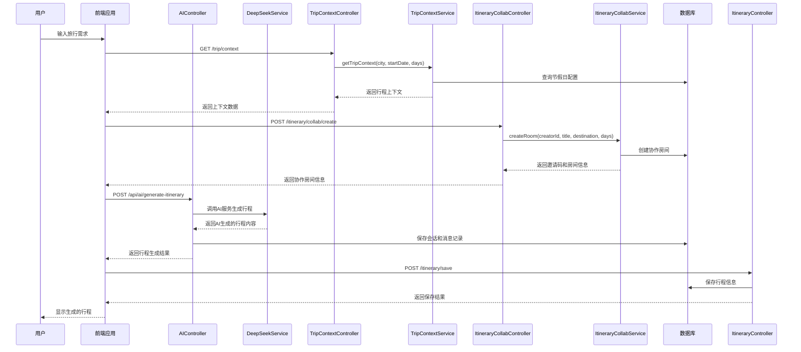

**图表来源**
- [AIController.java:412-465](file://springboot-travel-social/src/main/java/com/cxx/controller/AIController.java#L412-L465)
- [TripContextController.java:35-43](file://springboot-travel-social/src/main/java/com/cxx/controller/TripContextController.java#L35-L43)
- [TripContextServiceImpl.java:24-78](file://springboot-travel-social/src/main/java/com/cxx/service/impl/TripContextServiceImpl.java#L24-L78)
- [ItineraryController.java:32-67](file://springboot-travel-social/src/main/java/com/cxx/controller/ItineraryController.java#L32-L67)
- [ItineraryCollabController.java:32-47](file://springboot-travel-social/src/main/java/com/cxx/controller/ItineraryCollabController.java#L32-L47)
- [ItineraryCollabServiceImpl.java:42-81](file://springboot-travel-social/src/main/java/com/cxx/service/impl/ItineraryCollabServiceImpl.java#L42-81)

**章节来源**
- [AIController.java:412-465](file://springboot-travel-social/src/main/java/com/cxx/controller/AIController.java#L412-L465)
- [TripContextController.java:35-43](file://springboot-travel-social/src/main/java/com/cxx/controller/TripContextController.java#L35-L43)
- [TripContextServiceImpl.java:24-78](file://springboot-travel-social/src/main/java/com/cxx/service/impl/TripContextServiceImpl.java#L24-L78)
- [ItineraryController.java:32-67](file://springboot-travel-social/src/main/java/com/cxx/controller/ItineraryController.java#L32-L67)
- [ItineraryCollabController.java:32-47](file://springboot-travel-social/src/main/java/com/cxx/controller/ItineraryCollabController.java#L32-L47)
- [ItineraryCollabServiceImpl.java:42-81](file://springboot-travel-social/src/main/java/com/cxx/service/impl/ItineraryCollabServiceImpl.java#L42-81)

## 详细组件分析

### AI行程生成系统

AI行程生成系统是整个系统的核心功能，通过集成大模型AI服务为用户提供智能化的旅行规划。

#### AIController组件分析

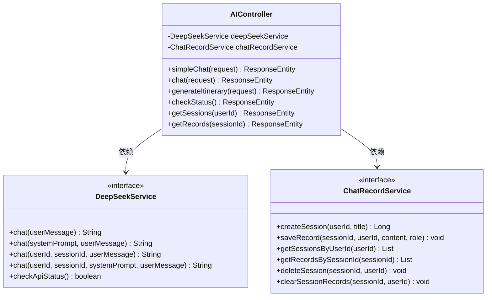

**图表来源**
- [AIController.java:23-26](file://springboot-travel-social/src/main/java/com/cxx/controller/AIController.java#L23-L26)
- [ChatRecordService.java:8-54](file://springboot-travel-social/src/main/java/com/cxx/service/ChatRecordService.java#L8-L54)

#### 行程生成流程

AI行程生成过程包含以下关键步骤：

1. **参数验证**：验证用户ID、目的地、天数等必要参数
2. **提示词构建**：根据用户输入构建专业的行程生成提示词
3. **会话管理**：创建或获取AI聊天会话
4. **AI调用**：调用DeepSeek服务生成行程内容
5. **结果处理**：返回生成的行程给前端应用

**章节来源**
- [AIController.java:412-465](file://springboot-travel-social/src/main/java/com/cxx/controller/AIController.java#L412-L465)

### 行程管理系统

行程管理系统负责管理用户创建的AI行程，提供完整的CRUD操作。

#### ItineraryController组件分析

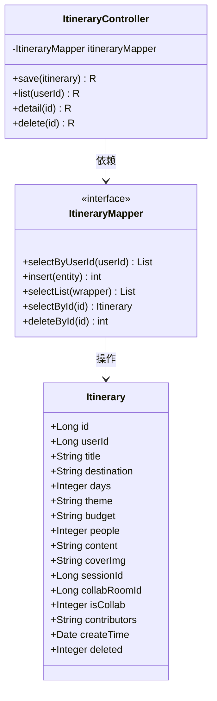

**图表来源**
- [ItineraryController.java:25-25](file://springboot-travel-social/src/main/java/com/cxx/controller/ItineraryController.java#L25-L25)
- [Itinerary.java:21-74](file://springboot-travel-social/src/main/java/com/cxx/entity/Itinerary.java#L21-L74)
- [ItineraryMapper.java:11-18](file://springboot-travel-social/src/main/java/com/cxx/mapper/ItineraryMapper.java#L11-L18)

#### 行程管理流程

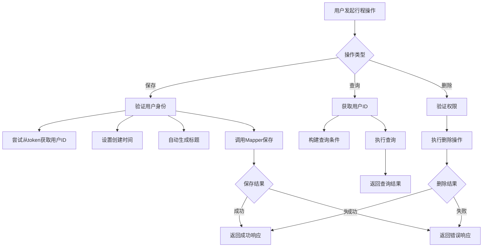

**图表来源**
- [ItineraryController.java:32-121](file://springboot-travel-social/src/main/java/com/cxx/controller/ItineraryController.java#L32-L121)

**章节来源**
- [ItineraryController.java:32-121](file://springboot-travel-social/src/main/java/com/cxx/controller/ItineraryController.java#L32-L121)
- [Itinerary.java:1-74](file://springboot-travel-social/src/main/java/com/cxx/entity/Itinerary.java#L1-L74)

### 行程协作系统

**新增** 行程协作系统为用户提供多人实时协作制定旅行计划的能力，支持邀请码邀请、实时消息通信和AI综合生成。

#### ItineraryCollabController组件分析

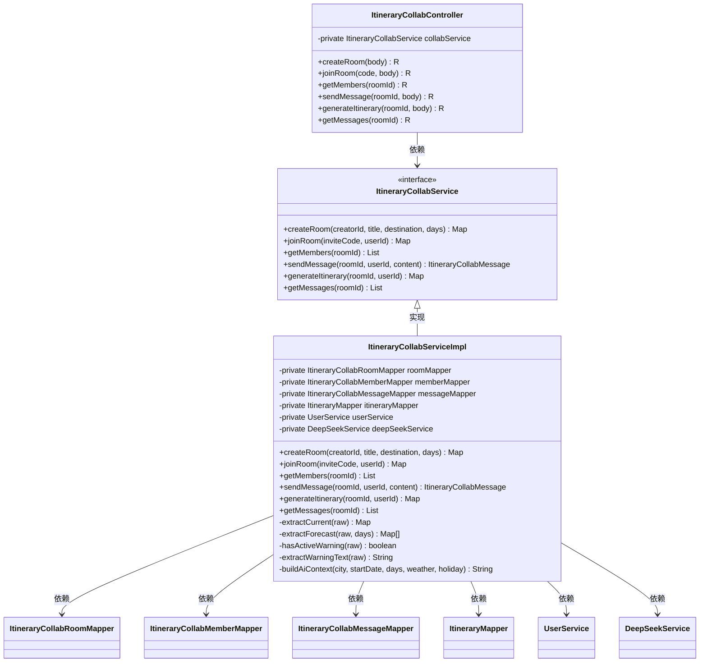

**图表来源**
- [ItineraryCollabController.java:26-139](file://springboot-travel-social/src/main/java/com/cxx/controller/ItineraryCollabController.java#L26-L139)
- [ItineraryCollabService.java:11-67](file://springboot-travel-social/src/main/java/com/cxx/service/ItineraryCollabService.java#L11-L67)
- [ItineraryCollabServiceImpl.java:29-368](file://springboot-travel-social/src/main/java/com/cxx/service/impl/ItineraryCollabServiceImpl.java#L29-L368)

#### 协作房间管理流程

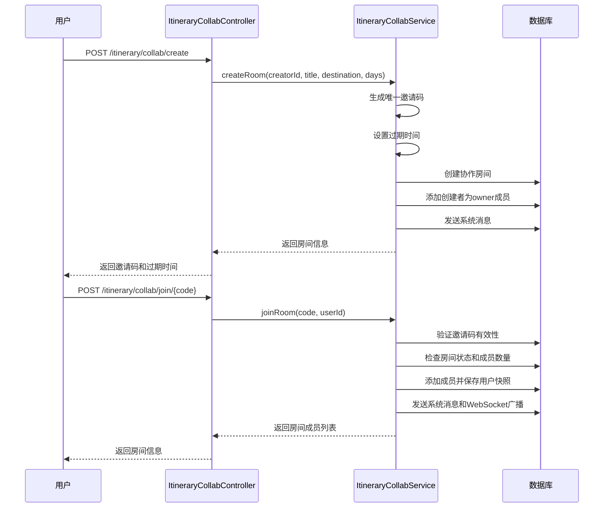

**图表来源**
- [ItineraryCollabController.java:32-66](file://springboot-travel-social/src/main/java/com/cxx/controller/ItineraryCollabController.java#L32-L66)
- [ItineraryCollabServiceImpl.java:42-122](file://springboot-travel-social/src/main/java/com/cxx/service/impl/ItineraryCollabServiceImpl.java#L42-122)

#### 协作消息通信流程

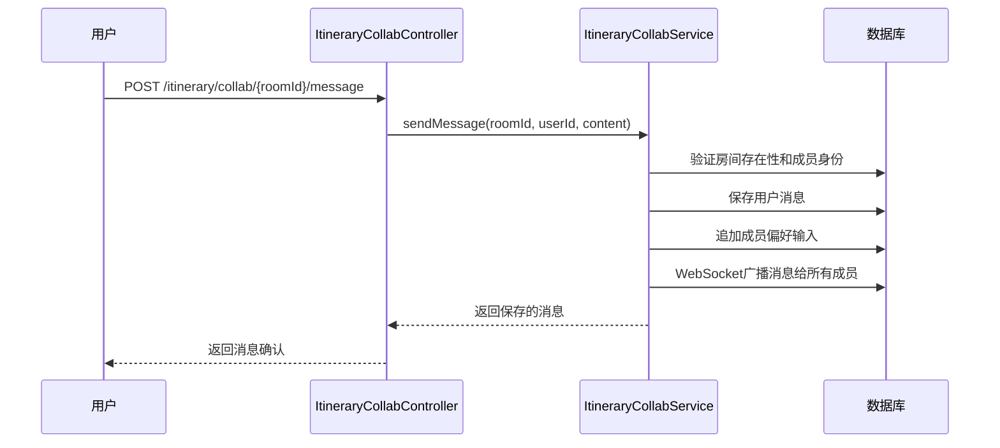

**图表来源**
- [ItineraryCollabController.java:88-102](file://springboot-travel-social/src/main/java/com/cxx/controller/ItineraryCollabController.java#L88-L102)
- [ItineraryCollabServiceImpl.java:141-171](file://springboot-travel-social/src/main/java/com/cxx/service/impl/ItineraryCollabServiceImpl.java#L141-171)

#### AI综合生成流程

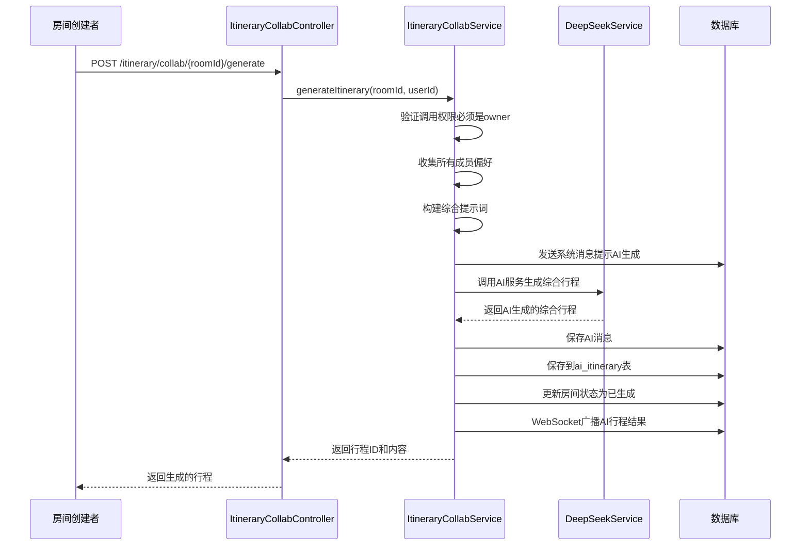

**图表来源**
- [ItineraryCollabController.java:108-121](file://springboot-travel-social/src/main/java/com/cxx/controller/ItineraryCollabController.java#L108-L121)
- [ItineraryCollabServiceImpl.java:175-239](file://springboot-travel-social/src/main/java/com/cxx/service/impl/ItineraryCollabServiceImpl.java#L175-239)

#### 协作数据模型

协作系统包含以下核心实体：

- **ItineraryCollabRoom**：协作房间实体，包含邀请码、创建者、目的地、天数、状态等信息
- **ItineraryCollabMember**：协作成员实体，包含用户快照、角色、加入时间等信息
- **ItineraryCollabMessage**：协作消息实体，支持用户消息、AI消息和系统消息

**章节来源**
- [ItineraryCollabController.java:1-139](file://springboot-travel-social/src/main/java/com/cxx/controller/ItineraryCollabController.java#L1-L139)
- [ItineraryCollabService.java:1-67](file://springboot-travel-social/src/main/java/com/cxx/service/ItineraryCollabService.java#L1-L67)
- [ItineraryCollabServiceImpl.java:1-368](file://springboot-travel-social/src/main/java/com/cxx/service/impl/ItineraryCollabServiceImpl.java#L1-L368)
- [ItineraryCollabRoom.java:1-66](file://springboot-travel-social/src/main/java/com/cxx/entity/ItineraryCollabRoom.java#L1-L66)
- [ItineraryCollabMember.java:1-47](file://springboot-travel-social/src/main/java/com/cxx/entity/ItineraryCollabMember.java#L1-L47)
- [ItineraryCollabMessage.java:1-51](file://springboot-travel-social/src/main/java/com/cxx/entity/ItineraryCollabMessage.java#L1-L51)

### 行程上下文聚合系统

**新增** 行程上下文聚合系统为AI行程生成提供智能化的上下文感知能力，通过一次调用获取天气、节假日和AI摘要信息。

#### TripContextController组件分析

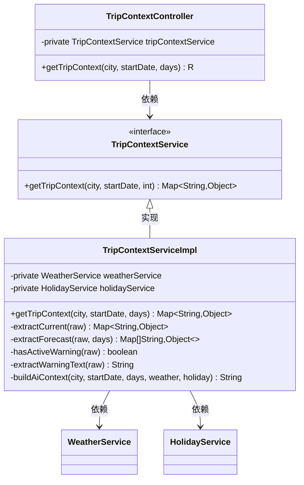

**图表来源**
- [TripContextController.java:26-43](file://springboot-travel-social/src/main/java/com/cxx/controller/TripContextController.java#L26-L43)
- [TripContextService.java:9-19](file://springboot-travel-social/src/main/java/com/cxx/service/TripContextService.java#L9-L19)
- [TripContextServiceImpl.java:19-78](file://springboot-travel-social/src/main/java/com/cxx/service/impl/TripContextServiceImpl.java#L19-L78)

#### 上下文聚合流程

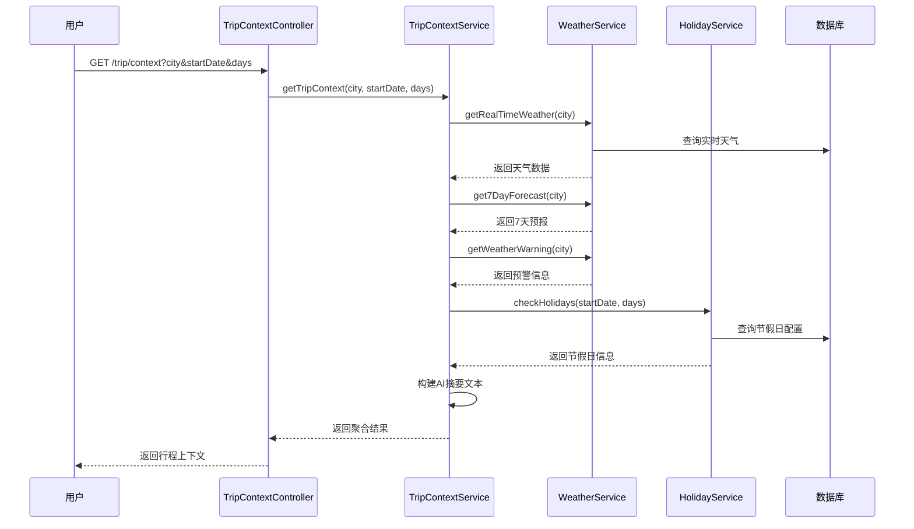

**图表来源**
- [TripContextController.java:35-43](file://springboot-travel-social/src/main/java/com/cxx/controller/TripContextController.java#L35-L43)
- [TripContextServiceImpl.java:24-78](file://springboot-travel-social/src/main/java/com/cxx/service/impl/TripContextServiceImpl.java#L24-L78)

#### 上下文数据结构

行程上下文聚合返回的数据结构包含以下关键字段：

- **基础信息**：city（城市）、startDate（开始日期）、days（天数）
- **天气信息**：current（实时天气）、forecast（7天预报）、hasWarning（是否有预警）、warningText（预警文本）
- **节假日信息**：isPeakSeason（是否高峰期）、totalHolidayDays（节假日总数）、peakLevel（高峰等级）、tips（出行建议）
- **AI摘要**：aiContext（自然语言摘要文本）

**章节来源**
- [TripContextController.java:1-45](file://springboot-travel-social/src/main/java/com/cxx/controller/TripContextController.java#L1-L45)
- [TripContextService.java:1-21](file://springboot-travel-social/src/main/java/com/cxx/service/TripContextService.java#L1-L21)
- [TripContextServiceImpl.java:1-197](file://springboot-travel-social/src/main/java/com/cxx/service/impl/TripContextServiceImpl.java#L1-L197)

### 路线规划系统

路线规划系统集成了百度地图API，为用户提供驾车路线规划服务。

#### RoutePlanningController组件分析

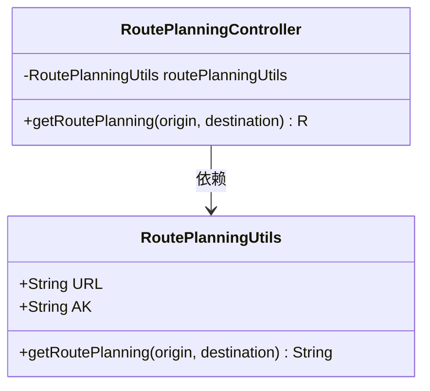

**图表来源**
- [RoutePlanningController.java:21-24](file://springboot-travel-social/src/main/java/com/cxx/controller/RoutePlanningController.java#L21-L24)
- [RoutePlanningUtils.java:23-34](file://springboot-travel-social/src/main/java/com/cxx/utils/RoutePlanningUtils.java#L23-L34)

#### 路线规划流程

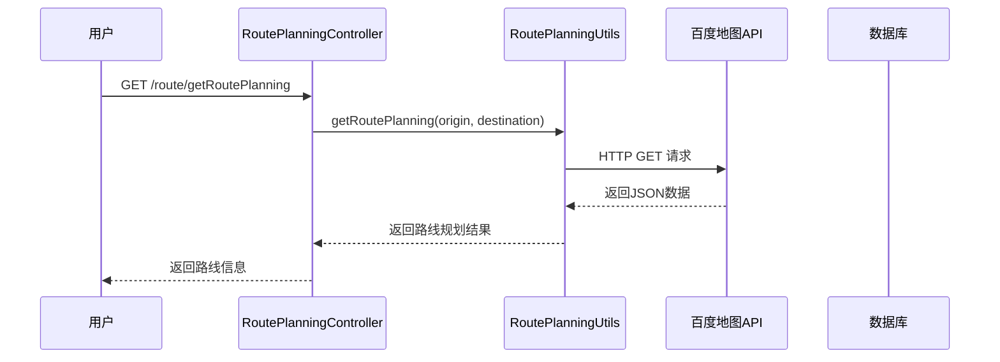

**图表来源**
- [RoutePlanningController.java:25-29](file://springboot-travel-social/src/main/java/com/cxx/controller/RoutePlanningController.java#L25-L29)
- [RoutePlanningUtils.java:25-34](file://springboot-travel-social/src/main/java/com/cxx/utils/RoutePlanningUtils.java#L25-L34)

**章节来源**
- [RoutePlanningController.java:1-31](file://springboot-travel-social/src/main/java/com/cxx/controller/RoutePlanningController.java#L1-L31)
- [RoutePlanningUtils.java:1-36](file://springboot-travel-social/src/main/java/com/cxx/utils/RoutePlanningUtils.java#L1-L36)

### 前端行程展示组件

前端使用UniApp框架构建了完整的行程展示界面，提供丰富的用户体验。

#### itinerary.vue组件分析

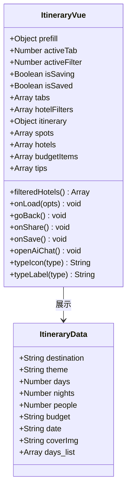

**图表来源**
- [itinerary.vue:264-402](file://uniapp-travel-social/homePages/itinerary/itinerary.vue#L264-L402)

#### 前端功能特性

前端组件提供了以下核心功能：

1. **多标签页展示**：支持每日行程、景点、酒店、预算四个标签页
2. **响应式设计**：适配不同屏幕尺寸的移动设备
3. **交互式操作**：支持行程修改、历史查看、保存等功能
4. **数据可视化**：通过图表展示预算分配和省钱建议
5. **预填信息支持**：支持从AI聊天页面传递的旅行信息预填
6. **本地存储降级**：当后端保存失败时自动降级到本地存储
7. **协作邀请功能**：支持一键创建协作房间并分享邀请码

#### itinerary-history.vue组件分析

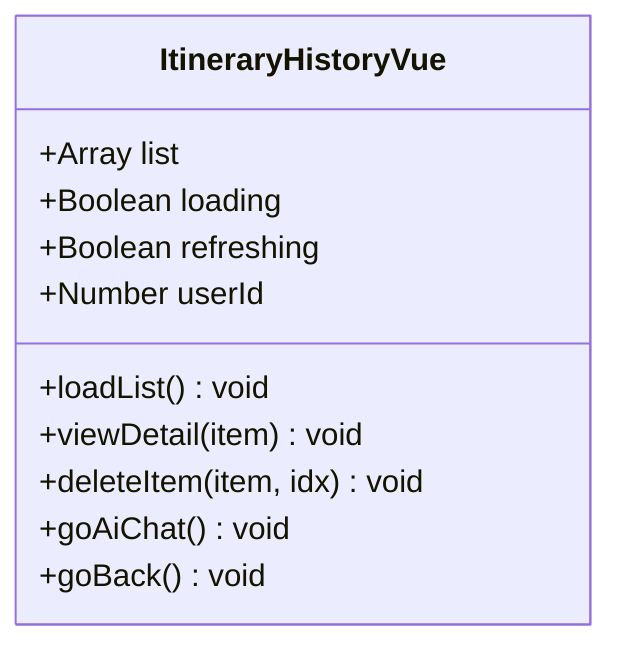

**图表来源**
- [itinerary-history.vue:84-171](file://uniapp-travel-social/homePages/itinerary/itinerary-history.vue#L84-L171)

#### 历史记录功能特性

历史记录页面提供了以下核心功能：

1. **行程列表展示**：显示用户保存的所有行程历史
2. **行程详情查看**：支持点击查看具体行程详情
3. **行程删除功能**：支持删除不需要的行程记录
4. **新建行程入口**：提供快速创建新行程的入口
5. **后端优先策略**：优先从后端获取数据，失败时降级到本地存储
6. **下拉刷新**：支持下拉刷新获取最新数据

#### itinerary-collab.vue组件分析

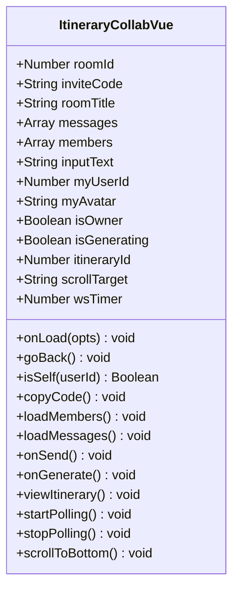

**图表来源**
- [itinerary-collab.vue:139-301](file://uniapp-travel-social/homePages/itinerary/itinerary-collab.vue#L139-L301)

#### 协作房间功能特性

协作房间页面提供了以下核心功能：

1. **实时消息展示**：显示系统消息、AI消息和用户消息
2. **成员管理**：显示房间成员头像和角色信息
3. **消息输入**：支持用户输入旅行偏好和建议
4. **AI生成按钮**：仅房间创建者可见，用于触发AI综合生成
5. **邀请码分享**：显示和复制房间邀请码
6. **轮询机制**：替代WebSocket的轮询机制，兼容小程序环境
7. **乐观渲染**：消息发送后立即显示，提升用户体验

**章节来源**
- [itinerary.vue:1-784](file://uniapp-travel-social/homePages/itinerary/itinerary.vue#L1-L784)
- [itinerary-history.vue:1-287](file://uniapp-travel-social/homePages/itinerary/itinerary-history.vue#L1-L287)
- [itinerary-collab.vue:1-443](file://uniapp-travel-social/homePages/itinerary/itinerary-collab.vue#L1-L443)

### 前端AI服务封装

#### aiService.js组件分析

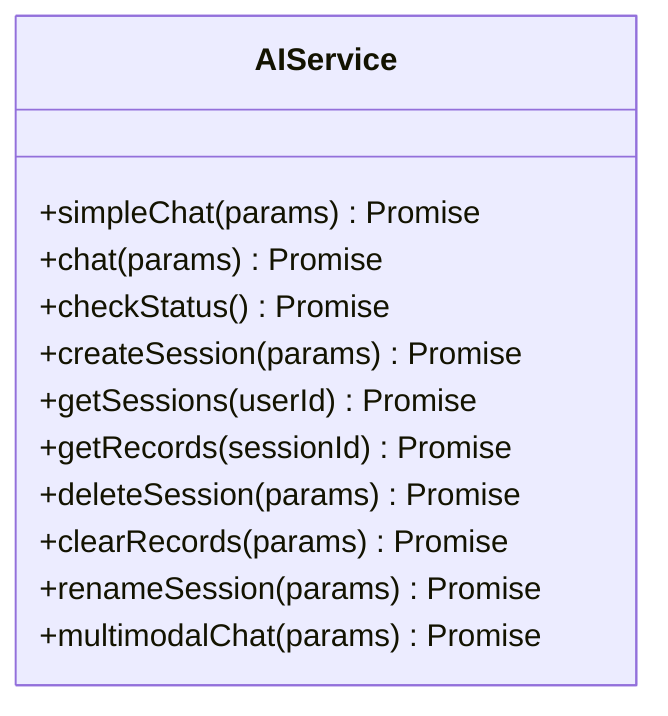

**图表来源**
- [aiService.js:42-291](file://uniapp-travel-social/services/aiService.js#L42-L291)

#### AI服务封装特性

AI服务封装提供了以下核心功能：

1. **统一请求处理**：封装网络请求，统一处理响应格式
2. **参数校验**：严格的参数验证和错误处理
3. **会话管理**：完整的AI聊天会话生命周期管理
4. **错误降级**：网络错误和服务器错误的统一处理
5. **多模态支持**：支持图片和文字的混合问答

**章节来源**
- [aiService.js:1-293](file://uniapp-travel-social/services/aiService.js#L1-L293)

### WebSocket实时通信系统

**新增** WebSocket实时通信系统为协作房间提供即时消息推送功能。

#### WebSocketServer组件分析

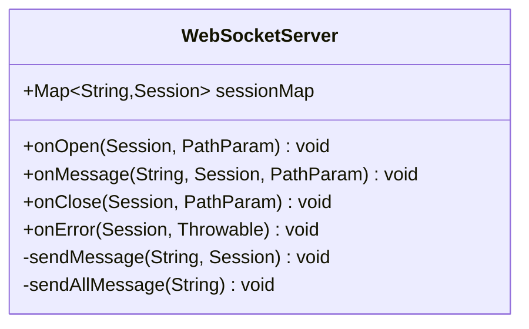

**图表来源**
- [WebSocketServer.java:23-137](file://springboot-travel-social/src/main/java/com/cxx/component/WebSocketServer.java#L23-L137)

#### 实时通信流程

WebSocket实时通信流程包含以下关键步骤：

1. **连接建立**：用户通过路径参数携带用户名建立WebSocket连接
2. **会话管理**：将用户会话存储在ConcurrentHashMap中
3. **消息转发**：根据目标用户ID将消息转发给对应会话
4. **广播机制**：支持向所有在线用户广播消息
5. **连接维护**：处理连接关闭和异常情况

**章节来源**
- [WebSocketServer.java:1-137](file://springboot-travel-social/src/main/java/com/cxx/component/WebSocketServer.java#L1-L137)

## 依赖关系分析

系统各组件之间的依赖关系体现了清晰的分层架构：

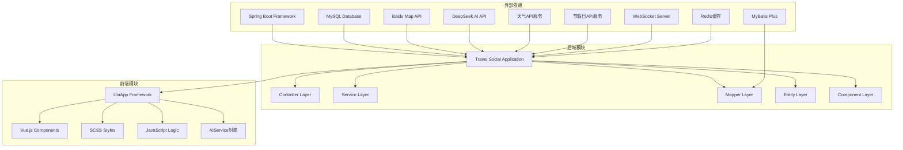

**图表来源**
- [ItineraryController.java:1-123](file://springboot-travel-social/src/main/java/com/cxx/controller/ItineraryController.java#L1-L123)
- [AIController.java:1-505](file://springboot-travel-social/src/main/java/com/cxx/controller/AIController.java#L1-L505)
- [TripContextController.java:1-45](file://springboot-travel-social/src/main/java/com/cxx/controller/TripContextController.java#L1-L45)
- [ItineraryCollabController.java:1-139](file://springboot-travel-social/src/main/java/com/cxx/controller/ItineraryCollabController.java#L1-L139)
- [WebSocketServer.java:1-137](file://springboot-travel-social/src/main/java/com/cxx/component/WebSocketServer.java#L1-L137)

### 数据库设计

系统采用关系型数据库设计，包含以下核心表结构：

```mermaid
erDiagram
AI_ITINERARY {
bigint id PK
bigint user_id
varchar title
varchar destination
int days
varchar theme
varchar budget
int people
text content
varchar cover_img
bigint session_id
bigint collab_room_id
int is_collab
varchar contributors
datetime create_time
int deleted
}
CHAT_SESSION {
bigint id PK
varchar user_id
varchar session_title
datetime create_time
datetime update_time
int is_deleted
}
CHAT_RECORD {
bigint id PK
bigint session_id
varchar user_id
text message_content
varchar role
datetime create_time
int is_deleted
}
ROUTE_ORDER {
bigint id PK
bigint user_id
bigint route_id
varchar route_title
varchar route_image
varchar destination
int days
int nights
decimal price
tinyint status
datetime create_time
datetime update_time
}
HOLIDAY_CONFIG {
bigint id PK
date holiday_date
varchar holiday_name
tinyint is_holiday
int peak_level
varchar tip
smallint year
datetime create_time
datetime update_time
}
ITINERARY_COLLAB_ROOM {
bigint id PK
varchar invite_code UK
bigint itinerary_id
bigint creator_id
varchar title
varchar destination
tinyint days
tinyint max_members
tinyint status
text ai_summary
datetime expire_at
datetime create_time
datetime update_time
}
ITINERARY_COLLAB_MEMBER {
bigint id PK
bigint room_id
bigint user_id UK
varchar role
varchar nickname
varchar avatar
text preference_input
datetime join_time
}
ITINERARY_COLLAB_MESSAGE {
bigint id PK
bigint room_id
bigint user_id
varchar role
text content
varchar msg_type
varchar nickname
varchar avatar
datetime create_time
}
AI_ITINERARY ||--|| CHAT_SESSION : "关联"
CHAT_SESSION ||--o{ CHAT_RECORD : "包含"
AI_ITINERARY ||--o{ ITINERARY_COLLAB_MESSAGE : "协作房间消息"
ITINERARY_COLLAB_ROOM ||--o{ ITINERARY_COLLAB_MEMBER : "房间成员"
ITINERARY_COLLAB_ROOM ||--o{ ITINERARY_COLLAB_MESSAGE : "房间消息"
```

**图表来源**
- [Itinerary.java:20-74](file://springboot-travel-social/src/main/java/com/cxx/entity/Itinerary.java#L20-L74)
- [ChatSession.java:9-44](file://springboot-travel-social/src/main/java/com/cxx/entity/ChatSession.java#L9-L44)
- [ChatRecord.java:9-48](file://springboot-travel-social/src/main/java/com/cxx/entity/ChatRecord.java#L9-L48)
- [HolidayConfig.java:21-57](file://springboot-travel-social/src/main/java/com/cxx/entity/HolidayConfig.java#L21-L57)
- [ItineraryCollabRoom.java:21-66](file://springboot-travel-social/src/main/java/com/cxx/entity/ItineraryCollabRoom.java#L21-L66)
- [ItineraryCollabMember.java:21-47](file://springboot-travel-social/src/main/java/com/cxx/entity/ItineraryCollabMember.java#L21-L47)
- [ItineraryCollabMessage.java:21-51](file://springboot-travel-social/src/main/java/com/cxx/entity/ItineraryCollabMessage.java#L21-L51)
- [route_order.sql:1-19](file://springboot-travel-social/src/main/resources/sql/route_order.sql#L1-L19)

**章节来源**
- [Itinerary.java:1-74](file://springboot-travel-social/src/main/java/com/cxx/entity/Itinerary.java#L1-L74)
- [ChatSession.java:1-44](file://springboot-travel-social/src/main/java/com/cxx/entity/ChatSession.java#L1-L44)
- [ChatRecord.java:1-48](file://springboot-travel-social/src/main/java/com/cxx/entity/ChatRecord.java#L1-L48)
- [HolidayConfig.java:1-58](file://springboot-travel-social/src/main/java/com/cxx/entity/HolidayConfig.java#L1-L58)
- [ItineraryCollabRoom.java:1-66](file://springboot-travel-social/src/main/java/com/cxx/entity/ItineraryCollabRoom.java#L1-L66)
- [ItineraryCollabMember.java:1-47](file://springboot-travel-social/src/main/java/com/cxx/entity/ItineraryCollabMember.java#L1-L47)
- [ItineraryCollabMessage.java:1-51](file://springboot-travel-social/src/main/java/com/cxx/entity/ItineraryCollabMessage.java#L1-L51)
- [route_order.sql:1-19](file://springboot-travel-social/src/main/resources/sql/route_order.sql#L1-L19)

## 性能考虑

### 后端性能优化

1. **数据库连接池**：合理配置连接池大小，避免连接泄漏
2. **缓存策略**：对频繁访问的数据使用Redis缓存
3. **异步处理**：AI调用采用异步方式，提高响应速度
4. **分页查询**：对大量数据采用分页查询，减少内存占用
5. **并发优化**：TripContextService内部并行调用天气和节假日服务，提升响应速度
6. **WebSocket优化**：协作房间消息采用批量广播，减少网络开销
7. **邀请码生成优化**：采用随机生成和冲突检测机制，确保唯一性
8. **事务管理**：协作房间创建和成员加入采用事务保证数据一致性
9. **WebSocket连接管理**：实现连接状态监控和自动重连机制
10. **协作者权限控制**：AI生成权限严格限制为房间创建者，避免不必要的计算
11. **消息持久化优化**：协作消息采用批量插入，提升写入性能
12. **房间状态缓存**：协作房间状态使用Redis缓存，减少数据库查询

### 前端性能优化

1. **组件懒加载**：对非关键组件采用懒加载策略
2. **图片优化**：使用适当的图片格式和尺寸
3. **虚拟滚动**：对长列表使用虚拟滚动技术
4. **状态管理**：合理使用Vuex进行状态管理
5. **本地存储**：合理使用localStorage减少网络请求
6. **WebSocket连接管理**：实现连接状态监控和自动重连机制
7. **协作邀请优化**：避免重复创建协作房间，添加防抖机制
8. **实时消息渲染**：优化WebSocket消息的实时渲染性能
9. **轮询频率控制**：协作房间轮询间隔设置为5秒，平衡实时性和性能
10. **乐观渲染优化**：消息发送后立即渲染，提升用户体验

### API性能监控

系统提供了API状态检查功能，可以监控AI服务的可用性：

```mermaid
flowchart LR
A[API调用] --> B{状态检查}
B --> |正常| C[直接调用]
B --> |异常| D[降级处理]
```

**章节来源**
- [AIController.java:237-255](file://springboot-travel-social/src/main/java/com/cxx/controller/AIController.java#L237-L255)
- [TripContextServiceImpl.java:32-57](file://springboot-travel-social/src/main/java/com/cxx/service/impl/TripContextServiceImpl.java#L32-L57)
- [ItineraryCollabServiceImpl.java:250-261](file://springboot-travel-social/src/main/java/com/cxx/service/impl/ItineraryCollabServiceImpl.java#L250-L261)

## 故障排除指南

### 常见问题及解决方案

#### AI服务连接问题

**问题描述**：AI服务无法连接或响应超时

**解决方案**：
1. 检查网络连接是否正常
2. 验证AI服务API密钥配置
3. 查看服务状态接口确认可用性
4. 实现重试机制和降级策略

#### 行程上下文服务问题

**问题描述**：TripContextController接口调用失败

**解决方案**：
1. 检查TripContextService实现类是否正确注入
2. 验证WeatherService和HolidayService接口实现
3. 检查数据库连接状态和节假日配置表
4. 查看日志输出定位具体错误

#### 协作房间创建问题

**问题描述**：ItineraryCollabController创建房间失败

**解决方案**：
1. 检查邀请码生成逻辑和唯一性验证
2. 验证用户权限和房间状态检查
3. 检查数据库事务配置和回滚机制
4. 查看日志输出定位具体错误

#### 协作消息发送问题

**问题描述**：sendMessage接口调用失败

**解决方案**：
1. 检查房间存在性和成员身份验证
2. 验证消息内容长度和格式
3. 检查WebSocket连接状态和广播机制
4. 查看日志输出定位具体错误

#### AI综合生成问题

**问题描述**：generateItinerary接口调用失败

**解决方案**：
1. 检查调用权限（必须是房间创建者）
2. 验证所有成员偏好收集完整性
3. 检查AI服务调用状态和响应
4. 查看日志输出定位具体错误

#### WebSocket连接问题

**问题描述**：协作房间消息无法实时推送

**解决方案**：
1. 检查WebSocket服务器配置
2. 验证用户连接状态和会话管理
3. 检查广播机制和消息格式
4. 实现连接状态监控和自动重连

#### 数据库连接问题

**问题描述**：数据库连接失败或查询超时

**解决方案**：
1. 检查数据库连接配置
2. 验证数据库服务状态
3. 查看连接池配置参数
4. 实施数据库连接健康检查

#### 前端页面加载问题

**问题描述**：行程页面加载缓慢或显示异常

**解决方案**：
1. 检查网络请求状态
2. 验证数据格式正确性
3. 实现错误边界处理
4. 添加加载状态指示器

#### 行程保存失败问题

**问题描述**：用户无法保存AI生成的行程

**解决方案**：
1. 检查用户登录状态
2. 验证行程数据完整性
3. 查看数据库连接状态
4. 检查MyBatis Plus配置
5. 实现本地存储降级机制

#### 前端历史页面问题

**问题描述**：历史行程页面无法显示或刷新

**解决方案**：
1. 检查用户ID存储状态
2. 验证后端API接口可用性
3. 实现本地存储降级逻辑
4. 检查下拉刷新功能实现

#### 路线规划API问题

**问题描述**：百度地图API调用失败

**解决方案**：
1. 检查AK密钥配置
2. 验证网络连接
3. 查看API返回状态码
4. 实现错误重试机制

#### 节假日配置问题

**问题描述**：节假日查询结果不准确

**解决方案**：
1. 检查holiday_config表数据完整性
2. 验证节假日配置的年份范围
3. 查看节假日配置的唯一索引
4. 确认节假日配置的高峰等级设置

#### 协作邀请码问题

**问题描述**：邀请码无效或过期

**解决方案**：
1. 检查邀请码生成算法和唯一性
2. 验证过期时间设置和检查逻辑
3. 检查数据库索引和查询性能
4. 实现邀请码重试机制

#### 权限控制问题

**问题描述**：非房间创建者尝试生成AI行程

**解决方案**：
1. 检查成员角色验证逻辑
2. 验证权限检查的实现
3. 查看日志输出定位具体错误
4. 实现权限状态的前端提示

#### 协作房间状态问题

**问题描述**：房间状态异常或消息丢失

**解决方案**：
1. 检查房间状态字段定义和更新逻辑
2. 验证消息持久化和查询完整性
3. 检查数据库事务提交状态
4. 实现状态同步和补偿机制

#### 前端轮询问题

**问题描述**：协作房间轮询机制失效

**解决方案**：
1. 检查轮询定时器的启动和停止逻辑
2. 验证网络请求的错误处理
3. 实现轮询失败的重试机制
4. 检查小程序环境的兼容性

**章节来源**
- [AIController.java:237-255](file://springboot-travel-social/src/main/java/com/cxx/controller/AIController.java#L237-L255)
- [TripContextController.java:35-43](file://springboot-travel-social/src/main/java/com/cxx/controller/TripContextController.java#L35-L43)
- [TripContextServiceImpl.java:50-56](file://springboot-travel-social/src/main/java/com/cxx/service/impl/TripContextServiceImpl.java#L50-L56)
- [ItineraryController.java:63-66](file://springboot-travel-social/src/main/java/com/cxx/controller/ItineraryController.java#L63-L66)
- [RoutePlanningController.java:25-29](file://springboot-travel-social/src/main/java/com/cxx/controller/RoutePlanningController.java#L25-L29)
- [ItineraryCollabController.java:32-139](file://springboot-travel-social/src/main/java/com/cxx/controller/ItineraryCollabController.java#L32-L139)
- [ItineraryCollabServiceImpl.java:42-239](file://springboot-travel-social/src/main/java/com/cxx/service/impl/ItineraryCollabServiceImpl.java#L42-239)
- [itinerary.vue:380-430](file://uniapp-travel-social/homePages/itinerary/itinerary.vue#L380-L430)
- [itinerary-history.vue:102-128](file://uniapp-travel-social/homePages/itinerary/itinerary-history.vue#L102-L128)
- [itinerary-collab.vue:286-295](file://uniapp-travel-social/homePages/itinerary/itinerary-collab.vue#L286-L295)
- [WebSocketServer.java:1-137](file://springboot-travel-social/src/main/java/com/cxx/component/WebSocketServer.java#L1-L137)

### 日志监控

系统实现了完善的日志记录机制，便于问题诊断和性能监控：

1. **请求日志**：记录所有API请求的详细信息
2. **错误日志**：捕获和记录系统异常
3. **性能日志**：监控关键操作的执行时间
4. **业务日志**：记录重要的业务操作
5. **上下文日志**：记录TripContextService的聚合调用过程
6. **协作日志**：记录ItineraryCollabService的协作操作过程
7. **WebSocket日志**：记录实时消息推送的状态
8. **邀请码日志**：记录协作房间创建和加入的详细过程
9. **权限日志**：记录协作房间权限验证的过程
10. **AI调用日志**：记录AI服务调用的详细信息
11. **数据库事务日志**：记录协作房间的事务操作
12. **前端交互日志**：记录用户在协作房间的操作行为

## 结论

行程规划系统通过集成AI智能技术和现代化的前后端架构，为用户提供了完整的旅行规划解决方案。系统的主要优势包括：

1. **智能化程度高**：通过AI大模型生成个性化的旅行行程
2. **上下文感知能力强**：新增的TripContextController提供天气、节假日和AI摘要的一站式获取
3. **用户体验优秀**：前端采用UniApp框架，提供流畅的移动端体验
4. **扩展性强**：模块化设计便于功能扩展和维护
5. **技术栈先进**：采用Spring Boot、MyBatis Plus等主流技术
6. **可靠性强**：实现了完善的错误处理和降级机制
7. **协作能力强**：**新增**完整的多人实时协作行程规划功能，支持邀请码邀请、实时消息通信和AI综合生成
8. **实时通信支持**：**新增**WebSocket实时消息推送，实现协作房间的即时通信
9. **权限控制完善**：**新增**协作房间的权限管理和状态控制机制
10. **数据模型完整**：**新增**完整的协作数据模型，支持房间、成员、消息的全生命周期管理

新增的ItineraryCollabController、ItineraryCollabService及其相关实体类和映射器，构建了完整的多人协作行程规划系统。这些组件的引入显著增强了系统的协作能力和用户体验，使用户能够邀请朋友共同制定旅行计划，实时交流偏好，并由AI综合生成最合适的行程方案。

新增的Itinerary实体类协作字段扩展，以及itinerary_collab.sql数据库脚本的实施，为多人协作功能提供了坚实的数据基础。WebSocketServer的集成实现了真正的实时协作体验，用户可以在房间内看到其他成员的加入和消息。

**新增**的前端协作房间Vue组件itinerary-collab.vue提供了完整的协作界面，支持实时消息展示、成员管理、AI生成按钮和邀请码分享等功能。该组件采用了轮询机制来兼容小程序环境，确保在不同平台上的稳定运行。

未来可以考虑的功能改进方向：
- 增加更多AI模型支持
- 优化行程生成算法
- 扩展多语言支持
- 增强数据分析能力
- 集成更多第三方服务
- 实现行程分享和协作功能
- 增加行程模板和复用功能
- 优化上下文感知的准确性
- 增强协作房间的权限管理
- 实现离线消息同步机制
- 添加协作房间的文件共享功能
- 增加行程进度跟踪和提醒功能
- 实现更精细的成员权限控制
- 增加协作房间的文件上传下载功能
- 实现行程的版本管理和历史对比功能
- 增加协作房间的投票和决策功能
- 实现行程预算的实时共享和分摊功能

该系统为旅行爱好者提供了一个强大而易用的行程规划工具，能够有效提升旅行体验和效率。通过集成AI智能技术和多人协作功能，系统不仅满足了个人用户的旅行规划需求，也为团体旅行和朋友间的协作提供了完美的解决方案。新增的协作功能模块显著提升了系统的实用性和用户粘性，为未来的功能扩展奠定了坚实的基础。