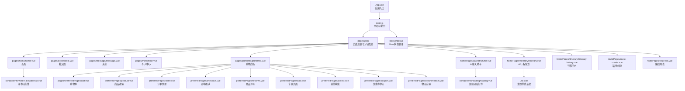
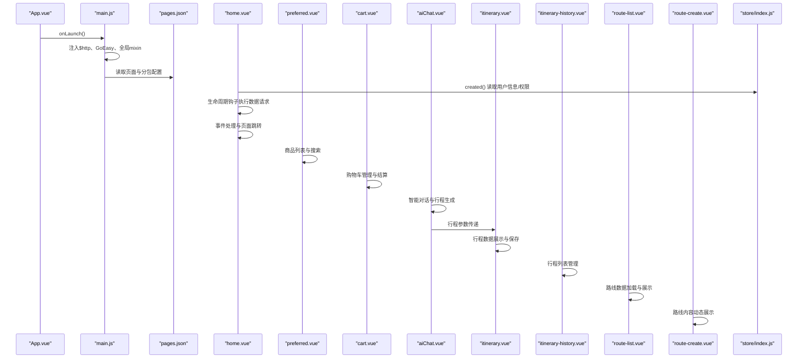
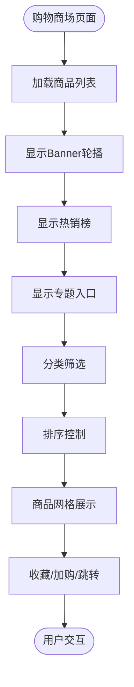
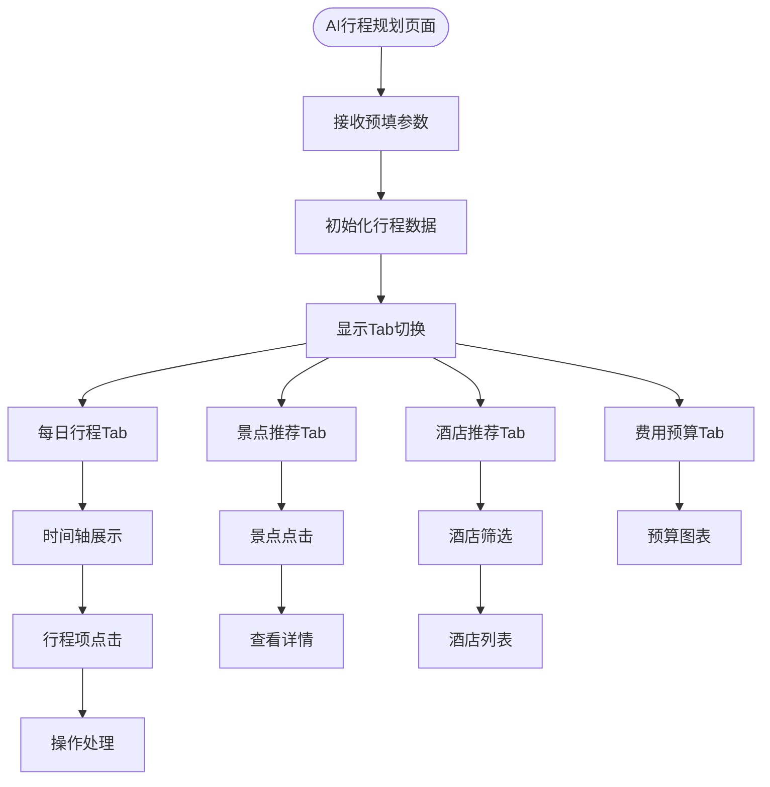
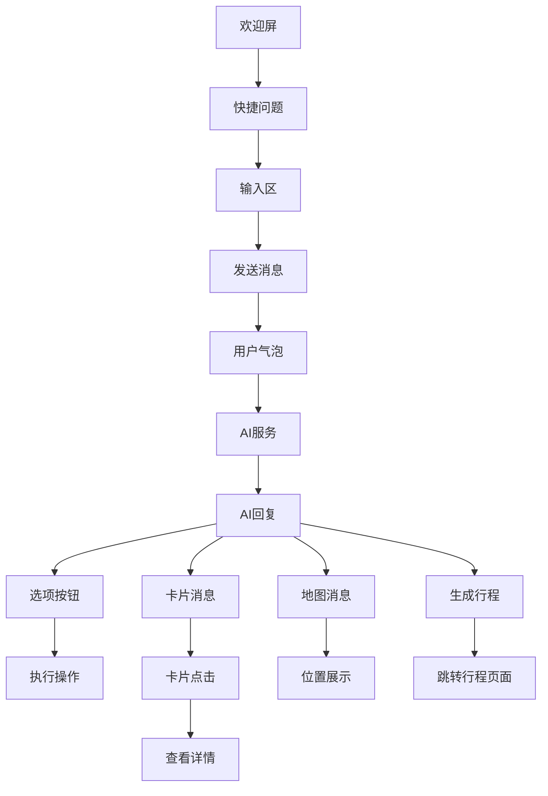

# 页面组件设计

<cite>
**本文档引用的文件**
- [home.vue](file://uniapp-travel-social/pages/home/home.vue)
- [circle.vue](file://uniapp-travel-social/pages/circle/circle.vue)
- [message.vue](file://uniapp-travel-social/pages/message/message.vue)
- [mine.vue](file://uniapp-travel-social/pages/mine/mine.vue)
- [preferred.vue](file://uniapp-travel-social/pages/preferred/preferred.vue)
- [cart.vue](file://uniapp-travel-social/pages/preferredPages/cart.vue)
- [checkout.vue](file://uniapp-travel-social/preferredPages/checkout.vue)
- [order.vue](file://uniapp-travel-social/preferredPages/order.vue)
- [product.vue](file://uniapp-travel-social/preferredPages/product.vue)
- [reviews.vue](file://uniapp-travel-social/preferredPages/reviews.vue)
- [topic.vue](file://uniapp-travel-social/preferredPages/topic.vue)
- [collect.vue](file://uniapp-travel-social/preferredPages/collect.vue)
- [coupon.vue](file://uniapp-travel-social/preferredPages/coupon.vue)
- [stream.vue](file://uniapp-travel-social/preferredPages/stream/stream.vue)
- [itinerary.vue](file://uniapp-travel-social/homePages/itinerary/itinerary.vue)
- [itinerary-history.vue](file://uniapp-travel-social/homePages/itinerary/itinerary-history.vue)
- [aiChat.vue](file://uniapp-travel-social/homePages/aiChat/aiChat.vue)
- [route-create.vue](file://uniapp-travel-social/routePages/route-create.vue)
- [route-list.vue](file://uniapp-travel-social/routePages/route-list.vue)
- [App.vue](file://uniapp-travel-social/App.vue)
- [main.js](file://uniapp-travel-social/main.js)
- [pages.json](file://uniapp-travel-social/pages.json)
- [store/index.js](file://uniapp-travel-social/store/index.js)
- [loading.vue](file://uniapp-travel-social/components/loading/loading.vue)
- [waterFall.vue](file://uniapp-travel-social/components/waterFall/waterFall.vue)
- [template_page_mixin.js](file://uniapp-travel-social/libs/mixin/template_page_mixin.js)
- [uni.scss](file://uniapp-travel-social/uni.scss)
</cite>

## 更新摘要
**变更内容**
- 新增完整的优选购物系统页面组件，包括购物商场、购物车、订单管理、商品详情、评价系统、专题页面、收藏管理、优惠券中心、物流追踪等电商功能
- 扩展了首页功能，集成了AI助手、行程规划等核心功能入口
- 新增AI聊天助手页面，支持智能对话、行程生成、卡片推荐
- 新增行程规划页面组件系统，包含AI行程规划、行程历史管理
- 新增路线规划页面组件，支持路线创建和列表展示
- 增强了用户交互体验，提供了更丰富的旅行规划工具链

## 目录
1. [简介](#简介)
2. [项目结构](#项目结构)
3. [核心组件](#核心组件)
4. [架构总览](#架构总览)
5. [详细组件分析](#详细组件分析)
6. [优选购物系统页面组件](#优选购物系统页面组件)
7. [行程规划页面组件系统](#行程规划页面组件系统)
8. [AI聊天助手系统](#ai聊天助手系统)
9. [路线规划页面组件](#路线规划页面组件)
10. [依赖关系分析](#依赖关系分析)
11. [性能考量](#性能考量)
12. [故障排查指南](#故障排查指南)
13. [结论](#结论)
14. [附录](#附录)

## 简介
本文件面向UniApp旅行社交小程序的核心页面组件，系统性梳理首页home.vue、社交圈circle.vue、消息message.vue、个人中心mine.vue以及新增的完整优选购物系统页面组件和行程规划页面组件的设计与实现，覆盖页面生命周期管理、数据绑定、事件处理、页面间导航与参数传递、路由配置、布局与响应式适配、移动端优化以及最佳实践与性能优化建议。文档旨在帮助开发者快速理解代码结构、掌握开发规范，并在实际项目中高效迭代。

## 项目结构
项目采用典型的UniApp多包分包策略，页面按功能域划分至不同子包，便于资源加载与维护：
- 主包pages：包含首页、地图选择、消息、优选等基础页面
- 子包messagePages：消息相关页面（私聊、群聊、联系人等）
- 子包homePages：首页扩展页面（搜索、AI聊天、VR、行程规划等）
- 子包routePages：路线规划相关页面（路线创建、列表、详情等）
- 子包preferredPages：优选购物系统页面组件，包含购物商场、商品详情、购物车、订单管理、优惠券等完整电商功能
- **新增** 子包itineraryPages：行程规划页面组件系统，包含AI行程规划、行程历史管理
- **新增** 子包aiChatPages：AI聊天助手页面，提供智能旅行规划对话功能

**图表来源**
- [App.vue:1-93](file://uniapp-travel-social/App.vue#L1-L93)
- [main.js:1-118](file://uniapp-travel-social/main.js#L1-L118)
- [pages.json:1-842](file://uniapp-travel-social/pages.json#L1-L842)
- [store/index.js:1-75](file://uniapp-travel-social/store/index.js#L1-L75)
- [preferred.vue:1-477](file://uniapp-travel-social/pages/preferred/preferred.vue#L1-L477)
- [cart.vue:1-493](file://uniapp-travel-social/pages/preferredPages/cart.vue#L1-L493)
- [aiChat.vue:1-1159](file://uniapp-travel-social/homePages/aiChat/aiChat.vue#L1-L1159)
- [itinerary.vue:1-722](file://uniapp-travel-social/homePages/itinerary/itinerary.vue#L1-L722)
- [itinerary-history.vue:1-287](file://uniapp-travel-social/homePages/itinerary/itinerary-history.vue#L1-L287)
- [route-create.vue:1-147](file://uniapp-travel-social/routePages/route-create.vue#L1-L147)
- [route-list.vue:1-554](file://uniapp-travel-social/routePages/route-list.vue#L1-L554)

**章节来源**
- [pages.json:1-842](file://uniapp-travel-social/pages.json#L1-L842)

## 核心组件
- 首页home.vue：聚合轮播、AI助手、功能入口网格、推荐UP、热门攻略、游记瀑布流等模块，采用created生命周期拉取数据，结合自定义导航栏与响应式布局。
- 社交圈circle.vue：发现页、视频页、活动页三段式Tab切换，集成评论、点赞、收藏、举报、地理位置授权等功能，使用水位滚动加载与弹窗交互。
- 消息message.vue：基于GoEasy即时通讯的会话列表、好友列表、群组列表，支持置顶、删除会话、未读角标、扫码加好友等。
- 个人中心mine.vue：用户信息展示、发布/订单/购物车/保险入口、我的路线/车票/酒店/美食、设置与反馈、技术支持等，支持权限控制与实名认证状态展示。
- **新增** 购物商场preferred.vue：完整的电商入口页面，包含搜索、分类、热销榜、专题入口、商品列表、收藏、优惠券等功能。
- **新增** 购物车cart.vue：购物车管理页面，支持商品勾选、数量修改、删除、全选、结算等功能。
- **新增** 订单管理order.vue：订单状态管理页面，支持全部、待发货、运输中、待收货等状态筛选与操作。
- **新增** 商品详情product.vue：商品详情展示页面，包含轮播图、价格信息、规格选择、SKU弹窗、相关推荐等。
- **新增** 订单确认checkout.vue：订单确认页面，包含商品清单、配送信息、优惠券选择、备注、支付方式、价格合计等。
- **新增** 商品评价reviews.vue：商品评价展示页面，包含评分总览、筛选标签、评价列表、图片展示等。
- **新增** 专题页面topic.vue：专题商品展示页面，包含分类导航、商品列表、加购功能等。
- **新增** 收藏管理collect.vue：我的收藏页面，支持批量加购、取消收藏、跳转详情等。
- **新增** 优惠券coupon.vue：优惠券中心页面，支持未使用、已使用、已过期状态筛选。
- **新增** 物流追踪stream.vue：物流信息展示页面，使用时间线组件展示物流状态。
- **新增** AI聊天助手aiChat.vue：智能旅行对话系统，支持文本/语音输入、图片识别、快捷问题、行程生成、卡片推荐等功能。
- **新增** AI行程规划itinerary.vue：完整的行程规划展示页面，包含每日行程、景点推荐、酒店推荐、费用预算等模块。
- **新增** 行程历史itinerary-history.vue：行程管理页面，支持行程列表查看、删除、新建等功能。
- **新增** 路线创建route-create.vue：基于大模型的路线生成页面，支持动态文本展示效果。
- **新增** 路线列表route-list.vue：旅游路线展示页面，支持搜索、筛选、分页加载等功能。

**章节来源**
- [home.vue:395-647](file://uniapp-travel-social/pages/home/home.vue#L395-L647)
- [circle.vue:468-625](file://uniapp-travel-social/pages/circle/circle.vue#L468-L625)
- [message.vue:166-442](file://uniapp-travel-social/pages/message/message.vue#L166-L442)
- [mine.vue:289-422](file://uniapp-travel-social/pages/mine/mine.vue#L289-L422)
- [preferred.vue:1-477](file://uniapp-travel-social/pages/preferred/preferred.vue#L1-L477)
- [cart.vue:1-493](file://uniapp-travel-social/pages/preferredPages/cart.vue#L1-L493)
- [order.vue:1-796](file://uniapp-travel-social/preferredPages/order.vue#L1-L796)
- [product.vue:1-800](file://uniapp-travel-social/preferredPages/product.vue#L1-L800)
- [checkout.vue:1-690](file://uniapp-travel-social/preferredPages/checkout.vue#L1-L690)
- [reviews.vue:1-209](file://uniapp-travel-social/preferredPages/reviews.vue#L1-L209)
- [topic.vue:1-205](file://uniapp-travel-social/preferredPages/topic.vue#L1-L205)
- [collect.vue:1-174](file://uniapp-travel-social/preferredPages/collect.vue#L1-L174)
- [coupon.vue:1-154](file://uniapp-travel-social/preferredPages/coupon.vue#L1-L154)
- [stream.vue:1-213](file://uniapp-travel-social/preferredPages/stream/stream.vue#L1-L213)
- [aiChat.vue:1-1159](file://uniapp-travel-social/homePages/aiChat/aiChat.vue#L1-L1159)
- [itinerary.vue:1-722](file://uniapp-travel-social/homePages/itinerary/itinerary.vue#L1-L722)
- [itinerary-history.vue:1-287](file://uniapp-travel-social/homePages/itinerary/itinerary-history.vue#L1-L287)
- [route-create.vue:1-147](file://uniapp-travel-social/routePages/route-create.vue#L1-L147)
- [route-list.vue:1-554](file://uniapp-travel-social/routePages/route-list.vue#L1-L554)

## 架构总览
整体架构由应用入口、全局初始化、页面路由、业务页面与组件库构成。应用启动时注入HTTP拦截器、IM SDK、全局工具函数；页面通过Vuex共享导航栏高度等信息；页面内通过组件化实现功能解耦。

**图表来源**
- [App.vue:6-85](file://uniapp-travel-social/App.vue#L6-L85)
- [main.js:15-84](file://uniapp-travel-social/main.js#L15-L84)
- [pages.json:1-842](file://uniapp-travel-social/pages.json#L1-L842)
- [store/index.js:32-70](file://uniapp-travel-social/store/index.js#L32-L70)

## 详细组件分析

### 首页 home.vue 设计与实现
- 页面结构
  - 自定义导航栏：包含Logo、搜索框、右上角扫描入口（条件显示）
  - 轮播图：自动轮播与指示点，点击进入景点详情
  - AI旅行助手：输入框、推荐标签、回复气泡、继续对话跳转
  - 功能入口网格：景区预约、行程规划、旅游路线、结伴活动、幸运抽奖、车票购买、酒店住宿、餐饮美食、出行服务、保险购买、出行先知、跟拍等
  - 推荐UP：横向滑动卡片，点击进入用户主页
  - 热门攻略：列表项，点击进入攻略详情
  - 游记瀑布流：两列瀑布流布局，点击进入游记详情
- 生命周期与数据绑定
  - created：获取系统信息、拉取游记列表、推荐UP、攻略列表、权限控制
  - methods：封装HTTP请求、时间格式化、页面跳转、功能入口跳转
- 事件处理
  - 轮播切换：cardSwiper、resume
  - AI问答：sendAiQuestion、openAiChat、openItinerary
  - 权限控制：getPermission
  - 页面跳转：tn、goDetail、goSee、seeAttractionInfo、goStrategy、goTravel
- 响应式与布局
  - 使用tn-*类名体系与SCSS变量，适配不同屏幕尺寸
  - 安全区域适配：env(safe-area-inset-bottom)
  - 导航栏高度动态注入：vuex_custom_bar_height

**章节来源**
- [home.vue:1-800](file://uniapp-travel-social/pages/home/home.vue#L1-L800)
- [waterFall.vue:1-155](file://uniapp-travel-social/components/waterFall/waterFall.vue#L1-L155)

### 社交圈 circle.vue 设计与实现
- 页面结构
  - 顶部导航：用户头像、Tab切换（发现/视频/活动）
  - 发现页：人气排行榜、精选VR、精选目的地、瀑布流
  - 视频页：垂直轮播视频，底部点赞/评论/收藏操作
  - 活动页：活动列表，支持删除、参与人数统计
  - 弹窗交互：评论列表、举报、评论输入、回复输入
- 生命周期与数据绑定
  - onLoad：接收路由参数，初始化数据
  - created：获取用户信息、权限、热门城市、定位、VR列表
  - onShow/onHide：控制轮播自动播放
  - watch：监听评论输入长度动态调整弹窗高度
  - methods：权限查询、地理位置授权、举报、评论点赞/发送、回复、删除评论、视频操作等
- 事件处理
  - Tab切换：tabChange
  - 视频操作：cardSwiper、likeVideo、openComment、collectionVideo
  - 评论交互：likeComment、sendComment、sendReplyComment、reply、report
  - 页面跳转：tn、goUserHome、goToMyRoute等

**章节来源**
- [circle.vue:1-800](file://uniapp-travel-social/pages/circle/circle.vue#L1-L800)

### 消息 message.vue 设计与实现
- 页面结构
  - 顶部导航：扫描入口、Tab切换（消息/通讯录/群聊）
  - 消息页：会话列表，支持置顶/删除、未读角标、撤回消息提示
  - 通讯录页：好友索引列表
  - 群聊页：群组列表，支持进入群聊
- 生命周期与数据绑定
  - created：初始化GoEasy连接、订阅群组、加载会话列表、设置未读角标
  - beforeDestroy：移除监听
  - methods：权限控制、扫码加好友、获取好友列表、获取群组、会话置顶/删除、跳转聊天
- 事件处理
  - Tab切换：change
  - 会话操作：topConversation、deleteConversation
  - 聊天跳转：chat
  - 扫码：openScan

**章节来源**
- [message.vue:1-782](file://uniapp-travel-social/pages/message/message.vue#L1-L782)

### 个人中心 mine.vue 设计与实现
- 页面结构
  - 未登录态：展示登录组件
  - 已登录态：顶部背景图、用户信息、发布/订单/购物车/保险入口、我的路线/车票/酒店/美食、更多设置与服务
- 生命周期与数据绑定
  - created：读取token、查询用户信息、获取权限、实名认证状态
  - methods：权限控制、跳转设置、查看我的发布/点赞/收藏、我的路线/车票/酒店/美食、二维码名片、收货地址、技术支持
- 事件处理
  - 权限控制：getPermission
  - 页面跳转：tn、goToMyPulish、goToMyRoute、goToMyTicket、goToMyHotel、goToMyFood、goToInsuranceList、goToQRCode、address、callPhoneNumber

**章节来源**
- [mine.vue:1-800](file://uniapp-travel-social/pages/mine/mine.vue#L1-L800)

## 优选购物系统页面组件

### 购物商场 preferred.vue 设计与实现
- 页面结构
  - 顶部导航：标题、购物车徽章
  - 顶部工具栏：搜索框、收藏、优惠券
  - Banner轮播：专题推广
  - 今日热销榜：价格排序展示
  - 专题入口：旅行装备精选
  - 分区标题：全部商品 + 排序筛选
  - 分类Tab：按商品类型筛选
  - 商品网格：图片、名称、价格、收藏、加购
- 生命周期与数据绑定
  - created：获取商品列表
  - onShow：获取购物车数量、收藏状态
  - data：包含商品数据、搜索关键字、分类筛选、排序状态、收藏ID列表等
  - computed：分类Tab生成、热销榜计算、筛选后的商品列表
  - methods：商品跳转、价格排序切换、收藏切换、购物车加购、跳转收藏、跳转优惠券、跳转专题
- 事件处理
  - 搜索：keyword双向绑定与过滤
  - 分类：activeTab控制分类筛选
  - 排序：activeSort控制排序方式
  - 收藏：toggleFav切换收藏状态
  - 加购：addToCart加入购物车
  - 跳转：goCollect、goCoupon、goTopic、tn

**图表来源**
- [preferred.vue:174-268](file://uniapp-travel-social/pages/preferred/preferred.vue#L174-L268)

**章节来源**
- [preferred.vue:1-477](file://uniapp-travel-social/pages/preferred/preferred.vue#L1-L477)

### 购物车 cart.vue 设计与实现
- 页面结构
  - 顶部导航：标题、商品数量
  - 空购物车提示：图标、文案、去逛逛按钮
  - 购物车商品列表：勾选框、图片、信息、数量控制、删除
  - 底部操作栏：全选、合计、结算按钮
- 生命周期与数据绑定
  - onShow：获取购物车数据
  - data：包含购物车商品列表、选中ID集合、用户ID等
  - computed：全选状态、选中商品总价、选中商品数量
  - methods：获取购物车、全选切换、单项勾选、数量更新、删除商品、清空购物车、跳转结算
- 事件处理
  - 全选：toggleAll切换所有商品选中状态
  - 勾选：toggleItem切换单个商品选中状态
  - 数量：updateQuantity更新商品数量、handleQuantityChange处理输入变化
  - 删除：removeFromCart删除单个商品
  - 结算：goToCheckout跳转订单确认页面

**章节来源**
- [cart.vue:1-493](file://uniapp-travel-social/pages/preferredPages/cart.vue#L1-L493)

### 订单管理 order.vue 设计与实现
- 页面结构
  - 顶部导航：返回按钮、标题
  - 顶部标签：全部/待发货/运输中/待收货
  - 标签内容：对应状态的订单列表
  - 订单卡片：头部状态、收货人信息、商品列表、总价、操作按钮
  - 物流追踪卡片：运输中状态下的物流信息
- 生命周期与数据绑定
  - onLoad：获取订单列表
  - onReady：更新Swiper信息
  - data：包含订单列表数组、标签配置、状态筛选、模态框状态等
  - methods：获取订单、标签切换、状态更新、删除订单、确认收货、查看物流、跳转评价、跳转再次兑换
- 事件处理
  - 标签切换：tabsChange切换订单状态筛选
  - 订单操作：确认收货、删除订单、查看物流、跳转评价、跳转再次兑换
  - 物流追踪：goLogistics跳转物流页面

**章节来源**
- [order.vue:1-796](file://uniapp-travel-social/preferredPages/order.vue#L1-L796)

### 商品详情 product.vue 设计与实现
- 页面结构
  - 轮播图：商品图片展示
  - 价格区：现价、原价、销量、好评
  - 商品名称：标题、标签（爆款、包邮、新品）
  - 选规区：送至地址、库存、规格
  - 服务保障：正品保障、退换、包邮、快速发货
  - 图文详情：商品详情图片与信息
  - 评价入口：评分、评价数量、跳转评价
  - 相关推荐：猜你喜欢商品列表
  - SKU弹窗：颜色、规格、数量选择
  - 底部操作栏：加购、立即购买
- 生命周期与数据绑定
  - onLoad：接收商品ID参数
  - data：包含商品信息、SKU配置、相关推荐、地址选择弹窗状态等
  - methods：获取商品信息、获取地址列表、选择地址、提交订单、加入购物车、跳转评价、跳转推荐商品、打开SKU弹窗、确认SKU
- 事件处理
  - 地址选择：getLocation打开地址选择弹窗、chooseClick选择地址
  - SKU选择：颜色选择、规格选择、数量调整、确认SKU
  - 购买：addToCart加入购物车、submit立即购买
  - 跳转：goReviews跳转评价、goProduct跳转推荐商品

**章节来源**
- [product.vue:1-800](file://uniapp-travel-social/preferredPages/product.vue#L1-L800)

### 订单确认 checkout.vue 设计与实现
- 页面结构
  - 顶部导航：返回按钮、标题
  - 购物车商品列表：商品图片、名称、价格、数量
  - 配送信息：收货人、地址、运费
  - 优惠券选择：优惠券列表、选择按钮
  - 买家备注：文本输入框
  - 支付方式：微信支付、支付宝、余额支付
  - 价格合计：商品总价、运费、优惠券、实付金额
  - 底部结算按钮：实付金额、提交订单
  - 收货地址选择弹窗：地址列表
- 生命周期与数据绑定
  - onLoad：获取购物车商品数据
  - data：包含购物车商品、地址信息、运费、优惠券、备注、支付方式等
  - computed：最终价格计算（总价+运费-优惠券）
  - methods：返回、关闭弹窗、打开弹窗、选择优惠券、获取地址列表、选择地址、计算总价、获取购物车、获取位置、提交订单
- 事件处理
  - 优惠券：chooseCoupon选择优惠券
  - 地址：getLocation打开地址选择、chooseClick选择地址
  - 支付：支付方式选择
  - 提交：submit提交订单

**章节来源**
- [checkout.vue:1-690](file://uniapp-travel-social/preferredPages/checkout.vue#L1-L690)

### 商品评价 reviews.vue 设计与实现
- 页面结构
  - 顶部导航：返回按钮、标题
  - 评分总览：综合评分、星级分布
  - 筛选标签：全部/好评/中评/差评
  - 评价列表：头像、昵称、评分、日期、内容、图片
  - 空状态：暂无评价提示
- 生命周期与数据绑定
  - onLoad：接收商品ID参数
  - data：包含商品ID、筛选状态、评分分布、评价列表、平均评分等
  - computed：筛选后的评价列表
  - methods：加载评价、使用模拟数据、计算星级分布
- 事件处理
  - 筛选：activeFilter切换评价筛选
  - 加载：loadReviews加载评价数据

**章节来源**
- [reviews.vue:1-209](file://uniapp-travel-social/preferredPages/reviews.vue#L1-L209)

### 专题页面 topic.vue 设计与实现
- 页面结构
  - 顶部导航：透明导航
  - 顶部封面：渐变背景、标签、标题、副标题、统计数据
  - 页面主体：专题简介、分类导航、精选商品、空状态
  - 商品列表：缩略图、标签、名称、理由、价格、加购按钮
- 生命周期与数据绑定
  - created：获取商品列表
  - data：包含商品列表、活跃分类、分类数组等
  - computed：分类筛选后的商品列表
  - methods：加载商品、跳转详情、加入购物车
- 事件处理
  - 分类：activeCategory切换分类筛选
  - 跳转：goDetail跳转商品详情、addToCart加入购物车

**章节来源**
- [topic.vue:1-205](file://uniapp-travel-social/preferredPages/topic.vue#L1-L205)

### 收藏管理 collect.vue 设计与实现
- 页面结构
  - 顶部导航：返回按钮、标题
  - 操作栏：数量统计、批量加购
  - 空状态：爱心图标、文案、去逛逛按钮
  - 收藏商品网格：图片、名称、价格、取消收藏、加购
- 生命周期与数据绑定
  - onShow：获取收藏ID列表、加载商品数据
  - data：包含收藏ID数组、商品列表等
  - computed：收藏商品过滤
  - methods：加载商品、移除收藏、跳转详情、去逛逛、加入购物车、批量加购
- 事件处理
  - 收藏：removeFav移除收藏
  - 批量：batchAddToCart批量加购
  - 跳转：goDetail跳转详情、goShop返回

**章节来源**
- [collect.vue:1-174](file://uniapp-travel-social/preferredPages/collect.vue#L1-L174)

### 优惠券 coupon.vue 设计与实现
- 页面结构
  - 顶部导航：返回按钮、标题
  - Tab标签：未使用/已使用/已过期
  - 优惠券列表：金额、满减条件、名称、范围、有效期、使用按钮/状态标签
- 生命周期与数据绑定
  - data：包含活跃Tab、标签配置、优惠券数组等
  - computed：按状态筛选的优惠券列表
  - methods：跳转使用
- 事件处理
  - Tab切换：activeTab切换优惠券状态筛选
  - 使用：goToShop跳转使用

**章节来源**
- [coupon.vue:1-154](file://uniapp-travel-social/preferredPages/coupon.vue#L1-L154)

### 物流追踪 stream.vue 设计与实现
- 页面结构
  - 顶部导航：标题
  - 时间线组件：物流状态节点、内容、时间
  - 物流信息：下单、发货、揽件、运输中、派送中、待取件、已签收等状态
- 生命周期与数据绑定
  - data：包含物流数据数组
  - methods：空方法
- 事件处理
  - 空事件处理

**章节来源**
- [stream.vue:1-213](file://uniapp-travel-social/preferredPages/stream/stream.vue#L1-L213)

## 行程规划页面组件系统

### AI行程规划 itinerary.vue 设计与实现
- 页面结构
  - 顶部导航：返回按钮、AI行程标题、分享按钮
  - 封面Hero：目的地标题、主题描述、天数信息、预算信息
  - Tab切换：每日行程、景点、酒店、预算四个标签页
  - 每日行程：时间轴展示，包含景点、美食、住宿、交通等不同类型
  - 景点列表：推荐景点卡片，包含评分、价格、最佳游玩时间
  - 酒店推荐：酒店筛选与卡片展示，支持五星酒店、精品民宿等筛选
  - 费用预算：预算分解图表，包含交通、住宿、景点、餐饮等各项支出
  - 底部操作栏：修改行程、历史行程、保存行程按钮
- 生命周期与数据绑定
  - onLoad：接收预填参数（目的地、天数、主题等），初始化行程数据
  - data：包含预填信息、活动标签、酒店筛选器、行程数据等
  - computed：酒店筛选逻辑，根据筛选条件过滤酒店列表
  - methods：保存行程、跳转历史、打开AI聊天、酒店预订、景点详情等
- 事件处理
  - Tab切换：activeTab控制
  - 行程保存：onSave支持后端保存与本地降级
  - 行程修改：openAiChat跳转AI聊天页面
  - 酒店筛选：activeFilter控制筛选状态
  - 行程项点击：onItemTap、onSpotTap处理不同类型的点击事件

**图表来源**
- [itinerary.vue:263-455](file://uniapp-travel-social/homePages/itinerary/itinerary.vue#L263-L455)

**章节来源**
- [itinerary.vue:1-722](file://uniapp-travel-social/homePages/itinerary/itinerary.vue#L1-L722)

### 行程历史 itinerary-history.vue 设计与实现
- 页面结构
  - 顶部导航：返回按钮、我的行程标题、新建按钮
  - 下拉刷新：支持下拉刷新行程列表
  - 空状态：暂无保存行程时的引导页面
  - 行程列表：卡片式展示，包含封面、标题、目的地、天数、主题、创建时间、预算等信息
  - 删除功能：支持删除单个行程
- 生命周期与数据绑定
  - onLoad/onShow：加载用户行程列表
  - data：包含列表数据、加载状态、刷新状态、用户ID等
  - methods：loadList支持后端API和本地存储双重数据源、删除确认、查看详情等
- 事件处理
  - 列表加载：loadList支持后端优先和本地降级
  - 下拉刷新：onRefresh处理刷新逻辑
  - 行程查看：viewDetail跳转到行程详情页
  - 行程删除：deleteItem支持后端删除和本地同步
  - 新建行程：goAiChat跳转AI聊天页面

**章节来源**
- [itinerary-history.vue:1-287](file://uniapp-travel-social/homePages/itinerary/itinerary-history.vue#L1-L287)

## AI聊天助手系统

### AI聊天助手 aiChat.vue 设计与实现
- 页面结构
  - 顶部导航：返回按钮、AI旅行助手Logo、行程按钮
  - 聊天区：欢迎屏、消息列表、输入区
  - 欢迎屏：AI助手Logo、标语、快捷问题卡片
  - 消息列表：用户消息、AI回复、图片消息、卡片消息、地图消息、选项按钮
  - 输入区：文本输入、图片上传、语音录制、发送按钮
  - 悬浮提示：生成行程按钮
- 生命周期与数据绑定
  - onLoad：接收初始参数，初始化用户信息、安全区域等
  - data：包含用户ID、消息列表、输入内容、加载状态、语音录制状态等
  - methods：用户消息发送、AI回复处理、图片上传、语音识别、选项处理等
- 事件处理
  - 消息发送：sendMsg支持文本和图片消息
  - 选项选择：onOptionTap处理AI提供的选项按钮
  - 卡片点击：onCardTap处理景点/酒店卡片点击
  - 行程生成：generateItinerary一键生成行程
  - 输入处理：onSend、onStop、onUploadImage、startVoice等
  - 上下文管理：_updateChatContext提取旅行相关信息

**图表来源**
- [aiChat.vue:292-775](file://uniapp-travel-social/homePages/aiChat/aiChat.vue#L292-L775)

**章节来源**
- [aiChat.vue:1-1159](file://uniapp-travel-social/homePages/aiChat/aiChat.vue#L1-L1159)

## 路线规划页面组件

### 路线创建 route-create.vue 设计与实现
- 页面结构
  - 加载状态：Loading组件显示
  - 自定义导航栏：返回按钮、标题
  - 动态文本展示：逐字显示的路线内容
- 生命周期与数据绑定
  - onLoad：接收消息参数，延迟显示内容
  - data：包含消息内容、显示文本、加载状态等
  - methods：getRoute获取路线数据、printText逐字显示、sleep延时控制、toBottom滚动到底部
- 事件处理
  - 返回操作：cancle返回上一页
  - 数据加载：getRoute通过HTTP请求获取路线数据

**章节来源**
- [route-create.vue:1-147](file://uniapp-travel-social/routePages/route-create.vue#L1-L147)

### 路线列表 route-list.vue 设计与实现
- 页面结构
  - 固定导航栏：返回按钮、标题、底部阴影
  - 搜索栏：关键词输入、搜索按钮
  - 路线列表：图片、标题、目的地、天数、分类、价格等信息
  - 状态显示：加载中、空状态、加载更多
- 生命周期与数据绑定
  - created：初始化数据，加载路线数据和分类信息
  - data：包含搜索关键词、筛选条件、路线列表、分页信息等
  - methods：loadRouteData加载路线数据、searchRoute搜索、loadMore加载更多、viewRouteDetail查看详情等
- 事件处理
  - 搜索功能：searchRoute支持关键词搜索
  - 筛选功能：toggleFilter切换筛选条件
  - 分页加载：loadMore下拉加载更多
  - 详情跳转：viewRouteDetail跳转到路线详情页

**章节来源**
- [route-list.vue:1-554](file://uniapp-travel-social/routePages/route-list.vue#L1-L554)

## 依赖关系分析
- 应用入口与全局初始化
  - App.vue：应用启动、系统信息获取、更新检测
  - main.js：注入HTTP客户端、GoEasy即时通讯SDK、全局mixin、全局提示工具、401自动跳转登录
- 页面与路由
  - pages.json：声明页面路径、分包、导航栏样式、下拉刷新、触底距离等
- 状态管理
  - store/index.js：持久化存储用户信息、导航栏高度等状态
- 组件与样式
  - uni.scss：主题色与尺寸变量，集成uView与Tuniao UI主题
  - 各页面组件：通过props与事件与父组件通信
- **新增** 优选购物系统依赖
  - HTTP服务：uni.$http提供统一的HTTP请求封装
  - 地址组件：cc-addressSet提供地址选择功能
  - 时间线组件：tn-time-line提供物流信息展示
  - 选项弹窗：tn-action-sheet提供操作选择
  - 模态框：tn-modal提供确认对话框
  - 加载组件：tn-popup提供底部弹窗
  - 导航栏：tn-nav-bar提供自定义导航栏
  - 标签页：tn-tabs-swiper提供标签页切换
  - 空状态：tn-empty提供空状态展示
- **新增** 行程规划组件依赖
  - AI服务：aiService.js提供智能对话和图片识别功能
  - 录音管理：RecorderManager.js处理语音录制功能
  - 加载组件：components/loading/loading.vue提供加载状态显示
  - 路线组件：uni.$http提供HTTP请求封装
- **新增** AI聊天组件依赖
  - 语音识别：微信小程序平台的语音识别API
  - 图片预览：uni.previewImage提供图片预览功能
  - 选项按钮：支持用户交互的选择功能

**章节来源**
- [App.vue:1-93](file://uniapp-travel-social/App.vue#L1-L93)
- [main.js:1-118](file://uniapp-travel-social/main.js#L1-L118)
- [pages.json:1-842](file://uniapp-travel-social/pages.json#L1-L842)
- [store/index.js:1-75](file://uniapp-travel-social/store/index.js#L1-L75)
- [waterFall.vue:1-155](file://uniapp-travel-social/components/waterFall/waterFall.vue#L1-L155)
- [loading.vue:1-246](file://uniapp-travel-social/components/loading/loading.vue#L1-L246)
- [template_page_mixin.js:1-60](file://uniapp-travel-social/libs/mixin/template_page_mixin.js#L1-L60)
- [uni.scss:1-68](file://uniapp-travel-social/uni.scss#L1-L68)

## 性能考量
- 资源加载与分包
  - 通过分包策略减少主包体积，提升冷启动速度；子包按需加载，降低首屏压力
  - **新增** 优选购物系统采用懒加载策略，购物车页面仅在需要时加载相关功能
  - **新增** 行程规划页面采用懒加载策略，AI聊天页面仅在需要时加载相关功能
- 列表渲染与滚动
  - 使用瀑布流组件减少DOM数量，提升滚动流畅度
  - 消息页使用虚拟滚动与懒加载，避免长列表卡顿
  - **新增** 购物车页面使用计算属性优化选中状态，减少不必要的重新渲染
  - **新增** 商品列表支持分类筛选和排序，避免一次性渲染大量数据
  - **新增** 行程规划页面使用Tab切换减少一次性渲染的数据量
  - **新增** 路线列表支持分页加载，避免大量数据一次性渲染
- 网络请求优化
  - 全局HTTP拦截器统一添加token与loading提示，401自动跳转登录，减少重复逻辑
  - 合理使用缓存与节流，避免频繁请求
  - **新增** 购物车数量通过本地存储缓存，减少重复请求
  - **新增** 订单管理支持按状态筛选，减少一次性加载所有订单
  - **新增** 行程保存支持后端优先和本地降级，提升用户体验
  - **新增** AI聊天页面支持图片识别和语音识别，但需注意网络请求频率
- 图片与媒体
  - 使用合适的图片尺寸与格式，避免大图占用过多内存
  - 视频/音频播放采用原生能力，注意生命周期释放
  - **新增** 商品图片采用懒加载，提升页面加载速度
  - **新增** AI聊天页面的图片预览采用原生API，避免内存泄漏
  - **新增** 物流追踪使用时间线组件，提升展示效果
- 响应式与布局
  - 使用SCSS变量与tn-*类名体系，保证在不同设备上的一致体验
  - 安全区域适配与导航栏高度动态注入，避免遮挡与布局错位
  - **新增** 购物车页面采用固定底部栏，提升操作体验
  - **新增** 行程规划页面采用弹性布局，适配不同屏幕尺寸
  - **新增** AI聊天页面支持语音录制动画，提升交互体验

## 故障排查指南
- 登录失效与权限控制
  - 401自动跳转登录：检查token是否过期或被清除
  - 权限开关：通过后端接口getStatus控制功能入口显示
- 消息未读与推送
  - 检查GoEasy连接状态与订阅群组是否成功
  - 未读角标：确保CONVERSATIONS_UPDATED事件正确触发
- 地理位置授权
  - 微信小程序平台需处理授权弹窗与设置页跳转
- 页面跳转与参数传递
  - 使用uni.navigateTo携带参数，注意URL长度限制
  - 参数编码：特殊字符使用encodeURIComponent
- 样式与布局问题
  - 导航栏高度：通过vuex_custom_bar_height与updateCustomBarInfo同步
  - 安全区域：使用env(safe-area-inset-bottom)适配刘海屏
- **新增** 优选购物系统相关问题
  - 商品加载：检查后端API接口是否可用，商品数据格式是否正确
  - 购物车操作：确认用户ID是否正确，数量更新是否成功
  - 订单提交：检查订单数据构造是否完整，支付方式是否正确
  - 收藏功能：确认收藏ID数组是否正确存储和读取
  - 优惠券使用：检查优惠券状态和使用条件
  - 物流追踪：确认物流数据格式和状态映射
- **新增** 行程规划相关问题
  - 行程保存：检查后端API接口是否可用，userId是否正确
  - 行程加载：确认预填参数格式正确，数据结构符合预期
  - AI聊天：检查AI服务接口是否可用，语音权限是否授权
  - 路线创建：确认HTTP请求参数正确，后端接口返回格式符合预期
  - 路线列表：检查分页参数，网络请求是否超时
- **新增** AI聊天组件问题
  - 语音识别：检查微信小程序平台的语音识别权限
  - 图片上传：确认图片格式和大小限制
  - 选项处理：检查选项按钮的点击事件绑定
  - 上下文管理：确认旅行相关信息提取逻辑正确

**章节来源**
- [main.js:43-56](file://uniapp-travel-social/main.js#L43-L56)
- [message.vue:217-235](file://uniapp-travel-social/pages/message/message.vue#L217-L235)
- [circle.vue:626-655](file://uniapp-travel-social/pages/circle/circle.vue#L626-L655)
- [template_page_mixin.js:36-58](file://uniapp-travel-social/libs/mixin/template_page_mixin.js#L36-L58)

## 结论
本项目通过清晰的页面分层、组件化与分包策略，实现了首页、社交圈、消息、个人中心以及完整的优选购物系统页面组件和行程规划页面组件等核心页面的高内聚低耦合设计。新增的优选购物系统提供了完整的电商功能，包括商品展示、购物车管理、订单处理、评价系统、收藏管理、优惠券中心、物流追踪等模块，形成了完整的旅行购物生态。同时，新增的AI聊天助手、行程规划、路线规划等功能模块，为用户提供了更丰富的旅行规划工具链。特别是AI行程规划页面，集成了智能对话、行程生成、景点推荐、酒店预订等多个功能，配合全局HTTP拦截、即时通讯SDK、状态管理与样式体系，形成了稳定可靠的前端架构。建议在后续迭代中持续优化列表渲染、网络请求与资源加载策略，进一步提升用户体验与性能表现。

## 附录
- 开发最佳实践
  - 统一使用全局mixin处理导航栏高度与返回逻辑
  - 页面间参数传递使用query字符串，复杂数据使用缓存或Vuex
  - 组件props与事件命名规范，保持一致的交互语义
  - 图片懒加载与占位图，提升首屏渲染体验
  - **新增** 优选购物系统遵循电商设计规范，统一用户交互体验
  - **新增** 购物车页面采用固定底部栏设计，提升操作便利性
  - **新增** 商品详情页面支持SKU选择和地址选择，完善购买流程
  - **新增** 订单管理页面支持状态筛选和批量操作，提升管理效率
  - **新增** 行程规划页面遵循旅行规划设计规范，统一用户交互体验
  - **新增** AI聊天页面采用智能对话设计，提供自然的人机交互
  - **新增** 路线规划页面支持多种筛选和排序方式，提升用户体验
- 性能优化建议
  - 列表虚拟化与分页加载
  - 图片压缩与CDN加速
  - 避免在渲染周期内进行大量计算
  - 合理使用缓存与本地存储
  - **新增** 购物车页面优化建议：计算属性缓存、本地存储、批量操作
  - **新增** 商品列表页面优化：分类筛选、排序算法、懒加载
  - **新增** 订单管理页面优化：状态筛选、分页加载、批量操作
  - **新增** 行程规划页面优化：Tab懒加载、图片懒加载、数据缓存
  - **新增** AI聊天页面优化：语音权限检查、图片压缩、网络请求节流
  - **新增** 路线列表页面优化：分页加载、搜索防抖、数据预加载