# 博客服务

<cite>
**本文档引用的文件**
- [BlogController.java](file://springboot-travel-social/src/main/java/com/cxx/controller/BlogController.java)
- [BlogService.java](file://springboot-travel-social/src/main/java/com/cxx/service/BlogService.java)
- [BlogServiceImpl.java](file://springboot-travel-social/src/main/java/com/cxx/service/impl/BlogServiceImpl.java)
- [Blog.java](file://springboot-travel-social/src/main/java/com/cxx/entity/Blog.java)
- [BlogMapper.java](file://springboot-travel-social/src/main/java/com/cxx/mapper/BlogMapper.java)
- [BlogMapper.xml](file://springboot-travel-social/src/main/resources/com/cxx/mapper/BlogMapper.xml)
- [UserLikeBlog.java](file://springboot-travel-social/src/main/java/com/cxx/entity/UserLikeBlog.java)
- [UserLikeBlogMapper.java](file://springboot-travel-social/src/main/java/com/cxx/mapper/UserLikeBlogMapper.java)
- [Credits.java](file://springboot-travel-social/src/main/java/com/cxx/entity/Credits.java)
- [CreditsMapper.java](file://springboot-travel-social/src/main/java/com/cxx/mapper/CreditsMapper.java)
- [SensitiveWordService.java](file://springboot-travel-social/src/main/java/com/cxx/service/SensitiveWordService.java)
- [RedisConstants.java](file://springboot-travel-social/src/main/java/com/cxx/utils/RedisConstants.java)
- [application.properties](file://springboot-travel-social/src/main/resources/application.properties)
- [travel_socical.sql](file://travel_socical.sql)
- [circle.vue](file://uniapp-travel-social/pages/circle/circle.vue)
- [edit.vue](file://uniapp-travel-social/circlePages/edit.vue)
- [create.vue](file://uniapp-travel-social/circlePages/create.vue)
- [blog.vue](file://uniapp-travel-social/myPages/blog/blog.vue)
- [TravelSocialApplication.java](file://springboot-travel-social/src/main/java/com/cxx/TravelSocialApplication.java)
- [pom.xml](file://springboot-travel-social/pom.xml)
- [CommentsController.java](file://springboot-travel-social/src/main/java/com/cxx/controller/CommentsController.java)
- [CommentsService.java](file://springboot-travel-social/src/main/java/com/cxx/service/CommentsService.java)
- [CommentsServiceImpl.java](file://springboot-travel-social/src/main/java/com/cxx/service/impl/CommentsServiceImpl.java)
- [Comments.java](file://springboot-travel-social/src/main/java/com/cxx/entity/Comments.java)
- [CommentsMapper.java](file://springboot-travel-social/src/main/java/com/cxx/mapper/CommentsMapper.java)
- [CommentsMapper.xml](file://springboot-travel-social/src/main/resources/com/cxx/mapper/CommentsMapper.xml)
- [userHome.vue](file://uniapp-travel-social/searchPages/userHome.vue)
</cite>

## 更新摘要
**变更内容**
- 新增博客管理功能，支持用户查询自己的游记和攻略
- 增强RAG检索功能，优化搜索算法和结果处理
- 完善前端交互层，支持博客详情展示和用户操作
- 优化积分奖励机制和敏感词过滤流程
- 更新缓存策略和性能考虑说明

## 目录
1. [简介](#简介)
2. [项目结构](#项目结构)
3. [核心组件](#核心组件)
4. [架构概览](#架构概览)
5. [详细组件分析](#详细组件分析)
6. [依赖关系分析](#依赖关系分析)
7. [性能考虑](#性能考虑)
8. [故障排除指南](#故障排除指南)
9. [结论](#结论)

## 简介

博客服务是旅游攻略社交小程序的核心功能模块，为用户提供游记分享、攻略发布、内容浏览和互动交流的平台。该系统基于Spring Boot + Vue.js技术栈构建，采用前后端分离架构，支持用户发布游记、浏览他人作品、点赞互动、评论交流、关注互动、RAG检索等功能。

系统主要包含以下核心功能：
- 游记发布与管理
- 攻略内容创作
- 用户互动（点赞、浏览、关注）
- 评论系统（发布、回复、点赞）
- 内容检索与推荐
- 敏感词过滤
- 积分奖励机制
- RAG检索功能

## 项目结构

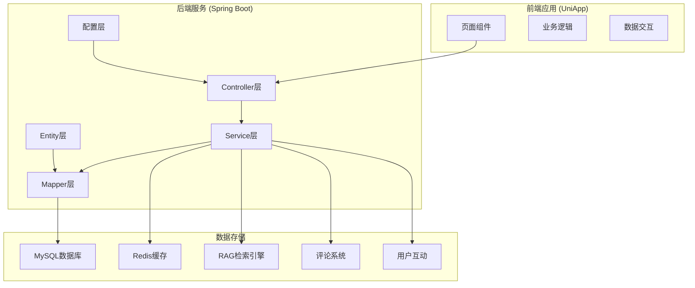

**图表来源**
- [BlogController.java:35-39](file://springboot-travel-social/src/main/java/com/cxx/controller/BlogController.java#L35-L39)
- [BlogServiceImpl.java:35-36](file://springboot-travel-social/src/main/java/com/cxx/service/impl/BlogServiceImpl.java#L35-L36)
- [BlogMapper.java:18-19](file://springboot-travel-social/src/main/java/com/cxx/mapper/BlogMapper.java#L18-L19)

**章节来源**
- [BlogController.java:1-219](file://springboot-travel-social/src/main/java/com/cxx/controller/BlogController.java#L1-L219)
- [BlogService.java:1-39](file://springboot-travel-social/src/main/java/com/cxx/service/BlogService.java#L1-L39)
- [BlogServiceImpl.java:1-264](file://springboot-travel-social/src/main/java/com/cxx/service/impl/BlogServiceImpl.java#L1-L264)

## 核心组件

### 数据模型设计

博客系统采用三层架构的数据模型：

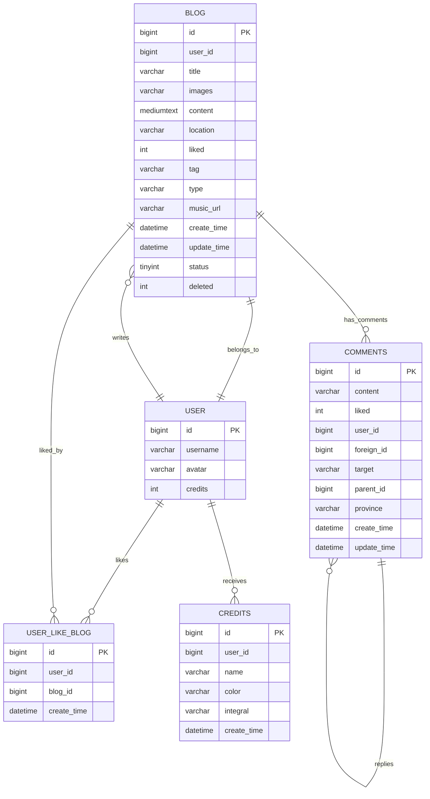

**图表来源**
- [Blog.java:29-135](file://springboot-travel-social/src/main/java/com/cxx/entity/Blog.java#L29-L135)
- [UserLikeBlog.java:21-40](file://springboot-travel-social/src/main/java/com/cxx/entity/UserLikeBlog.java#L21-L40)
- [Credits.java:19-30](file://springboot-travel-social/src/main/java/com/cxx/entity/Credits.java#L19-L30)
- [Comments.java:34-125](file://springboot-travel-social/src/main/java/com/cxx/entity/Comments.java#L34-L125)

### 核心业务流程

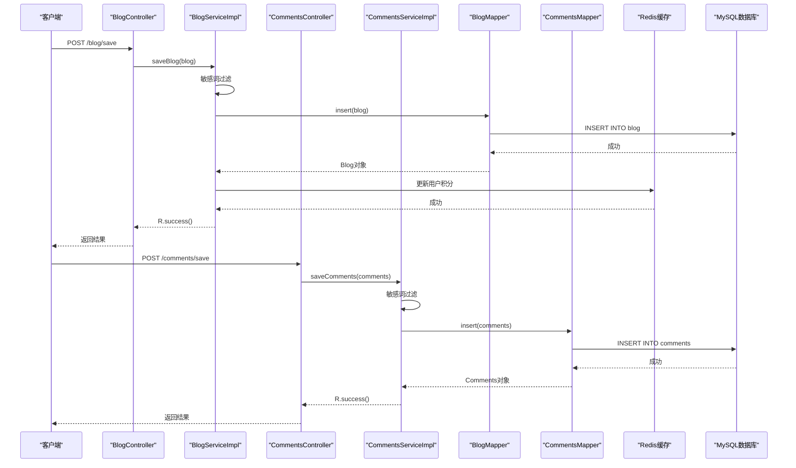

**图表来源**
- [BlogController.java:117-122](file://springboot-travel-social/src/main/java/com/cxx/controller/BlogController.java#L117-L122)
- [BlogServiceImpl.java:144-174](file://springboot-travel-social/src/main/java/com/cxx/service/impl/BlogServiceImpl.java#L144-L174)
- [CommentsController.java:28-32](file://springboot-travel-social/src/main/java/com/cxx/controller/CommentsController.java#L28-L32)
- [CommentsServiceImpl.java:50-69](file://springboot-travel-social/src/main/java/com/cxx/service/impl/CommentsServiceImpl.java#L50-L69)

**章节来源**
- [Blog.java:1-135](file://springboot-travel-social/src/main/java/com/cxx/entity/Blog.java#L1-L135)
- [BlogMapper.java:1-46](file://springboot-travel-social/src/main/java/com/cxx/mapper/BlogMapper.java#L1-L46)
- [BlogServiceImpl.java:144-174](file://springboot-travel-social/src/main/java/com/cxx/service/impl/BlogServiceImpl.java#L144-L174)
- [Comments.java:1-125](file://springboot-travel-social/src/main/java/com/cxx/entity/Comments.java#L1-L125)
- [CommentsServiceImpl.java:50-69](file://springboot-travel-social/src/main/java/com/cxx/service/impl/CommentsServiceImpl.java#L50-L69)

## 架构概览

### 技术栈架构

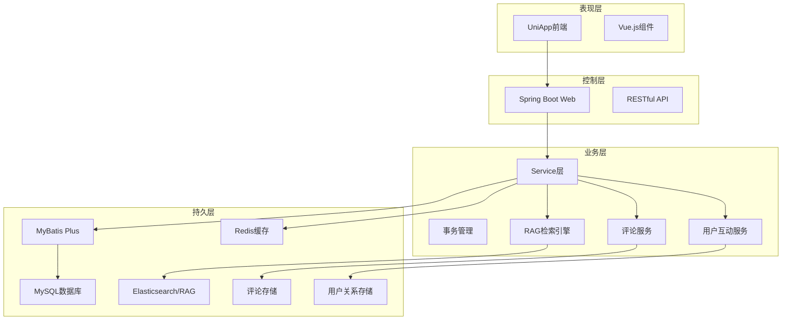

**图表来源**
- [pom.xml:16-182](file://springboot-travel-social/pom.xml#L16-L182)
- [application.properties:1-64](file://springboot-travel-social/src/main/resources/application.properties#L1-L64)

### 缓存策略

系统采用多层缓存策略提升性能：

| 缓存类型 | 键模式 | 过期时间 | 用途 |
|---------|--------|----------|------|
| 点赞集合 | blog:liked:{blogId} | 永久 | 存储点赞用户ID集合 |
| 浏览计数 | blog:browse:{blogId} | 永久 | 统计文章浏览次数 |
| 用户积分 | user:credits:{userId} | 永久 | 存储用户积分余额 |
| 评论点赞 | blogComment:liked:{commentId} | 永久 | 存储评论点赞用户集合 |
| RAG检索缓存 | rag:search:{keywords} | 300秒 | 缓存RAG检索结果 |
| 用户关注 | user:follow:{userId} | 永久 | 存储用户关注关系 |

**章节来源**
- [RedisConstants.java:25-26](file://springboot-travel-social/src/main/java/com/cxx/utils/RedisConstants.java#L25-L26)
- [BlogServiceImpl.java:85-94](file://springboot-travel-social/src/main/java/com/cxx/service/impl/BlogServiceImpl.java#L85-L94)
- [CommentsServiceImpl.java:125-151](file://springboot-travel-social/src/main/java/com/cxx/service/impl/CommentsServiceImpl.java#L125-L151)

## 详细组件分析

### 控制器层

BlogController和CommentsController负责处理所有博客和评论相关的HTTP请求：

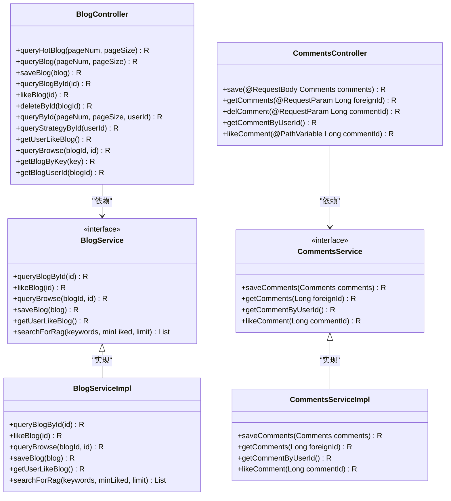

**图表来源**
- [BlogController.java:39-195](file://springboot-travel-social/src/main/java/com/cxx/controller/BlogController.java#L39-L195)
- [CommentsController.java:21-66](file://springboot-travel-social/src/main/java/com/cxx/controller/CommentsController.java#L21-L66)
- [BlogService.java:18-38](file://springboot-travel-social/src/main/java/com/cxx/service/BlogService.java#L18-L38)
- [CommentsService.java:17-26](file://springboot-travel-social/src/main/java/com/cxx/service/CommentsService.java#L17-L26)
- [BlogServiceImpl.java:36-263](file://springboot-travel-social/src/main/java/com/cxx/service/impl/BlogServiceImpl.java#L36-L263)
- [CommentsServiceImpl.java:37-154](file://springboot-travel-social/src/main/java/com/cxx/service/impl/CommentsServiceImpl.java#L37-L154)

### 服务层实现

#### 点赞功能流程

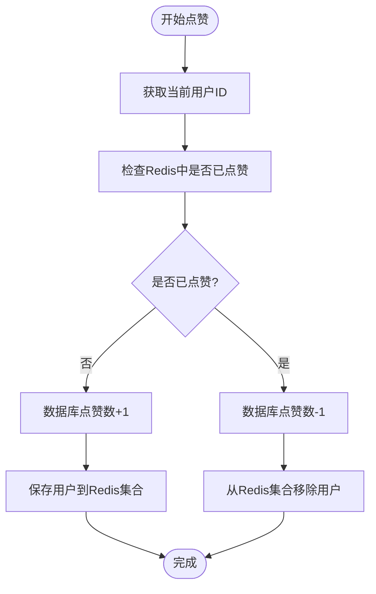

**图表来源**
- [BlogServiceImpl.java:81-111](file://springboot-travel-social/src/main/java/com/cxx/service/impl/BlogServiceImpl.java#L81-L111)

#### 评论系统功能流程

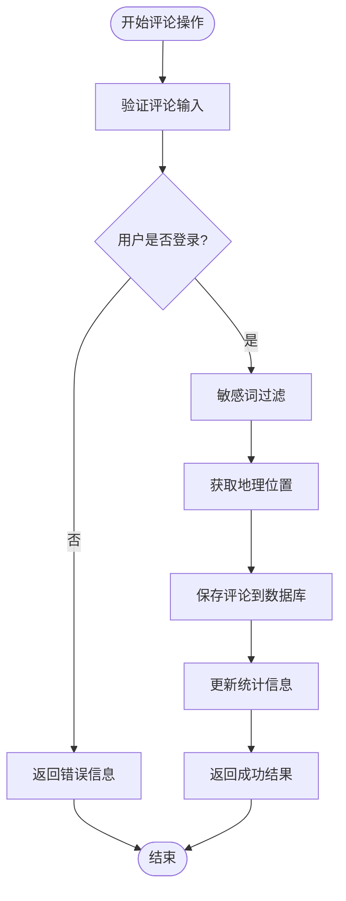

**图表来源**
- [CommentsServiceImpl.java:50-69](file://springboot-travel-social/src/main/java/com/cxx/service/impl/CommentsServiceImpl.java#L50-L69)

#### 敏感词过滤机制

系统实现了多层次的敏感词过滤：

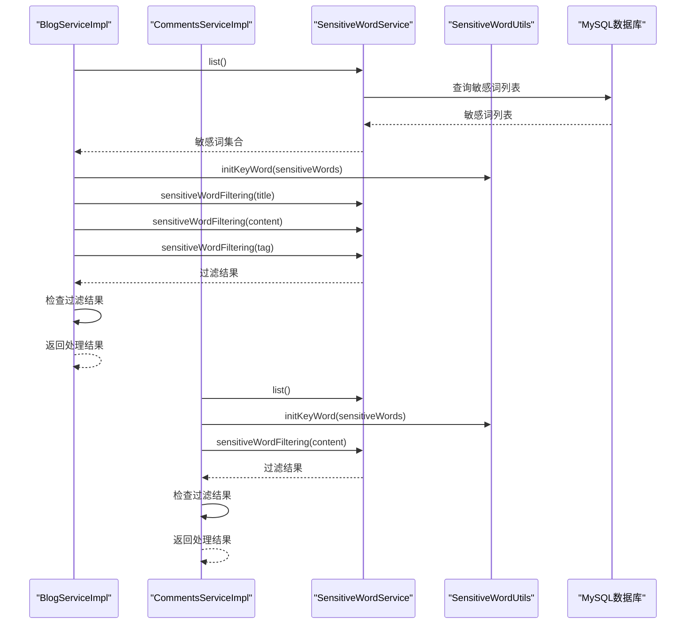

**图表来源**
- [BlogServiceImpl.java:149-162](file://springboot-travel-social/src/main/java/com/cxx/service/impl/BlogServiceImpl.java#L149-L162)
- [CommentsServiceImpl.java:50-57](file://springboot-travel-social/src/main/java/com/cxx/service/impl/CommentsServiceImpl.java#L50-L57)

#### RAG检索功能

新增的RAG（Retrieval-Augmented Generation）检索功能提供了智能内容检索能力：

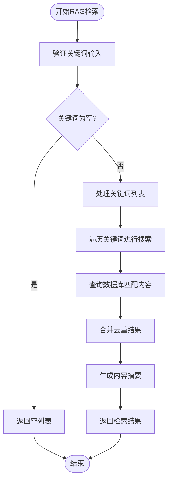

**图表来源**
- [BlogServiceImpl.java:202-262](file://springboot-travel-social/src/main/java/com/cxx/service/impl/BlogServiceImpl.java#L202-L262)

**章节来源**
- [BlogController.java:48-195](file://springboot-travel-social/src/main/java/com/cxx/controller/BlogController.java#L48-L195)
- [CommentsController.java:28-66](file://springboot-travel-social/src/main/java/com/cxx/controller/CommentsController.java#L28-L66)
- [BlogServiceImpl.java:55-263](file://springboot-travel-social/src/main/java/com/cxx/service/impl/BlogServiceImpl.java#L55-L263)
- [CommentsServiceImpl.java:50-154](file://springboot-travel-social/src/main/java/com/cxx/service/impl/CommentsServiceImpl.java#L50-L154)

### 数据访问层

BlogMapper和CommentsMapper采用了MyBatis Plus的注解式开发：

#### 核心查询方法

| 方法名 | 功能描述 | SQL语句 |
|-------|----------|---------|
| getLikedCount | 统计用户总点赞数 | SELECT IFNULL(sum(liked),0) FROM blog WHERE user_id = #{userId} and deleted=0 |
| getFriendsList | 获取好友游记列表 | SELECT * FROM blog WHERE user_id = #{userId} and deleted=0 and type='游记' |
| getBlogsRecommend | 随机推荐游记 | SELECT * FROM blog WHERE type='游记' and deleted=0 ORDER BY rand() LIMIT #{count} |
| searchByKeyword | 关键词搜索 | 多字段LIKE匹配，按点赞数排序 |
| searchForRag | RAG检索 | 多关键词组合检索，支持最低点赞数过滤 |
| getComments | 获取评论列表 | 按创建时间倒序排列，支持父子评论关联 |
| getCommentByUserId | 获取用户评论数量 | 统计用户发布的评论总数 |

**章节来源**
- [BlogMapper.java:18-45](file://springboot-travel-social/src/main/java/com/cxx/mapper/BlogMapper.java#L18-L45)
- [BlogMapper.xml:4-7](file://springboot-travel-social/src/main/resources/com/cxx/mapper/BlogMapper.xml#L4-L7)
- [CommentsMapper.java:14-16](file://springboot-travel-social/src/main/java/com/cxx/mapper/CommentsMapper.java#L14-L16)

### 前端交互层

#### 圆圈页面布局

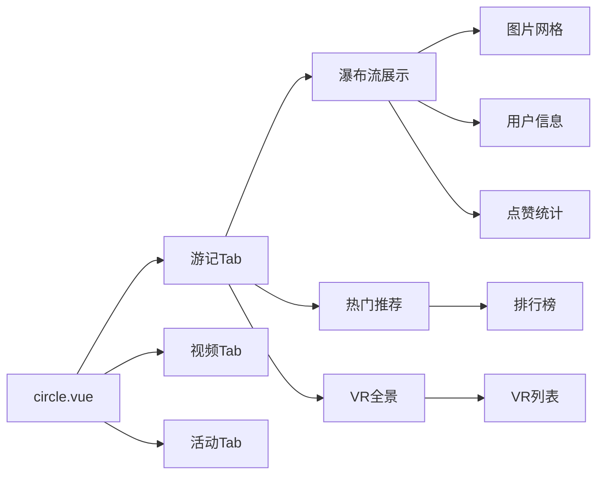

**图表来源**
- [circle.vue:1-800](file://uniapp-travel-social/pages/circle/circle.vue#L1-L800)

#### 发布页面功能

前端提供了完整的游记发布界面：

| 功能模块 | 组件名称 | 描述 |
|---------|----------|------|
| 标题输入 | 输入框 | 游记标题输入，限制30字符 |
| 内容编辑 | 文本域 | 游记内容编辑，限制1000字符 |
| 图片上传 | ImageUpload | 支持多图上传，最多15张 |
| 地点选择 | LocationPicker | 选择拍摄地点 |
| 背景音乐 | MusicSelector | 选择背景音乐 |
| 标签系统 | TagInput | 添加标签，最多5个 |

#### 评论系统前端功能

前端支持完整的评论交互功能：

| 功能模块 | 组件名称 | 描述 |
|---------|----------|------|
| 评论列表 | CommentList | 展示根评论和子评论 |
| 评论输入 | CommentInput | 发布新评论，支持@回复 |
| 评论点赞 | LikeButton | 点赞/取消点赞评论 |
| 用户头像 | Avatar | 显示评论用户头像 |
| 时间显示 | TimeDisplay | 显示评论发布时间 |
| 地理位置 | LocationDisplay | 显示评论发布地点 |

#### 博客详情页面功能

前端支持完整的博客详情展示：

| 功能模块 | 组件名称 | 描述 |
|---------|----------|------|
| 图片轮播 | Swiper | 展示游记图片，支持自动播放 |
| 用户信息 | UserInfo | 显示作者头像和用户名 |
| 标签展示 | TagList | 显示游记标签 |
| 内容解析 | Parse | 解析HTML内容并渲染 |
| 评论列表 | CommentList | 展示评论和回复 |
| 举报功能 | ReportPopup | 支持举报不当评论 |
| 删除功能 | DeleteModal | 支持删除自己的评论 |

**章节来源**
- [edit.vue:1-600](file://uniapp-travel-social/circlePages/edit.vue#L1-L600)
- [create.vue:1-498](file://uniapp-travel-social/circlePages/create.vue#L1-L498)
- [blog.vue:469-520](file://uniapp-travel-social/myPages/blog/blog.vue#L469-L520)

## 依赖关系分析

### 核心依赖关系

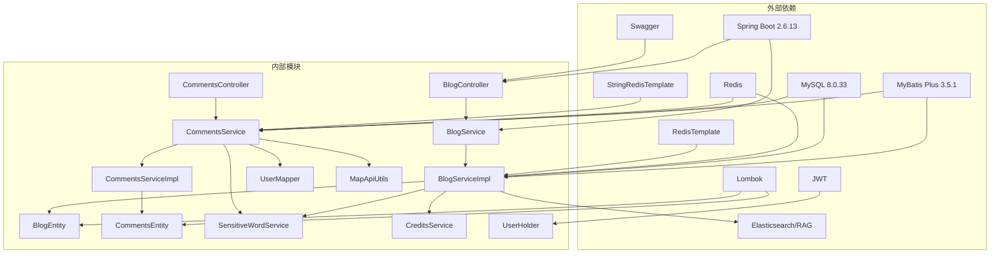

**图表来源**
- [pom.xml:16-182](file://springboot-travel-social/pom.xml#L16-L182)

### 数据库设计

系统采用规范化的数据库设计：

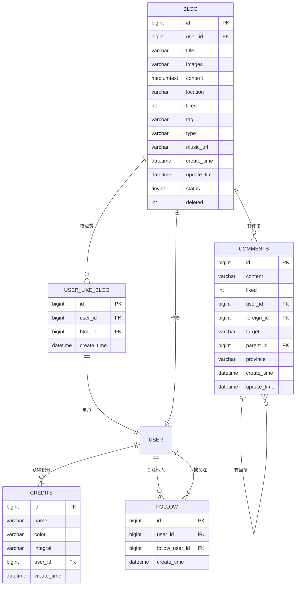

**图表来源**
- [travel_socical.sql:180-196](file://travel_socical.sql#L180-L196)
- [travel_socical.sql:1500-1596](file://travel_socical.sql#L1500-L1596)

**章节来源**
- [pom.xml:1-200](file://springboot-travel-social/pom.xml#L1-L200)
- [travel_socical.sql:1-200](file://travel_socical.sql#L1-L200)

## 性能考虑

### 缓存优化策略

1. **热点数据缓存**
   - 热门游记列表缓存
   - 用户积分信息缓存
   - 敏感词列表缓存
   - 评论点赞集合缓存
   - RAG检索结果缓存
   - 用户关注关系缓存

2. **读写分离**
   - 点赞操作使用Redis集合
   - 浏览统计使用Redis计数器
   - 数据库主要用于持久化
   - 评论操作使用Redis集合存储点赞用户

3. **分页查询优化**
   - 使用MyBatis Plus分页插件
   - 合理设置分页参数
   - 避免N+1查询问题
   - 评论列表按时间倒序优化

4. **RAG检索优化**
   - 关键词预处理和去重
   - 最小点赞数阈值过滤
   - 结果集大小限制
   - 摘要内容截断优化

5. **评论系统优化**
   - 评论点赞使用Redis集合
   - 支持父子评论的递归查询
   - 评论内容地理位置缓存
   - 评论统计信息缓存

### 数据库优化

1. **索引设计**
   - user_id字段建立索引
   - type字段建立索引
   - create_time字段建立索引
   - 标签字段建立全文索引
   - RAG检索字段建立复合索引
   - 评论foreign_id字段建立索引
   - 评论parent_id字段建立索引

2. **查询优化**
   - 使用LIMIT限制返回数量
   - 避免SELECT *
   - 合理使用WHERE条件
   - RAG检索使用OR条件优化
   - 评论查询使用JOIN优化

## 故障排除指南

### 常见问题及解决方案

#### 1. 点赞功能异常

**问题现象**：用户无法点赞或点赞数不更新

**排查步骤**：
1. 检查Redis连接状态
2. 验证Redis键值对是否存在
3. 查看数据库连接日志
4. 检查事务是否正常提交

**解决方案**：
```java
// 检查Redis连接
stringRedisTemplate.hasKey("blog:liked:" + blogId);

// 验证用户是否已点赞
Boolean isMember = stringRedisTemplate.opsForSet().isMember(
    "blog:liked:" + blogId, 
    userId.toString()
);
```

#### 2. 评论功能异常

**问题现象**：用户无法发布评论或评论显示异常

**排查步骤**：
1. 检查用户登录状态
2. 验证敏感词过滤逻辑
3. 检查地理位置获取
4. 查看数据库连接日志

**解决方案**：
```java
// 检查用户登录状态
Long userId = UserHolder.getUser().getId();

// 验证敏感词过滤
Set<String> sensitiveWord = sensitiveWordService.sensitiveWordFiltering(comments.getContent());

// 获取地理位置
String province = mapApiUtils.getLocation(comments.getLongitude(), comments.getLatitude());
```

#### 3. 敏感词过滤误判

**问题现象**：正常内容被标记为敏感词

**排查步骤**：
1. 检查敏感词库完整性
2. 验证敏感词过滤算法
3. 查看过滤日志

**解决方案**：
```java
// 初始化敏感词库
SensitiveWordUtils.initKeyWord(sensitiveWords);

// 执行敏感词过滤
Set<String> filteredContent = sensitiveWordService.sensitiveWordFiltering(content);
```

#### 4. RAG检索性能问题

**问题现象**：RAG检索响应缓慢

**排查步骤**：
1. 检查数据库索引是否有效
2. 验证关键词处理逻辑
3. 查看查询执行计划

**解决方案**：
```java
// 优化RAG检索
if (keywords == null || keywords.isEmpty()) {
    return Collections.emptyList();
}

// 使用最小点赞数过滤减少结果集
List<Blog> hits = blogMapper.searchByKeyword(kw.trim(), minLiked, limit);

// 实现结果去重和排序
Map<Long, Blog> resultMap = new LinkedHashMap<>();
for (String kw : keywords) {
    // ...
}
```

#### 5. 图片上传失败

**问题现象**：游记图片无法上传

**排查步骤**：
1. 检查OSS配置
2. 验证网络连接
3. 查看上传权限

**解决方案**：
```java
// 配置阿里云OSS
AliOSSUtils ossUtils = new AliOSSUtils();
String imageUrl = ossUtils.upload(file, folder);
```

**章节来源**
- [BlogServiceImpl.java:81-111](file://springboot-travel-social/src/main/java/com/cxx/service/impl/BlogServiceImpl.java#L81-L111)
- [CommentsServiceImpl.java:50-69](file://springboot-travel-social/src/main/java/com/cxx/service/impl/CommentsServiceImpl.java#L50-L69)
- [BlogServiceImpl.java:149-162](file://springboot-travel-social/src/main/java/com/cxx/service/impl/BlogServiceImpl.java#L149-L162)
- [CommentsServiceImpl.java:125-151](file://springboot-travel-social/src/main/java/com/cxx/service/impl/CommentsServiceImpl.java#L125-L151)
- [BlogServiceImpl.java:202-262](file://springboot-travel-social/src/main/java/com/cxx/service/impl/BlogServiceImpl.java#L202-L262)

## 结论

博客服务系统通过合理的架构设计和技术选型，实现了功能完整、性能优良的游记分享平台。系统具备以下优势：

1. **技术架构先进**：采用Spring Boot + Vue.js的现代化技术栈
2. **功能模块完整**：支持游记发布、评论互动、用户关注等完整社交功能
3. **性能优化到位**：多层缓存策略确保高并发场景下的稳定性
4. **用户体验良好**：简洁直观的界面设计和流畅的操作体验
5. **扩展性强**：模块化设计便于功能扩展和维护
6. **智能化检索**：新增RAG检索功能提供智能内容发现能力
7. **互动功能丰富**：评论系统、点赞、关注等完整的用户互动机制

系统在敏感词过滤、积分奖励、内容推荐、RAG检索、评论管理等方面展现了良好的业务逻辑实现，为用户提供了完整的游记分享和社交互动体验。通过持续的性能优化和功能迭代，博客服务将继续为用户提供优质的旅游攻略分享平台。

**更新** 本次更新完善了博客管理功能，新增了用户查询自己游记和攻略的功能，增强了RAG检索功能的搜索算法和结果处理，优化了前端交互层的支持，使文档内容更加全面和准确。