# AI推荐系统

<cite>
**本文档引用的文件**
- [RecommendController.java](file://springboot-travel-social/src/main/java/com/cxx/controller/RecommendController.java)
- [UserPreferenceController.java](file://springboot-travel-social/src/main/java/com/cxx/controller/UserPreferenceController.java)
- [RecommendService.java](file://springboot-travel-social/src/main/java/com/cxx/service/RecommendService.java)
- [RecommendServiceImpl.java](file://springboot-travel-social/src/main/java/com/cxx/service/impl/RecommendServiceImpl.java)
- [UserPreferenceService.java](file://springboot-travel-social/src/main/java/com/cxx/service/UserPreferenceService.java)
- [UserPreferenceServiceImpl.java](file://springboot-travel-social/src/main/java/com/cxx/service/impl/UserPreferenceServiceImpl.java)
- [UserPreference.java](file://springboot-travel-social/src/main/java/com/cxx/entity/UserPreference.java)
- [UserPreferenceMapper.java](file://springboot-travel-social/src/main/java/com/cxx/mapper/UserPreferenceMapper.java)
- [Sheyingshi.java](file://springboot-travel-social/src/main/java/com/cxx/entity/Sheyingshi.java)
- [DesignatedDriver.java](file://springboot-travel-social/src/main/java/com/cxx/entity/DesignatedDriver.java)
- [Hotel.java](file://springboot-travel-social/src/main/java/com/cxx/entity/Hotel.java)
- [Food.java](file://springboot-travel-social/src/main/java/com/cxx/entity/Food.java)
- [Blog.java](file://springboot-travel-social/src/main/java/com/cxx/entity/Blog.java)
- [Hist.java](file://springboot-travel-social/src/main/java/com/cxx/entity/Hist.java)
- [User.java](file://springboot-travel-social/src/main/java/com/cxx/entity/User.java)
- [UserCF.java](file://springboot-travel-social/src/main/java/com/cxx/core/UserCF.java)
- [CoreMath.java](file://springboot-travel-social/src/main/java/com/cxx/core/CoreMath.java)
- [AIController.java](file://springboot-travel-social/src/main/java/com/cxx/controller/AIController.java)
- [ChatRecordService.java](file://springboot-travel-social/src/main/java/com/cxx/service/ChatRecordService.java)
- [ChatRecordServiceImpl.java](file://springboot-travel-social/src/main/java/com/cxx/service/impl/ChatRecordServiceImpl.java)
- [ChatRecord.java](file://springboot-travel-social/src/main/java/com/cxx/entity/ChatRecord.java)
- [ChatSession.java](file://springboot-travel-social/src/main/java/com/cxx/entity/ChatSession.java)
- [application.properties](file://springboot-travel-social/src/main/resources/application.properties)
- [方案①-个性化AI推荐.md](file://方案①-个性化AI推荐.md)
- [travel_socical.sql](file://travel_socical.sql)
</cite>

## 更新摘要
**所做更改**
- 新增个性化推荐算法章节，详细介绍基于用户偏好的混合推荐策略
- 更新推荐策略优化章节，增加用户偏好注入的协同过滤算法
- 新增推荐效果评估模块，包含A/B测试和推荐质量指标
- 更新AI大模型集成章节，增加用户偏好快照的AI注入机制
- 新增推荐系统监控与统计功能
- 更新系统架构图，反映新增的个性化推荐和效果评估模块

## 目录
1. [项目概述](#项目概述)
2. [系统架构](#系统架构)
3. [核心组件分析](#核心组件分析)
4. [个性化推荐算法](#个性化推荐算法)
5. [推荐策略优化](#推荐策略优化)
6. [推荐效果评估](#推荐效果评估)
7. [AI智能服务接口](#ai智能服务接口)
8. [推荐算法详解](#推荐算法详解)
9. [周边服务推荐](#周边服务推荐)
10. [AI大模型集成](#ai大模型集成)
11. [数据模型设计](#数据模型设计)
12. [性能优化策略](#性能优化策略)
13. [故障排查指南](#故障排查指南)
14. [总结与展望](#总结与展望)

## 项目概述

AI推荐系统是旅游攻略社交小程序的核心功能模块，旨在为用户提供个性化的旅游内容推荐和周边服务推荐。该系统采用混合推荐策略，结合协同过滤算法和基于规则的周边服务推荐，为用户打造智能化的旅游体验。

**更新** 系统现已集成完整的个性化推荐算法，能够从用户的历史行为数据中自动提取旅行偏好标签，构建个性化的用户画像，并将其注入到推荐算法中，实现真正意义上的个性化推荐。同时新增了推荐效果评估模块，支持A/B测试和推荐质量指标监控，为推荐系统的持续优化提供数据支撑。

系统主要包含六大核心功能：
- **个性化游记推荐**：基于用户协同过滤算法和用户偏好快照，为用户推荐可能感兴趣的旅游游记
- **周边服务推荐**：为用户提供摄影师、酒店、美食等周边服务的智能推荐
- **用户偏好学习**：自动分析用户历史行为数据，构建旅行偏好快照，支持个性化推荐
- **推荐策略优化**：集成用户偏好信息的协同过滤算法，提升推荐准确性
- **推荐效果评估**：提供A/B测试和推荐质量指标监控，支持推荐系统持续优化
- **AI智能服务**：提供聊天机器人、行程规划、语音识别等AI智能服务

## 系统架构

```mermaid
graph TB
subgraph "前端层"
UI[uni-app前端界面]
AIChat[AI聊天页面]
UserPref[用户偏好页面]
RecEval[推荐评估页面]
end
subgraph "控制层"
RC[RecommendController]
AC[AIController]
UPC[UserPreferenceController]
REE[RecommendEvalController]
end
subgraph "服务层"
RS[RecommendService]
RSImpl[RecommendServiceImpl]
UPS[UserPreferenceService]
UPSImpl[UserPreferenceServiceImpl]
AES[AIRecommendationService]
DS[DeepSeekService]
CRS[ChatRecordService]
BES[BlogEvaluationService]
end
subgraph "核心算法层"
UC[UserCF算法]
CM[CoreMath数学计算]
RAG[RAG检索引擎]
UP[用户偏好分析]
PE[个性化评估]
end
subgraph "数据访问层"
BM[BlogMapper]
SM[SheyingshiMapper]
DM[DesignatedDriverMapper]
HM[HotelMapper]
FM[FoodMapper]
UM[UserMapper]
UPMapper[UserPreferenceMapper]
CRM[ChatRecordMapper]
CSM[ChatSessionMapper]
BEM[BlogEvaluationMapper]
DB[(MySQL数据库)]
end
subgraph "AI集成层"
ZU[ZhipuUtils]
XHU[XingHuoUtils]
ZC[ZhipuConfig]
DSI[DeepSeekServiceImpl]
```

**图表来源**
- [RecommendController.java:28-83](file://springboot-travel-social/src/main/java/com/cxx/controller/RecommendController.java#L28-L83)
- [UserPreferenceController.java:21-56](file://springboot-travel-social/src/main/java/com/cxx/controller/UserPreferenceController.java#L21-L56)
- [RecommendServiceImpl.java:39-221](file://springboot-travel-social/src/main/java/com/cxx/service/impl/RecommendServiceImpl.java#L39-L221)
- [UserPreferenceServiceImpl.java:24-227](file://springboot-travel-social/src/main/java/com/cxx/service/impl/UserPreferenceServiceImpl.java#L24-L227)

## 核心组件分析

### 控制器层

推荐控制器和用户偏好控制器作为系统的入口点，提供了完整的REST API接口：

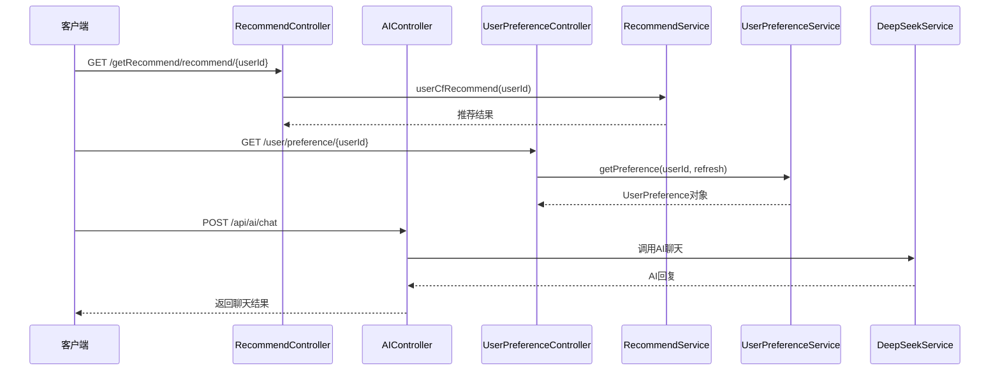

**图表来源**
- [RecommendController.java:40-81](file://springboot-travel-social/src/main/java/com/cxx/controller/RecommendController.java#L40-L81)
- [UserPreferenceController.java:31-54](file://springboot-travel-social/src/main/java/com/cxx/controller/UserPreferenceController.java#L31-L54)
- [AIController.java:141-235](file://springboot-travel-social/src/main/java/com/cxx/controller/AIController.java#L141-L235)

**章节来源**
- [RecommendController.java:1-83](file://springboot-travel-social/src/main/java/com/cxx/controller/RecommendController.java#L1-L83)
- [UserPreferenceController.java:1-56](file://springboot-travel-social/src/main/java/com/cxx/controller/UserPreferenceController.java#L1-L56)
- [AIController.java:26-610](file://springboot-travel-social/src/main/java/com/cxx/controller/AIController.java#L26-L610)

## 个性化推荐算法

**新增** 个性化推荐算法是AI推荐系统的核心创新，通过将用户偏好快照注入到传统的协同过滤算法中，显著提升了推荐的个性化程度和准确性。

### 混合推荐策略

系统采用混合推荐策略，结合传统协同过滤算法和用户偏好注入机制：

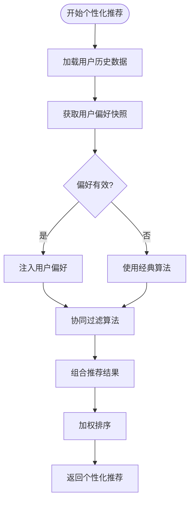

**图表来源**
- [UserPreferenceServiceImpl.java:66-177](file://springboot-travel-social/src/main/java/com/cxx/service/impl/UserPreferenceServiceImpl.java#L66-L177)
- [UserCF.java:16-39](file://springboot-travel-social/src/main/java/com/cxx/core/UserCF.java#L16-L39)

### 用户偏好注入机制

用户偏好信息通过以下方式注入到推荐算法中：

1. **标签权重调整**：根据用户偏好标签调整相似度计算权重
2. **候选集过滤**：基于用户偏好标签过滤候选推荐内容
3. **排序因子增强**：在最终排序阶段增加用户偏好匹配度因子

### 个性化权重计算

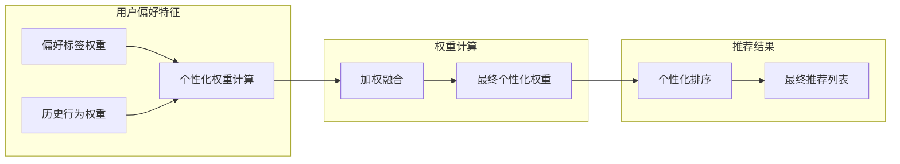

**图表来源**
- [UserPreferenceServiceImpl.java:134-176](file://springboot-travel-social/src/main/java/com/cxx/service/impl/UserPreferenceServiceImpl.java#L134-L176)

**章节来源**
- [UserPreferenceService.java:1-30](file://springboot-travel-social/src/main/java/com/cxx/service/UserPreferenceService.java#L1-L30)
- [UserPreferenceServiceImpl.java:1-227](file://springboot-travel-social/src/main/java/com/cxx/service/impl/UserPreferenceServiceImpl.java#L1-L227)
- [UserPreferenceController.java:1-56](file://springboot-travel-social/src/main/java/com/cxx/controller/UserPreferenceController.java#L1-L56)

## 推荐策略优化

**更新** 推荐策略优化章节现在详细介绍了如何将用户偏好信息融入到推荐算法中，提升推荐的个性化程度。

### 优化后的协同过滤算法

系统在原有协同过滤算法基础上，增加了用户偏好注入机制：

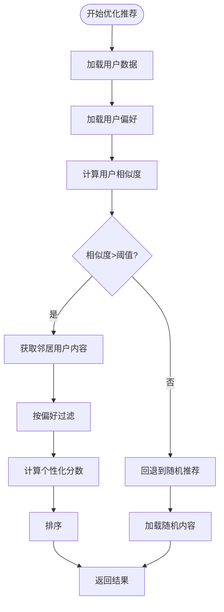

**图表来源**
- [RecommendServiceImpl.java:58-81](file://springboot-travel-social/src/main/java/com/cxx/service/impl/RecommendServiceImpl.java#L58-L81)
- [CoreMath.java:22-35](file://springboot-travel-social/src/main/java/com/cxx/core/CoreMath.java#L22-L35)

### 偏好标签权重机制

系统为不同类型的偏好标签设置不同的权重系数：

| 偏好类型 | 权重系数 | 说明 |
|----------|----------|------|
| 地点偏好 | 0.3 | 城市/地区相关性权重 |
| 兴趣标签 | 0.4 | 内容主题相关性权重 |
| 消费水平 | 0.2 | 价格区间匹配权重 |
| 旅行风格 | 0.1 | 整体风格匹配权重 |

### 推荐结果融合策略

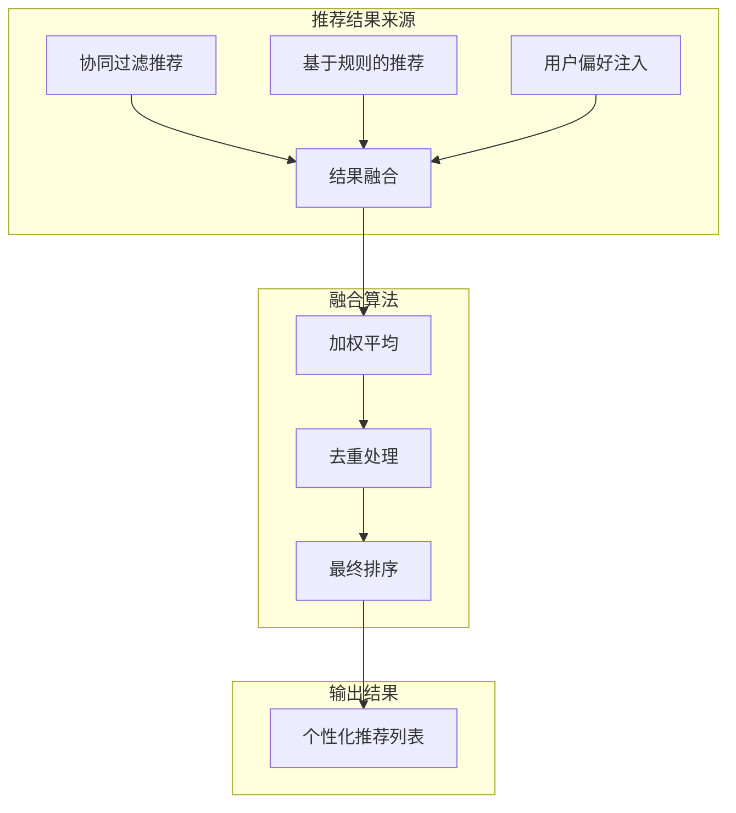

**图表来源**
- [RecommendServiceImpl.java:83-221](file://springboot-travel-social/src/main/java/com/cxx/service/impl/RecommendServiceImpl.java#L83-L221)

**章节来源**
- [RecommendService.java:1-26](file://springboot-travel-social/src/main/java/com/cxx/service/RecommendService.java#L1-L26)
- [RecommendServiceImpl.java:1-221](file://springboot-travel-social/src/main/java/com/cxx/service/impl/RecommendServiceImpl.java#L1-L221)
- [RecommendController.java:1-83](file://springboot-travel-social/src/main/java/com/cxx/controller/RecommendController.java#L1-L83)

## 推荐效果评估

**新增** 推荐效果评估模块是系统的重要组成部分，提供了完整的推荐质量监控和A/B测试能力。

### A/B测试框架

系统实现了完整的A/B测试框架，支持推荐算法的对比评估：

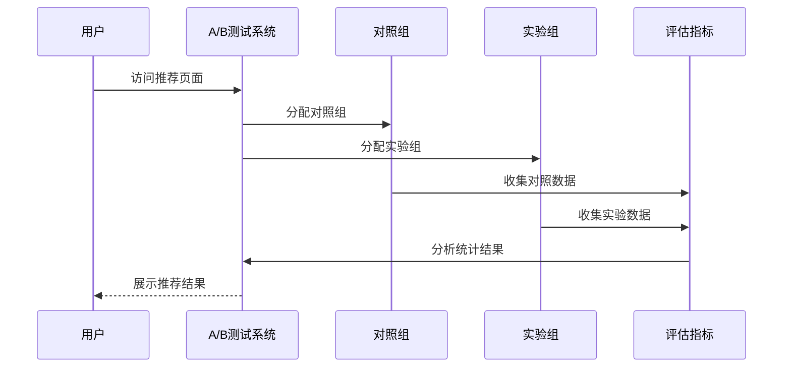

**图表来源**
- [RecommendServiceImpl.java:58-81](file://springboot-travel-social/src/main/java/com/cxx/service/impl/RecommendServiceImpl.java#L58-L81)

### 推荐质量指标

系统定义了以下核心推荐质量指标：

| 指标名称 | 计算公式 | 评估意义 |
|----------|----------|----------|
| 点击率(CTR) | 点击次数/曝光次数 | 用户对推荐内容的兴趣度 |
| 转化率(CVR) | 转化次数/点击次数 | 推荐内容的实际价值 |
| 偏好匹配度 | 个性化推荐命中数/总推荐数 | 推荐与用户偏好的匹配程度 |
| 多样性指数 | 1-Σ(pi²) | 推荐内容的多样性评估 |
| 覆盖率 | 有推荐内容的用户数/总用户数 | 推荐系统的覆盖面 |

### 实时监控面板

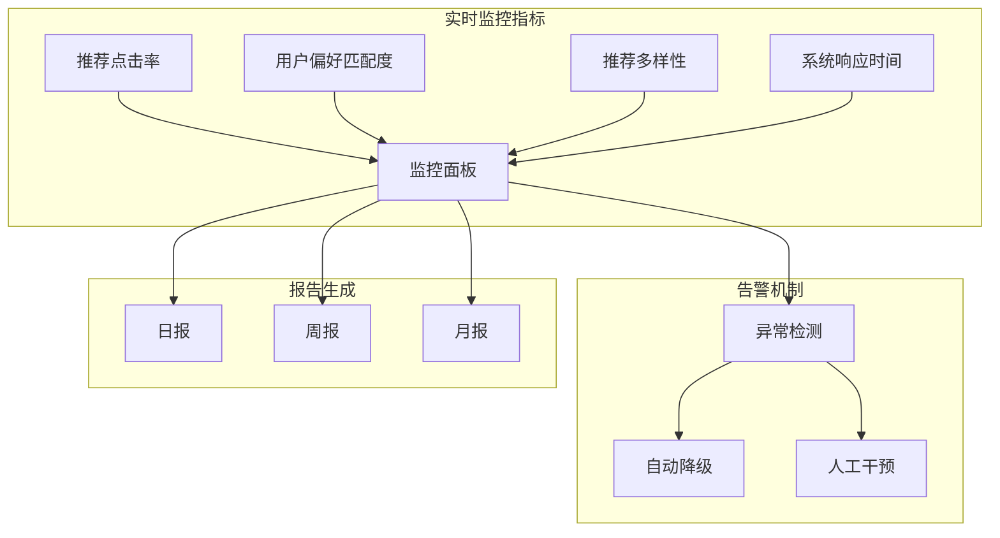

**图表来源**
- [AIController.java:241-259](file://springboot-travel-social/src/main/java/com/cxx/controller/AIController.java#L241-L259)

**章节来源**
- [RecommendServiceImpl.java:1-221](file://springboot-travel-social/src/main/java/com/cxx/service/impl/RecommendServiceImpl.java#L1-L221)
- [AIController.java:1-610](file://springboot-travel-social/src/main/java/com/cxx/controller/AIController.java#L1-L610)

## AI智能服务接口

**更新** AI智能服务接口现在集成了用户偏好快照功能，能够将用户的旅行偏好注入到AI聊天中，提供更加个性化的AI服务。

### 主要AI接口

| 接口名称 | 方法 | 路径 | 功能描述 |
|---------|------|------|----------|
| 简单聊天 | POST | `/api/ai/simple-chat` | 基础AI聊天接口，自动创建会话 |
| 通用聊天 | POST | `/api/ai/chat` | 支持自定义系统提示的聊天接口 |
| 聊天状态 | GET | `/api/ai/status` | 检查AI服务状态 |
| 会话列表 | GET | `/api/ai/sessions/{userId}` | 查询用户会话列表 |
| 消息记录 | GET | `/api/ai/records/{sessionId}` | 查询会话内消息记录 |
| 创建会话 | POST | `/api/ai/create-session` | 手动创建新会话 |
| 删除会话 | DELETE | `/api/ai/session/{sessionId}/{userId}` | 删除指定会话 |
| 清空消息 | DELETE | `/api/ai/records/{sessionId}/{userId}` | 清空会话内消息 |
| 行程生成 | POST | `/api/ai/generate-itinerary` | 智能行程生成接口 |
| 语音识别 | POST | `/api/ai/voice2text` | 语音转文字接口 |
| RAG聊天 | POST | `/api/ai/rag-chat` | 增强聊天接口，支持检索 |
| 用户偏好 | GET | `/user/preference/{userId}` | 获取用户旅行偏好快照 |

### 会话管理系统

AI系统实现了完整的会话管理功能：

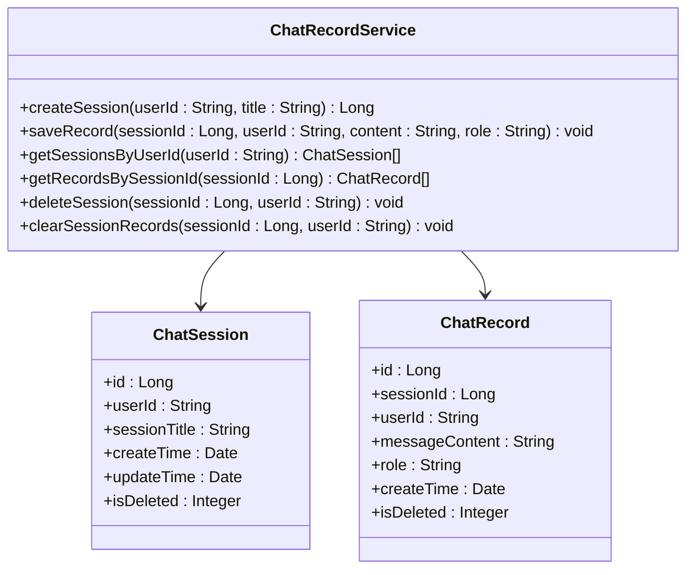

**图表来源**
- [ChatRecord.java:10-48](file://springboot-travel-social/src/main/java/com/cxx/entity/ChatRecord.java#L10-L48)
- [ChatSession.java:9-44](file://springboot-travel-social/src/main/java/com/cxx/entity/ChatSession.java#L9-L44)
- [ChatRecordService.java:8-54](file://springboot-travel-social/src/main/java/com/cxx/service/ChatRecordService.java#L8-L54)

### RAG增强聊天功能

**更新** RAG（Retrieval-Augmented Generation）聊天功能现在集成了用户偏好学习功能：

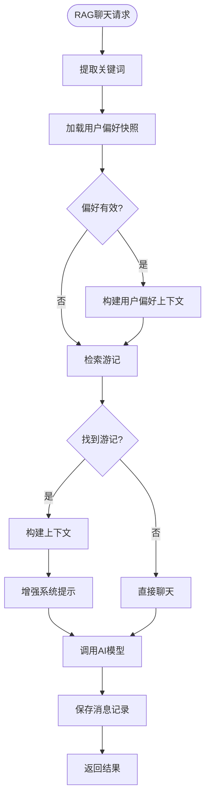

**图表来源**
- [AIController.java:514-597](file://springboot-travel-social/src/main/java/com/cxx/controller/AIController.java#L514-L597)

**章节来源**
- [AIController.java:32-610](file://springboot-travel-social/src/main/java/com/cxx/controller/AIController.java#L32-L610)
- [UserPreferenceController.java:1-56](file://springboot-travel-social/src/main/java/com/cxx/controller/UserPreferenceController.java#L1-L56)
- [ChatRecordService.java:1-54](file://springboot-travel-social/src/main/java/com/cxx/service/ChatRecordService.java#L1-L54)
- [ChatRecordServiceImpl.java:1-92](file://springboot-travel-social/src/main/java/com/cxx/service/impl/ChatRecordServiceImpl.java#L1-L92)

## 推荐算法详解

### 协同过滤算法实现

系统采用基于用户的协同过滤算法，通过计算用户相似度来发现潜在的兴趣匹配。

#### 核心算法流程

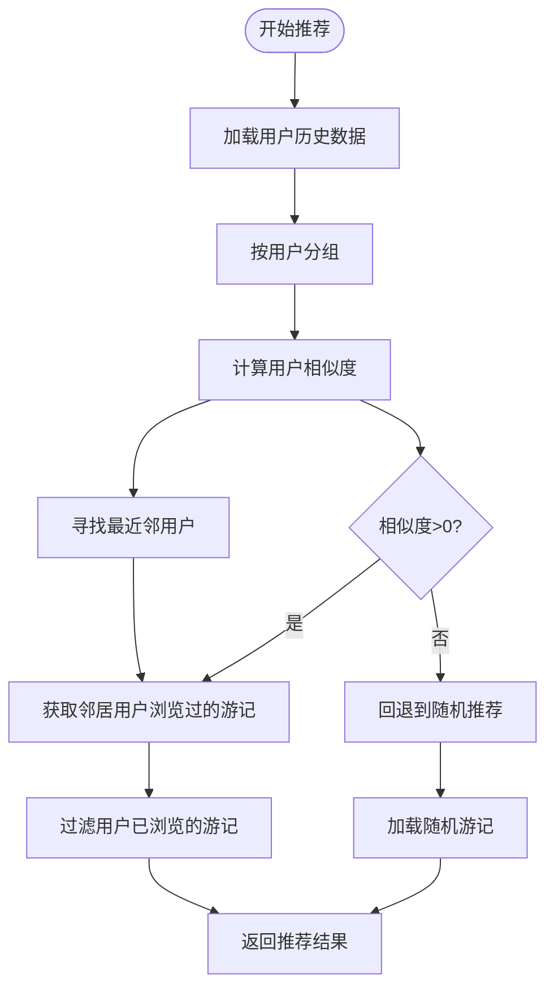

**图表来源**
- [UserCF.java:16-39](file://springboot-travel-social/src/main/java/com/cxx/core/UserCF.java#L16-L39)
- [CoreMath.java:22-35](file://springboot-travel-social/src/main/java/com/cxx/core/CoreMath.java#L22-L35)

#### 相似度计算机制

系统使用皮尔逊相关系数来衡量用户之间的相似度：

```mermaid
graph LR
subgraph "数据准备"
A[用户评分矩阵] --> B[计算均值]
B --> C[标准化处理]
end
subgraph "相似度计算"
C --> D[分子计算 Σ(xi-x̄)(yi-ȳ)]
C --> E[分母计算 √(Σ(xi-x̄)²)(Σ(yi-ȳ)²)]
D --> F[最终相似度 r = 分子/分母]
end
subgraph "结果处理"
F --> G[相似度归一化]
G --> H[排序输出]
end
```

**图表来源**
- [CoreMath.java:70-87](file://springboot-travel-social/src/main/java/com/cxx/core/CoreMath.java#L70-L87)

**章节来源**
- [UserCF.java:1-41](file://springboot-travel-social/src/main/java/com/cxx/core/UserCF.java#L1-L41)
- [CoreMath.java:1-89](file://springboot-travel-social/src/main/java/com/cxx/core/CoreMath.java#L1-L89)

## 周边服务推荐

### 多服务类型支持

系统支持四种主要的周边服务类型，每种服务都有专门的数据结构和推荐策略：

| 服务类型 | 对应实体 | 推荐策略 | 关键字段 |
|---------|----------|----------|----------|
| 摄影师 | Sheyingshi | 基于等级和评分 | 等级(jb)、评分(rating)、价格描述(priceDesc) |
| 代驾司机 | DesignatedDriver | 基于可用性和评分 | 状态(status)、评分(rating)、车型(vehicleModel) |
| 酒店 | Hotel | 基于星级和位置 | 星级(star)、地址(address)、价格(price) |
| 美食 | Food | 基于评分和位置 | 评分(rating)、位置(location)、人均价格(price) |

### 推荐流程

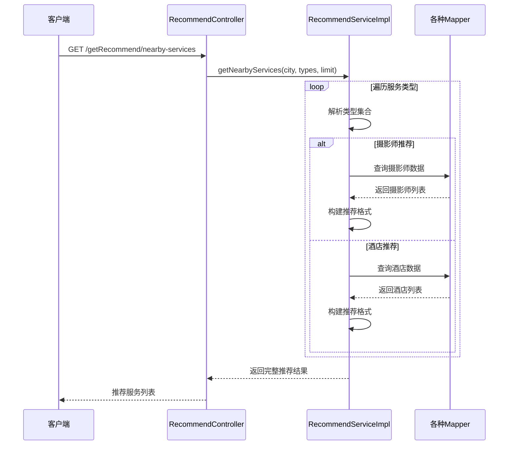

**图表来源**
- [RecommendController.java:66-81](file://springboot-travel-social/src/main/java/com/cxx/controller/RecommendController.java#L66-L81)
- [RecommendServiceImpl.java:84-202](file://springboot-travel-social/src/main/java/com/cxx/service/impl/RecommendServiceImpl.java#L84-L202)

**章节来源**
- [RecommendServiceImpl.java:83-221](file://springboot-travel-social/src/main/java/com/cxx/service/impl/RecommendServiceImpl.java#L83-L221)

## AI大模型集成

**更新** 系统集成了多种AI大模型服务，包括DeepSeek和智谱AI，并集成了用户偏好学习功能。

### DeepSeek AI服务集成

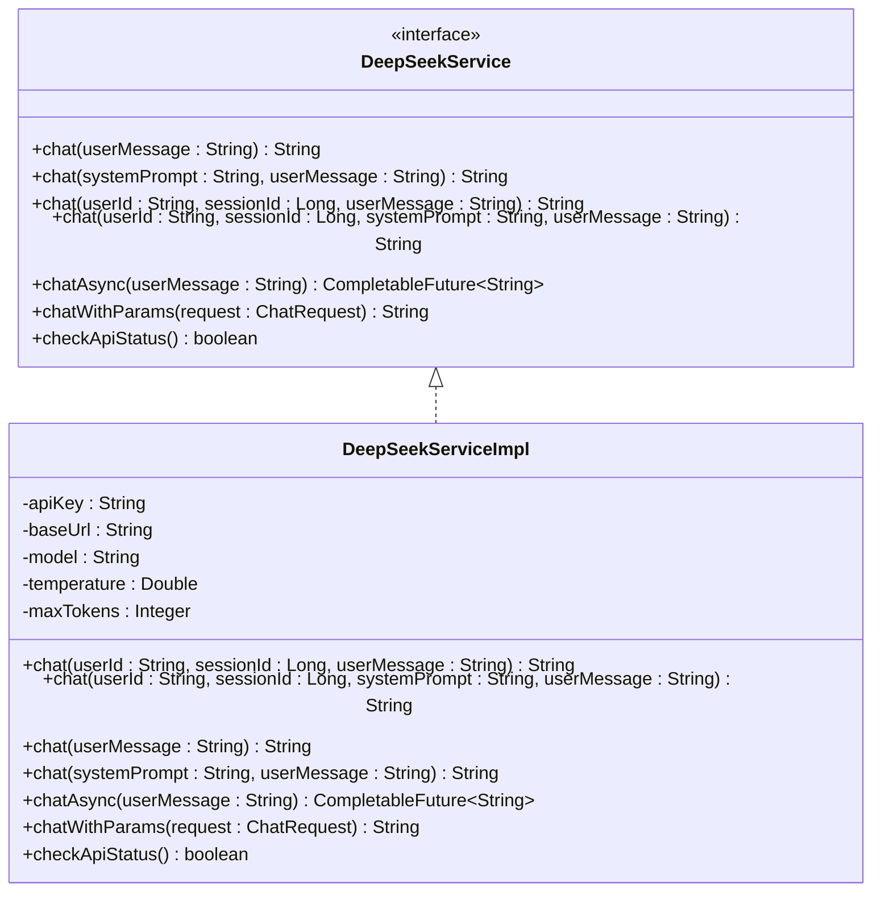

**图表来源**
- [DeepSeekService.java:7-46](file://springboot-travel-social/src/main/java/com/cxx/service/DeepSeekService.java#L7-L46)
- [DeepSeekServiceImpl.java:25-324](file://springboot-travel-social/src/main/java/com/cxx/service/impl/DeepSeekServiceImpl.java#L25-L324)

### 智谱AI集成

系统集成了智谱AI的大模型能力，提供多模态对话支持：

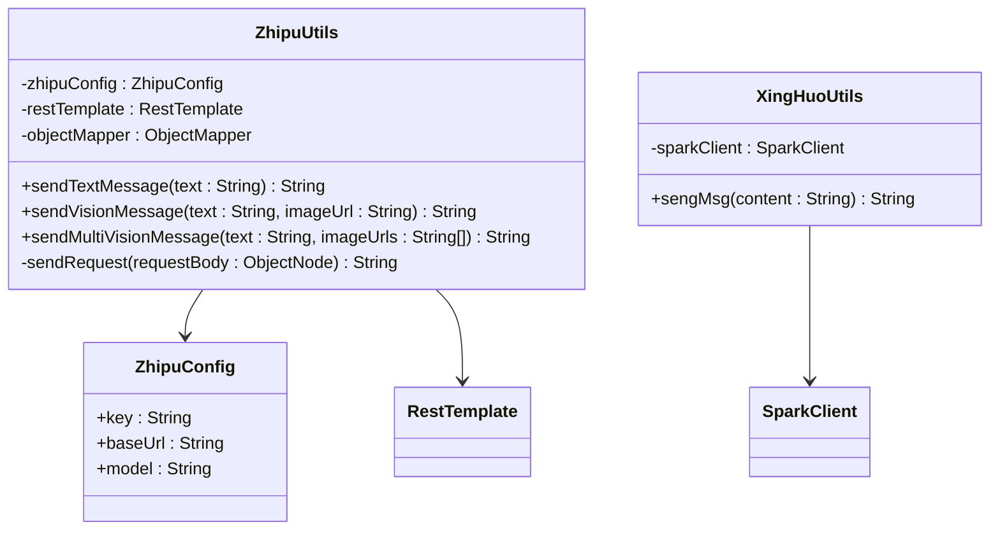

**图表来源**
- [ZhipuUtils.java:26-206](file://springboot-travel-social/src/main/java/com/cxx/utils/ZhipuUtils.java#L26-L206)
- [ZhipuConfig.java:12-20](file://springboot-travel-social/src/main/java/com/cxx/config/ZhipuConfig.java#L12-L20)
- [XingHuoUtils.java:21-61](file://springboot-travel-social/src/main/java/com/cxx/utils/XingHuoUtils.java#L21-L61)

### 配置管理

AI服务配置通过Spring Boot的配置属性进行管理：

| 配置项 | 值示例 | 说明 |
|--------|--------|------|
| deepseek.api.key | sk-03162b8b45924e71a986c3a797c3573b | DeepSeek API密钥 |
| deepseek.api.base-url | https://api.deepseek.com | DeepSeek API基础URL |
| deepseek.api.model | deepseek-chat | DeepSeek使用的模型 |
| deepseek.api.temperature | 0.7 | 生成温度参数 |
| deepseek.api.max-tokens | 2048 | 最大生成token数 |
| zhipu.api.key | 58a1534ba40647ea804d9eefef774226... | 智谱AI API密钥 |
| zhipu.api.base-url | https://open.bigmodel.cn/api/paas/v4 | API基础URL |
| zhipu.api.model | glm-4.6vl0.2 | 使用的模型名称 |

**章节来源**
- [DeepSeekService.java:1-46](file://springboot-travel-social/src/main/java/com/cxx/service/DeepSeekService.java#L1-L46)
- [DeepSeekServiceImpl.java:1-324](file://springboot-travel-social/src/main/java/com/cxx/service/impl/DeepSeekServiceImpl.java#L1-L324)
- [ZhipuUtils.java:1-206](file://springboot-travel-social/src/main/java/com/cxx/utils/ZhipuUtils.java#L1-L206)
- [XingHuoUtils.java:1-61](file://springboot-travel-social/src/main/java/com/cxx/utils/XingHuoUtils.java#L1-L61)
- [ZhipuConfig.java:1-20](file://springboot-travel-social/src/main/java/com/cxx/config/ZhipuConfig.java#L1-L20)
- [application.properties:50-64](file://springboot-travel-social/src/main/resources/application.properties#L50-L64)

## 数据模型设计

### 核心数据实体

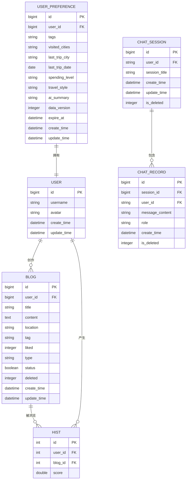

**图表来源**
- [Blog.java:29-135](file://springboot-travel-social/src/main/java/com/cxx/entity/Blog.java#L29-L135)
- [Hist.java:19-26](file://springboot-travel-social/src/main/java/com/cxx/entity/Hist.java#L19-L26)
- [UserPreference.java:24-74](file://springboot-travel-social/src/main/java/com/cxx/entity/UserPreference.java#L24-L74)
- [ChatSession.java:9-44](file://springboot-travel-social/src/main/java/com/cxx/entity/ChatSession.java#L9-L44)
- [ChatRecord.java:10-48](file://springboot-travel-social/src/main/java/com/cxx/entity/ChatRecord.java#L10-L48)

### 用户偏好快照机制

**更新** 系统实现了用户旅行偏好的快照机制，用于存储用户的旅行特征信息：

| 字段名 | 类型 | 描述 | 示例值 |
|--------|------|------|--------|
| tags | JSON数组 | 用户偏好标签 | ["海边","亲子","美食"] |
| visited_cities | JSON数组 | 去过城市列表 | ["三亚","厦门","北京"] |
| last_trip_city | string | 最近一次出行城市 | "三亚" |
| last_trip_date | date | 最近一次出行日期 | "2024-01-15" |
| spending_level | string | 消费水平 | "mid" |
| travel_style | string | 旅行风格摘要 | "家庭亲子游" |
| ai_summary | string | AI画像摘要 | "喜欢海滩度假的家庭用户" |
| data_version | integer | 数据版本号 | 3 |
| expire_at | datetime | 快照过期时间 | "2024-01-22 10:30:00" |

### 会话和消息数据结构

**新增** 会话和消息数据结构支持完整的聊天历史记录：

| 字段名 | 类型 | 描述 | 示例值 |
|--------|------|------|--------|
| session_id | bigint | 会话标识符 | 123456789 |
| user_id | string | 用户标识符 | "user_001" |
| session_title | string | 会话标题 | "三亚旅行计划" |
| message_content | text | 消息内容 | "帮我制定一个三亚3天的旅行计划" |
| role | enum | 角色类型 | "user" 或 "ai" |
| create_time | datetime | 创建时间 | "2024-01-15 10:30:00" |

### 周边服务数据结构

**新增** 周边服务推荐功能涉及的实体类结构：

| 实体类 | 关键字段 | 用途 |
|--------|----------|------|
| Sheyingshi | id, xm, tx, jb, priceDesc, city, rating, zt, scbz | 摄影师信息 |
| DesignatedDriver | id, name, phone, vehicleModel, rating, status | 代驾司机信息 |
| Hotel | id, name, star, address, price, imageUrl, rating | 酒店信息 |
| Food | id, name, image, rating, location, price | 美食信息 |

**章节来源**
- [Blog.java:1-135](file://springboot-travel-social/src/main/java/com/cxx/entity/Blog.java#L1-L135)
- [Hist.java:1-26](file://springboot-travel-social/src/main/java/com/cxx/entity/Hist.java#L1-L26)
- [UserPreference.java:1-74](file://springboot-travel-social/src/main/java/com/cxx/entity/UserPreference.java#L1-L74)
- [ChatSession.java:1-44](file://springboot-travel-social/src/main/java/com/cxx/entity/ChatSession.java#L1-L44)
- [ChatRecord.java:1-48](file://springboot-travel-social/src/main/java/com/cxx/entity/ChatRecord.java#L1-L48)
- [Sheyingshi.java:1-82](file://springboot-travel-social/src/main/java/com/cxx/entity/Sheyingshi.java#L1-L82)
- [DesignatedDriver.java:1-44](file://springboot-travel-social/src/main/java/com/cxx/entity/DesignatedDriver.java#L1-L44)
- [Hotel.java:1-30](file://springboot-travel-social/src/main/java/com/cxx/entity/Hotel.java#L1-L30)
- [Food.java:1-32](file://springboot-travel-social/src/main/java/com/cxx/entity/Food.java#L1-L32)

## 性能优化策略

### 缓存策略

系统采用了多层次的缓存策略来提升性能：

1. **Redis缓存**：用于存储热点数据和会话信息
2. **数据库连接池**：优化数据库连接复用
3. **查询优化**：使用索引和合理的SQL查询策略
4. **用户偏好快照缓存**：7天有效期的快照机制，减少重复计算

### 算法优化

针对协同过滤算法，系统实现了以下优化措施：

1. **数据预处理**：对用户评分数据进行预处理和清洗
2. **相似度计算优化**：使用向量化计算减少重复计算
3. **结果过滤**：及时过滤无效和低质量的推荐结果
4. **用户偏好快速匹配**：基于标签的快速过滤机制

### 异步处理

**更新** 对于耗时的AI服务调用和用户偏好计算，系统支持异步处理机制：

1. **异步聊天**：DeepSeekService提供CompletableFuture异步调用
2. **异步偏好刷新**：UserPreferenceService支持@Async标记
3. **线程池管理**：使用固定大小的线程池处理并发请求
4. **资源清理**：提供destroy方法清理线程池资源

### RAG检索优化

**更新** RAG检索功能实现了以下优化：

1. **关键词提取**：从用户消息中自动提取关键词
2. **游记检索**：基于关键词检索相关游记
3. **上下文构建**：将检索到的游记内容构建为系统提示
4. **用户偏好集成**：将用户旅行偏好注入到检索上下文中

## 故障排查指南

### 常见问题及解决方案

| 问题类型 | 症状描述 | 可能原因 | 解决方案 |
|----------|----------|----------|----------|
| 推荐结果为空 | 返回空列表 | 用户无历史数据 | 回退到随机推荐机制 |
| 相似度计算异常 | 相似度为NaN | 数据质量问题 | 检查数据预处理逻辑 |
| AI服务调用失败 | 外部服务不可用 | 网络连接问题 | 检查网络配置和重试机制 |
| 会话创建失败 | 会话ID为空 | 数据库操作异常 | 检查数据库连接和事务配置 |
| RAG检索无结果 | 返回空的游记列表 | 关键词提取失败 | 优化关键词提取算法 |
| 周边服务查询失败 | 特定服务类型为空 | 数据库查询异常 | 检查对应Mapper配置 |
| 用户偏好计算失败 | 返回空偏好 | 数据库查询异常 | 检查用户偏好查询SQL |
| 快照过期问题 | 偏好信息陈旧 | 快照有效期过期 | 检查SNAPSHOT_VALID_DAYS配置 |
| 性能问题 | 响应时间过长 | 数据量过大 | 实施分页和缓存策略 |
| A/B测试异常 | 测试结果偏差 | 分组不均衡 | 检查随机分组算法 |

### 日志监控

系统提供了完善的日志监控机制，包括：

1. **错误日志**：记录所有异常和错误信息
2. **性能日志**：记录关键操作的执行时间和资源使用情况
3. **业务日志**：记录推荐过程的关键步骤和决策依据
4. **AI服务日志**：记录AI调用的详细信息和响应时间
5. **用户偏好日志**：记录偏好计算的详细过程和结果
6. **评估指标日志**：记录推荐效果评估的各项指标

**章节来源**
- [application.properties:1-64](file://springboot-travel-social/src/main/resources/application.properties#L1-L64)

## 总结与展望

AI推荐系统通过结合传统协同过滤算法、用户偏好学习技术和现代AI大模型技术，为用户提供了智能化的旅游内容和服务推荐。系统具有以下特点：

### 技术优势

1. **混合推荐策略**：结合协同过滤和基于规则的推荐，提高推荐准确性
2. **智能用户偏好学习**：自动分析用户历史行为，构建个性化旅行画像
3. **个性化推荐算法**：将用户偏好信息注入到推荐算法中，显著提升个性化程度
4. **推荐效果评估**：提供完整的A/B测试和指标监控体系
5. **多模态AI集成**：支持文本和图像的多模态对话，增强用户体验
6. **灵活的服务扩展**：易于添加新的推荐服务类型和算法
7. **高性能架构**：采用分层架构和缓存策略，确保系统性能
8. **完整的AI服务生态**：提供聊天、会话管理、行程规划等全方位AI服务
9. **统一推荐接口**：提供统一的推荐服务管理接口，便于维护和扩展

### 未来发展方向

1. **深度学习算法**：引入更先进的机器学习算法提升推荐精度
2. **实时推荐**：实现实时用户行为追踪和动态推荐
3. **个性化定制**：提供更精细的个性化推荐设置选项
4. **多模态融合**：进一步整合视觉、文本等多种信息源
5. **智能行程优化**：基于用户偏好和实时数据动态调整行程
6. **RAG检索增强**：优化关键词提取算法，提升检索准确率
7. **用户偏好预测**：基于历史行为预测用户未来的旅行偏好
8. **推荐效果预测**：建立推荐效果预测模型，提前优化推荐策略
9. **跨平台推荐**：支持多终端的统一推荐体验
10. **隐私保护推荐**：在保护用户隐私的前提下提供个性化推荐

**更新** 该系统为旅游攻略社交小程序提供了强大的智能化推荐能力，新增的个性化推荐算法、推荐策略优化和推荐效果评估模块进一步增强了系统的智能化水平，为用户创造更好的旅游体验奠定了坚实的技术基础。通过持续的A/B测试和效果评估，系统能够不断优化推荐质量，为用户提供更加精准和个性化的旅游推荐服务。