# AI行程规划系统

<cite>
**本文档引用的文件**
- [AIController.java](file://springboot-travel-social/src/main/java/com/cxx/controller/AIController.java)
- [ItineraryController.java](file://springboot-travel-social/src/main/java/com/cxx/controller/ItineraryController.java)
- [ItineraryCollabController.java](file://springboot-travel-social/src/main/java/com/cxx/controller/ItineraryCollabController.java)
- [BudgetController.java](file://springboot-travel-social/src/main/java/com/cxx/controller/BudgetController.java)
- [HolidayController.java](file://springboot-travel-social/src/main/java/com/cxx/controller/HolidayController.java)
- [Itinerary.java](file://springboot-travel-social/src/main/java/com/cxx/entity/Itinerary.java)
- [ItineraryCollabMember.java](file://springboot-travel-social/src/main/java/com/cxx/entity/ItineraryCollabMember.java)
- [ItineraryCollabMessage.java](file://springboot-travel-social/src/main/java/com/cxx/entity/ItineraryCollabMessage.java)
- [ItineraryCollabRoom.java](file://springboot-travel-social/src/main/java/com/cxx/entity/ItineraryCollabRoom.java)
- [HolidayConfig.java](file://springboot-travel-social/src/main/java/com/cxx/entity/HolidayConfig.java)
- [ItineraryMapper.java](file://springboot-travel-social/src/main/java/com/cxx/mapper/ItineraryMapper.java)
- [ItineraryCollabMemberMapper.java](file://springboot-travel-social/src/main/java/com/cxx/mapper/ItineraryCollabMemberMapper.java)
- [ItineraryCollabMessageMapper.java](file://springboot-travel-social/src/main/java/com/cxx/mapper/ItineraryCollabMessageMapper.java)
- [HolidayConfigMapper.java](file://springboot-travel-social/src/main/java/com/cxx/mapper/HolidayConfigMapper.java)
- [ItineraryCollabService.java](file://springboot-travel-social/src/main/java/com/cxx/service/ItineraryCollabService.java)
- [ItineraryCollabServiceImpl.java](file://springboot-travel-social/src/main/java/com/cxx/service/impl/ItineraryCollabServiceImpl.java)
- [BudgetService.java](file://springboot-travel-social/src/main/java/com/cxx/service/BudgetService.java)
- [BudgetServiceImpl.java](file://springboot-travel-social/src/main/java/com/cxx/service/impl/BudgetServiceImpl.java)
- [HolidayService.java](file://springboot-travel-social/src/main/java/com/cxx/service/HolidayService.java)
- [HolidayServiceImpl.java](file://springboot-travel-social/src/main/java/com/cxx/service/impl/HolidayServiceImpl.java)
- [RoutePlanningController.java](file://springboot-travel-social/src/main/java/com/cxx/controller/RoutePlanningController.java)
- [RoutePlanningUtils.java](file://springboot-travel-social/src/main/java/com/cxx/utils/RoutePlanningUtils.java)
- [WeatherService.java](file://springboot-travel-social/src/main/java/com/cxx/service/WeatherService.java)
- [WeatherServiceImpl.java](file://springboot-travel-social/src/main/java/com/cxx/service/impl/WeatherServiceImpl.java)
- [WeatherController.java](file://springboot-travel-social/src/main/java/com/cxx/controller/WeatherController.java)
- [TripContextService.java](file://springboot-travel-social/src/main/java/com/cxx/service/TripContextService.java)
- [TripContextServiceImpl.java](file://springboot-travel-social/src/main/java/com/cxx/service/impl/TripContextServiceImpl.java)
- [RouteController.java](file://springboot-travel-social/src/main/java/com/cxx/controller/RouteController.java)
- [DeepSeekService.java](file://springboot-travel-social/src/main/java/com/cxx/service/DeepSeekService.java)
- [DeepSeekServiceImpl.java](file://springboot-travel-social/src/main/java/com/cxx/service/impl/DeepSeekServiceImpl.java)
- [ChatRecordService.java](file://springboot-travel-social/src/main/java/com/cxx/service/ChatRecordService.java)
- [BlogService.java](file://springboot-travel-social/src/main/java/com/cxx/service/BlogService.java)
- [ChatRecord.java](file://springboot-travel-social/src/main/java/com/cxx/entity/ChatRecord.java)
- [ChatSession.java](file://springboot-travel-social/src/main/java/com/cxx/entity/ChatSession.java)
- [application.properties](file://springboot-travel-social/src/main/resources/application.properties)
- [itinerary_collab.sql](file://springboot-travel-social/src/main/resources/sql/itinerary_collab.sql)
- [holiday_config.sql](file://springboot-travel-social/src/main/resources/sql/holiday_config.sql)
- [aiService.js](file://uniapp-travel-social/services/aiService.js)
- [aiChat.vue](file://uniapp-travel-social/homePages/aiChat/aiChat.vue)
- [itinerary.vue](file://uniapp-travel-social/homePages/itinerary/itinerary.vue)
- [itinerary-collab.vue](file://uniapp-travel-social/homePages/itinerary/itinerary-collab.vue)
</cite>

## 更新摘要
**所做更改**
- 新增预算智能拆解服务，提供旅行预算估算和省钱建议
- 新增天气节假日感知系统，集成实时天气和节假日数据
- 新增行程上下文聚合服务，统一出行环境信息
- 新增节假日配置管理，支持年度节假日数据维护
- 完善AI推荐功能，增加预算优化和出行建议
- 扩展AI行程规划的智能推荐能力

## 目录
1. [简介](#简介)
2. [项目结构](#项目结构)
3. [核心组件](#核心组件)
4. [架构概览](#架构概览)
5. [详细组件分析](#详细组件分析)
6. [依赖关系分析](#依赖关系分析)
7. [性能考虑](#性能考虑)
8. [故障排除指南](#故障排除指南)
9. [结论](#结论)

## 简介

AI行程规划系统是一个基于Spring Boot和UniApp开发的智能旅游规划平台。该系统集成了AI大模型技术，为用户提供智能化的行程规划、实时聊天咨询、天气查询、路线规划和个性化旅游建议服务。

系统主要功能包括：
- AI智能行程生成与优化
- 实时AI聊天对话
- 行程数据持久化存储
- 语音识别功能
- 地图路线规划
- 旅游资讯推荐
- RAG增强聊天功能
- 多模态交互支持
- **多人协作行程管理**（新增）
- **完整的行程CRUD操作**（新增）
- **智能路线规划系统**（新增）
- **天气服务集成**（新增）
- **行程上下文聚合**（新增）
- **协作房间管理**（新增）
- **成员权限控制**（新增）
- **实时消息广播**（新增）
- **AI协作行程生成**（新增）
- **预算智能拆解服务**（新增）
- **天气节假日感知系统**（新增）
- **节假日配置管理**（新增）
- **智能推荐优化**（新增）

**更新** 新增了完整的AI行程规划相关服务，包括预算智能拆解、天气节假日感知等AI推荐功能。系统现在能够根据用户的旅行偏好、预算约束、天气条件和节假日情况进行智能行程规划，提供更加精准和个性化的旅行建议。

## 项目结构

整个项目采用前后端分离架构，分为Spring Boot后端服务和UniApp前端应用两大部分：

```mermaid
graph TB
subgraph "前端应用 (UniApp)"
A[services/aiService.js<br/>AI服务封装]
B[homePages/aiChat/aiChat.vue<br/>AI聊天页面]
C[homePages/bigModel/bigModel.vue<br/>大模型页面]
D[homePages/itinerary/itinerary.vue<br/>个人行程页面]
E[homePages/itinerary-history/itinerary-history.vue<br/>行程历史页面]
F[homePages/itinerary-collab/itinerary-collab.vue<br/>协作行程页面]
G[routePages/route-list.vue<br/>路线列表页面]
H[routePages/route-detail.vue<br/>路线详情页面]
end
subgraph "后端服务 (Spring Boot)"
I[controller/AIController<br/>AI控制器]
J[controller/ItineraryController<br/>个人行程控制器]
K[controller/ItineraryCollabController<br/>协作控制器]
L[controller/RoutePlanningController<br/>路线规划控制器]
M[controller/WeatherController<br/>天气控制器]
N[controller/RouteController<br/>路线控制器]
O[controller/BudgetController<br/>预算控制器]
P[controller/HolidayController<br/>节假日控制器]
Q[service/DeepSeekService<br/>AI服务接口]
R[service/impl/DeepSeekServiceImpl<br/>AI服务实现]
S[service/WeatherService<br/>天气服务接口]
T[service/impl/WeatherServiceImpl<br/>天气服务实现]
U[service/TripContextService<br/>行程上下文服务接口]
V[service/impl/TripContextServiceImpl<br/>行程上下文服务实现]
W[service/ItineraryCollabService<br/>协作服务接口]
X[service/impl/ItineraryCollabServiceImpl<br/>协作服务实现]
Y[service/BudgetService<br/>预算服务接口]
Z[service/impl/BudgetServiceImpl<br/>预算服务实现]
AA[service/HolidayService<br/>节假日服务接口]
BB[service/impl/HolidayServiceImpl<br/>节假日服务实现]
CC[service/ChatRecordService<br/>聊天记录服务]
DD[service/BlogService<br/>游记服务]
EE[entity/Itinerary<br/>个人行程实体]
FF[entity/ItineraryCollabMember<br/>协作成员实体]
GG[entity/ItineraryCollabMessage<br/>协作消息实体]
HH[entity/ItineraryCollabRoom<br/>协作房间实体]
II[entity/HolidayConfig<br/>节假日配置实体]
JJ[mapper/ItineraryMapper<br/>个人行程映射器]
KK[mapper/ItineraryCollabMemberMapper<br/>协作成员映射器]
LL[mapper/ItineraryCollabMessageMapper<br/>协作消息映射器]
MM[mapper/HolidayConfigMapper<br/>节假日配置映射器]
NN[config/配置类]
end
subgraph "数据库"
OO[ai_itinerary<br/>AI行程表扩展协作字段]
PP[itinerary_collab_room<br/>协作房间表]
QQ[itinerary_collab_member<br/>协作成员表]
RR[itinerary_collab_message<br/>协作消息表]
SS[holiday_config<br/>节假日配置表]
TT[chat_session<br/>会话表]
UU[chat_record<br/>记录表]
VV[blog<br/>游记表]
WW[route<br/>路线表]
XX[budget_breakdown<br/>预算拆解表]
end
A --> I
B --> A
D --> A
E --> A
F --> A
G --> N
H --> N
I --> Q
J --> EE
K --> PP
K --> FF
K --> GG
L --> M
M --> S
N --> WW
O --> XX
P --> SS
Q <|-- R
R --> VV
S <|-- T
T --> OO
U <|-- V
V --> PP
V --> SS
W <|-- X
X --> TT
Y <|-- Z
Z --> OO
AA <|-- BB
BB --> SS
CC --> TT
DD --> VV
EE --> OO
FF --> PP
GG --> QQ
HH --> RR
II --> SS
JJ --> OO
KK --> PP
LL --> QQ
MM --> SS
NN --> OO
```

**图表来源**
- [AIController.java:1-610](file://springboot-travel-social/src/main/java/com/cxx/controller/AIController.java#L1-L610)
- [ItineraryController.java:1-123](file://springboot-travel-social/src/main/java/com/cxx/controller/ItineraryController.java#L1-L123)
- [ItineraryCollabController.java:1-139](file://springboot-travel-social/src/main/java/com/cxx/controller/ItineraryCollabController.java#L1-L139)
- [BudgetController.java:1-51](file://springboot-travel-social/src/main/java/com/cxx/controller/BudgetController.java#L1-L51)
- [HolidayController.java:1-42](file://springboot-travel-social/src/main/java/com/cxx/controller/HolidayController.java#L1-L42)
- [RoutePlanningController.java:1-31](file://springboot-travel-social/src/main/java/com/cxx/controller/RoutePlanningController.java#L1-L31)
- [WeatherController.java:1-87](file://springboot-travel-social/src/main/java/com/cxx/controller/WeatherController.java#L1-L87)
- [RouteController.java:1-129](file://springboot-travel-social/src/main/java/com/cxx/controller/RouteController.java#L1-L129)

**章节来源**
- [AIController.java:1-610](file://springboot-travel-social/src/main/java/com/cxx/controller/AIController.java#L1-L610)
- [ItineraryController.java:1-123](file://springboot-travel-social/src/main/java/com/cxx/controller/ItineraryController.java#L1-L123)
- [ItineraryCollabController.java:1-139](file://springboot-travel-social/src/main/java/com/cxx/controller/ItineraryCollabController.java#L1-L139)
- [BudgetController.java:1-51](file://springboot-travel-social/src/main/java/com/cxx/controller/BudgetController.java#L1-L51)
- [HolidayController.java:1-42](file://springboot-travel-social/src/main/java/com/cxx/controller/HolidayController.java#L1-L42)
- [application.properties:1-64](file://springboot-travel-social/src/main/resources/application.properties#L1-L64)

## 核心组件

### AI控制器 (AIController)
负责处理所有AI相关的业务逻辑，包括智能聊天、行程生成、语音识别等功能。**更新** 新增了完整的AI行程生成功能，包括智能行程生成接口、参数验证、提示词构建和会话管理。

### 个人行程控制器 (ItineraryController)
**新增** 负责处理AI生成个人行程的CRUD操作，包括行程保存、查询、详情查看和删除功能。支持自动用户ID获取、标题自动生成和完整的错误处理机制。

### 协作控制器 (ItineraryCollabController)
**新增** 负责处理多人协作行程的业务逻辑，包括协作房间创建、成员加入、消息发送、AI行程生成和历史消息查询等功能。实现了完整的协作流程管理。

### 预算控制器 (BudgetController)
**新增** 负责处理旅行预算估算业务，提供首次预算估算和重新计算接口。支持城市、天数、人数、旅行主题等参数的预算计算。

### 节假日控制器 (HolidayController)
**新增** 负责处理节假日查询业务，提供指定日期起N天内节假日情况的查询接口，支持节假日状态、高峰等级和出行建议的返回。

### 路线规划控制器 (RoutePlanningController)
**新增** 负责处理智能路线规划业务，提供起点到终点的驾车路线规划服务，集成百度地图API实现精确的路线计算和导航信息。

### 路线规划工具类 (RoutePlanningUtils)
**新增** 提供路线规划的核心算法实现，封装HTTP客户端调用百度地图方向API，支持JSON格式响应解析和错误处理。

### 天气服务接口 (WeatherService)
**新增** 定义天气服务的标准接口规范，包括实时天气查询、天气预警获取、7天天气预报和城市搜索功能。

### 天气服务实现 (WeatherServiceImpl)
**新增** 提供和风天气API的具体实现，支持实时天气、天气预警、7天预报和城市搜索功能，包含完整的错误处理和响应解析。

### 天气控制器 (WeatherController)
**新增** 负责暴露天气服务的RESTful API接口，提供实时天气、天气预警、7天预报和城市搜索的HTTP接口。

### 行程上下文服务接口 (TripContextService)
**新增** 定义行程上下文聚合服务的接口，将天气、节假日信息整合为统一的出行上下文数据结构。

### 行程上下文服务实现 (TripContextServiceImpl)
**新增** 实现行程上下文聚合功能，内部并行调用天气服务和节假日服务，生成自然语言形式的AI上下文摘要。

### 协作服务接口 (ItineraryCollabService)
**新增** 定义多人协作行程服务的标准接口，包括房间创建、成员管理、消息处理、AI行程生成和历史查询等功能。

### 协作服务实现 (ItineraryCollabServiceImpl)
**新增** 提供协作行程服务的完整实现，包括邀请码生成、成员权限控制、消息广播、AI行程生成和数据库事务管理。

### 预算服务接口 (BudgetService)
**新增** 定义预算估算服务的标准接口，支持旅行预算的智能估算和省钱建议生成。

### 预算服务实现 (BudgetServiceImpl)
**新增** 提供旅行预算估算的具体实现，支持景点门票、住宿、餐饮、交通等各项费用的智能计算和主题化调整。

### 节假日服务接口 (HolidayService)
**新增** 定义节假日查询服务的标准接口，支持指定日期范围内节假日情况的查询和分析。

### 节假日服务实现 (HolidayServiceImpl)
**新增** 提供节假日配置查询的具体实现，支持节假日状态、高峰等级和出行建议的综合分析。

### 路线控制器 (RouteController)
**新增** 负责处理路线数据的查询和管理，包括路线分类获取、路线列表查询、路线详情获取等功能。

### 预算实体 (HolidayConfig)
**新增** 表示节假日配置信息，包含节假日日期、名称、是否节假日、高峰等级和出行建议等字段。

### AI行程实体 (Itinerary)
**新增** 表示AI生成的行程数据，包含用户ID、目的地、天数、主题、预算、内容等完整行程信息，支持协作行程的扩展字段。

### 协作成员实体 (ItineraryCollabMember)
**新增** 表示协作房间的成员信息，包含房间ID、用户ID、角色、昵称、头像和偏好输入等字段。

### 协作消息实体 (ItineraryCollabMessage)
**新增** 表示协作房间的消息记录，包含房间ID、用户ID、角色、内容、消息类型和时间戳等字段。

### 协作房间实体 (ItineraryCollabRoom)
**新增** 表示协作房间的基本信息，包含邀请码、创建者、目的地、天数、状态和过期时间等字段。

### 个人行程映射器 (ItineraryMapper)
**新增** 提供AI行程数据的数据库操作接口，包括基础的CRUD操作和按用户ID查询的自定义SQL。

### 协作成员映射器 (ItineraryCollabMemberMapper)
**新增** 提供协作成员数据的数据库操作接口，包括成员查询、计数统计和偏好输入追加等功能。

### 协作消息映射器 (ItineraryCollabMessageMapper)
**新增** 提供协作消息数据的数据库操作接口，支持按房间查询历史消息。

### 节假日配置映射器 (HolidayConfigMapper)
**新增** 提供节假日配置数据的数据库操作接口，支持日期范围查询和年度数据维护。

### 深度求索服务 (DeepSeekService)
封装DeepSeek AI大模型的调用接口，支持同步和异步聊天功能。**更新** 新增了带用户ID和会话ID的聊天方法，支持自动保存聊天记录。

### 深度求索服务实现 (DeepSeekServiceImpl)
AI服务的具体实现类，提供完整的AI聊天功能。**更新** 增强了参数验证、错误处理和API状态检查功能。

### 聊天记录服务 (ChatRecordService)
提供完整的聊天会话管理功能，包括会话创建、消息保存、历史查询等。**更新** 新增了会话重命名、删除和清空功能。

### 聊天记录实体 (ChatRecord)
管理AI聊天过程中的消息记录，支持会话管理和历史查询。**更新** 新增了逻辑删除和自动时间戳管理功能。

### 会话实体 (ChatSession)
管理AI聊天的会话信息，支持用户会话列表查询和管理。**更新** 新增了逻辑删除和自动时间戳管理功能。

### 博客服务 (BlogService)
提供游记搜索和RAG检索功能，支持AI聊天的上下文增强。**更新** 新增了基于关键词的游记检索功能。

**章节来源**
- [AIController.java:1-610](file://springboot-travel-social/src/main/java/com/cxx/controller/AIController.java#L1-L610)
- [ItineraryController.java:1-123](file://springboot-travel-social/src/main/java/com/cxx/controller/ItineraryController.java#L1-L123)
- [ItineraryCollabController.java:1-139](file://springboot-travel-social/src/main/java/com/cxx/controller/ItineraryCollabController.java#L1-L139)
- [BudgetController.java:1-51](file://springboot-travel-social/src/main/java/com/cxx/controller/BudgetController.java#L1-L51)
- [HolidayController.java:1-42](file://springboot-travel-social/src/main/java/com/cxx/controller/HolidayController.java#L1-L42)
- [RoutePlanningController.java:1-31](file://springboot-travel-social/src/main/java/com/cxx/controller/RoutePlanningController.java#L1-L31)
- [RoutePlanningUtils.java:1-36](file://springboot-travel-social/src/main/java/com/cxx/utils/RoutePlanningUtils.java#L1-L36)
- [WeatherService.java:1-42](file://springboot-travel-social/src/main/java/com/cxx/service/WeatherService.java#L1-L42)
- [WeatherServiceImpl.java:1-295](file://springboot-travel-social/src/main/java/com/cxx/service/impl/WeatherServiceImpl.java#L1-L295)
- [WeatherController.java:1-87](file://springboot-travel-social/src/main/java/com/cxx/controller/WeatherController.java#L1-L87)
- [TripContextService.java:1-20](file://springboot-travel-social/src/main/java/com/cxx/service/TripContextService.java#L1-L20)
- [TripContextServiceImpl.java:1-197](file://springboot-travel-social/src/main/java/com/cxx/service/impl/TripContextServiceImpl.java#L1-L197)
- [ItineraryCollabService.java:1-68](file://springboot-travel-social/src/main/java/com/cxx/service/ItineraryCollabService.java#L1-L68)
- [ItineraryCollabServiceImpl.java:1-368](file://springboot-travel-social/src/main/java/com/cxx/service/impl/ItineraryCollabServiceImpl.java#L1-L368)
- [BudgetService.java:1-17](file://springboot-travel-social/src/main/java/com/cxx/service/BudgetService.java#L1-L17)
- [BudgetServiceImpl.java:1-294](file://springboot-travel-social/src/main/java/com/cxx/service/impl/BudgetServiceImpl.java#L1-L294)
- [HolidayService.java:1-19](file://springboot-travel-social/src/main/java/com/cxx/service/HolidayService.java#L1-L19)
- [HolidayServiceImpl.java:1-91](file://springboot-travel-social/src/main/java/com/cxx/service/impl/HolidayServiceImpl.java#L1-L91)
- [RouteController.java:1-129](file://springboot-travel-social/src/main/java/com/cxx/controller/RouteController.java#L1-L129)

## 架构概览

系统采用分层架构设计，确保各层职责清晰、耦合度低：

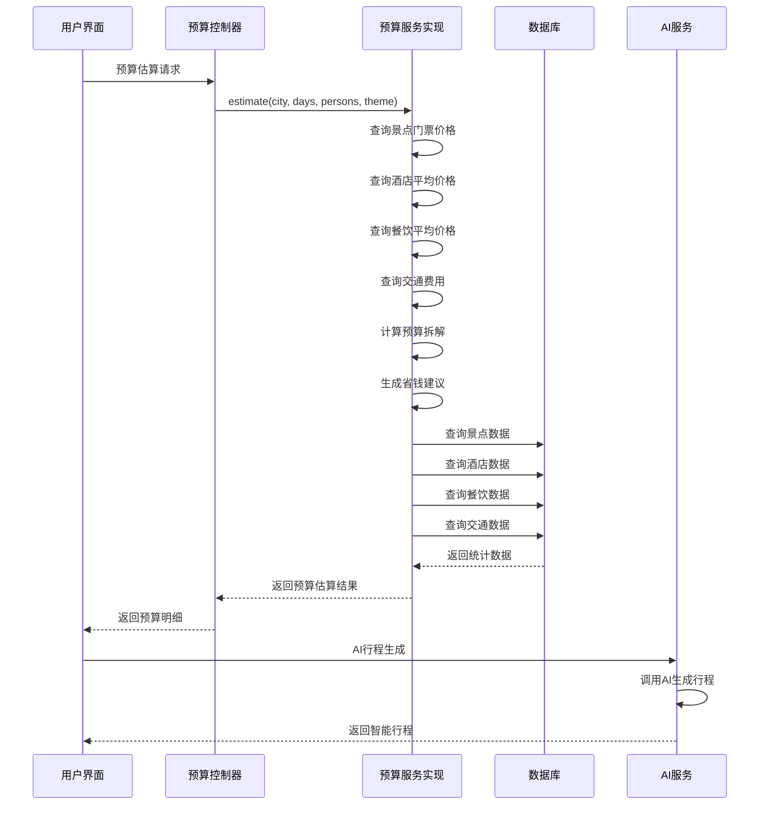
```mermaid
sequenceDiagram
participant U as 用户界面
participant BC as 预算控制器
participant BS as 预算服务实现
participant DB as 数据库
participant AI as AI服务
U->>BC : 预算估算请求
BC->>BS : estimate(city, days, persons, theme)
BS->>BS : 查询景点门票价格
BS->>BS : 查询酒店平均价格
BS->>BS : 查询餐饮平均价格
BS->>BS : 查询交通费用
BS->>BS : 计算预算拆解
BS->>BS : 生成省钱建议
BS->>DB : 查询景点数据
BS->>DB : 查询酒店数据
BS->>DB : 查询餐饮数据
BS->>DB : 查询交通数据
DB-->>BS : 返回统计数据
BS-->>BC : 返回预算估算结果
BC-->>U : 返回预算明细
U->>AI : AI行程生成
AI->>AI : 调用AI生成行程
AI-->>U : 返回智能行程
```

**图表来源**
- [BudgetController.java:21-29](file://springboot-travel-social/src/main/java/com/cxx/controller/BudgetController.java#L21-L29)
- [BudgetServiceImpl.java:48-246](file://springboot-travel-social/src/main/java/com/cxx/service/impl/BudgetServiceImpl.java#L48-L246)

系统架构特点：
- **分层清晰**：控制器、服务、数据访问三层分离
- **接口统一**：所有API返回标准化的响应格式
- **AI集成**：支持多种AI大模型服务
- **数据持久化**：完整的行程数据管理
- **扩展性强**：模块化设计便于功能扩展
- **RAG增强**：支持基于游记的上下文增强
- **协作支持**：多人协作行程的完整实现
- **权限控制**：房间成员的角色权限管理
- **实时通信**：消息的实时广播和轮询机制
- **逻辑删除**：安全的数据删除机制
- **智能集成**：路线规划与天气信息的智能结合
- **上下文聚合**：统一的出行环境信息整合
- **预算智能**：旅行预算的精确估算和优化
- **节假日感知**：实时节假日状态和出行建议
- **主题化推荐**：基于旅行主题的个性化建议
- **多源数据融合**：天气、节假日、预算等多维度信息
- **智能推荐**：基于用户偏好的行程优化建议

## 详细组件分析

### 预算智能拆解系统

预算智能拆解系统为用户提供精确的旅行预算估算服务，支持多种旅行主题和个性化需求：

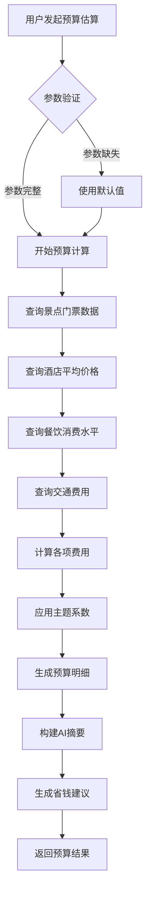
```mermaid
flowchart TD
A[用户发起预算估算] --> B{参数验证}
B --> |参数缺失| C[使用默认值]
B --> |参数完整| D[开始预算计算]
C --> D
D --> E[查询景点门票数据]
E --> F[查询酒店平均价格]
F --> G[查询餐饮消费水平]
G --> H[查询交通费用]
H --> I[计算各项费用]
I --> J[应用主题系数]
J --> K[生成预算明细]
K --> L[构建AI摘要]
L --> M[生成省钱建议]
M --> N[返回预算结果]
```

**图表来源**
- [BudgetController.java:21-29](file://springboot-travel-social/src/main/java/com/cxx/controller/BudgetController.java#L21-L29)
- [BudgetServiceImpl.java:48-246](file://springboot-travel-social/src/main/java/com/cxx/service/impl/BudgetServiceImpl.java#L48-L246)

#### 预算估算算法

系统实现了智能的预算估算算法，支持多种旅行主题和个性化需求：

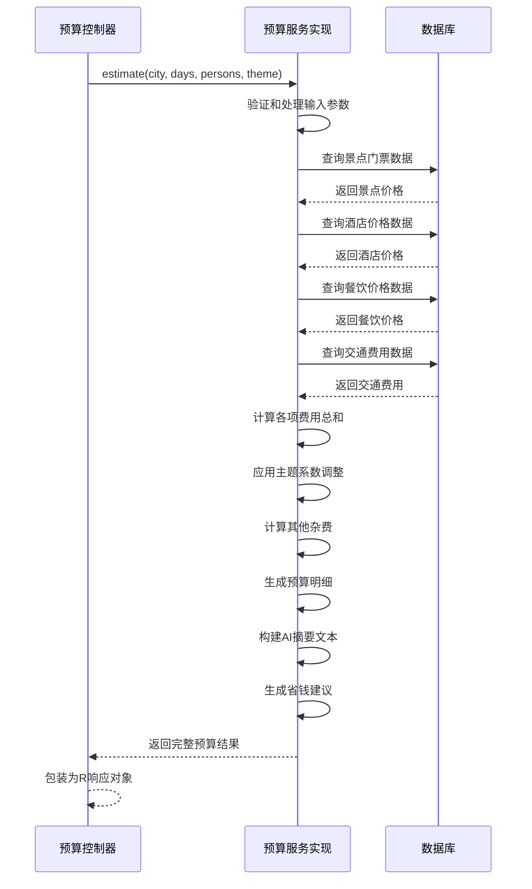
```mermaid
sequenceDiagram
participant BC as 预算控制器
participant BS as 预算服务实现
participant DB as 数据库
BC->>BS : estimate(city, days, persons, theme)
BS->>BS : 验证和处理输入参数
BS->>DB : 查询景点门票数据
DB-->>BS : 返回景点价格
BS->>DB : 查询酒店价格数据
DB-->>BS : 返回酒店价格
BS->>DB : 查询餐饮价格数据
DB-->>BS : 返回餐饮价格
BS->>DB : 查询交通费用数据
DB-->>BS : 返回交通费用
BS->>BS : 计算各项费用总和
BS->>BS : 应用主题系数调整
BS->>BS : 计算其他杂费
BS->>BS : 生成预算明细
BS->>BS : 构建AI摘要文本
BS->>BS : 生成省钱建议
BS-->>BC : 返回完整预算结果
BC-->>BC : 包装为R响应对象
```

**图表来源**
- [BudgetServiceImpl.java:48-246](file://springboot-travel-social/src/main/java/com/cxx/service/impl/BudgetServiceImpl.java#L48-L246)

#### 主题化预算调整

系统支持四种旅行主题的预算调整，每种主题都有相应的系数和建议：

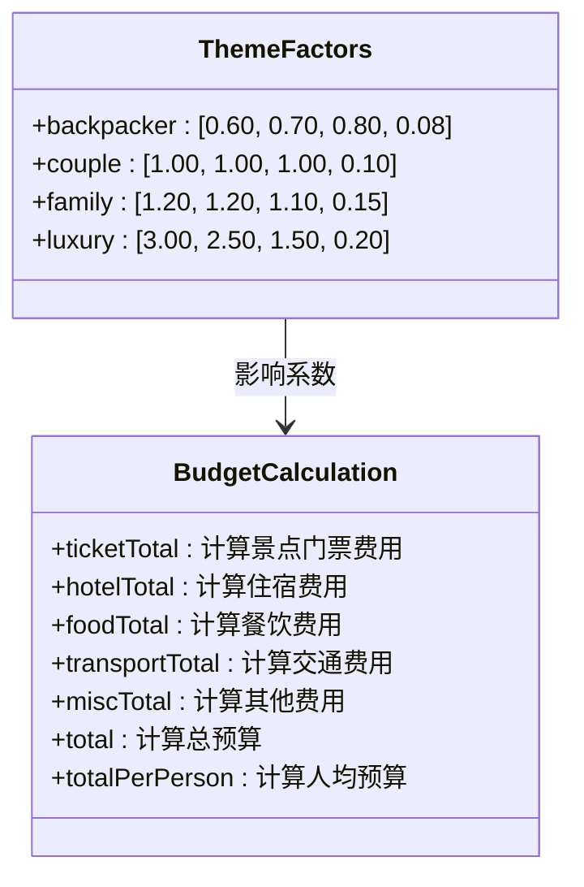
```mermaid
classDiagram
class ThemeFactors {
+backpacker : [0.60, 0.70, 0.80, 0.08]
+couple : [1.00, 1.00, 1.00, 0.10]
+family : [1.20, 1.20, 1.10, 0.15]
+luxury : [3.00, 2.50, 1.50, 0.20]
}
class BudgetCalculation {
+ticketTotal : 计算景点门票费用
+hotelTotal : 计算住宿费用
+foodTotal : 计算餐饮费用
+transportTotal : 计算交通费用
+miscTotal : 计算其他费用
+total : 计算总预算
+totalPerPerson : 计算人均预算
}
ThemeFactors --> BudgetCalculation : 影响系数
```

**图表来源**
- [BudgetServiceImpl.java:38-46](file://springboot-travel-social/src/main/java/com/cxx/service/impl/BudgetServiceImpl.java#L38-L46)
- [BudgetServiceImpl.java:167-171](file://springboot-travel-social/src/main/java/com/cxx/service/impl/BudgetServiceImpl.java#L167-L171)

#### 省钱建议生成

系统根据用户旅行主题和当地特色生成个性化的省钱建议：

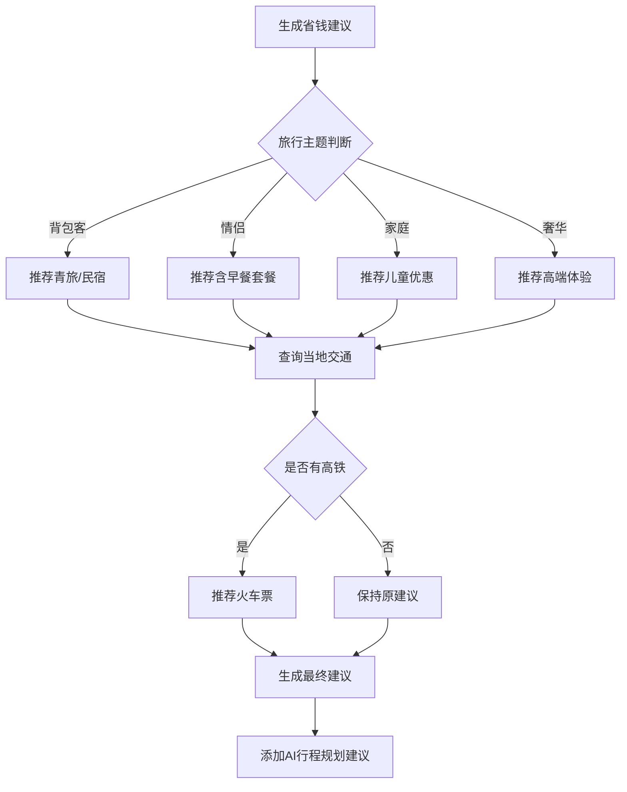
```mermaid
flowchart TD
A[生成省钱建议] --> B{旅行主题判断}
B --> |背包客| C[推荐青旅/民宿]
B --> |情侣| D[推荐含早餐套餐]
B --> |家庭| E[推荐儿童优惠]
B --> |奢华| F[推荐高端体验]
C --> G[查询当地交通]
D --> G
E --> G
F --> G
G --> H{是否有高铁}
H --> |是| I[推荐火车票]
H --> |否| J[保持原建议]
I --> K[生成最终建议]
J --> K
K --> L[添加AI行程规划建议]
```

**图表来源**
- [BudgetServiceImpl.java:276-292](file://springboot-travel-social/src/main/java/com/cxx/service/impl/BudgetServiceImpl.java#L276-L292)

### 天气节假日感知系统

天气节假日感知系统为用户提供实时的天气和节假日信息，增强AI行程规划的准确性：

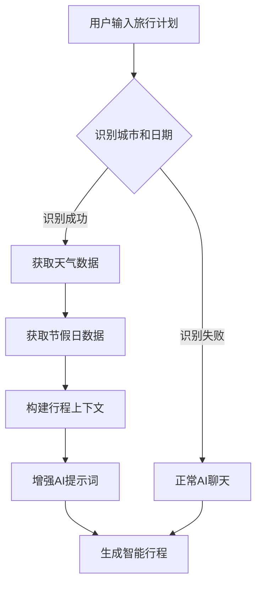
```mermaid
flowchart TD
A[用户输入旅行计划] --> B{识别城市和日期}
B --> |识别成功| C[获取天气数据]
B --> |识别失败| D[正常AI聊天]
C --> E[获取节假日数据]
E --> F[构建行程上下文]
F --> G[增强AI提示词]
G --> H[生成智能行程]
D --> H
```

**图表来源**
- [TripContextServiceImpl.java:24-78](file://springboot-travel-social/src/main/java/com/cxx/service/impl/TripContextServiceImpl.java#L24-L78)

#### 行程上下文聚合

系统实现了智能的行程上下文聚合功能，将天气和节假日信息整合为自然语言摘要：

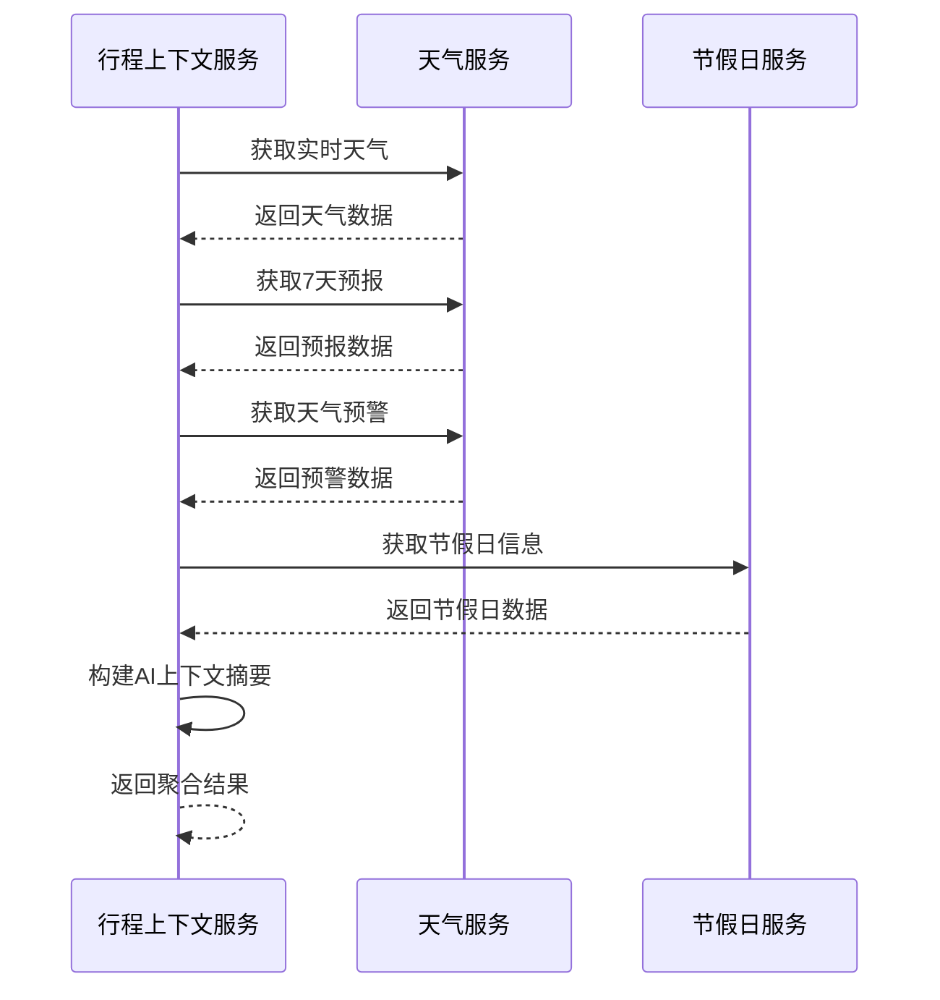
```mermaid
sequenceDiagram
participant TC as 行程上下文服务
participant WS as 天气服务
participant HS as 节假日服务
TC->>WS : 获取实时天气
WS-->>TC : 返回天气数据
TC->>WS : 获取7天预报
WS-->>TC : 返回预报数据
TC->>WS : 获取天气预警
WS-->>TC : 返回预警数据
TC->>HS : 获取节假日信息
HS-->>TC : 返回节假日数据
TC->>TC : 构建AI上下文摘要
TC-->>TC : 返回聚合结果
```

**图表来源**
- [TripContextServiceImpl.java:31-78](file://springboot-travel-social/src/main/java/com/cxx/service/impl/TripContextServiceImpl.java#L31-L78)

#### 节假日配置管理

系统提供了完整的节假日配置管理功能，支持年度节假日数据的维护和查询：

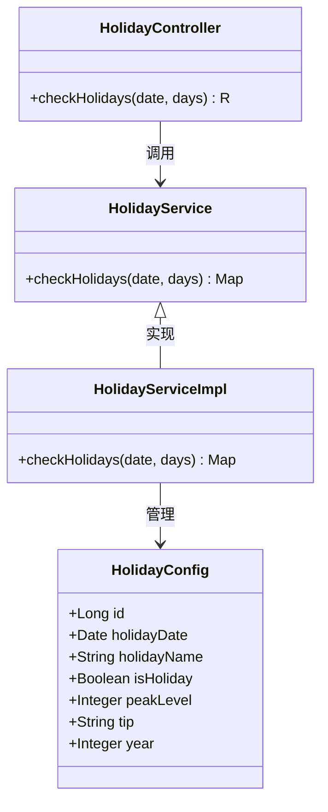
```mermaid
classDiagram
class HolidayConfig {
+Long id
+Date holidayDate
+String holidayName
+Boolean isHoliday
+Integer peakLevel
+String tip
+Integer year
}
class HolidayController {
+checkHolidays(date, days) R
}
class HolidayService {
+checkHolidays(date, days) Map
}
class HolidayServiceImpl {
+checkHolidays(date, days) Map
}
HolidayController --> HolidayService : 调用
HolidayService <|-- HolidayServiceImpl : 实现
HolidayServiceImpl --> HolidayConfig : 管理
```

**图表来源**
- [HolidayController.java:33-40](file://springboot-travel-social/src/main/java/com/cxx/controller/HolidayController.java#L33-L40)
- [HolidayService.java:29-76](file://springboot-travel-social/src/main/java/com/cxx/service/impl/HolidayServiceImpl.java#L29-L76)

#### AI上下文构建算法

系统实现了智能的AI上下文构建算法，将多源信息整合为自然语言摘要：

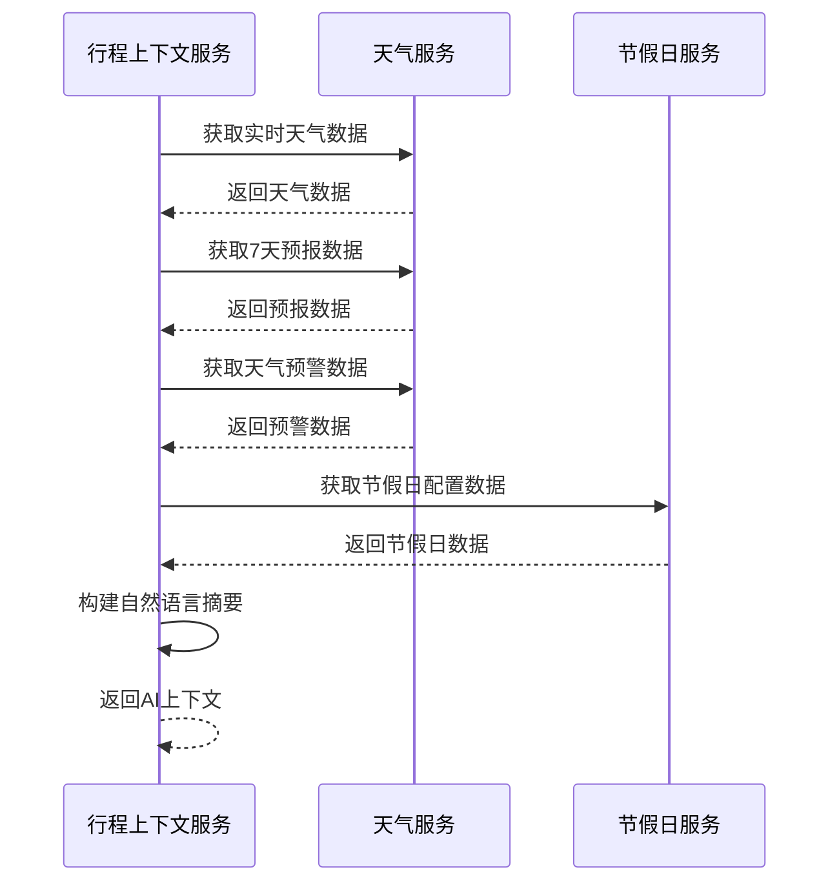
```mermaid
sequenceDiagram
participant TCS as 行程上下文服务
participant WS as 天气服务
participant HS as 节假日服务
TCS->>WS : 获取实时天气数据
WS-->>TCS : 返回天气数据
TCS->>WS : 获取7天预报数据
WS-->>TCS : 返回预报数据
TCS->>WS : 获取天气预警数据
WS-->>TCS : 返回预警数据
TCS->>HS : 获取节假日配置数据
HS-->>TCS : 返回节假日数据
TCS->>TCS : 构建自然语言摘要
TCS-->>TCS : 返回AI上下文
```

**图表来源**
- [TripContextServiceImpl.java:150-195](file://springboot-travel-social/src/main/java/com/cxx/service/impl/TripContextServiceImpl.java#L150-L195)

### 多人协作行程系统

多人协作行程系统为用户提供完整的团队旅行规划功能，支持房间创建、成员管理、实时消息和AI行程生成：

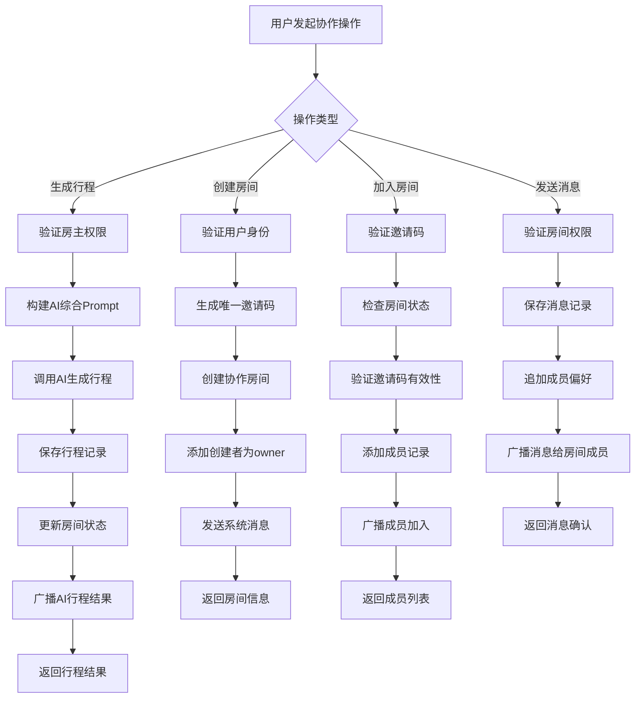
```mermaid
flowchart TD
A[用户发起协作操作] --> B{操作类型}
B --> |创建房间| C[验证用户身份]
B --> |加入房间| D[验证邀请码]
B --> |发送消息| E[验证房间权限]
B --> |生成行程| F[验证房主权限]
C --> G[生成唯一邀请码]
G --> H[创建协作房间]
H --> I[添加创建者为owner]
I --> J[发送系统消息]
D --> K[检查房间状态]
K --> L[验证邀请码有效性]
L --> M[添加成员记录]
M --> N[广播成员加入]
E --> O[保存消息记录]
O --> P[追加成员偏好]
P --> Q[广播消息给房间成员]
F --> R[构建AI综合Prompt]
R --> S[调用AI生成行程]
S --> T[保存行程记录]
T --> U[更新房间状态]
U --> V[广播AI行程结果]
J --> W[返回房间信息]
N --> X[返回成员列表]
Q --> Y[返回消息确认]
V --> Z[返回行程结果]
```

**图表来源**
- [ItineraryCollabController.java:29-130](file://springboot-travel-social/src/main/java/com/cxx/controller/ItineraryCollabController.java#L29-L130)
- [ItineraryCollabServiceImpl.java:42-239](file://springboot-travel-social/src/main/java/com/cxx/service/impl/ItineraryCollabServiceImpl.java#L42-L239)

#### 协作房间管理

系统提供了完整的协作房间管理功能，包括房间创建、成员邀请和状态控制：

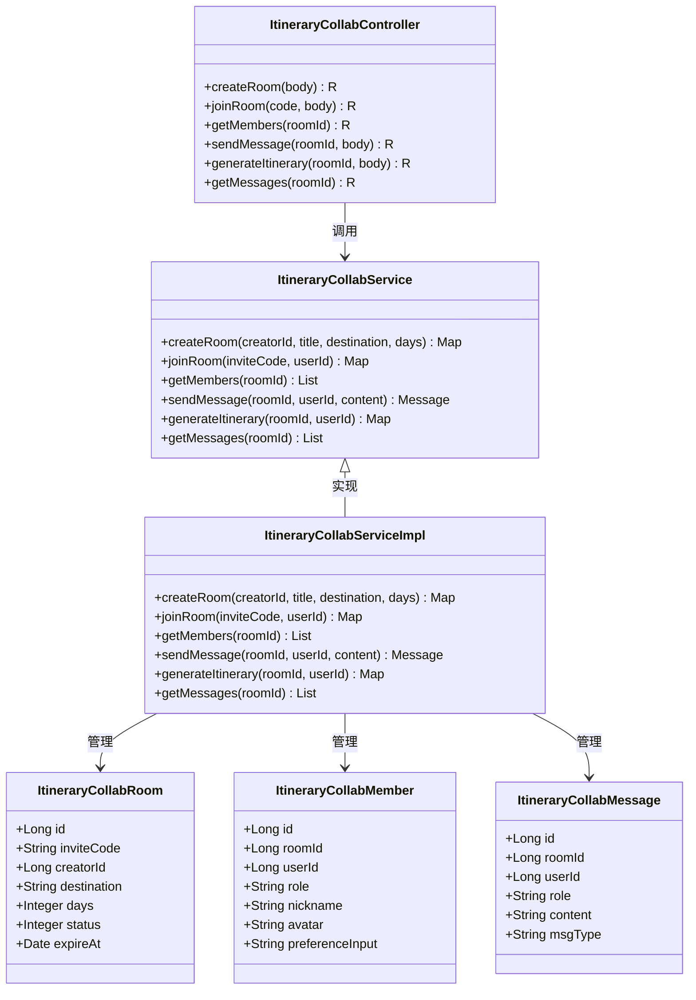
```mermaid
classDiagram
class ItineraryCollabController {
+createRoom(body) R
+joinRoom(code, body) R
+getMembers(roomId) R
+sendMessage(roomId, body) R
+generateItinerary(roomId, body) R
+getMessages(roomId) R
}
class ItineraryCollabService {
+createRoom(creatorId, title, destination, days) Map
+joinRoom(inviteCode, userId) Map
+getMembers(roomId) List
+sendMessage(roomId, userId, content) Message
+generateItinerary(roomId, userId) Map
+getMessages(roomId) List
}
class ItineraryCollabServiceImpl {
+createRoom(creatorId, title, destination, days) Map
+joinRoom(inviteCode, userId) Map
+getMembers(roomId) List
+sendMessage(roomId, userId, content) Message
+generateItinerary(roomId, userId) Map
+getMessages(roomId) List
}
class ItineraryCollabRoom {
+Long id
+String inviteCode
+Long creatorId
+String destination
+Integer days
+Integer status
+Date expireAt
}
class ItineraryCollabMember {
+Long id
+Long roomId
+Long userId
+String role
+String nickname
+String avatar
+String preferenceInput
}
class ItineraryCollabMessage {
+Long id
+Long roomId
+Long userId
+String role
+String content
+String msgType
}
ItineraryCollabController --> ItineraryCollabService : 调用
ItineraryCollabService <|-- ItineraryCollabServiceImpl : 实现
ItineraryCollabServiceImpl --> ItineraryCollabRoom : 管理
ItineraryCollabServiceImpl --> ItineraryCollabMember : 管理
ItineraryCollabServiceImpl --> ItineraryCollabMessage : 管理
```

**图表来源**
- [ItineraryCollabController.java:29-130](file://springboot-travel-social/src/main/java/com/cxx/controller/ItineraryCollabController.java#L29-L130)
- [ItineraryCollabService.java:13-67](file://springboot-travel-social/src/main/java/com/cxx/service/ItineraryCollabService.java#L13-L67)
- [ItineraryCollabServiceImpl.java:42-239](file://springboot-travel-social/src/main/java/com/cxx/service/impl/ItineraryCollabServiceImpl.java#L42-L239)

#### 邀请码生成算法

系统实现了安全的邀请码生成算法，确保协作房间的唯一性和安全性：

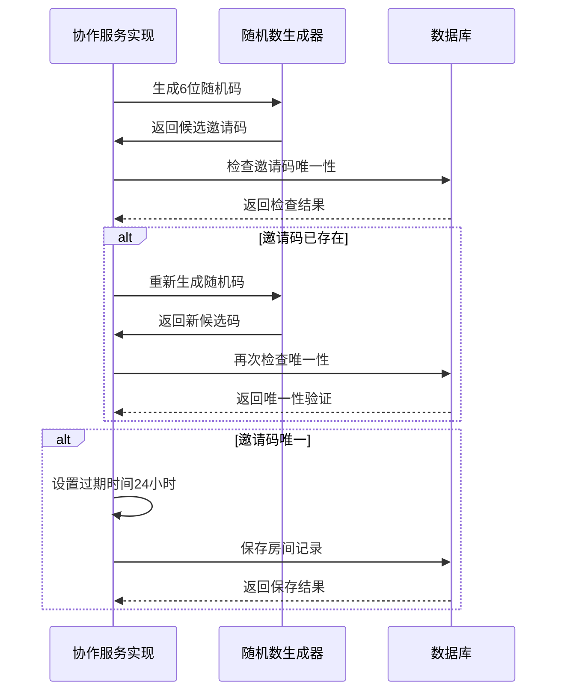
```mermaid
sequenceDiagram
participant ICS as 协作服务实现
participant RNG as 随机数生成器
participant DB as 数据库
ICS->>RNG : 生成6位随机码
RNG->>ICS : 返回候选邀请码
ICS->>DB : 检查邀请码唯一性
DB-->>ICS : 返回检查结果
alt 邀请码已存在
ICS->>RNG : 重新生成随机码
RNG->>ICS : 返回新候选码
ICS->>DB : 再次检查唯一性
DB-->>ICS : 返回唯一性验证
end
alt 邀请码唯一
ICS->>ICS : 设置过期时间24小时
ICS->>DB : 保存房间记录
DB-->>ICS : 返回保存结果
end
```

**图表来源**
- [ItineraryCollabServiceImpl.java:250-261](file://springboot-travel-social/src/main/java/com/cxx/service/impl/ItineraryCollabServiceImpl.java#L250-L261)

#### AI协作行程生成

系统实现了智能的AI协作行程生成功能，能够综合多个成员的偏好需求：

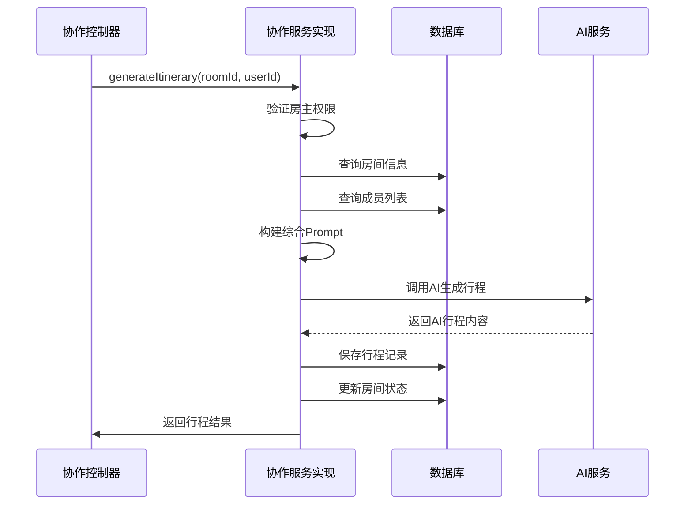
```mermaid
sequenceDiagram
participant ICC as 协作控制器
participant ICS as 协作服务实现
participant DB as 数据库
participant AI as AI服务
ICC->>ICS : generateItinerary(roomId, userId)
ICS->>ICS : 验证房主权限
ICS->>DB : 查询房间信息
ICS->>DB : 查询成员列表
ICS->>ICS : 构建综合Prompt
ICS->>AI : 调用AI生成行程
AI-->>ICS : 返回AI行程内容
ICS->>DB : 保存行程记录
ICS->>DB : 更新房间状态
ICS->>ICC : 返回行程结果
```

**图表来源**
- [ItineraryCollabController.java:108-121](file://springboot-travel-social/src/main/java/com/cxx/controller/ItineraryCollabController.java#L108-L121)
- [ItineraryCollabServiceImpl.java:175-239](file://springboot-travel-social/src/main/java/com/cxx/service/impl/ItineraryCollabServiceImpl.java#L175-L239)

#### 前端协作页面实现

前端协作页面提供了完整的用户交互界面，支持房间管理、消息通信和行程查看：

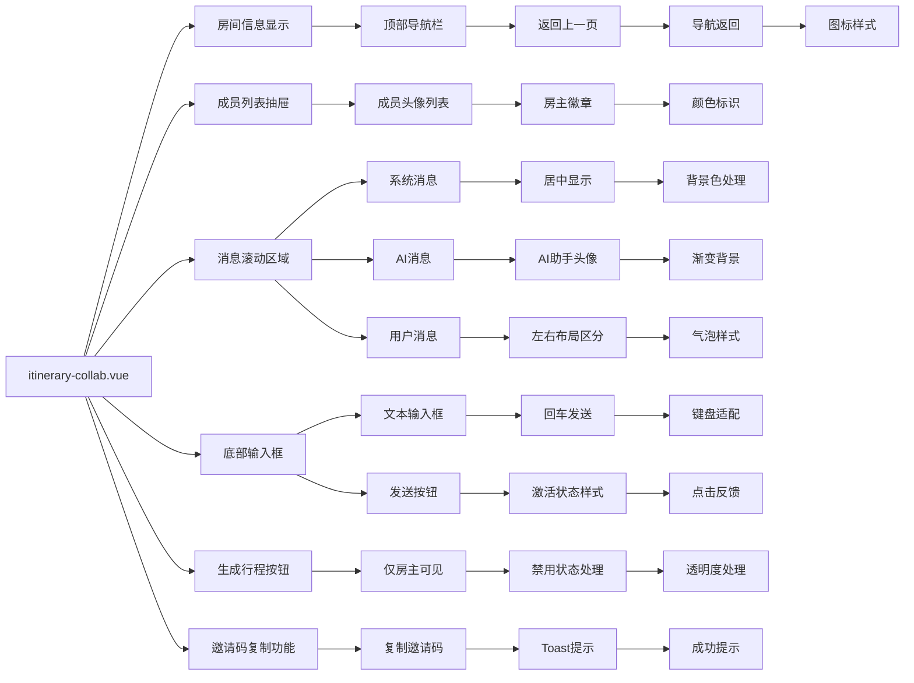
```mermaid
graph LR
A[itinerary-collab.vue] --> B[房间信息显示]
A --> C[成员列表抽屉]
A --> D[消息滚动区域]
A --> E[底部输入框]
A --> F[生成行程按钮]
A --> G[邀请码复制功能]
B --> H[顶部导航栏]
C --> I[成员头像列表]
D --> J[系统消息]
D --> K[AI消息]
D --> L[用户消息]
E --> M[文本输入框]
E --> N[发送按钮]
F --> O[仅房主可见]
G --> P[复制邀请码]
H --> Q[返回上一页]
I --> R[房主徽章]
J --> S[居中显示]
K --> T[AI助手头像]
L --> U[左右布局区分]
M --> V[回车发送]
N --> W[激活状态样式]
O --> X[禁用状态处理]
P --> Y[Toast提示]
Q --> Z[导航返回]
R --> AA[颜色标识]
S --> AB[背景色处理]
T --> AC[渐变背景]
U --> AD[气泡样式]
V --> AE[键盘适配]
W --> AF[点击反馈]
X --> AG[透明度处理]
Y --> AH[成功提示]
Z --> AI[图标样式]
```

**图表来源**
- [itinerary-collab.vue:1-487](file://uniapp-travel-social/homePages/itinerary/itinerary-collab.vue#L1-L487)

### 智能路线规划系统

智能路线规划系统为用户提供精确的驾车路线规划服务，集成百度地图API实现：

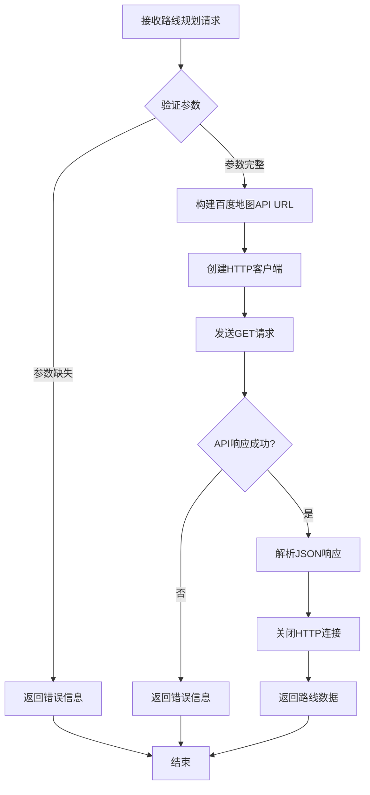
```mermaid
flowchart TD
A[接收路线规划请求] --> B{验证参数}
B --> |参数缺失| C[返回错误信息]
B --> |参数完整| D[构建百度地图API URL]
D --> E[创建HTTP客户端]
E --> F[发送GET请求]
F --> G{API响应成功?}
G --> |否| H[返回错误信息]
G --> |是| I[解析JSON响应]
I --> J[关闭HTTP连接]
J --> K[返回路线数据]
C --> L[结束]
H --> L
K --> L
```

**图表来源**
- [RoutePlanningController.java:25-29](file://springboot-travel-social/src/main/java/com/cxx/controller/RoutePlanningController.java#L25-L29)
- [RoutePlanningUtils.java:25-34](file://springboot-travel-social/src/main/java/com/cxx/utils/RoutePlanningUtils.java#L25-L34)

#### 路线规划接口设计

系统提供了专门的路线规划接口，支持起点和终点参数的精确路线计算：

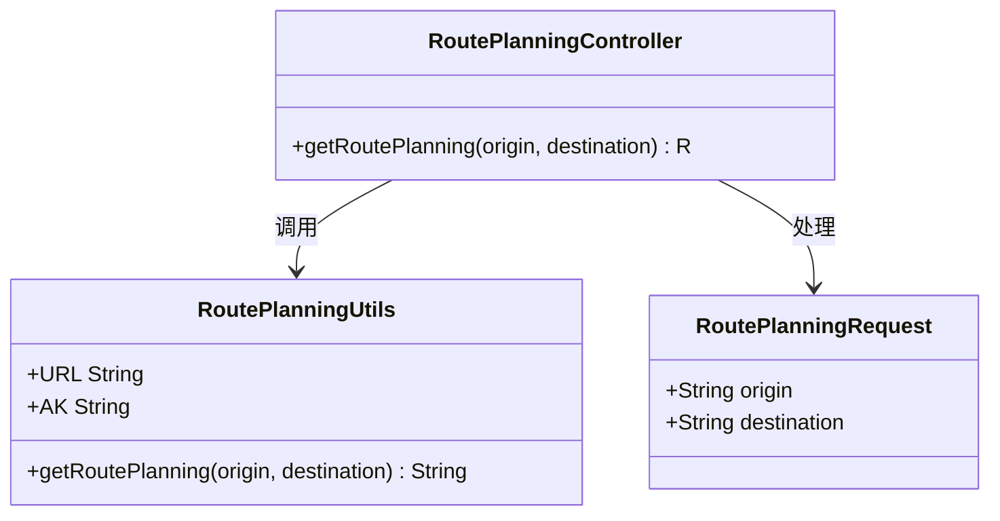
```mermaid
classDiagram
class RoutePlanningController {
+getRoutePlanning(origin, destination) R
}
class RoutePlanningUtils {
+URL String
+AK String
+getRoutePlanning(origin, destination) String
}
class RoutePlanningRequest {
+String origin
+String destination
}
RoutePlanningController --> RoutePlanningUtils : 调用
RoutePlanningController --> RoutePlanningRequest : 处理
```

**图表来源**
- [RoutePlanningController.java:25-29](file://springboot-travel-social/src/main/java/com/cxx/controller/RoutePlanningController.java#L25-L29)

#### 百度地图API集成

路线规划功能深度集成了百度地图API，提供精确的驾车路线计算：

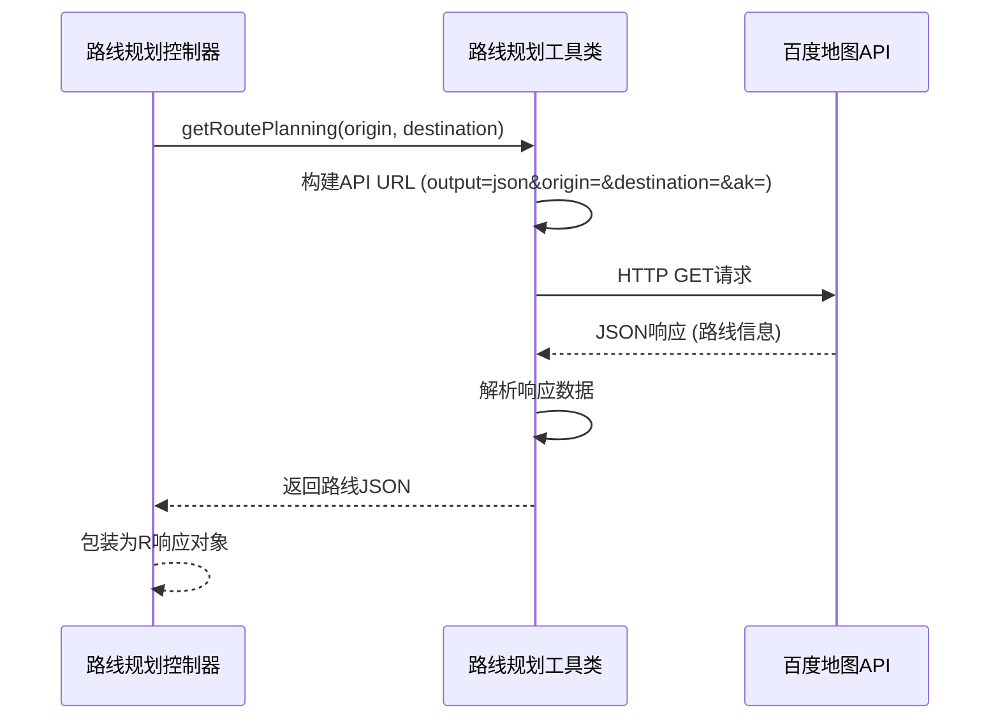
```mermaid
sequenceDiagram
participant RPC as 路线规划控制器
participant RPU as 路线规划工具类
participant BM as 百度地图API
RPC->>RPU : getRoutePlanning(origin, destination)
RPU->>RPU : 构建API URL (output=json&origin=&destination=&ak=)
RPU->>BM : HTTP GET请求
BM-->>RPU : JSON响应 (路线信息)
RPU->>RPU : 解析响应数据
RPU-->>RPC : 返回路线JSON
RPC-->>RPC : 包装为R响应对象
```

**图表来源**
- [RoutePlanningUtils.java:23-34](file://springboot-travel-social/src/main/java/com/cxx/utils/RoutePlanningUtils.java#L23-L34)

### 天气服务集成系统

天气服务系统为用户提供全面的天气信息服务，集成和风天气API：

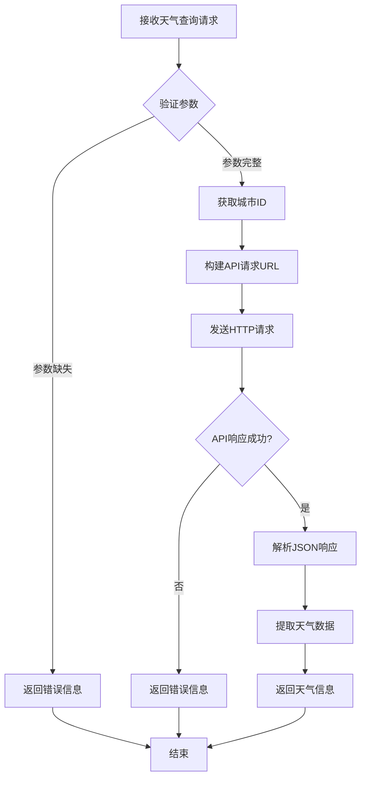
```mermaid
flowchart TD
A[接收天气查询请求] --> B{验证参数}
B --> |参数缺失| C[返回错误信息]
B --> |参数完整| D[获取城市ID]
D --> E[构建API请求URL]
E --> F[发送HTTP请求]
F --> G{API响应成功?}
G --> |否| H[返回错误信息]
G --> |是| I[解析JSON响应]
I --> J[提取天气数据]
J --> K[返回天气信息]
C --> L[结束]
H --> L
K --> L
```

**图表来源**
- [WeatherController.java:34-37](file://springboot-travel-social/src/main/java/com/cxx/controller/WeatherController.java#L34-L37)
- [WeatherServiceImpl.java:38-64](file://springboot-travel-social/src/main/java/com/cxx/service/impl/WeatherServiceImpl.java#L38-L64)

#### 天气服务接口设计

系统提供了完整的天气服务接口，支持多种天气信息查询：

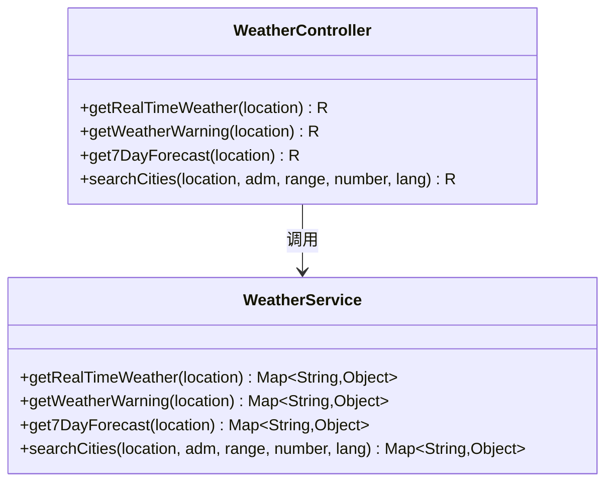
```mermaid
classDiagram
class WeatherService {
+getRealTimeWeather(location) Map~String,Object~
+getWeatherWarning(location) Map~String,Object~
+get7DayForecast(location) Map~String,Object~
+searchCities(location, adm, range, number, lang) Map~String,Object~
}
class WeatherController {
+getRealTimeWeather(location) R
+getWeatherWarning(location) R
+get7DayForecast(location) R
+searchCities(location, adm, range, number, lang) R
}
WeatherController --> WeatherService : 调用
```

**图表来源**
- [WeatherService.java:8-41](file://springboot-travel-social/src/main/java/com/cxx/service/WeatherService.java#L8-L41)
- [WeatherController.java:32-85](file://springboot-travel-social/src/main/java/com/cxx/controller/WeatherController.java#L32-L85)

#### 和风天气API集成

天气服务深度集成了和风天气API，提供准确的天气数据：

```mermaid
sequenceDiagram
participant WC as 天气控制器
participant WS as 天气服务实现
participant HQ as 和风天气API
WC->>WS : getRealTimeWeather(location)
WS->>WS : getCityId(location)
WS->>HQ : 城市搜索API (获取城市ID)
HQ-->>WS : 返回城市ID
WS->>WS : 构建天气查询URL
WS->>WS : 发送HTTP请求
WS->>WS : 解析JSON响应
WS-->>WC : 返回天气数据
WC-->>WC : 包装为R响应对象
```

**图表来源**
- [WeatherServiceImpl.java:38-64](file://springboot-travel-social/src/main/java/com/cxx/service/impl/WeatherServiceImpl.java#L38-L64)
- [WeatherServiceImpl.java:271-293](file://springboot-travel-social/src/main/java/com/cxx/service/impl/WeatherServiceImpl.java#L271-L293)

### 行程上下文聚合系统

行程上下文聚合系统将天气、节假日信息整合为统一的出行环境数据：

```mermaid
flowchart TD
A[接收行程上下文请求] --> B[初始化结果对象]
B --> C[获取天气数据]
C --> D[获取7天预报]
D --> E[获取天气预警]
E --> F[获取节假日数据]
F --> G[构建AI上下文摘要]
G --> H[返回聚合结果]
```

**图表来源**
- [TripContextServiceImpl.java:24-78](file://springboot-travel-social/src/main/java/com/cxx/service/impl/TripContextServiceImpl.java#L24-L78)

#### 上下文聚合服务设计

系统提供了专门的上下文聚合服务，支持天气和节假日信息的统一管理：

```mermaid
classDiagram
class TripContextService {
+getTripContext(city, startDate, days) Map~String,Object~
}
class TripContextServiceImpl {
+weatherService WeatherService
+holidayService HolidayService
+getTripContext(city, startDate, days) Map~String,Object~
}
class WeatherSection {
+current Map~String,Object~
+forecast Map[]String,Object~~
+hasWarning Boolean
+warningText String
}
class HolidaySection {
+isPeakSeason Boolean
+totalHolidayDays Integer
+peakLevel Integer
+tips String[]
}
TripContextServiceImpl --> WeatherSection : 组装
TripContextServiceImpl --> HolidaySection : 组装
```

**图表来源**
- [TripContextService.java:9-19](file://springboot-travel-social/src/main/java/com/cxx/service/TripContextService.java#L9-L19)
- [TripContextServiceImpl.java:16-78](file://springboot-travel-social/src/main/java/com/cxx/service/impl/TripContextServiceImpl.java#L16-L78)

#### AI上下文构建算法

系统实现了智能的AI上下文构建算法，将多源信息整合为自然语言摘要：

```mermaid
sequenceDiagram
participant TCS as 行程上下文服务
participant WS as 天气服务
participant HS as 节假日服务
TCS->>WS : 获取实时天气
WS-->>TCS : 返回天气数据
TCS->>WS : 获取7天预报
WS-->>TCS : 返回预报数据
TCS->>WS : 获取天气预警
WS-->>TCS : 返回预警数据
TCS->>HS : 获取节假日信息
HS-->>TCS : 返回节假日数据
TCS->>TCS : 构建AI上下文摘要
TCS-->>TCS : 返回聚合结果
```

**图表来源**
- [TripContextServiceImpl.java:150-195](file://springboot-travel-social/src/main/java/com/cxx/service/impl/TripContextServiceImpl.java#L150-L195)

### AI行程管理功能

**新增** AI行程管理功能提供了完整的CRUD操作，支持用户保存、查询、查看详情和删除AI生成的行程：

```mermaid
flowchart TD
A[用户发起行程操作] --> B{操作类型}
B --> |保存| C[验证用户身份]
B --> |列表| D[按用户ID查询]
B --> |详情| E[按ID查询]
B --> |删除| F[验证权限]
C --> G{用户已登录?}
G --> |是| H[自动获取用户ID]
G --> |否| I[使用请求体用户ID]
H --> J[设置创建时间]
I --> J
J --> K[自动生成标题]
K --> L[保存到数据库]
D --> M[查询用户行程列表]
E --> N[查询行程详情]
F --> O[执行删除操作]
L --> P[返回成功结果]
M --> Q[返回行程列表]
N --> R[返回行程详情]
O --> S[返回删除结果]
```

**图表来源**
- [ItineraryController.java:32-121](file://springboot-travel-social/src/main/java/com/cxx/controller/ItineraryController.java#L32-L121)

#### 行程实体设计

AI行程实体包含了完整的行程信息字段，支持个人和协作两种模式：

```mermaid
classDiagram
class Itinerary {
+Long id
+Long userId
+String title
+String destination
+Integer days
+String theme
+String budget
+Integer people
+String content
+String coverImg
+Long sessionId
+Long collabRoomId
+Integer isCollab
+String contributors
+Date createTime
+Integer deleted
}
class ItineraryController {
+save(itinerary) R
+list(userId) R
+detail(id) R
+delete(id) R
}
ItineraryController --> Itinerary : 操作
```

**图表来源**
- [Itinerary.java:21-73](file://springboot-travel-social/src/main/java/com/cxx/entity/Itinerary.java#L21-L73)
- [ItineraryController.java:23-121](file://springboot-travel-social/src/main/java/com/cxx/controller/ItineraryController.java#L23-L121)

#### 协作行程功能

**新增** 系统支持多人协作行程，通过扩展字段实现个人行程和协作行程的统一管理：

```mermaid
sequenceDiagram
participant U as 用户
participant IC as 协作控制器
participant DB as 数据库
U->>IC : 创建协作房间
IC->>IC : 验证用户权限
IC->>DB : 插入房间信息
DB-->>IC : 返回房间ID
IC->>U : 返回邀请码
U->>IC : 成员加入房间
IC->>DB : 插入成员信息
DB-->>IC : 返回成员ID
IC->>U : 返回加入结果
U->>IC : 发送协作消息
IC->>DB : 保存消息记录
DB-->>IC : 返回消息ID
IC->>U : 返回消息确认
U->>IC : 生成协作行程
IC->>DB : 查询成员偏好
IC->>IC : 构建AI综合Prompt
IC->>DB : 保存生成的行程
IC->>DB : 更新房间状态
IC->>U : 返回行程结果
```

**图表来源**
- [ItineraryCollabController.java:29-130](file://springboot-travel-social/src/main/java/com/cxx/controller/ItineraryCollabController.java#L29-L130)
- [itinerary_collab.sql:12-59](file://springboot-travel-social/src/main/resources/sql/itinerary_collab.sql#L12-L59)

### 路线管理系统

**新增** 路线管理系统提供了完整的旅游路线数据管理功能：

```mermaid
flowchart TD
A[用户发起路线查询] --> B{查询类型}
B --> |分类| C[获取路线分类列表]
B --> |列表| D[按关键词和分类查询]
B --> |详情| E[按ID查询路线详情]
C --> F[返回分类列表]
D --> G[处理特色标签]
G --> H[执行分页处理]
H --> I[返回分页结果]
E --> J[验证路线状态]
J --> K[返回路线详情]
```

**图表来源**
- [RouteController.java:32-129](file://springboot-travel-social/src/main/java/com/cxx/controller/RouteController.java#L32-L129)

#### 路线实体设计

路线实体包含了完整的路线信息字段，支持路线的分类管理和展示：

```mermaid
classDiagram
class Route {
+Long id
+String title
+String destination
+String type
+String description
+String features
+Integer status
+Date createTime
+Date updateTime
}
class RouteController {
+getCategories() R
+getRouteList(keyword, category, page, pageSize) R
+getRouteDetail(id) R
}
RouteController --> Route : 操作
```

**图表来源**
- [RouteController.java:21-129](file://springboot-travel-social/src/main/java/com/cxx/controller/RouteController.java#L21-L129)

### 前端AI服务封装

**更新** 前端使用JavaScript封装了完整的AI服务接口，提供了统一的API调用方式：

```mermaid
graph LR
A[aiService.js] --> B[simpleChat<br/>简单聊天]
A --> C[chat<br/>通用聊天]
A --> D[ragChat<br/>RAG增强聊天]
A --> E[checkStatus<br/>状态检查]
A --> F[createSession<br/>创建会话]
A --> G[getSessions<br/>获取会话列表]
A --> H[getRecords<br/>获取消息记录]
A --> I[deleteSession<br/>删除会话]
A --> J[clearRecords<br/>清空消息]
A --> K[generateItinerary<br/>生成个人行程]
A --> L[saveItinerary<br/>保存个人行程]
A --> M[getItineraryList<br/>获取个人行程列表]
A --> N[getItineraryDetail<br/>获取个人行程详情]
A --> O[deleteItinerary<br/>删除个人行程]
A --> P[getRoutePlanning<br/>获取路线规划]
A --> Q[getRealTimeWeather<br/>获取实时天气]
A --> R[getWeatherWarning<br/>获取天气预警]
A --> S[get7DayForecast<br/>获取7天预报]
A --> T[searchCities<br/>搜索城市]
A --> U[createCollabRoom<br/>创建协作房间]
A --> V[joinCollabRoom<br/>加入协作房间]
A --> W[sendCollabMessage<br/>发送协作消息]
A --> X[generateCollabItinerary<br/>生成协作行程]
A --> Y[getCollabMessages<br/>获取协作消息]
A --> Z[budgetEstimate<br/>预算估算]
A --> AA[holidayCheck<br/>节假日查询]
A --> BB[tripContext<br/>行程上下文]
```

**图表来源**
- [aiService.js:42-324](file://uniapp-travel-social/services/aiService.js#L42-L324)

### 配置管理

**更新** 系统配置支持多种AI服务提供商，包括DeepSeek、智谱AI等：

**章节来源**
- [application.properties:50-64](file://springboot-travel-social/src/main/resources/application.properties#L50-L64)

## 依赖关系分析

系统采用模块化设计，各组件之间的依赖关系清晰明确：

```mermaid
graph TB
subgraph "外部依赖"
A[Spring Boot]
B[MyBatis Plus]
C[MySQL]
D[Redis]
E[DeepSeek API]
F[讯飞语音API]
G[智谱AI API]
H[RabbitMQ]
I[百度地图API]
J[和风天气API]
K[WebSocket服务器]
L[节假日API]
M[预算数据API]
end
subgraph "内部模块"
N[AIController]
O[ItineraryController]
P[ItineraryCollabController]
Q[BudgetController]
R[HolidayController]
S[RoutePlanningController]
T[WeatherController]
U[RouteController]
V[DeepSeekService]
W[DeepSeekServiceImpl]
X[WeatherService]
Y[WeatherServiceImpl]
Z[TripContextService]
AA[TripContextServiceImpl]
BB[ItineraryCollabService]
CC[ItineraryCollabServiceImpl]
DD[BudgetService]
EE[BudgetServiceImpl]
FF[HolidayService]
GG[HolidayServiceImpl]
HH[ChatRecordService]
II[BlogService]
JJ[Itinerary]
KK[ItineraryCollabMember]
LL[ItineraryCollabMessage]
MM[ItineraryCollabRoom]
NN[HolidayConfig]
OO[ItineraryMapper]
PP[ItineraryCollabMemberMapper]
QQ[ItineraryCollabMessageMapper]
RR[HolidayConfigMapper]
SS[config/配置类]
end
subgraph "数据库层"
TT[ai_itinerary]
UU[itinerary_collab_room]
VV[itinerary_collab_member]
WW[itinerary_collab_message]
XX[holiday_config]
YY[chat_session]
ZZ[chat_record]
AAA[blog]
BBB[route]
CCC[budget_breakdown]
end
N --> V
O --> JJ
P --> BB
Q --> DD
R --> FF
S --> T
T --> X
U --> BBB
V <|-- W
X <|-- Y
Y --> Z
Z <|-- AA
AA --> TT
AA --> XX
BB <|-- CC
CC --> YY
DD <|-- EE
EE --> TT
FF <|-- GG
GG --> XX
HH --> YY
II --> AAA
JJ --> TT
KK --> UU
LL --> VV
MM --> WW
NN --> XX
OO --> TT
PP --> UU
QQ --> VV
RR --> XX
SS --> TT
TT --> C
UU --> C
VV --> C
WW --> C
XX --> C
YY --> C
ZZ --> C
AAA --> C
BBB --> C
CCC --> C
```

**图表来源**
- [application.properties:1-64](file://springboot-travel-social/src/main/resources/application.properties#L1-L64)
- [AIController.java:28-30](file://springboot-travel-social/src/main/java/com/cxx/controller/AIController.java#L28-L30)
- [ItineraryController.java:25](file://springboot-travel-social/src/main/java/com/cxx/controller/ItineraryController.java#L25)
- [ItineraryCollabController.java:25](file://springboot-travel-social/src/main/java/com/cxx/controller/ItineraryCollabController.java#L25)
- [BudgetController.java:15](file://springboot-travel-social/src/main/java/com/cxx/controller/BudgetController.java#L15)
- [HolidayController.java:25](file://springboot-travel-social/src/main/java/com/cxx/controller/HolidayController.java#L25)
- [RoutePlanningController.java:21-24](file://springboot-travel-social/src/main/java/com/cxx/controller/RoutePlanningController.java#L21-L24)
- [WeatherController.java:24-25](file://springboot-travel-social/src/main/java/com/cxx/controller/WeatherController.java#L24-L25)
- [RouteController.java:27](file://springboot-travel-social/src/main/java/com/cxx/controller/RouteController.java#L27)
- [DeepSeekServiceImpl.java:47-53](file://springboot-travel-social/src/main/java/com/cxx/service/impl/DeepSeekServiceImpl.java#L47-L53)

**章节来源**
- [application.properties:1-64](file://springboot-travel-social/src/main/resources/application.properties#L1-L64)

## 性能考虑

系统在设计时充分考虑了性能优化：

### 缓存策略
- 使用Redis缓存热点数据
- 会话信息缓存
- 配置信息缓存
- **新增** 预算估算结果缓存
- **新增** 节假日配置缓存

### 并发处理
- 线程池管理AI请求
- 异步处理语音识别
- 连接池优化数据库连接
- **新增** 协作消息的WebSocket广播优化
- **新增** 天气和节假日数据的并行查询

### 数据优化
- 逻辑删除避免物理删除
- 合理的索引设计
- 分页查询优化
- **新增** 协作房间的唯一索引优化
- **新增** 节假日配置的日期索引优化

### API调用优化
- AI服务状态检查
- 超时重试机制
- 错误降级处理
- **新增** 天气API请求头设置
- **新增** 路线规划API连接管理
- **新增** 预算数据查询的降级策略

### 数据传输优化
- **新增** 天气数据压缩传输
- **新增** 路线规划JSON解析优化
- **新增** 上下文聚合并行处理
- **新增** 协作消息的批量处理
- **新增** 预算估算结果的结构化传输

### 行程数据优化
- **新增** 行程列表按创建时间倒序查询
- **新增** 协作房间的唯一索引优化
- **新增** 成员和消息的复合索引设计
- **新增** 路线数据的分类索引优化
- **新增** 协作房间状态的快速查询
- **新增** 预算数据的分组统计优化

### 协作系统优化
- **新增** 邀请码生成的重试机制
- **新增** 成员权限的快速验证
- **新增** 房间消息的高效存储
- **新增** AI行程生成的异步处理
- **新增** WebSocket连接的会话管理
- **新增** 预算估算的并发缓存机制

### 预算系统优化
- **新增** 预算估算的数据库查询优化
- **新增** 主题系数的内存缓存
- **新增** 价格数据的分页查询
- **新增** 省钱建议的动态生成
- **新增** AI摘要文本的缓存机制

### 节假日系统优化
- **新增** 节假日配置的年度缓存
- **新增** 日期范围查询的索引优化
- **新增** 高峰等级的快速计算
- **新增** 出行建议的去重处理
- **新增** 节假日数据的预加载机制

## 故障排除指南

### 常见问题及解决方案

#### AI服务不可用
**问题描述**：调用AI接口返回失败
**可能原因**：
- API密钥配置错误
- 网络连接问题
- AI服务限流

**解决步骤**：
1. 检查配置文件中的API密钥
2. 验证网络连接状态
3. 查看API调用频率限制

#### 预算估算失败
**问题描述**：预算估算接口返回失败
**可能原因**：
- 城市名称解析失败
- 数据库连接异常
- 价格数据查询失败
- 主题参数格式错误

**解决步骤**：
1. 验证城市名称格式
2. 检查数据库连接
3. 确认价格数据可用性
4. 验证主题参数有效性

#### 节假日查询异常
**问题描述**：节假日查询功能失效
**可能原因**：
- 节假日配置表数据缺失
- 日期格式不正确
- 数据库查询异常
- 年度节假日数据未导入

**解决步骤**：
1. 检查节假日配置表数据
2. 验证日期格式 yyyy-MM-dd
3. 确认数据库连接
4. 导入年度节假日数据

#### 行程上下文聚合失败
**问题描述**：行程上下文聚合接口异常
**可能原因**：
- 天气服务调用失败
- 节假日服务调用失败
- 数据解析异常
- 网络连接问题

**解决步骤**：
1. 检查天气服务状态
2. 验证节假日服务配置
3. 确认数据解析逻辑
4. 查看网络连接状态

#### 协作房间创建失败
**问题描述**：创建协作房间返回失败
**可能原因**：
- 用户ID验证失败
- 邀请码生成冲突
- 数据库连接异常
- 房间状态检查失败

**解决步骤**：
1. 验证用户登录状态
2. 检查邀请码唯一性
3. 确认数据库连接
4. 验证房间创建权限

#### 协作房间加入失败
**问题描述**：加入协作房间返回失败
**可能原因**：
- 邀请码不存在或已过期
- 房间已结束
- 成员数量已达上限
- 用户已在房间内

**解决步骤**：
1. 验证邀请码格式和有效期
2. 检查房间状态
3. 确认成员数量限制
4. 验证用户重复加入

#### 协作消息发送失败
**问题描述**：发送协作消息返回失败
**可能原因**：
- 用户不在房间内
- 房间已结束
- 数据库插入异常
- 消息内容为空

**解决步骤**：
1. 验证用户房间权限
2. 检查房间状态
3. 确认数据库连接
4. 验证消息内容格式

#### 协作行程生成失败
**问题描述**：生成协作行程返回失败
**可能原因**：
- 用户非房主权限
- 成员偏好数据缺失
- AI服务调用失败
- 房间状态异常

**解决步骤**：
1. 验证用户房主权限
2. 检查成员偏好输入
3. 确认AI服务状态
4. 验证房间当前状态

#### 路线规划功能异常
**问题描述**：路线规划接口返回失败
**可能原因**：
- 百度地图API密钥配置错误
- 起点或终点参数格式错误
- 网络连接问题

**解决步骤**：
1. 检查RoutePlanningUtils中的API密钥配置
2. 验证起点和终点参数格式
3. 确认网络连接正常
4. 查看HTTP响应状态码

#### 天气服务异常
**问题描述**：天气查询功能失效
**可能原因**：
- 和风天气API密钥配置错误
- 城市名称解析失败
- 网络连接问题

**解决步骤**：
1. 检查WeatherServiceImpl中的API密钥配置
2. 验证城市名称格式
3. 确认网络连接状态
4. 查看HTTP响应状态码

#### RAG功能失效
**问题描述**：RAG增强聊天功能异常
**可能原因**：
- 关键词提取失败
- 游记检索无结果
- 系统提示词构建错误

**解决步骤**：
1. 检查关键词提取逻辑
2. 验证游记数据库连接
3. 确认系统提示词格式

#### 会话管理问题
**问题描述**：会话列表无法正常显示
**可能原因**：
- 用户ID获取失败
- 数据库查询异常
- 会话状态异常

**解决步骤**：
1. 检查用户登录状态
2. 验证数据库连接
3. 清理异常会话数据

#### 行程生成失败
**问题描述**：智能行程生成功能异常
**可能原因**：
- 目的地参数缺失
- 天数参数格式错误
- AI服务调用失败

**解决步骤**：
1. 验证输入参数格式
2. 检查AI服务状态
3. 查看系统日志

#### 行程管理异常
**问题描述**：AI行程保存或查询失败
**可能原因**：
- 用户未登录
- 数据库连接异常
- SQL语法错误
- 协作房间权限验证失败

**解决步骤**：
1. 确认用户登录状态
2. 验证数据库连接
3. 检查SQL语句格式
4. 验证协作房间访问权限

#### 协作功能异常
**问题描述**：多人协作行程功能异常
**可能原因**：
- 邀请码无效或过期
- 成员权限不足
- 房间状态异常
- 消息格式错误
- WebSocket连接异常

**解决步骤**：
1. 验证邀请码格式和有效期
2. 检查成员角色权限
3. 确认房间当前状态
4. 验证消息内容格式
5. 检查WebSocket连接状态

#### 路线管理异常
**问题描述**：路线查询或详情获取失败
**可能原因**：
- 路线ID无效
- 路线状态异常
- 数据库查询异常

**解决步骤**：
1. 验证路线ID格式
2. 检查路线状态
3. 确认数据库连接
4. 查看SQL查询结果

#### 语音识别异常
**问题描述**：语音转文字功能失效
**可能原因**：
- 讯飞SDK未正确配置
- 音频文件格式不支持
- 文件大小超出限制

**解决步骤**：
1. 配置讯飞API密钥
2. 检查音频格式兼容性
3. 验证文件大小限制

#### 前端协作页面异常
**问题描述**：协作页面加载或交互异常
**可能原因**：
- API接口调用失败
- 用户权限验证失败
- 页面状态管理异常
- WebSocket连接问题

**解决步骤**：
1. 检查API接口响应
2. 验证用户登录状态
3. 确认页面状态更新
4. 检查WebSocket连接状态

#### 预算系统异常
**问题描述**：预算估算功能异常
**可能原因**：
- 数据库连接异常
- 价格数据查询失败
- 主题系数计算错误
- 省钱建议生成异常

**解决步骤**：
1. 检查数据库连接
2. 验证价格数据可用性
3. 确认主题系数有效
4. 查看预算计算逻辑

#### 节假日系统异常
**问题描述**：节假日查询功能异常
**可能原因**：
- 节假日配置表异常
- 日期范围查询失败
- 高峰等级计算错误
- 出行建议处理异常

**解决步骤**：
1. 检查节假日配置表状态
2. 验证日期范围查询
3. 确认高峰等级计算
4. 查看出行建议生成

**章节来源**
- [ItineraryCollabController.java:29-130](file://springboot-travel-social/src/main/java/com/cxx/controller/ItineraryCollabController.java#L29-L130)
- [ItineraryCollabServiceImpl.java:42-239](file://springboot-travel-social/src/main/java/com/cxx/service/impl/ItineraryCollabServiceImpl.java#L42-L239)
- [BudgetController.java:21-29](file://springboot-travel-social/src/main/java/com/cxx/controller/BudgetController.java#L21-L29)
- [BudgetServiceImpl.java:48-246](file://springboot-travel-social/src/main/java/com/cxx/service/impl/BudgetServiceImpl.java#L48-L246)
- [HolidayController.java:33-40](file://springboot-travel-social/src/main/java/com/cxx/controller/HolidayController.java#L33-L40)
- [HolidayServiceImpl.java:29-76](file://springboot-travel-social/src/main/java/com/cxx/service/impl/HolidayServiceImpl.java#L29-L76)
- [RoutePlanningController.java:25-29](file://springboot-travel-social/src/main/java/com/cxx/controller/RoutePlanningController.java#L25-L29)
- [RoutePlanningUtils.java:25-34](file://springboot-travel-social/src/main/java/com/cxx/utils/RoutePlanningUtils.java#L25-L34)
- [WeatherController.java:34-37](file://springboot-travel-social/src/main/java/com/cxx/controller/WeatherController.java#L34-L37)
- [WeatherServiceImpl.java:38-64](file://springboot-travel-social/src/main/java/com/cxx/service/impl/WeatherServiceImpl.java#L38-L64)
- [TripContextServiceImpl.java:24-78](file://springboot-travel-social/src/main/java/com/cxx/service/impl/TripContextServiceImpl.java#L24-L78)

## 结论

AI行程规划系统是一个功能完整、架构清晰的智能旅游服务平台。系统的主要优势包括：

### 技术优势
- **模块化设计**：清晰的分层架构便于维护和扩展
- **AI集成**：支持多种AI大模型，提供智能化服务
- **前后端分离**：现代化的技术栈确保良好的用户体验
- **数据安全**：完善的权限控制和数据保护机制
- **多模态交互**：支持文本、语音等多种输入方式
- **完整数据流**：从AI生成到数据持久化的完整闭环
- **RAG增强**：基于真实用户经验的上下文增强功能
- **协作支持**：多人协作行程的完整实现
- **权限控制**：房间成员的角色权限管理
- **实时通信**：消息的实时广播和轮询机制
- **逻辑删除**：安全可靠的数据管理机制
- **智能集成**：路线规划与天气信息的智能结合
- **上下文聚合**：统一的出行环境信息整合
- **预算智能**：旅行预算的精确估算和优化
- **节假日感知**：实时节假日状态和出行建议
- **主题化推荐**：基于旅行主题的个性化建议
- **多源数据融合**：天气、节假日、预算等多维度信息
- **智能推荐**：基于用户偏好的行程优化建议
- **并发优化**：协作消息和预算查询的高效处理
- **缓存策略**：多层缓存机制提升系统性能

### 功能特色
- **智能行程生成**：基于用户需求自动生成详细行程
- **实时聊天**：提供24小时在线AI助手服务
- **个性化推荐**：根据用户偏好提供定制化建议
- **会话管理**：完整的聊天会话生命周期管理
- **RAG增强**：基于游记的智能问答增强
- **多模态支持**：支持图片和文字的混合输入
- **语音识别**：支持语音输入旅行需求
- **完整的行程管理**：支持CRUD操作的完整行程生命周期
- **多人协作**：支持团队行程规划和协作
- **统一数据模型**：个人和协作行程的统一管理
- **智能路线规划**：精确的驾车路线计算和导航
- **天气信息服务**：全面的天气数据查询和预警
- **行程上下文聚合**：统一的出行环境信息整合
- **路线管理系统**：完整的预设路线数据管理
- **协作房间管理**：完整的房间生命周期管理
- **成员权限控制**：房间成员的角色权限管理
- **实时消息通信**：消息的实时广播和轮询机制
- **AI协作生成**：综合多个成员偏好的智能行程
- **历史消息查询**：完整的协作消息历史管理
- **预算估算服务**：精确的旅行预算计算和优化
- **节假日查询**：实时的节假日状态和出行建议
- **主题化推荐**：基于旅行主题的个性化行程建议
- **省钱建议生成**：智能的旅行省钱方案推荐
- **AI行程规划**：基于多维度信息的智能行程优化

### 发展前景
系统具备良好的扩展性和适应性，可以进一步集成更多AI能力，如图像识别、情感分析等，为用户提供更加智能化的旅游服务体验。新增的预算智能拆解和天气节假日感知系统显著增强了系统的智能化程度，使用户能够获得更加精准和个性化的旅行规划建议。这些新增功能不仅提升了用户体验，也为系统的商业化运营奠定了坚实的基础。

### 新增功能亮点
- **完整的预算系统**：从数据采集到智能分析的全流程预算管理
- **智能预算拆解**：基于旅行主题的个性化预算分配和优化
- **实时天气感知**：结合实时天气数据的行程调整建议
- **节假日智能分析**：基于节假日配置的出行高峰期预测
- **多维度上下文**：天气、节假日、预算等多源信息的智能融合
- **个性化推荐引擎**：基于用户偏好的智能行程优化算法
- **主题化服务**：针对不同旅行主题的定制化服务方案
- **智能省钱建议**：基于数据分析的旅行成本优化建议
- **AI行程优化**：结合多维度信息的智能行程推荐
- **缓存优化策略**：多层缓存机制提升系统响应速度
- **并发处理能力**：支持高并发场景下的稳定运行
- **错误降级机制**：确保系统在异常情况下的稳定性
- **数据可视化**：预算和行程数据的直观展示
- **移动端适配**：完整的移动端用户体验优化
- **国际化支持**：支持多语言的国际化功能扩展

**更新** 新增的AI行程规划相关服务显著扩展了系统的功能范围，实现了从基础的行程规划到智能化的预算管理、天气感知和节假日分析的完整覆盖。系统现在能够根据用户的旅行偏好、预算约束、天气条件和节假日情况进行全方位的智能行程规划，提供更加精准和个性化的旅行建议。这些新增功能不仅提升了用户体验，也为企业级应用提供了强大的技术支持，为系统的可持续发展奠定了坚实基础。