# 博客服务

<cite>
**本文档引用的文件**
- [BlogController.java](file://springboot-travel-social/src/main/java/com/cxx/controller/BlogController.java)
- [BlogService.java](file://springboot-travel-social/src/main/java/com/cxx/service/BlogService.java)
- [BlogServiceImpl.java](file://springboot-travel-social/src/main/java/com/cxx/service/impl/BlogServiceImpl.java)
- [BlogMapper.java](file://springboot-travel-social/src/main/java/com/cxx/mapper/BlogMapper.java)
- [BlogMapper.xml](file://springboot-travel-social/src/main/resources/com/cxx/mapper/BlogMapper.xml)
- [Blog.java](file://springboot-travel-social/src/main/java/com/cxx/entity/Blog.java)
- [UserLikeBlog.java](file://springboot-travel-social/src/main/java/com/cxx/entity/UserLikeBlog.java)
- [UserLikeBlogMapper.java](file://springboot-travel-social/src/main/java/com/cxx/mapper/UserLikeBlogMapper.java)
- [Credits.java](file://springboot-travel-social/src/main/java/com/cxx/entity/Credits.java)
- [Hist.java](file://springboot-travel-social/src/main/java/com/cxx/entity/Hist.java)
- [HistMapper.java](file://springboot-travel-social/src/main/java/com/cxx/mapper/HistMapper.java)
- [application.properties](file://springboot-travel-social/src/main/resources/application.properties)
- [UserHolder.java](file://springboot-travel-social/src/main/java/com/cxx/utils/UserHolder.java)
- [SensitiveWordUtils.java](file://springboot-travel-social/src/main/java/com/cxx/utils/SensitiveWordUtils.java)
</cite>

## 更新摘要
**变更内容**
- 新增攻略内容管理功能，支持游记和攻略两类内容的分类管理
- 增强用户个人中心功能，提供个人游记和攻略的查询接口
- 完善HTML内容解析功能，自动提取文章首图作为封面
- 优化积分奖励机制，区分游记和攻略的发布奖励
- 新增浏览历史统计功能，支持用户浏览行为追踪

## 目录
1. [简介](#简介)
2. [项目结构](#项目结构)
3. [核心组件](#核心组件)
4. [架构概览](#架构概览)
5. [详细组件分析](#详细组件分析)
6. [依赖关系分析](#依赖关系分析)
7. [性能考虑](#性能考虑)
8. [故障排除指南](#故障排除指南)
9. [结论](#结论)

## 简介

博客服务是旅游攻略社交小程序的核心功能模块之一，主要提供用户游记和攻略的发布、浏览、点赞、搜索等功能。该系统基于Spring Boot框架构建，采用前后端分离的架构设计，支持用户生成内容（UGC）的完整生命周期管理。

系统的主要特色包括：
- 实时热点推荐算法
- 基于Redis的高性能点赞系统
- 敏感词过滤机制
- 积分奖励系统
- RAG检索功能
- 攻略内容管理
- 个人中心功能

## 项目结构

博客服务在整个项目中位于后端Spring Boot应用的特定包结构下，采用标准的MVC架构模式：

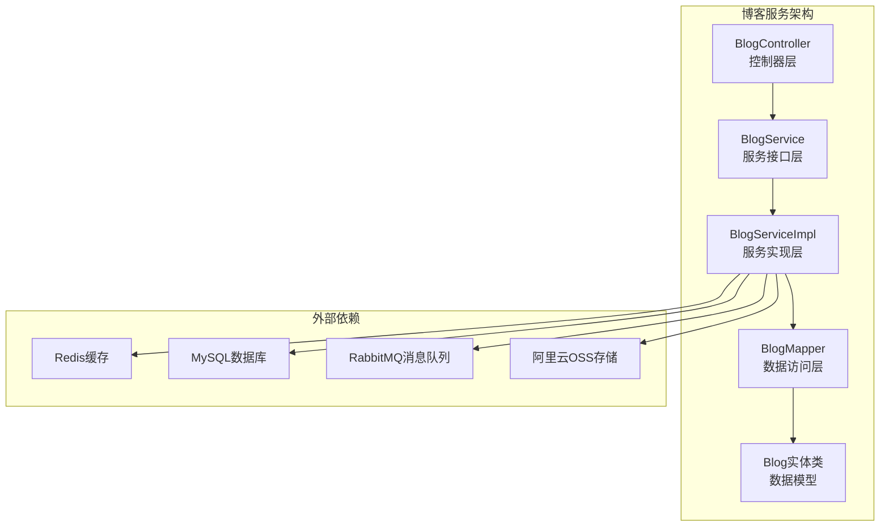

**图表来源**
- [BlogController.java:35-39](file://springboot-travel-social/src/main/java/com/cxx/controller/BlogController.java#L35-L39)
- [BlogService.java:18-38](file://springboot-travel-social/src/main/java/com/cxx/service/BlogService.java#L18-L38)
- [BlogServiceImpl.java:36-36](file://springboot-travel-social/src/main/java/com/cxx/service/impl/BlogServiceImpl.java#L36-L36)

**章节来源**
- [BlogController.java:1-219](file://springboot-travel-social/src/main/java/com/cxx/controller/BlogController.java#L1-L219)
- [BlogService.java:1-39](file://springboot-travel-social/src/main/java/com/cxx/service/BlogService.java#L1-L39)
- [BlogServiceImpl.java:1-264](file://springboot-travel-social/src/main/java/com/cxx/service/impl/BlogServiceImpl.java#L1-L264)

## 核心组件

博客服务由多个核心组件协同工作，形成完整的功能体系：

### 数据模型组件
- **Blog实体类**：定义游记和攻略的数据结构，包含用户信息、内容、标签等属性
- **UserLikeBlog实体类**：记录用户点赞关系，支持双向关联查询
- **Hist实体类**：维护浏览历史记录，用于个性化推荐

### 业务逻辑组件
- **BlogService接口**：定义博客服务的业务方法规范
- **BlogServiceImpl实现类**：提供具体的业务逻辑实现，包括点赞、浏览统计、敏感词过滤等

### 数据访问组件
- **BlogMapper接口**：定义数据库操作方法，支持复杂查询和RAG检索
- **BlogMapper.xml**：提供XML形式的SQL映射定义

### 控制器组件
- **BlogController类**：处理HTTP请求，提供RESTful API接口

**章节来源**
- [Blog.java:24-135](file://springboot-travel-social/src/main/java/com/cxx/entity/Blog.java#L24-L135)
- [UserLikeBlog.java:16-40](file://springboot-travel-social/src/main/java/com/cxx/entity/UserLikeBlog.java#L16-L40)
- [BlogService.java:18-38](file://springboot-travel-social/src/main/java/com/cxx/service/BlogService.java#L18-L38)
- [BlogServiceImpl.java:36-264](file://springboot-travel-social/src/main/java/com/cxx/service/impl/BlogServiceImpl.java#L36-L264)

## 架构概览

博客服务采用经典的三层架构模式，结合微服务设计理念：

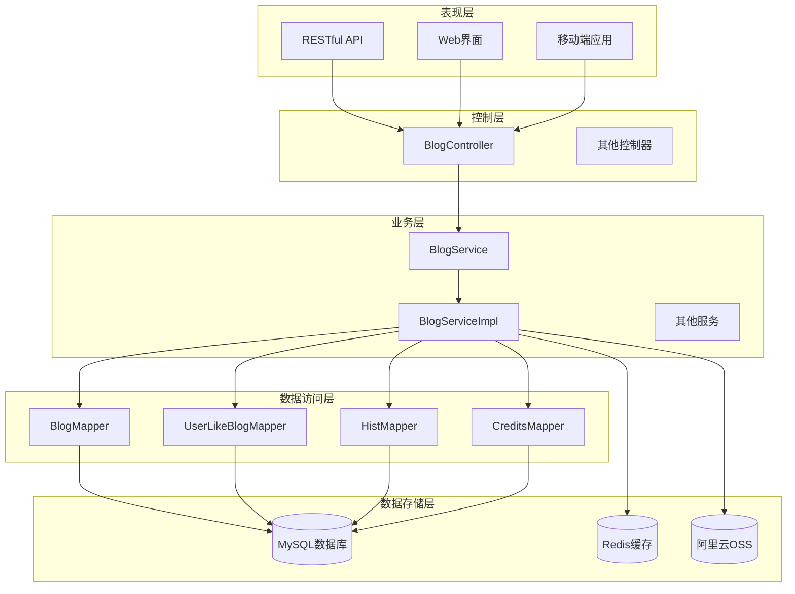

**图表来源**
- [BlogController.java:35-39](file://springboot-travel-social/src/main/java/com/cxx/controller/BlogController.java#L35-L39)
- [BlogServiceImpl.java:36-53](file://springboot-travel-social/src/main/java/com/cxx/service/impl/BlogServiceImpl.java#L36-L53)
- [BlogMapper.java:18-45](file://springboot-travel-social/src/main/java/com/cxx/mapper/BlogMapper.java#L18-L45)

### 数据流处理流程

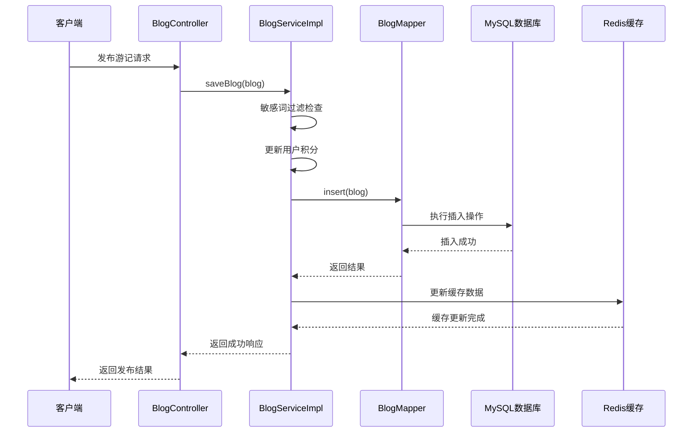

**图表来源**
- [BlogController.java:117-122](file://springboot-travel-social/src/main/java/com/cxx/controller/BlogController.java#L117-L122)
- [BlogServiceImpl.java:143-174](file://springboot-travel-social/src/main/java/com/cxx/service/impl/BlogServiceImpl.java#L143-L174)

**章节来源**
- [BlogController.java:48-195](file://springboot-travel-social/src/main/java/com/cxx/controller/BlogController.java#L48-L195)
- [BlogServiceImpl.java:55-174](file://springboot-travel-social/src/main/java/com/cxx/service/impl/BlogServiceImpl.java#L55-L174)

## 详细组件分析

### BlogController 控制器

BlogController是博客服务的入口点，负责处理所有与博客相关的HTTP请求。该控制器提供了丰富的方法来支持游记和攻略的完整生命周期管理。

#### 核心功能方法

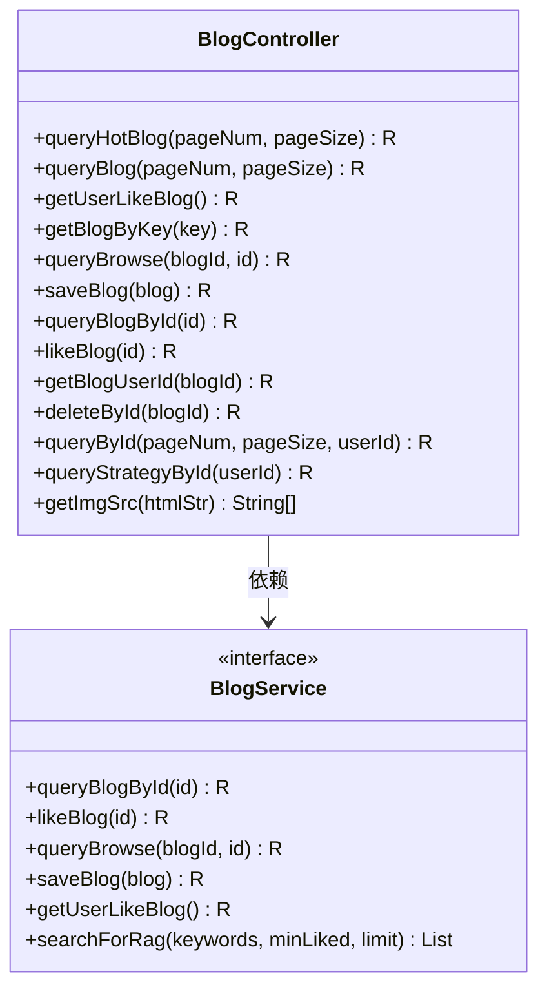

**图表来源**
- [BlogController.java:39-219](file://springboot-travel-social/src/main/java/com/cxx/controller/BlogController.java#L39-L219)
- [BlogService.java:18-38](file://springboot-travel-social/src/main/java/com/cxx/service/BlogService.java#L18-L38)

#### 攻略内容管理功能

系统新增了专门的攻略内容管理功能，支持游记和攻略两类内容的分类管理：

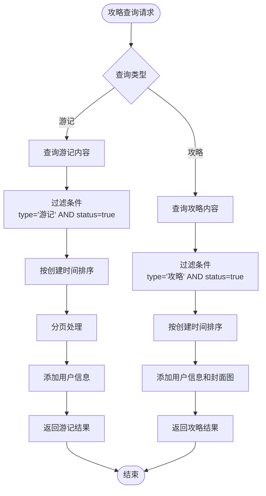

**图表来源**
- [BlogController.java:171-195](file://springboot-travel-social/src/main/java/com/cxx/controller/BlogController.java#L171-L195)

#### 个人中心功能增强

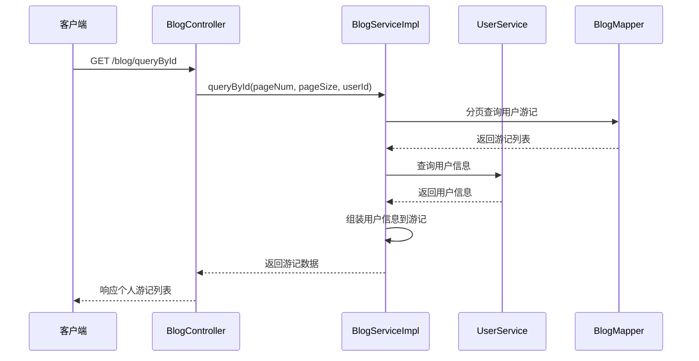

**图表来源**
- [BlogController.java:153-169](file://springboot-travel-social/src/main/java/com/cxx/controller/BlogController.java#L153-L169)

**章节来源**
- [BlogController.java:48-195](file://springboot-travel-social/src/main/java/com/cxx/controller/BlogController.java#L48-L195)

### BlogServiceImpl 服务实现

BlogServiceImpl是博客服务的核心实现类，提供了完整的业务逻辑处理能力。

#### 点赞功能实现

系统采用Redis + MySQL的混合存储策略来实现高效的点赞功能：

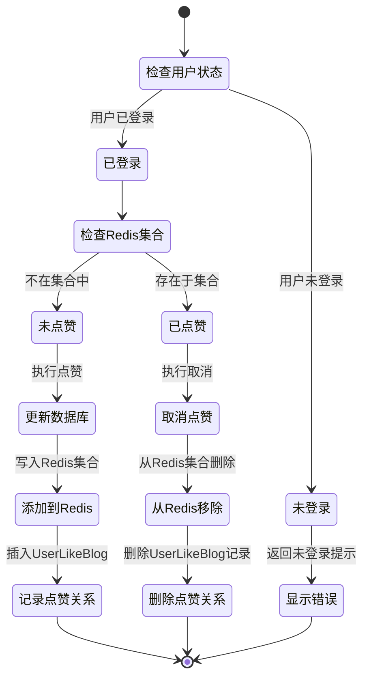

**图表来源**
- [BlogServiceImpl.java:79-111](file://springboot-travel-social/src/main/java/com/cxx/service/impl/BlogServiceImpl.java#L79-L111)

#### 浏览统计机制

系统实现了智能的浏览统计功能，区分匿名浏览和用户浏览：

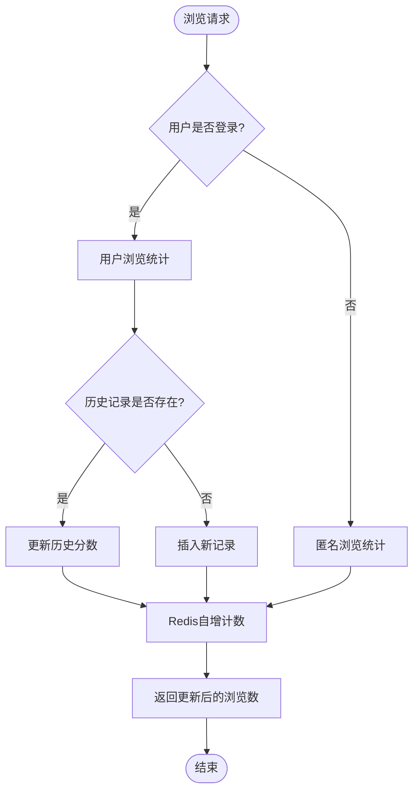

**图表来源**
- [BlogServiceImpl.java:113-141](file://springboot-travel-social/src/main/java/com/cxx/service/impl/BlogServiceImpl.java#L113-L141)

#### HTML内容解析功能

系统新增了HTML内容解析功能，能够自动提取文章中的图片作为封面：

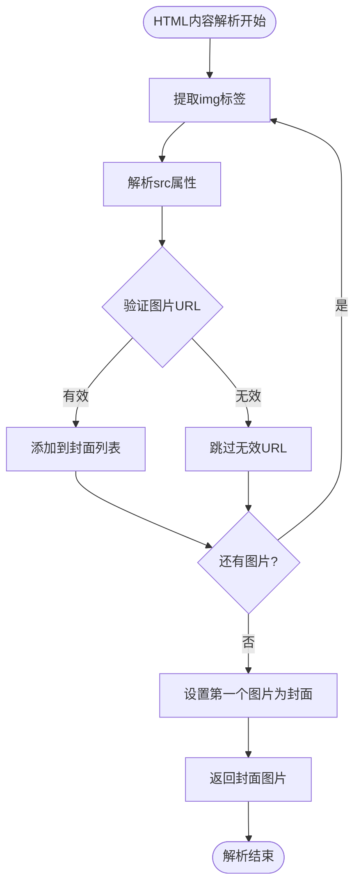

**图表来源**
- [BlogController.java:197-216](file://springboot-travel-social/src/main/java/com/cxx/controller/BlogController.java#L197-L216)

#### RAG检索功能

系统集成了RAG（Retrieval-Augmented Generation）检索功能，支持多维度关键词搜索：

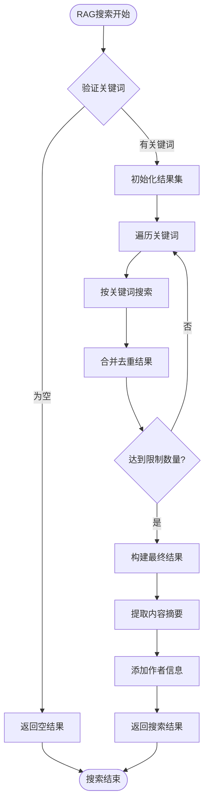

**图表来源**
- [BlogServiceImpl.java:201-262](file://springboot-travel-social/src/main/java/com/cxx/service/impl/BlogServiceImpl.java#L201-L262)

**章节来源**
- [BlogServiceImpl.java:55-262](file://springboot-travel-social/src/main/java/com/cxx/service/impl/BlogServiceImpl.java#L55-L262)

### 数据模型设计

博客服务的数据模型设计充分考虑了性能和扩展性需求：

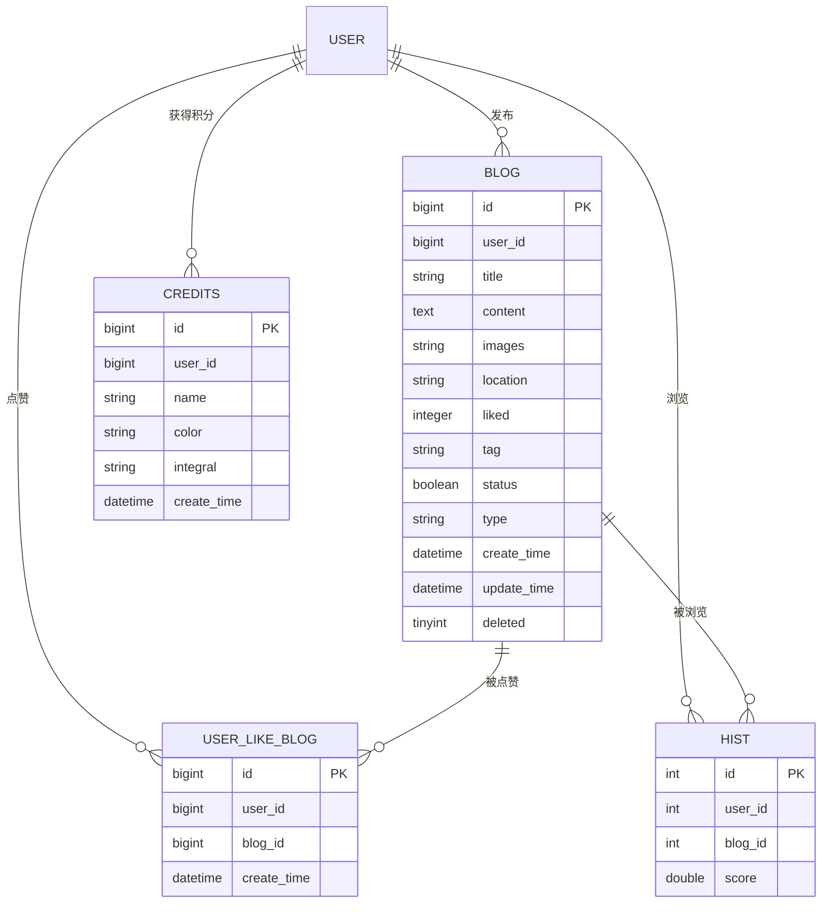

**图表来源**
- [Blog.java:36-120](file://springboot-travel-social/src/main/java/com/cxx/entity/Blog.java#L36-L120)
- [UserLikeBlog.java:22-38](file://springboot-travel-social/src/main/java/com/cxx/entity/UserLikeBlog.java#L22-L38)
- [Hist.java:20-25](file://springboot-travel-social/src/main/java/com/cxx/entity/Hist.java#L20-L25)
- [Credits.java:20-29](file://springboot-travel-social/src/main/java/com/cxx/entity/Credits.java#L20-L29)

**章节来源**
- [Blog.java:24-135](file://springboot-travel-social/src/main/java/com/cxx/entity/Blog.java#L24-L135)
- [UserLikeBlog.java:16-40](file://springboot-travel-social/src/main/java/com/cxx/entity/UserLikeBlog.java#L16-L40)
- [Hist.java:16-26](file://springboot-travel-social/src/main/java/com/cxx/entity/Hist.java#L16-L26)
- [Credits.java:14-30](file://springboot-travel-social/src/main/java/com/cxx/entity/Credits.java#L14-L30)

## 依赖关系分析

博客服务的依赖关系体现了清晰的分层架构设计：

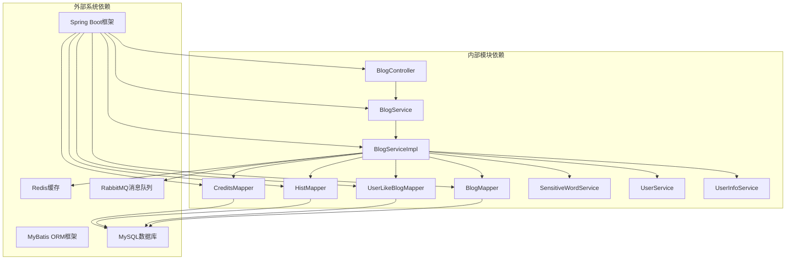

**图表来源**
- [BlogController.java:1-26](file://springboot-travel-social/src/main/java/com/cxx/controller/BlogController.java#L1-L26)
- [BlogServiceImpl.java:36-53](file://springboot-travel-social/src/main/java/com/cxx/service/impl/BlogServiceImpl.java#L36-L53)

### 核心依赖注入关系

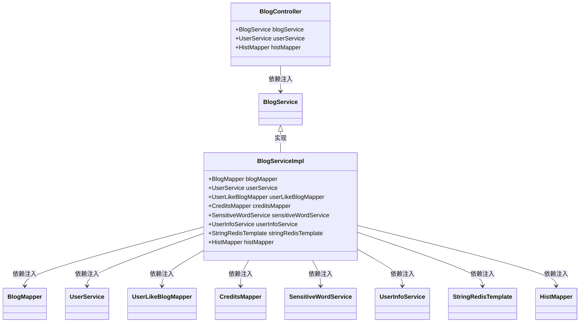

**图表来源**
- [BlogServiceImpl.java:36-53](file://springboot-travel-social/src/main/java/com/cxx/service/impl/BlogServiceImpl.java#L36-L53)
- [BlogController.java:40-46](file://springboot-travel-social/src/main/java/com/cxx/controller/BlogController.java#L40-L46)

**章节来源**
- [BlogController.java:1-26](file://springboot-travel-social/src/main/java/com/cxx/controller/BlogController.java#L1-L26)
- [BlogServiceImpl.java:36-53](file://springboot-travel-social/src/main/java/com/cxx/service/impl/BlogServiceImpl.java#L36-L53)

## 性能考虑

博客服务在设计时充分考虑了性能优化，采用了多种技术手段来提升系统响应速度和吞吐量。

### 缓存策略

系统采用Redis作为缓存层，实现了多层次的缓存机制：

1. **点赞状态缓存**：使用Redis Set存储用户点赞状态，避免频繁的数据库查询
2. **浏览量缓存**：使用Redis原子计数器实时统计浏览量
3. **热点数据缓存**：缓存热门游记和推荐内容

### 数据库优化

1. **索引优化**：在常用查询字段上建立合适的索引
2. **分页查询**：使用MyBatis-Plus的分页插件优化大数据量查询
3. **批量操作**：支持批量查询和批量更新操作

### 异步处理

系统集成了RabbitMQ消息队列，用于处理异步任务：
- 积分更新异步处理
- 日志记录异步写入
- 通知消息异步发送

**章节来源**
- [BlogServiceImpl.java:85-110](file://springboot-travel-social/src/main/java/com/cxx/service/impl/BlogServiceImpl.java#L85-L110)
- [BlogServiceImpl.java:118-140](file://springboot-travel-social/src/main/java/com/cxx/service/impl/BlogServiceImpl.java#L118-L140)

## 故障排除指南

### 常见问题及解决方案

#### 点赞功能异常

**问题现象**：用户无法点赞或点赞状态显示错误

**可能原因**：
1. Redis连接异常
2. 用户未登录状态
3. 数据库事务处理失败

**解决步骤**：
1. 检查Redis服务状态
2. 验证用户登录状态
3. 查看数据库事务日志

#### 浏览权限问题

**问题现象**：用户无法查看自己的游记

**可能原因**：
1. 权限验证失败
2. 用户ID不匹配
3. 游记状态异常

**解决步骤**：
1. 检查UserHolder中的用户信息
2. 验证用户权限
3. 确认游记状态为true

#### 敏感词过滤误判

**问题现象**：正常内容被标记为敏感词

**可能原因**：
1. 敏感词库配置问题
2. 过滤算法参数设置不当

**解决步骤**：
1. 检查敏感词库内容
2. 调整过滤算法参数
3. 更新敏感词库

#### HTML图片解析失败

**问题现象**：文章封面图显示异常

**可能原因**：
1. HTML内容格式不符合规范
2. 图片URL格式不正确
3. 图片资源不可访问

**解决步骤**：
1. 检查HTML内容格式
2. 验证图片URL有效性
3. 确认图片资源可访问性

**章节来源**
- [BlogServiceImpl.java:73-76](file://springboot-travel-social/src/main/java/com/cxx/service/impl/BlogServiceImpl.java#L73-L76)
- [BlogServiceImpl.java:195-198](file://springboot-travel-social/src/main/java/com/cxx/service/impl/BlogServiceImpl.java#L195-L198)

### 系统监控指标

建议关注以下关键性能指标：
- Redis命中率
- 数据库查询延迟
- API响应时间
- 用户活跃度指标

## 结论

博客服务作为旅游攻略社交小程序的核心功能模块，展现了良好的架构设计和实现质量。系统采用现代化的技术栈，结合了高性能的缓存策略、完善的业务逻辑处理和丰富的用户体验功能。

### 主要优势

1. **架构清晰**：采用标准的分层架构，职责明确，易于维护
2. **性能优异**：通过Redis缓存和数据库优化，实现了高并发处理能力
3. **功能完整**：涵盖了游记和攻略的全生命周期管理
4. **扩展性强**：模块化设计便于功能扩展和定制
5. **内容丰富**：支持游记和攻略两类内容的分类管理
6. **用户体验佳**：提供完整的个人中心功能和内容解析能力

### 技术亮点

- 基于Redis的高效点赞系统
- 智能的RAG检索功能
- 完善的敏感词过滤机制
- 实时的浏览统计功能
- 积分奖励激励系统
- HTML内容自动解析功能
- 攻略内容专门管理功能

该博客服务为整个旅游攻略社交平台提供了坚实的内容基础，为用户创造了丰富的社交体验，同时也为后续的功能扩展奠定了良好的技术基础。