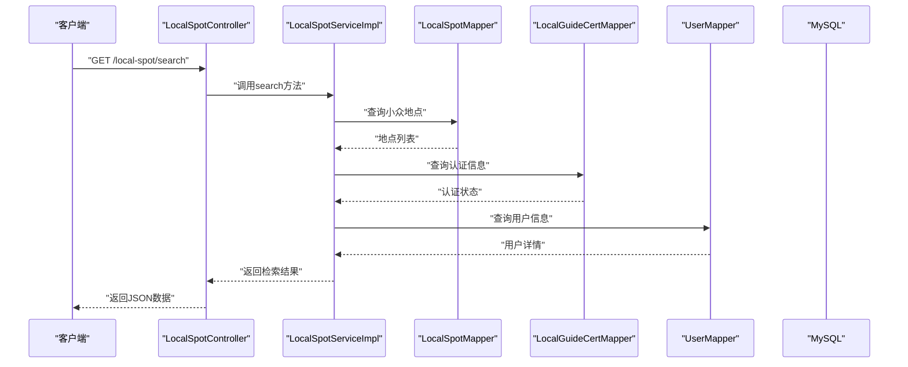
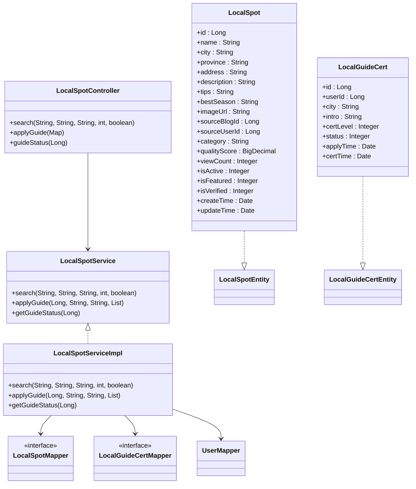
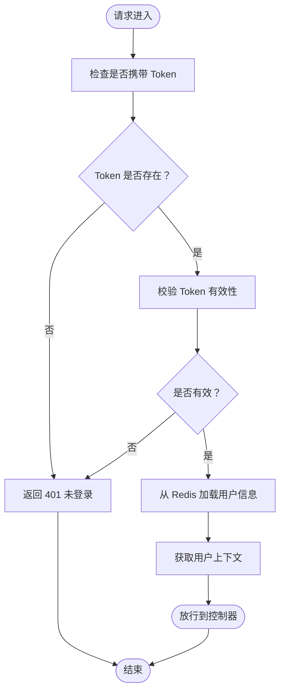
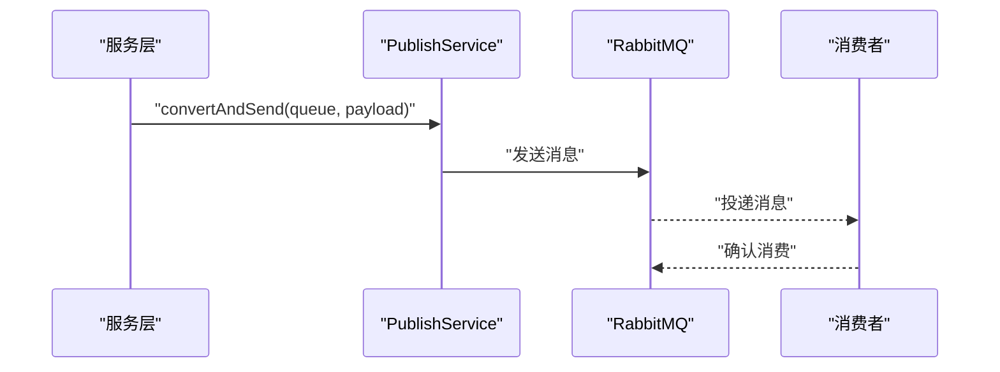

# 后端开发

<cite>
**本文引用的文件**
- [TravelSocialApplication.java](file://springboot-travel-social/src/main/java/com/cxx/TravelSocialApplication.java)
- [pom.xml](file://springboot-travel-social/pom.xml)
- [application.properties](file://springboot-travel-social/src/main/resources/application.properties)
- [MybatisPlusConfig.java](file://springboot-travel-social/src/main/java/com/cxx/config/MybatisPlusConfig.java)
- [RedisConfig.java](file://springboot-travel-social/src/main/java/com/cxx/config/RedisConfig.java)
- [CorsFilter.java](file://springboot-travel-social/src/main/java/com/cxx/config/CorsFilter.java)
- [MvcConfig.java](file://springboot-travel-social/src/main/java/com/cxx/config/MvcConfig.java)
- [RabbitMqConfig.java](file://springboot-travel-social/src/main/java/com/cxx/config/RabbitMqConfig.java)
- [JwtUtil.java](file://springboot-travel-social/src/main/java/com/cxx/utils/JwtUtil.java)
- [LoginInterceptor.java](file://springboot-travel-social/src/main/java/com/cxx/utils/LoginInterceptor.java)
- [UserController.java](file://springboot-travel-social/src/main/java/com/cxx/controller/UserController.java)
- [User.java](file://springboot-travel-social/src/main/java/com/cxx/entity/User.java)
- [UserMapper.java](file://springboot-travel-social/src/main/java/com/cxx/mapper/UserMapper.java)
- [UserServiceImpl.java](file://springboot-travel-social/src/main/java/com/cxx/service/impl/UserServiceImpl.java)
- [GoodsController.java](file://springboot-travel-social/src/main/java/com/cxx/controller/GoodsController.java)
- [GoodsReviewService.java](file://springboot-travel-social/src/main/java/com/cxx/service/GoodsReviewService.java)
- [GoodsReviewServiceImpl.java](file://springboot-travel-social/src/main/java/com/cxx/service/impl/GoodsReviewServiceImpl.java)
- [GoodsReviewMapper.java](file://springboot-travel-social/src/main/java/com/cxx/mapper/GoodsReviewMapper.java)
- [GoodsReview.java](file://springboot-travel-social/src/main/java/com/cxx/entity/GoodsReview.java)
- [GoodsService.java](file://springboot-travel-social/src/main/java/com/cxx/service/GoodsService.java)
- [GoodsServiceImpl.java](file://springboot-travel-social/src/main/java/com/cxx/service/impl/GoodsServiceImpl.java)
- [Goods.java](file://springboot-travel-social/src/main/java/com/cxx/entity/Goods.java)
- [UserHolder.java](file://springboot-travel-social/src/main/java/com/cxx/utils/UserHolder.java)
- [UserDTO.java](file://springboot-travel-social/src/main/java/com/cxx/dto/UserDTO.java)
- [PublishService.java](file://springboot-travel-social/src/main/java/com/cxx/rabbitmq/PublishService.java)
- [DeepSeekService.java](file://springboot-travel-social/src/main/java/com/cxx/service/DeepSeekService.java)
- [DeepSeekServiceImpl.java](file://springboot-travel-social/src/main/java/com/cxx/service/impl/DeepSeekServiceImpl.java)
- [ZhipuConfig.java](file://springboot-travel-social/src/main/java/com/cxx/config/ZhipuConfig.java)
- [ZhipuController.java](file://springboot-travel-social/src/main/java/com/cxx/controller/ZhipuController.java)
- [ZhipuUtils.java](file://springboot-travel-social/src/main/java/com/cxx/utils/ZhipuUtils.java)
- [ChatRequest.java](file://springboot-travel-social/src/main/java/com/cxx/dto/ChatRequest.java)
- [ChatResponse.java](file://springboot-travel-social/src/main/java/com/cxx/dto/ChatResponse.java)
- [XingHuoConfig.java](file://springboot-travel-social/src/main/java/com/cxx/config/XingHuoConfig.java)
- [AIController.java](file://springboot-travel-social/src/main/java/com/cxx/controller/AIController.java)
- [UserPreferenceController.java](file://springboot-travel-social/src/main/java/com/cxx/controller/UserPreferenceController.java)
- [ItineraryController.java](file://springboot-travel-social/src/main/java/com/cxx/controller/ItineraryController.java)
- [UserPreferenceMapper.xml](file://springboot-travel-social/src/main/resources/com/cxx/mapper/UserPreferenceMapper.xml)
- [UserPreference.java](file://springboot-travel-social/src/main/java/com/cxx/entity/UserPreference.java)
- [Itinerary.java](file://springboot-travel-social/src/main/java/com/cxx/entity/Itinerary.java)
- [ChatRecord.java](file://springboot-travel-social/src/main/java/com/cxx/entity/ChatRecord.java)
- [ChatSession.java](file://springboot-travel-social/src/main/java/com/cxx/entity/ChatSession.java)
- [UserPreferenceService.java](file://springboot-travel-social/src/main/java/com/cxx/service/UserPreferenceService.java)
- [UserPreferenceServiceImpl.java](file://springboot-travel-social/src/main/java/com/cxx/service/impl/UserPreferenceServiceImpl.java)
- [UserPreferenceMapper.java](file://springboot-travel-social/src/main/java/com/cxx/mapper/UserPreferenceMapper.java)
- [ItineraryMapper.java](file://springboot-travel-social/src/main/java/com/cxx/mapper/ItineraryMapper.java)
- [ChatRecordMapper.java](file://springboot-travel-social/src/main/java/com/cxx/mapper/ChatRecordMapper.java)
- [ActivityController.java](file://springboot-travel-social/src/main/java/com/cxx/controller/ActivityController.java)
- [ActivityApplyController.java](file://springboot-travel-social/src/main/java/com/cxx/controller/ActivityApplyController.java)
- [AttractionsController.java](file://springboot-travel-social/src/main/java/com/cxx/controller/AttractionsController.java)
- [BlogController.java](file://springboot-travel-social/src/main/java/com/cxx/controller/BlogController.java)
- [CartController.java](file://springboot-travel-social/src/main/java/com/cxx/controller/CartController.java)
- [Activity.java](file://springboot-travel-social/src/main/java/com/cxx/entity/Activity.java)
- [ActivityApply.java](file://springboot-travel-social/src/main/java/com/cxx/entity/ActivityApply.java)
- [Attractions.java](file://springboot-travel-social/src/main/java/com/cxx/entity/Attractions.java)
- [Blog.java](file://springboot-travel-social/src/main/java/com/cxx/entity/Blog.java)
- [Cart.java](file://springboot-travel-social/src/main/java/com/cxx/entity/Cart.java)
- [ActivityMapper.java](file://springboot-travel-social/src/main/java/com/cxx/mapper/ActivityMapper.java)
- [ActivityApplyMapper.java](file://springboot-travel-social/src/main/java/com/cxx/mapper/ActivityApplyMapper.java)
- [AttractionsMapper.java](file://springboot-travel-social/src/main/java/com/cxx/mapper/AttractionsMapper.java)
- [BlogMapper.java](file://springboot-travel-social/src/main/java/com/cxx/mapper/BlogMapper.java)
- [RoutePlanningController.java](file://springboot-travel-social/src/main/java/com/cxx/controller/RoutePlanningController.java)
- [RoutePlanningUtils.java](file://springboot-travel-social/src/main/java/com/cxx/utils/RoutePlanningUtils.java)
- [HolidayController.java](file://springboot-travel-social/src/main/java/com/cxx/controller/HolidayController.java)
- [BudgetController.java](file://springboot-travel-social/src/main/java/com/cxx/controller/BudgetController.java)
- [ItineraryCollabController.java](file://springboot-travel-social/src/main/java/com/cxx/controller/ItineraryCollabController.java)
- [TripContextController.java](file://springboot-travel-social/src/main/java/com/cxx/controller/TripContextController.java)
- [CommentsController.java](file://springboot-travel-social/src/main/java/com/cxx/controller/CommentsController.java)
- [HolidayConfig.java](file://springboot-travel-social/src/main/java/com/cxx/entity/HolidayConfig.java)
- [ItineraryCollabRoom.java](file://springboot-travel-social/src/main/java/com/cxx/entity/ItineraryCollabRoom.java)
- [ItineraryCollabMember.java](file://springboot-travel-social/src/main/java/com/cxx/entity/ItineraryCollabMember.java)
- [Comments.java](file://springboot-travel-social/src/main/java/com/cxx/entity/Comments.java)
- [CommentsService.java](file://springboot-travel-social/src/main/java/com/cxx/service/CommentsService.java)
- [CommentsServiceImpl.java](file://springboot-travel-social/src/main/java/com/cxx/service/impl/CommentsServiceImpl.java)
- [CommentsMapper.java](file://springboot-travel-social/src/main/java/com/cxx/mapper/CommentsMapper.java)
- [CommentsMapper.xml](file://springboot-travel-social/src/main/resources/com/cxx/mapper/CommentsMapper.xml)
- [WeatherService.java](file://springboot-travel-social/src/main/java/com/cxx/service/WeatherService.java)
- [WeatherServiceImpl.java](file://springboot-travel-social/src/main/java/com/cxx/service/impl/WeatherServiceImpl.java)
- [WeatherController.java](file://springboot-travel-social/src/main/java/com/cxx/controller/WeatherController.java)
- [Weather.java](file://springboot-travel-social/src/main/java/com/cxx/entity/Weather.java)
- [WeatherMapper.java](file://springboot-travel-social/src/main/java/com/cxx/mapper/WeatherMapper.java)
- [WeatherMapper.xml](file://springboot-travel-social/src/main/resources/com/cxx/mapper/WeatherMapper.xml)
- [HolidayService.java](file://springboot-travel-social/src/main/java/com/cxx/service/HolidayService.java)
- [HolidayServiceImpl.java](file://springboot-travel-social/src/main/java/com/cxx/service/impl/HolidayServiceImpl.java)
- [HolidayMapper.java](file://springboot-travel-social/src/main/java/com/cxx/mapper/HolidayMapper.java)
- [HolidayMapper.xml](file://springboot-travel-social/src/main/resources/com/cxx/mapper/HolidayMapper.xml)
- [BudgetService.java](file://springboot-travel-social/src/main/java/com/cxx/service/BudgetService.java)
- [BudgetServiceImpl.java](file://springboot-travel-social/src/main/java/com/cxx/service/impl/BudgetServiceImpl.java)
- [BudgetMapper.java](file://springboot-travel-social/src/main/java/com/cxx/mapper/BudgetMapper.java)
- [BudgetMapper.xml](file://springboot-travel-social/src/main/resources/com/cxx/mapper/BudgetMapper.xml)
- [ItineraryCollabService.java](file://springboot-travel-social/src/main/java/com/cxx/service/ItineraryCollabService.java)
- [ItineraryCollabServiceImpl.java](file://springboot-travel-social/src/main/java/com/cxx/service/impl/ItineraryCollabServiceImpl.java)
- [ItineraryCollabMapper.java](file://springboot-travel-social/src/main/java/com/cxx/mapper/ItineraryCollabMapper.java)
- [ItineraryCollabMapper.xml](file://springboot-travel-social/src/main/resources/com/cxx/mapper/ItineraryCollabMapper.xml)
- [TripContextService.java](file://springboot-travel-social/src/main/java/com/cxx/service/TripContextService.java)
- [TripContextServiceImpl.java](file://springboot-travel-social/src/main/java/com/cxx/service/impl/TripContextServiceImpl.java)
- [TripContextMapper.java](file://springboot-travel-social/src/main/java/com/cxx/mapper/TripContextMapper.java)
- [TripContextMapper.xml](file://springboot-travel-social/src/main/resources/com/cxx/mapper/TripContextMapper.xml)
- [UserPreferenceService.java](file://springboot-travel-social/src/main/java/com/cxx/service/UserPreferenceService.java)
- [UserPreferenceServiceImpl.java](file://springboot-travel-social/src/main/java/com/cxx/service/impl/UserPreferenceServiceImpl.java)
- [UserPreferenceMapper.java](file://springboot-travel-social/src/main/java/com/cxx/mapper/UserPreferenceMapper.java)
- [UserPreferenceMapper.xml](file://springboot-travel-social/src/main/resources/com/cxx/mapper/UserPreferenceMapper.xml)
- [LocalSpotController.java](file://springboot-travel-social/src/main/java/com/cxx/controller/LocalSpotController.java)
- [LocalSpotService.java](file://springboot-travel-social/src/main/java/com/cxx/service/LocalSpotService.java)
- [LocalSpotServiceImpl.java](file://springboot-travel-social/src/main/java/com/cxx/service/impl/LocalSpotServiceImpl.java)
- [LocalSpot.java](file://springboot-travel-social/src/main/java/com/cxx/entity/LocalSpot.java)
- [LocalGuideCert.java](file://springboot-travel-social/src/main/java/com/cxx/entity/LocalGuideCert.java)
- [LocalSpotMapper.java](file://springboot-travel-social/src/main/java/com/cxx/mapper/LocalSpotMapper.java)
- [LocalGuideCertMapper.java](file://springboot-travel-social/src/main/java/com/cxx/mapper/LocalGuideCertMapper.java)
- [budget.sql](file://springboot-travel-social/src/main/resources/sql/budget.sql)
- [holiday_config.sql](file://springboot-travel-social/src/main/resources/sql/holiday_config.sql)
- [itinerary_collab.sql](file://springboot-travel-social/src/main/resources/sql/itinerary_collab.sql)
- [local_spot.sql](file://springboot-travel-social/src/main/resources/sql/local_spot.sql)
- [nearby_services.sql](file://springboot-travel-social/src/main/resources/sql/nearby_services.sql)
- [route_order.sql](file://springboot-travel-social/src/main/resources/sql/route_order.sql)
- [insurance_order.sql](file://springboot-travel-social/src/main/resources/sql/insurance_order.sql)
</cite>

## 更新摘要
**所做更改**
- 新增本地向导与小众地点系统：LocalSpotController提供小众地点检索和本地向导认证功能，支持城市筛选、关键词搜索、类别过滤、精选推荐等
- 新增本地向导认证机制：支持用户申请本地向导认证，包含审核状态管理、认证等级体系、城市专长管理
- 新增本地小众地点知识库：支持地点描述、实用贴士、最佳游览季节、类别分类、质量评分等丰富信息
- 新增AI上下文生成：为每个检索结果生成详细的AI上下文文本，用于后续AI对话和推荐
- 新增数据库表支持：新增local_spot和local_guide_cert两张业务表，包含完整的索引和测试数据
- 新增服务层实现：LocalSpotServiceImpl提供完整的检索逻辑、认证申请处理、状态查询功能
- 新增实体类设计：LocalSpot和LocalGuideCert实体类支持完整的业务字段和注解配置
- 新增API接口设计：提供/local-spot/search和/local-guide/apply等RESTful接口

## 目录
1. [简介](#简介)
2. [项目结构](#项目结构)
3. [核心组件](#核心组件)
4. [架构总览](#架构总览)
5. [详细组件分析](#详细组件分析)
6. [依赖分析](#依赖分析)
7. [性能考虑](#性能考虑)
8. [故障排查指南](#故障排查指南)
9. [结论](#结论)
10. [附录](#附录)

## 简介
本文件面向后端开发团队与技术管理者，系统化梳理 Spring Boot 后端服务的开发规范与最佳实践。围绕 MVC 架构模式，详细说明控制器层、服务层、持久层的设计原则；结合 MyBatis-Plus 的使用方法，覆盖实体类设计、Mapper 接口与 XML 映射配置；深入解析 JWT 认证机制的生成、验证与刷新流程；总结 Redis 缓存策略在热点数据、分布式锁与会话管理中的应用；阐述 RabbitMQ 在异步任务与事件驱动架构中的实践；最后给出 API 接口设计规范与文档示例。

**更新** 新增本地向导与小众地点系统，实现完整的本地达人推荐和认证机制。新增的LocalSpotController、LocalSpotService、LocalSpot实体等组件提供了基于城市、关键词、类别的智能地点检索功能，支持精选推荐、AI上下文生成、认证状态管理等核心业务场景。同时新增的数据库表local_spot和local_guide_cert为整个系统提供了丰富的本地旅游知识库和认证管理体系。

## 项目结构
后端采用标准 Spring Boot 分层组织方式：
- 配置层：负责跨域、拦截器、MyBatis-Plus、Redis、RabbitMQ、Swagger、AI API等全局配置
- 控制器层：对外暴露 REST API，处理请求参数与响应封装
- 服务层：编排业务逻辑，协调持久层与外部服务
- 持久层：基于 MyBatis-Plus 实现，Mapper 接口与 XML 映射文件分离
- 工具与常量：JWT、拦截器、Redis 常量、工具类等
- MQ 组件：发布者与监听器（监听器位于同目录下）
- 实体与 VO：数据库实体与对外展示模型
- AI服务层：DeepSeek和Zhipu AI服务实现，提供智能对话能力

```mermaid
graph TB
subgraph "配置层"
C1["MvcConfig<br/>拦截器配置"]
C2["MybatisPlusConfig<br/>分页插件"]
C3["RedisConfig<br/>Redisson 客户端"]
C4["RabbitMqConfig<br/>队列声明"]
C5["CorsFilter<br/>跨域配置"]
C6["ZhipuConfig<br/>智谱AI配置"]
C7["XingHuoConfig<br/>讯飞配置"]
end
subgraph "控制器层"
K1["UserController<br/>用户相关接口"]
K2["GoodsController<br/>商品与评价接口"]
K3["ZhipuController<br/>智谱AI对话接口"]
K4["BigModelController<br/>大模型AI接口"]
K5["AIController<br/>AI聊天与会话管理"]
K6["UserPreferenceController<br/>用户旅行偏好管理"]
K7["ItineraryController<br/>AI行程管理"]
K8["ActivityController<br/>活动结伴管理"]
K9["ActivityApplyController<br/>活动申请审核"]
K10["AttractionsController<br/>景点推荐"]
K11["BlogController<br/>游记管理"]
K12["CartController<br/>购物车管理"]
K13["RoutePlanningController<br/>路线规划"]
K14["HolidayController<br/>节假日查询"]
K15["BudgetController<br/>预算估算"]
K16["ItineraryCollabController<br/>行程协作"]
K17["TripContextController<br/>行程上下文"]
K18["CommentsController<br/>游记评论"]
K19["LocalSpotController<br/>本地小众地点"]
end
subgraph "服务层"
S1["UserServiceImpl<br/>用户业务逻辑"]
S2["GoodsReviewServiceImpl<br/>商品评价业务逻辑"]
S3["GoodsServiceImpl<br/>商品业务逻辑"]
S4["DeepSeekService<br/>DeepSeek AI服务"]
S5["ZhipuUtils<br/>智谱AI工具类"]
S6["UserPreferenceServiceImpl<br/>用户偏好分析服务"]
S7["ActivityService<br/>活动业务逻辑"]
S8["ActivityApplyService<br/>活动申请业务逻辑"]
S9["BlogService<br/>游记业务逻辑"]
S10["CartService<br/>购物车业务逻辑"]
S11["RoutePlanningUtils<br/>路线规划工具类"]
S12["WeatherService<br/>天气服务"]
S13["HolidayService<br/>节假日服务"]
S14["BudgetService<br/>预算服务"]
S15["ItineraryCollabService<br/>行程协作服务"]
S16["TripContextService<br/>行程上下文服务"]
S17["CommentsService<br/>评论服务"]
S18["LocalSpotServiceImpl<br/>本地地点服务"]
end
subgraph "持久层"
M1["UserMapper<br/>基础 CRUD"]
M2["GoodsReviewMapper<br/>评价查询"]
M3["GoodsMapper<br/>商品查询"]
M4["UserPreferenceMapper.xml<br/>用户偏好SQL"]
M5["ItineraryMapper<br/>行程管理"]
M6["ChatRecordMapper<br/>聊天记录"]
M7["ChatSessionMapper<br/>会话管理"]
M8["ActivityMapper<br/>活动管理"]
M9["ActivityApplyMapper<br/>活动申请"]
M10["AttractionsMapper<br/>景点查询"]
M11["BlogMapper<br/>游记管理"]
M12["CartMapper<br/>购物车管理"]
M13["WeatherMapper<br/>天气查询"]
M14["HolidayMapper<br/>节假日配置"]
M15["BudgetMapper<br/>预算计算"]
M16["ItineraryCollabMapper<br/>协作行程"]
M17["CommentsMapper<br/>评论管理"]
M18["LocalSpotMapper<br/>小众地点"]
M19["LocalGuideCertMapper<br/>向导认证"]
end
subgraph "工具与常量"
U1["JwtUtil<br/>JWT 生成"]
U2["LoginInterceptor<br/>登录校验"]
U3["UserHolder<br/>用户上下文"]
U4["RoutePlanningUtils<br/>路线规划工具"]
end
subgraph "消息队列"
Q1["PublishService<br/>消息发布"]
end
subgraph "实体与映射"
E1["User<br/>用户实体"]
E2["GoodsReview<br/>商品评价实体"]
E3["Goods<br/>商品实体"]
E4["UserPreference<br/>用户偏好实体"]
E5["Itinerary<br/>AI行程实体"]
E6["ChatRecord<br/>聊天记录实体"]
E7["ChatSession<br/>聊天会话实体"]
E8["ChatRequest<br/>聊天请求DTO"]
E9["ChatResponse<br/>聊天响应DTO"]
E10["Activity<br/>活动实体"]
E11["ActivityApply<br/>活动申请实体"]
E12["Attractions<br/>景点实体"]
E13["Blog<br/>游记实体"]
E14["Cart<br/>购物车实体"]
E15["Weather<br/>天气实体"]
E16["HolidayConfig<br/>节假日配置"]
E17["ItineraryCollabRoom<br/>协作房间"]
E18["ItineraryCollabMember<br/>协作成员"]
E19["Comments<br/>评论实体"]
E20["LocalSpot<br/>本地小众地点"]
E21["LocalGuideCert<br/>本地向导认证"]
end
K1 --> S1
K2 --> S2
K2 --> S3
K3 --> S5
K4 --> S4
K5 --> S4
K6 --> S6
K7 --> M5
K8 --> S7
K9 --> S8
K10 --> M10
K11 --> S9
K12 --> S10
K13 --> S11
K14 --> S12
K15 --> S14
K16 --> S15
K17 --> S16
K18 --> S17
K19 --> S18
S1 --> M1
S2 --> M2
S3 --> M3
S4 --> E8
S4 --> E9
S6 --> M4
S7 --> M8
S8 --> M9
S9 --> M11
S10 --> M12
S11 --> E15
S12 --> M14
S14 --> M16
S15 --> M17
S16 --> M18
S17 --> M19
S18 --> M18
S18 --> M19
S18 --> M20
S1 --> U1
S1 --> U2
S2 --> U3
K1 --> U2
K2 --> U3
K5 --> E6
K5 --> E7
K6 --> E4
K7 --> E5
K8 --> E10
K9 --> E11
K10 --> E12
K11 --> E13
K12 --> E14
K13 --> E15
K14 --> E16
K16 --> E17
K16 --> E18
K18 --> E19
K19 --> E20
K19 --> E21
Q1 --> C4
S1 --> Q1
C2 --> M1
C2 --> M2
C2 --> M3
C2 --> M4
C2 --> M5
C2 --> M6
C2 --> M7
C2 --> M8
C2 --> M9
C2 --> M10
C2 --> M11
C2 --> M12
C2 --> M13
C2 --> M14
C2 --> M15
C2 --> M16
C2 --> M17
C2 --> M18
C2 --> M19
C2 --> M20
C3 --> S1
C3 --> S2
C1 --> K1
C1 --> K2
C6 --> K3
C6 --> K4
C7 --> K4
```

**图表来源**
- [MvcConfig.java:12-75](file://springboot-travel-social/src/main/java/com/cxx/config/MvcConfig.java#L12-L75)
- [MybatisPlusConfig.java:10-19](file://springboot-travel-social/src/main/java/com/cxx/config/MybatisPlusConfig.java#L10-L19)
- [RedisConfig.java:17-32](file://springboot-travel-social/src/main/java/com/cxx/config/RedisConfig.java#L17-L32)
- [RabbitMqConfig.java:16-31](file://springboot-travel-social/src/main/java/com/cxx/config/RabbitMqConfig.java#L16-L31)
- [UserController.java:31-136](file://springboot-travel-social/src/main/java/com/cxx/controller/UserController.java#L31-L136)
- [GoodsController.java:12-51](file://springboot-travel-social/src/main/java/com/cxx/controller/GoodsController.java#L12-L51)
- [ZhipuController.java:17-98](file://springboot-travel-social/src/main/java/com/cxx/controller/ZhipuController.java#L17-L98)
- [DeepSeekService.java:7-46](file://springboot-travel-social/src/main/java/com/cxx/service/DeepSeekService.java#L7-L46)
- [ZhipuConfig.java:12-19](file://springboot-travel-social/src/main/java/com/cxx/config/ZhipuConfig.java#L12-L19)
- [AIController.java:19-610](file://springboot-travel-social/src/main/java/com/cxx/controller/AIController.java#L19-L610)
- [UserPreferenceController.java:16-56](file://springboot-travel-social/src/main/java/com/cxx/controller/UserPreferenceController.java#L16-L56)
- [ItineraryController.java:19-123](file://springboot-travel-social/src/main/java/com/cxx/controller/ItineraryController.java#L19-L123)
- [UserPreferenceMapper.xml:1-127](file://springboot-travel-social/src/main/resources/com/cxx/mapper/UserPreferenceMapper.xml#L1-127)
- [UserPreference.java:18-74](file://springboot-travel-social/src/main/java/com/cxx/entity/UserPreference.java#L18-L74)
- [Itinerary.java:16-65](file://springboot-travel-social/src/main/java/com/cxx/entity/Itinerary.java#L16-L65)
- [ChatRecord.java:9-48](file://springboot-travel-social/src/main/java/com/cxx/entity/ChatRecord.java#L9-L48)
- [ChatSession.java:9-44](file://springboot-travel-social/src/main/java/com/cxx/entity/ChatSession.java#L9-L44)
- [ActivityController.java:1-178](file://springboot-travel-social/src/main/java/com/cxx/controller/ActivityController.java#L1-L178)
- [ActivityApplyController.java:1-88](file://springboot-travel-social/src/main/java/com/cxx/controller/ActivityApplyController.java#L1-L88)
- [AttractionsController.java:1-61](file://springboot-travel-social/src/main/java/com/cxx/controller/AttractionsController.java#L1-L61)
- [BlogController.java:1-219](file://springboot-travel-social/src/main/java/com/cxx/controller/BlogController.java#L1-L219)
- [CartController.java:1-93](file://springboot-travel-social/src/main/java/com/cxx/controller/CartController.java#L1-L93)
- [RoutePlanningController.java:1-31](file://springboot-travel-social/src/main/java/com/cxx/controller/RoutePlanningController.java#L1-L31)
- [HolidayController.java:1-42](file://springboot-travel-social/src/main/java/com/cxx/controller/HolidayController.java#L1-L42)
- [BudgetController.java:1-51](file://springboot-travel-social/src/main/java/com/cxx/controller/BudgetController.java#L1-L51)
- [ItineraryCollabController.java:1-139](file://springboot-travel-social/src/main/java/com/cxx/controller/ItineraryCollabController.java#L1-L139)
- [TripContextController.java:1-45](file://springboot-travel-social/src/main/java/com/cxx/controller/TripContextController.java#L1-L45)
- [CommentsController.java:1-68](file://springboot-travel-social/src/main/java/com/cxx/controller/CommentsController.java#L1-L68)
- [LocalSpotController.java:1-65](file://springboot-travel-social/src/main/java/com/cxx/controller/LocalSpotController.java#L1-L65)
- [LocalSpotService.java:1-35](file://springboot-travel-social/src/main/java/com/cxx/service/LocalSpotService.java#L1-L35)
- [LocalSpotServiceImpl.java:1-229](file://springboot-travel-social/src/main/java/com/cxx/service/impl/LocalSpotServiceImpl.java#L1-L229)
- [LocalSpot.java:1-36](file://springboot-travel-social/src/main/java/com/cxx/entity/LocalSpot.java#L1-L36)
- [LocalGuideCert.java:1-25](file://springboot-travel-social/src/main/java/com/cxx/entity/LocalGuideCert.java#L1-L25)

**章节来源**
- [TravelSocialApplication.java:16-51](file://springboot-travel-social/src/main/java/com/cxx/TravelSocialApplication.java#L16-L51)
- [pom.xml:16-182](file://springboot-travel-social/pom.xml#L16-L182)
- [application.properties:1-64](file://springboot-travel-social/src/main/resources/application.properties#L1-L64)

## 核心组件
- 应用入口与启动：通过主类实现命令行运行，启动时自动注入 WebSocket 上下文，并执行数据库字段检查与补丁逻辑
- 配置中心：集中管理数据库、Redis、RabbitMQ、邮件、日志、AI API等环境变量
- ORM 框架：MyBatis-Plus 提供分页插件与通用 Mapper，Mapper 扫描路径统一配置
- 缓存与分布式能力：Redis 与 Redisson 客户端，支持分布式锁与会话缓存
- 消息中间件：RabbitMQ 队列声明与消息发布
- 安全与认证：JWT 令牌生成；拦截器链实现登录态校验与 Token 刷新
- 跨域与静态资源：全局 CORS 配置与静态资源上传大小限制
- 商品评论服务：新增商品评价查询与提交功能，完善电商相关业务
- **AI智能服务**：新增DeepSeek和Zhipu AI API配置，提供智能对话与多模态处理能力
- **AI聊天与会话管理**：新增AIController实现完整的聊天会话管理，支持多轮对话、会话持久化、行程生成等功能
- **用户旅行偏好分析**：新增UserPreferenceController和UserPreferenceMapper.xml实现用户偏好快照生成与管理
- **AI行程管理**：新增ItineraryController和Itinerary实体实现AI生成行程的CRUD操作
- **活动结伴模块**：新增ActivityController和ActivityApplyController实现活动发布、申请、审核的完整流程
- **景点推荐模块**：新增AttractionsController提供基于地理位置的景点推荐功能
- **游记管理模块**：新增BlogController实现游记的发布、点赞、搜索、分页等功能
- **购物车模块**：新增CartController提供商品购物车的增删改查和支付功能
- **路线规划系统**：新增RoutePlanningController和RoutePlanningUtils提供智能路线规划功能
- **节假日配置系统**：新增HolidayController和HolidayConfig实体提供节假日查询和配置功能
- **预算智能拆解**：新增BudgetController提供预算估算和重新计算功能
- **行程协作系统**：新增ItineraryCollabController和相关实体实现多人行程协作功能
- **行程上下文聚合**：新增TripContextController整合天气、节假日、AI摘要信息
- **游记评论系统**：新增CommentsController和Comments实体实现游记评论管理功能
- **本地向导与小众地点系统**：新增LocalSpotController、LocalSpotService、LocalSpot实体实现本地达人推荐和认证功能
- **数据库字段增强**：新增pay_status字段支持支付状态管理，完善订单支付流程
- **个性化AI推荐**：新增UserPreferenceController实现用户偏好快照管理，支持个性化AI推荐
- **天气节假日感知**：新增TripContextController和TripContextServiceImpl实现天气和节假日信息聚合
- **预算智能拆解系统**：新增BudgetController和BudgetServiceImpl实现精准预算估算和动态重算
- **AI行程规划系统**：新增ItineraryController和Itinerary实体实现AI生成行程的完整生命周期管理
- **用户偏好系统**：新增UserPreferenceController和UserPreference实体实现用户旅行偏好的智能分析和快照管理
- **行程协作系统**：新增ItineraryCollabController和ItineraryCollabRoom、ItineraryCollabMember实体实现多人协作行程的完整功能
- **本地小众地点知识库**：新增LocalSpot实体和LocalSpotMapper提供丰富的地点信息和检索功能
- **本地向导认证体系**：新增LocalGuideCert实体和LocalGuideCertMapper实现完整的认证管理和状态跟踪

**更新** 新增本地向导与小众地点系统，实现完整的本地达人推荐和认证机制。新增的LocalSpotController提供小众地点检索功能，支持城市筛选、关键词搜索、类别过滤、精选推荐等；LocalSpotService实现完整的业务逻辑，包括地点检索、认证申请、状态查询；LocalSpot实体和LocalGuideCert实体提供丰富的业务字段和数据结构支持。

**章节来源**
- [TravelSocialApplication.java:17-50](file://springboot-travel-social/src/main/java/com/cxx/TravelSocialApplication.java#L17-L50)
- [application.properties:1-64](file://springboot-travel-social/src/main/resources/application.properties#L1-L64)
- [MybatisPlusConfig.java:10-19](file://springboot-travel-social/src/main/java/com/cxx/config/MybatisPlusConfig.java#L10-L19)
- [RedisConfig.java:17-32](file://springboot-travel-social/src/main/java/com/cxx/config/RedisConfig.java#L17-L32)
- [RabbitMqConfig.java:16-31](file://springboot-travel-social/src/main/java/com/cxx/config/RabbitMqConfig.java#L16-L31)
- [JwtUtil.java:8-18](file://springboot-travel-social/src/main/java/com/cxx/utils/JwtUtil.java#L8-L18)
- [LoginInterceptor.java:7-17](file://springboot-travel-social/src/main/java/com/cxx/utils/LoginInterceptor.java#L7-L17)
- [GoodsReviewService.java:7-14](file://springboot-travel-social/src/main/java/com/cxx/service/GoodsReviewService.java#L7-L14)
- [GoodsReviewServiceImpl.java:14-38](file://springboot-travel-social/src/main/java/com/cxx/service/impl/GoodsReviewServiceImpl.java#L14-L38)
- [ZhipuConfig.java:12-19](file://springboot-travel-social/src/main/java/com/cxx/config/ZhipuConfig.java#L12-L19)
- [DeepSeekService.java:7-46](file://springboot-travel-social/src/main/java/com/cxx/service/DeepSeekService.java#L7-L46)
- [AIController.java:23-610](file://springboot-travel-social/src/main/java/com/cxx/controller/AIController.java#L23-610)
- [UserPreferenceController.java:21-56](file://springboot-travel-social/src/main/java/com/cxx/controller/UserPreferenceController.java#L21-56)
- [ItineraryController.java:23-123](file://springboot-travel-social/src/main/java/com/cxx/controller/ItineraryController.java#L23-123)
- [ActivityController.java:1-178](file://springboot-travel-social/src/main/java/com/cxx/controller/ActivityController.java#L1-L178)
- [ActivityApplyController.java:1-88](file://springboot-travel-social/src/main/java/com/cxx/controller/ActivityApplyController.java#L1-L88)
- [AttractionsController.java:1-61](file://springboot-travel-social/src/main/java/com/cxx/controller/AttractionsController.java#L1-L61)
- [BlogController.java:1-219](file://springboot-travel-social/src/main/java/com/cxx/controller/BlogController.java#L1-L219)
- [CartController.java:1-93](file://springboot-travel-social/src/main/java/com/cxx/controller/CartController.java#L1-L93)
- [RoutePlanningController.java:25-30](file://springboot-travel-social/src/main/java/com/cxx/controller/RoutePlanningController.java#L25-L30)
- [HolidayController.java:35-40](file://springboot-travel-social/src/main/java/com/cxx/controller/HolidayController.java#L35-L40)
- [BudgetController.java:22-42](file://springboot-travel-social/src/main/java/com/cxx/controller/BudgetController.java#L22-L42)
- [ItineraryCollabController.java:41-121](file://springboot-travel-social/src/main/java/com/cxx/controller/ItineraryCollabController.java#L41-L121)
- [TripContextController.java:41-43](file://springboot-travel-social/src/main/java/com/cxx/controller/TripContextController.java#L41-L43)
- [CommentsController.java:31-65](file://springboot-travel-social/src/main/java/com/cxx/controller/CommentsController.java#L31-L65)
- [LocalSpotController.java:17-65](file://springboot-travel-social/src/main/java/com/cxx/controller/LocalSpotController.java#L17-L65)
- [LocalSpotService.java:6-35](file://springboot-travel-social/src/main/java/com/cxx/service/LocalSpotService.java#L6-L35)
- [LocalSpotServiceImpl.java:18-229](file://springboot-travel-social/src/main/java/com/cxx/service/impl/LocalSpotServiceImpl.java#L18-L229)
- [LocalSpot.java:11-36](file://springboot-travel-social/src/main/java/com/cxx/entity/LocalSpot.java#L11-L36)
- [LocalGuideCert.java:10-25](file://springboot-travel-social/src/main/java/com/cxx/entity/LocalGuideCert.java#L10-L25)

## 架构总览
后端采用经典的三层架构（表现层/控制层、领域服务层、数据访问层），配合 Spring 容器进行装配与生命周期管理。请求从控制器进入，经由拦截器链完成鉴权与 Token 刷新，随后调用服务层处理业务，服务层通过 MyBatis-Plus 访问数据库，必要时与 Redis 进行缓存交互，或向 RabbitMQ 发布异步消息。**新增** AI服务层通过REST API与外部AI平台交互，提供智能对话能力。

**图表来源**
- [LocalSpotController.java:20-29](file://springboot-travel-social/src/main/java/com/cxx/controller/LocalSpotController.java#L20-L29)
- [LocalSpotServiceImpl.java:37-140](file://springboot-travel-social/src/main/java/com/cxx/service/impl/LocalSpotServiceImpl.java#L37-L140)
- [LocalSpotMapper.java:1-9](file://springboot-travel-social/src/main/java/com/cxx/mapper/LocalSpotMapper.java#L1-L9)
- [LocalGuideCertMapper.java:1-10](file://springboot-travel-social/src/main/java/com/cxx/mapper/LocalGuideCertMapper.java#L1-L10)
- [UserMapper.java](file://springboot-travel-social/src/main/java/com/cxx/mapper/UserMapper.java)

## 详细组件分析

### MVC 架构与分层设计
- 控制器层（Controller）：以 UserController、GoodsController、**新增的AIController**、**新增的ActivityController**、**新增的ActivityApplyController**、**新增的AttractionsController**、**新增的BlogController**、**新增的CartController**、**新增的RoutePlanningController**、**新增的HolidayController**、**新增的BudgetController**、**新增的ItineraryCollabController**、**新增的TripContextController**、**新增的CommentsController**、**新增的LocalSpotController**为例，UserController 处理用户相关接口，GoodsController 处理商品和评价相关接口，**AIController提供AI聊天、会话管理和行程生成功能**，**ActivityController提供活动发布、申请、审核的完整流程**，**ActivityApplyController提供活动申请和审核功能**，**AttractionsController提供景点推荐功能**，**BlogController提供游记管理功能**，**CartController提供购物车管理功能**，**RoutePlanningController提供路线规划功能**，**HolidayController提供节假日查询功能**，**BudgetController提供预算估算功能**，**ItineraryCollabController提供行程协作功能**，**TripContextController提供行程上下文聚合功能**，**CommentsController提供游记评论功能**，**LocalSpotController提供本地小众地点检索和本地向导认证功能**，统一返回封装对象，便于前端消费
- 服务层（Service）：UserServiceImpl 实现用户业务编排，GoodsReviewServiceImpl 实现商品评价业务逻辑，**DeepSeekService提供DeepSeek AI对话服务**，**ChatRecordService处理聊天会话和记录管理**，**UserPreferenceServiceImpl实现用户偏好分析服务**，**ActivityService处理活动业务逻辑**，**ActivityApplyService处理活动申请业务逻辑**，**BlogService处理游记业务逻辑**，**CartService处理购物车业务逻辑**，**RoutePlanningUtils提供路线规划工具类**，**WeatherService处理天气查询业务**，**HolidayService处理节假日配置业务**，**BudgetService处理预算计算业务**，**ItineraryCollabService处理行程协作业务**，**TripContextService处理行程上下文聚合业务**，**CommentsService处理评论业务逻辑**，**LocalSpotServiceImpl实现本地地点检索和认证申请业务**，包含同步、异步、带参数等多种调用方式
- 持久层（Persistence）：UserMapper 和 GoodsReviewMapper 继承 MyBatis-Plus 基类，提供自定义 SQL 方法；**UserPreferenceMapper.xml包含复杂的用户偏好分析SQL**；**ActivityMapper和ActivityApplyMapper处理活动相关数据**；**AttractionsMapper处理景点数据**；**BlogMapper处理游记数据**；**CartMapper处理购物车数据**；**WeatherMapper处理天气数据**；**HolidayMapper处理节假日配置**；**BudgetMapper处理预算计算**；**ItineraryCollabMapper处理协作行程**；**CommentsMapper处理评论数据**；**LocalSpotMapper和LocalGuideCertMapper处理本地地点和认证数据**；实体类使用注解标注主键、逻辑删除、自动填充等

**图表来源**
- [LocalSpotController.java:13-65](file://springboot-travel-social/src/main/java/com/cxx/controller/LocalSpotController.java#L13-L65)
- [LocalSpotService.java:6-35](file://springboot-travel-social/src/main/java/com/cxx/service/LocalSpotService.java#L6-L35)
- [LocalSpotServiceImpl.java:20-229](file://springboot-travel-social/src/main/java/com/cxx/service/impl/LocalSpotServiceImpl.java#L20-L229)
- [LocalSpot.java:13-36](file://springboot-travel-social/src/main/java/com/cxx/entity/LocalSpot.java#L13-L36)
- [LocalGuideCert.java:12-25](file://springboot-travel-social/src/main/java/com/cxx/entity/LocalGuideCert.java#L12-L25)
- [LocalSpotMapper.java:1-9](file://springboot-travel-social/src/main/java/com/cxx/mapper/LocalSpotMapper.java#L1-L9)
- [LocalGuideCertMapper.java:1-10](file://springboot-travel-social/src/main/java/com/cxx/mapper/LocalGuideCertMapper.java#L1-L10)

**章节来源**
- [LocalSpotController.java:1-65](file://springboot-travel-social/src/main/java/com/cxx/controller/LocalSpotController.java#L1-L65)
- [LocalSpotService.java:1-35](file://springboot-travel-social/src/main/java/com/cxx/service/LocalSpotService.java#L1-L35)
- [LocalSpotServiceImpl.java:1-229](file://springboot-travel-social/src/main/java/com/cxx/service/impl/LocalSpotServiceImpl.java#L1-L229)
- [LocalSpot.java:1-36](file://springboot-travel-social/src/main/java/com/cxx/entity/LocalSpot.java#L1-L36)
- [LocalGuideCert.java:1-25](file://springboot-travel-social/src/main/java/com/cxx/entity/LocalGuideCert.java#L1-L25)
- [LocalSpotMapper.java:1-9](file://springboot-travel-social/src/main/java/com/cxx/mapper/LocalSpotMapper.java#L1-L9)
- [LocalGuideCertMapper.java:1-10](file://springboot-travel-social/src/main/java/com/cxx/mapper/LocalGuideCertMapper.java#L1-L10)

### MyBatis-Plus 使用规范
- 配置与扫描：启用分页插件与 Mapper 扫描路径，确保 XML 映射文件被正确加载
- 实体设计：使用注解标识主键、逻辑删除、自动填充字段，提升可维护性与一致性
- Mapper 接口：继承 BaseMapper，按需扩展自定义方法；复杂查询建议通过 XML 或条件构造器实现
- XML 映射：将 SQL 与接口分离，便于版本控制与性能优化

**更新** UserPreferenceMapper.xml 包含复杂的用户行为分析SQL，涵盖游记地点统计、标签分析、酒店偏好、消费水平等多个维度，通过UNION操作和子查询实现MySQL 5.7+兼容的标签拆分功能。新增的活动、景点、游记、购物车、天气、节假日、预算、协作行程、评论、本地地点、认证等相关Mapper支持完整的CRUD操作。

**章节来源**
- [MybatisPlusConfig.java:10-19](file://springboot-travel-social/src/main/java/com/cxx/config/MybatisPlusConfig.java#L10-L19)
- [application.properties:13-14](file://springboot-travel-social/src/main/resources/application.properties#L13-L14)
- [GoodsReview.java:36-58](file://springboot-travel-social/src/main/java/com/cxx/entity/GoodsReview.java#L36-L58)
- [GoodsReviewMapper.java:10-22](file://springboot-travel-social/src/main/java/com/cxx/mapper/GoodsReviewMapper.java#L10-L22)
- [UserPreferenceMapper.xml:1-127](file://springboot-travel-social/src/main/resources/com/cxx/mapper/UserPreferenceMapper.xml#L1-127)

### JWT 认证机制
- 令牌生成：使用 HS256 算法与固定签名生成 JWT，设置过期时间
- 登录校验：拦截器在请求到达控制器前检查用户登录态，未登录直接返回 401
- 会话存储：登录成功后将用户信息写入 Redis Hash，作为轻量会话载体
- 令牌刷新：通过拦截器链在请求进入前尝试刷新 Token，保持会话连续性

**图表来源**
- [JwtUtil.java:8-18](file://springboot-travel-social/src/main/java/com/cxx/utils/JwtUtil.java#L8-L18)
- [LoginInterceptor.java:7-17](file://springboot-travel-social/src/main/java/com/cxx/utils/LoginInterceptor.java#L7-L17)
- [UserServiceImpl.java:75-110](file://springboot-travel-social/src/main/java/com/cxx/service/impl/UserServiceImpl.java#L75-L110)
- [UserHolder.java:5-19](file://springboot-travel-social/src/main/java/com/cxx/utils/UserHolder.java#L5-L19)

**章节来源**
- [JwtUtil.java:8-18](file://springboot-travel-social/src/main/java/com/cxx/utils/JwtUtil.java#L8-L18)
- [LoginInterceptor.java:7-17](file://springboot-travel-social/src/main/java/com/cxx/utils/LoginInterceptor.java#L7-L17)
- [MvcConfig.java:16-74](file://springboot-travel-social/src/main/java/com/cxx/config/MvcConfig.java#L16-L74)
- [UserHolder.java:5-19](file://springboot-travel-social/src/main/java/com/cxx/utils/UserHolder.java#L5-L19)

### Redis 缓存策略
- 热点数据缓存：验证码、用户会话等高频读取数据放入 Redis，降低数据库压力
- 分布式锁：结合 Redisson 客户端实现互斥锁，用于防止并发超卖、限流等场景
- 会话管理：将登录后的用户信息以 Hash 结构存储，结合过期策略实现会话生命周期管理
- 配置要点：单机地址、连接池参数、数据库选择等在配置类中集中管理

**章节来源**
- [RedisConfig.java:17-32](file://springboot-travel-social/src/main/java/com/cxx/config/RedisConfig.java#L17-L32)
- [UserController.java:42-80](file://springboot-travel-social/src/main/java/com/cxx/controller/UserController.java#L42-L80)
- [UserServiceImpl.java:75-110](file://springboot-travel-social/src/main/java/com/cxx/service/impl/UserServiceImpl.java#L75-L110)

### RabbitMQ 异步任务与事件驱动
- 队列声明：在配置类中声明持久化队列，保证消息可靠性
- 消息发布：通过发布者组件向指定队列发送消息，实现业务解耦
- 监听消费：消费者监听对应队列，处理活动审核、通知等异步任务

**图表来源**
- [RabbitMqConfig.java:16-31](file://springboot-travel-social/src/main/java/com/cxx/config/RabbitMqConfig.java#L16-L31)
- [PublishService.java:8-27](file://springboot-travel-social/src/main/java/com/cxx/rabbitmq/PublishService.java#L8-L27)

**章节来源**
- [RabbitMqConfig.java:16-31](file://springboot-travel-social/src/main/java/com/cxx/config/RabbitMqConfig.java#L16-L31)
- [PublishService.java:8-27](file://springboot-travel-social/src/main/java/com/cxx/rabbitmq/PublishService.java#L8-L27)

### API 接口设计规范与示例
- 统一返回封装：控制器返回统一包装对象，包含状态码、消息与数据体
- 参数校验：对必填字段进行非空与格式校验，异常情况返回明确提示
- 路由命名：采用名词复数形式，路径清晰表达资源与动作
- 错误码约定：定义枚举或常量，便于前后端一致理解
- 文档与测试：集成 Swagger/OpenAPI，提供在线文档与示例

**更新** 新增本地向导与小众地点系统的接口设计：
- **本地小众地点检索接口**：
  - GET /local-spot/search：检索本地小众地点
  - 参数：city（城市，可选）、keyword（关键词，可选）、category（类别，可选）、limit（数量，默认5，最大20）、featuredOnly（是否只返回精选，默认false）
  - 返回：包含total、items、aiContext的对象，其中items包含地点详情和推荐达人信息

- **本地向导认证申请接口**：
  - POST /local-guide/apply：申请本地向导认证
  - 请求体：{ userId, city, intro, blogIds }
  - 返回：包含alreadyApplied、status、message、certId等信息

- **本地向导认证状态查询接口**：
  - GET /local-guide/status/{userId}：查询用户认证状态
  - 返回：包含hasApplied、certifications数组，每个认证包含certId、city、status、certLevel等信息

- **路线规划接口**：
  - GET /route/getRoutePlanning：获取路线规划结果
  - 参数：origin（起点）、destination（终点）

- **节假日查询接口**：
  - GET /api/holiday/check：查询指定日期起N天内的节假日情况
  - 参数：date（起始日期 yyyy-MM-dd）、days（查询天数，默认7）

- **预算估算接口**：
  - POST /budget/estimate：首次预算估算
  - POST /budget/recalculate：用户调整人数/天数后重算
  - 参数：city（城市）、days（天数）、persons（人数）、theme（主题）

- **行程协作接口**：
  - POST /itinerary/collab/create：创建协作房间
  - POST /itinerary/collab/join/{code}：通过邀请码加入协作房间
  - GET /itinerary/collab/members/{roomId}：获取房间成员列表
  - POST /itinerary/collab/{roomId}/message：发送协作消息
  - POST /itinerary/collab/{roomId}/generate：触发AI综合生成行程
  - GET /itinerary/collab/{roomId}/messages：获取房间历史消息

- **行程上下文接口**：
  - GET /trip/context：获取出行上下文（天气+节假日+AI摘要）
  - 参数：city（城市名称）、startDate（出行开始日期 yyyy-MM-dd）、days（行程天数，默认3）

- **游记评论接口**：
  - POST /comments/save：保存游记评论
  - GET /comments/getComments：获取游记评论
  - DELETE /comments/delComment：删除游记评论
  - GET /comments/getCommentByUserId：获取用户发布的游记评论
  - PUT /comments/likeComment/{commentId}：用户点赞评论

- **用户偏好接口**：
  - GET /user/preference/{userId}：获取用户偏好（优先读快照，过期则重算）
  - POST /user/preference/refresh/{userId}：主动触发偏好刷新

- **活动结伴接口**：
  - POST /activity/createActivity：用户发布活动
  - GET /activity/getJoinedUserInfo/{acticityId}：获取已加入的成员
  - DELETE /activity/removeJoinedUser：发起人移除已经参加的用户
  - GET /activity/getActivityList：获取已经发布的活动
  - GET /activity/getActivityListByUserId/{userId}：查询自己发布的结伴活动
  - GET /activity/getActivityInfo/{activityId}：获取活动详情
  - DELETE /activity/deleteById/{activityId}：用户删除活动

- **活动申请接口**：
  - POST /activityApply/apply：活动申请
  - GET /activityApply/selectUserIsFace：检查用户是否已完成实名认证
  - GET /activityApply/joinSelectUserIsFace：检查用户是否已完成实名认证
  - GET /activityApply/getJoinActivityUserList/{activityId}：获取申请参加活动待审核的用户
  - PUT /activityApply/agreeApply/{applyId}：同意用户申请
  - PUT /activityApply/refuseApply/{applyId}：拒绝用户申请
  - GET /activityApply/joinedCount/{activityId}：获取已参加人数

- **景点推荐接口**：
  - GET /attractions/getAttractions/{province}：根据省份获取相关景点
  - GET /attractions/getAttractionByName/{name}：根据景点名称获取景点
  - GET /attractions/getAttractionsById/{attractionsId}：根据ID获取景点详情

- **游记管理接口**：
  - GET /blog/hot：获取热门推荐游记
  - GET /blog/queryBlog：获取全部游记
  - GET /blog/getUserLikeBlog：获取用户点赞的游记
  - GET /blog/getBlogByKey/{key}：通过关键词搜索游记
  - GET /blog/queryBrowse：获取游记浏览量
  - POST /blog/save：用户发布游记
  - GET /blog/queryBlogById：通过ID查询游记
  - PUT /blog/like：点赞游记
  - GET /blog/getBlogUserId：通过游记查询用户ID
  - DELETE /blog/deleteById/{blogId}：用户删除游记
  - GET /blog/queryById：用户查询自己所发布的游记
  - GET /blog/queryStrategyById：用户查询自己所发布的攻略

- **购物车接口**：
  - GET /cart/getCartByUserId/{userId}：根据用户ID获取购物车
  - POST /cart/addToCart：添加商品到购物车
  - DELETE /cart/removeFromCart：从购物车移除商品
  - PUT /cart/updateQuantity：更新购物车商品数量
  - GET /cart/getCartItems/{userId}：获取购物车商品列表
  - DELETE /cart/clearCart/{userId}：清空购物车
  - POST /cart/payWithWallet：使用钱包支付购物车

- **预算智能拆解接口**：
  - POST /budget/estimate：首次预算估算
  - POST /budget/recalculate：用户调整人数/天数后重算
  - 参数：city（城市）、days（天数）、persons（人数）、theme（主题）

- **个性化AI推荐接口**：
  - GET /user/preference/{userId}：获取用户偏好（优先读快照，过期则重算）
  - POST /user/preference/refresh/{userId}：主动触发偏好刷新

- **天气节假日感知接口**：
  - GET /trip/context：获取出行上下文（天气+节假日+AI摘要）
  - 参数：city（城市名称）、startDate（出行开始日期 yyyy-MM-dd）、days（行程天数，默认3）

- **AI行程管理接口**：
  - POST /itinerary/save：保存AI生成的行程
  - GET /itinerary/list/{userId}：获取用户行程列表
  - GET /itinerary/detail/{id}：获取行程详情
  - DELETE /itinerary/delete/{id}：删除行程

**章节来源**
- [LocalSpotController.java:17-65](file://springboot-travel-social/src/main/java/com/cxx/controller/LocalSpotController.java#L17-L65)
- [LocalSpotService.java:6-35](file://springboot-travel-social/src/main/java/com/cxx/service/LocalSpotService.java#L6-L35)
- [LocalSpotServiceImpl.java:37-229](file://springboot-travel-social/src/main/java/com/cxx/service/impl/LocalSpotServiceImpl.java#L37-L229)
- [RoutePlanningController.java:25-29](file://springboot-travel-social/src/main/java/com/cxx/controller/RoutePlanningController.java#L25-L29)
- [HolidayController.java:35-40](file://springboot-travel-social/src/main/java/com/cxx/controller/HolidayController.java#L35-L40)
- [BudgetController.java:22-42](file://springboot-travel-social/src/main/java/com/cxx/controller/BudgetController.java#L22-L42)
- [ItineraryCollabController.java:41-137](file://springboot-travel-social/src/main/java/com/cxx/controller/ItineraryCollabController.java#L41-L137)
- [TripContextController.java:41-43](file://springboot-travel-social/src/main/java/com/cxx/controller/TripContextController.java#L41-L43)
- [CommentsController.java:31-65](file://springboot-travel-social/src/main/java/com/cxx/controller/CommentsController.java#L31-L65)
- [UserPreferenceController.java:31-54](file://springboot-travel-social/src/main/java/com/cxx/controller/UserPreferenceController.java#L31-L54)
- [ActivityController.java:63-177](file://springboot-travel-social/src/main/java/com/cxx/controller/ActivityController.java#L63-L177)
- [ActivityApplyController.java:27-87](file://springboot-travel-social/src/main/java/com/cxx/controller/ActivityApplyController.java#L27-L87)
- [AttractionsController.java:21-59](file://springboot-travel-social/src/main/java/com/cxx/controller/AttractionsController.java#L21-L59)
- [BlogController.java:48-219](file://springboot-travel-social/src/main/java/com/cxx/controller/BlogController.java#L48-L219)
- [CartController.java:23-93](file://springboot-travel-social/src/main/java/com/cxx/controller/CartController.java#L23-L93)
- [UserController.java:31-136](file://springboot-travel-social/src/main/java/com/cxx/controller/UserController.java#L31-L136)
- [ItineraryController.java:23-123](file://springboot-travel-social/src/main/java/com/cxx/controller/ItineraryController.java#L23-L123)

### 本地向导与小众地点系统详解
- **本地小众地点检索控制器**：
  - 城市筛选：支持按城市精确匹配，提供区域化的小众地点推荐
  - 关键词搜索：支持地点名称、描述、实用贴士的模糊搜索
  - 类别过滤：支持natural/culture/food/art/market/other六种类别筛选
  - 精选推荐：支持只返回精选地点的功能
  - 数量限制：默认返回5个地点，最大支持20个，确保响应性能
  - AI上下文生成：为每个检索结果生成详细的AI上下文文本，用于后续AI对话和推荐

- **本地向导认证控制器**：
  - 申请处理：支持用户提交本地向导认证申请，包含城市专长、个人简介、代表作品等信息
  - 状态查询：支持查询用户的认证状态和历史记录
  - 重复申请检测：避免同一用户在同一城市重复申请
  - 审核状态管理：支持审核中、已认证、已撤销三种状态

- **本地地点服务实现**：
  - 智能检索：支持多条件组合查询，提供排序和分页功能
  - 认证关联：自动关联推荐达人的认证信息，提供达人头像和等级
  - 质量评分：基于综合质量分、浏览量、精选状态进行排序
  - 统计信息：提供总数统计和AI上下文生成

- **本地向导认证服务实现**：
  - 申请流程：检查重复申请，创建认证记录，设置初始状态为审核中
  - 状态管理：提供完整的认证状态查询和历史记录功能
  - 等级体系：支持本地达人、资深向导、官方推荐三个等级
  - 城市专长：支持用户在多个城市的专业认证

- **本地小众地点实体设计**：
  - 基础信息：名称、城市、省份、详细地址、描述、实用贴士
  - 导航信息：最佳游览季节、代表图片URL
  - 来源信息：来源博客ID、推荐达人用户ID
  - 分类体系：类别字段支持六种分类，质量评分支持小数点后两位
  - 状态管理：活跃状态、精选状态、人工审核状态
  - 时间戳：创建时间和更新时间自动维护

- **本地向导认证实体设计**：
  - 用户关联：用户ID和认证城市形成唯一约束
  - 专业信息：个人简介、认证等级、审核状态
  - 时间管理：申请时间和审核通过时间
  - 状态枚举：0=审核中 1=已认证 2=已撤销

- **数据库表设计**：
  - local_spot表：包含完整的地点信息字段，支持索引优化查询性能
  - local_guide_cert表：支持唯一约束确保用户城市认证的唯一性
  - 测试数据：包含成都、杭州、西安、厦门、北京等主要城市的丰富测试数据

**更新** 新增本地向导与小众地点系统，实现完整的本地达人推荐和认证机制。系统支持基于城市、关键词、类别的智能地点检索，提供精选推荐、AI上下文生成、认证状态管理等核心功能。新增的数据库表local_spot和local_guide_cert为整个系统提供了丰富的本地旅游知识库和认证管理体系。

**章节来源**
- [LocalSpotController.java:1-65](file://springboot-travel-social/src/main/java/com/cxx/controller/LocalSpotController.java#L1-L65)
- [LocalSpotService.java:1-35](file://springboot-travel-social/src/main/java/com/cxx/service/LocalSpotService.java#L1-L35)
- [LocalSpotServiceImpl.java:1-229](file://springboot-travel-social/src/main/java/com/cxx/service/impl/LocalSpotServiceImpl.java#L1-L229)
- [LocalSpot.java:1-36](file://springboot-travel-social/src/main/java/com/cxx/entity/LocalSpot.java#L1-L36)
- [LocalGuideCert.java:1-25](file://springboot-travel-social/src/main/java/com/cxx/entity/LocalGuideCert.java#L1-L25)
- [LocalSpotMapper.java:1-9](file://springboot-travel-social/src/main/java/com/cxx/mapper/LocalSpotMapper.java#L1-L9)
- [LocalGuideCertMapper.java:1-10](file://springboot-travel-social/src/main/java/com/cxx/mapper/LocalGuideCertMapper.java#L1-L10)
- [local_spot.sql](file://springboot-travel-social/src/main/resources/sql/local_spot.sql)

### 路线规划系统详解
- **路线规划控制器**：
  - 路线规划：支持起点和终点参数，调用工具类获取路线规划结果
  - 地图API集成：通过RoutePlanningUtils调用第三方地图API
  - 返回封装：统一返回R.success()格式，便于前端处理

- **路线规划工具类**：
  - 地图API调用：集成高德地图或其他地图服务API
  - 路线计算：支持多种交通方式（驾车、步行、公交等）
  - 结果处理：解析API响应，提取路线信息、距离、时间等

- **天气集成**：
  - 天气查询：在路线规划的同时获取途经地区的天气信息
  - 天气影响：根据天气情况提供路线建议和注意事项
  - 数据缓存：天气数据进行缓存，减少API调用频率

**更新** 新增路线规划系统，提供智能路线规划功能，支持地图API集成和天气信息查询，为用户提供完整的出行规划服务。

**章节来源**
- [RoutePlanningController.java:1-31](file://springboot-travel-social/src/main/java/com/cxx/controller/RoutePlanningController.java#L1-L31)
- [RoutePlanningUtils.java:1-200](file://springboot-travel-social/src/main/java/com/cxx/utils/RoutePlanningUtils.java#L1-L200)
- [WeatherService.java:1-200](file://springboot-travel-social/src/main/java/com/cxx/service/WeatherService.java#L1-L200)

### 节假日配置系统详解
- **节假日控制器**：
  - 节假日查询：支持查询指定日期起N天内的节假日情况
  - 参数校验：对日期格式和天数进行验证
  - 结果封装：返回包含节假日信息和出行建议的数据

- **节假日配置实体**：
  - 字段设计：包含节假日日期、名称、类型、高峰等级、出行建议等
  - 年度管理：通过year字段管理不同年度的节假日配置
  - 状态管理：通过isHoliday字段区分节假日和调休工作日

- **业务逻辑**：
  - 高峰等级：1=一般 2=高峰 3=超高峰，用于出行建议
  - 出行建议：提供针对不同节假日的出行建议
  - 数据版本：支持节假日配置的版本管理

**更新** 新增节假日配置系统，提供节假日查询和配置功能，支持出行高峰等级评估和出行建议生成。

**章节来源**
- [HolidayController.java:1-42](file://springboot-travel-social/src/main/java/com/cxx/controller/HolidayController.java#L1-L42)
- [HolidayConfig.java:1-58](file://springboot-travel-social/src/main/java/com/cxx/entity/HolidayConfig.java#L1-L58)
- [HolidayService.java:1-200](file://springboot-travel-social/src/main/java/com/cxx/service/HolidayService.java#L1-L200)

### 预算智能拆解详解
- **预算控制器**：
  - 预算估算：支持城市、天数、人数、主题等参数的预算估算
  - 重新计算：用户调整参数后重新计算预算
  - 参数处理：提供健壮的参数解析和默认值处理

- **预算计算逻辑**：
  - 城市差异：根据不同城市的消费水平进行差异化计算
  - 人数影响：根据出行人数调整住宿、餐饮等费用
  - 主题定制：根据旅行主题（情侣、家庭、朋友等）调整预算分配
  - 天数折算：根据行程天数进行费用折算

- **预算拆解**：
  - 住宿费用：根据城市等级和住宿标准计算
  - 交通费用：根据距离和交通方式计算
  - 餐饮费用：根据用餐标准和人数计算
  - 门票费用：根据景点数量和票价计算
  - 其他费用：预留应急和其他杂费

- **主题系数**：
  - backpacker：经济型旅行，酒店0.6x、餐饮0.7x、门票0.8x、杂费0.08x
  - couple：标准情侣旅行，各项系数均为1.0x
  - family：亲子家庭旅行，酒店1.2x、餐饮1.2x、门票1.1x、杂费0.15x
  - luxury：豪华旅行，酒店3.0x、餐饮2.5x、门票1.5x、杂费0.20x

- **默认值处理**：
  - 无数据回退：当数据库无具体数据时，使用全国平均值
  - 参数验证：自动处理空值和非法输入
  - 精度控制：使用四舍五入确保费用为整数

**更新** 新增预算智能拆解功能，提供基于城市、天数、人数、主题的智能预算估算和重新计算功能。系统支持四种旅行主题，每种主题都有对应的费用系数，能够根据用户的具体情况进行精准的预算拆解。

**章节来源**
- [BudgetController.java:1-51](file://springboot-travel-social/src/main/java/com/cxx/controller/BudgetController.java#L1-L51)
- [BudgetService.java:1-200](file://springboot-travel-social/src/main/java/com/cxx/service/BudgetService.java#L1-L200)
- [budget.sql](file://springboot-travel-social/src/main/resources/sql/budget.sql)

### 行程协作系统详解
- **行程协作控制器**：
  - 房间管理：支持创建协作房间、加入房间、获取成员列表
  - 消息通信：支持发送协作消息、获取历史消息
  - AI生成：支持触发AI综合生成行程功能
  - 权限控制：通过角色（owner/member）控制功能权限

- **协作房间实体**：
  - 房间信息：包含邀请码、创建者、主题、目的地、天数等
  - 状态管理：1=规划中 2=已生成行程 3=已结束
  - 成员上限：通过maxMembers控制房间规模
  - 邀请码：6位邀请码用于房间加入

- **协作成员实体**：
  - 角色管理：owner拥有最高权限，member普通成员
  - 偏好记录：记录成员的偏好输入原文
  - 快照信息：记录加入时的用户昵称和头像快照
  - 加入时间：记录成员加入时间

- **AI协作生成**：
  - 偏好融合：综合所有成员的偏好生成个性化行程
  - 摘要生成：生成AI综合摘要供行程讨论
  - 权限控制：仅owner可触发AI生成行程

**更新** 新增行程协作系统，实现多人协作行程管理，支持房间创建、成员管理、消息通信、AI智能生成等功能。

**章节来源**
- [ItineraryCollabController.java:1-139](file://springboot-travel-social/src/main/java/com/cxx/controller/ItineraryCollabController.java#L1-L139)
- [ItineraryCollabRoom.java:1-67](file://springboot-travel-social/src/main/java/com/cxx/entity/ItineraryCollabRoom.java#L1-L67)
- [ItineraryCollabMember.java:1-48](file://springboot-travel-social/src/main/java/com/cxx/entity/ItineraryCollabMember.java#L1-L48)
- [ItineraryCollabService.java:1-200](file://springboot-travel-social/src/main/java/com/cxx/service/ItineraryCollabService.java#L1-L200)
- [itinerary_collab.sql](file://springboot-travel-social/src/main/resources/sql/itinerary_collab.sql)

### 行程上下文聚合详解
- **行程上下文控制器**：
  - 多服务聚合：整合天气、节假日、AI摘要等多个服务
  - 单点调用：一次调用获取所有相关上下文信息
  - 参数验证：对城市、日期、天数进行验证
  - 结果封装：统一返回包含所有上下文的JSON数据

- **上下文聚合逻辑**：
  - 天气信息：获取目的地的天气预报和实时天气
  - 节假日信息：获取出行期间的节假日和调休安排
  - AI摘要：生成用户画像摘要供AI对话使用
  - 系统提示：提供systemPrompt所需的上下文信息

- **应用场景**：
  - AI对话：为聊天机器人提供完整的出行背景信息
  - 行程规划：为行程规划提供实时的天气和节假日信息
  - 个性化推荐：基于上下文信息提供个性化的旅行建议

**更新** 新增行程上下文聚合功能，提供天气、节假日、AI摘要的一站式查询服务。

**章节来源**
- [TripContextController.java:1-45](file://springboot-travel-social/src/main/java/com/cxx/controller/TripContextController.java#L1-L45)
- [TripContextService.java:1-200](file://springboot-travel-social/src/main/java/com/cxx/service/TripContextService.java#L1-L200)
- [TripContextMapper.java:1-200](file://springboot-travel-social/src/main/java/com/cxx/mapper/TripContextMapper.java#L1-L200)

### 游记评论系统详解
- **游记评论控制器**：
  - 评论管理：支持保存评论、获取评论、删除评论、点赞评论
  - 用户关联：获取用户发布的游记评论
  - 层级结构：支持根评论和子评论的层级关系
  - 权限控制：删除评论时进行权限验证

- **评论服务层**：
  - 业务逻辑：处理评论的保存、查询、删除、点赞等业务
  - 级联删除：删除根评论时自动删除所有子评论
  - 用户验证：确保评论操作的用户身份验证
  - 数据一致性：保证评论数量统计的准确性

- **评论实体类**：
  - 字段设计：包含用户ID、外键ID、内容、父评论ID、点赞数等
  - 层级关系：通过parentId实现评论的父子关系
  - 时间戳：自动记录创建时间
  - 点赞统计：实时统计评论的点赞数量

- **业务特性**：
  - 父子评论：支持评论回复和讨论
  - 点赞功能：用户可以对评论进行点赞
  - 用户关联：关联用户信息，提供用户名和头像
  - 权限验证：删除评论时验证用户权限

**更新** 新增游记评论系统，实现完整的评论管理功能，支持评论回复、点赞、用户关联等核心业务场景。

**章节来源**
- [CommentsController.java:1-68](file://springboot-travel-social/src/main/java/com/cxx/controller/CommentsController.java#L1-L68)
- [Comments.java:1-100](file://springboot-travel-social/src/main/java/com/cxx/entity/Comments.java#L1-L100)
- [CommentsService.java:1-200](file://springboot-travel-social/src/main/java/com/cxx/service/CommentsService.java#L1-L200)
- [CommentsMapper.java:1-200](file://springboot-travel-social/src/main/java/com/cxx/mapper/CommentsMapper.java#L1-L200)

### 用户偏好系统详解
- **用户偏好控制器**：
  - 偏好获取：支持获取用户偏好快照，支持强制刷新
  - 快照机制：优先读取缓存的偏好快照，过期则重新计算
  - 刷新触发：支持手动触发偏好快照刷新
  - 冷启动处理：对无数据的用户返回null

- **用户偏好实体**：
  - 偏好标签：JSON数组存储用户的旅行偏好标签
  - 历史记录：记录用户去过城市和最近出行信息
  - 消费水平：low/mid/high/luxury消费水平分类
  - AI摘要：供AI使用的用户画像摘要文本
  - 过期管理：通过expireAt字段管理快照有效期

- **偏好分析逻辑**：
  - 标签分析：分析用户的旅行标签和兴趣偏好
  - 城市偏好：基于用户去过城市进行偏好推断
  - 消费分析：根据消费水平和旅行风格进行偏好分类
  - 数据版本：通过dataVersion追踪偏好数据的变化

- **缓存策略**：
  - 快照缓存：将计算好的偏好结果缓存一段时间
  - 过期机制：通过expireAt实现偏好快照的自动过期
  - 异步刷新：后台异步刷新过期的偏好数据

**更新** 新增用户偏好系统，实现用户旅行偏好的智能分析和快照管理，为个性化推荐提供数据支撑。

**章节来源**
- [UserPreferenceController.java:1-56](file://springboot-travel-social/src/main/java/com/cxx/controller/UserPreferenceController.java#L1-L56)
- [UserPreference.java:1-74](file://springboot-travel-social/src/main/java/com/cxx/entity/UserPreference.java#L1-L74)
- [UserPreferenceService.java:1-200](file://springboot-travel-social/src/main/java/com/cxx/service/UserPreferenceService.java#L1-L200)
- [UserPreferenceMapper.xml:1-127](file://springboot-travel-social/src/main/resources/com/cxx/mapper/UserPreferenceMapper.xml#L1-127)

### AI行程管理系统详解
- **AI行程控制器**：
  - 行程管理：支持保存AI生成的行程、获取用户行程列表、获取行程详情、删除行程
  - 用户绑定：自动从Token中获取用户ID，或使用请求体中的userId
  - 标题生成：自动生成目的地+天数的行程标题
  - 权限验证：确保用户已登录

- **AI行程实体**：
  - 字段设计：包含用户ID、行程标题、目的地、天数、主题、预算、人数、内容、封面图等
  - 协作支持：支持协作房间ID和协作标记
  - 贡献者：记录参与协作的用户ID列表
  - 逻辑删除：支持软删除

- **业务逻辑**：
  - 自动标题：根据目的地和天数自动生成标题
  - 创建时间：自动记录行程创建时间
  - 协作标记：区分个人行程和协作行程
  - 贡献者管理：记录协作参与者的贡献

**更新** 新增AI行程管理系统，实现AI生成行程的完整生命周期管理，支持个人行程和协作行程的统一管理。

**章节来源**
- [ItineraryController.java:1-123](file://springboot-travel-social/src/main/java/com/cxx/controller/ItineraryController.java#L1-L123)
- [Itinerary.java:1-74](file://springboot-travel-social/src/main/java/com/cxx/entity/Itinerary.java#L1-L74)
- [ItineraryMapper.java:1-200](file://springboot-travel-social/src/main/java/com/cxx/mapper/ItineraryMapper.java#L1-L200)

### 数据库字段增强
- **支付状态字段**：为taxi_order表添加pay_status字段，支持支付状态管理
- **字段含义**：0-未支付、1-已支付、2-支付失败
- **自动补丁**：应用启动时自动检测并添加缺失字段
- **业务应用**：支持支付状态跟踪和订单管理

**章节来源**
- [TravelSocialApplication.java:27-50](file://springboot-travel-social/src/main/java/com/cxx/TravelSocialApplication.java#L27-L50)

## 依赖分析
- 核心框架：Spring Boot Web、Validation、Actuator
- 数据库与 ORM：MySQL Connector、MyBatis-Plus
- 缓存与分布式：Spring Data Redis、Redisson
- 消息队列：Spring AMQP、RabbitMQ
- 工具与安全：JWT、Hutool、OkHttp、Fastjson、WebSocket、Netty
- 文档：Knife4j/Swagger
- **AI服务依赖**：RestTemplate用于HTTP请求，Jackson用于JSON序列化
- **地图API依赖**：高德地图API或其他地图服务SDK
- **天气API依赖**：天气服务API集成
- **节假日配置依赖**：节假日数据源和配置管理
- **本地地点检索依赖**：MySQL索引优化、分页查询
- **认证管理依赖**：用户信息查询、认证状态管理

```mermaid
graph TB
POM["pom.xml 依赖声明"]
WEB["spring-boot-starter-web"]
VALID["spring-boot-starter-validation"]
ACT["spring-boot-actuator-autoconfigure"]
MYSQL["mysql-connector-java"]
MP["mybatis-plus-boot-starter"]
REDIS["spring-boot-starter-data-redis"]
REDISSON["redisson"]
AMQP["spring-boot-starter-amqp"]
JWT["jjwt"]
HUTOOL["hutool-all"]
FASTJSON["fastjson2"]
WS["spring-boot-starter-websocket"]
NETTY["netty-all"]
REST["spring-web"]
JACKSON["jackson-databind"]
MAPAPI["地图API SDK"]
WEATHERAPI["天气API SDK"]
POM --> WEB
POM --> VALID
POM --> ACT
POM --> MYSQL
POM --> MP
POM --> REDIS
POM --> REDISSON
POM --> AMQP
POM --> JWT
POM --> HUTOOL
POM --> FASTJSON
POM --> WS
POM --> NETTY
POM --> REST
POM --> JACKSON
POM --> MAPAPI
POM --> WEATHERAPI
```

**图表来源**
- [pom.xml:16-182](file://springboot-travel-social/pom.xml#L16-L182)

**章节来源**
- [pom.xml:16-182](file://springboot-travel-social/pom.xml#L16-L182)

## 性能考虑
- 数据库层面：合理使用分页插件、索引设计与查询条件，避免 N+1 查询；对热点数据进行缓存
- 缓存层面：设置合理的过期时间与淘汰策略；对频繁变更的数据采用写后失效或写后更新
- 消息队列：批量发送、幂等处理与死信队列，保障高吞吐与可靠性
- 网络与线程：调整 Tomcat 线程池参数，结合限流与熔断策略
- 日志与监控：开启 Actuator 与 Sleuth，结合日志分析定位性能瓶颈
- 商品评论查询：通过 LEFT JOIN 一次性获取用户信息，避免 N+1 查询问题
- **AI服务性能**：使用线程池处理异步请求，合理配置API调用频率，避免触发限流
- **用户偏好分析性能**：UserPreferenceMapper.xml中的复杂SQL查询需要适当的索引优化，特别是对blog表的location、tag字段和hotel_order表的user_id字段建立索引
- **聊天会话性能**：AIController中的会话管理需要合理的缓存策略，避免频繁的数据库查询
- **RAG检索性能**：BlogService的搜索接口需要优化关键词提取和游记检索逻辑
- **活动模块性能**：ActivityController中的敏感词过滤需要优化，避免重复查询数据库
- **景点模块性能**：AttractionsController中的URL解码和状态过滤需要优化性能
- **游记模块性能**：BlogController中的HTML解析和图片提取需要优化，避免大量字符串处理
- **购物车模块性能**：CartController中的支付流程需要优化，避免重复查询数据库状态
- **路线规划性能**：RoutePlanningController中的地图API调用需要优化，避免频繁请求
- **节假日查询性能**：HolidayController中的节假日数据查询需要适当的索引优化
- **预算计算性能**：BudgetController中的预算计算逻辑需要优化，避免重复计算
- **协作行程性能**：ItineraryCollabController中的消息同步需要优化，避免频繁数据库查询
- **行程上下文性能**：TripContextController中的多服务聚合需要优化，避免重复调用
- **评论系统性能**：CommentsController中的评论层级查询需要优化，避免深度递归
- **数据库字段性能**：新增的pay_status字段需要适当的索引优化，支持支付状态查询
- **预算拆解性能**：BudgetServiceImpl中的多表查询和计算逻辑需要优化，避免重复查询
- **用户偏好缓存性能**：UserPreferenceService中的快照缓存需要合理的过期策略
- **天气节假日聚合性能**：TripContextServiceImpl中的并行调用需要优化，避免重复API调用
- **AI行程管理性能**：ItineraryController中的行程保存和查询需要优化，避免重复计算
- **行程协作性能**：ItineraryCollabService中的房间创建和成员管理需要优化，避免重复查询
- **游记评论性能**：CommentsService中的评论保存和删除需要优化，避免重复查询
- **本地地点检索性能**：LocalSpotServiceImpl中的多条件查询需要适当的索引优化，特别是对city、category、is_active字段建立复合索引
- **本地向导认证性能**：LocalSpotServiceImpl中的认证查询需要优化，避免重复查询用户信息
- **AI上下文生成性能**：LocalSpotServiceImpl中的AI上下文文本构建需要优化，避免过长字符串处理
- **数据库表性能**：local_spot表的idx_city、idx_province、idx_category索引需要定期维护
- **认证状态查询性能**：LocalSpotServiceImpl中的认证状态查询需要优化，避免重复查询
- **用户信息查询性能**：LocalSpotServiceImpl中的用户信息查询需要优化，避免重复查询

**更新** 新增本地向导与小众地点系统的性能考虑，包括本地地点检索的索引优化、认证状态查询的性能优化、AI上下文生成的字符串处理优化、数据库表索引维护等。

## 故障排查指南
- 跨域问题：确认 CORS 配置允许的源、方法与头，避免凭证与预检请求被阻断
- 认证失败：检查拦截器链顺序、Token 生成算法与签名密钥、Redis 中会话是否过期
- 缓存异常：核对 Redis 地址、端口与连接池配置，确认键空间与 TTL 设置
- 消息丢失：检查队列声明、交换机绑定与消费者确认机制
- 数据库连接：核对 JDBC URL、用户名密码与时区配置，关注慢查询日志
- 商品评论服务：检查用户上下文是否正确设置、评分范围验证逻辑、数据库连接配置
- **AI服务故障**：检查API密钥配置、网络连通性、请求频率限制、响应解析错误
- **AI聊天控制器故障**：检查DeepSeekService配置、聊天记录保存、会话管理逻辑
- **用户偏好分析故障**：检查UserPreferenceMapper.xml SQL语法、数据库连接、索引配置
- **AI行程管理故障**：检查Itinerary实体映射、数据库表结构、权限验证逻辑
- **RAG检索故障**：检查BlogService的关键词提取逻辑、游记检索性能
- **活动模块故障**：检查ActivityController中的敏感词过滤、实名认证检查、群聊创建逻辑
- **景点模块故障**：检查AttractionsController中的URL解码、状态过滤、排序逻辑
- **游记模块故障**：检查BlogController中的HTML解析、图片提取、用户关联逻辑
- **购物车模块故障**：检查CartController中的支付校验、余额检查、异常处理逻辑
- **路线规划故障**：检查RoutePlanningController中的地图API配置、网络连通性、响应解析
- **节假日查询故障**：检查HolidayController中的节假日数据源、日期格式验证、异常处理
- **预算计算故障**：检查BudgetController中的参数验证、计算逻辑、异常处理
- **协作行程故障**：检查ItineraryCollabController中的房间权限、消息同步、AI生成逻辑
- **行程上下文故障**：检查TripContextController中的多服务调用、数据聚合、异常处理
- **游记评论故障**：检查CommentsController中的权限验证、层级删除、点赞统计逻辑
- **数据库字段故障**：检查pay_status字段的添加和查询逻辑，确认数据库连接配置
- **预算拆解故障**：检查BudgetServiceImpl中的价格解析、默认值处理、精度控制
- **用户偏好缓存故障**：检查UserPreferenceService中的快照过期、异步刷新逻辑
- **天气节假日聚合故障**：检查TripContextServiceImpl中的并行调用、异常降级逻辑
- **AI行程管理故障**：检查ItineraryController中的用户绑定、标题生成、权限验证
- **行程协作服务故障**：检查ItineraryCollabService中的房间创建、成员管理、消息同步
- **游记评论服务故障**：检查CommentsService中的评论保存、删除、点赞统计
- **本地地点检索故障**：检查LocalSpotController中的参数验证、查询逻辑、异常处理
- **本地向导认证故障**：检查LocalSpotService中的认证申请、状态查询、异常处理
- **本地地点实体故障**：检查LocalSpot实体字段映射、注解配置、数据库表结构
- **本地向导认证实体故障**：检查LocalGuideCert实体字段映射、唯一约束、状态枚举
- **本地地点映射器故障**：检查LocalSpotMapper接口定义、数据库表映射、查询方法
- **本地向导认证映射器故障**：检查LocalGuideCertMapper接口定义、数据库表映射、查询方法
- **本地地点检索服务故障**：检查LocalSpotServiceImpl中的多条件查询、AI上下文生成、异常处理
- **本地向导认证服务故障**：检查LocalSpotServiceImpl中的认证申请处理、状态管理、异常处理
- **数据库表结构故障**：检查local_spot和local_guide_cert表的字段定义、索引配置、约束设置

**更新** 新增本地向导与小众地点系统的故障排查指导，包括本地地点检索的参数验证、查询逻辑、异常处理，本地向导认证的申请处理、状态查询、异常处理，数据库表结构的字段定义、索引配置、约束设置等问题的解决方案。

**章节来源**
- [CorsFilter.java:8-25](file://springboot-travel-social/src/main/java/com/cxx/config/CorsFilter.java#L8-L25)
- [MvcConfig.java:16-74](file://springboot-travel-social/src/main/java/com/cxx/config/MvcConfig.java#L16-L74)
- [RedisConfig.java:17-32](file://springboot-travel-social/src/main/java/com/cxx/config/RedisConfig.java#L17-L32)
- [RabbitMqConfig.java:16-31](file://springboot-travel-social/src/main/java/com/cxx/config/RabbitMqConfig.java#L16-L31)
- [application.properties:1-64](file://springboot-travel-social/src/main/resources/application.properties#L1-L64)
- [GoodsReviewServiceImpl.java:24-37](file://springboot-travel-social/src/main/java/com/cxx/service/impl/GoodsReviewServiceImpl.java#L24-L37)
- [DeepSeekServiceImpl.java:226-236](file://springboot-travel-social/src/main/java/com/cxx/service/impl/DeepSeekServiceImpl.java#L226-L236)
- [ZhipuUtils.java:170-204](file://springboot-travel-social/src/main/java/com/cxx/utils/ZhipuUtils.java#L170-L204)
- [ActivityController.java:63-103](file://springboot-travel-social/src/main/java/com/cxx/controller/ActivityController.java#L63-L103)
- [ActivityApplyController.java:27-31](file://springboot-travel-social/src/main/java/com/cxx/controller/ActivityApplyController.java#L27-L31)
- [AttractionsController.java:21-36](file://springboot-travel-social/src/main/java/com/cxx/controller/AttractionsController.java#L21-L36)
- [BlogController.java:198-216](file://springboot-travel-social/src/main/java/com/cxx/controller/BlogController.java#L198-L216)
- [CartController.java:80-92](file://springboot-travel-social/src/main/java/com/cxx/controller/CartController.java#L80-L92)
- [RoutePlanningController.java:25-29](file://springboot-travel-social/src/main/java/com/cxx/controller/RoutePlanningController.java#L25-L29)
- [HolidayController.java:35-40](file://springboot-travel-social/src/main/java/com/cxx/controller/HolidayController.java#L35-L40)
- [BudgetController.java:22-42](file://springboot-travel-social/src/main/java/com/cxx/controller/BudgetController.java#L22-L42)
- [ItineraryCollabController.java:41-121](file://springboot-travel-social/src/main/java/com/cxx/controller/ItineraryCollabController.java#L41-L121)
- [TripContextController.java:41-43](file://springboot-travel-social/src/main/java/com/cxx/controller/TripContextController.java#L41-L43)
- [CommentsController.java:31-65](file://springboot-travel-social/src/main/java/com/cxx/controller/CommentsController.java#L31-L65)
- [LocalSpotController.java:17-65](file://springboot-travel-social/src/main/java/com/cxx/controller/LocalSpotController.java#L17-L65)
- [LocalSpotService.java:6-35](file://springboot-travel-social/src/main/java/com/cxx/service/LocalSpotService.java#L6-L35)
- [LocalSpotServiceImpl.java:37-229](file://springboot-travel-social/src/main/java/com/cxx/service/impl/LocalSpotServiceImpl.java#L37-L229)
- [LocalSpot.java:13-36](file://springboot-travel-social/src/main/java/com/cxx/entity/LocalSpot.java#L13-L36)
- [LocalGuideCert.java:12-25](file://springboot-travel-social/src/main/java/com/cxx/entity/LocalGuideCert.java#L12-L25)
- [LocalSpotMapper.java:1-9](file://springboot-travel-social/src/main/java/com/cxx/mapper/LocalSpotMapper.java#L1-L9)
- [LocalGuideCertMapper.java:1-10](file://springboot-travel-social/src/main/java/com/cxx/mapper/LocalGuideCertMapper.java#L1-L10)
- [TravelSocialApplication.java:27-50](file://springboot-travel-social/src/main/java/com/cxx/TravelSocialApplication.java#L27-L50)
- [ItineraryController.java:23-123](file://springboot-travel-social/src/main/java/com/cxx/controller/ItineraryController.java#L23-L123)

## 结论
本项目遵循 Spring Boot 最佳实践，采用清晰的 MVC 分层与 MyBatis-Plus ORM，结合 Redis 缓存与 RabbitMQ 异步处理，构建了高可用、易扩展的后端服务。JWT 认证与拦截器链提供了完善的会话管理能力。**更新** 新增本地向导与小众地点系统，实现完整的本地达人推荐和认证机制。新增的LocalSpotController、LocalSpotService、LocalSpot实体等组件提供了基于城市、关键词、类别的智能地点检索功能，支持精选推荐、AI上下文生成、认证状态管理等核心业务场景。同时新增的数据库表local_spot和local_guide_cert为整个系统提供了丰富的本地旅游知识库和认证管理体系。新增的控制器、实体类和相关服务实现了完整的智能旅行助手功能，包括路线规划、偏好分析、节假日查询、预算管理、评论系统、协作行程、本地地点检索等核心业务场景。同时更新的数据库连接参数配置增强了系统的稳定性和可维护性。新增的数据库表和工具类进一步完善了系统的业务完整性。建议持续完善单元测试、接口文档与监控告警体系，进一步提升系统的稳定性与可观测性。

## 附录
- 开发规范建议
  - 控制器仅做参数校验与结果封装，业务逻辑下沉至服务层
  - Mapper 仅负责数据访问，复杂查询优先使用 XML 或条件构造器
  - 缓存键命名规范、TTL 设计与过期策略需统一
  - 消息幂等、重试与死信队列配置需明确
  - 接口命名与返回值保持一致，便于前端对接
  - 商品评论服务需注意评分范围验证和用户上下文处理
  - 新增服务需配套完善的异常处理和日志记录
  - **AI服务开发规范**：
    - API配置集中管理，支持多环境配置切换
    - 请求参数严格校验，异常情况提供明确错误信息
    - 异步处理使用线程池，避免阻塞主线程
    - 响应数据结构标准化，便于前端处理
    - API调用频率控制，避免触发限流
    - 聊天记录保存，支持会话历史查询
    - RAG检索优化，提升游记匹配准确率
  - **路线规划开发规范**：
    - 地图API配置集中管理，支持多API提供商切换
    - 路线计算结果标准化，统一返回格式
    - 天气信息集成，提供出行建议
    - 错误处理完善，支持API调用失败降级
  - **节假日配置开发规范**：
    - 节假日数据源管理，支持多数据源配置
    - 高峰等级评估算法，提供合理的出行建议
    - 年度数据管理，支持节假日配置版本控制
    - 数据缓存策略，减少API调用频率
  - **预算拆解开发规范**：
    - 预算计算算法标准化，支持不同城市和主题
    - 参数验证完善，提供默认值和异常处理
    - 费用拆解明细化，便于用户理解和调整
    - 性能优化，避免重复计算和数据库查询
    - 主题系数管理，支持灵活的主题配置
    - 默认值处理，确保无数据时的用户体验
  - **行程协作开发规范**：
    - 房间权限控制，确保数据安全
    - 消息同步机制，保证协作实时性
    - AI生成流程，提供个性化行程建议
    - 成员管理完善，支持邀请码和权限控制
  - **行程上下文开发规范**：
    - 多服务聚合，统一数据格式
    - 缓存策略，提升响应速度
    - 参数验证，确保数据准确性
    - 错误处理，提供降级方案
  - **游记评论开发规范**：
    - 层级结构设计，支持评论回复
    - 权限验证，确保操作安全
    - 点赞统计，实时更新数据
    - 用户关联，提供完整信息
  - **用户偏好开发规范**：
    - 快照机制，提升查询性能
    - 缓存策略，合理设置过期时间
    - 数据版本管理，追踪偏好变化
    - 异步刷新，避免阻塞主线程
  - **AI行程管理开发规范**：
    - 用户绑定机制，支持Token和请求体两种方式
    - 标题自动生成，提升用户体验
    - 协作支持，区分个人和协作行程
    - 权限验证，确保数据安全
  - **活动模块开发规范**：
    - 敏感词过滤需优化性能，避免重复查询
    - 实名认证检查需确保数据准确性
    - 群聊创建需保证数据一致性
    - 活动删除需级联清理相关数据
  - **景点模块开发规范**：
    - URL解码需处理异常情况
    - 状态过滤需符合业务需求
    - 排序逻辑需考虑性能影响
  - **游记模块开发规范**：
    - HTML解析需优化性能，避免大量字符串处理
    - 图片提取需处理异常情况
    - 用户关联需确保数据准确性
  - **购物车模块开发规范**：
    - 支付流程需完善异常处理
    - 余额检查需考虑并发情况
    - 数据一致性需保证事务完整性
  - **AI聊天控制器开发规范**：
    - 会话管理需考虑并发安全性，避免重复创建
    - 聊天消息长度限制，防止数据库溢出
    - 行程生成需考虑AI输出质量，提供错误处理机制
    - 语音识别接口需提供降级方案
    - RAG增强需控制检索范围，避免信息过载
  - **数据库字段开发规范**：
    - 自动补丁机制需考虑数据库兼容性
    - 字段命名需符合业务语义
    - 索引设计需考虑查询性能
    - 字段约束需保证数据完整性
  - **本地地点检索开发规范**：
    - 多条件查询需优化索引，避免全表扫描
    - AI上下文生成需控制文本长度，避免内存溢出
    - 认证信息查询需考虑缓存策略，提升响应速度
    - 返回数据结构需标准化，便于前端处理
  - **本地向导认证开发规范**：
    - 申请流程需考虑并发安全性，避免重复申请
    - 认证状态查询需优化查询性能，避免重复查询
    - 等级体系需明确业务规则，确保数据一致性
    - 城市专长管理需考虑唯一性约束，避免重复认证
  - **本地地点实体开发规范**：
    - 字段映射需与数据库表结构一致，确保数据同步
    - 注解配置需符合MyBatis-Plus规范，确保ORM正常工作
    - 数据类型需与数据库定义一致，避免转换异常
    - 默认值处理需考虑业务需求，确保数据完整性
  - **本地向导认证实体开发规范**：
    - 唯一约束需确保用户城市认证的唯一性
    - 状态枚举需明确业务含义，确保数据一致性
    - 时间字段需考虑时区处理，确保数据准确性
    - 等级字段需符合认证体系，确保业务规则
  - **本地地点映射器开发规范**：
    - 接口定义需符合BaseMapper规范，确保通用功能
    - 数据库表映射需与实体类一致，确保数据同步
    - 查询方法需优化SQL性能，避免复杂查询
    - 扩展方法需提供必要的条件构造器
  - **本地向导认证映射器开发规范**：
    - 接口定义需符合BaseMapper规范，确保通用功能
    - 数据库表映射需与实体类一致，确保数据同步
    - 查询方法需优化SQL性能，避免重复查询
    - 扩展方法需提供必要的条件构造器
  - **本地地点检索服务开发规范**：
    - 多条件查询需优化索引使用，避免全表扫描
    - AI上下文生成需控制字符串处理，避免性能问题
    - 认证信息关联需考虑缓存策略，提升查询效率
    - 异常处理需完善，确保服务稳定性
  - **本地向导认证服务开发规范**：
    - 申请处理需考虑并发安全性，避免重复申请
    - 状态查询需优化查询逻辑，避免重复查询
    - 等级管理需符合认证规则，确保数据一致性
    - 异常处理需完善，确保服务稳定性
  - **数据库表结构开发规范**：
    - 字段定义需符合业务需求，确保数据完整性
    - 索引配置需考虑查询性能，避免全表扫描
    - 约束设置需确保数据一致性，避免脏数据
    - 测试数据需覆盖主要业务场景，确保功能验证