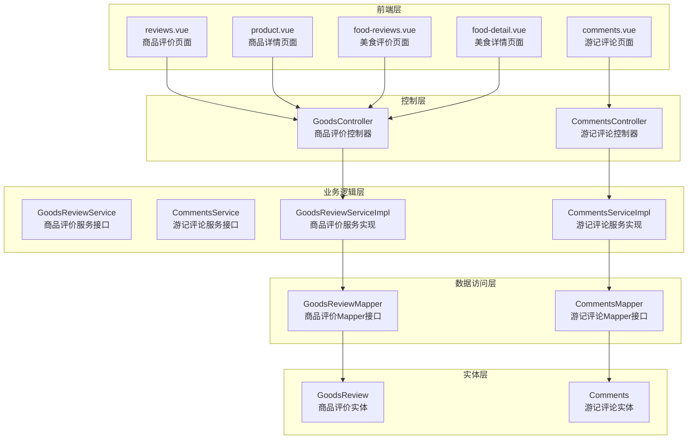
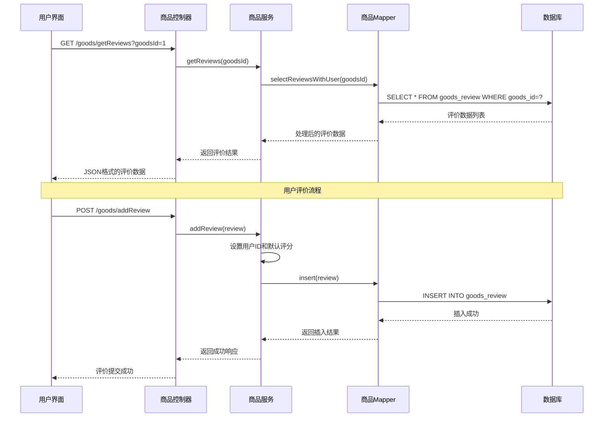
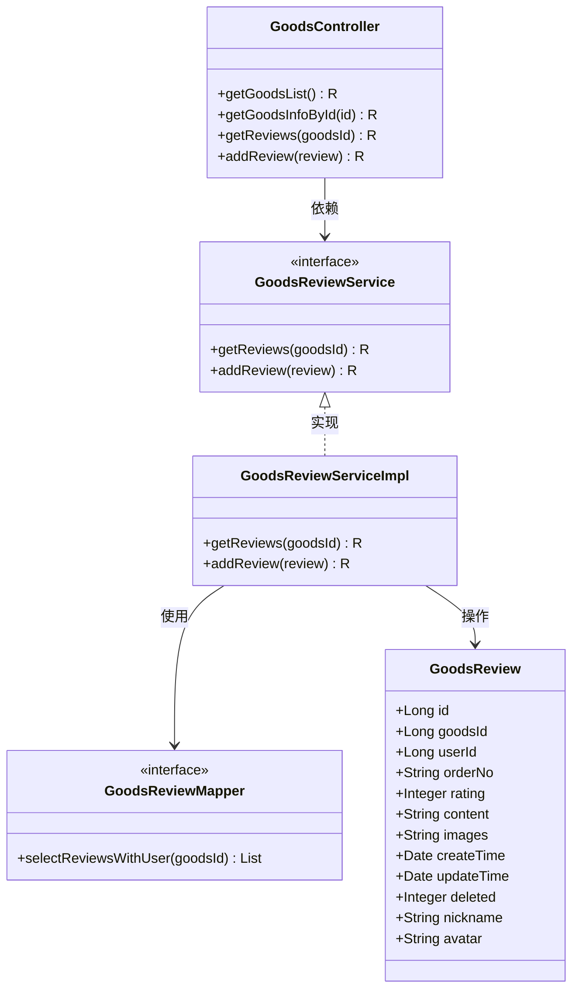
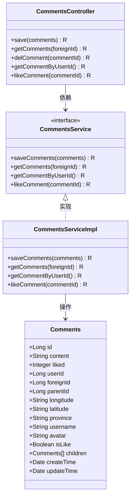
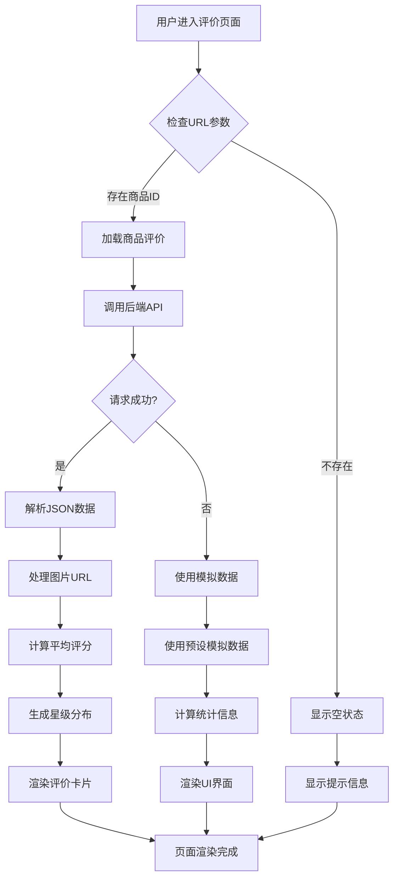
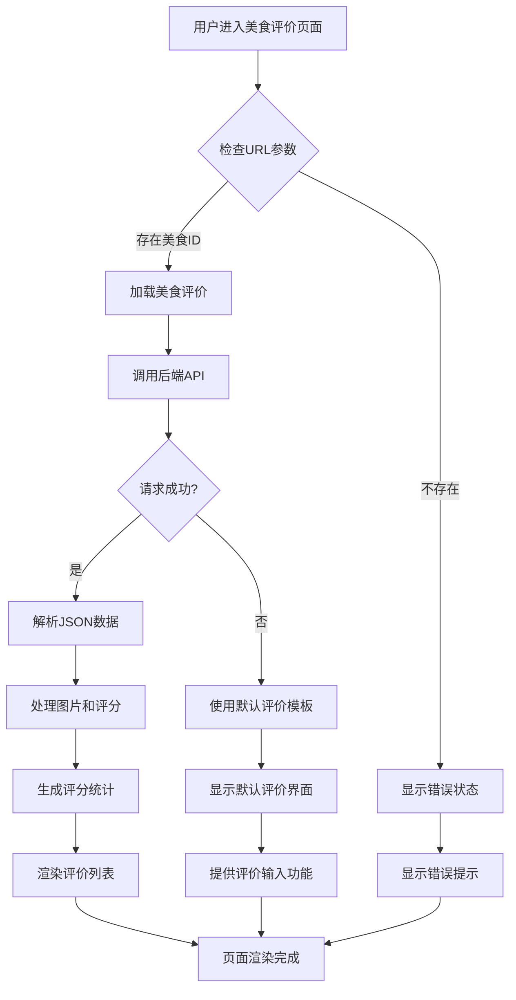
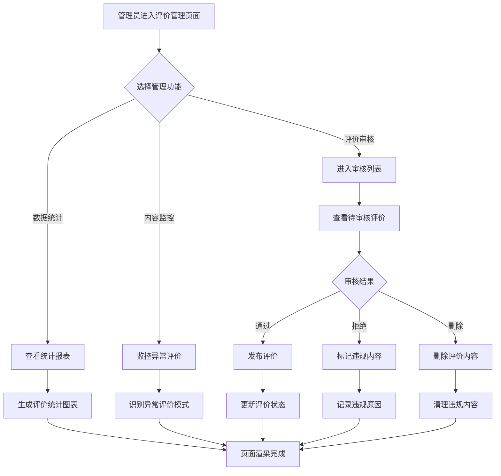
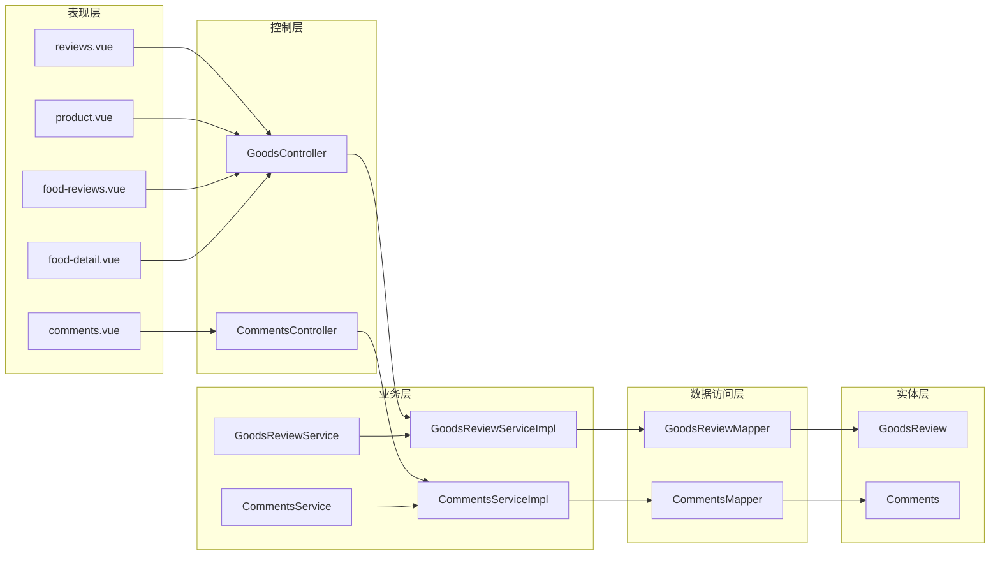

# 商品评价系统

<cite>
**本文档引用的文件**
- [GoodsController.java](file://springboot-travel-social/src/main/java/com/cxx/controller/GoodsController.java)
- [GoodsReview.java](file://springboot-travel-social/src/main/java/com/cxx/entity/GoodsReview.java)
- [GoodsReviewMapper.java](file://springboot-travel-social/src/main/java/com/cxx/mapper/GoodsReviewMapper.java)
- [GoodsReviewService.java](file://springboot-travel-social/src/main/java/com/cxx/service/GoodsReviewService.java)
- [GoodsReviewServiceImpl.java](file://springboot-travel-social/src/main/java/com/cxx/service/impl/GoodsReviewServiceImpl.java)
- [reviews.vue](file://uniapp-travel-social/preferredPages/reviews.vue)
- [product.vue](file://uniapp-travel-social/preferredPages/product.vue)
- [food-reviews.vue](file://uniapp-travel-social/foodPages/food-reviews.vue)
- [food-detail.vue](file://uniapp-travel-social/foodPages/food-detail.vue)
- [CommentsController.java](file://springboot-travel-social/src/main/java/com/cxx/controller/CommentsController.java)
- [CommentsService.java](file://springboot-travel-social/src/main/java/com/cxx/service/CommentsService.java)
- [CommentsServiceImpl.java](file://springboot-travel-social/src/main/java/com/cxx/service/impl/CommentsServiceImpl.java)
- [Comments.java](file://springboot-travel-social/src/main/java/com/cxx/entity/Comments.java)
- [CommentsMapper.java](file://springboot-travel-social/src/main/java/com/cxx/mapper/CommentsMapper.java)
</cite>

## 更新摘要
**变更内容**
- 新增了完整的商品评价功能模块，包括实体类、控制器、服务和映射器
- 完善了商品评价查询与提交流程，支持评分统计、图片展示和筛选功能
- 增强了前端评价展示页面，提供直观的用户交互体验
- 扩展了游记评论功能，增强社交化评论体验和敏感词过滤
- 新增了美食评价页面，支持美食相关的评价功能
- **新增** 扩展了评价管理和审核机制，完善电商评价生态

## 目录
1. [简介](#简介)
2. [项目结构](#项目结构)
3. [核心组件](#核心组件)
4. [架构概览](#架构概览)
5. [详细组件分析](#详细组件分析)
6. [依赖关系分析](#依赖关系分析)
7. [性能考虑](#性能考虑)
8. [故障排除指南](#故障排除指南)
9. [结论](#结论)

## 简介

商品评价系统是旅游攻略社交小程序的重要组成部分，为用户提供商品评价和游记评论功能。该系统采用前后端分离架构，后端基于Spring Boot框架，前端使用UniApp开发，实现了完整的商品评价生命周期管理。

系统主要包含两个核心模块：
- **商品评价模块**：处理商品购买后的评价功能，支持评分、文字评价、图片上传等
- **游记评论模块**：处理游记内容的评论功能，支持父子评论、点赞等社交功能

**更新** 系统现已完善商品评价功能，包括完整的评价查询与提交流程，增强了用户对商品的评价能力和展示体验。前端评价页面支持评分统计、图片展示和多种筛选功能，商品详情页面集成了评价入口和展示功能。新增了美食评价功能，为用户提供更丰富的评价体验。**新增** 系统现已扩展评价管理和审核机制，为平台运营提供完善的评价生态管理能力。

## 项目结构

整个评价系统采用经典的三层架构设计，分为表现层、业务逻辑层和数据访问层：

**图表来源**
- [GoodsController.java:1-52](file://springboot-travel-social/src/main/java/com/cxx/controller/GoodsController.java#L1-L52)
- [CommentsController.java:1-68](file://springboot-travel-social/src/main/java/com/cxx/controller/CommentsController.java#L1-L68)
- [GoodsReviewServiceImpl.java:1-39](file://springboot-travel-social/src/main/java/com/cxx/service/impl/GoodsReviewServiceImpl.java#L1-L39)
- [CommentsServiceImpl.java:1-154](file://springboot-travel-social/src/main/java/com/cxx/service/impl/CommentsServiceImpl.java#L1-L154)

**章节来源**
- [GoodsController.java:1-52](file://springboot-travel-social/src/main/java/com/cxx/controller/GoodsController.java#L1-L52)
- [CommentsController.java:1-68](file://springboot-travel-social/src/main/java/com/cxx/controller/CommentsController.java#L1-L68)

## 核心组件

### 商品评价模块

商品评价模块负责处理用户对购买商品的评价功能，包括评分、文字评价、图片上传等完整功能。

**关键特性：**
- 支持1-5分评分系统，自动设置默认评分
- 支持图片评价功能，图片以JSON数组形式存储
- 自动关联用户信息，确保评价真实性
- 完整的评价统计功能，支持评分分布统计

### 游记评论模块

游记评论模块提供丰富的社交化评论功能，支持多级评论和互动。

**关键特性：**
- 支持父子评论结构，实现评论的层级化管理
- 实时点赞功能，使用Redis缓存提升性能
- 敏感词过滤，确保评论内容的合规性
- 地理位置标注，支持根据经纬度获取地理位置信息

### 美食评价模块

美食评价模块专门处理美食相关的评价功能，提供更加专业的评价体验。

**关键特性：**
- 支持美食评分和文字评价
- 图片评价功能，支持美食照片展示
- 评分统计和分布展示
- 与美食详情页面深度集成

### 评价管理与审核模块

**新增** 评价管理与审核模块为平台运营提供完善的评价生态管理能力。

**关键特性：**
- 评价内容审核机制，支持人工审核和自动过滤
- 评价数据统计分析，提供运营决策支持
- 评价举报处理功能，维护社区环境
- 评价等级管理，支持不同等级的评价权限控制
- 评价内容监控，实时监控异常评价内容

**章节来源**
- [GoodsReview.java:1-59](file://springboot-travel-social/src/main/java/com/cxx/entity/GoodsReview.java#L1-L59)
- [Comments.java:1-125](file://springboot-travel-social/src/main/java/com/cxx/entity/Comments.java#L1-L125)

## 架构概览

系统采用微服务架构风格，通过RESTful API进行前后端通信：

**图表来源**
- [GoodsController.java:37-49](file://springboot-travel-social/src/main/java/com/cxx/controller/GoodsController.java#L37-L49)
- [GoodsReviewServiceImpl.java:17-37](file://springboot-travel-social/src/main/java/com/cxx/service/impl/GoodsReviewServiceImpl.java#L17-L37)

## 详细组件分析

### 商品评价控制器

商品评价控制器负责处理前端发送的评价相关请求，提供完整的CRUD操作接口。

**图表来源**
- [GoodsController.java:1-52](file://springboot-travel-social/src/main/java/com/cxx/controller/GoodsController.java#L1-L52)
- [GoodsReviewService.java:1-15](file://springboot-travel-social/src/main/java/com/cxx/service/GoodsReviewService.java#L1-L15)
- [GoodsReviewServiceImpl.java:1-39](file://springboot-travel-social/src/main/java/com/cxx/service/impl/GoodsReviewServiceImpl.java#L1-L39)

**章节来源**
- [GoodsController.java:37-49](file://springboot-travel-social/src/main/java/com/cxx/controller/GoodsController.java#L37-L49)
- [GoodsReviewServiceImpl.java:17-37](file://springboot-travel-social/src/main/java/com/cxx/service/impl/GoodsReviewServiceImpl.java#L17-L37)

### 游记评论控制器

游记评论控制器提供游记内容的评论管理功能，支持复杂的评论树结构。

**图表来源**
- [CommentsController.java:1-68](file://springboot-travel-social/src/main/java/com/cxx/controller/CommentsController.java#L1-L68)
- [CommentsService.java:1-27](file://springboot-travel-social/src/main/java/com/cxx/service/CommentsService.java#L1-L27)
- [CommentsServiceImpl.java:1-154](file://springboot-travel-social/src/main/java/com/cxx/service/impl/CommentsServiceImpl.java#L1-L154)

**章节来源**
- [CommentsController.java:28-65](file://springboot-travel-social/src/main/java/com/cxx/controller/CommentsController.java#L28-L65)
- [CommentsServiceImpl.java:49-151](file://springboot-travel-social/src/main/java/com/cxx/service/impl/CommentsServiceImpl.java#L49-L151)

### 前端评价展示组件

前端使用Vue.js框架实现评价页面，提供直观的用户交互体验。

**图表来源**
- [reviews.vue:108-151](file://uniapp-travel-social/preferredPages/reviews.vue#L108-L151)

**章节来源**
- [reviews.vue:108-151](file://uniapp-travel-social/preferredPages/reviews.vue#L108-L151)

### 美食评价组件

美食评价页面专门处理美食相关的评价功能，提供更加专业的评价体验。

**图表来源**
- [food-reviews.vue:143-200](file://uniapp-travel-social/foodPages/food-reviews.vue#L143-L200)

**章节来源**
- [food-reviews.vue:143-200](file://uniapp-travel-social/foodPages/food-reviews.vue#L143-L200)

### 评价管理与审核组件

**新增** 评价管理与审核组件为平台运营提供完善的评价生态管理能力。

**图表来源**
- [activityOderation.vue:1-32](file://uniapp-travel-social/partnerPages/activityOderation.vue#L1-L32)

**章节来源**
- [activityOderation.vue:1-32](file://uniapp-travel-social/partnerPages/activityOderation.vue#L1-L32)

## 依赖关系分析

系统各层之间的依赖关系清晰明确，遵循了良好的软件工程原则：

**图表来源**
- [GoodsController.java:1-52](file://springboot-travel-social/src/main/java/com/cxx/controller/GoodsController.java#L1-L52)
- [CommentsController.java:1-68](file://springboot-travel-social/src/main/java/com/cxx/controller/CommentsController.java#L1-L68)

**章节来源**
- [GoodsReviewMapper.java:1-23](file://springboot-travel-social/src/main/java/com/cxx/mapper/GoodsReviewMapper.java#L1-L23)
- [CommentsMapper.java:1-17](file://springboot-travel-social/src/main/java/com/cxx/mapper/CommentsMapper.java#L1-L17)

## 性能考虑

### 缓存策略

系统采用了多层缓存机制来提升性能：

1. **Redis缓存**：用于存储用户点赞状态，避免重复查询数据库
2. **数据库索引**：在商品ID和创建时间字段上建立索引
3. **批量查询**：一次性获取所有评论及其子评论

### 数据优化

- **延迟加载**：子评论采用按需加载策略
- **分页查询**：对于大量评论采用分页机制
- **字段选择**：只查询必要的字段，减少网络传输

### 异步处理

- **异步API调用**：前端使用Promise处理异步请求
- **并发控制**：限制同时进行的API请求数量

### 评价管理性能优化

**新增** 评价管理模块采用专门的性能优化策略：

- **增量审核**：支持批量审核操作，提升审核效率
- **智能分类**：自动识别高风险评价内容，优先处理
- **缓存统计**：缓存常用统计数据，减少数据库压力
- **异步处理**：评价审核结果异步通知，提升响应速度

## 故障排除指南

### 常见问题及解决方案

**问题1：评价无法提交**
- 检查用户是否已登录
- 验证商品ID是否正确
- 确认网络连接正常

**问题2：评价列表为空**
- 检查商品是否存在评价
- 验证商品ID参数
- 查看数据库连接状态

**问题3：图片上传失败**
- 检查文件大小限制
- 验证文件类型
- 确认存储服务可用性

**问题4：游记评论提交失败**
- 检查敏感词过滤规则
- 验证地理位置信息获取
- 确认Redis服务状态

**问题5：美食评价页面加载失败**
- 检查美食ID参数传递
- 验证后端API接口可用性
- 确认前端路由配置正确

**问题6：评价审核功能异常**
- 检查管理员权限验证
- 验证审核操作日志
- 确认审核状态更新机制

**问题7：评价统计不准确**
- 检查缓存数据同步
- 验证统计计算逻辑
- 确认数据源连接状态

**章节来源**
- [GoodsReviewServiceImpl.java:24-37](file://springboot-travel-social/src/main/java/com/cxx/service/impl/GoodsReviewServiceImpl.java#L24-L37)
- [CommentsServiceImpl.java:125-151](file://springboot-travel-social/src/main/java/com/cxx/service/impl/CommentsServiceImpl.java#L125-L151)

## 结论

商品评价系统是一个功能完整、架构清晰的评价管理平台。系统通过合理的分层设计和模块化组织，实现了良好的可维护性和扩展性。

**主要优势：**
- 完整的评价生命周期管理，从查询到提交一应俱全
- 丰富的用户交互功能，包括评分统计、图片展示、筛选等
- 良好的性能优化策略，多层缓存和异步处理
- 清晰的代码结构和完善的异常处理机制
- 支持多种评价场景，包括商品评价、美食评价和游记评论
- **新增** 完善的评价管理与审核机制，为平台运营提供专业化的管理工具

**未来改进方向：**
- 增加评价搜索和高级筛选功能
- 优化移动端用户体验，提升交互流畅度
- 扩展评价数据分析功能，提供更深入的洞察
- 增强评价内容的安全审核机制，提升内容质量
- 添加评价举报和管理功能，维护社区环境
- 支持更多评价类型，如服务评价、物流评价等
- **新增** 完善评价管理后台功能，支持更精细的运营管控
- **新增** 增加评价内容AI审核能力，提升审核效率和准确性
- **新增** 扩展评价数据分析维度，为商业决策提供更全面的支持

该系统为旅游攻略社交小程序提供了坚实的评价基础，能够有效提升用户参与度和平台活跃度，为用户创造更好的购物和分享体验。**新增** 评价管理与审核机制的完善，为平台的长期健康发展提供了有力保障，有助于构建更加诚信、健康的电商评价生态。