# 天气节假日感知

<cite>
**本文档引用的文件**
- [WeatherController.java](file://springboot-travel-social/src/main/java/com/cxx/controller/WeatherController.java)
- [WeatherService.java](file://springboot-travel-social/src/main/java/com/cxx/service/WeatherService.java)
- [WeatherServiceImpl.java](file://springboot-travel-social/src/main/java/com/cxx/service/impl/WeatherServiceImpl.java)
- [HolidayController.java](file://springboot-travel-social/src/main/java/com/cxx/controller/HolidayController.java)
- [HolidayService.java](file://springboot-travel-social/src/main/java/com/cxx/service/HolidayService.java)
- [HolidayServiceImpl.java](file://springboot-travel-social/src/main/java/com/cxx/service/impl/HolidayServiceImpl.java)
- [TripContextController.java](file://springboot-travel-social/src/main/java/com/cxx/controller/TripContextController.java)
- [TripContextService.java](file://springboot-travel-social/src/main/java/com/cxx/service/TripContextService.java)
- [TripContextServiceImpl.java](file://springboot-travel-social/src/main/java/com/cxx/service/impl/TripContextServiceImpl.java)
- [HolidayConfig.java](file://springboot-travel-social/src/main/java/com/cxx/entity/HolidayConfig.java)
- [HolidayConfigMapper.java](file://springboot-travel-social/src/main/java/com/cxx/mapper/HolidayConfigMapper.java)
- [HolidayConfigMapper.xml](file://springboot-travel-social/src/main/java/com/cxx/mapper/HolidayConfigMapper.xml)
- [holiday_config.sql](file://springboot-travel-social/src/main/resources/sql/holiday_config.sql)
- [weather-home.vue](file://uniapp-travel-social/weatherPages/weather-home.vue)
- [aiChat.vue](file://uniapp-travel-social/homePages/aiChat/aiChat.vue)
- [application.properties](file://springboot-travel-social/src/main/resources/application.properties)
- [pom.xml](file://springboot-travel-social/pom.xml)
</cite>

## 更新摘要
**所做更改**
- 新增行程上下文聚合服务模块，提供天气+节假日一体化接口
- 扩展AI聊天功能，集成城市/日期识别和tripContext自动注入
- 增强前端天气预警卡片功能，支持动态天气提醒
- 完善节假日高峰期识别和出行建议生成功能

## 目录
1. [项目概述](#项目概述)
2. [系统架构](#系统架构)
3. [核心组件](#核心组件)
4. [天气服务模块](#天气服务模块)
5. [节假日服务模块](#节假日服务模块)
6. [行程上下文聚合服务](#行程上下文聚合服务)
7. [AI聊天集成](#ai聊天集成)
8. [前端集成](#前端集成)
9. [数据模型设计](#数据模型设计)
10. [API 接口规范](#api-接口规范)
11. [性能优化策略](#性能优化策略)
12. [故障处理机制](#故障处理机制)
13. [总结](#总结)

## 项目概述

"天气节假日感知"功能是旅游攻略社交小程序中的重要组成部分，旨在为用户提供实时天气信息、未来天气预报、天气预警以及节假日出行建议等全方位的出行信息服务。该功能通过整合第三方天气API和本地节假日配置数据库，为用户制定旅游计划提供科学依据。

**更新** 新增行程上下文聚合服务，将天气和节假日信息统一管理，支持AI聊天场景下的智能提示词生成。

本系统采用前后端分离架构，后端基于Spring Boot框架，前端基于UniApp框架，实现了完整的天气和节假日信息服务体系，并集成了AI聊天的智能感知能力。

## 系统架构

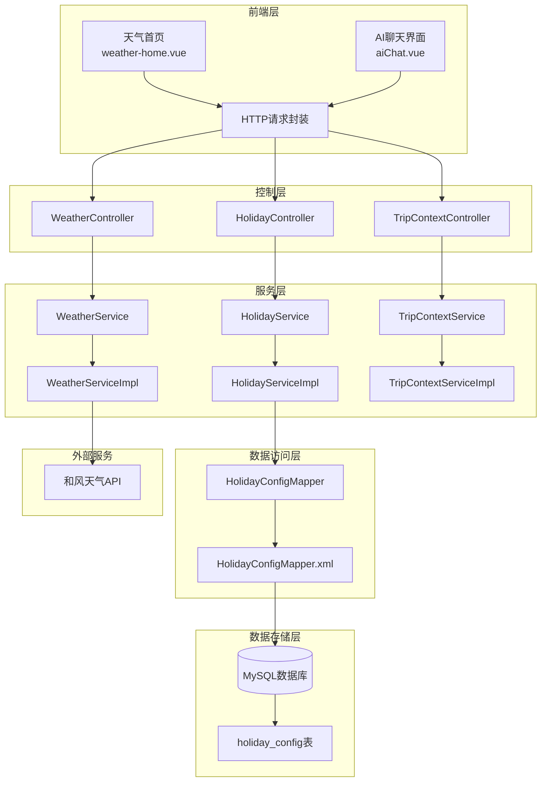

**图表来源**
- [WeatherController.java:19-86](file://springboot-travel-social/src/main/java/com/cxx/controller/WeatherController.java#L19-L86)
- [HolidayController.java:19-41](file://springboot-travel-social/src/main/java/com/cxx/controller/HolidayController.java#L19-L41)
- [TripContextController.java:16-44](file://springboot-travel-social/src/main/java/com/cxx/controller/TripContextController.java#L16-L44)
- [WeatherServiceImpl.java:23-294](file://springboot-travel-social/src/main/java/com/cxx/service/impl/WeatherServiceImpl.java#L23-L294)
- [HolidayServiceImpl.java:19-90](file://springboot-travel-social/src/main/java/com/cxx/service/impl/HolidayServiceImpl.java#L19-L90)
- [TripContextServiceImpl.java:12-197](file://springboot-travel-social/src/main/java/com/cxx/service/impl/TripContextServiceImpl.java#L12-L197)

## 核心组件

### 控制器层

系统包含三个核心控制器：WeatherController、HolidayController和TripContextController，分别负责天气服务、节假日服务和行程上下文聚合的对外接口。

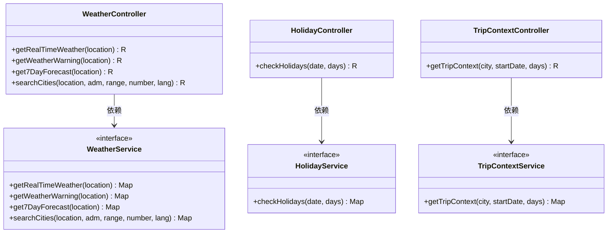

**图表来源**
- [WeatherController.java:22-86](file://springboot-travel-social/src/main/java/com/cxx/controller/WeatherController.java#L22-L86)
- [HolidayController.java:23-41](file://springboot-travel-social/src/main/java/com/cxx/controller/HolidayController.java#L23-L41)
- [TripContextController.java:24-44](file://springboot-travel-social/src/main/java/com/cxx/controller/TripContextController.java#L24-L44)
- [WeatherService.java:8-41](file://springboot-travel-social/src/main/java/com/cxx/service/WeatherService.java#L8-L41)
- [HolidayService.java:8-18](file://springboot-travel-social/src/main/java/com/cxx/service/HolidayService.java#L8-L18)
- [TripContextService.java:9-20](file://springboot-travel-social/src/main/java/com/cxx/service/TripContextService.java#L9-L20)

**章节来源**
- [WeatherController.java:19-86](file://springboot-travel-social/src/main/java/com/cxx/controller/WeatherController.java#L19-L86)
- [HolidayController.java:19-41](file://springboot-travel-social/src/main/java/com/cxx/controller/HolidayController.java#L19-L41)
- [TripContextController.java:16-44](file://springboot-travel-social/src/main/java/com/cxx/controller/TripContextController.java#L16-L44)

## 天气服务模块

### 实时天气获取

天气服务模块提供了完整的天气信息服务，包括实时天气、天气预警、7天预报和城市搜索功能。

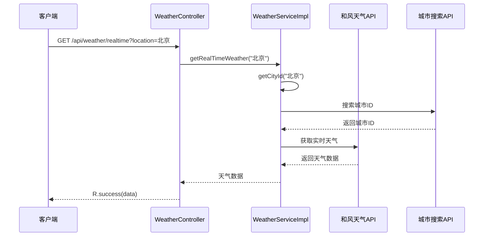

**图表来源**
- [WeatherController.java:32-38](file://springboot-travel-social/src/main/java/com/cxx/controller/WeatherController.java#L32-L38)
- [WeatherServiceImpl.java:37-64](file://springboot-travel-social/src/main/java/com/cxx/service/impl/WeatherServiceImpl.java#L37-L64)

### 天气数据处理流程

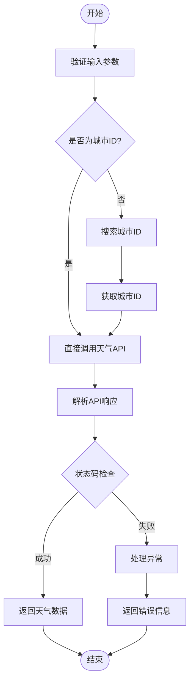

**图表来源**
- [WeatherServiceImpl.java:271-293](file://springboot-travel-social/src/main/java/com/cxx/service/impl/WeatherServiceImpl.java#L271-L293)
- [WeatherServiceImpl.java:141-211](file://springboot-travel-social/src/main/java/com/cxx/service/impl/WeatherServiceImpl.java#L141-L211)

**章节来源**
- [WeatherService.java:8-41](file://springboot-travel-social/src/main/java/com/cxx/service/WeatherService.java#L8-L41)
- [WeatherServiceImpl.java:23-294](file://springboot-travel-social/src/main/java/com/cxx/service/impl/WeatherServiceImpl.java#L23-L294)

## 节假日服务模块

### 节假日查询逻辑

节假日服务模块通过查询数据库中的节假日配置，为用户提供出行高峰期判断和相关建议。

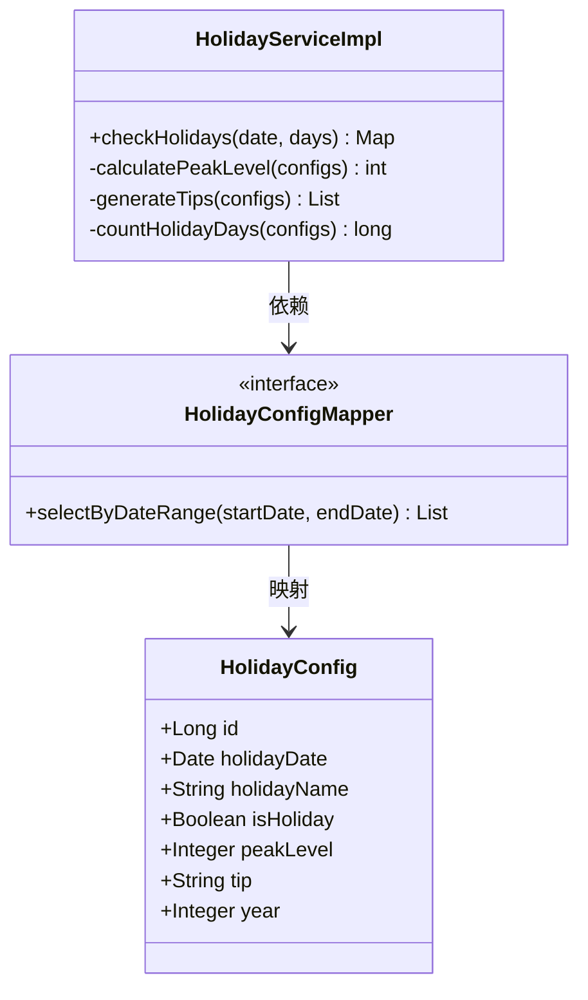

**图表来源**
- [HolidayConfig.java:21-57](file://springboot-travel-social/src/main/java/com/cxx/entity/HolidayConfig.java#L21-L57)
- [HolidayConfigMapper.java:12-23](file://springboot-travel-social/src/main/java/com/cxx/mapper/HolidayConfigMapper.java#L12-L23)
- [HolidayServiceImpl.java:22-90](file://springboot-travel-social/src/main/java/com/cxx/service/impl/HolidayServiceImpl.java#L22-L90)

### 节假日数据分析

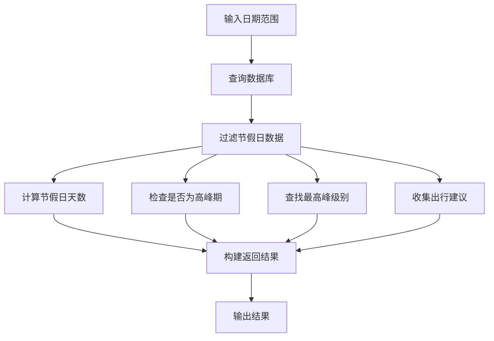

**图表来源**
- [HolidayServiceImpl.java:30-89](file://springboot-travel-social/src/main/java/com/cxx/service/impl/HolidayServiceImpl.java#L30-L89)

**章节来源**
- [HolidayService.java:8-18](file://springboot-travel-social/src/main/java/com/cxx/service/HolidayService.java#L8-L18)
- [HolidayServiceImpl.java:19-90](file://springboot-travel-social/src/main/java/com/cxx/service/impl/HolidayServiceImpl.java#L19-L90)

## 行程上下文聚合服务

### 服务架构设计

行程上下文聚合服务是本次更新的核心组件，负责将天气和节假日信息进行统一管理和聚合，为AI聊天提供完整的出行上下文。

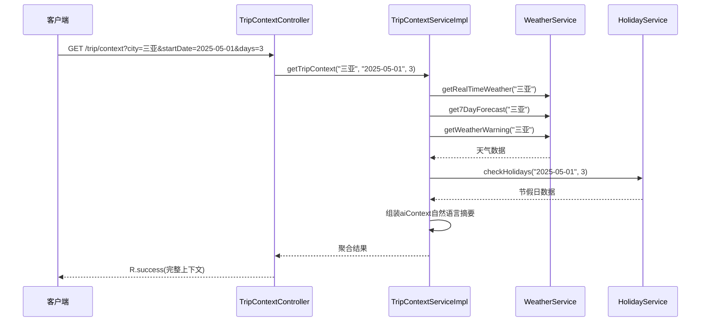

**图表来源**
- [TripContextController.java:35-43](file://springboot-travel-social/src/main/java/com/cxx/controller/TripContextController.java#L35-L43)
- [TripContextServiceImpl.java:24-78](file://springboot-travel-social/src/main/java/com/cxx/service/impl/TripContextServiceImpl.java#L24-L78)

### 上下文数据结构

行程上下文聚合服务返回的数据结构包含完整的天气和节假日信息，以及AI友好的自然语言摘要：

| 字段 | 类型 | 描述 |
|------|------|------|
| city | String | 城市名称 |
| startDate | String | 出行开始日期 |
| days | Integer | 行程天数 |
| weather | Map | 天气相关信息 |
| holiday | Map | 节假日相关信息 |
| aiContext | String | AI自然语言摘要 |

**章节来源**
- [TripContextService.java:9-20](file://springboot-travel-social/src/main/java/com/cxx/service/TripContextService.java#L9-L20)
- [TripContextServiceImpl.java:12-197](file://springboot-travel-social/src/main/java/com/cxx/service/impl/TripContextServiceImpl.java#L12-L197)

## AI聊天集成

### 城市和日期识别

AI聊天界面新增了智能的城市和日期识别功能，能够从用户输入中自动提取出行相关信息。

```mermaid
flowchart TD
UserInput[用户输入："我想五一去三亚玩3天"] --> Detect["_detectCityAndDate()"]
Detect --> ExtractCity["提取城市：三亚"]
Detect --> ExtractDate["提取日期：五一(2025-05-01)"]
Detect --> ExtractDays["提取天数：3"]
ExtractCity --> BuildParams["构建参数对象"]
ExtractDate --> BuildParams
ExtractDays --> BuildParams
BuildParams --> FetchContext["_fetchTripContext()"]
FetchContext --> APICall["调用/trip/context接口"]
APICall --> CacheContext["缓存到chatContext"]
CacheContext --> InjectSystem["注入systemContext"]
InjectSystem --> SendToAI["发送到AI聊天"]
```

**图表来源**
- [aiChat.vue:1833-1891](file://uniapp-travel-social/homePages/aiChat/aiChat.vue#L1833-L1891)
- [aiChat.vue:1892-1920](file://uniapp-travel-social/homePages/aiChat/aiChat.vue#L1892-L1920)

### 自动上下文注入

AI聊天系统在发送消息前会自动检测并注入行程上下文，提升AI回复的准确性和实用性。

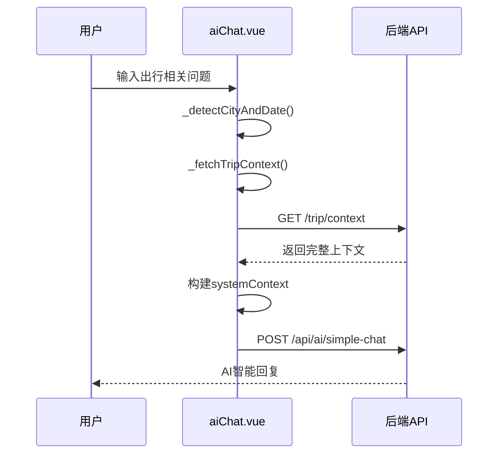

**图表来源**
- [aiChat.vue:1452-1460](file://uniapp-travel-social/homePages/aiChat/aiChat.vue#L1452-L1460)
- [aiChat.vue:1563-1570](file://uniapp-travel-social/homePages/aiChat/aiChat.vue#L1563-L1570)

### 天气预警卡片

当检测到天气预警时，系统会自动在AI回复后追加天气预警卡片，提醒用户注意安全。

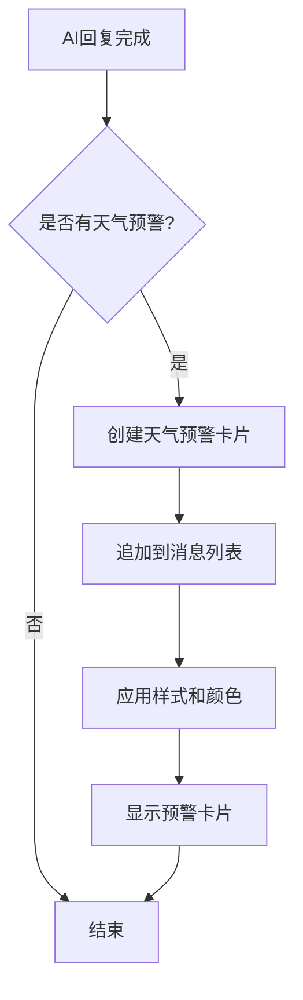

**图表来源**
- [aiChat.vue:443-453](file://uniapp-travel-social/homePages/aiChat/aiChat.vue#L443-L453)

**章节来源**
- [aiChat.vue:1452-1460](file://uniapp-travel-social/homePages/aiChat/aiChat.vue#L1452-L1460)
- [aiChat.vue:1833-1891](file://uniapp-travel-social/homePages/aiChat/aiChat.vue#L1833-L1891)
- [aiChat.vue:443-453](file://uniapp-travel-social/homePages/aiChat/aiChat.vue#L443-L453)

## 前端集成

### 天气查询界面

前端采用UniApp框架开发，提供了直观的天气查询界面，支持并行获取多种天气数据。

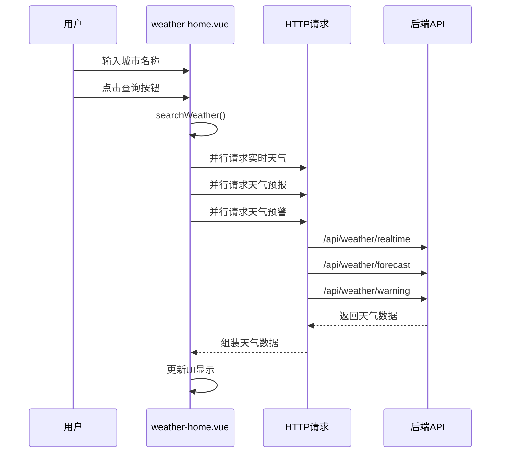

**图表来源**
- [weather-home.vue:114-175](file://uniapp-travel-social/weatherPages/weather-home.vue#L114-L175)
- [weather-home.vue:178-211](file://uniapp-travel-social/weatherPages/weather-home.vue#L178-L211)

### 响应式设计实现

前端界面采用了响应式设计，适配不同尺寸的移动设备屏幕：

- **渐变背景设计**：使用紫色到蓝色的渐变背景，营造天气主题氛围
- **卡片式布局**：采用半透明卡片设计，突出天气信息展示
- **动画效果**：添加了淡入和浮动动画，提升用户体验
- **响应式适配**：针对小屏设备优化布局结构

**章节来源**
- [weather-home.vue:1-580](file://uniapp-travel-social/weatherPages/weather-home.vue#L1-L580)

## 数据模型设计

### 节假日配置实体

系统使用MyBatis-Plus框架进行数据持久化，节假日配置实体具有完整的字段定义和注解配置。

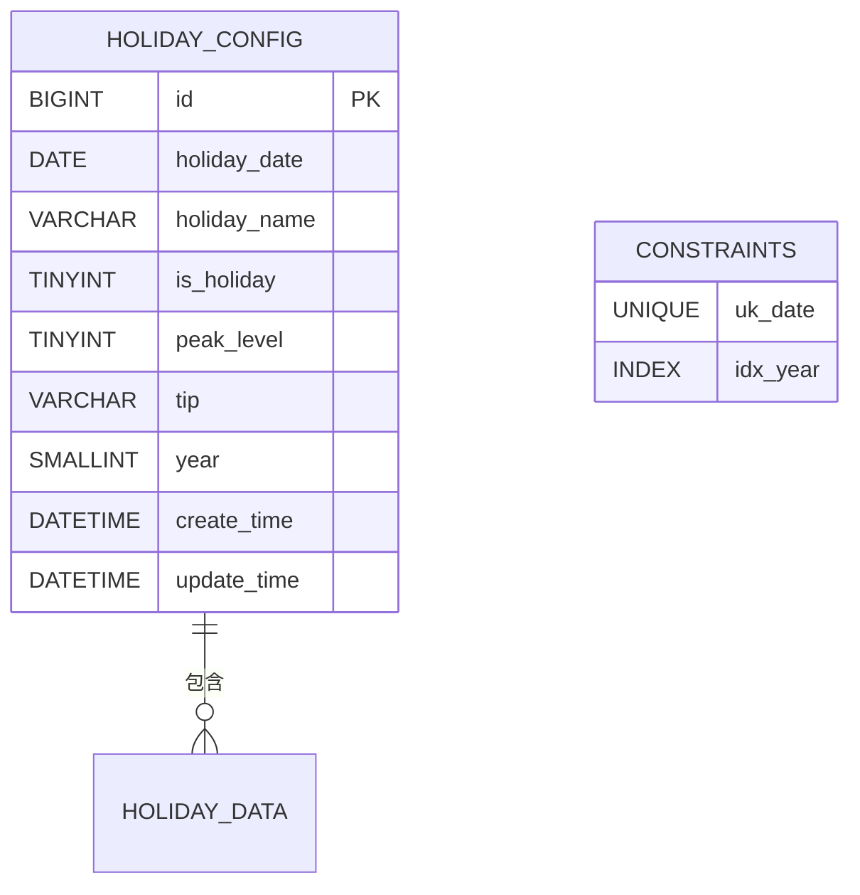

**图表来源**
- [HolidayConfig.java:21-57](file://springboot-travel-social/src/main/java/com/cxx/entity/HolidayConfig.java#L21-L57)
- [holiday_config.sql:2-15](file://springboot-travel-social/src/main/resources/sql/holiday_config.sql#L2-L15)

### 数据库初始化脚本

系统预置了2025年和2026年的节假日数据，包括：

- **元旦**：1月1日，一般出行
- **春节**：1月28日至2月3日，黄金周高峰期
- **清明节**：4月4日至6日，小长假高峰期
- **劳动节**：5月1日至5日，黄金周高峰期
- **端午节**：6月2日至4日，小长假
- **国庆节**：10月1日至7日，黄金周超高峰期

**章节来源**
- [HolidayConfig.java:12-57](file://springboot-travel-social/src/main/java/com/cxx/entity/HolidayConfig.java#L12-L57)
- [holiday_config.sql:17-45](file://springboot-travel-social/src/main/resources/sql/holiday_config.sql#L17-L45)

## API 接口规范

### 天气服务API

系统提供了完整的天气服务RESTful API接口：

| 接口 | 方法 | 路径 | 描述 |
|------|------|------|------|
| 获取实时天气 | GET | `/api/weather/realtime` | 获取指定城市的实时天气信息 |
| 获取天气预警 | GET | `/api/weather/warning` | 获取指定城市的天气预警信息 |
| 获取7天预报 | GET | `/api/weather/forecast` | 获取指定城市的未来7天天气预报 |
| 搜索城市 | GET | `/api/weather/search` | 搜索城市信息，支持多种查询方式 |

### 节假日服务API

| 接口 | 方法 | 路径 | 描述 |
|------|------|------|------|
| 查询节假日 | GET | `/api/holiday/check` | 查询指定日期起N天内的节假日情况 |

### 行程上下文聚合API

| 接口 | 方法 | 路径 | 描述 |
|------|------|------|------|
| 获取行程上下文 | GET | `/trip/context` | 获取天气+节假日+AI摘要的完整上下文信息 |

**章节来源**
- [WeatherController.java:32-85](file://springboot-travel-social/src/main/java/com/cxx/controller/WeatherController.java#L32-L85)
- [HolidayController.java:33-40](file://springboot-travel-social/src/main/java/com/cxx/controller/HolidayController.java#L33-L40)
- [TripContextController.java:35-43](file://springboot-travel-social/src/main/java/com/cxx/controller/TripContextController.java#L35-L43)

## 性能优化策略

### 并行请求优化

前端采用Promise.all并行请求多个天气API，显著提升了用户体验：

```javascript
// 并行获取实时天气、天气预报和天气预警
const [realtimeData, forecastData, warningData] = await Promise.all([
    this.getRealTimeWeather(this.cityName),
    this.get7DayForecast(this.cityName),
    this.getWeatherWarning(this.cityName)
]);
```

### 缓存策略

系统具备以下缓存优化机制：

- **数据库索引优化**：为`holiday_date`和`year`字段建立索引，提升查询性能
- **API响应缓存**：对天气API响应进行合理缓存，减少重复请求
- **前端状态管理**：使用Vue响应式数据绑定，避免不必要的DOM操作
- **行程上下文缓存**：在AI聊天中缓存tripContext，避免重复请求

### 错误处理优化

实现了完善的错误处理机制：

- **网络异常处理**：捕获网络请求异常，提供友好的错误提示
- **API状态检查**：验证API响应状态，确保数据完整性
- **降级策略**：在服务不可用时提供基本功能和降级数据
- **AI上下文降级**：即使天气或节假日服务失败，仍能提供基本的AI聊天功能

## 故障处理机制

### 异常处理流程

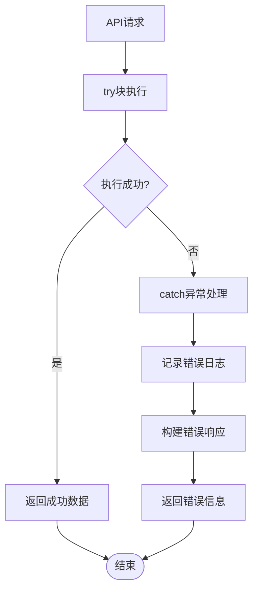

### 错误类型分类

系统识别并处理以下错误类型：

- **网络请求错误**：403访问受限、500服务器错误
- **数据解析错误**：API响应格式异常
- **业务逻辑错误**：城市不存在、参数验证失败
- **系统异常**：数据库连接失败、服务不可用
- **AI上下文异常**：tripContext获取失败时的降级处理

**章节来源**
- [WeatherServiceImpl.java:57-63](file://springboot-travel-social/src/main/java/com/cxx/service/impl/WeatherServiceImpl.java#L57-L63)
- [HolidayServiceImpl.java:78-89](file://springboot-travel-social/src/main/java/com/cxx/service/impl/HolidayServiceImpl.java#L78-L89)
- [TripContextServiceImpl.java:50-70](file://springboot-travel-social/src/main/java/com/cxx/service/impl/TripContextServiceImpl.java#L50-L70)

## 总结

"天气节假日感知"功能通过以下特点实现了完整的出行信息服务：

### 核心优势

1. **多源数据整合**：结合第三方天气API和本地节假日数据库
2. **实时响应**：支持并行请求，快速响应用户查询
3. **智能分析**：自动识别出行高峰期，提供个性化建议
4. **AI智能集成**：支持城市/日期识别和自动上下文注入
5. **友好界面**：响应式设计，适配各种移动设备
6. **稳定可靠**：完善的错误处理和降级机制

### 技术特色

- **前后端分离**：清晰的职责划分，便于维护和扩展
- **模块化设计**：独立的天气、节假日和上下文聚合模块
- **数据持久化**：使用MyBatis-Plus简化数据库操作
- **API标准化**：遵循RESTful设计原则，接口规范统一
- **AI增强**：集成智能感知能力，提升用户体验

### 应用价值

该功能为用户提供了科学的出行决策支持，帮助用户：

- 避开出行高峰期，选择最佳出行时间
- 根据天气情况调整行程安排
- 获取权威的天气预警信息
- 获得个性化的出行建议和注意事项
- 在AI聊天中获得更智能的旅行建议

通过持续的数据更新和功能优化，该系统将持续为用户提供优质的出行信息服务。