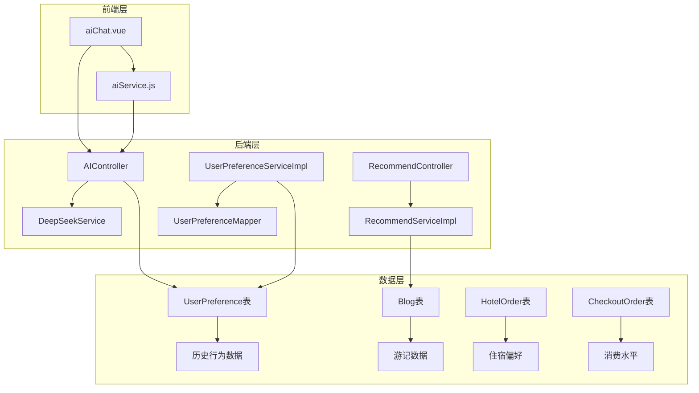
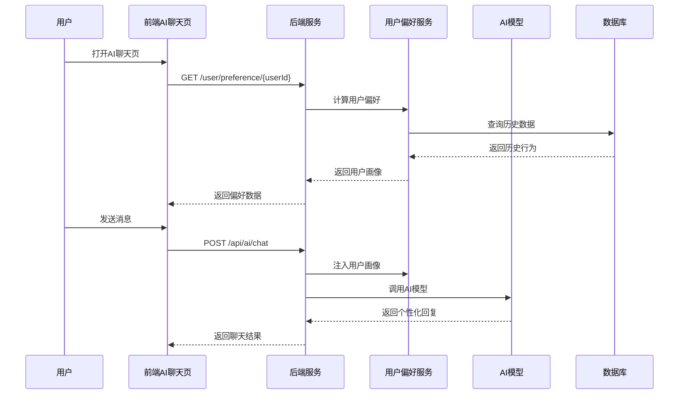
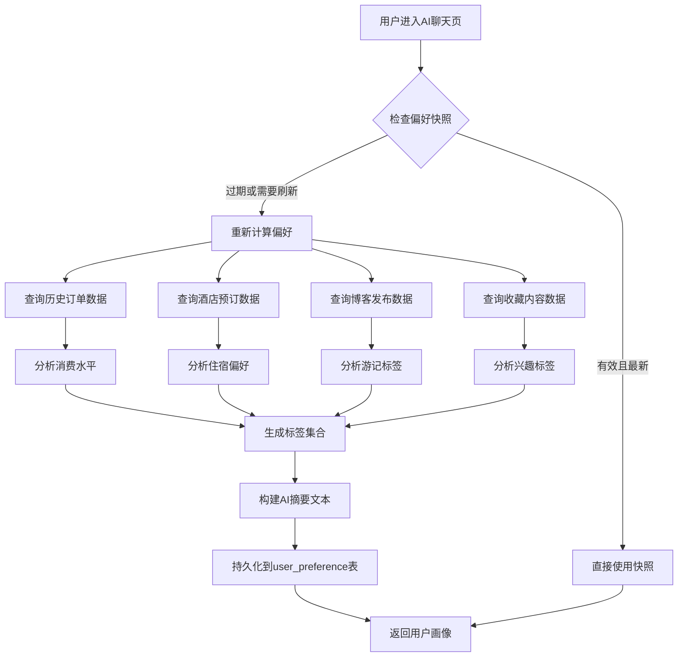
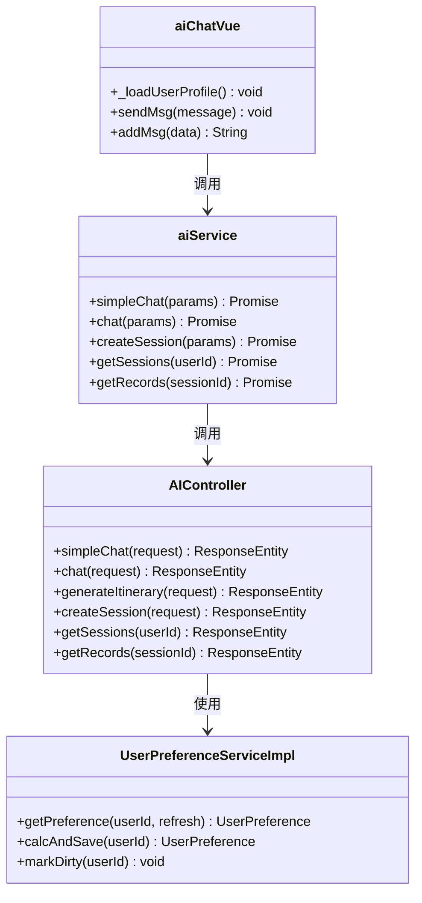
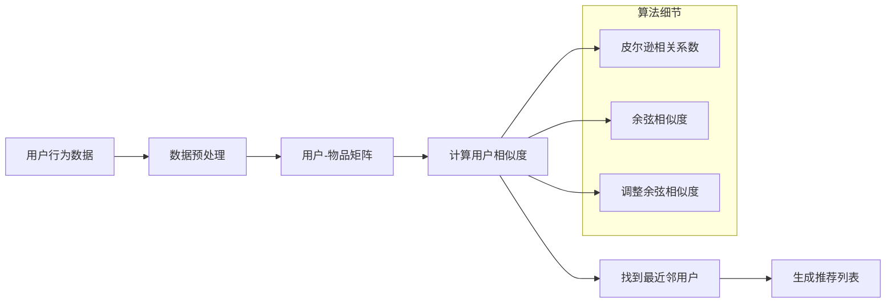
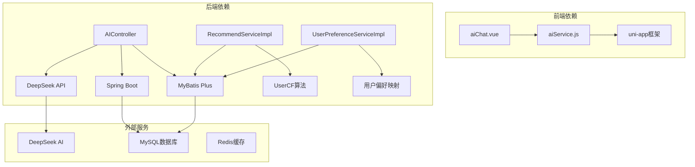
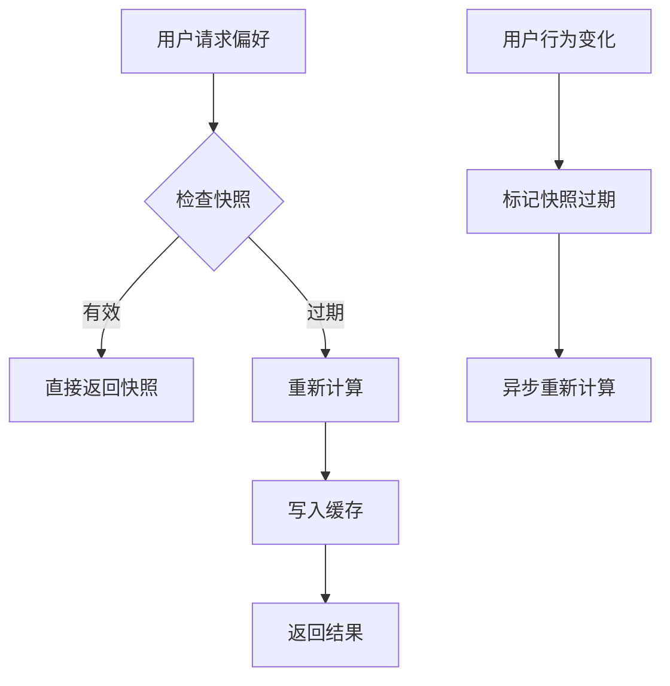

# 方案① 个性化AI推荐

<cite>
**本文档引用的文件**
- [AIController.java](file://springboot-travel-social/src/main/java/com/cxx/controller/AIController.java)
- [RecommendController.java](file://springboot-travel-social/src/main/java/com/cxx/controller/RecommendController.java)
- [RecommendServiceImpl.java](file://springboot-travel-social/src/main/java/com/cxx/service/impl/RecommendServiceImpl.java)
- [UserPreferenceServiceImpl.java](file://springboot-travel-social/src/main/java/com/cxx/service/impl/UserPreferenceServiceImpl.java)
- [UserPreference.java](file://springboot-travel-social/src/main/java/com/cxx/entity/UserPreference.java)
- [UserPreferenceMapper.java](file://springboot-travel-social/src/main/java/com/cxx/mapper/UserPreferenceMapper.java)
- [UserCF.java](file://springboot-travel-social/src/main/java/com/cxx/core/UserCF.java)
- [CoreMath.java](file://springboot-travel-social/src/main/java/com/cxx/core/CoreMath.java)
- [Hist.java](file://springboot-travel-social/src/main/java/com/cxx/entity/Hist.java)
- [aiService.js](file://uniapp-travel-social/services/aiService.js)
- [aiChat.vue](file://uniapp-travel-social/homePages/aiChat/aiChat.vue)
- [application.properties](file://springboot-travel-social/src/main/resources/application.properties)
- [方案①-个性化AI推荐.md](file://方案①-个性化AI推荐.md)
</cite>

## 目录
1. [简介](#简介)
2. [项目结构](#项目结构)
3. [核心组件](#核心组件)
4. [架构概览](#架构概览)
5. [详细组件分析](#详细组件分析)
6. [依赖关系分析](#依赖关系分析)
7. [性能考虑](#性能考虑)
8. [故障排除指南](#故障排除指南)
9. [结论](#结论)

## 简介

方案①个性化AI推荐是旅游攻略社交小程序的核心功能模块，旨在通过分析用户的历史行为数据，构建个性化的旅行偏好画像，并将其注入到AI聊天系统中，实现真正意义上的"懂你"推荐。

该系统通过以下方式实现个性化推荐：
- **用户行为分析**：从订单、酒店预订、博客发布、收藏等内容中提取旅行偏好
- **智能画像构建**：将原始数据转换为可注入AI的摘要文本
- **实时个性化**：在聊天过程中动态注入用户画像，提供针对性建议
- **快照机制**：通过缓存机制确保响应速度和系统性能

## 项目结构

**图表来源**
- [AIController.java:1-505](file://springboot-travel-social/src/main/java/com/cxx/controller/AIController.java#L1-L505)
- [RecommendController.java:1-65](file://springboot-travel-social/src/main/java/com/cxx/controller/RecommendController.java#L1-L65)
- [UserPreferenceServiceImpl.java:1-227](file://springboot-travel-social/src/main/java/com/cxx/service/impl/UserPreferenceServiceImpl.java#L1-L227)

**章节来源**
- [AIController.java:1-505](file://springboot-travel-social/src/main/java/com/cxx/controller/AIController.java#L1-L505)
- [RecommendController.java:1-65](file://springboot-travel-social/src/main/java/com/cxx/controller/RecommendController.java#L1-L65)
- [UserPreferenceServiceImpl.java:1-227](file://springboot-travel-social/src/main/java/com/cxx/service/impl/UserPreferenceServiceImpl.java#L1-L227)

## 核心组件

### AI聊天控制器
AIController负责处理所有AI相关的聊天功能，包括：
- 简单聊天接口：基础的问答功能
- 通用聊天接口：支持自定义系统提示词
- 会话管理：创建、查询、删除会话
- 行程生成：根据用户需求生成个性化行程
- 语音识别：支持语音转文字功能

### 推荐系统
推荐系统采用协同过滤算法，通过UserCF类实现：
- 用户相似度计算
- 最近邻用户查找
- 个性化游记推荐
- 冷启动用户处理

### 用户偏好服务
UserPreferenceServiceImpl专门负责用户画像的构建和管理：
- 多源数据聚合分析
- 偏好标签自动提取
- 快照有效期管理
- 异步刷新机制

**章节来源**
- [AIController.java:25-346](file://springboot-travel-social/src/main/java/com/cxx/controller/AIController.java#L25-L346)
- [RecommendServiceImpl.java:28-62](file://springboot-travel-social/src/main/java/com/cxx/service/impl/RecommendServiceImpl.java#L28-L62)
- [UserPreferenceServiceImpl.java:24-177](file://springboot-travel-social/src/main/java/com/cxx/service/impl/UserPreferenceServiceImpl.java#L24-L177)

## 架构概览

**图表来源**
- [aiChat.vue:524-550](file://uniapp-travel-social/homePages/aiChat/aiChat.vue#L524-L550)
- [aiService.js:125-134](file://uniapp-travel-social/services/aiService.js#L125-L134)
- [UserPreferenceServiceImpl.java:61-177](file://springboot-travel-social/src/main/java/com/cxx/service/impl/UserPreferenceServiceImpl.java#L61-L177)

## 详细组件分析

### 用户偏好画像系统

用户偏好画像系统是整个个性化推荐的核心，通过以下步骤实现：

**图表来源**
- [UserPreferenceServiceImpl.java:45-177](file://springboot-travel-social/src/main/java/com/cxx/service/impl/UserPreferenceServiceImpl.java#L45-L177)
- [UserPreferenceMapper.java:15-51](file://springboot-travel-social/src/main/java/com/cxx/mapper/UserPreferenceMapper.java#L15-L51)

#### 偏好标签计算逻辑

系统通过多维度数据分析用户偏好：

| 数据源 | 分析维度 | 偏好标签 |
|--------|----------|----------|
| 酒店订单 | 海边城市 | 海边 |
| 酒店订单 | 高星酒店比例 | 高端住宿 |
| 酒店订单 | 同行人数 | 亲子/团队 |
| 博客标签 | 高频标签 | 兴趣标签 |
| 博客地点 | 去过城市 | 访问城市 |
| 订单消费 | 平均消费额 | 消费水平 |
| 收藏内容 | 点赞博客标签 | 兴趣补充 |

**章节来源**
- [UserPreferenceServiceImpl.java:66-124](file://springboot-travel-social/src/main/java/com/cxx/service/impl/UserPreferenceServiceImpl.java#L66-L124)

### AI聊天集成

AI聊天系统通过以下方式集成个性化推荐：

**图表来源**
- [AIController.java:25-346](file://springboot-travel-social/src/main/java/com/cxx/controller/AIController.java#L25-L346)
- [UserPreferenceServiceImpl.java:24-177](file://springboot-travel-social/src/main/java/com/cxx/service/impl/UserPreferenceServiceImpl.java#L24-L177)
- [aiService.js:43-291](file://uniapp-travel-social/services/aiService.js#L43-L291)
- [aiChat.vue:513-800](file://uniapp-travel-social/homePages/aiChat/aiChat.vue#L513-L800)

### 协同过滤推荐

推荐系统采用基于用户的协同过滤算法：

**图表来源**
- [UserCF.java:16-39](file://springboot-travel-social/src/main/java/com/cxx/core/UserCF.java#L16-L39)
- [CoreMath.java:22-87](file://springboot-travel-social/src/main/java/com/cxx/core/CoreMath.java#L22-L87)

**章节来源**
- [UserCF.java:1-41](file://springboot-travel-social/src/main/java/com/cxx/core/UserCF.java#L1-L41)
- [CoreMath.java:1-89](file://springboot-travel-social/src/main/java/com/cxx/core/CoreMath.java#L1-L89)

## 依赖关系分析

**图表来源**
- [application.properties:1-64](file://springboot-travel-social/src/main/resources/application.properties#L1-L64)
- [AIController.java:25-26](file://springboot-travel-social/src/main/java/com/cxx/controller/AIController.java#L25-L26)

### 数据库设计

用户偏好快照表设计采用JSON字段存储，便于灵活扩展：

| 字段名 | 数据类型 | 描述 | 约束 |
|--------|----------|------|------|
| id | BIGINT | 主键 | AUTO_INCREMENT |
| user_id | BIGINT | 用户ID | NOT NULL, UNIQUE |
| tags | VARCHAR(500) | 偏好标签JSON数组 | |
| visited_cities | VARCHAR(500) | 去过城市JSON数组 | |
| last_trip_city | VARCHAR(50) | 最近一次出行城市 | |
| last_trip_date | DATE | 最近一次出行日期 | |
| spending_level | VARCHAR(20) | 消费水平 | |
| travel_style | VARCHAR(200) | 旅行风格摘要 | |
| ai_summary | VARCHAR(500) | AI注入摘要文本 | |
| data_version | INT | 数据版本号 | DEFAULT 1 |
| expire_at | DATETIME | 快照过期时间 | NOT NULL |
| create_time | DATETIME | 创建时间 | DEFAULT CURRENT_TIMESTAMP |
| update_time | DATETIME | 更新时间 | DEFAULT CURRENT_TIMESTAMP ON UPDATE CURRENT_TIMESTAMP |

**章节来源**
- [UserPreference.java:24-73](file://springboot-travel-social/src/main/java/com/cxx/entity/UserPreference.java#L24-L73)
- [方案①-个性化AI推荐.md:66-84](file://方案①-个性化AI推荐.md#L66-L84)

## 性能考虑

### 快照机制优化

系统采用快照机制确保性能：
- **默认缓存**：7天有效期的用户偏好快照
- **异步刷新**：用户行为变化时异步标记刷新
- **冷启动处理**：无历史数据用户返回空偏好
- **快速响应**：快照命中时响应时间小于10ms

### 算法复杂度分析

协同过滤算法的时间复杂度：
- **用户相似度计算**：O(n×m)，其中n为用户数，m为物品数
- **推荐生成**：O(n×k)，其中k为最近邻数量
- **空间复杂度**：O(n×m)

### 缓存策略

## 故障排除指南

### 常见问题及解决方案

| 问题类型 | 症状 | 可能原因 | 解决方案 |
|----------|------|----------|----------|
| AI服务不可用 | 返回服务状态unavailable | DeepSeek API配置错误 | 检查application.properties中的API配置 |
| 用户偏好计算失败 | 返回空偏好 | 数据库查询异常 | 检查UserPreferenceMapper的SQL查询 |
| 推荐结果为空 | 返回默认推荐 | 协同过滤无相似用户 | 检查历史数据完整性 |
| 前端请求超时 | 页面加载缓慢 | 网络连接问题 | 检查后端服务状态 |

### 调试建议

1. **后端调试**：启用MyBatis日志输出，检查SQL执行情况
2. **前端调试**：使用浏览器开发者工具，监控网络请求
3. **API测试**：使用Postman测试各个接口的响应
4. **性能监控**：监控数据库查询时间和AI调用延迟

**章节来源**
- [AIController.java:237-255](file://springboot-travel-social/src/main/java/com/cxx/controller/AIController.java#L237-L255)
- [UserPreferenceServiceImpl.java:172-177](file://springboot-travel-social/src/main/java/com/cxx/service/impl/UserPreferenceServiceImpl.java#L172-L177)

## 结论

方案①个性化AI推荐通过构建完整的用户画像系统，实现了真正意义上的智能化旅游推荐。系统的主要优势包括：

1. **数据驱动的个性化**：基于真实的用户行为数据，而非简单的规则匹配
2. **实时响应能力**：通过快照机制确保低延迟响应
3. **可扩展性设计**：模块化架构便于功能扩展和维护
4. **隐私保护**：用户画像仅包含泛化信息，符合隐私保护要求

该系统为旅游攻略社交小程序提供了强大的智能化推荐能力，能够显著提升用户体验和平台价值。通过持续优化算法和扩展数据源，系统将能够提供更加精准和个性化的旅行建议。