# 方案①-个性化AI推荐

<cite>
**本文档引用的文件**
- [AIController.java](file://springboot-travel-social/src/main/java/com/cxx/controller/AIController.java)
- [BigModelController.java](file://springboot-travel-social/src/main/java/com/cxx/controller/BigModelController.java)
- [ZhipuController.java](file://springboot-travel-social/src/main/java/com/cxx/controller/ZhipuController.java)
- [DeepSeekService.java](file://springboot-travel-social/src/main/java/com/cxx/service/DeepSeekService.java)
- [DeepSeekServiceImpl.java](file://springboot-travel-social/src/main/java/com/cxx/service/impl/DeepSeekServiceImpl.java)
- [ChatRecordService.java](file://springboot-travel-social/src/main/java/com/cxx/service/ChatRecordService.java)
- [ChatRecordServiceImpl.java](file://springboot-travel-social/src/main/java/com/cxx/service/impl/ChatRecordServiceImpl.java)
- [ChatRecord.java](file://springboot-travel-social/src/main/java/com/cxx/entity/ChatRecord.java)
- [ChatSession.java](file://springboot-travel-social/src/main/java/com/cxx/entity/ChatSession.java)
- [XingHuoUtils.java](file://springboot-travel-social/src/main/java/com/cxx/utils/XingHuoUtils.java)
- [ZhipuUtils.java](file://springboot-travel-social/src/main/java/com/cxx/utils/ZhipuUtils.java)
- [ZhipuConfig.java](file://springboot-travel-social/src/main/java/com/cxx/config/ZhipuConfig.java)
- [RecommendController.java](file://springboot-travel-social/src/main/java/com/cxx/controller/RecommendController.java)
- [RecommendService.java](file://springboot-travel-social/src/main/java/com/cxx/service/RecommendService.java)
- [RecommendServiceImpl.java](file://springboot-travel-social/src/main/java/com/cxx/service/impl/RecommendServiceImpl.java)
- [UserCF.java](file://springboot-travel-social/src/main/java/com/cxx/core/UserCF.java)
- [CoreMath.java](file://springboot-travel-social/src/main/java/com/cxx/core/CoreMath.java)
- [Hist.java](file://springboot-travel-social/src/main/java/com/cxx/entity/Hist.java)
- [BlogMapper.java](file://springboot-travel-social/src/main/java/com/cxx/mapper/BlogMapper.java)
- [UserPreference.java](file://springboot-travel-social/src/main/java/com/cxx/entity/UserPreference.java)
- [UserPreferenceMapper.java](file://springboot-travel-social/src/main/java/com/cxx/mapper/UserPreferenceMapper.java)
- [UserPreferenceMapper.xml](file://springboot-travel-social/src/main/resources/com/cxx/mapper/UserPreferenceMapper.xml)
- [UserPreferenceService.java](file://springboot-travel-social/src/main/java/com/cxx/service/UserPreferenceService.java)
- [UserPreferenceServiceImpl.java](file://springboot-travel-social/src/main/java/com/cxx/service/impl/UserPreferenceServiceImpl.java)
- [UserPreferenceController.java](file://springboot-travel-social/src/main/java/com/cxx/controller/UserPreferenceController.java)
- [application.properties](file://springboot-travel-social/src/main/resources/application.properties)
- [aiService.js](file://uniapp-travel-social/services/aiService.js)
- [aiChat.vue](file://uniapp-travel-social/homePages/aiChat/aiChat.vue)
- [bigModel.vue](file://uniapp-travel-social/homePages/bigModel/bigModel.vue)
</cite>

## 更新摘要
**变更内容**
- 新增AI控制器体系，包括AIController、BigModelController、ZhipuController等
- 新增会话管理实体类ChatRecord、ChatSession及相关服务
- 新增多模态AI服务支持，包括DeepSeekService、ZhipuUtils等
- 增强AI聊天功能，支持RAG检索增强、语音识别、智能行程生成
- 完善AI服务架构，支持多种大模型API集成

## 目录
1. [简介](#简介)
2. [项目结构](#项目结构)
3. [核心组件](#核心组件)
4. [架构概览](#架构概览)
5. [详细组件分析](#详细组件分析)
6. [AI控制器体系](#ai控制器体系)
7. [会话管理系统](#会话管理系统)
8. [多模态AI服务](#多模态ai服务)
9. [用户偏好系统](#用户偏好系统)
10. [智能推荐算法](#智能推荐算法)
11. [AI聊天服务增强](#ai聊天服务增强)
12. [依赖分析](#依赖分析)
13. [性能考虑](#性能考虑)
14. [故障排除指南](#故障排除指南)
15. [结论](#结论)

## 简介

方案①-个性化AI推荐是旅游攻略社交小程序中的核心功能模块，旨在为用户提供个性化的游记推荐和智能AI助手服务。该方案结合了协同过滤算法、用户偏好画像、RAG检索增强和多模态AI交互，为用户打造智能化的旅游体验。

系统采用前后端分离架构，后端基于Spring Boot提供RESTful API服务，前端使用UniApp构建跨平台移动应用。核心功能包括个性化游记推荐、智能AI聊天助手、RAG检索增强、用户偏好管理、会话管理和多模态AI交互等。

**更新** 新增完整的AI控制器体系，包括AIController提供基础聊天功能、BigModelController支持星火大模型、ZhipuController支持智谱AI多模态对话，以及完善的会话管理系统和多模态AI服务支持。

## 项目结构

整个项目采用典型的三层架构设计，分为前端UniApp应用和后端Spring Boot服务：

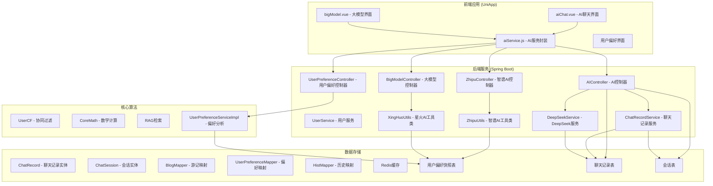
```mermaid
graph TB
subgraph "前端应用 (UniApp)"
A[aiChat.vue - AI聊天界面]
B[bigModel.vue - 大模型界面]
C[aiService.js - AI服务封装]
D[用户偏好界面]
end
subgraph "后端服务 (Spring Boot)"
E[AIController - AI控制器]
F[BigModelController - 大模型控制器]
G[ZhipuController - 智谱AI控制器]
H[UserPreferenceController - 用户偏好控制器]
I[UserService - 用户服务]
J[ChatRecordService - 聊天记录服务]
K[DeepSeekService - DeepSeek服务]
L[ZhipuUtils - 智谱AI工具类]
M[XingHuoUtils - 星火AI工具类]
end
subgraph "核心算法"
N[UserCF - 协同过滤]
O[CoreMath - 数学计算]
P[RAG检索]
Q[UserPreferenceServiceImpl - 偏好分析]
end
subgraph "数据存储"
R[ChatRecord - 聊天记录实体]
S[ChatSession - 会话实体]
T[BlogMapper - 游记映射]
U[UserPreferenceMapper - 偏好映射]
V[HistMapper - 历史映射]
W[Redis缓存]
X[用户偏好快照表]
Y[聊天记录表]
Z[会话表]
end
A --> C
B --> C
C --> E
C --> F
C --> G
C --> H
E --> J
E --> K
F --> M
G --> L
H --> Q
E --> Y
E --> Z
J --> Y
J --> Z
K --> Y
L --> X
M --> X
Q --> X
```

**图表来源**
- [AIController.java:22-26](file://springboot-travel-social/src/main/java/com/cxx/controller/AIController.java#L22-L26)
- [BigModelController.java:15-17](file://springboot-travel-social/src/main/java/com/cxx/controller/BigModelController.java#L15-L17)
- [ZhipuController.java:17-19](file://springboot-travel-social/src/main/java/com/cxx/controller/ZhipuController.java#L17-L19)
- [ChatRecordService.java:8-53](file://springboot-travel-social/src/main/java/com/cxx/service/ChatRecordService.java#L8-L53)
- [DeepSeekService.java:7-46](file://springboot-travel-social/src/main/java/com/cxx/service/DeepSeekService.java#L7-L46)
- [ChatRecord.java:9-48](file://springboot-travel-social/src/main/java/com/cxx/entity/ChatRecord.java#L9-L48)
- [ChatSession.java:9-44](file://springboot-travel-social/src/main/java/com/cxx/entity/ChatSession.java#L9-L44)

**章节来源**
- [AIController.java:1-610](file://springboot-travel-social/src/main/java/com/cxx/controller/AIController.java#L1-L610)
- [BigModelController.java:1-51](file://springboot-travel-social/src/main/java/com/cxx/controller/BigModelController.java#L1-L51)
- [ZhipuController.java:1-97](file://springboot-travel-social/src/main/java/com/cxx/controller/ZhipuController.java#L1-L97)
- [ChatRecordService.java:1-53](file://springboot-travel-social/src/main/java/com/cxx/service/ChatRecordService.java#L1-L53)
- [DeepSeekService.java:1-46](file://springboot-travel-social/src/main/java/com/cxx/service/DeepSeekService.java#L1-L46)

## 核心组件

### 推荐系统核心组件

推荐系统由多个层次组成，从数据采集到算法计算再到结果呈现：

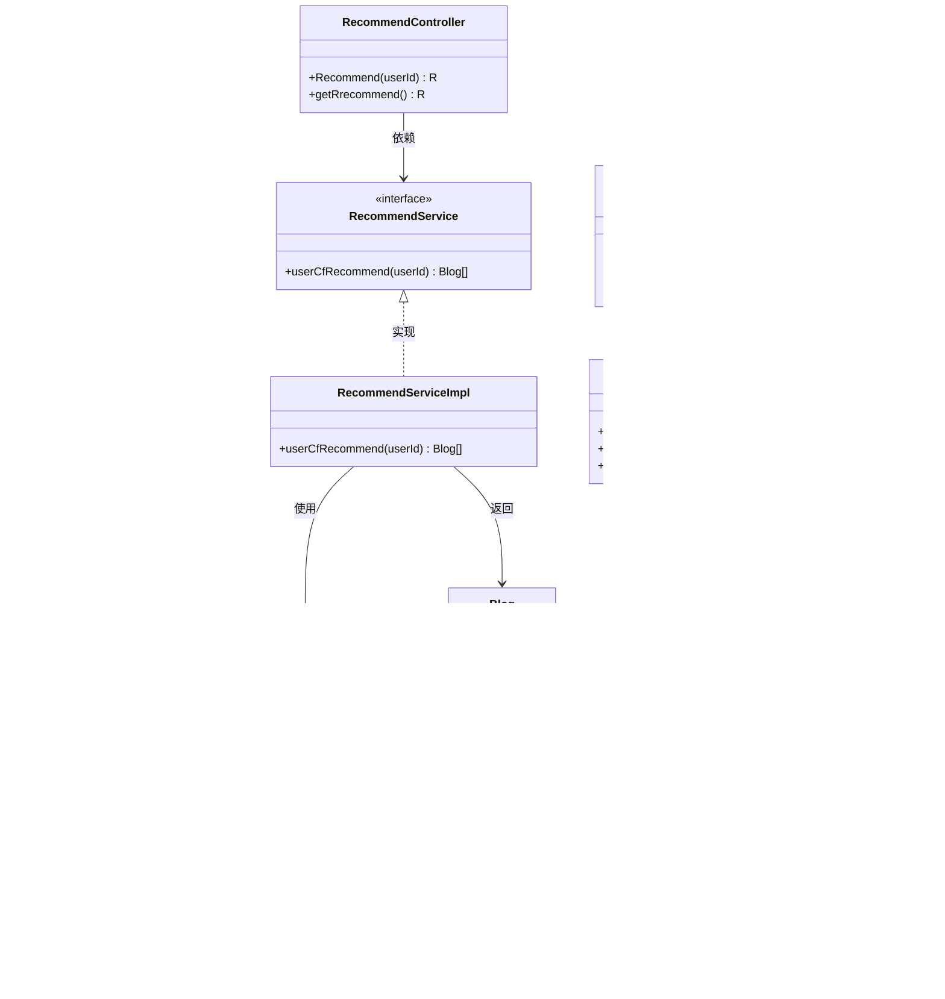
```mermaid
classDiagram
class RecommendController {
+Recommend(userId) R
+getRrecommend() R
}
class RecommendService {
<<interface>>
+userCfRecommend(userId) Blog[]
}
class RecommendServiceImpl {
+userCfRecommend(userId) Blog[]
}
class UserCF {
+recommend(userId, list) Integer[]
}
class CoreMath {
+computeNeighbor(key, map, type) Map~Integer,Double~
+getRelate(xs, ys) double
}
class Hist {
+Integer id
+Integer userId
+Integer blogId
+Double score
}
class Blog {
+Integer id
+String title
+String content
+String type
+Integer liked
}
class UserPreferenceController {
+getPreference(userId, refresh) R
+refreshPreference(userId) R
}
class UserPreferenceService {
<<interface>>
+getPreference(userId, refresh) UserPreference
+calcAndSave(userId) UserPreference
+markDirty(userId) void
}
class UserPreferenceServiceImpl {
+getPreference(userId, refresh) UserPreference
+calcAndSave(userId) UserPreference
+markDirty(userId) void
}
class UserPreference {
+Long id
+Long userId
+String tags
+String visitedCities
+String lastTripCity
+Date lastTripDate
+String spendingLevel
+String travelStyle
+String aiSummary
+Integer dataVersion
+Date expireAt
}
RecommendController --> RecommendService : 依赖
RecommendService <|.. RecommendServiceImpl : 实现
RecommendServiceImpl --> UserCF : 使用
UserCF --> CoreMath : 调用
UserCF --> Hist : 处理
RecommendServiceImpl --> Blog : 返回
UserPreferenceController --> UserPreferenceService : 依赖
UserPreferenceService <|.. UserPreferenceServiceImpl : 实现
UserPreferenceServiceImpl --> UserPreference : 管理
```

**图表来源**
- [RecommendController.java:29-65](file://springboot-travel-social/src/main/java/com/cxx/controller/RecommendController.java#L29-L65)
- [RecommendServiceImpl.java:28-64](file://springboot-travel-social/src/main/java/com/cxx/service/impl/RecommendServiceImpl.java#L28-L64)
- [UserCF.java:10-41](file://springboot-travel-social/src/main/java/com/cxx/core/UserCF.java#L10-L41)
- [CoreMath.java:17-89](file://springboot-travel-social/src/main/java/com/cxx/core/CoreMath.java#L17-L89)
- [Hist.java:16-26](file://springboot-travel-social/src/main/java/com/cxx/entity/Hist.java#L16-L26)
- [UserPreferenceController.java:38-55](file://springboot-travel-social/src/main/java/com/cxx/controller/UserPreferenceController.java#L38-L55)
- [UserPreferenceService.java:9-30](file://springboot-travel-social/src/main/java/com/cxx/service/UserPreferenceService.java#L9-L30)
- [UserPreferenceServiceImpl.java:24-227](file://springboot-travel-social/src/main/java/com/cxx/service/impl/UserPreferenceServiceImpl.java#L24-L227)
- [UserPreference.java:24-74](file://springboot-travel-social/src/main/java/com/cxx/entity/UserPreference.java#L24-L74)

### AI服务组件

AI服务提供了丰富的多模态交互能力：

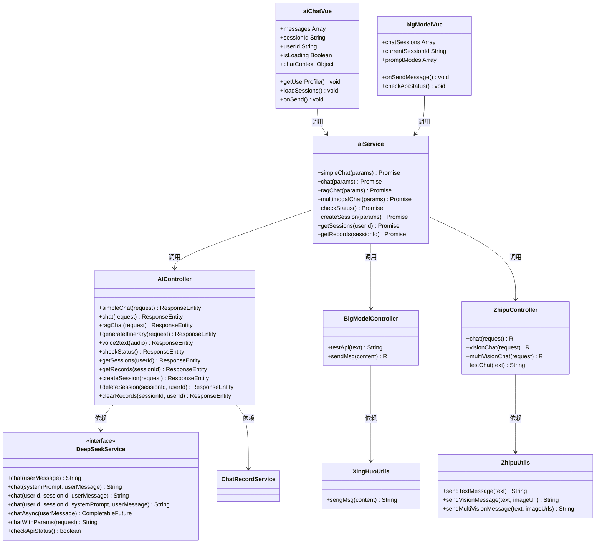
```mermaid
classDiagram
class AIController {
+simpleChat(request) ResponseEntity
+chat(request) ResponseEntity
+ragChat(request) ResponseEntity
+generateItinerary(request) ResponseEntity
+voice2text(audio) ResponseEntity
+checkStatus() ResponseEntity
+getSessions(userId) ResponseEntity
+getRecords(sessionId) ResponseEntity
+createSession(request) ResponseEntity
+deleteSession(sessionId, userId) ResponseEntity
+clearRecords(sessionId, userId) ResponseEntity
}
class BigModelController {
+testApi(text) String
+sendMsg(content) R
}
class ZhipuController {
+chat(request) R
+visionChat(request) R
+multiVisionChat(request) R
+testChat(text) String
}
class DeepSeekService {
<<interface>>
+chat(userMessage) String
+chat(systemPrompt, userMessage) String
+chat(userId, sessionId, userMessage) String
+chat(userId, sessionId, systemPrompt, userMessage) String
+chatAsync(userMessage) CompletableFuture
+chatWithParams(request) String
+checkApiStatus() boolean
}
class ZhipuUtils {
+sendTextMessage(text) String
+sendVisionMessage(text, imageUrl) String
+sendMultiVisionMessage(text, imageUrls) String
}
class XingHuoUtils {
+sengMsg(content) String
}
class aiService {
+simpleChat(params) Promise
+chat(params) Promise
+ragChat(params) Promise
+multimodalChat(params) Promise
+checkStatus() Promise
+createSession(params) Promise
+getSessions(userId) Promise
+getRecords(sessionId) Promise
}
class aiChatVue {
+messages Array
+sessionId String
+userId String
+isLoading Boolean
+chatContext Object
+getUserProfile() void
+loadSessions() void
+onSend() void
}
class bigModelVue {
+chatSessions Array
+currentSessionId String
+promptModes Array
+onSendMessage() void
+checkApiStatus() void
}
AIController --> DeepSeekService : 依赖
AIController --> ChatRecordService : 依赖
BigModelController --> XingHuoUtils : 依赖
ZhipuController --> ZhipuUtils : 依赖
aiChatVue --> aiService : 调用
bigModelVue --> aiService : 调用
aiService --> AIController : 调用
aiService --> BigModelController : 调用
aiService --> ZhipuController : 调用
```

**图表来源**
- [AIController.java:26-610](file://springboot-travel-social/src/main/java/com/cxx/controller/AIController.java#L26-L610)
- [BigModelController.java:17-51](file://springboot-travel-social/src/main/java/com/cxx/controller/BigModelController.java#L17-L51)
- [ZhipuController.java:19-97](file://springboot-travel-social/src/main/java/com/cxx/controller/ZhipuController.java#L19-L97)
- [DeepSeekService.java:7-46](file://springboot-travel-social/src/main/java/com/cxx/service/DeepSeekService.java#L7-L46)
- [ZhipuUtils.java:26-206](file://springboot-travel-social/src/main/java/com/cxx/utils/ZhipuUtils.java#L26-206)
- [XingHuoUtils.java:23-61](file://springboot-travel-social/src/main/java/com/cxx/utils/XingHuoUtils.java#L23-61)
- [aiService.js:43-324](file://uniapp-travel-social/services/aiService.js#L43-L324)
- [aiChat.vue:564-590](file://uniapp-travel-social/homePages/aiChat/aiChat.vue#L564-L590)
- [bigModel.vue:411-531](file://uniapp-travel-social/homePages/bigModel/bigModel.vue#L411-L531)

**章节来源**
- [AIController.java:1-610](file://springboot-travel-social/src/main/java/com/cxx/controller/AIController.java#L1-L610)
- [BigModelController.java:1-51](file://springboot-travel-social/src/main/java/com/cxx/controller/BigModelController.java#L1-L51)
- [ZhipuController.java:1-97](file://springboot-travel-social/src/main/java/com/cxx/controller/ZhipuController.java#L1-L97)
- [DeepSeekService.java:1-46](file://springboot-travel-social/src/main/java/com/cxx/service/DeepSeekService.java#L1-L46)
- [ZhipuUtils.java:1-206](file://springboot-travel-social/src/main/java/com/cxx/utils/ZhipuUtils.java#L1-L206)
- [XingHuoUtils.java:1-61](file://springboot-travel-social/src/main/java/com/cxx/utils/XingHuoUtils.java#L1-L61)

## 架构概览

系统采用微服务架构，前后端分离的设计模式：

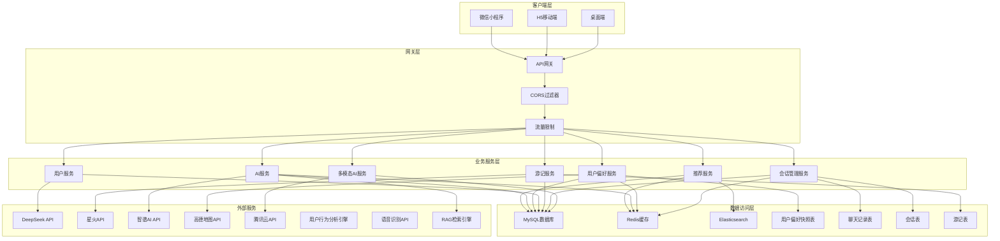
```mermaid
graph TB
subgraph "客户端层"
A[微信小程序]
B[H5移动端]
C[桌面端]
end
subgraph "网关层"
D[API网关]
E[CORS过滤器]
F[流量限制]
end
subgraph "业务服务层"
G[推荐服务]
H[AI服务]
I[用户偏好服务]
J[用户服务]
K[游记服务]
L[会话管理服务]
M[多模态AI服务]
end
subgraph "数据访问层"
N[MySQL数据库]
O[Redis缓存]
P[Elasticsearch]
Q[用户偏好快照表]
R[聊天记录表]
S[会话表]
T[游记表]
end
subgraph "外部服务"
U[DeepSeek API]
V[星火API]
W[智谱AI API]
X[高德地图API]
Y[腾讯云API]
Z[用户行为分析引擎]
AA[语音识别API]
BB[RAG检索引擎]
end
A --> D
B --> D
C --> D
D --> E
E --> F
F --> G
F --> H
F --> I
F --> J
F --> K
F --> L
F --> M
G --> N
H --> N
I --> N
J --> N
K --> N
L --> N
M --> N
G --> O
H --> O
I --> O
L --> O
G --> P
I --> Q
L --> R
L --> S
K --> T
J --> U
K --> V
H --> W
I --> X
M --> Y
H --> BB
```

**图表来源**
- [application.properties:1-64](file://springboot-travel-social/src/main/resources/application.properties#L1-L64)

## 详细组件分析

### 协同过滤推荐算法

推荐算法采用基于用户的协同过滤（User-Based Collaborative Filtering）方法：

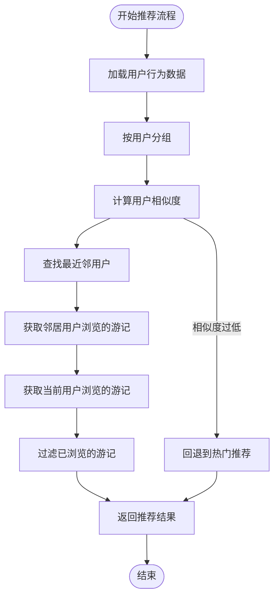
```mermaid
flowchart TD
Start([开始推荐流程]) --> LoadData["加载用户行为数据"]
LoadData --> GroupUsers["按用户分组"]
GroupUsers --> CalcSimilarity["计算用户相似度"]
CalcSimilarity --> FindNeighbors["查找最近邻用户"]
FindNeighbors --> GetNeighborItems["获取邻居用户浏览的游记"]
GetNeighborItems --> GetUserItems["获取当前用户浏览的游记"]
GetUserItems --> FilterItems["过滤已浏览的游记"]
FilterItems --> ReturnResults["返回推荐结果"]
ReturnResults --> End([结束])
CalcSimilarity --> |相似度过低| Fallback["回退到热门推荐"]
Fallback --> ReturnResults
```

**图表来源**
- [UserCF.java:16-39](file://springboot-travel-social/src/main/java/com/cxx/core/UserCF.java#L16-L39)
- [CoreMath.java:22-35](file://springboot-travel-social/src/main/java/com/cxx/core/CoreMath.java#L22-L35)

算法实现细节：
1. **数据预处理**：将用户行为数据按用户ID分组
2. **相似度计算**：使用皮尔逊相关系数计算用户间相似度
3. **邻居选择**：选择相似度最高的用户作为邻居
4. **推荐生成**：推荐邻居用户看过但当前用户未看过的游记

**章节来源**
- [UserCF.java:10-41](file://springboot-travel-social/src/main/java/com/cxx/core/UserCF.java#L10-L41)
- [CoreMath.java:17-89](file://springboot-travel-social/src/main/java/com/cxx/core/CoreMath.java#L17-L89)

### 用户偏好管理系统

用户偏好管理系统负责收集和维护用户的旅行偏好信息：

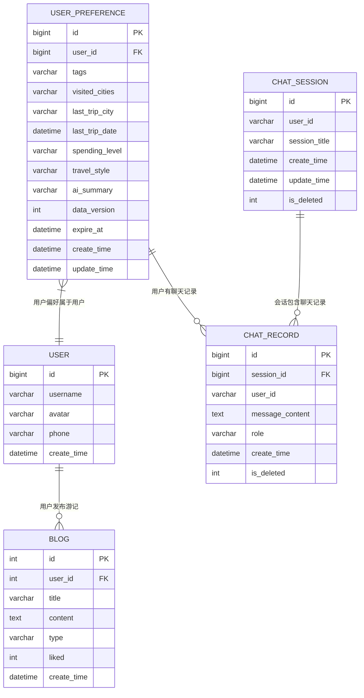
```mermaid
erDiagram
USER_PREFERENCE {
bigint id PK
bigint user_id FK
varchar tags
varchar visited_cities
varchar last_trip_city
datetime last_trip_date
varchar spending_level
varchar travel_style
varchar ai_summary
int data_version
datetime expire_at
datetime create_time
datetime update_time
}
USER {
bigint id PK
varchar username
varchar avatar
varchar phone
datetime create_time
}
BLOG {
int id PK
int user_id FK
varchar title
text content
varchar type
int liked
datetime create_time
}
CHAT_RECORD {
bigint id PK
bigint session_id FK
varchar user_id
text message_content
varchar role
datetime create_time
int is_deleted
}
CHAT_SESSION {
bigint id PK
varchar user_id
varchar session_title
datetime create_time
datetime update_time
int is_deleted
}
USER_PREFERENCE }|--|| USER : "用户偏好属于用户"
USER ||--o{ BLOG : "用户发布游记"
USER_PREFERENCE ||--o{ CHAT_RECORD : "用户有聊天记录"
CHAT_SESSION ||--o{ CHAT_RECORD : "会话包含聊天记录"
```

**图表来源**
- [UserPreference.java:24-74](file://springboot-travel-social/src/main/java/com/cxx/entity/UserPreference.java#L24-L74)
- [UserPreferenceMapper.java:14-52](file://springboot-travel-social/src/main/java/com/cxx/mapper/UserPreferenceMapper.java#L14-L52)
- [ChatRecord.java:9-48](file://springboot-travel-social/src/main/java/com/cxx/entity/ChatRecord.java#L9-L48)
- [ChatSession.java:9-44](file://springboot-travel-social/src/main/java/com/cxx/entity/ChatSession.java#L9-L44)

偏好数据包括：
- **旅行标签**：如"海边"、"亲子"、"美食"等兴趣标签
- **去过城市**：用户曾经到访的城市列表
- **消费水平**：low/mid/high/luxury四个等级
- **旅行风格**：用户偏好的旅行方式描述
- **AI摘要**：用于AI模型的用户画像摘要

**章节来源**
- [UserPreference.java:15-74](file://springboot-travel-social/src/main/java/com/cxx/entity/UserPreference.java#L15-L74)
- [UserPreferenceMapper.java:17-51](file://springboot-travel-social/src/main/java/com/cxx/mapper/UserPreferenceMapper.java#L17-L51)

### AI聊天服务架构

AI聊天服务提供了多种交互模式：

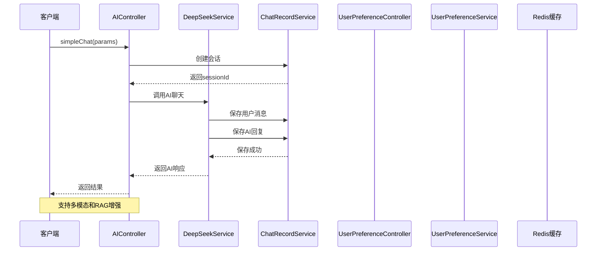
```mermaid
sequenceDiagram
participant Client as 客户端
participant AIController as AIController
participant DeepSeekService as DeepSeekService
participant ChatRecordService as ChatRecordService
participant UserPreferenceController as UserPreferenceController
participant UserPreferenceService as UserPreferenceService
participant Redis as Redis缓存
Client->>AIController : simpleChat(params)
AIController->>ChatRecordService : 创建会话
ChatRecordService-->>AIController : 返回sessionId
AIController->>DeepSeekService : 调用AI聊天
DeepSeekService->>ChatRecordService : 保存用户消息
DeepSeekService->>ChatRecordService : 保存AI回复
ChatRecordService-->>DeepSeekService : 保存成功
DeepSeekService-->>AIController : 返回AI响应
AIController-->>Client : 返回结果
Note over Client,AIController : 支持多模态和RAG增强
```

**图表来源**
- [AIController.java:37-134](file://springboot-travel-social/src/main/java/com/cxx/controller/AIController.java#L37-L134)
- [DeepSeekServiceImpl.java:62-111](file://springboot-travel-social/src/main/java/com/cxx/service/impl/DeepSeekServiceImpl.java#L62-L111)
- [ChatRecordServiceImpl.java:24-40](file://springboot-travel-social/src/main/java/com/cxx/service/impl/ChatRecordServiceImpl.java#L24-L40)

**章节来源**
- [AIController.java:1-610](file://springboot-travel-social/src/main/java/com/cxx/controller/AIController.java#L1-L610)
- [DeepSeekServiceImpl.java:1-213](file://springboot-travel-social/src/main/java/com/cxx/service/impl/DeepSeekServiceImpl.java#L1-L213)
- [ChatRecordServiceImpl.java:1-40](file://springboot-travel-social/src/main/java/com/cxx/service/impl/ChatRecordServiceImpl.java#L1-L40)

### RAG检索增强架构

RAG（Retrieval-Augmented Generation）架构结合了检索和生成的优势：

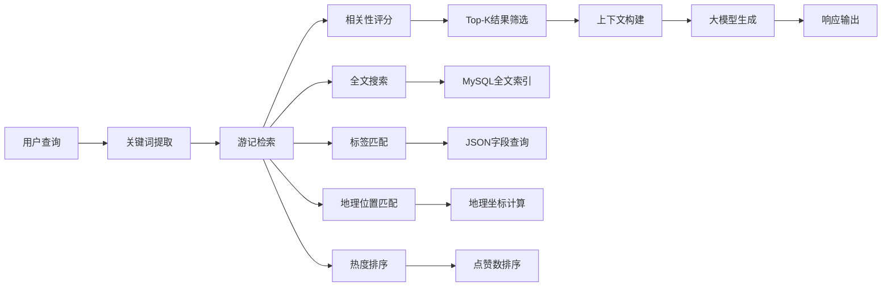
```mermaid
flowchart LR
A[用户查询] --> B[关键词提取]
B --> C[游记检索]
C --> D[相关性评分]
D --> E[Top-K结果筛选]
E --> F[上下文构建]
F --> G[大模型生成]
G --> H[响应输出]
C --> I[全文搜索]
C --> J[标签匹配]
C --> K[地理位置匹配]
C --> L[热度排序]
I --> M[MySQL全文索引]
J --> N[JSON字段查询]
K --> O[地理坐标计算]
L --> P[点赞数排序]
```

**图表来源**
- [BlogMapper.java:35-44](file://springboot-travel-social/src/main/java/com/cxx/mapper/BlogMapper.java#L35-L44)

**章节来源**
- [BlogMapper.java:28-44](file://springboot-travel-social/src/main/java/com/cxx/mapper/BlogMapper.java#L28-L44)

## AI控制器体系

### AIController核心功能

AIController是系统的核心AI控制器，提供完整的AI聊天服务能力：

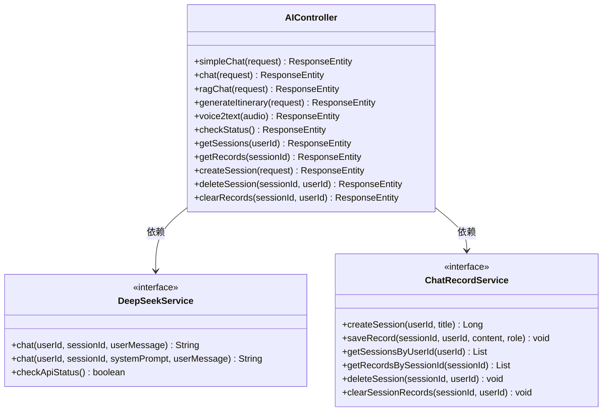
```mermaid
classDiagram
class AIController {
+simpleChat(request) ResponseEntity
+chat(request) ResponseEntity
+ragChat(request) ResponseEntity
+generateItinerary(request) ResponseEntity
+voice2text(audio) ResponseEntity
+checkStatus() ResponseEntity
+getSessions(userId) ResponseEntity
+getRecords(sessionId) ResponseEntity
+createSession(request) ResponseEntity
+deleteSession(sessionId, userId) ResponseEntity
+clearRecords(sessionId, userId) ResponseEntity
}
class DeepSeekService {
<<interface>>
+chat(userId, sessionId, userMessage) String
+chat(userId, sessionId, systemPrompt, userMessage) String
+checkApiStatus() boolean
}
class ChatRecordService {
<<interface>>
+createSession(userId, title) Long
+saveRecord(sessionId, userId, content, role) void
+getSessionsByUserId(userId) List
+getRecordsBySessionId(sessionId) List
+deleteSession(sessionId, userId) void
+clearSessionRecords(sessionId, userId) void
}
AIController --> DeepSeekService : 依赖
AIController --> ChatRecordService : 依赖
```

**图表来源**
- [AIController.java:26-610](file://springboot-travel-social/src/main/java/com/cxx/controller/AIController.java#L26-L610)
- [DeepSeekService.java:7-46](file://springboot-travel-social/src/main/java/com/cxx/service/DeepSeekService.java#L7-L46)
- [ChatRecordService.java:8-53](file://springboot-travel-social/src/main/java/com/cxx/service/ChatRecordService.java#L8-L53)

AIController的主要功能模块：
1. **基础聊天功能**：simpleChat和chat接口，支持系统提示词
2. **RAG增强聊天**：ragChat接口，结合游记检索增强AI回复
3. **智能行程生成**：generateItinerary接口，根据用户需求生成详细行程
4. **会话管理**：完整的会话生命周期管理
5. **语音识别**：voice2text接口，支持语音转文字
6. **状态监控**：checkStatus接口，监控AI服务状态

**章节来源**
- [AIController.java:1-610](file://springboot-travel-social/src/main/java/com/cxx/controller/AIController.java#L1-L610)

### BigModelController星火大模型集成

BigModelController专门用于集成星火大模型服务：

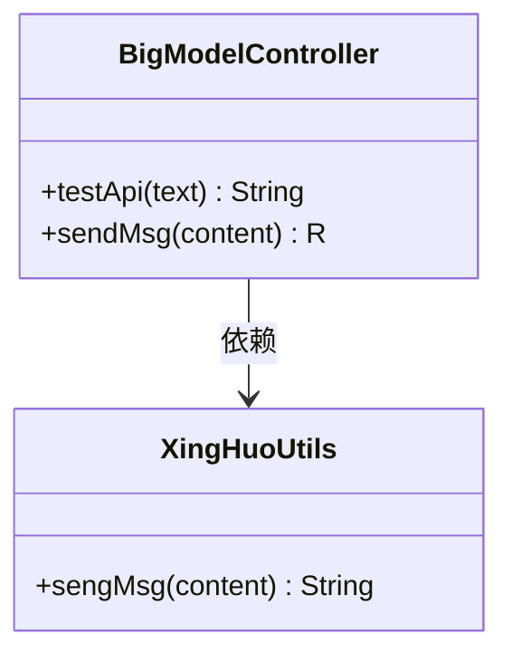
```mermaid
classDiagram
class BigModelController {
+testApi(text) String
+sendMsg(content) R
}
class XingHuoUtils {
+sengMsg(content) String
}
BigModelController --> XingHuoUtils : 依赖
```

**图表来源**
- [BigModelController.java:17-51](file://springboot-travel-social/src/main/java/com/cxx/controller/BigModelController.java#L17-L51)
- [XingHuoUtils.java:23-61](file://springboot-travel-social/src/main/java/com/cxx/utils/XingHuoUtils.java#L23-61)

BigModelController提供：
1. **测试接口**：testApi方法，用于API连通性测试
2. **消息发送**：sendMsg方法，发送消息给星火大模型
3. **星火集成**：通过XingHuoUtils工具类调用星火API

**章节来源**
- [BigModelController.java:1-51](file://springboot-travel-social/src/main/java/com/cxx/controller/BigModelController.java#L1-L51)
- [XingHuoUtils.java:1-61](file://springboot-travel-social/src/main/java/com/cxx/utils/XingHuoUtils.java#L1-L61)

### ZhipuController智谱AI多模态集成

ZhipuController提供智谱AI的多模态对话能力：

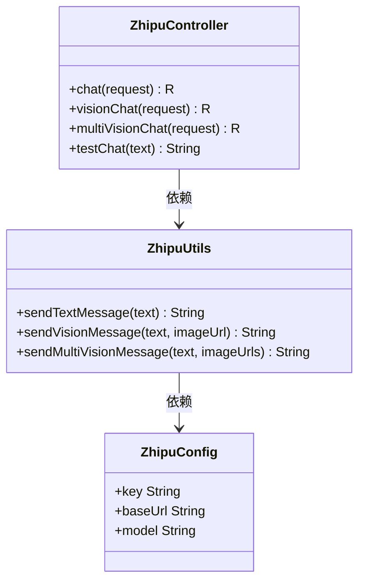
```mermaid
classDiagram
class ZhipuController {
+chat(request) R
+visionChat(request) R
+multiVisionChat(request) R
+testChat(text) String
}
class ZhipuUtils {
+sendTextMessage(text) String
+sendVisionMessage(text, imageUrl) String
+sendMultiVisionMessage(text, imageUrls) String
}
class ZhipuConfig {
+key String
+baseUrl String
+model String
}
ZhipuController --> ZhipuUtils : 依赖
ZhipuUtils --> ZhipuConfig : 依赖
```

**图表来源**
- [ZhipuController.java:19-97](file://springboot-travel-social/src/main/java/com/cxx/controller/ZhipuController.java#L19-L97)
- [ZhipuUtils.java:26-206](file://springboot-travel-social/src/main/java/com/cxx/utils/ZhipuUtils.java#L26-206)
- [ZhipuConfig.java:15-19](file://springboot-travel-social/src/main/java/com/cxx/config/ZhipuConfig.java#L15-L19)

ZhipuController支持：
1. **纯文本对话**：chat方法，支持纯文本消息
2. **图文对话**：visionChat方法，支持文本+单张图片
3. **多图文对话**：multiVisionChat方法，支持文本+多张图片
4. **配置管理**：通过ZhipuConfig管理API配置

**章节来源**
- [ZhipuController.java:1-97](file://springboot-travel-social/src/main/java/com/cxx/controller/ZhipuController.java#L1-L97)
- [ZhipuUtils.java:1-206](file://springboot-travel-social/src/main/java/com/cxx/utils/ZhipuUtils.java#L1-L206)
- [ZhipuConfig.java:1-19](file://springboot-travel-social/src/main/java/com/cxx/config/ZhipuConfig.java#L1-L19)

## 会话管理系统

### 会话实体设计

会话管理系统采用两个核心实体类：

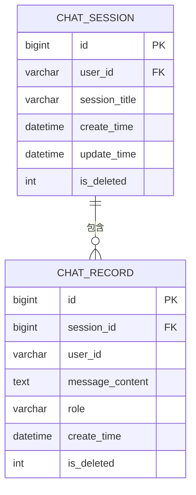
```mermaid
erDiagram
CHAT_SESSION {
bigint id PK
varchar user_id FK
varchar session_title
datetime create_time
datetime update_time
int is_deleted
}
CHAT_RECORD {
bigint id PK
bigint session_id FK
varchar user_id
text message_content
varchar role
datetime create_time
int is_deleted
}
CHAT_SESSION ||--o{ CHAT_RECORD : "包含"
```

**图表来源**
- [ChatSession.java:9-44](file://springboot-travel-social/src/main/java/com/cxx/entity/ChatSession.java#L9-L44)
- [ChatRecord.java:9-48](file://springboot-travel-social/src/main/java/com/cxx/entity/ChatRecord.java#L9-L48)

ChatSession实体属性：
- **id**：会话唯一标识
- **userId**：关联用户ID
- **sessionTitle**：会话标题
- **createTime/updateTime**：创建和更新时间
- **isDeleted**：逻辑删除标志

ChatRecord实体属性：
- **id**：记录唯一标识
- **sessionId**：关联会话ID
- **userId**：用户ID
- **messageContent**：消息内容
- **role**：角色标识（user/ai）
- **createTime**：创建时间
- **isDeleted**：逻辑删除标志

**章节来源**
- [ChatSession.java:1-44](file://springboot-travel-social/src/main/java/com/cxx/entity/ChatSession.java#L1-L44)
- [ChatRecord.java:1-48](file://springboot-travel-social/src/main/java/com/cxx/entity/ChatRecord.java#L1-L48)

### 会话服务实现

会话管理服务提供完整的会话生命周期管理：

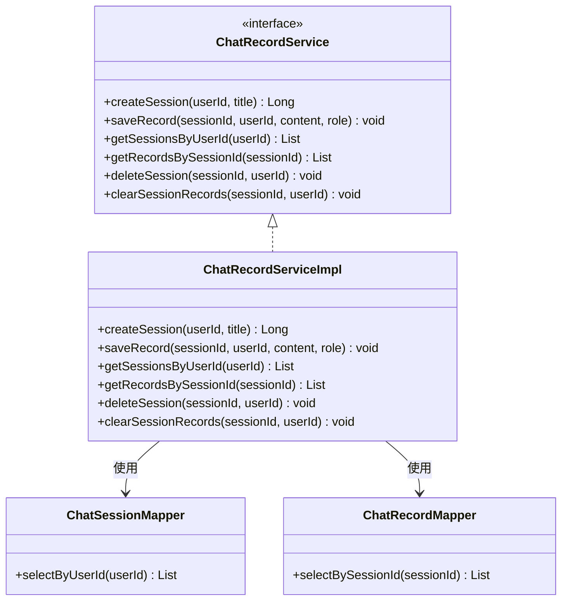
```mermaid
classDiagram
class ChatRecordService {
<<interface>>
+createSession(userId, title) Long
+saveRecord(sessionId, userId, content, role) void
+getSessionsByUserId(userId) List
+getRecordsBySessionId(sessionId) List
+deleteSession(sessionId, userId) void
+clearSessionRecords(sessionId, userId) void
}
class ChatRecordServiceImpl {
+createSession(userId, title) Long
+saveRecord(sessionId, userId, content, role) void
+getSessionsByUserId(userId) List
+getRecordsBySessionId(sessionId) List
+deleteSession(sessionId, userId) void
+clearSessionRecords(sessionId, userId) void
}
class ChatSessionMapper {
+selectByUserId(userId) List
}
class ChatRecordMapper {
+selectBySessionId(sessionId) List
}
ChatRecordService <|.. ChatRecordServiceImpl
ChatRecordServiceImpl --> ChatSessionMapper : 使用
ChatRecordServiceImpl --> ChatRecordMapper : 使用
```

**图表来源**
- [ChatRecordService.java:8-53](file://springboot-travel-social/src/main/java/com/cxx/service/ChatRecordService.java#L8-L53)
- [ChatRecordServiceImpl.java:19-40](file://springboot-travel-social/src/main/java/com/cxx/service/impl/ChatRecordServiceImpl.java#L19-L40)
- [ChatSessionMapper.java:9-13](file://springboot-travel-social/src/main/java/com/cxx/mapper/ChatSessionMapper.java#L9-L13)

会话管理功能：
1. **会话创建**：createSession方法，创建新的聊天会话
2. **消息保存**：saveRecord方法，保存用户和AI的消息记录
3. **会话查询**：getSessionsByUserId方法，按用户查询会话列表
4. **记录查询**：getRecordsBySessionId方法，按会话查询消息记录
5. **会话删除**：deleteSession方法，级联删除会话和消息
6. **记录清理**：clearSessionRecords方法，清空会话内所有消息

**章节来源**
- [ChatRecordService.java:1-53](file://springboot-travel-social/src/main/java/com/cxx/service/ChatRecordService.java#L1-L53)
- [ChatRecordServiceImpl.java:1-40](file://springboot-travel-social/src/main/java/com/cxx/service/impl/ChatRecordServiceImpl.java#L1-L40)
- [ChatSessionMapper.java:1-13](file://springboot-travel-social/src/main/java/com/cxx/mapper/ChatSessionMapper.java#L1-L13)

## 多模态AI服务

### DeepSeekService深度求索集成

DeepSeekService提供对DeepSeek大模型的统一接口：

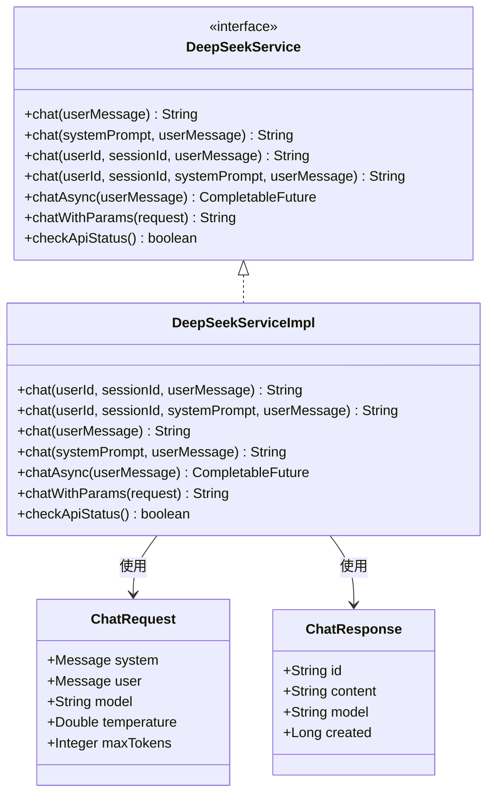
```mermaid
classDiagram
class DeepSeekService {
<<interface>>
+chat(userMessage) String
+chat(systemPrompt, userMessage) String
+chat(userId, sessionId, userMessage) String
+chat(userId, sessionId, systemPrompt, userMessage) String
+chatAsync(userMessage) CompletableFuture
+chatWithParams(request) String
+checkApiStatus() boolean
}
class DeepSeekServiceImpl {
+chat(userId, sessionId, userMessage) String
+chat(userId, sessionId, systemPrompt, userMessage) String
+chat(userMessage) String
+chat(systemPrompt, userMessage) String
+chatAsync(userMessage) CompletableFuture
+chatWithParams(request) String
+checkApiStatus() boolean
}
class ChatRequest {
+Message system
+Message user
+String model
+Double temperature
+Integer maxTokens
}
class ChatResponse {
+String id
+String content
+String model
+Long created
}
DeepSeekService <|.. DeepSeekServiceImpl
DeepSeekServiceImpl --> ChatRequest : 使用
DeepSeekServiceImpl --> ChatResponse : 使用
```

**图表来源**
- [DeepSeekService.java:7-46](file://springboot-travel-social/src/main/java/com/cxx/service/DeepSeekService.java#L7-L46)
- [DeepSeekServiceImpl.java:25-213](file://springboot-travel-social/src/main/java/com/cxx/service/impl/DeepSeekServiceImpl.java#L25-L213)

DeepSeekService支持的功能：
1. **基础聊天**：chat方法，支持纯文本聊天
2. **系统提示**：chat方法重载，支持自定义系统提示词
3. **会话管理**：chat方法重载，支持用户ID和会话ID管理
4. **异步处理**：chatAsync方法，支持异步聊天
5. **参数化聊天**：chatWithParams方法，支持复杂参数配置
6. **状态检查**：checkApiStatus方法，检查API可用性

**章节来源**
- [DeepSeekService.java:1-46](file://springboot-travel-social/src/main/java/com/cxx/service/DeepSeekService.java#L1-L46)
- [DeepSeekServiceImpl.java:1-213](file://springboot-travel-social/src/main/java/com/cxx/service/impl/DeepSeekServiceImpl.java#L1-L213)

### ZhipuUtils多模态AI工具

ZhipuUtils提供智谱AI的多模态对话能力：

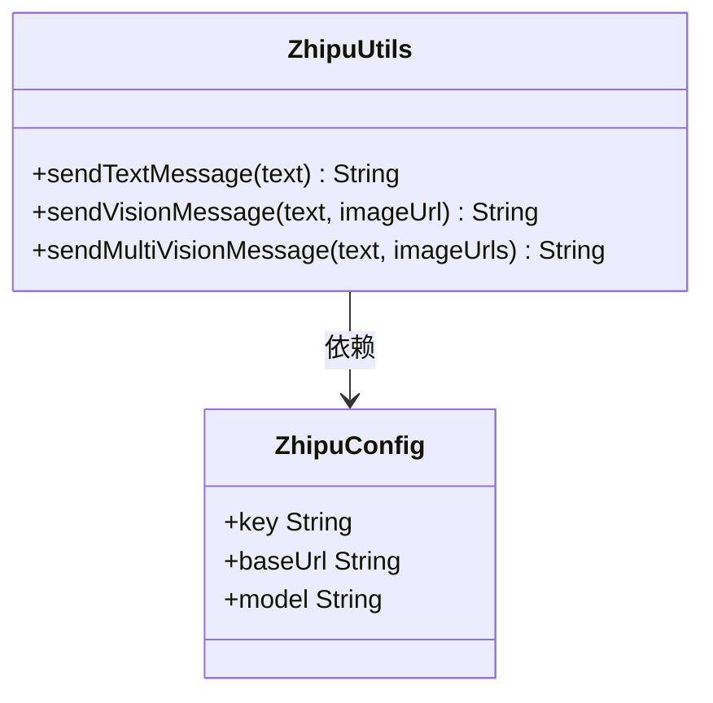
```mermaid
classDiagram
class ZhipuUtils {
+sendTextMessage(text) String
+sendVisionMessage(text, imageUrl) String
+sendMultiVisionMessage(text, imageUrls) String
}
class ZhipuConfig {
+key String
+baseUrl String
+model String
}
ZhipuUtils --> ZhipuConfig : 依赖
```

**图表来源**
- [ZhipuUtils.java:26-206](file://springboot-travel-social/src/main/java/com/cxx/utils/ZhipuUtils.java#L26-206)
- [ZhipuConfig.java:15-19](file://springboot-travel-social/src/main/java/com/cxx/config/ZhipuConfig.java#L15-L19)

ZhipuUtils支持的多模态功能：
1. **纯文本消息**：sendTextMessage方法，发送纯文本消息
2. **图文混合**：sendVisionMessage方法，支持文本+图片
3. **多图混合**：sendMultiVisionMessage方法，支持文本+多图片
4. **配置管理**：通过ZhipuConfig管理API密钥、基础URL和模型

**章节来源**
- [ZhipuUtils.java:1-206](file://springboot-travel-social/src/main/java/com/cxx/utils/ZhipuUtils.java#L1-L206)
- [ZhipuConfig.java:1-19](file://springboot-travel-social/src/main/java/com/cxx/config/ZhipuConfig.java#L1-L19)

## 用户偏好系统

### 用户偏好快照机制

用户偏好系统通过快照机制实现高效的数据管理：

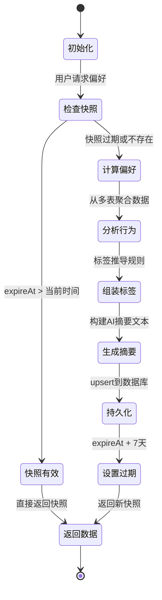
```mermaid
stateDiagram-v2
[*] --> 初始化
初始化 --> 检查快照 : 用户请求偏好
检查快照 --> 快照有效 : expireAt > 当前时间
检查快照 --> 计算偏好 : 快照过期或不存在
快照有效 --> 返回数据 : 直接返回快照
计算偏好 --> 分析行为 : 从多表聚合数据
分析行为 --> 组装标签 : 标签推导规则
组装标签 --> 生成摘要 : 构建AI摘要文本
生成摘要 --> 持久化 : upsert到数据库
持久化 --> 设置过期 : expireAt + 7天
设置过期 --> 返回数据 : 返回新快照
返回数据 --> [*]
```

**图表来源**
- [UserPreferenceServiceImpl.java:45-58](file://springboot-travel-social/src/main/java/com/cxx/service/impl/UserPreferenceServiceImpl.java#L45-L58)
- [UserPreferenceServiceImpl.java:61-177](file://springboot-travel-social/src/main/java/com/cxx/service/impl/UserPreferenceServiceImpl.java#L61-L177)

### 偏好标签计算逻辑

系统通过多维度分析用户行为数据，自动生成偏好标签：

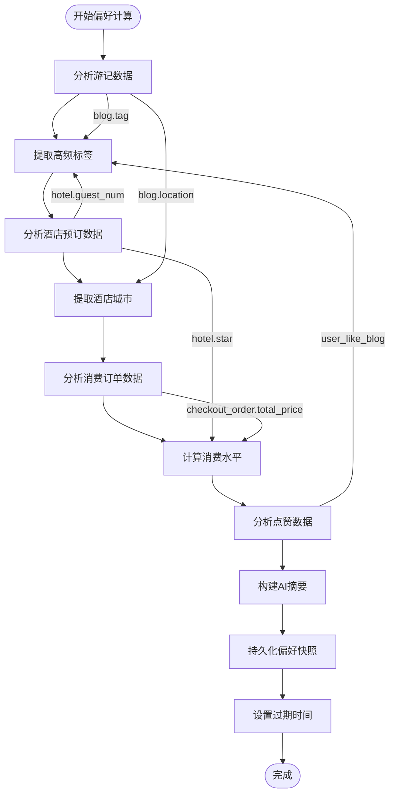
```mermaid
flowchart TD
Start([开始偏好计算]) --> AnalyzeBlog["分析游记数据"]
AnalyzeBlog --> ExtractTags["提取高频标签"]
ExtractTags --> AnalyzeHotel["分析酒店预订数据"]
AnalyzeHotel --> ExtractCities["提取酒店城市"]
ExtractCities --> AnalyzeCheckout["分析消费订单数据"]
AnalyzeCheckout --> CalcSpending["计算消费水平"]
CalcSpending --> AnalyzeLikes["分析点赞数据"]
AnalyzeLikes --> BuildSummary["构建AI摘要"]
BuildSummary --> PersistData["持久化偏好快照"]
PersistData --> SetExpire["设置过期时间"]
SetExpire --> End([完成])
AnalyzeBlog --> |blog.tag| ExtractTags
AnalyzeBlog --> |blog.location| ExtractCities
AnalyzeHotel --> |hotel.star| CalcSpending
AnalyzeHotel --> |hotel.guest_num| ExtractTags
AnalyzeCheckout --> |checkout_order.total_price| CalcSpending
AnalyzeLikes --> |user_like_blog| ExtractTags
```

**图表来源**
- [UserPreferenceServiceImpl.java:66-124](file://springboot-travel-social/src/main/java/com/cxx/service/impl/UserPreferenceServiceImpl.java#L66-L124)
- [UserPreferenceMapper.xml:6-124](file://springboot-travel-social/src/main/resources/com/cxx/mapper/UserPreferenceMapper.xml#L6-L124)

**章节来源**
- [UserPreferenceServiceImpl.java:24-227](file://springboot-travel-social/src/main/java/com/cxx/service/impl/UserPreferenceServiceImpl.java#L24-L227)
- [UserPreferenceMapper.xml:1-127](file://springboot-travel-social/src/main/resources/com/cxx/mapper/UserPreferenceMapper.xml#L1-L127)

## 智能推荐算法

### 多源数据融合推荐

系统采用多源数据融合的方式提升推荐准确性：

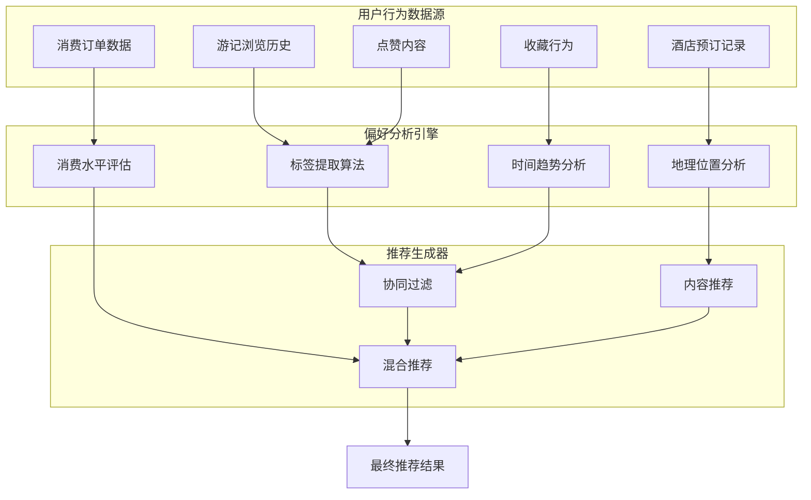
```mermaid
graph TB
subgraph "用户行为数据源"
A[游记浏览历史]
B[酒店预订记录]
C[消费订单数据]
D[点赞内容]
E[收藏行为]
end
subgraph "偏好分析引擎"
F[标签提取算法]
G[地理位置分析]
H[消费水平评估]
I[时间趋势分析]
end
subgraph "推荐生成器"
J[协同过滤]
K[内容推荐]
L[混合推荐]
end
A --> F
B --> G
C --> H
D --> F
E --> I
F --> J
G --> K
H --> L
I --> J
J --> L
K --> L
L --> M[最终推荐结果]
```

**图表来源**
- [UserPreferenceServiceImpl.java:66-124](file://springboot-travel-social/src/main/java/com/cxx/service/impl/UserPreferenceServiceImpl.java#L66-L124)
- [RecommendServiceImpl.java:39-62](file://springboot-travel-social/src/main/java/com/cxx/service/impl/RecommendServiceImpl.java#L39-L62)

### 推荐算法优化策略

1. **多算法融合**：结合协同过滤和内容推荐算法
2. **权重动态调整**：根据用户活跃度调整算法权重
3. **实时反馈机制**：根据用户点击行为优化推荐结果
4. **冷启动处理**：为新用户提供基于人口统计学的推荐

**章节来源**
- [RecommendServiceImpl.java:27-64](file://springboot-travel-social/src/main/java/com/cxx/service/impl/RecommendServiceImpl.java#L27-L64)
- [UserPreferenceServiceImpl.java:134-177](file://springboot-travel-social/src/main/java/com/cxx/service/impl/UserPreferenceServiceImpl.java#L134-L177)

## AI聊天服务增强

### 用户画像注入机制

AI聊天服务集成了用户偏好画像，提供个性化对话体验：

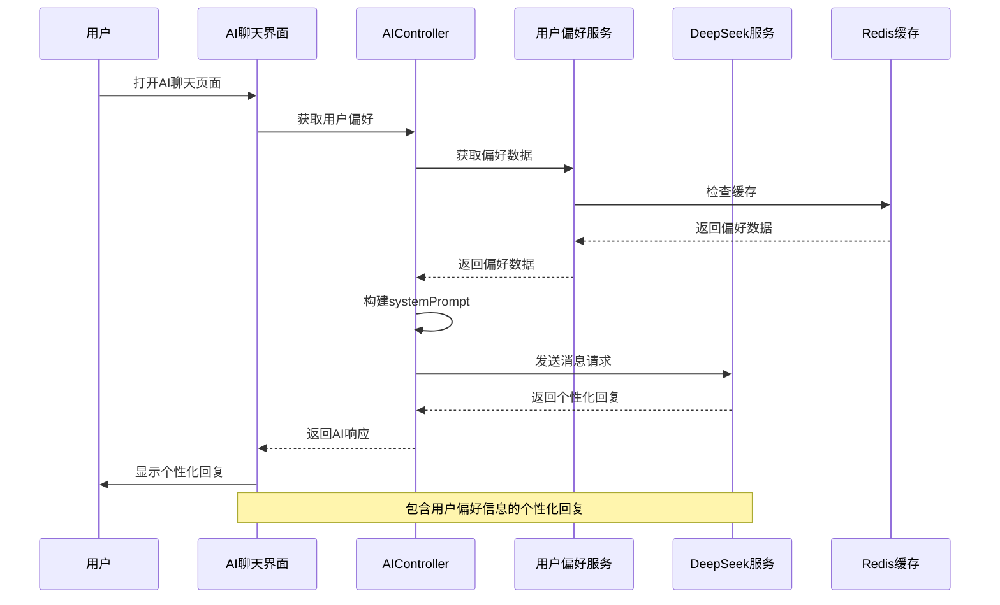
```mermaid
sequenceDiagram
participant User as 用户
participant Chat as AI聊天界面
participant AIController as AIController
participant UserPreferenceService as 用户偏好服务
participant DeepSeekService as DeepSeek服务
participant Redis as Redis缓存
User->>Chat : 打开AI聊天页面
Chat->>AIController : 获取用户偏好
AIController->>UserPreferenceService : 获取偏好数据
UserPreferenceService->>Redis : 检查缓存
Redis-->>UserPreferenceService : 返回偏好数据
UserPreferenceService-->>AIController : 返回偏好数据
AIController->>AIController : 构建systemPrompt
AIController->>DeepSeekService : 发送消息请求
DeepSeekService-->>AIController : 返回个性化回复
AIController-->>Chat : 返回AI响应
Chat->>User : 显示个性化回复
Note over Chat,DeepSeekService : 包含用户偏好信息的个性化回复
```

**图表来源**
- [AIController.java:514-597](file://springboot-travel-social/src/main/java/com/cxx/controller/AIController.java#L514-L597)
- [DeepSeekServiceImpl.java:62-111](file://springboot-travel-social/src/main/java/com/cxx/service/impl/DeepSeekServiceImpl.java#L62-L111)

### 个性化欢迎语系统

系统根据用户历史旅行记录提供个性化欢迎语：

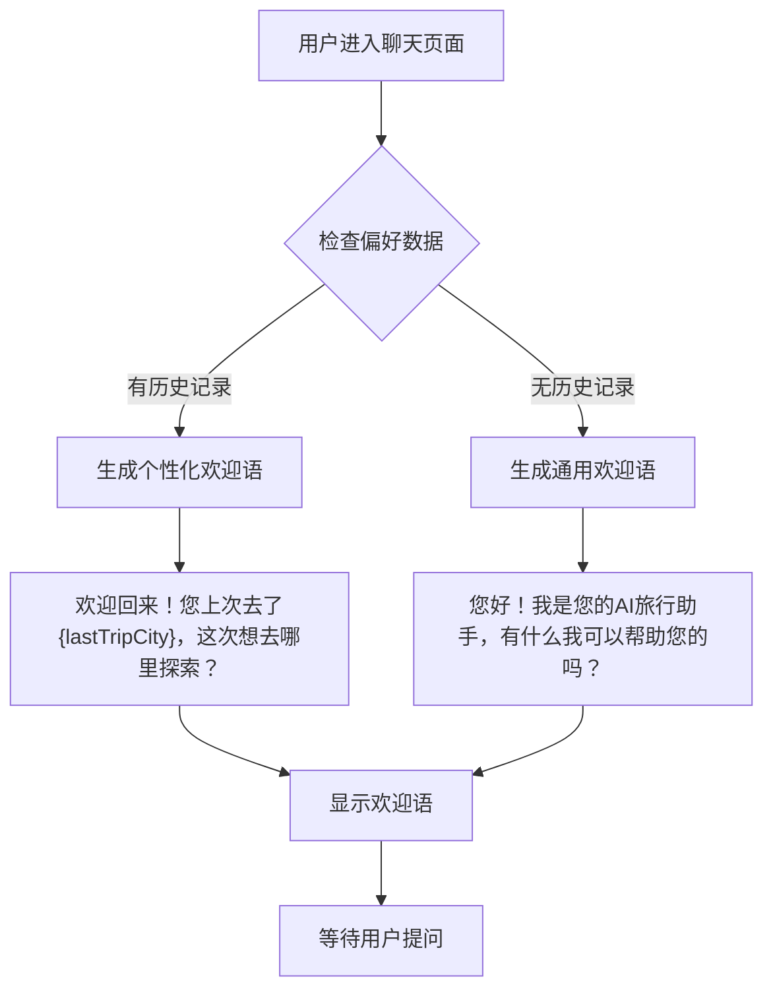
```mermaid
flowchart TD
A[用户进入聊天页面] --> B{检查偏好数据}
B --> |有历史记录| C[生成个性化欢迎语]
B --> |无历史记录| D[生成通用欢迎语]
C --> E["欢迎回来！您上次去了{lastTripCity}，这次想去哪里探索？"]
D --> F["您好！我是您的AI旅行助手，有什么我可以帮助您的吗？"]
E --> G[显示欢迎语]
F --> G
G --> H[等待用户提问]
```

**图表来源**
- [aiChat.vue:586-598](file://uniapp-travel-social/homePages/aiChat/aiChat.vue#L586-L598)

**章节来源**
- [AIController.java:1-610](file://springboot-travel-social/src/main/java/com/cxx/controller/AIController.java#L1-L610)
- [DeepSeekServiceImpl.java:1-213](file://springboot-travel-social/src/main/java/com/cxx/service/impl/DeepSeekServiceImpl.java#L1-L213)

## 依赖分析

系统依赖关系复杂但层次清晰：

```mermaid
graph TB
subgraph "核心依赖"
A[spring-boot-starter-web]
B[mybatis-plus-boot-starter]
C[spring-boot-starter-data-redis]
D[spring-boot-starter-amqp]
E[spring-boot-starter-data-elasticsearch]
F[spring-boot-starter-data-mongodb]
end
subgraph "AI相关依赖"
G[spark4j - 星火大模型SDK]
H[jackson - JSON处理]
I[lombok - 代码简化]
J[aliyun-sdk-java - 阿里云服务]
K[tencentcloud-sdk-java - 腾讯云服务]
L[weaviate-client - 向量数据库]
end
subgraph "数据库依赖"
M[mysql-connector-java]
N[druid-spring-boot-starter]
O[elasticsearch-client]
P[mongodb-driver-sync]
end
subgraph "前端框架"
Q[uni-app]
R[uView-ui]
S[tuniao-ui]
T[axios]
U[websocket]
end
A --> B
A --> C
A --> D
A --> E
B --> G
C --> H
E --> I
A --> J
Q --> R
Q --> S
Q --> T
Q --> U
```

**图表来源**
- [application.properties:1-64](file://springboot-travel-social/src/main/resources/application.properties#L1-L64)

**章节来源**
- [application.properties:1-64](file://springboot-travel-social/src/main/resources/application.properties#L1-L64)

## 性能考虑

### 缓存策略

系统采用了多层次的缓存策略来提升性能：

1. **Redis缓存**：用户会话、推荐结果、热点数据、用户偏好快照
2. **数据库缓存**：MyBatis二级缓存配置
3. **浏览器缓存**：静态资源缓存策略
4. **AI服务缓存**：API响应缓存和会话状态缓存
5. **偏好快照缓存**：用户偏好数据7天有效期缓存

### 算法优化

1. **相似度计算优化**：使用皮尔逊相关系数，避免零向量问题
2. **数据分页**：游记列表采用分页查询，避免大数据量影响
3. **并发控制**：使用信号量控制同时在线用户数量
4. **异步处理**：用户偏好计算采用异步方式，不影响主线程
5. **AI请求优化**：DeepSeekService使用线程池处理异步请求

### 数据库优化

1. **索引优化**：为常用查询字段建立合适索引
2. **查询优化**：使用原生SQL优化复杂查询
3. **连接池配置**：合理配置数据库连接池参数
4. **快照过期管理**：自动清理过期的用户偏好快照
5. **会话表优化**：聊天记录表按会话ID分区存储

## 故障排除指南

### 常见问题及解决方案

1. **AI聊天响应慢**
   - 检查DeepSeek API调用状态
   - 验证Redis缓存是否正常
   - 监控网络连接质量
   - 检查用户偏好服务响应时间
   - 验证会话管理服务状态

2. **会话管理异常**
   - 确认数据库连接正常
   - 检查MyBatis映射配置
   - 验证会话ID格式正确性
   - 监控事务提交状态

3. **多模态AI服务失败**
   - 检查智谱AI API密钥配置
   - 验证星火大模型API连接
   - 确认图片URL可访问性
   - 监控第三方API响应时间

4. **推荐结果不准确**
   - 检查用户行为数据是否充足
   - 验证相似度计算是否正常
   - 确认回退机制是否生效
   - 检查用户偏好快照是否过期

5. **RAG检索异常**
   - 验证游记检索关键词提取
   - 检查Elasticsearch索引状态
   - 确认检索结果排序逻辑
   - 监控检索性能指标

**章节来源**
- [AIController.java:241-259](file://springboot-travel-social/src/main/java/com/cxx/controller/AIController.java#L241-L259)
- [ChatRecordService.java:27-53](file://springboot-travel-social/src/main/java/com/cxx/service/ChatRecordService.java#L27-L53)
- [DeepSeekService.java:41-46](file://springboot-travel-social/src/main/java/com/cxx/service/DeepSeekService.java#L41-L46)
- [RecommendController.java:40-63](file://springboot-travel-social/src/main/java/com/cxx/controller/RecommendController.java#L40-L63)

## 结论

方案①-个性化AI推荐系统通过整合协同过滤算法、用户偏好管理和RAG检索技术，为用户提供了智能化的旅游推荐服务。系统具有以下特点：

1. **个性化程度高**：基于用户行为和偏好的精准推荐
2. **交互体验好**：支持多模态AI聊天和会话管理
3. **扩展性强**：模块化设计便于功能扩展
4. **性能稳定**：多层缓存和优化策略确保系统稳定性
5. **智能程度深**：通过用户偏好系统实现真正的个性化体验
6. **多模型支持**：支持DeepSeek、星火、智谱等多种大模型
7. **会话管理完善**：提供完整的聊天会话生命周期管理

**更新** 新增的完整AI控制器体系显著增强了系统的AI服务能力，包括：
- AIController提供基础聊天、RAG增强、智能行程生成等功能
- BigModelController集成星火大模型，支持中文对话
- ZhipuController提供多模态AI能力，支持文本+图片对话
- 完整的会话管理系统，支持消息记录和会话管理
- 多模态AI服务集成，支持多种大模型API

未来可以进一步优化的方向包括：
- 引入深度学习模型提升推荐精度
- 增加实时推荐能力
- 优化移动端用户体验
- 扩展更多AI应用场景
- 增强用户偏好系统的实时更新机制
- 优化多模态AI服务的响应速度
- 增加AI对话的质量评估机制