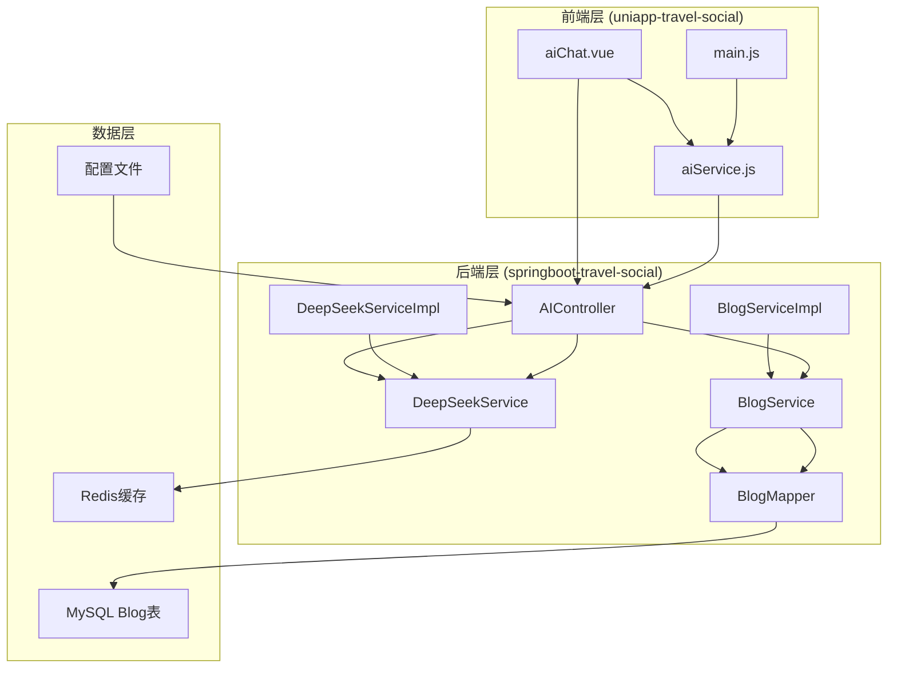
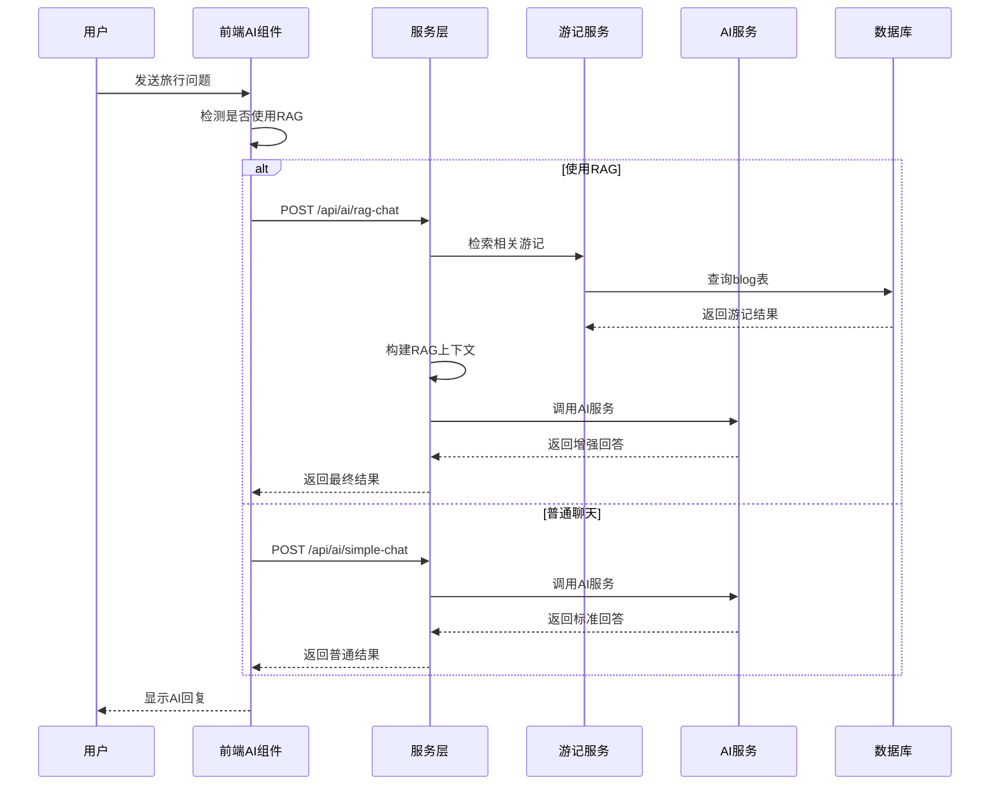
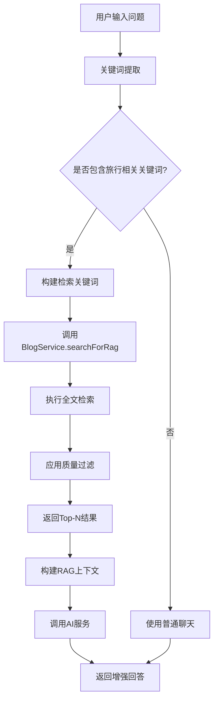
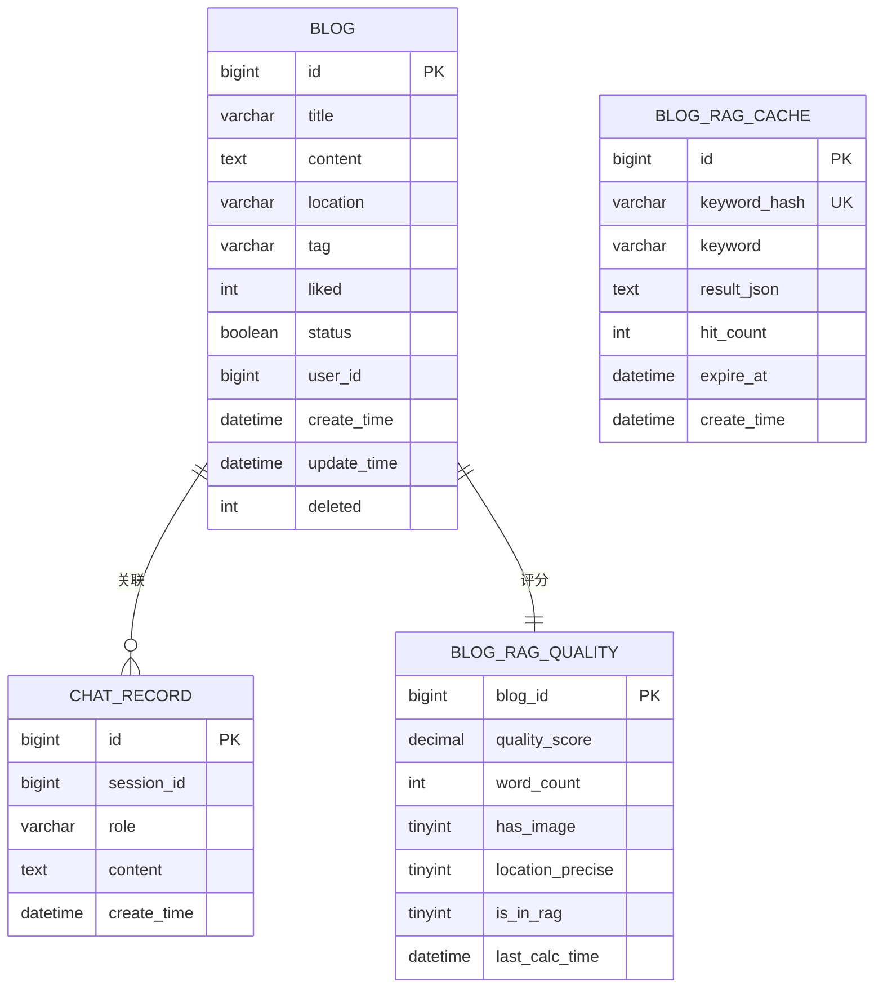
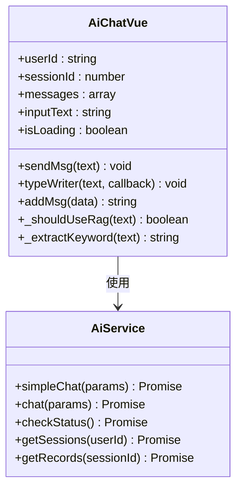
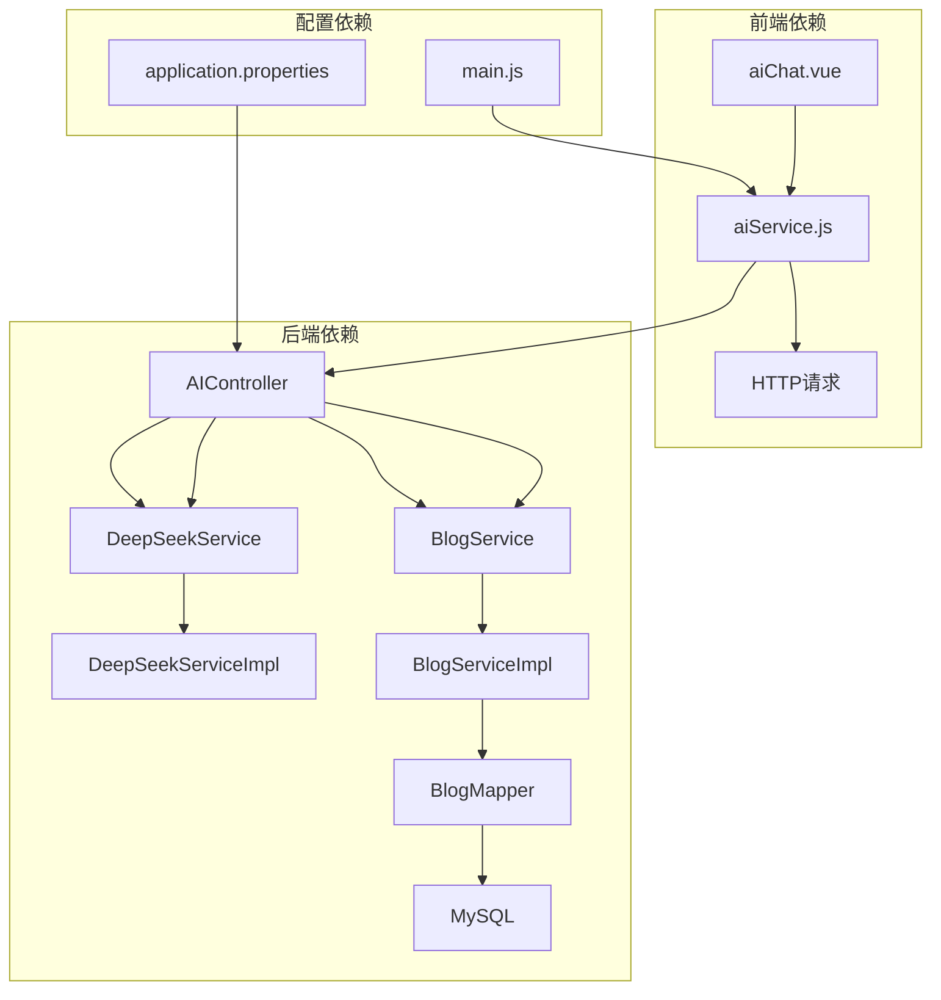

# 方案② 社区攻略RAG

<cite>
**本文档引用的文件**
- [方案②-社区攻略RAG.md](file://方案②-社区攻略RAG.md)
- [AIController.java](file://springboot-travel-social/src/main/java/com/cxx/controller/AIController.java)
- [DeepSeekService.java](file://springboot-travel-social/src/main/java/com/cxx/service/DeepSeekService.java)
- [DeepSeekServiceImpl.java](file://springboot-travel-social/src/main/java/com/cxx/service/impl/DeepSeekServiceImpl.java)
- [BlogService.java](file://springboot-travel-social/src/main/java/com/cxx/service/BlogService.java)
- [BlogServiceImpl.java](file://springboot-travel-social/src/main/java/com/cxx/service/impl/BlogServiceImpl.java)
- [BlogMapper.java](file://springboot-travel-social/src/main/java/com/cxx/mapper/BlogMapper.java)
- [Blog.java](file://springboot-travel-social/src/main/java/com/cxx/entity/Blog.java)
- [aiChat.vue](file://uniapp-travel-social/homePages/aiChat/aiChat.vue)
- [aiService.js](file://uniapp-travel-social/services/aiService.js)
- [application.properties](file://springboot-travel-social/src/main/resources/application.properties)
- [main.js](file://uniapp-travel-social/main.js)
- [TravelSocialApplication.java](file://springboot-travel-social/src/main/java/com/cxx/TravelSocialApplication.java)
</cite>

## 目录
1. [简介](#简介)
2. [项目结构](#项目结构)
3. [核心组件](#核心组件)
4. [架构概览](#架构概览)
5. [详细组件分析](#详细组件分析)
6. [依赖关系分析](#依赖关系分析)
7. [性能考虑](#性能考虑)
8. [故障排除指南](#故障排除指南)
9. [结论](#结论)

## 简介

方案②社区攻略RAG（Retrieval-Augmented Generation）是一种基于社区游记内容的AI增强聊天系统。该方案的核心思想是将平台上用户发布的高质量游记（blog表）作为知识库，通过检索增强生成的方式，让AI能够引用真实的用户经验来回答旅行相关问题。

### 主要特性

- **RAG检索增强**：基于社区游记内容提供真实可靠的旅行建议
- **智能关键词提取**：自动识别用户问题中的地名和主题词
- **多维度质量过滤**：通过点赞数、发布时间等指标筛选高质量内容
- **实时缓存机制**：减少重复查询对数据库的压力
- **内容安全过滤**：确保引用内容的安全性和合规性

## 项目结构

该项目采用前后端分离的架构设计，主要分为以下几个层次：

**图表来源**
- [AIController.java:19-505](file://springboot-travel-social/src/main/java/com/cxx/controller/AIController.java#L19-L505)
- [BlogServiceImpl.java:38-204](file://springboot-travel-social/src/main/java/com/cxx/service/impl/BlogServiceImpl.java#L38-L204)
- [DeepSeekServiceImpl.java:25-324](file://springboot-travel-social/src/main/java/com/cxx/service/impl/DeepSeekServiceImpl.java#L25-L324)

**章节来源**
- [方案②-社区攻略RAG.md:1-50](file://方案②-社区攻略RAG.md#L1-L50)
- [main.js:1-118](file://uniapp-travel-social/main.js#L1-L118)

## 核心组件

### 1. AI聊天控制器 (AIController)

AIController是整个RAG系统的核心入口，负责处理用户的所有AI相关请求。它提供了多种聊天接口，包括简单的问答、带系统提示的聊天以及专门的RAG增强聊天。

**主要功能**：
- 简单聊天接口：基础的问答功能
- 通用聊天接口：支持自定义系统提示词
- RAG增强聊天接口：集成游记检索的智能问答
- 会话管理：创建、查询、删除用户会话
- 行程生成：基于用户需求生成详细旅行计划

**章节来源**
- [AIController.java:23-505](file://springboot-travel-social/src/main/java/com/cxx/controller/AIController.java#L23-L505)

### 2. 深度求索AI服务 (DeepSeekService)

DeepSeekService是AI服务的抽象接口，定义了所有AI交互的标准方法。其实现类DeepSeekServiceImpl负责与外部AI服务进行通信。

**核心方法**：
- `chat(String userMessage)`：基础聊天方法
- `chat(String systemPrompt, String userMessage)`：带系统提示的聊天
- `chat(String userId, Long sessionId, String userMessage)`：带用户上下文的聊天
- `chatAsync(String userMessage)`：异步聊天方法
- `checkApiStatus()`：AI服务状态检查

**章节来源**
- [DeepSeekService.java:7-46](file://springboot-travel-social/src/main/java/com/cxx/service/DeepSeekService.java#L7-L46)
- [DeepSeekServiceImpl.java:25-324](file://springboot-travel-social/src/main/java/com/cxx/service/impl/DeepSeekServiceImpl.java#L25-L324)

### 3. 游记服务 (BlogService)

BlogService负责管理游记相关的所有业务逻辑，包括游记的增删改查、检索等功能。

**主要职责**：
- 游记查询和保存
- 用户点赞和浏览统计
- 游记内容的敏感词过滤
- RAG检索功能的实现

**章节来源**
- [BlogService.java:15-26](file://springboot-travel-social/src/main/java/com/cxx/service/BlogService.java#L15-L26)
- [BlogServiceImpl.java:38-204](file://springboot-travel-social/src/main/java/com/cxx/service/impl/BlogServiceImpl.java#L38-L204)

### 4. 前端AI聊天组件 (aiChat.vue)

前端AI聊天组件提供了完整的用户界面和交互体验，包括消息显示、输入处理、会话管理等功能。

**核心功能**：
- 实时消息显示和打字效果
- 会话历史管理
- 快捷指令和热门问题
- 图片和地图消息支持
- 主题切换和夜间模式

**章节来源**
- [aiChat.vue:1-800](file://uniapp-travel-social/homePages/aiChat/aiChat.vue#L1-L800)

## 架构概览

RAG系统的整体架构采用了经典的三层架构设计，实现了前后端的清晰分离和职责划分。

**图表来源**
- [方案②-社区攻略RAG.md:13-48](file://方案②-社区攻略RAG.md#L13-L48)
- [AIController.java:33-130](file://springboot-travel-social/src/main/java/com/cxx/controller/AIController.java#L33-L130)

## 详细组件分析

### RAG检索流程

RAG系统的检索流程是整个方案的核心，下面详细分析其工作原理：

**图表来源**
- [方案②-社区攻略RAG.md:189-200](file://方案②-社区攻略RAG.md#L189-L200)
- [aiChat.vue:237-263](file://uniapp-travel-social/homePages/aiChat/aiChat.vue#L237-L263)

### 数据库设计

系统采用了合理的数据库设计方案来支持RAG功能：

**图表来源**
- [方案②-社区攻略RAG.md:56-110](file://方案②-社区攻略RAG.md#L56-L110)

**章节来源**
- [方案②-社区攻略RAG.md:52-111](file://方案②-社区攻略RAG.md#L52-L111)

### 前端交互设计

前端AI聊天组件提供了丰富的用户交互体验：

**图表来源**
- [aiChat.vue:411-800](file://uniapp-travel-social/homePages/aiChat/aiChat.vue#L411-L800)
- [aiService.js:42-293](file://uniapp-travel-social/services/aiService.js#L42-L293)

**章节来源**
- [aiChat.vue:237-281](file://uniapp-travel-social/homePages/aiChat/aiChat.vue#L237-L281)
- [aiService.js:52-85](file://uniapp-travel-social/services/aiService.js#L52-L85)

## 依赖关系分析

系统各组件之间的依赖关系清晰明确，遵循了依赖倒置原则：

**图表来源**
- [application.properties:50-64](file://springboot-travel-social/src/main/resources/application.properties#L50-L64)
- [main.js:1-118](file://uniapp-travel-social/main.js#L1-L118)

**章节来源**
- [application.properties:1-64](file://springboot-travel-social/src/main/resources/application.properties#L1-L64)
- [TravelSocialApplication.java:17-51](file://springboot-travel-social/src/main/java/com/cxx/TravelSocialApplication.java#L17-L51)

## 性能考虑

### 1. 缓存策略

系统实现了多层次的缓存机制来提升性能：

- **Redis缓存**：存储热点游记数据和会话信息
- **RAG检索缓存**：缓存热门关键词的检索结果
- **浏览器缓存**：前端静态资源和会话数据缓存

### 2. 数据库优化

- **全文索引**：为blog表建立全文检索索引
- **复合索引**：优化常用查询条件的索引设计
- **分页查询**：避免一次性加载大量数据

### 3. 异步处理

- **异步AI调用**：使用CompletableFuture实现非阻塞AI服务调用
- **批量操作**：支持批量游记查询和处理

## 故障排除指南

### 常见问题及解决方案

**1. AI服务连接失败**
- 检查DeepSeek API配置是否正确
- 验证API密钥的有效性
- 确认网络连接正常

**2. 游记检索无结果**
- 检查blog表是否有符合条件的数据
- 验证全文索引是否正确创建
- 确认minLiked阈值设置是否合理

**3. 前端聊天界面异常**
- 检查main.js中的API地址配置
- 验证用户登录状态
- 确认会话ID的有效性

**章节来源**
- [DeepSeekServiceImpl.java:181-187](file://springboot-travel-social/src/main/java/com/cxx/service/impl/DeepSeekServiceImpl.java#L181-L187)
- [application.properties:50-64](file://springboot-travel-social/src/main/resources/application.properties#L50-L64)

## 结论

方案②社区攻略RAG通过将社区游记内容转化为AI的知识库，显著提升了旅行问答的准确性和实用性。该系统具有以下优势：

1. **内容真实性**：基于真实用户经验，避免了通用AI的过时信息问题
2. **智能化程度高**：自动关键词提取和RAG增强，提供更精准的答案
3. **扩展性强**：模块化设计便于功能扩展和维护
4. **用户体验好**：完整的前后端交互，提供流畅的使用体验

通过合理的数据库设计、缓存策略和异步处理机制，系统能够在保证性能的同时提供高质量的服务。建议在实际部署时根据数据量和用户规模选择合适的缓存和索引策略，以获得最佳的性能表现。