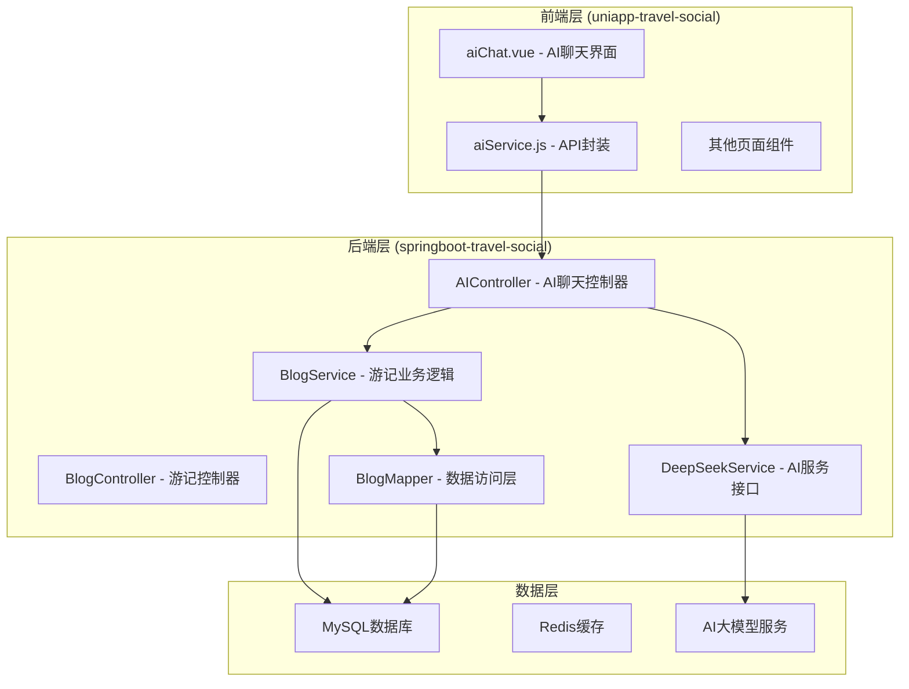
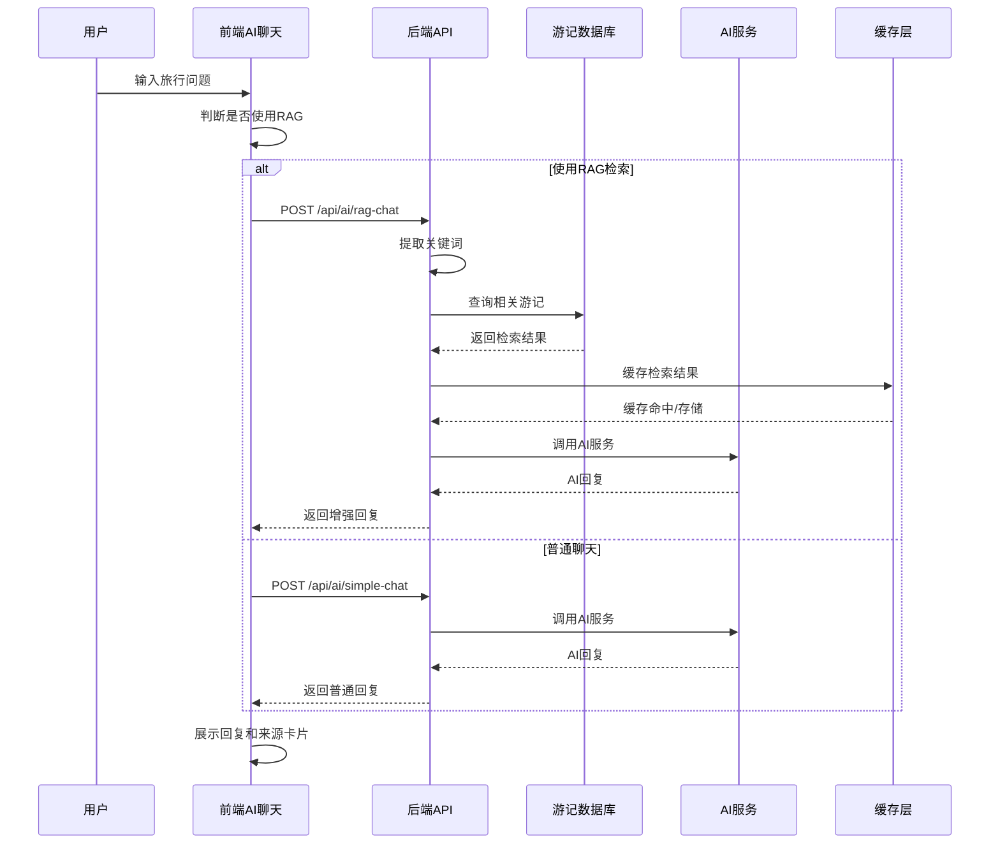
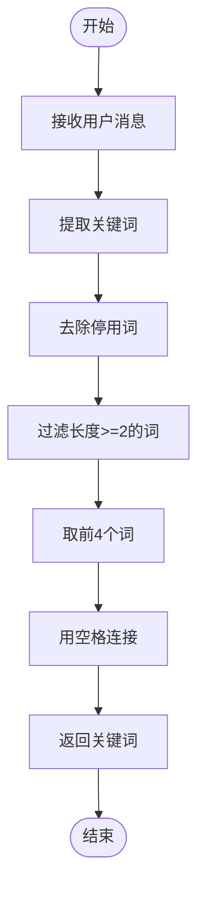
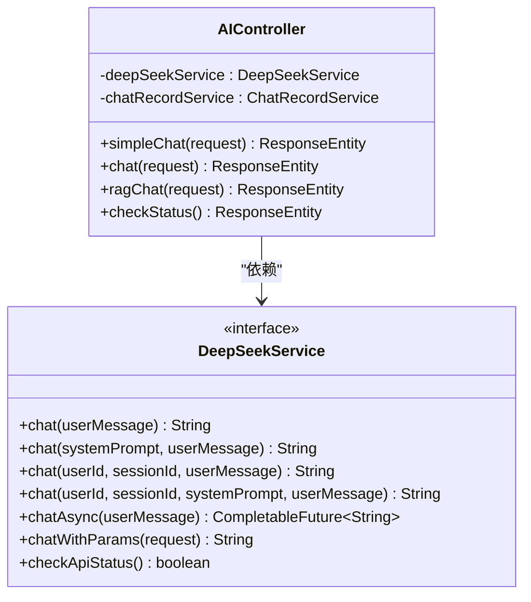
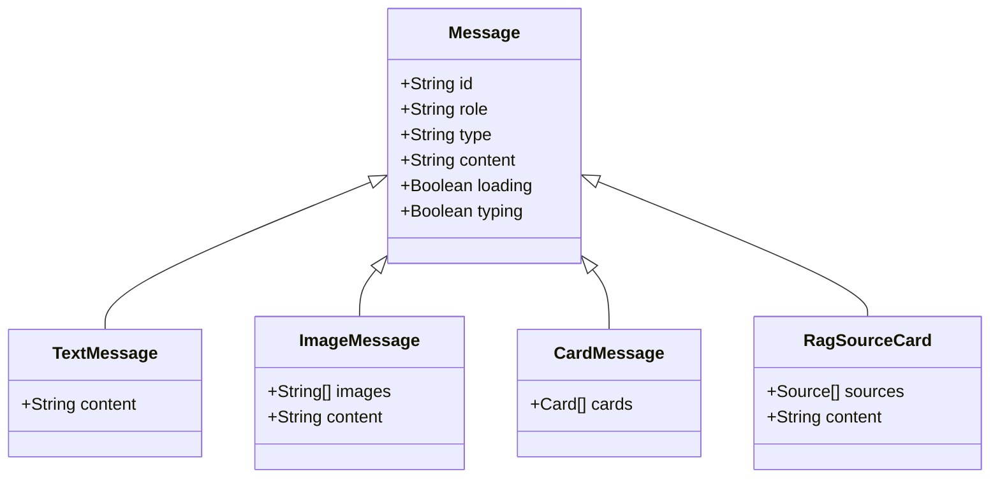
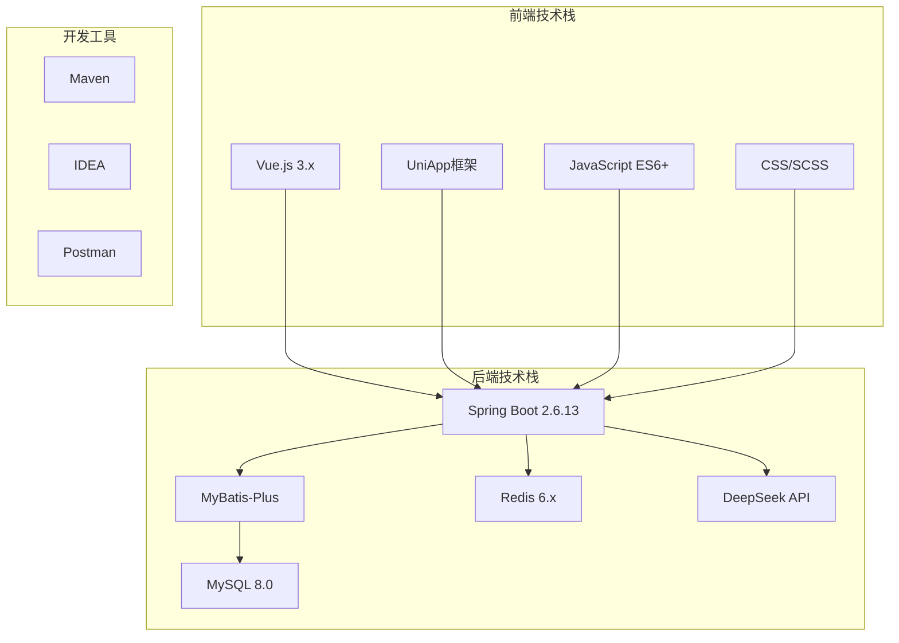

# 方案②-社区攻略RAG

<cite>
**本文档引用的文件**
- [方案②-社区攻略RAG.md](file://方案②-社区攻略RAG.md)
- [BlogController.java](file://springboot-travel-social/src/main/java/com/cxx/controller/BlogController.java)
- [BlogService.java](file://springboot-travel-social/src/main/java/com/cxx/service/BlogService.java)
- [BlogServiceImpl.java](file://springboot-travel-social/src/main/java/com/cxx/service/impl/BlogServiceImpl.java)
- [BlogMapper.java](file://springboot-travel-social/src/main/java/com/cxx/mapper/BlogMapper.java)
- [Blog.java](file://springboot-travel-social/src/main/java/com/cxx/entity/Blog.java)
- [AIController.java](file://springboot-travel-social/src/main/java/com/cxx/controller/AIController.java)
- [DeepSeekService.java](file://springboot-travel-social/src/main/java/com/cxx/service/DeepSeekService.java)
- [application.properties](file://springboot-travel-social/src/main/resources/application.properties)
- [aiChat.vue](file://uniapp-travel-social/homePages/aiChat/aiChat.vue)
- [aiService.js](file://uniapp-travel-social/services/aiService.js)
</cite>

## 更新摘要
**变更内容**
- 新增完整的RAG检索增强生成技术实现方案
- 补充了数据库表结构和索引配置
- 完善了前后端接口对接细节
- 增加了缓存机制和质量评分表设计
- 优化了关键词提取和检索策略

## 目录
1. [简介](#简介)
2. [项目结构](#项目结构)
3. [核心组件](#核心组件)
4. [架构概览](#架构概览)
5. [详细组件分析](#详细组件分析)
6. [依赖分析](#依赖分析)
7. [性能考虑](#性能考虑)
8. [故障排除指南](#故障排除指南)
9. [结论](#结论)

## 简介

方案②-社区攻略RAG（检索增强生成）是一种基于社区游记内容的AI问答增强技术方案。该方案的核心思想是将平台上用户发布的高质量游记作为知识库，通过检索增强的方式为AI问答提供真实的用户经验参考。

### 功能概述

**做什么**
- 将平台上的游记内容作为知识库
- 当用户询问旅行相关问题时，先检索最相关的游记片段
- 将检索到的真实用户经验作为参考资料增强AI回复
- 提供可信度和实用性的旅行建议

**为什么做**
- 通用大模型的旅游信息可能过时、缺乏本地细节
- 平台用户写的游记包含"停车要注意"、"某景点排队2小时"、"某家餐厅必点"等宝贵的第一手经验
- RAG机制让AI能引用这些真实内容，回复可信度和实用性大幅提升

## 项目结构

该项目采用前后端分离的架构设计，主要分为三个层次：

**图表来源**
- [方案②-社区攻略RAG.md:13-48](file://方案②-社区攻略RAG.md#L13-L48)
- [AIController.java:1-505](file://springboot-travel-social/src/main/java/com/cxx/controller/AIController.java#L1-L505)
- [BlogController.java:1-219](file://springboot-travel-social/src/main/java/com/cxx/controller/BlogController.java#L1-L219)

**章节来源**
- [方案②-社区攻略RAG.md:1-321](file://方案②-社区攻略RAG.md#L1-L321)

## 核心组件

### 数据库层

**Blog实体表**
- 包含游记的核心字段：标题、内容、地点、标签、点赞数、状态等
- 支持游记的发布、点赞、浏览等功能
- 为RAG检索提供基础数据支撑

**新增表结构**
- `blog_rag_cache` - RAG检索结果缓存表
- `blog_rag_quality` - 游记质量评分表

**章节来源**
- [Blog.java:1-135](file://springboot-travel-social/src/main/java/com/cxx/entity/Blog.java#L1-L135)
- [方案②-社区攻略RAG.md:52-110](file://方案②-社区攻略RAG.md#L52-L110)

### 后端接口层

**AIController**
- 提供AI聊天接口，包括简单聊天和通用聊天
- 支持会话管理和历史记录
- 集成DeepSeek大模型服务

**BlogController**
- 提供游记相关的CRUD操作
- 支持游记的发布、查询、点赞等功能
- 为RAG检索提供数据支持

**章节来源**
- [AIController.java:1-505](file://springboot-travel-social/src/main/java/com/cxx/controller/AIController.java#L1-L505)
- [BlogController.java:1-219](file://springboot-travel-social/src/main/java/com/cxx/controller/BlogController.java#L1-L219)

### 前端页面层

**aiChat.vue**
- 实现AI聊天界面的完整功能
- 支持多种消息类型：文本、图片、卡片等
- 集成会话管理和历史记录功能

**aiService.js**
- 封装所有AI相关的API调用
- 提供统一的错误处理和状态管理
- 支持会话创建、消息发送、历史查询等功能

**章节来源**
- [aiChat.vue:1-800](file://uniapp-travel-social/homePages/aiChat/aiChat.vue#L1-L800)
- [aiService.js:1-293](file://uniapp-travel-social/services/aiService.js#L1-L293)

## 架构概览

RAG系统的整体架构采用分层设计，实现了从用户交互到AI响应的完整流程：

**图表来源**
- [方案②-社区攻略RAG.md:13-48](file://方案②-社区攻略RAG.md#L13-L48)
- [AIController.java:1-505](file://springboot-travel-social/src/main/java/com/cxx/controller/AIController.java#L1-L505)
- [aiChat.vue:1-800](file://uniapp-travel-social/homePages/aiChat/aiChat.vue#L1-L800)

## 详细组件分析

### RAG检索流程

#### 关键词提取算法

**图表来源**
- [方案②-社区攻略RAG.md:244-253](file://方案②-社区攻略RAG.md#L244-L253)

#### 检索策略

系统采用多阶段检索策略，根据数据量选择不同的实现方式：

**第一阶段（数据量 < 1000篇）**
- 使用LIKE模糊查询
- 性能较低但实现简单

**第二阶段（数据量 1000-10000篇）**
- MySQL全文索引 + Redis缓存
- 支持中文分词和热词缓存

**第三阶段（数据量 > 10000篇）**
- 向量数据库 + 语义检索
- 支持更精确的语义匹配

**章节来源**
- [方案②-社区攻略RAG.md:286-321](file://方案②-社区攻略RAG.md#L286-L321)

### AI服务集成

#### DeepSeekService接口

**图表来源**
- [DeepSeekService.java:1-46](file://springboot-travel-social/src/main/java/com/cxx/service/DeepSeekService.java#L1-L46)
- [AIController.java:1-505](file://springboot-travel-social/src/main/java/com/cxx/controller/AIController.java#L1-L505)

#### 配置管理

系统通过application.properties进行AI服务配置：

**AI服务配置**
- DeepSeek API密钥和基础URL
- 大模型服务参数
- 会话超时时间

**章节来源**
- [application.properties:50-64](file://springboot-travel-social/src/main/resources/application.properties#L50-L64)

### 前端交互优化

#### 消息类型系统

**图表来源**
- [aiChat.vue:131-292](file://uniapp-travel-social/homePages/aiChat/aiChat.vue#L131-L292)

#### 会话管理

前端实现了完整的会话管理系统：

**会话功能**
- 自动创建新会话
- 会话历史记录
- 会话重命名和删除
- 会话切换和加载

**章节来源**
- [aiChat.vue:578-701](file://uniapp-travel-social/homePages/aiChat/aiChat.vue#L578-L701)
- [aiService.js:165-175](file://uniapp-travel-social/services/aiService.js#L165-L175)

## 依赖分析

### 技术栈依赖

### 外部服务依赖

**AI服务依赖**
- DeepSeek大模型API
- 支持多模态对话
- 流式响应处理

**数据库依赖**
- MySQL全文检索
- Redis缓存优化
- 事务一致性保证

**章节来源**
- [application.properties:50-64](file://springboot-travel-social/src/main/resources/application.properties#L50-L64)

## 性能考虑

### 缓存策略

**多级缓存架构**
- Redis缓存热门关键词
- 浏览器本地缓存
- CDN静态资源缓存

**缓存失效策略**
- TTL控制（默认24小时）
- 命中次数统计
- 手动刷新机制

### 检索优化

**索引优化**
- MySQL全文索引配置
- 复合索引设计
- 查询计划优化

**分页策略**
- 限制返回数量（默认5条）
- 最大限制10条
- 性能优先的排序算法

### 并发处理

**异步处理**
- 异步AI调用
- 流式响应处理
- 并发请求限制

**资源管理**
- 连接池配置
- 内存使用监控
- 超时控制机制

## 故障排除指南

### 常见问题诊断

**AI服务不可用**
- 检查API密钥配置
- 验证网络连接
- 查看服务状态接口

**数据库连接失败**
- 检查MySQL服务状态
- 验证连接参数
- 查看慢查询日志

**缓存异常**
- Redis服务健康检查
- 缓存键值验证
- 内存使用情况

### 错误处理机制

**统一异常处理**
- 前后端异常捕获
- 错误码标准化
- 用户友好的错误提示

**日志监控**
- 请求响应日志
- 性能指标监控
- 错误堆栈追踪

**章节来源**
- [AIController.java:34-130](file://springboot-travel-social/src/main/java/com/cxx/controller/AIController.java#L34-L130)
- [aiService.js:5-40](file://uniapp-travel-social/services/aiService.js#L5-L40)

## 结论

方案②-社区攻略RAG通过将社区游记内容转化为AI的知识库，显著提升了旅行问答的实用性和可信度。该方案具有以下优势：

**技术优势**
- 基于真实用户经验的增强回复
- 渐进式的技术演进策略
- 完善的性能优化机制

**用户体验**
- 更贴近实际的旅行建议
- 丰富的消息类型支持
- 流畅的交互体验

**可扩展性**
- 模块化的架构设计
- 渐进式的功能升级
- 良好的维护性

该方案为旅游社交小程序提供了智能化的旅行助手功能，通过社区驱动的知识增强，为用户创造更有价值的旅行体验。