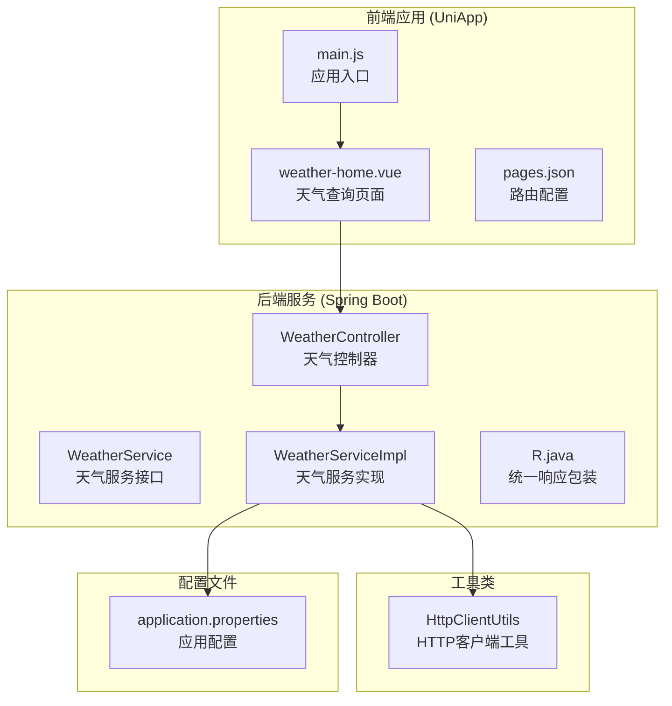
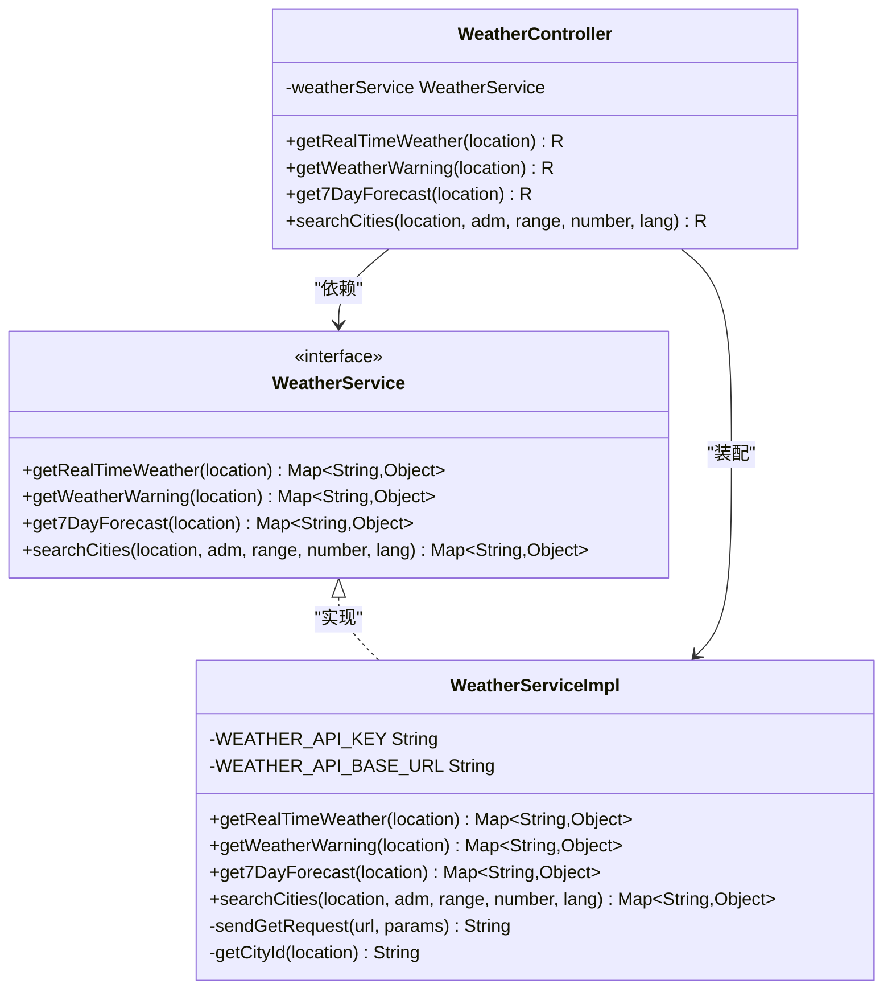
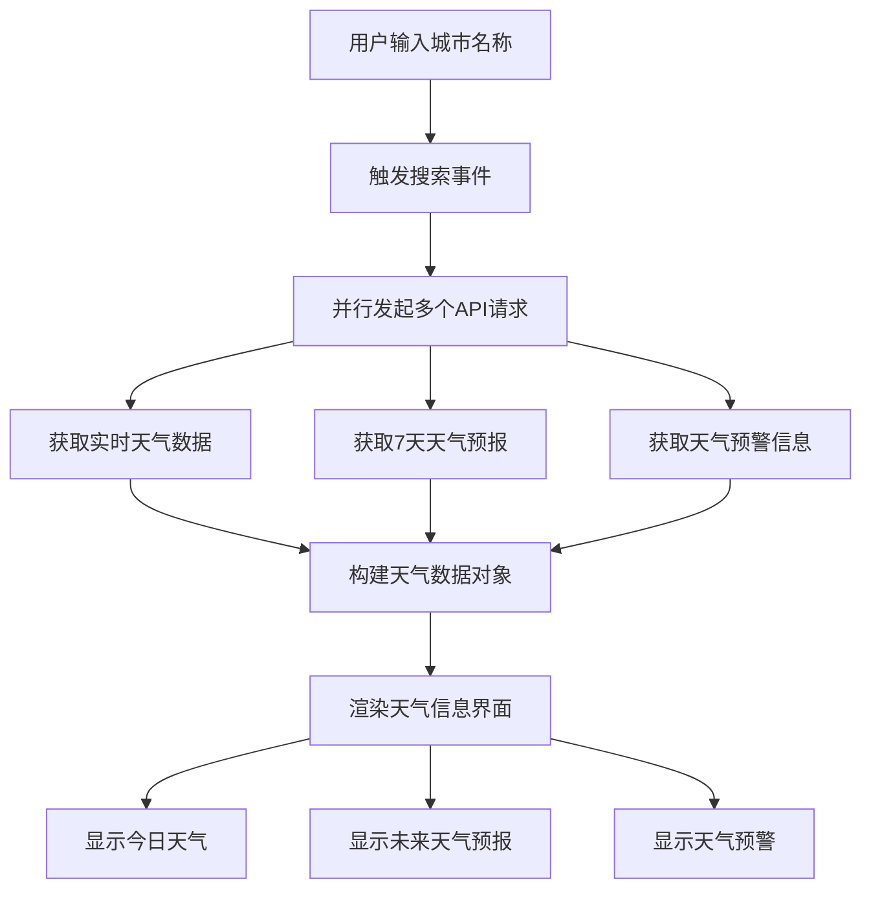
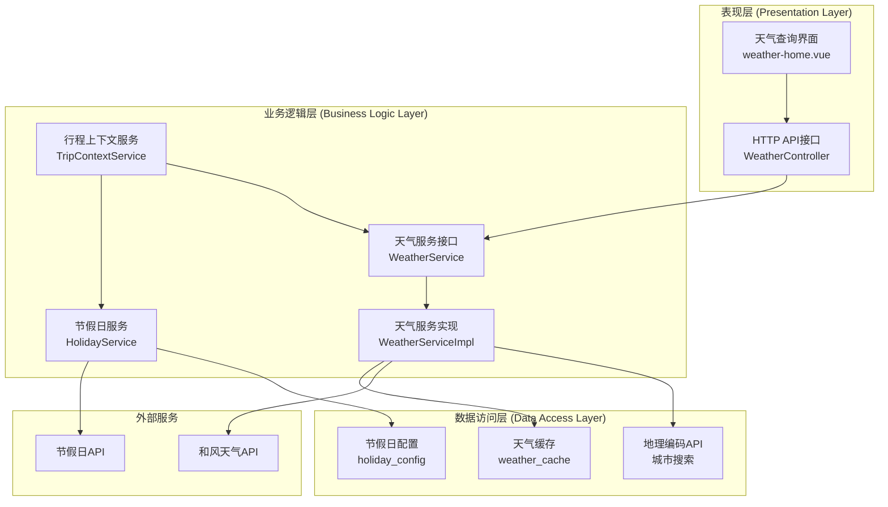
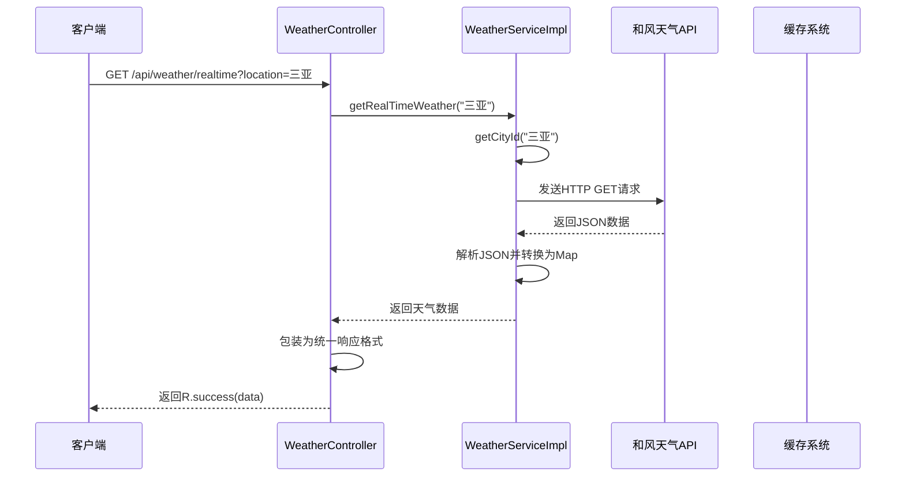
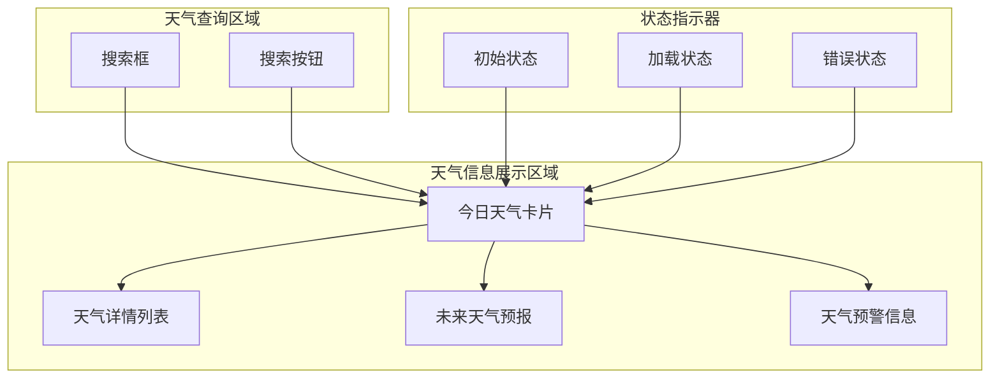
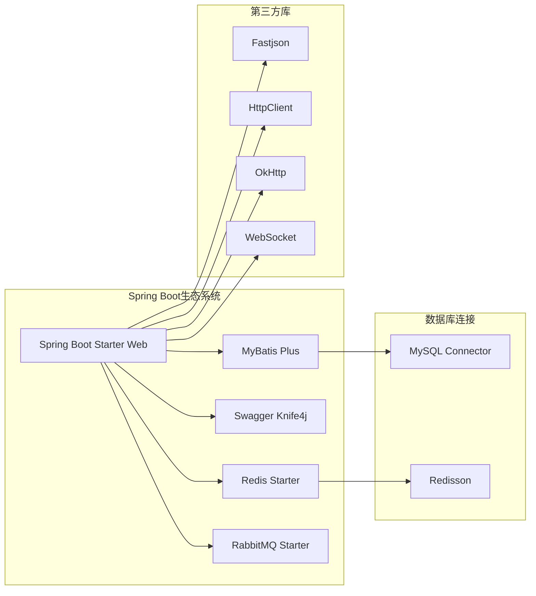

# 方案③ 天气节假日感知

<cite>
**本文档引用的文件**
- [WeatherController.java](file://springboot-travel-social/src/main/java/com/cxx/controller/WeatherController.java)
- [WeatherService.java](file://springboot-travel-social/src/main/java/com/cxx/service/WeatherService.java)
- [WeatherServiceImpl.java](file://springboot-travel-social/src/main/java/com/cxx/service/impl/WeatherServiceImpl.java)
- [HttpClientUtils.java](file://springboot-travel-social/src/main/java/com/cxx/utils/HttpClientUtils.java)
- [R.java](file://springboot-travel-social/src/main/java/com/cxx/entity/R.java)
- [application.properties](file://springboot-travel-social/src/main/resources/application.properties)
- [weather-home.vue](file://uniapp-travel-social/weatherPages/weather-home.vue)
- [main.js](file://uniapp-travel-social/main.js)
- [pages.json](file://uniapp-travel-social/pages.json)
- [方案③-天气节假日感知.md](file://方案③-天气节假日感知.md)
</cite>

## 目录
1. [简介](#简介)
2. [项目结构](#项目结构)
3. [核心组件](#核心组件)
4. [架构概览](#架构概览)
5. [详细组件分析](#详细组件分析)
6. [依赖分析](#依赖分析)
7. [性能考虑](#性能考虑)
8. [故障排除指南](#故障排除指南)
9. [结论](#结论)

## 简介

方案③"天气节假日感知"是一个基于Spring Boot + UniApp的旅游攻略社交小程序中的核心功能模块。该方案通过集成和风天气API，为用户提供实时天气查询、7天天气预报、天气预警以及城市搜索功能。

本方案的核心价值在于：
- **实时天气感知**：提供准确的实时天气数据和未来天气预报
- **节假日智能识别**：结合节假日配置表，提供出行高峰期分析
- **AI智能推荐**：将天气和节假日信息注入AI聊天上下文，提供更精准的旅行建议
- **用户体验优化**：通过并行数据获取和优雅的UI展示提升用户满意度

## 项目结构

该项目采用前后端分离的架构设计，主要分为两个部分：



**图表来源**
- [weather-home.vue:1-580](file://uniapp-travel-social/weatherPages/weather-home.vue#L1-L580)
- [WeatherController.java:1-87](file://springboot-travel-social/src/main/java/com/cxx/controller/WeatherController.java#L1-L87)
- [WeatherServiceImpl.java:1-295](file://springboot-travel-social/src/main/java/com/cxx/service/impl/WeatherServiceImpl.java#L1-L295)

**章节来源**
- [weather-home.vue:1-580](file://uniapp-travel-social/weatherPages/weather-home.vue#L1-L580)
- [WeatherController.java:1-87](file://springboot-travel-social/src/main/java/com/cxx/controller/WeatherController.java#L1-L87)
- [application.properties:1-64](file://springboot-travel-social/src/main/resources/application.properties#L1-L64)

## 核心组件

### 天气服务接口层

天气服务采用接口+实现的设计模式，提供了清晰的职责分离：



**图表来源**
- [WeatherService.java:1-42](file://springboot-travel-social/src/main/java/com/cxx/service/WeatherService.java#L1-L42)
- [WeatherController.java:1-87](file://springboot-travel-social/src/main/java/com/cxx/controller/WeatherController.java#L1-L87)
- [WeatherServiceImpl.java:1-295](file://springboot-travel-social/src/main/java/com/cxx/service/impl/WeatherServiceImpl.java#L1-L295)

### 前端交互组件

前端采用Vue.js框架，实现了响应式的天气查询界面：



**图表来源**
- [weather-home.vue:114-175](file://uniapp-travel-social/weatherPages/weather-home.vue#L114-L175)

**章节来源**
- [WeatherService.java:1-42](file://springboot-travel-social/src/main/java/com/cxx/service/WeatherService.java#L1-L42)
- [WeatherController.java:1-87](file://springboot-travel-social/src/main/java/com/cxx/controller/WeatherController.java#L1-L87)
- [WeatherServiceImpl.java:1-295](file://springboot-travel-social/src/main/java/com/cxx/service/impl/WeatherServiceImpl.java#L1-L295)
- [weather-home.vue:1-580](file://uniapp-travel-social/weatherPages/weather-home.vue#L1-L580)

## 架构概览

整个天气节假日感知系统采用分层架构设计，确保了良好的可维护性和扩展性：



**图表来源**
- [WeatherController.java:1-87](file://springboot-travel-social/src/main/java/com/cxx/controller/WeatherController.java#L1-L87)
- [WeatherServiceImpl.java:1-295](file://springboot-travel-social/src/main/java/com/cxx/service/impl/WeatherServiceImpl.java#L1-L295)
- [方案③-天气节假日感知.md:14-42](file://方案③-天气节假日感知.md#L14-L42)

## 详细组件分析

### 天气控制器 (WeatherController)

天气控制器作为RESTful API的入口点，提供了标准化的天气查询接口：

| 接口 | 方法 | 路径 | 功能描述 |
|------|------|------|----------|
| 实时天气 | GET | `/api/weather/realtime` | 获取指定城市的实时天气数据 |
| 天气预警 | GET | `/api/weather/warning` | 获取指定城市的天气预警信息 |
| 7天预报 | GET | `/api/weather/forecast` | 获取未来7天的天气预报 |
| 城市搜索 | GET | `/api/weather/search` | 搜索城市信息 |

每个接口都采用了统一的响应格式，确保前后端交互的一致性。

**章节来源**
- [WeatherController.java:1-87](file://springboot-travel-social/src/main/java/com/cxx/controller/WeatherController.java#L1-L87)

### 天气服务实现 (WeatherServiceImpl)

天气服务实现类是系统的核心逻辑组件，负责与第三方天气API进行交互：

#### 核心特性

1. **API密钥管理**：内置和风天气API密钥，确保服务可用性
2. **多API集成**：支持实时天气、天气预警、7天预报等多种API
3. **错误处理机制**：完善的异常捕获和错误响应
4. **HTTP客户端优化**：使用Apache HttpClient进行高效网络请求

#### 数据处理流程



**图表来源**
- [WeatherController.java:32-38](file://springboot-travel-social/src/main/java/com/cxx/controller/WeatherController.java#L32-L38)
- [WeatherServiceImpl.java:37-64](file://springboot-travel-social/src/main/java/com/cxx/service/impl/WeatherServiceImpl.java#L37-L64)

**章节来源**
- [WeatherServiceImpl.java:1-295](file://springboot-travel-social/src/main/java/com/cxx/service/impl/WeatherServiceImpl.java#L1-L295)

### 前端天气页面 (weather-home.vue)

前端天气页面采用现代化的Vue.js开发，提供了优秀的用户体验：

#### 主要功能特性

1. **响应式设计**：适配不同屏幕尺寸的设备
2. **并行数据获取**：同时获取多个天气数据源，提升用户体验
3. **优雅的加载状态**：提供丰富的视觉反馈
4. **错误处理**：友好的错误提示和恢复机制

#### UI组件结构



**图表来源**
- [weather-home.vue:1-85](file://uniapp-travel-social/weatherPages/weather-home.vue#L1-L85)

**章节来源**
- [weather-home.vue:1-580](file://uniapp-travel-social/weatherPages/weather-home.vue#L1-L580)

### HTTP客户端工具 (HttpClientUtils)

HTTP客户端工具类提供了统一的网络请求接口，支持多种HTTP方法和参数格式：

| 方法 | 功能 | 参数 |
|------|------|------|
| doGet(url) | 发送GET请求 | URL地址 |
| doGet(url, params) | 带参数GET请求 | URL和参数映射 |
| doGet(url, headers, params) | 带头部和参数GET请求 | URL、请求头、参数 |
| doPost(url) | 发送POST请求 | URL地址 |
| doPostJson(url, json) | 发送JSON格式POST请求 | URL和JSON数据 |

**章节来源**
- [HttpClientUtils.java:1-330](file://springboot-travel-social/src/main/java/com/cxx/utils/HttpClientUtils.java#L1-L330)

## 依赖分析

### 后端技术栈依赖



**图表来源**
- [pom.xml:16-182](file://springboot-travel-social/pom.xml#L16-L182)

### 前端技术栈依赖

```mermaid
graph TB
subgraph "核心框架"
UA[UniApp 2.0]
V[Vue.js]
UV[uView UI]
end
subgraph "网络请求"
RM[@escook/request-miniprogram]
GE[GoEasy SDK]
end
subgraph "工具库"
CC[color-convert]
end
UA --> V
UA --> UV
UA --> RM
UA --> GE
V --> CC
```

**图表来源**
- [package.json:15-21](file://uniapp-travel-social/package.json#L15-L21)

**章节来源**
- [application.properties:1-64](file://springboot-travel-social/src/main/resources/application.properties#L1-L64)
- [pom.xml:1-243](file://springboot-travel-social/pom.xml#L1-L243)
- [package.json:1-27](file://uniapp-travel-social/package.json#L1-L27)

## 性能考虑

### 网络请求优化

1. **连接池配置**：使用Apache HttpClient的连接池机制，提高请求效率
2. **超时设置**：合理的连接超时和读取超时配置，避免长时间阻塞
3. **GZIP压缩**：支持响应数据的GZIP压缩，减少网络传输量

### 缓存策略

1. **天气数据缓存**：对于频繁查询的城市天气数据，建议实现本地缓存
2. **API调用频率控制**：避免过度频繁地调用第三方天气API
3. **CDN加速**：对于静态资源和图片，考虑使用CDN加速

### 前端性能优化

1. **懒加载**：对非关键资源实现懒加载
2. **图片优化**：使用适当的图片格式和尺寸
3. **内存管理**：及时清理不再使用的数据和事件监听器

## 故障排除指南

### 常见问题及解决方案

#### 天气API访问失败

**问题症状**：前端显示"天气服务暂时不可用"

**可能原因**：
1. API密钥配置错误
2. 网络连接问题
3. 第三方API服务不可用

**解决步骤**：
1. 检查`application.properties`中的API配置
2. 验证网络连接状态
3. 查看服务器日志获取详细错误信息

#### 城市搜索失败

**问题症状**：无法通过城市名称获取天气数据

**可能原因**：
1. 城市名称拼写错误
2. 城市ID获取失败
3. 第三方地理编码API异常

**解决步骤**：
1. 确认城市名称的正确性
2. 检查`getCityId`方法的执行情况
3. 验证地理编码API的可用性

#### 前端数据加载异常

**问题症状**：页面长时间显示加载状态

**可能原因**：
1. 并行请求中的某个API响应超时
2. 网络请求被拦截或跨域问题
3. 前端Promise处理异常

**解决步骤**：
1. 检查浏览器开发者工具的网络面板
2. 验证API接口的可用性
3. 查看前端控制台的错误信息

**章节来源**
- [WeatherServiceImpl.java:57-63](file://springboot-travel-social/src/main/java/com/cxx/service/impl/WeatherServiceImpl.java#L57-L63)
- [weather-home.vue:156-175](file://uniapp-travel-social/weatherPages/weather-home.vue#L156-L175)

## 结论

方案③"天气节假日感知"通过精心设计的架构和实现，成功地将天气数据与旅行规划相结合，为用户提供了智能化的旅行助手功能。

### 主要优势

1. **技术架构合理**：采用分层架构设计，职责清晰，易于维护和扩展
2. **用户体验优秀**：前端界面响应迅速，交互流畅，视觉效果良好
3. **数据准确性高**：集成权威的天气API，确保数据的实时性和准确性
4. **可扩展性强**：预留了节假日感知、AI智能推荐等扩展接口

### 技术亮点

1. **并行数据获取**：前端采用Promise.all实现多API并行调用，显著提升响应速度
2. **统一响应格式**：后端使用R类统一包装响应数据，简化了前后端交互
3. **错误处理完善**：前后端都有完善的错误处理机制，提升了系统的稳定性
4. **配置灵活**：通过application.properties集中管理各种配置参数

### 发展建议

1. **增加缓存机制**：为频繁查询的天气数据增加本地缓存，减少API调用次数
2. **扩展节假日功能**：基于方案③文档，实现完整的节假日感知功能
3. **AI智能集成**：将天气和节假日信息深度集成到AI聊天系统中
4. **性能监控**：增加系统性能监控和日志记录，便于问题排查和性能优化

该方案为旅游攻略社交小程序提供了坚实的技术基础，通过持续的优化和完善，可以为用户带来更加智能和便捷的旅行体验。