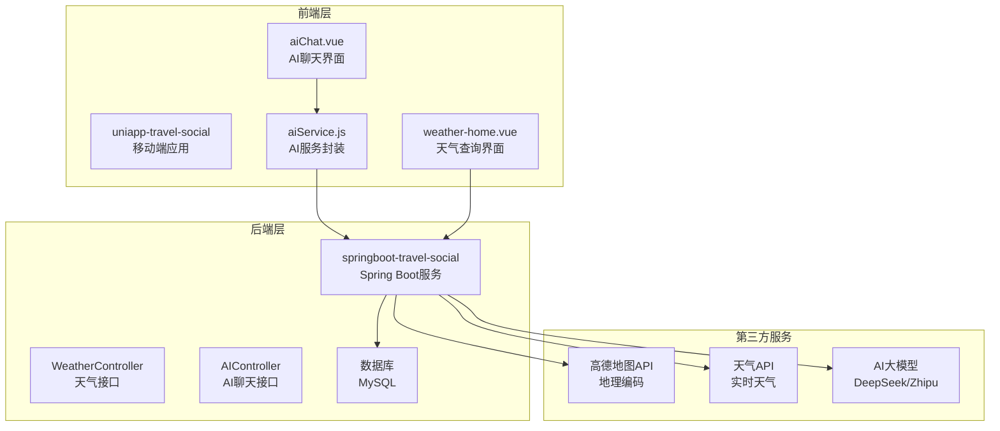
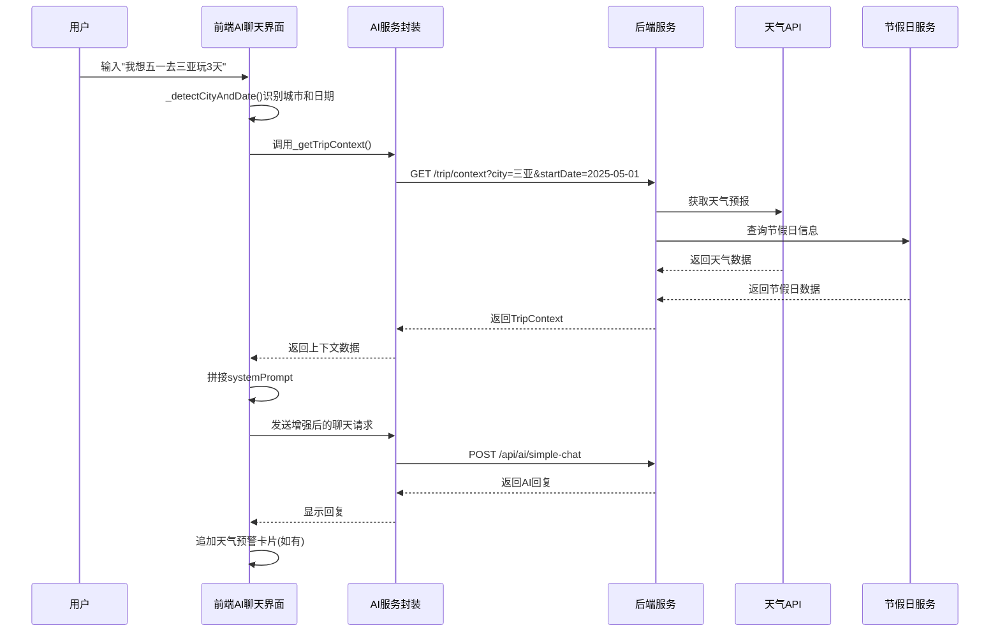
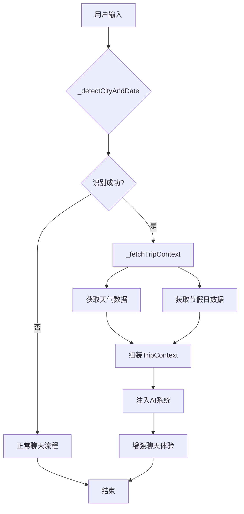
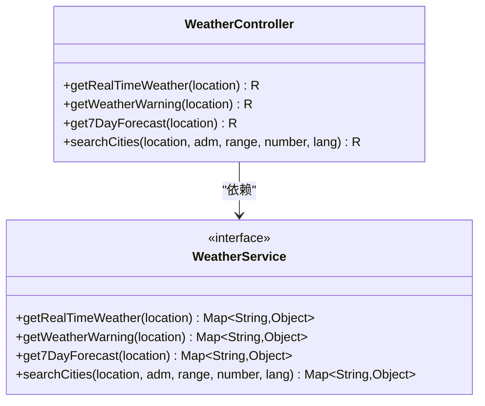
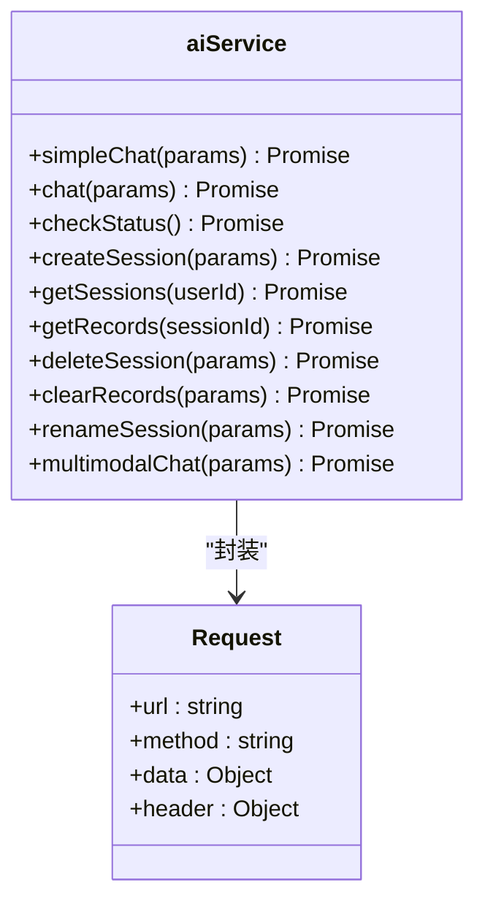
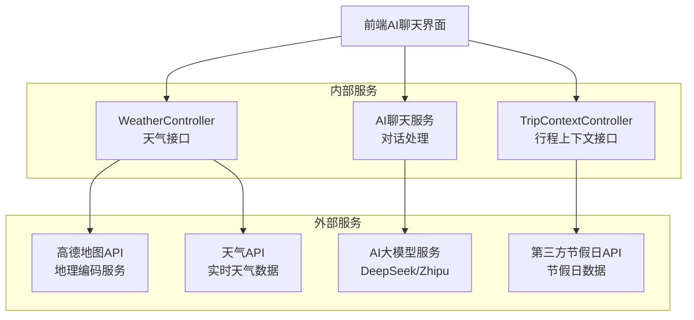
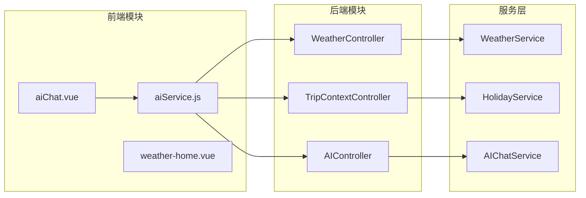
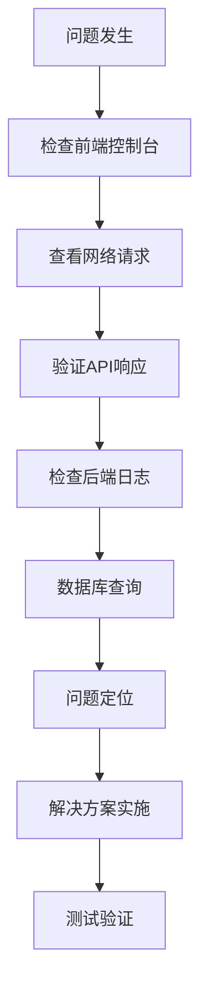

# 方案③-天气节假日感知

<cite>
**本文档引用的文件**
- [方案③-天气节假日感知.md](file://方案③-天气节假日感知.md)
- [WeatherController.java](file://springboot-travel-social/src/main/java/com/xxx/controller/WeatherController.java)
- [WeatherService.java](file://springboot-travel-social/src/main/java/com/xxx/service/WeatherService.java)
- [aiChat.vue](file://uniapp-travel-social/homePages/aiChat/aiChat.vue)
- [aiService.js](file://uniapp-travel-social/services/aiService.js)
- [weather-home.vue](file://uniapp-travel-social/weatherPages/weather-home.vue)
- [application.properties](file://springboot-travel-social/src/main/resources/application.properties)
</cite>

## 目录
1. [简介](#简介)
2. [项目结构](#项目结构)
3. [核心组件](#核心组件)
4. [架构概览](#架构概览)
5. [详细组件分析](#详细组件分析)
6. [依赖关系分析](#依赖关系分析)
7. [性能考虑](#性能考虑)
8. [故障排除指南](#故障排除指南)
9. [结论](#结论)

## 简介

方案③"天气节假日感知"旨在为旅游攻略社交小程序提供智能化的出行规划能力。该方案通过集成实时天气数据和节假日信息，为用户提供更加精准和个性化的旅行建议。

### 核心功能

- **智能城市识别**：自动从用户输入中提取城市名称
- **日期解析**：将口语化日期转换为标准格式
- **实时天气获取**：集成第三方天气API获取准确的天气信息
- **节假日感知**：识别出行日期是否为节假日，并提供相应的出行建议
- **AI上下文增强**：将天气和节假日信息注入AI对话系统

### 技术优势

- **无缝集成**：基于现有WeatherController和AI聊天系统
- **实时性强**：通过trip/context接口聚合多种数据源
- **用户体验优化**：自动追加天气预警卡片，提升安全性
- **扩展性好**：模块化设计便于后续功能扩展

## 项目结构

该项目采用前后端分离的架构设计，主要分为三个层次：



**图表来源**
- [方案③-天气节假日感知.md](file://方案③-天气节假日感知.md)
- [aiChat.vue](file://uniapp-travel-social/homePages/aiChat/aiChat.vue)
- [weather-home.vue](file://uniapp-travel-social/weatherPages/weather-home.vue)

**章节来源**
- [方案③-天气节假日感知.md](file://方案③-天气节假日感知.md)
- [application.properties](file://springboot-travel-social/src/main/resources/application.properties)

## 核心组件

### 天气数据服务

系统现有的WeatherController提供了完整的天气数据接口，包括实时天气、天气预报和天气预警功能。这些接口为节假日感知功能提供了基础数据支撑。

### AI聊天增强系统

在现有的AI聊天系统基础上，新增了智能上下文感知能力。当用户输入包含明确的出行计划时，系统能够自动提取相关信息并获取相应的天气和节假日数据。

### 前端交互优化

AI聊天界面经过优化，能够：
- 自动识别用户输入中的城市和日期
- 静默获取上下文数据
- 将数据注入AI系统的systemPrompt
- 在适当时候追加天气预警卡片

**章节来源**
- [WeatherController.java](file://springboot-travel-social/src/main/java/com/xxx/controller/WeatherController.java)
- [WeatherService.java](file://springboot-travel-social/src/main/java/com/xxx/service/WeatherService.java)
- [aiChat.vue](file://uniapp-travel-social/homePages/aiChat/aiChat.vue)

## 架构概览

方案的整体架构采用分层设计，确保各组件之间的职责清晰和耦合度低。



**图表来源**
- [方案③-天气节假日感知.md](file://方案③-天气节假日感知.md)
- [aiChat.vue](file://uniapp-travel-social/homePages/aiChat/aiChat.vue)
- [aiService.js](file://uniapp-travel-social/services/aiService.js)

### 数据流设计

系统采用异步数据流设计，确保用户体验的流畅性：



**图表来源**
- [方案③-天气节假日感知.md](file://方案③-天气节假日感知.md)
- [aiChat.vue](file://uniapp-travel-social/homePages/aiChat/aiChat.vue)

## 详细组件分析

### 前端AI聊天组件

AI聊天组件是整个方案的核心交互界面，实现了智能上下文感知功能。

#### 核心功能实现

**城市和日期识别**
```javascript
// 城市识别策略
const cityKeywords = ['三亚', '海口', '三亚', '厦门', '青岛', '大连', '三亚'];
const datePatterns = [
    /(?:(?:五一|十一)|(?:元旦|春节|清明|端午|中秋|国庆))|(?:明天|后天|今天|下周|下周五)/,
    /\d{4}-\d{1,2}-\d{1,2}/,
    /\d{1,2}月\d{1,2}日/
];
```

**上下文数据获取**
```javascript
// trip/context接口调用
async _fetchTripContext(city, startDate) {
    try {
        const response = await uni.$http.get(
            `/trip/context?city=${city}&startDate=${startDate}&days=3`
        );
        if (response.data.code === 1) {
            this.chatContext.tripContext = response.data.data;
            return response.data.data;
        }
    } catch (error) {
        console.warn('获取trip上下文失败:', error);
        return null;
    }
}
```

**AI系统提示词增强**
```javascript
// 拼接systemPrompt
let systemContext = '你是一个专业的旅行助手，请用中文回复。';
if (this.chatContext.tripContext) {
    systemContext += '\n\n【实时出行上下文】\n' + 
                   this.chatContext.tripContext.aiContext;
}
```

#### 消息类型扩展

系统新增了`weather-card`消息类型用于展示天气预警信息：

```javascript
// 天气预警卡片消息
addWeatherCard() {
    if (this.chatContext.tripContext && 
        this.chatContext.tripContext.hasWarning) {
        this.addMsg({
            role: 'ai',
            type: 'weather-card',
            content: this.chatContext.tripContext.warningText,
            level: this.chatContext.tripContext.warningLevel
        });
    }
}
```

**章节来源**
- [aiChat.vue](file://uniapp-travel-social/homePages/aiChat/aiChat.vue)

### 后端服务架构

后端服务基于Spring Boot框架，提供了RESTful API接口。

#### 天气服务接口

WeatherController继承了现有的天气数据接口，为节假日感知功能提供基础数据：



**图表来源**
- [WeatherController.java](file://springboot-travel-social/src/main/java/com/xxx/controller/WeatherController.java)
- [WeatherService.java](file://springboot-travel-social/src/main/java/com/xxx/service/WeatherService.java)

#### AI服务集成

AI服务通过aiService.js进行统一管理，支持多种聊天模式：



**图表来源**
- [aiService.js](file://uniapp-travel-social/services/aiService.js)

**章节来源**
- [WeatherController.java](file://springboot-travel-social/src/main/java/com/xxx/controller/WeatherController.java)
- [WeatherService.java](file://springboot-travel-social/src/main/java/com/xxx/service/WeatherService.java)
- [aiService.js](file://uniapp-travel-social/services/aiService.js)

### 数据库设计

系统采用MySQL数据库存储必要的配置信息。

#### 节假日配置表

```sql
CREATE TABLE `holiday_config` (
  `id` BIGINT NOT NULL AUTO_INCREMENT COMMENT '主键',
  `holiday_date` DATE NOT NULL COMMENT '节假日日期',
  `holiday_name` VARCHAR(50) NOT NULL COMMENT '节假日名称，如五一、国庆',
  `is_holiday` TINYINT(1) NOT NULL DEFAULT 1 COMMENT '1=节假日 0=调休工作日',
  `peak_level` TINYINT NOT NULL DEFAULT 1 COMMENT '出行高峰等级 1=一般 2=高峰 3=超高峰',
  `tip` VARCHAR(200) COMMENT '出行建议，如"景区限流，建议提前预约"',
  `year` SMALLINT NOT NULL COMMENT '所属年份',
  PRIMARY KEY (`id`),
  UNIQUE KEY `uk_date` (`holiday_date`)
) COMMENT='节假日配置表';
```

#### 天气缓存表（可选）

```sql
CREATE TABLE `weather_cache` (
  `id` BIGINT NOT NULL AUTO_INCREMENT COMMENT '主键',
  `city` VARCHAR(50) NOT NULL COMMENT '城市名称',
  `cache_date` DATE NOT NULL COMMENT '缓存对应日期',
  `forecast_json` TEXT NOT NULL COMMENT '天气预报JSON原始数据',
  `expire_at` DATETIME NOT NULL COMMENT '缓存过期时间',
  `create_time` DATETIME NOT NULL DEFAULT CURRENT_TIMESTAMP,
  PRIMARY KEY (`id`),
  UNIQUE KEY `uk_city_date` (`city`, `cache_date`)
) COMMENT='天气查询缓存表';
```

**章节来源**
- [方案③-天气节假日感知.md](file://方案③-天气节假日感知.md)

## 依赖关系分析

### 外部依赖

系统对外部服务的依赖关系如下：



**图表来源**
- [方案③-天气节假日感知.md](file://方案③-天气节假日感知.md)
- [WeatherController.java](file://springboot-travel-social/src/main/java/com/xxx/controller/WeatherController.java)

### 内部模块依赖



**图表来源**
- [aiChat.vue](file://uniapp-travel-social/homePages/aiChat/aiChat.vue)
- [aiService.js](file://uniapp-travel-social/services/aiService.js)
- [WeatherController.java](file://springboot-travel-social/src/main/java/com/xxx/controller/WeatherController.java)

**章节来源**
- [application.properties](file://springboot-travel-social/src/main/resources/application.properties)

## 性能考虑

### 缓存策略

系统采用了多层次的缓存策略来提升性能：

1. **天气数据缓存**：对于同城市同日期的天气数据，可以缓存30分钟
2. **节假日数据缓存**：节假日配置相对稳定，可长期缓存
3. **AI响应缓存**：对于相似的用户查询，可以缓存AI的响应结果

### 异步处理

- **非阻塞数据获取**：trip/context接口采用异步方式获取数据，避免阻塞用户交互
- **并行请求**：前端可以并行获取多个数据源，提升响应速度
- **渐进式渲染**：AI回复采用流式渲染，用户可以边接收数据边阅读

### 资源优化

- **图片懒加载**：景点图片采用懒加载策略
- **数据压缩**：传输的数据采用压缩算法
- **连接池管理**：合理配置HTTP连接池，避免资源浪费

## 故障排除指南

### 常见问题及解决方案

**天气数据获取失败**
- 检查天气API密钥配置
- 验证城市名称是否正确
- 确认网络连接状态

**AI聊天响应异常**
- 检查AI服务状态
- 验证用户认证信息
- 查看后端日志

**节假日数据不准确**
- 确认节假日配置表数据
- 检查日期格式转换
- 验证数据库连接

### 调试工具

系统提供了完善的调试工具：



**图表来源**
- [方案③-天气节假日感知.md](file://方案③-天气节假日感知.md)

### 性能监控

建议建立以下监控指标：
- API响应时间
- 错误率统计
- 用户满意度评分
- 系统可用性指标

**章节来源**
- [aiChat.vue](file://uniapp-travel-social/homePages/aiChat/aiChat.vue)
- [aiService.js](file://uniapp-travel-social/services/aiService.js)

## 结论

方案③"天气节假日感知"通过智能化的数据集成和上下文感知，显著提升了旅游攻略社交小程序的服务质量和用户体验。该方案具有以下特点：

### 技术优势

- **无缝集成**：充分利用现有WeatherController和AI聊天系统
- **实时性强**：通过trip/context接口实现数据聚合
- **用户体验优秀**：自动化的上下文增强和预警提醒
- **扩展性良好**：模块化设计便于功能扩展

### 应用价值

- **提升服务质量**：为用户提供更加精准的旅行建议
- **增强安全性**：及时提醒天气风险和节假日限制
- **提高用户粘性**：智能化的功能吸引更多用户使用
- **降低运营成本**：自动化处理减少人工客服压力

### 发展前景

随着AI技术的不断发展和用户需求的持续增长，该方案还有很大的优化空间：
- **更智能的城市识别**：支持更多城市和方言
- **更丰富的上下文**：集成更多维度的旅行信息
- **个性化推荐**：基于用户历史行为的定制化建议
- **多模态交互**：支持语音和图像等多种输入方式

通过持续的技术创新和功能优化，方案③将成为旅游攻略社交小程序的核心竞争力，为用户创造更大的价值。