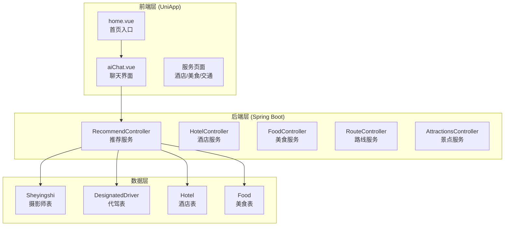
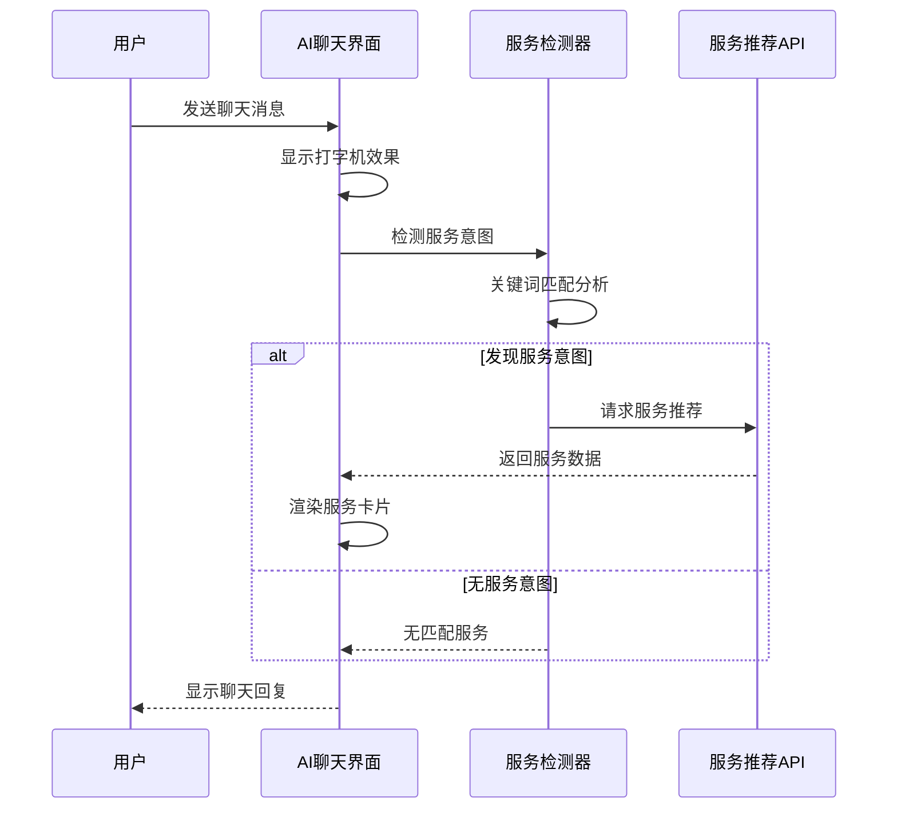
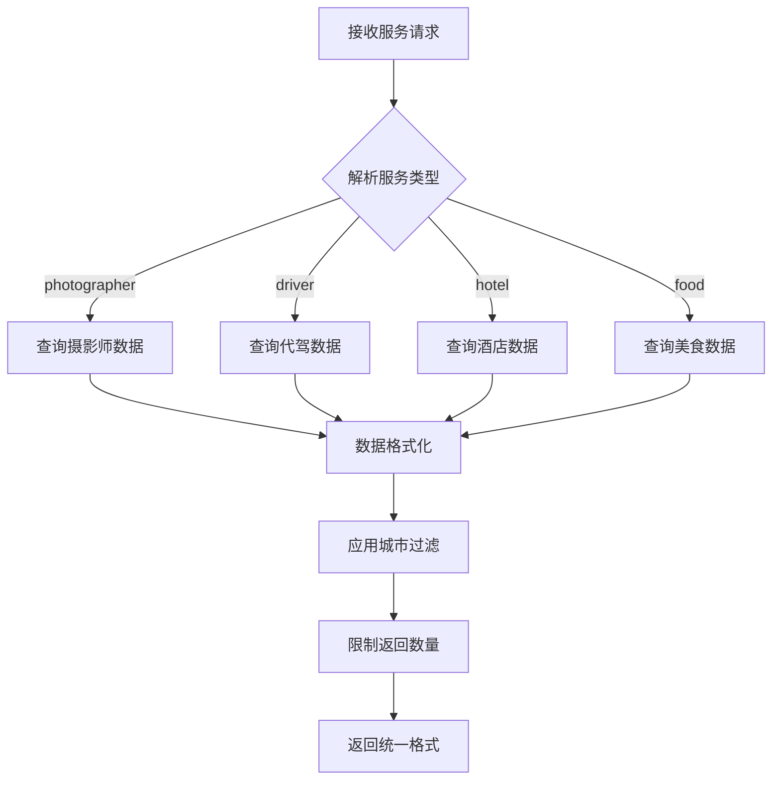
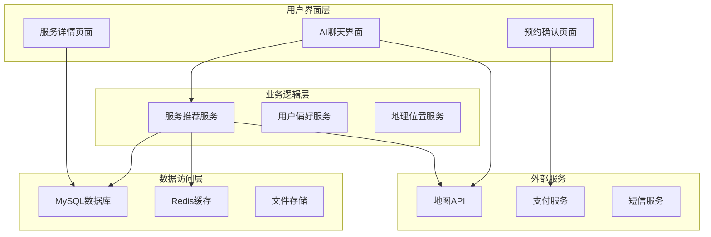
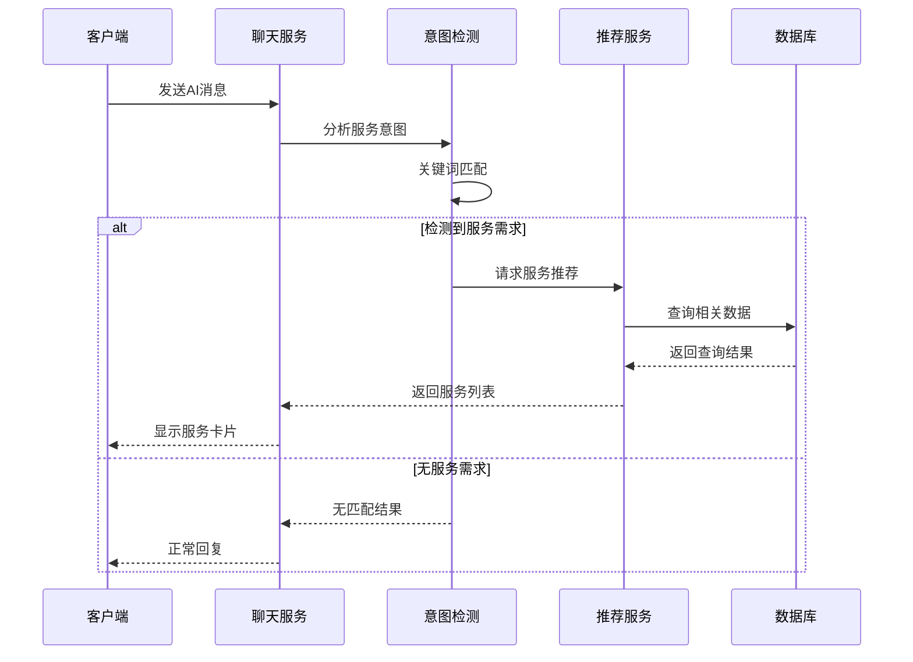
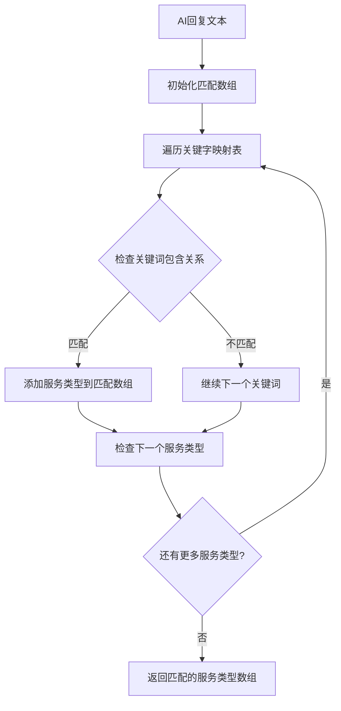
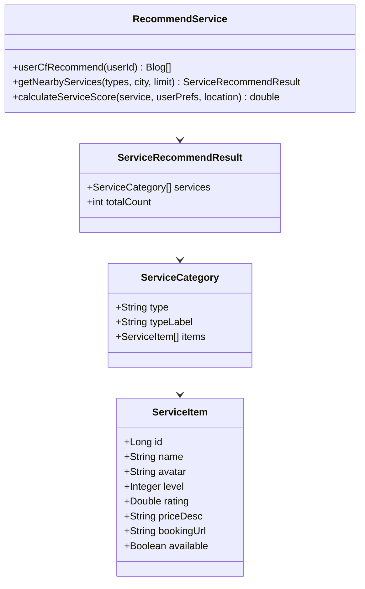
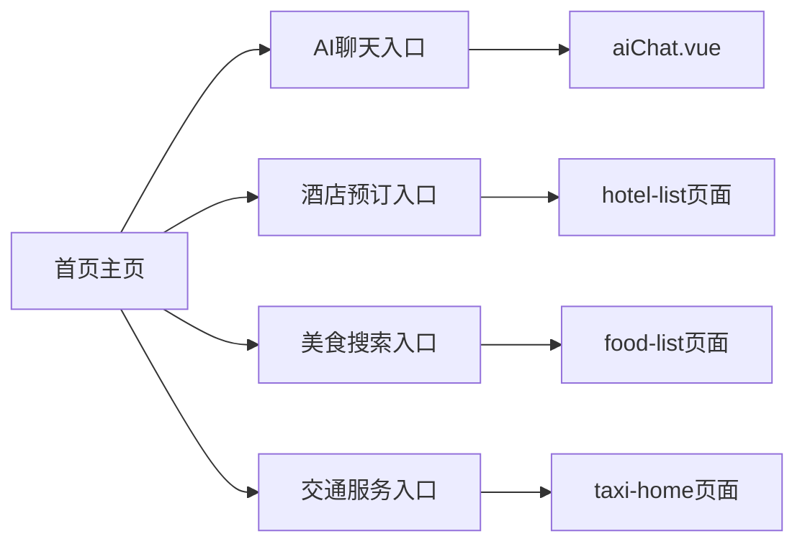
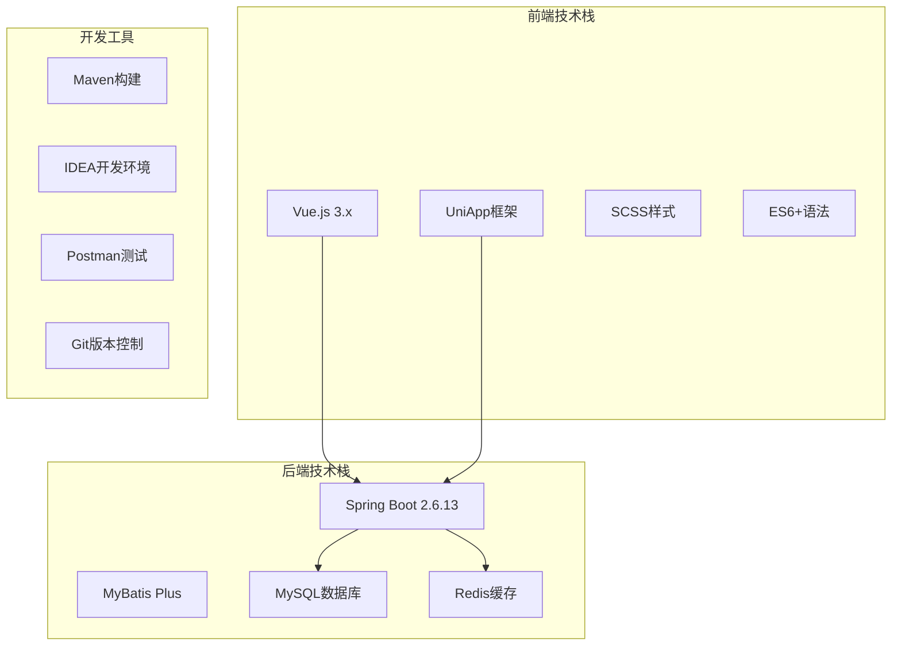
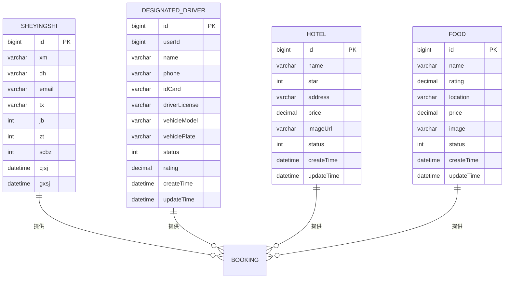

# 方案⑤ 周边服务直连

<cite>
**本文档引用的文件**
- [方案⑤-周边服务直连.md](file://方案⑤-周边服务直连.md)
- [aiChat.vue](file://uniapp-travel-social/homePages/aiChat/aiChat.vue)
- [RecommendController.java](file://springboot-travel-social/src/main/java/com/cxx/controller/RecommendController.java)
- [RecommendServiceImpl.java](file://springboot-travel-social/src/main/java/com/cxx/service/impl/RecommendServiceImpl.java)
- [Sheyingshi.java](file://springboot-travel-social/src/main/java/com/cxx/entity/Sheyingshi.java)
- [DesignatedDriver.java](file://springboot-travel-social/src/main/java/com/cxx/entity/DesignatedDriver.java)
- [HotelController.java](file://springboot-travel-social/src/main/java/com/cxx/controller/HotelController.java)
- [FoodController.java](file://springboot-travel-social/src/main/java/com/cxx/controller/FoodController.java)
- [RouteController.java](file://springboot-travel-social/src/main/java/com/cxx/controller/RouteController.java)
- [AttractionsController.java](file://springboot-travel-social/src/main/java/com/cxx/controller/AttractionsController.java)
- [home.vue](file://uniapp-travel-social/pages/home/home.vue)
</cite>

## 目录
1. [简介](#简介)
2. [项目结构](#项目结构)
3. [核心组件](#核心组件)
4. [架构概览](#架构概览)
5. [详细组件分析](#详细组件分析)
6. [依赖分析](#依赖分析)
7. [性能考虑](#性能考虑)
8. [故障排除指南](#故障排除指南)
9. [结论](#结论)

## 简介

方案⑤"周边服务直连"是旅游攻略社交小程序的重要功能模块，旨在实现从AI智能助手到周边服务的无缝连接。该方案的核心目标是当AI在对话中提及摄影、代驾、打车、酒店等相关内容时，能够自动识别用户意图并提供实时的周边服务推荐。

### 主要功能特性

- **智能意图识别**：通过关键词匹配算法识别AI回复中的服务需求
- **实时服务推荐**：基于用户当前位置和需求，动态推荐周边服务
- **零摩擦跳转**：用户可直接从聊天界面跳转到对应的预约页面
- **多服务类型支持**：涵盖摄影、交通、住宿、餐饮等多个旅游相关服务

### 技术架构优势

- **前后端分离**：前端负责用户交互，后端提供数据服务
- **实时响应**：基于WebSocket的即时通信机制
- **可扩展性**：模块化设计支持新服务类型的快速集成
- **用户体验优化**：流畅的打字机效果和智能推荐

## 项目结构

该项目采用典型的前后端分离架构，主要分为三个层次：

**图表来源**
- [aiChat.vue:1-800](file://uniapp-travel-social/homePages/aiChat/aiChat.vue#L1-L800)
- [home.vue:1-800](file://uniapp-travel-social/pages/home/home.vue#L1-L800)
- [RecommendController.java:1-65](file://springboot-travel-social/src/main/java/com/cxx/controller/RecommendController.java#L1-L65)

**章节来源**
- [方案⑤-周边服务直连.md:1-282](file://方案⑤-周边服务直连.md#L1-L282)

## 核心组件

### 1. AI聊天界面组件

AI聊天界面是整个方案的核心交互层，负责处理用户输入、显示AI回复以及服务推荐卡片。

#### 关键特性
- **打字机效果**：模拟真实的打字过程，提升用户体验
- **智能意图识别**：自动检测AI回复中的服务关键词
- **服务卡片渲染**：动态生成服务推荐卡片
- **实时跳转功能**：支持一键跳转到服务预约页面

#### 数据流处理

**图表来源**
- [aiChat.vue:743-766](file://uniapp-travel-social/homePages/aiChat/aiChat.vue#L743-L766)
- [方案⑤-周边服务直连.md:199-226](file://方案⑤-周边服务直连.md#L199-L226)

### 2. 服务推荐控制器

服务推荐控制器负责处理来自前端的服务请求，整合多个服务类型的数据并返回统一格式的结果。

#### 支持的服务类型
- **摄影师服务**：基于`sheyingshi`表的摄影服务
- **代驾服务**：基于`designated_driver`表的代驾服务
- **酒店服务**：基于`hotel`表的住宿服务
- **美食服务**：基于`food`表的餐饮服务

#### 数据处理流程

**图表来源**
- [RecommendController.java:28-65](file://springboot-travel-social/src/main/java/com/cxx/controller/RecommendController.java#L28-L65)
- [方案⑤-周边服务直连.md:104-163](file://方案⑤-周边服务直连.md#L104-L163)

### 3. 实体模型设计

系统采用标准的实体模型设计，确保数据的一致性和完整性。

#### 摄影师实体模型
| 字段名 | 类型 | 描述 | 约束 |
|--------|------|------|------|
| id | Long | 主键ID | 自增 |
| xm | String | 姓名 | 非空 |
| dh | String | 电话 | 非空 |
| email | String | 邮箱 | 可空 |
| tx | String | 头像URL | 可空 |
| jb | Integer | 级别 (1-3) | 非空 |
| zt | Integer | 状态 (1在岗/0休息) | 非空 |
| scbz | Integer | 删除标记 | 默认0 |
| cjsj | Date | 创建时间 | 非空 |
| gxsj | Date | 更新时间 | 非空 |

#### 代驾司机实体模型
| 字段名 | 类型 | 描述 | 约束 |
|--------|------|------|------|
| id | Long | 主键ID | 自增 |
| userId | Long | 用户ID | 可空 |
| name | String | 姓名 | 非空 |
| phone | String | 电话 | 非空 |
| idCard | String | 身份证号 | 可空 |
| driverLicense | String | 驾驶证号 | 可空 |
| vehicleModel | String | 车辆型号 | 可空 |
| vehiclePlate | String | 车牌号 | 可空 |
| status | Integer | 状态 | 非空 |
| rating | BigDecimal | 评分 | 可空 |
| createTime | Date | 创建时间 | 非空 |
| updateTime | Date | 更新时间 | 非空 |

**章节来源**
- [Sheyingshi.java:1-67](file://springboot-travel-social/src/main/java/com/cxx/entity/Sheyingshi.java#L1-L67)
- [DesignatedDriver.java:1-44](file://springboot-travel-social/src/main/java/com/cxx/entity/DesignatedDriver.java#L1-L44)

## 架构概览

### 整体架构设计

### 数据流架构

**图表来源**
- [方案⑤-周边服务直连.md:13-55](file://方案⑤-周边服务直连.md#L13-L55)

## 详细组件分析

### AI聊天界面组件分析

#### 意图识别算法

系统采用基于关键词匹配的意图识别算法，通过预定义的关键字映射表来识别用户可能需要的服务类型。

**图表来源**
- [方案⑤-周边服务直连.md:199-211](file://方案⑤-周边服务直连.md#L199-L211)

#### 服务卡片渲染机制

服务卡片采用统一的渲染模板，支持不同服务类型的差异化展示：

| 服务类型 | 卡片颜色主题 | 主要信息元素 | 操作按钮 |
|----------|-------------|-------------|---------|
| 摄影师 | 蓝色系 | 头像、姓名、级别、评分、价格 | 立即预约 |
| 代驾 | 绿色系 | 头像、姓名、评分、车型 | 立即预约 |
| 酒店 | 紫色系 | 房间图片、名称、星级、价格 | 查看详情 |
| 美食 | 橙色系 | 菜品图片、名称、评分、人均消费 | 查看详情 |

#### 性能优化策略

1. **防抖机制**：避免频繁触发服务推荐
2. **缓存策略**：缓存热门服务数据
3. **懒加载**：延迟加载服务图片
4. **内存管理**：及时清理不再使用的消息

**章节来源**
- [aiChat.vue:1-800](file://uniapp-travel-social/homePages/aiChat/aiChat.vue#L1-L800)
- [方案⑤-周边服务直连.md:177-266](file://方案⑤-周边服务直连.md#L177-L266)

### 服务推荐系统分析

#### 推荐算法设计

系统采用多维度的服务推荐算法，综合考虑服务质量、用户偏好和地理位置等因素。

**图表来源**
- [RecommendServiceImpl.java:28-64](file://springboot-travel-social/src/main/java/com/cxx/service/impl/RecommendServiceImpl.java#L28-L64)
- [方案⑤-周边服务直连.md:104-163](file://方案⑤-周边服务直连.md#L104-L163)

#### 数据库查询优化

针对不同的服务类型，系统采用优化的查询策略：

1. **摄影师查询**：按在岗状态过滤，支持级别排序
2. **代驾查询**：按可用状态过滤，支持评分排序
3. **酒店查询**：按城市过滤，支持星级和价格排序
4. **美食查询**：按分类和评分过滤

**章节来源**
- [RecommendController.java:28-65](file://springboot-travel-social/src/main/java/com/cxx/controller/RecommendController.java#L28-L65)
- [HotelController.java:27-91](file://springboot-travel-social/src/main/java/com/cxx/controller/HotelController.java#L27-L91)
- [FoodController.java:46-79](file://springboot-travel-social/src/main/java/com/cxx/controller/FoodController.java#L46-L79)

### 前端页面集成分析

#### 首页入口集成

首页提供了多种服务入口，包括AI聊天、酒店预订、美食搜索等：

**图表来源**
- [home.vue:594-623](file://uniapp-travel-social/pages/home/home.vue#L594-L623)

#### 跳转路由设计

系统为不同类型的服务设计了专门的跳转路由：

| 服务类型 | 路由路径 | 参数说明 |
|----------|----------|----------|
| 摄影师 | `/followshootpages/follow-shoot-booking` | `photographerId` |
| 代驾 | `/taxiPages/taxi-order` | 无 |
| 打车 | `/taxiPages/taxi-order` | 无 |
| 酒店 | `/hotelPages/hotel-detail` | `id` |
| 美食 | `/foodPages/food-detail` | `id` |

**章节来源**
- [home.vue:594-623](file://uniapp-travel-social/pages/home/home.vue#L594-L623)
- [方案⑤-周边服务直连.md:273-282](file://方案⑤-周边服务直连.md#L273-L282)

## 依赖分析

### 技术栈依赖关系

### 第三方服务集成

系统集成了多个第三方服务来增强功能：

1. **地图服务**：用于地理位置定位和导航
2. **支付服务**：处理在线预订和支付
3. **短信服务**：发送预约确认和提醒
4. **文件存储**：存储图片和文档

### 数据依赖关系

**图表来源**
- [Sheyingshi.java:1-67](file://springboot-travel-social/src/main/java/com/cxx/entity/Sheyingshi.java#L1-L67)
- [DesignatedDriver.java:1-44](file://springboot-travel-social/src/main/java/com/cxx/entity/DesignatedDriver.java#L1-L44)

**章节来源**
- [方案⑤-周边服务直连.md:59-100](file://方案⑤-周边服务直连.md#L59-L100)

## 性能考虑

### 前端性能优化

1. **虚拟滚动**：对于大量服务数据采用虚拟滚动技术
2. **图片懒加载**：服务卡片中的图片采用懒加载策略
3. **组件缓存**：常用组件进行缓存以减少重复渲染
4. **事件节流**：对高频事件进行节流处理

### 后端性能优化

1. **数据库索引**：为常用查询字段建立合适的索引
2. **查询优化**：使用分页查询避免大数据量查询
3. **缓存策略**：热点数据缓存到Redis中
4. **连接池配置**：合理配置数据库连接池参数

### 网络性能优化

1. **CDN加速**：静态资源通过CDN分发
2. **压缩传输**：启用Gzip压缩减少传输体积
3. **HTTP缓存**：合理设置缓存策略
4. **并发控制**：限制同时发起的请求数量

## 故障排除指南

### 常见问题及解决方案

#### 1. 服务推荐无数据

**问题现象**：AI回复中提及服务但没有显示推荐卡片

**可能原因**：
- 关键词匹配失败
- 服务数据查询异常
- 城市上下文缺失

**解决步骤**：
1. 检查关键词映射表配置
2. 验证数据库连接状态
3. 确认用户位置信息
4. 查看后端日志输出

#### 2. 服务卡片显示异常

**问题现象**：服务卡片样式错乱或内容不完整

**可能原因**：
- 数据格式不正确
- 前端模板渲染错误
- 图片加载失败

**解决步骤**：
1. 检查后端返回的数据格式
2. 验证前端模板结构
3. 测试图片资源可用性
4. 查看浏览器控制台错误

#### 3. 跳转功能失效

**问题现象**：点击服务卡片无法跳转到预约页面

**可能原因**：
- 路由配置错误
- 参数传递问题
- 页面权限限制

**解决步骤**：
1. 检查路由配置文件
2. 验证参数传递逻辑
3. 测试页面访问权限
4. 查看页面生命周期

### 调试工具和技巧

1. **浏览器开发者工具**：监控网络请求和JavaScript错误
2. **后端日志**：查看详细的请求处理过程
3. **数据库监控**：跟踪SQL执行时间和性能
4. **性能分析工具**：识别性能瓶颈和优化机会

**章节来源**
- [方案⑤-周边服务直连.md:258-272](file://方案⑤-周边服务直连.md#L258-L272)

## 结论

方案⑤"周边服务直连"通过智能化的意图识别和实时服务推荐，成功实现了从AI智能助手到周边服务的无缝连接。该方案具有以下显著优势：

### 技术优势
- **智能性**：基于关键词匹配的意图识别算法准确率高
- **实时性**：服务推荐响应速度快，用户体验流畅
- **可扩展性**：模块化设计支持新服务类型的快速集成
- **稳定性**：完善的错误处理和性能优化机制

### 用户体验优势
- **便捷性**：用户无需离开聊天界面即可完成服务预约
- **个性化**：基于用户偏好的智能推荐
- **直观性**：统一的服务卡片设计提升操作效率
- **可靠性**：多重验证机制确保服务质量和安全

### 业务价值
- **提升转化率**：从AI推荐到实际预订的转化路径清晰
- **增强用户粘性**：一站式服务体验提高用户满意度
- **扩大服务范围**：支持多种旅游相关服务类型
- **降低运营成本**：自动化推荐减少人工客服压力

该方案为旅游攻略社交小程序提供了强有力的技术支撑，不仅提升了用户体验，也为平台的商业化运营奠定了坚实基础。通过持续的优化和迭代，相信该方案将在未来的市场竞争中发挥更大的价值。