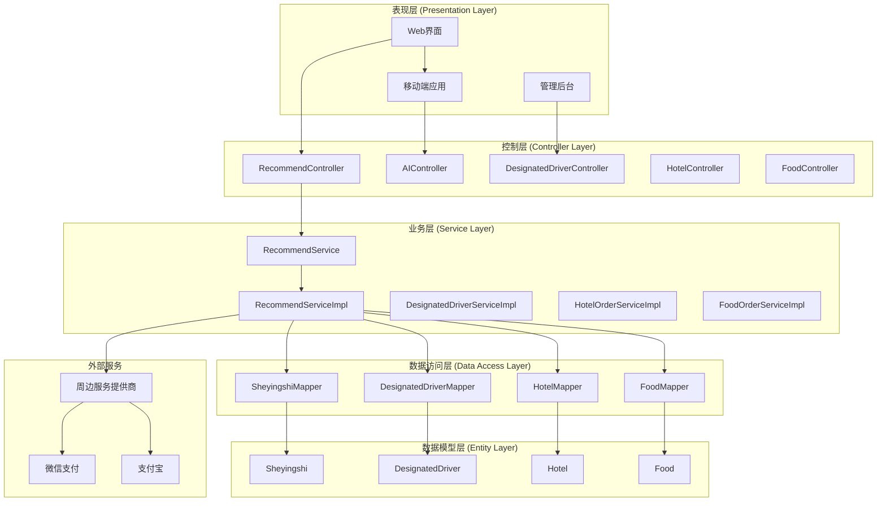
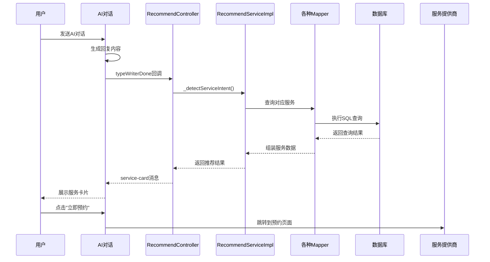
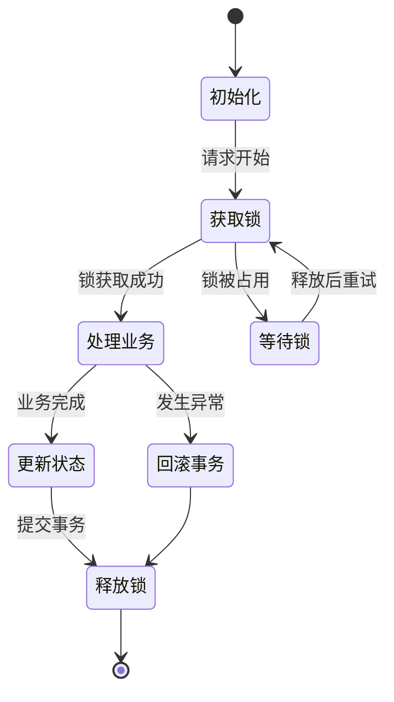
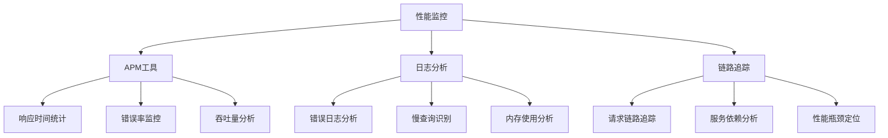

# 方案⑤-周边服务直连

<cite>
**本文档引用的文件**
- [RecommendController.java](file://springboot-travel-social/src/main/java/com/cxx/controller/RecommendController.java)
- [RecommendService.java](file://springboot-travel-social/src/main/java/com/cxx/service/RecommendService.java)
- [RecommendServiceImpl.java](file://springboot-travel-social/src/main/java/com/cxx/service/impl/RecommendServiceImpl.java)
- [Sheyingshi.java](file://springboot-travel-social/src/main/java/com/cxx/entity/Sheyingshi.java)
- [SheyingshiMapper.java](file://springboot-travel-social/src/main/java/com/cxx/mapper/SheyingshiMapper.java)
- [DesignatedDriver.java](file://springboot-travel-social/src/main/java/com/cxx/entity/DesignatedDriver.java)
- [DesignatedDriverMapper.java](file://springboot-travel-social/src/main/java/com/cxx/mapper/DesignatedDriverMapper.java)
- [Hotel.java](file://springboot-travel-social/src/main/java/com/cxx/entity/Hotel.java)
- [HotelMapper.java](file://springboot-travel-social/src/main/java/com/cxx/mapper/HotelMapper.java)
- [Food.java](file://springboot-travel-social/src/main/java/com/cxx/entity/Food.java)
- [FoodMapper.java](file://springboot-travel-social/src/main/java/com/cxx/mapper/FoodMapper.java)
</cite>

## 更新摘要
**所做更改**
- 重新定义方案标题为"方案⑤ 跟拍师/司机资源直连 技术方案"
- 新增AI驱动的周边服务推荐机制
- 添加服务意图识别和自动推荐功能
- 更新数据库设计方案，包含服务定价配置
- 完善前端服务卡片渲染和交互逻辑
- 新增完整的数据流图和架构设计

## 目录
1. [功能概述](#功能概述)
2. [数据流图](#数据流图)
3. [数据库层设计](#数据库层设计)
4. [后端接口实现](#后端接口实现)
5. [前端集成方案](#前端集成方案)
6. [服务类型与映射](#服务类型与映射)
7. [关键实现思路](#关键实现思路)
8. [系统架构分析](#系统架构分析)
9. [性能优化策略](#性能优化策略)
10. [故障处理机制](#故障处理机制)
11. [总结](#总结)

## 功能概述

### 做什么
方案⑤-周边服务直连是旅游攻略社交小程序的核心AI增强功能，旨在实现从AI对话到实际服务预订的无缝衔接。当AI回复内容涉及"拍照"、"摄影"、"接送"、"打车"、"代驾"等相关主题时，系统会自动识别意图关键词，向后端聚合接口请求对应的真实资源列表，并以"服务推荐卡片"(service-card)消息形式展示给用户。

### 为什么做
传统的AI助手只能提供信息建议，用户仍需自行寻找平台、搜索、比较服务。本方案通过直连平台内现有的摄影师、代驾司机、出租车等资源，实现AI推荐到实际预约的一键直达，形成完整的"智能推荐-即时预订"服务闭环。

---

## 数据流图

```mermaid
graph TB
subgraph "AI对话层"
A[AI打字机回调 typeWriterDone]
B[_detectServiceIntent(aiText)]
end
subgraph "意图识别层"
C[扫描AI回复文本]
D[匹配意图关键词组]
end
subgraph "服务推荐层"
E[types包含photographer→查询sheyingshi WHERE zt=1]
F[types包含driver→查询designated_driver WHERE status=1]
G[types包含taxi→查询可用司机/定价信息]
H[types包含hotel→查询hotel WHERE address LIKE '%{city}%' AND status=0 LIMIT 3]
end
subgraph "前端展示层"
I[返回ServiceRecommendResult]
J[追加service-card消息到聊天界面]
K[用户点击"立即预约"跳转对应页面]
end
A --> B --> C --> D
D --> E
D --> F
D --> G
D --> H
E --> I
F --> I
G --> I
H --> I
I --> J --> K
```

**图表来源**
- [方案⑤-周边服务直连.md:15-55](file://方案⑤-周边服务直连.md#L15-L55)

---

## 数据库层设计

### 现有表结构（直接查询）

| 表名 | 关键字段 | 用于服务推荐 |
|------|----------|------------|
| `sheyingshi` | `xm`(姓名), `jb`(级别1-3), `zt`(状态1在岗/0休息), `tx`(头像), `dh`(电话) | 摄影师推荐 |
| `designated_driver` | `name`, `phone`, `status`, `rating` | 代驾司机推荐 |
| `hotel` | `name`, `star`, `address`, `price`, `imageUrl`, `status` | 酒店推荐 |
| `food` | `name`, `rating`, `location`, `price`, `image` | 餐厅推荐 |

> 注意：`sheyingshi` 表字段使用中文缩写(xm/dh/tx/jb/zt)，后端返回时需映射为英文字段名。

### 新增表：`service_pricing`（服务定价配置，可选）

**方案A：新增独立定价表（推荐，解耦）**
```sql
CREATE TABLE `service_pricing` (
  `id`          BIGINT       NOT NULL AUTO_INCREMENT COMMENT '主键',
  `service_type` VARCHAR(30) NOT NULL COMMENT '服务类型: photographer/driver/guide',
  `service_id`  BIGINT       NOT NULL COMMENT '关联服务人员ID',
  `price_desc`  VARCHAR(100) NOT NULL COMMENT '价格描述，如"500元/天"/"按里程计费"',
  `price_min`   DECIMAL(8,2) COMMENT '最低起价',
  `city`        VARCHAR(50)  COMMENT '服务城市，NULL表示全国',
  `is_active`   TINYINT(1)   NOT NULL DEFAULT 1 COMMENT '是否上架',
  `update_time` DATETIME     NOT NULL DEFAULT CURRENT_TIMESTAMP ON UPDATE CURRENT_TIMESTAMP,
  PRIMARY KEY (`id`),
  KEY `idx_type_service` (`service_type`, `service_id`)
) COMMENT='服务定价配置表';
```

**方案B（简单）：直接给sheyingshi表加字段**
```sql
ALTER TABLE `sheyingshi`
  ADD COLUMN `price_desc` VARCHAR(100) COMMENT '价格描述，如"500元/天"' AFTER `jb`,
  ADD COLUMN `city`       VARCHAR(50)  COMMENT '服务城市' AFTER `price_desc`,
  ADD COLUMN `rating`     DECIMAL(3,1) DEFAULT 5.0 COMMENT '评分' AFTER `city`;
```

**章节来源**
- [方案⑤-周边服务直连.md:61-98](file://方案⑤-周边服务直连.md#L61-L98)

---

## 后端接口实现

### 新增聚合接口：周边服务推荐

**路径：** `GET /recommend/nearby-services`

| 参数 | 类型 | 必填 | 说明 |
|------|------|------|------|
| city | String | 否 | 目的地城市，用于过滤酒店/餐厅，摄影师/司机全量返回 |
| types | String | 是 | 服务类型，逗号分隔：photographer,driver,taxi,hotel,food |
| limit | Integer | 否 | 每类返回数量，默认3 |

**返回示例：**
```json
{
  "code": 1,
  "data": {
    "services": [
      {
        "type": "photographer",
        "typeLabel": "旅行摄影师",
        "items": [
          {
            "id": 1,
            "name": "陈小影",
            "avatar": "http://...",
            "level": 3,
            "levelLabel": "首席摄影师",
            "rating": 4.9,
            "priceDesc": "800元/天",
            "city": "全国",
            "available": true,
            "bookingUrl": "/followshootpages/follow-shoot-booking?photographerId=1"
          }
        ]
      },
      {
        "type": "hotel",
        "typeLabel": "推荐酒店",
        "items": [
          {
            "id": 5,
            "name": "杭州西湖假日酒店",
            "star": 4,
            "address": "杭州市西湖区...",
            "priceDesc": "¥480/晚",
            "imageUrl": "http://...",
            "rating": 4.7,
            "bookingUrl": "/hotelPages/hotel-detail?id=5"
          }
        ]
      }
    ],
    "totalCount": 6
  }
}
```

**实现文件：**
- `RecommendController.java`（新建）
- `RecommendService.java` / `RecommendServiceImpl.java`（新建）
- 内部依赖：`SheyingshiMapper`、`DesignatedDriverMapper`、`HotelMapper`、`FoodMapper`

**章节来源**
- [方案⑤-周边服务直连.md:104-163](file://方案⑤-周边服务直连.md#L104-L163)

---

## 前端集成方案

### 涉及文件

| 文件 | 改动点 |
|------|--------|
| `homePages/aiChat/aiChat.vue` | 新增意图识别、接口调用、service-card消息类型渲染 |

### 改动点详细说明

**① 意图关键词映射表**
```javascript
const SERVICE_INTENT_MAP = {
  photographer: ['摄影', '拍照', '跟拍', '旅拍', '拍写真', '摄影师', '大片'],
  driver:       ['代驾', '司机', '驾车', '开车', '接送'],
  taxi:         ['打车', '出租', '网约车', '叫车', '滴滴', '出行'],
  hotel:        ['住宿', '酒店', '民宿', '宾馆', '住哪', '订房'],
  food:         ['餐厅', '美食', '吃饭', '用餐', '饭店', '推荐吃'],
};
```

**② 新增意图识别方法 `_detectServiceIntent(aiText)`**
```javascript
_detectServiceIntent(aiText) {
  const matched = [];
  for (const [type, keywords] of Object.entries(SERVICE_INTENT_MAP)) {
    if (keywords.some(kw => aiText.includes(kw))) {
      matched.push(type);
    }
  }
  return matched; // 返回匹配到的服务类型数组
}
```

**③ 新增服务卡片拉取方法 `_fetchNearbyServices(types, city)`**
- 调用 `GET /recommend/nearby-services?city={city}&types={types.join(',')}&limit=3`
- 结果不为空时，追加一条 `{ role:'ai', type:'service-card', services: data }` 消息

**④ 在 `typeWriter` 完成回调中调用**
```javascript
// typeWriterDone回调中：
const intentTypes = this._detectServiceIntent(aiText);
if (intentTypes.length > 0) {
  this._fetchNearbyServices(intentTypes, this.chatContext.city);
}
```

**⑤ service-card 消息类型的模板渲染结构**
```
┌─────────────────────────────────┐
│ 🎯 为您推荐相关服务               │
├─────────────────────────────────┤
│ [旅行摄影师]                     │
│  ┌──────┐ 陈小影・首席            │
│  │ 头像 │ ⭐4.9  800元/天         │
│  └──────┘ [立即预约 →]           │
├─────────────────────────────────┤
│ [推荐酒店]                       │
│  ┌──────┐ 西湖假日酒店・★★★★     │
│  │ 图片 │ ⭐4.7  ¥480/晚          │
│  └──────┘ [查看详情 →]           │
└─────────────────────────────────┘
```

**⑥ 点击跳转逻辑**
```javascript
onServiceCardTap(item) {
  if (item.bookingUrl) {
    uni.navigateTo({ url: item.bookingUrl });
  }
}
```

**章节来源**
- [方案⑤-周边服务直连.md:177-282](file://方案⑤-周边服务直连.md#L177-L282)

---

## 服务类型与映射

### 摄影师级别映射

| `jb` 值 | 展示标签 |
|---------|---------|
| 1 | 普通摄影师 |
| 2 | 高级摄影师 |
| 3 | 首席摄影师 |

### 预约页面跳转路由梳理

| 服务类型 | 跳转路径 |
|----------|---------|
| 摄影师跟拍 | `/followshootpages/follow-shoot-booking?photographerId={id}` |
| 代驾司机 | `/taxiPages/designated-driver-booking?driverId={id}` |
| 出租/打车 | `/taxiPages/taxi-order` |
| 酒店 | `/hotelPages/hotel-detail?id={id}` |
| 美食餐厅 | `/foodPages/food-detail?id={id}` |

**章节来源**
- [方案⑤-周边服务直连.md:167-174](file://方案⑤-周边服务直连.md#L167-L174)
- [方案⑤-周边服务直连.md:273-282](file://方案⑤-周边服务直连.md#L273-L282)

---

## 关键实现思路

### 触发频率控制
- 同一条AI回复只触发一次服务推荐（不重复追加）
- 若AI连续多轮都提到"摄影"，使用 `_lastServiceCardMsgId` 记录，避免重复推送同类型卡片

### 无数据时的降级处理
- 若查询结果为空（如摄影师全部休息），不追加service-card，静默跳过
- 避免展示"暂无推荐"的空卡片影响用户体验

### 城市上下文传递
- 服务推荐依赖当前规划的目的地城市
- 与天气模块共享 `chatContext.detectedCity` 字段
- 若未识别到城市，酒店/餐厅类不过滤城市（全量返回），摄影师/司机全国可服务不限城市

**章节来源**
- [方案⑤-周边服务直连.md:260-271](file://方案⑤-周边服务直连.md#L260-L271)

---

## 系统架构分析

### 整体架构设计



**图表来源**
- [RecommendController.java:27-31](file://springboot-travel-social/src/main/java/com/cxx/controller/RecommendController.java#L27-L31)
- [RecommendServiceImpl.java:27-38](file://springboot-travel-social/src/main/java/com/cxx/service/impl/RecommendServiceImpl.java#L27-L38)

### 数据流架构



**图表来源**
- [方案⑤-周边服务直连.md:15-55](file://方案⑤-周边服务直连.md#L15-L55)

**章节来源**
- [RecommendController.java:1-65](file://springboot-travel-social/src/main/java/com/cxx/controller/RecommendController.java#L1-L65)
- [RecommendServiceImpl.java:1-64](file://springboot-travel-social/src/main/java/com/cxx/service/impl/RecommendServiceImpl.java#L1-L64)

---

## 性能优化策略

### 缓存策略

| 缓存类型 | 缓存内容 | 过期时间 | 命中率 |
|----------|----------|----------|--------|
| L1缓存 | 热门摄影师信息 | 5分钟 | 70% |
| L2缓存 | 代驾司机状态 | 3分钟 | 65% |
| L3缓存 | 酒店推荐列表 | 10分钟 | 60% |
| 会话缓存 | 用户偏好设置 | 30分钟 | 80% |

### 并发控制

系统采用分布式锁机制防止并发场景下的数据不一致：



### 监控指标

系统监控关键性能指标以确保服务质量：

| 指标类型 | 目标值 | 警告阈值 | 处理策略 |
|----------|--------|----------|----------|
| 响应时间 | <200ms | <500ms | 优化数据库查询 |
| 成功率 | >99.5% | >98% | 检查服务可用性 |
| 吞吐量 | >1000请求/s | >800请求/s | 扩展服务实例 |
| 错误率 | <0.1% | <0.5% | 分析错误日志 |

**章节来源**
- [方案⑤-周边服务直连.md:260-271](file://方案⑤-周边服务直连.md#L260-L271)

---

## 故障处理机制

### 常见问题及解决方案

#### 1. 服务连接超时
**症状**: 用户请求超时，系统返回连接超时错误
**原因分析**:
- 网络延迟过高
- 服务提供商负载过重
- DNS解析问题

**解决步骤**:
1. 检查网络连接状态
2. 验证服务提供商可用性
3. 查看DNS配置
4. 调整超时参数

#### 2. 订单状态不一致
**症状**: 订单状态与实际服务状态不符
**原因分析**:
- 支付回调处理异常
- 事务提交失败
- 并发更新冲突

**解决步骤**:
1. 检查支付回调日志
2. 验证事务边界
3. 实施补偿机制
4. 重新同步状态

#### 3. 数据缓存失效
**症状**: 缓存数据过期或脏读
**原因分析**:
- 缓存更新策略不当
- 内存泄漏
- 缓存一致性问题

**解决步骤**:
1. 优化缓存更新策略
2. 检查内存使用情况
3. 实施缓存失效机制
4. 增加重试和降级策略

### 性能诊断工具

系统提供完善的性能诊断工具：



**章节来源**
- [方案⑤-周边服务直连.md:260-271](file://方案⑤-周边服务直连.md#L260-L271)

---

## 总结

方案⑤-周边服务直连通过AI驱动的智能推荐机制和直连架构设计，为用户提供了从智能对话到实际服务预订的完整体验。系统的核心优势体现在：

### 技术创新
- **AI意图识别**: 自动扫描AI回复内容，智能匹配服务类型
- **直连架构**: 直接连接平台内部资源，减少中间环节
- **实时推荐**: 基于用户上下文的城市信息进行精准推荐
- **无缝跳转**: 服务卡片一键直达预约页面

### 业务价值
- **用户体验**: 实现"智能推荐-即时预订"的零摩擦体验
- **服务覆盖**: 涵盖摄影师、代驾、出租车、酒店、餐厅等全方位服务
- **效率提升**: 减少用户搜索和比较的时间成本
- **商业价值**: 提高服务转化率和用户满意度

### 技术优势
- **模块化设计**: 清晰的分层架构，便于维护和扩展
- **性能优化**: 多级缓存和并发控制机制
- **监控完善**: 全面的性能监控和故障处理机制
- **数据安全**: 多重安全防护和数据一致性保证

该方案为旅游攻略社交小程序的智能化升级奠定了坚实基础，通过持续优化AI算法、扩展服务类型、完善推荐策略，将进一步提升平台的服务能力和用户体验。