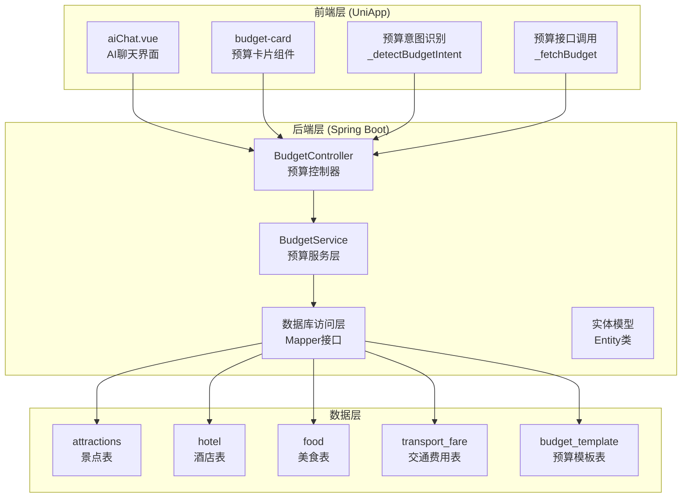
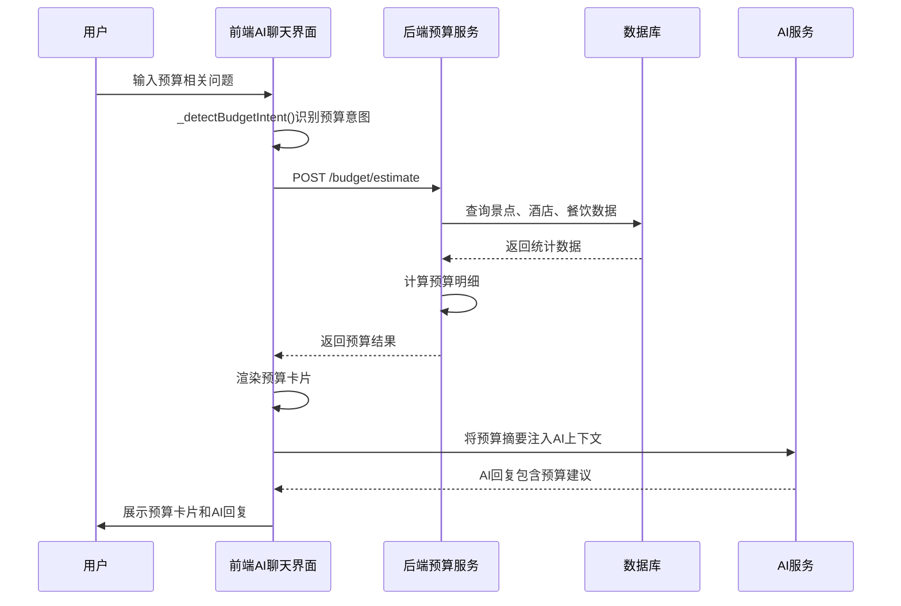
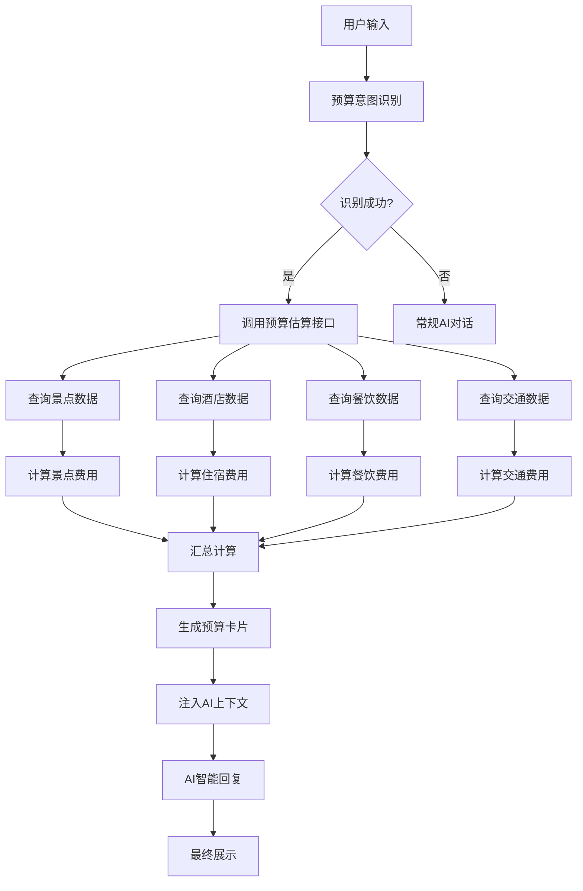
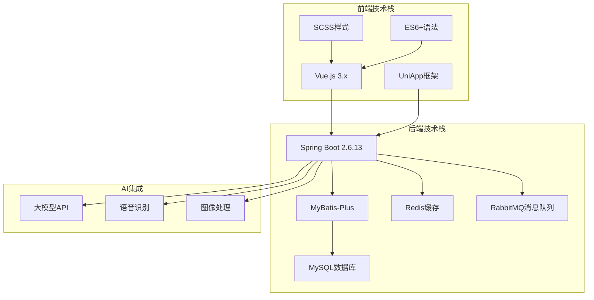

# 方案⑥ 预算智能拆解

<cite>
**本文档引用的文件**
- [方案⑥-预算智能拆解.md](file://方案⑥-预算智能拆解.md)
- [aiChat.vue](file://uniapp-travel-social/homePages/aiChat/aiChat.vue)
- [application.properties](file://springboot-travel-social/src/main/resources/application.properties)
- [Attractions.java](file://springboot-travel-social/src/main/java/com/cxx/entity/Attractions.java)
- [Hotel.java](file://springboot-travel-social/src/main/java/com/cxx/entity/Hotel.java)
- [Food.java](file://springboot-travel-social/src/main/java/com/cxx/entity/Food.java)
- [Itinerary.java](file://springboot-travel-social/src/main/java/com/cxx/entity/Itinerary.java)
- [ItineraryMapper.java](file://springboot-travel-social/src/main/java/com/cxx/mapper/ItineraryMapper.java)
- [ItineraryController.java](file://springboot-travel-social/src/main/java/com/cxx/controller/ItineraryController.java)
- [TravelSocialApplication.java](file://springboot-travel-social/src/main/java/com/cxx/TravelSocialApplication.java)
</cite>

## 目录
1. [简介](#简介)
2. [项目结构](#项目结构)
3. [核心组件](#核心组件)
4. [架构概览](#架构概览)
5. [详细组件分析](#详细组件分析)
6. [依赖关系分析](#依赖关系分析)
7. [性能考虑](#性能考虑)
8. [故障排除指南](#故障排除指南)
9. [结论](#结论)

## 简介

方案⑥"预算智能拆解"是一个基于真实数据的智能预算计算系统。该系统能够自动识别用户对话中的预算需求，从数据库中提取真实的城市景点票价、酒店价格、餐饮均价等数据，计算出精准的分类费用明细，并以可视化预算卡片的形式展示在聊天界面中。

### 主要功能特性

- **智能预算识别**：自动检测用户对话中的预算关键词（如"花多少钱"、"预算"、"费用"等）
- **真实数据驱动**：基于平台数据库中的真实景点票价、酒店价格、餐饮均价进行计算
- **可视化展示**：以预算卡片形式展示分类费用明细，支持动态重算
- **主题化计算**：支持不同旅行主题（情侣、亲子、背包客、奢华）的费用系数
- **实时交互**：支持用户调整人数和天数后的实时重算

## 项目结构

该项目采用前后端分离的架构设计，主要分为三个层次：



**图表来源**
- [方案⑥-预算智能拆解.md](file://方案⑥-预算智能拆解.md)
- [aiChat.vue](file://uniapp-travel-social/homePages/aiChat/aiChat.vue)

**章节来源**
- [方案⑥-预算智能拆解.md](file://方案⑥-预算智能拆解.md)
- [aiChat.vue](file://uniapp-travel-social/homePages/aiChat/aiChat.vue)

## 核心组件

### 前端组件

#### AI聊天界面 (aiChat.vue)
- **预算意图识别**：通过关键词匹配识别用户预算需求
- **预算卡片渲染**：展示分类费用明细和总预算
- **动态交互**：支持用户调整人数和天数后的实时重算
- **上下文集成**：将预算数据注入AI对话上下文中

#### 预算卡片组件
- **分类费用展示**：景点门票、住宿费用、餐饮费用、交通费用、其他杂费
- **可视化条形图**：用CSS实现的费用占比可视化
- **智能重算**：支持原地刷新预算数据

### 后端组件

#### 预算控制器 (BudgetController)
- **预算估算接口**：`POST /budget/estimate`
- **预算重算接口**：`POST /budget/recalculate`
- **参数验证**：校验城市、天数、人数、主题等参数
- **响应封装**：统一返回预算计算结果

#### 预算服务层 (BudgetService)
- **数据聚合**：从多个数据源获取预算相关信息
- **计算逻辑**：实现复杂的预算计算算法
- **模板应用**：根据旅行主题应用相应的费用系数
- **异常处理**：处理数据缺失和计算异常情况

**章节来源**
- [方案⑥-预算智能拆解.md](file://方案⑥-预算智能拆解.md)
- [aiChat.vue](file://uniapp-travel-social/homePages/aiChat/aiChat.vue)

## 架构概览

系统采用分层架构设计，确保了良好的可维护性和扩展性：



**图表来源**
- [方案⑥-预算智能拆解.md](file://方案⑥-预算智能拆解.md)
- [aiChat.vue](file://uniapp-travel-social/homePages/aiChat/aiChat.vue)

### 数据流架构



**图表来源**
- [方案⑥-预算智能拆解.md](file://方案⑥-预算智能拆解.md)

## 详细组件分析

### 前端预算意图识别组件

#### 关键实现要点

**预算关键词识别**
- 触发关键词：预算、花多少钱、费用、多少钱、要花、报价、价格、贵不贵、便宜吗
- 城市识别：复用天气模块的城市识别逻辑
- 时间识别：正则表达式匹配天数（(\d+)[天日]）
- 人数识别：正则表达式匹配人数（(\d+)[人口]），默认2人

**预算数据获取流程**
```javascript
async _fetchBudget(city, days, persons, theme) {
    try {
        const response = await uni.request({
            url: 'http://localhost:8082/budget/estimate',
            method: 'POST',
            data: { city, days, persons, theme }
        });
        
        if (response.statusCode === 200 && response.data.code === 1) {
            return response.data.data;
        }
    } catch (error) {
        console.error('预算数据获取失败:', error);
    }
}
```

**预算卡片渲染组件**
- **标题行**：显示城市、天数、人数信息
- **费用明细**：景点门票、住宿费用、餐饮费用、交通费用、其他杂费
- **可视化条形图**：使用CSS实现的费用占比可视化
- **智能重算**：支持用户调整参数后的实时计算

**章节来源**
- [方案⑥-预算智能拆解.md](file://方案⑥-预算智能拆解.md)
- [aiChat.vue](file://uniapp-travel-social/homePages/aiChat/aiChat.vue)

### 后端预算计算服务

#### 数据模型设计

**景点实体 (Attractions)**
- `province`: 景点所在省份
- `name`: 景点名称
- `price`: 景点价格（VARCHAR类型，可能包含"免费"、"45元"等文本）
- `rate`: 景点评分

**酒店实体 (Hotel)**
- `address`: 酒店地址
- `price`: 酒店价格（BigDecimal类型）
- `star`: 酒店星级（1-5）

**美食实体 (Food)**
- `location`: 美食所在位置
- `price`: 美食价格（BigDecimal类型）
- `rating`: 美食评分

#### 预算计算算法

**景点费用计算**
1. 查询指定城市的景点数据（按省份匹配）
2. 解析price字段（正则提取数字，"免费"计0）
3. 取前5个主要景点进行计算
4. 应用主题系数（ticket_factor）

**住宿费用计算**
1. 查询指定城市的酒店数据（按地址模糊匹配）
2. 按星级过滤（情侣主题取3星均价）
3. 计算公式：均价 × (天数-1晚) × hotel_factor

**餐饮费用计算**
1. 查询指定城市的美食数据（按位置匹配）
2. 使用price均值作为参考
3. 最低限制：max(美食均价, 80) × food_factor
4. 计算公式：人均每天 × 天数 × 人数

**交通费用计算**
1. 查询transport_fare表中的参考价格
2. 取对应交通方式价格区间均值 × 人数
3. 支持多种交通方式：flight、train、bus、self-drive

**杂费计算**
- 杂费 = 总预算 × misc_factor
- 不同主题的杂费系数不同

**章节来源**
- [方案⑥-预算智能拆解.md](file://方案⑥-预算智能拆解.md)
- [Attractions.java](file://springboot-travel-social/src/main/java/com/cxx/entity/Attractions.java)
- [Hotel.java](file://springboot-travel-social/src/main/java/com/cxx/entity/Hotel.java)
- [Food.java](file://springboot-travel-social/src/main/java/com/cxx/entity/Food.java)

### 数据库设计

#### 现有表结构

**景点表 (attractions)**
- 主要字段：`id`, `province`, `name`, `price`, `rate`
- 用途：存储景点基本信息和票价

**酒店表 (hotel)**
- 主要字段：`id`, `address`, `price`, `star`
- 用途：存储酒店基本信息和价格

**美食表 (food)**
- 主要字段：`id`, `location`, `price`, `rating`
- 用途：存储美食基本信息和价格

#### 新增表结构

**交通费用参考表 (transport_fare)**
- 主要字段：`city`, `origin`, `type`, `price_min`, `price_max`, `duration`
- 用途：存储城市间的交通费用参考数据

**预算模板表 (budget_template)**
- 主要字段：`theme`, `hotel_factor`, `food_factor`, `ticket_factor`, `misc_factor`
- 用途：存储不同旅行主题的费用系数

**章节来源**
- [方案⑥-预算智能拆解.md](file://方案⑥-预算智能拆解.md)

## 依赖关系分析

### 技术栈依赖



**图表来源**
- [application.properties](file://springboot-travel-social/src/main/resources/application.properties)

### 组件耦合关系

系统的组件之间保持良好的低耦合设计：

**前端组件耦合**
- aiChat.vue与预算服务的耦合通过HTTP接口实现
- 预算卡片组件与AI聊天界面的耦合通过消息类型实现
- 各组件间通过事件机制进行通信

**后端组件耦合**
- 控制器层与服务层通过接口定义进行解耦
- 服务层与数据访问层通过Mapper接口进行解耦
- 实体模型与数据库表结构一一对应

**数据依赖关系**
- 预算计算依赖于景点、酒店、美食、交通等多个数据源
- AI服务依赖于预算数据进行智能回复
- 缓存层提供数据访问优化

**章节来源**
- [application.properties](file://springboot-travel-social/src/main/resources/application.properties)
- [Itinerary.java](file://springboot-travel-social/src/main/java/com/cxx/entity/Itinerary.java)

## 性能考虑

### 前端性能优化

**预算卡片渲染优化**
- 使用虚拟滚动避免大量DOM节点
- 实现懒加载机制，只在需要时渲染预算卡片
- 采用防抖机制，避免频繁的重算请求

**数据缓存策略**
- 缓存最近使用的预算结果
- 实现本地存储，减少重复请求
- 使用CDN加速静态资源加载

### 后端性能优化

**数据库查询优化**
- 为常用查询字段建立索引
- 实现分页查询，避免大数据量扫描
- 使用连接池管理数据库连接

**计算性能优化**
- 实现计算结果缓存
- 使用异步计算处理复杂预算
- 实现批量数据处理

**系统监控**
- 监控API响应时间
- 监控数据库查询性能
- 监控内存使用情况

## 故障排除指南

### 常见问题及解决方案

**预算数据为空**
- 检查城市名称是否正确
- 验证数据库中是否存在该城市的景点、酒店、美食数据
- 实现降级策略，使用全国均值数据

**预算计算异常**
- 检查price字段的数据格式
- 验证正则表达式解析逻辑
- 实现异常捕获和错误处理

**接口调用失败**
- 检查后端服务是否正常运行
- 验证网络连接状态
- 实现重试机制和超时处理

**前端渲染问题**
- 检查CSS样式冲突
- 验证组件生命周期
- 实现错误边界处理

### 调试工具和方法

**前端调试**
- 使用浏览器开发者工具
- 实现控制台日志输出
- 使用Vue DevTools进行组件调试

**后端调试**
- 使用Spring Boot Actuator监控
- 实现详细的日志记录
- 使用数据库客户端工具

**章节来源**
- [方案⑥-预算智能拆解.md](file://方案⑥-预算智能拆解.md)

## 结论

方案⑥"预算智能拆解"通过将真实数据与AI智能相结合，为用户提供了精准、可视化的预算参考。系统具有以下优势：

**技术创新性**
- 将真实数据注入AI对话，提供更准确的预算建议
- 实现智能预算识别和自动计算
- 支持多种旅行主题的个性化预算

**用户体验优化**
- 简洁直观的预算卡片展示
- 实时交互和动态重算功能
- 无缝集成到现有的AI聊天体验中

**技术架构优势**
- 清晰的分层架构设计
- 良好的可扩展性和可维护性
- 完善的错误处理和性能优化

该方案为旅游服务平台提供了智能化的预算管理能力，有助于提升用户决策质量和平台的服务价值。通过持续优化数据质量和算法精度，系统将能够为用户提供更加精准和个性化的预算建议。